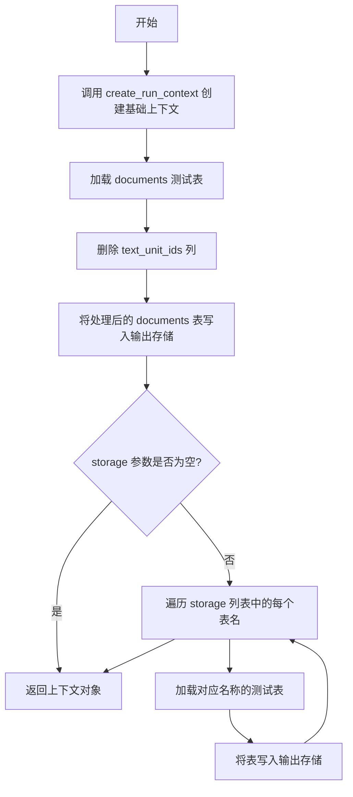
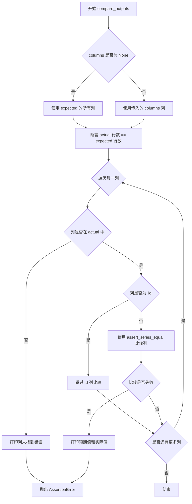

# `graphrag\tests\verbs\util.py` 详细设计文档

该代码文件用于在graphrag索引管道的测试中创建测试上下文、加载测试数据表并比较实际输出与预期输出，主要服务于工作流测试的数据准备和验证环节。

## 整体流程

```mermaid
graph TD
    A[开始] --> B[create_test_context被调用]
    B --> C{storage参数是否为None?}
C -- 是 --> D[仅加载documents表]
C -- 否 --> E[遍历storage列表]
E --> F[load_test_table加载每个表]
F --> G[write_dataframe写入存储]
D --> H[返回context]
G --> H
H --> I[compare_outputs被调用]
I --> J{actual与expected行数相等?}
J -- 否 --> K[抛出AssertionError]
J -- 是 --> L[遍历指定列]
L --> M{列在actual中?}
M -- 否 --> N[打印错误并继续]
M -- 是 --> O{非id列?]
O -- 是 --> P[assert_series_equal比较]
O -- 否 --> Q[跳过id列]
P --> R{比较成功?}
R -- 否 --> S[打印差异并抛出异常]
R -- 是 --> T[继续下一列]
Q --> T
N --> T
T --> U[比较完成]
```

## 类结构

```
该文件为工具模块，无类定义，仅包含全局函数
```

## 全局变量及字段


### `pd`
    
pandas数据分析库模块别名，提供数据处理和分析功能

类型：`module`
    


### `pd.set_option`
    
pandas配置函数，用于设置数据显示选项，将最大列数设置为无限制以显示所有列

类型：`function`
    


    

## 全局函数及方法


### `create_test_context`

创建测试上下文，将测试表数据加载到存储中，用于测试 graphrag 索引管道。

参数：

- `storage`：`list[str] | None`，可选参数，用于指定要额外加载到存储中的表名列表，默认为 None

返回值：`PipelineRunContext`，返回配置好的管道运行上下文对象

#### 流程图



#### 带注释源码

```python
async def create_test_context(storage: list[str] | None = None) -> PipelineRunContext:
    """Create a test context with tables loaded into storage storage."""
    # 1. 创建基础的运行上下文
    context = create_run_context()

    # 2. 加载 documents 测试表（基线数据，始终加载）
    # 但由于存储的表是最终结果，需要删除原始输入中不存在的列
    input = load_test_table("documents")
    input.drop(columns=["text_unit_ids"], inplace=True)
    # 3. 将处理后的 documents 表写入输出表提供者
    await context.output_table_provider.write_dataframe("documents", input)

    # 4. 如果指定了 storage 参数，加载额外的表
    if storage:
        for name in storage:
            # 加载指定名称的测试表
            table = load_test_table(name)
            # 将表写入输出存储
            await context.output_table_provider.write_dataframe(name, table)

    # 5. 返回配置好的上下文对象
    return context
```


### `load_test_table`

该函数是一个全局工具函数，用于根据传入的工作流输出名称（通常为工作流名称）从测试数据目录中读取对应的 Parquet 文件并返回 pandas DataFrame，主要服务于测试场景下的预期数据加载。

参数：

- `output`：`str`，工作流输出名称，通常为工作流名称，用于构造测试数据文件路径

返回值：`pd.DataFrame`，从 Parquet 文件读取的 DataFrame 对象，包含测试所需的预期数据

#### 流程图

```mermaid
flowchart TD
    A[开始] --> B[接收 output 参数]
    B --> C[构建文件路径: tests/verbs/data/{output}.parquet]
    C --> D[使用 pd.read_parquet 读取文件]
    D --> E[返回 DataFrame]
    E --> F[结束]
```

#### 带注释源码

```python
def load_test_table(output: str) -> pd.DataFrame:
    """Pass in the workflow output (generally the workflow name)"""
    # 使用 f-string 动态构建 Parquet 文件路径
    # 路径格式: tests/verbs/data/{output}.parquet
    # 例如: output="documents" -> tests/verbs/data/documents.parquet
    return pd.read_parquet(f"tests/verbs/data/{output}.parquet")
```


### `compare_outputs`

该函数用于比较实际输出与预期输出的 DataFrame，可选择性地指定需要比较的列。它使用 `assert_series_equal` 进行列级别的比较，因为我们有时会故意从实际输出中省略某些列。

参数：

- `actual`：`pd.DataFrame`，实际输出的数据框
- `expected`：`pd.DataFrame`，预期输出的数据框
- `columns`：`list[str] | None`，可选参数，指定需要比较的列名列表，默认为 None（比较所有列）

返回值：`None`，该函数不返回任何值，仅通过断言进行验证，匹配失败时抛出异常

#### 流程图



#### 带注释源码

```python
def compare_outputs(
    actual: pd.DataFrame, expected: pd.DataFrame, columns: list[str] | None = None
) -> None:
    """Compare the actual and expected dataframes, optionally specifying columns to compare.
    This uses assert_series_equal since we are sometimes intentionally omitting columns from the actual output.
    """
    # 确定要比较的列：如果未指定 columns，则使用 expected 的所有列
    cols = expected.columns if columns is None else columns

    # 首先断言行数相等，如果不等则抛出 AssertionError 并显示行数差异
    assert len(actual) == len(expected), (
        f"Expected: {len(expected)} rows, Actual: {len(actual)} rows"
    )

    # 遍历每一列进行详细比较
    for column in cols:
        try:
            # 检查列是否存在于 actual 中
            assert column in actual.columns
        except AssertionError:
            # 如果列不存在，打印错误信息（但继续循环，而非立即终止）
            print(f"Column '{column}' not found in actual output.")
        try:
            # dtypes can differ since the test data is read from parquet and our workflow runs in memory
            # 不检查 id 列，因为 UUID 可能不同
            if column != "id":  # don't check uuids
                # 使用 assert_series_equal 比较列值，忽略 dtype 和 index 的差异
                assert_series_equal(
                    actual[column],
                    expected[column],
                    check_dtype=False,
                    check_index=False,
                )
        except AssertionError:
            # 如果列值不匹配，打印详细信息并重新抛出异常
            print(f"Column '{column}' does not match.")
            print("Expected:")
            print(expected[column])
            print("Actual:")
            print(actual[column])
            raise
```

## 关键组件


### create_test_context

异步测试上下文创建函数，用于初始化 PipelineRunContext 并将测试数据表加载到存储中。该函数接收可选的 storage 参数来指定需要加载的表名，核心功能是确保测试环境与实际工作流运行环境一致，支持文档表和自定义输出表的写入。

### load_test_table

测试数据加载函数，负责从 parquet 文件中读取预存的测试数据。该函数通过指定的 workflow 输出名称构建文件路径，返回 pandas DataFrame 对象，是测试数据准备的核心组件。

### compare_outputs

数据框输出比较函数，提供了灵活的比对机制来验证工作流输出与预期结果的一致性。该函数支持指定列子集的比较，使用 assert_series_equal 进行逐列验证，并特别处理了数据类型差异和 UUID 字段的跳过逻辑。

### PipelineRunContext

测试运行上下文容器，由 create_run_context() 创建并通过 output_table_provider 管理表的读写操作。该上下文是连接测试数据和工作流执行的桥梁，支持异步写入数据框到命名表。

### pd.set_option 配置

pandas 全局配置设置，启用完整列显示以便调试输出。该配置确保在测试失败时能够查看完整的数据框结构。


## 问题及建议


### 已知问题

-   **硬编码文件路径**：`load_test_table` 函数中路径 `"tests/verbs/data/{output}.parquet"` 硬编码，缺乏灵活性和可配置性
-   **全局状态修改**：`pd.set_option("display.max_columns", None)` 在模块级别修改全局 pandas 配置，可能影响其他模块行为
-   **异常处理逻辑混乱**：`compare_outputs` 函数中先 `try` 检查列是否存在，但 `except` 中仅 `print` 而不抛出异常，导致后续代码仍会执行；后续又在 `try` 块中进行数据比较，逻辑嵌套不清晰
-   **缺少异步错误处理**：`create_test_context` 为 async 函数但未包含任何 try-except 错误处理，网络或 IO 操作可能失败
-   **调试代码残留**：使用 `print` 语句输出错误信息而非标准 logging 框架，不利于生产环境日志管理
-   **魔法字符串和假设**：`if column != "id"` 假设 id 列不需要比较，但可能存在其他 uuid 类型的列也需要跳过比较
-   **类型注解不完整**：部分变量如 `input`、`table` 推断类型，缺少显式类型注解
-   **测试数据强耦合**：代码与特定测试数据文件强耦合，测试数据缺失时仅报 parquet 读取错误，缺少友好的错误提示

### 优化建议

-   将文件路径抽取为配置参数或环境变量，支持从外部注入测试数据路径
-   使用 `contextlib` 或在函数结束时恢复 pandas 选项，或将设置移至测试 fixtures
-   重构异常处理逻辑，分离列存在性检查和数据比较，使用 logging 替代 print 输出
-   为 async 函数添加异常处理，捕获可能的 IO/存储异常
-   引入标准 logging 模块，统一日志输出行为
-   将需要跳过的比较列名提取为可选参数，提供更灵活的配置能力
-   完善类型注解，使用显式类型声明提高代码可读性
-   在函数入口添加测试数据文件存在性检查，提供更清晰的错误信息

## 其它


### 设计目标与约束

本模块作为graphrag索引管道的测试工具库，旨在提供标准化的测试上下文创建、数据加载和结果验证能力。设计约束包括：依赖pandas和graphrag-index库；必须支持异步上下文创建；测试数据必须从parquet文件加载；比较函数需容忍特定字段的类型差异。

### 错误处理与异常设计

compare_outputs函数使用try-except捕获AssertionError并打印详细错误信息，包括列名、不匹配的具体值等。关键异常场景包括：列不存在、数据行数不一致、列值不匹配、UUID字段跳过检查。所有断言失败都会重新抛出异常终止测试。

### 外部依赖与接口契约

依赖外部库：pandas（数据处理）、graphrag.index.run.utils（create_run_context）、graphrag.index.typing.context（PipelineRunContext类型）。load_test_table依赖测试数据文件路径"tests/verbs/data/{output}.parquet"，文件不存在时pandas会抛出FileNotFoundError。create_test_context依赖context.output_table_provider的write_dataframe方法。

### 性能考虑

当前实现无明显性能优化，对于大型DataFrame比较可能存在内存开销。compare_outputs逐列比较，可考虑使用向量化操作或pandas的equals方法进行整体比较以提升性能。异步函数create_test_context支持并发调用。

### 并发与异步处理

create_test_context为async函数，支持在异步测试环境中使用。存储表写入操作串行执行（for循环await），如需优化可考虑asyncio.gather并行写入。

### 配置管理

使用pd.set_option("display.max_columns", None)配置pandas显示选项。测试表名称通过参数传入，灵活支持不同工作流输出验证。

### 资源管理

context对象由create_run_context创建，需确保在使用后适当清理（虽然当前示例中未显式关闭）。load_test_table每次调用会打开并读取parquet文件，无缓存机制。

### 版本兼容性

代码注释表明依赖graphrag-index库，版本兼容性需与graphrag 2024年版本匹配。pd.read_parquet和pandas.testing.assert_series_equal的API相对稳定。

### 测试覆盖建议

当前模块本身即为测试工具，建议补充：对create_test_context的完整流程测试、load_test_table文件不存在场景测试、compare_outputs各种不匹配场景测试、异步并发调用压力测试。


    