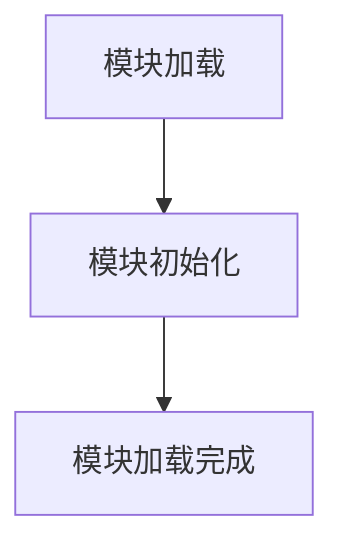

# `graphrag\unified-search-app\app\__init__.py` 详细设计文档

这是一个空的应用程序模块文件，仅包含版权声明和模块级别的文档字符串，作为项目的占位模块存在，不包含任何实际的业务逻辑、类定义或函数实现。

## 整体流程



## 类结构

```

```

## 全局变量及字段


    

## 全局函数及方法


## 关键组件


## 代码概述

该代码文件为一个空的占位模块，仅包含版权声明和模块文档字符串，未实现任何实际功能。

## 文件运行流程

由于代码仅包含模块声明，无实际逻辑执行，文件加载时仅进行基本的模块导入和文档字符串初始化。

## 类信息

无类定义。

## 全局变量与函数

无全局变量或函数定义。

## 关键组件信息

由于源代码中未包含任何实现代码，无法识别具体的技术组件（如张量索引、惰性加载、反量化支持、量化策略等）。

## 潜在技术债务或优化空间

1. **空模块占位符**：该文件目前无实际功能，需补充实现逻辑
2. **缺少模块接口定义**：应明确模块的导出接口和功能边界

## 其他项目

- **设计目标与约束**：代码未提供足够信息确定设计目标
- **错误处理与异常设计**：无实现代码可供分析
- **数据流与状态机**：无实现代码可供分析
- **外部依赖与接口契约**：无实现代码可供分析


## 问题及建议


### 已知问题

-   **模块内容为空**：当前模块仅包含版权声明和简单的文档字符串，没有任何实际功能实现，属于占位符代码
-   **文档不完整**：模块文档字符串仅说明是"App module"，未描述模块的具体功能、用途或公共API
-   **缺少版本信息**：未定义__version__变量来标识模块版本
-   **无公共接口**：未导出任何类、函数或常量，模块无法被其他模块导入使用
-   **缺少类型注解和类型检查**：没有类型提示信息，降低了代码的可维护性和IDE支持
-   **缺少测试覆盖**：没有任何测试文件，无法验证模块功能
-   **缺乏项目结构**：无法判断是否为独立模块还是包的一部分，缺少__init__.py等配置文件

### 优化建议

-   **明确模块职责**：在docstring中详细描述模块的功能定位和核心职责
-   **添加版本信息**：添加__version__ = "1.0.0"等版本标识
-   **实现核心功能**：根据项目需求添加相应的类、函数或常量定义
-   **完善文档注释**：为所有公共API添加详细的docstring文档
-   **添加类型注解**：使用Python类型提示提升代码可读性和可维护性
-   **创建测试文件**：添加test_app.py等测试代码确保功能正确性
-   **配置项目结构**：如为包结构需添加__init__.py并合理组织模块导出
-   **添加依赖声明**：如需外部依赖应在docstring或单独文件中说明


## 其它


### 设计目标与约束

本模块作为应用程序的入口模块，负责组织应用程序的整体结构。设计目标包括：提供清晰的模块划分、遵循MIT开源许可协议、确保代码的可维护性和可扩展性。约束条件为使用Python语言开发，兼容Python 3.x版本。

### 错误处理与异常设计

当前模块未定义具体的异常类，建议后续扩展时定义模块专属的异常体系，如AppError基类及其子类，用于处理模块级别的错误情况。异常设计应遵循Python社区惯例，继承自内置Exception类。

### 数据流与状态机

由于当前模块仅为占位符，未定义具体的数据流和状态机逻辑。后续实现时应明确数据的输入来源、处理流程和输出目标，并定义模块的初始化、运行和终止状态。

### 外部依赖与接口契约

当前模块无外部依赖。未来扩展时应明确声明所有第三方依赖，建议使用requirements.txt或pyproject.toml进行依赖管理。模块应提供清晰的公共接口（__all__列表），明确导出哪些函数和类供外部使用。

### 配置与参数设计

建议在模块中或单独的配置文件中定义应用程序的默认配置参数，包括日志级别、超时设置、端口号等。配置应支持环境变量覆盖，遵循十二要素应用原则。

### 安全性考虑

当前模块无敏感操作。后续实现时应注意：避免硬编码敏感信息（如密码、密钥），使用环境变量或密钥管理服务；遵循最小权限原则；对外接口进行输入验证；敏感数据加密存储和传输。

### 性能考量

当前为轻量级模块，无性能瓶颈。后续扩展时应注意：避免不必要的计算和循环；合理使用缓存；对于IO密集型操作考虑异步处理；注意内存使用效率。

### 兼容性设计

本模块基于Python 3.x开发，遵循MIT开源许可。兼容性设计应考虑：Python版本兼容性（建议支持Python 3.8+）；操作系统兼容性（Windows、Linux、macOS）；第三方库版本的兼容性约束。

### 测试策略

建议为模块编写单元测试和集成测试。使用pytest框架，测试覆盖率应达到合理水平。测试应覆盖正常流程和异常流程，包括边界条件测试。

### 部署与运维

当前模块为应用入口模块。部署时应考虑：依赖的安装方式（pip、conda等）；环境配置管理；日志输出位置和格式；健康检查接口（如需要）；容器化部署支持（Dockerfile）。

### 版本演化

建议遵循语义化版本号（Semantic Versioning）。当前版本为0.x.y，表明仍处于早期开发阶段。重大变更应升级主版本号，向后兼容的功能添加升级次版本号，bug修复升级修订号。

### 术语表

- MIT License：麻省理工学院开源许可证，一种宽松的开源许可证
- 模块（Module）：Python代码组织的基本单元，以.py文件形式存在
- 公共接口（Public API）：模块对外暴露的函数、类和变量，供其他模块调用


    