# `graphrag\unified-search-app\app\app_logic.py` 详细设计文档

这是GraphRAG应用的逻辑核心模块，提供基于Streamlit的Web界面后端逻辑，包括数据集初始化与加载、四种搜索模式（本地搜索、全局搜索、漂移搜索、基本搜索）的执行、以及知识模型的加载与管理功能。

## 整体流程

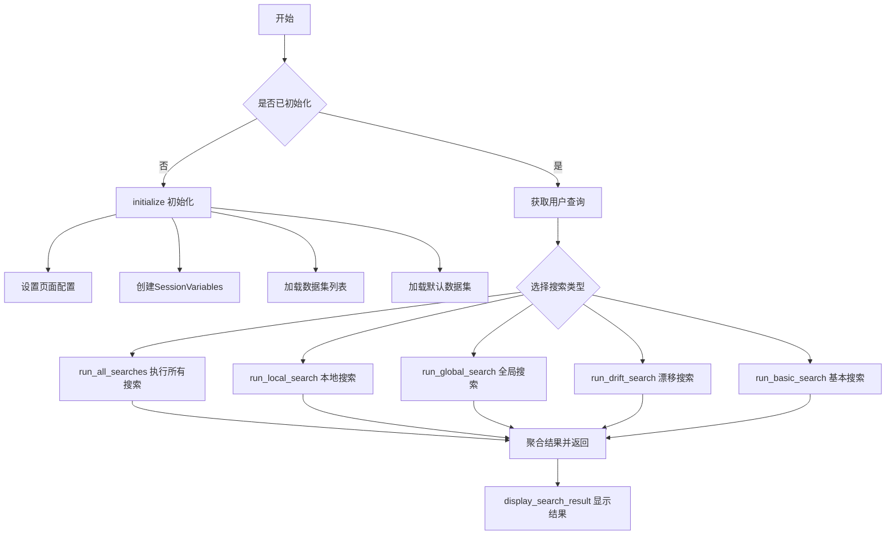

## 类结构

```
app_logic (模块)
├── initialize (初始化函数)
├── load_dataset (数据集加载)
├── dataset_name (数据集名称查询)
├── run_all_searches (并发执行所有搜索)
├── run_generate_questions (问题生成)
├── run_global_search_question_generation (全局搜索问题生成)
├── run_local_search (本地搜索)
├── run_global_search (全局搜索)
├── run_drift_search (漂移搜索)
├── run_basic_search (基本搜索)
└── load_knowledge_model (知识模型加载)
```

## 全局变量及字段


### `logger`
    
模块级日志记录器，用于输出应用运行时的日志信息

类型：`logging.Logger`
    


### `loop`
    
异步事件循环，用于执行异步任务

类型：`asyncio.AbstractEventLoop`
    


### `tasks`
    
异步任务列表，包含待执行的搜索协程

类型：`list[Coroutine]`
    


### `datasets`
    
可用数据集列表，从数据源加载的所有数据集项

类型：`list[DatasetListing]`
    


### `sv`
    
会话变量对象，存储当前会话的状态和数据

类型：`SessionVariables`
    


### `model`
    
知识模型对象，包含从数据集加载的实体、关系、社区等数据

类型：`KnowledgeModel`
    


### `response`
    
API搜索响应，包含大语言模型生成的回答

类型：`Any`
    


### `context_data`
    
搜索上下文数据，包含用于生成回答的参考文档和数据

类型：`dict[str, pd.DataFrame]`
    


### `empty_context_data`
    
空上下文数据字典，用于API返回非dict类型时的默认值

类型：`dict[str, pd.DataFrame]`
    


### `response_placeholder`
    
Streamlit响应占位符，用于动态更新搜索结果UI

类型：`streamlit.delta_generator.DeltaGenerator`
    


### `response_container`
    
Streamlit容器对象，用于承载搜索结果的显示

类型：`streamlit.container.Container`
    


### `search_result`
    
搜索结果对象，包含搜索类型、响应文本和上下文数据

类型：`SearchResult`
    


### `SessionVariables.datasets`
    
可用数据集列表，存储所有可用的数据集项

类型：`list[DatasetListing]`
    


### `SessionVariables.dataset`
    
当前选中的数据集键值，用于标识当前使用的数据集

类型：`str`
    


### `SessionVariables.dataset_config`
    
当前数据集的配置对象，包含数据集的路径和元数据

类型：`DatasetConfig`
    


### `SessionVariables.datasource`
    
数据源实例，用于读取数据集文件和相关配置

类型：`DataSource`
    


### `SessionVariables.graphrag_config`
    
GraphRAG配置字典，包含搜索和处理的各项参数设置

类型：`dict`
    


### `SessionVariables.entities`
    
实体列表，从知识模型中加载的图谱实体数据

类型：`list[Any]`
    


### `SessionVariables.relationships`
    
关系列表，从知识模型中加载的图谱关系数据

类型：`list[Any]`
    


### `SessionVariables.covariates`
    
协变量列表，从知识模型中加载的协变量数据

类型：`list[Any]`
    


### `SessionVariables.community_reports`
    
社区报告列表，从知识模型中加载的社区报告数据

类型：`list[Any]`
    


### `SessionVariables.communities`
    
社区列表，从知识模型中加载的图谱社区数据

类型：`list[Any]`
    


### `SessionVariables.text_units`
    
文本单元列表，从知识模型中加载的文本块数据

类型：`list[Any]`
    


### `SessionVariables.generated_questions`
    
生成的问题列表，存储系统自动生成的问题

类型：`list[str]`
    


### `SessionVariables.selected_question`
    
当前选中的问题，用于追踪用户选择的问题

类型：`str`
    


### `SessionVariables.include_drift_search`
    
漂移搜索开关，控制是否启用drift搜索模式

类型：`bool`
    


### `SessionVariables.include_basic_rag`
    
基础RAG开关，控制是否启用基础搜索模式

类型：`bool`
    


### `SessionVariables.include_local_search`
    
本地搜索开关，控制是否启用本地搜索模式

类型：`bool`
    


### `SessionVariables.include_global_search`
    
全局搜索开关，控制是否启用全局搜索模式

类型：`bool`
    


### `SearchResult.search_type`
    
搜索类型枚举，标识当前搜索结果的类型

类型：`SearchType`
    


### `SearchResult.response`
    
搜索响应文本，包含大语言模型生成的回答字符串

类型：`str`
    


### `SearchResult.context`
    
搜索上下文字典，存储用于生成回答的参考数据

类型：`dict[str, pd.DataFrame]`
    
    

## 全局函数及方法


### `initialize`

该函数是应用逻辑的初始化入口，用于配置页面设置、加载数据集列表、创建会话变量，并在会话状态中持久化保存，供后续模块使用。

参数：无

返回值：`SessionVariables`，返回当前会话的会话变量对象，包含数据集、实体、关系等配置信息。

#### 流程图

```mermaid
flowchart TD
    A([开始 initialize]) --> B{ session_variables 是否存在于<br/>st.session_state?}
    B -->|是| C[返回已有的 session_variables]
    B -->|否| D[调用 st.set_page_config 配置页面]
    D --> E[创建新的 SessionVariables 对象]
    E --> F[调用 load_dataset_listing 获取数据集列表]
    F --> G[设置 sv.datasets.value = datasets]
    G --> H{ query_params 中是否包含<br/>dataset 参数?}
    H -->|是| I[使用 st.query_params[dataset] 的值<br/>并转为小写]
    H -->|否| J[使用 datasets[0].key]
    I --> K[调用 load_dataset 加载数据集]
    J --> K
    K --> L[将 sv 保存到 st.session_state]
    L --> C
    C --> M([结束: 返回 SessionVariables])
```

#### 带注释源码

```python
def initialize() -> SessionVariables:
    """Initialize app logic."""
    # 检查会话状态中是否已存在 session_variables
    if "session_variables" not in st.session_state:
        # 首次初始化：设置页面配置
        st.set_page_config(
            layout="wide",
            initial_sidebar_state="collapsed",
            page_title="GraphRAG",
        )
        # 创建新的会话变量对象
        sv = SessionVariables()
        # 从数据源加载数据集列表
        datasets = load_dataset_listing()
        # 将数据集列表存入会话变量
        sv.datasets.value = datasets
        # 确定当前使用的数据集：优先使用 URL 参数，否则使用第一个数据集
        sv.dataset.value = (
            st.query_params["dataset"].lower()
            if "dataset" in st.query_params
            else datasets[0].key
        )
        # 加载选定的数据集到会话变量
        load_dataset(sv.dataset.value, sv)
        # 将会话变量存入 Streamlit 的 session_state 实现持久化
        st.session_state["session_variables"] = sv
    # 返回会话变量（无论是新建的还是已存在的）
    return st.session_state["session_variables"]
```


### `load_dataset`

该函数用于从下拉列表中加载选定的数据集，通过数据集键值获取对应的配置信息，初始化数据源并加载知识模型到会话状态中。

参数：

- `dataset`：`str`，要加载的数据集标识符（key），对应数据集中的唯一键
- `sv`：`SessionVariables`，会话状态变量对象，用于存储当前会话的各种状态信息，包括数据集配置、数据源、图谱配置等

返回值：`None`，该函数直接修改 `sv` 对象的属性值，不返回任何内容

#### 流程图

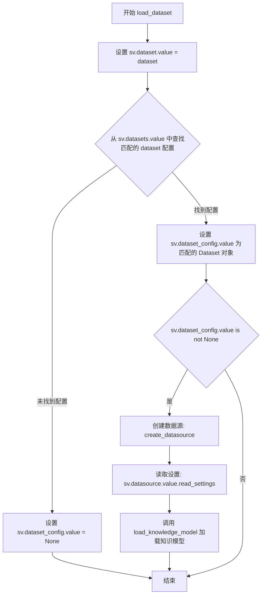

#### 带注释源码

```python
def load_dataset(dataset: str, sv: SessionVariables):
    """Load dataset from the dropdown."""
    # 1. 将选中的数据集键值存储到会话状态中
    sv.dataset.value = dataset
    
    # 2. 从已加载的数据集列表中查找匹配的数据集配置对象
    # 使用 next() 和生成器表达式查找第一个 key 匹配的数据集
    sv.dataset_config.value = next(
        (d for d in sv.datasets.value if d.key == dataset), None
    )
    
    # 3. 判断是否成功找到对应的数据集配置
    if sv.dataset_config.value is not None:
        # 4. 使用数据源路径创建数据源实例
        sv.datasource.value = create_datasource(f"{sv.dataset_config.value.path}")  # type: ignore
        
        # 5. 从数据源中读取 settings.yaml 配置文件并存储图谱配置
        sv.graphrag_config.value = sv.datasource.value.read_settings("settings.yaml")
        
        # 6. 加载知识模型，将实体、关系、社区报告等数据加载到会话状态
        load_knowledge_model(sv)
```


### `dataset_name`

根据给定的数据集键（key）从会话变量中获取对应的数据集名称。

参数：

- `key`：`str`，数据集的唯一标识键，用于在数据集列表中查找对应的数据集
- `sv`：`SessionVariables`，会话变量对象，包含当前应用的所有状态信息，其中 `sv.datasets.value` 存储了所有可用的数据集列表

返回值：`str`，返回匹配数据集的 `name` 字段，如果未找到则返回 `None`（由于使用了 `next()` 和 `None` 作为默认值，但实际代码中直接访问 `.name` 可能会引发 `AttributeError`）

#### 流程图

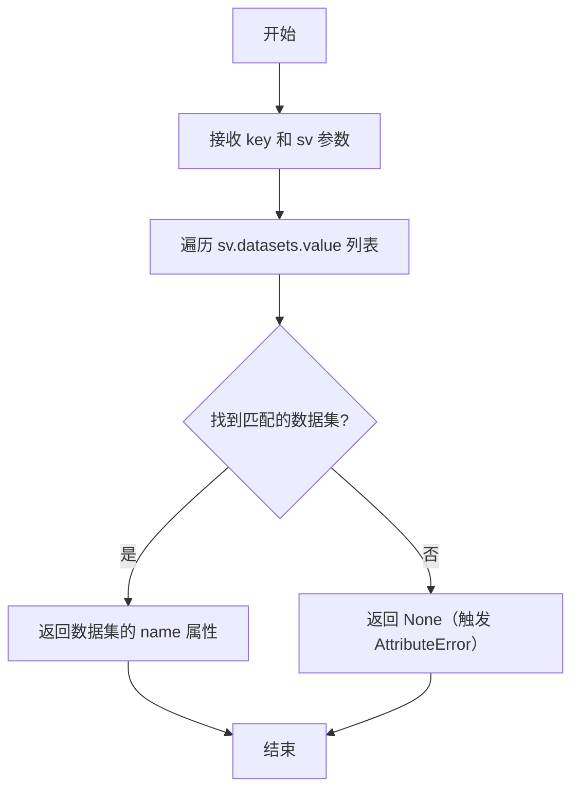

#### 带注释源码

```python
def dataset_name(key: str, sv: SessionVariables) -> str:
    """Get dataset name."""
    # 使用 next() 遍历 sv.datasets.value 列表
    # 查找第一个 d.key 等于传入参数 key 的数据集
    # 如果未找到匹配项，返回 None
    return next((d for d in sv.datasets.value if d.key == key), None).name  # type: ignore
```


### `run_all_searches`

该函数是一个异步函数，用于根据会话变量中启用的搜索类型，并发执行多种搜索（漂移搜索、基本RAG搜索、本地搜索和全局搜索），并汇总所有搜索结果后返回。

参数：

- `query`：`str`，用户输入的搜索查询字符串
- `sv`：`SessionVariables`，会话变量对象，包含搜索配置和各种搜索功能的启用开关

返回值：`list[SearchResult]`，返回所有已完成搜索的结果列表，每个元素为 `SearchResult` 类型

#### 流程图

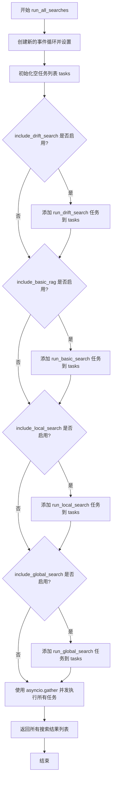

#### 带注释源码

```python
async def run_all_searches(query: str, sv: SessionVariables) -> list[SearchResult]:
    """Run all search engines and return the results."""
    # 创建新的事件循环，用于异步操作
    loop = asyncio.new_event_loop()
    # 将新创建的事件循环设置为当前线程的事件循环
    asyncio.set_event_loop(loop)
    # 初始化任务列表，用于存储待执行的异步搜索任务
    tasks = []
    
    # 检查是否启用漂移搜索（Drift Search），如果是则添加相应任务
    if sv.include_drift_search.value:
        tasks.append(
            run_drift_search(
                query=query,
                sv=sv,
            )
        )

    # 检查是否启用基本RAG搜索，如果是则添加相应任务
    if sv.include_basic_rag.value:
        tasks.append(
            run_basic_search(
                query=query,
                sv=sv,
            )
        )
    
    # 检查是否启用本地搜索，如果是则添加相应任务
    if sv.include_local_search.value:
        tasks.append(
            run_local_search(
                query=query,
                sv=sv,
            )
        )
    
    # 检查是否启用全局搜索，如果是则添加相应任务
    if sv.include_global_search.value:
        tasks.append(
            run_global_search(
                query=query,
                sv=sv,
            )
        )

    # 使用 asyncio.gather 并发执行所有添加的任务，并收集结果
    return await asyncio.gather(*tasks)
```


### `run_generate_questions`

该函数是一个异步函数，用于执行全局搜索以生成与数据集相关的问题。它通过创建异步任务并使用 `asyncio.gather` 并发执行 `run_global_search_question_generation` 任务来获取搜索结果。

参数：

- `query`：`str`，用户输入的查询字符串，用于生成相关问题
- `sv`：`SessionVariables`，会话变量对象，包含图谱配置、数据源、实体、社区等检索所需的数据

返回值：`list[SearchResult]`，包含搜索结果的列表，每个元素为 `SearchResult` 对象，其中包含全局搜索类型、响应文本和上下文数据

#### 流程图

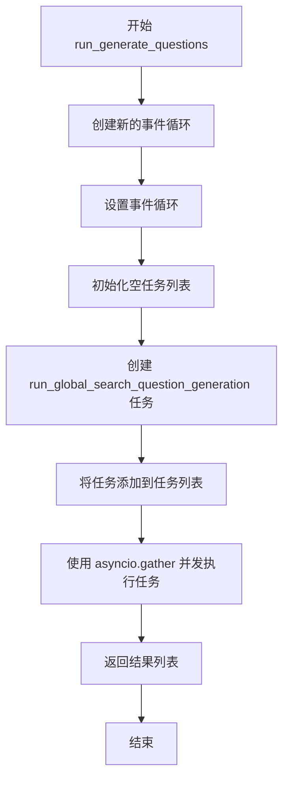

#### 带注释源码

```python
async def run_generate_questions(query: str, sv: SessionVariables):
    """Run global search to generate questions for the dataset."""
    # 创建一个新的异步事件循环，用于执行异步任务
    loop = asyncio.new_event_loop()
    # 将新创建的事件循环设置为当前线程的事件循环
    asyncio.set_event_loop(loop)
    # 初始化一个空的任务列表，用于存储要并发执行的异步任务
    tasks = []

    # 创建一个全局搜索问题生成任务，并添加到任务列表中
    # 该任务接收查询字符串和会话变量作为参数
    tasks.append(
        run_global_search_question_generation(
            query=query,
            sv=sv,
        )
    )

    # 使用 asyncio.gather 并发执行所有任务，并返回结果列表
    # gather 会等待所有任务完成后返回一个包含所有结果的列表
    return await asyncio.gather(*tasks)
```


### `run_global_search_question_generation`

该函数是一个异步函数，用于执行全局搜索以生成与给定查询相关的问题。它通过调用 `api.global_search` 并传入图谱配置、实体、社区和社区报告等参数来获取响应，然后构建包含搜索类型、响应文本和上下文数据的 `SearchResult` 对象返回给调用者。

参数：

- `query`：`str`，用户输入的搜索查询字符串
- `sv`：`SessionVariables`，应用程序的会话状态变量对象，包含图谱配置、实体、社区报告等数据

返回值：`SearchResult`，包含搜索类型（Global）、响应文本和上下文数据的对象

#### 流程图

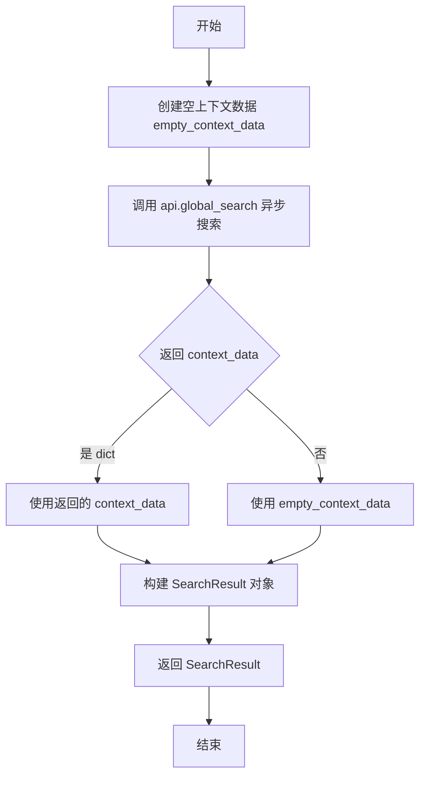

#### 带注释源码

```python
async def run_global_search_question_generation(
    query: str,
    sv: SessionVariables,
) -> SearchResult:
    """Run global search question generation process."""
    # 初始化一个空的上下文数据字典，用于存储DataFrame类型的图谱数据
    empty_context_data: dict[str, pd.DataFrame] = {}

    # 调用图谱API的全局搜索功能，传入配置和查询参数
    # dynamic_community_selection=True 表示动态选择社区
    # response_type="Single paragraph" 表示返回单一段落格式的响应
    response, context_data = await api.global_search(
        config=sv.graphrag_config.value,           # 图谱配置文件
        entities=sv.entities.value,                # 实体列表
        communities=sv.communities.value,          # 社区列表
        community_reports=sv.community_reports.value,  # 社区报告
        dynamic_community_selection=True,          # 启用动态社区选择
        response_type="Single paragraph",          # 响应类型为单段落
        community_level=sv.dataset_config.value.community_level,  # 社区级别
        query=query,                                # 用户查询字符串
    )

    # 将响应和上下文数据封装为SearchResult对象返回给UI层
    return SearchResult(
        search_type=SearchType.Global,              # 搜索类型为全局搜索
        response=str(response),                     # 将响应对象转换为字符串
        # 确保context是字典类型，否则使用空字典
        context=context_data if isinstance(context_data, dict) else empty_context_data,
    )
```


### `run_local_search`

该函数是一个异步函数，用于在 GraphRAG 应用中执行本地搜索（Local Search）。它接收用户查询和会话变量，从图数据库中检索相关的实体、社区、文本单元等上下文信息，调用本地搜索 API 生成回答，并将结果渲染到 Streamlit UI 中。

参数：

- `query`：`str`，用户输入的搜索查询字符串
- `sv`：`SessionVariables`，会话变量对象，包含图谱配置、数据集配置、实体、关系、社区报告、文本单元、共变量等数据

返回值：`SearchResult`，包含搜索类型、本地搜索的回答内容以及相关上下文数据（以字典形式存储的 DataFrame）

#### 流程图

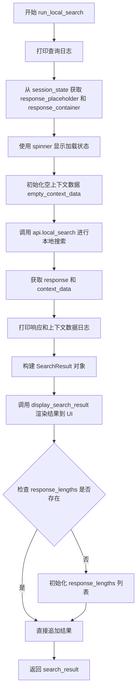

#### 带注释源码

```python
async def run_local_search(
    query: str,
    sv: SessionVariables,
) -> SearchResult:
    """Run local search."""
    # 打印本地搜索查询日志，便于调试
    print(f"Local search query: {query}")  # noqa T201

    # 构建本地搜索引擎，从 session_state 获取 UI 占位符容器
    # 使用 SearchType.Local.value.lower() 构建键名
    response_placeholder = st.session_state[
        f"{SearchType.Local.value.lower()}_response_placeholder"
    ]
    response_container = st.session_state[f"{SearchType.Local.value.lower()}_container"]

    # 使用占位符和 spinner 显示加载状态
    with response_placeholder, st.spinner("Generating answer using local search..."):
        # 初始化空上下文数据字典，键为字符串，值为 pandas DataFrame
        empty_context_data: dict[str, pd.DataFrame] = {}

        # 调用 graphrag API 的本地搜索功能
        # 传入配置、实体、社区、报告、文本单元、关系、共变量等上下文
        response, context_data = await api.local_search(
            config=sv.graphrag_config.value,
            communities=sv.communities.value,
            entities=sv.entities.value,
            community_reports=sv.community_reports.value,
            text_units=sv.text_units.value,
            relationships=sv.relationships.value,
            covariates=sv.covariates.value,
            community_level=sv.dataset_config.value.community_level,
            response_type="Multiple Paragraphs",
            query=query,
        )

        # 打印响应和上下文数据日志
        print(f"Local Response: {response}")  # noqa T201
        print(f"Context data: {context_data}")  # noqa T201

    # 构建搜索结果对象，包含搜索类型、响应内容、上下文数据
    # 如果 context_data 是字典则使用，否则使用空字典
    search_result = SearchResult(
        search_type=SearchType.Local,
        response=str(response),
        context=context_data if isinstance(context_data, dict) else empty_context_data,
    )

    # 调用 UI 显示函数将搜索结果渲染到指定容器中
    display_search_result(
        container=response_container, result=search_result, stats=None
    )

    # 初始化或追加响应长度统计到 session_state
    if "response_lengths" not in st.session_state:
        st.session_state.response_lengths = []

    st.session_state["response_lengths"].append({
        "result": search_result,
        "search": SearchType.Local.value.lower(),
    })

    return search_result
```


### `run_global_search`

执行全局搜索操作，通过调用 GraphRAG API 获取全局搜索结果，并将响应和上下文数据展示到 Streamlit UI 中。

参数：

- `query`：`str`，用户输入的搜索查询字符串
- `sv`：`SessionVariables`，包含会话状态和配置数据的对象

返回值：`SearchResult`，包含搜索类型、响应文本和上下文数据的对象

#### 流程图

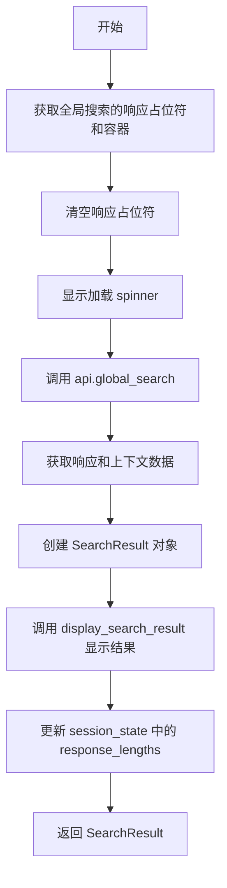

#### 带注释源码

```python
async def run_global_search(query: str, sv: SessionVariables) -> SearchResult:
    """Run global search."""
    # 打印查询日志
    print(f"Global search query: {query}")  # noqa T201

    # 从会话状态中获取全局搜索的响应占位符和容器
    response_placeholder = st.session_state[
        f"{SearchType.Global.value.lower()}_response_placeholder"
    ]
    response_container = st.session_state[
        f"{SearchType.Global.value.lower()}_container"
    ]

    # 清空响应占位符
    response_placeholder.empty()
    
    # 在占位符内显示加载 spinner
    with response_placeholder, st.spinner("Generating answer using global search..."):
        # 初始化空上下文数据
        empty_context_data: dict[str, pd.DataFrame] = {}

        # 调用 GraphRAG API 执行全局搜索
        response, context_data = await api.global_search(
            config=sv.graphrag_config.value,
            entities=sv.entities.value,
            communities=sv.communities.value,
            community_reports=sv.community_reports.value,
            dynamic_community_selection=False,
            response_type="Multiple Paragraphs",
            community_level=sv.dataset_config.value.community_level,
            query=query,
        )

        # 打印上下文数据和响应日志
        print(f"Context data: {context_data}")  # noqa T201
        print(f"Global Response: {response}")  # noqa T201

    # 构建搜索结果对象
    search_result = SearchResult(
        search_type=SearchType.Global,
        response=str(response),
        context=context_data if isinstance(context_data, dict) else empty_context_data,
    )

    # 将搜索结果显示到 UI
    display_search_result(
        container=response_container, result=search_result, stats=None
    )

    # 初始化或追加响应长度记录
    if "response_lengths" not in st.session_state:
        st.session_state.response_lengths = []

    st.session_state["response_lengths"].append({
        "result": search_result,
        "search": SearchType.Global.value.lower(),
    })

    return search_result
```


### `run_drift_search`

执行漂移搜索（Drift Search），该搜索类型通过遍历社区和实体来提供更广泛的搜索结果，适用于需要探索性、多角度答案的场景。

参数：

- `query`：`str`，用户输入的查询字符串
- `sv`：`SessionVariables`，会话变量对象，包含搜索所需的配置和数据

返回值：`SearchResult`，包含搜索类型、响应文本和上下文数据的对象

#### 流程图

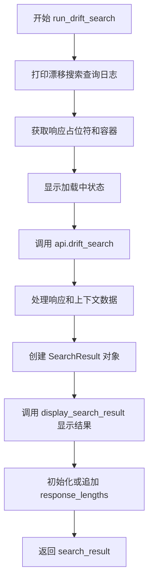

#### 带注释源码

```python
async def run_drift_search(
    query: str,
    sv: SessionVariables,
) -> SearchResult:
    """Run drift search."""
    # 打印漂移搜索查询日志，便于调试
    print(f"Drift search query: {query}")  # noqa T201

    # 从 session_state 中获取漂移搜索的响应占位符和容器
    # 用于后续更新 UI 显示搜索结果
    response_placeholder = st.session_state[
        f"{SearchType.Drift.value.lower()}_response_placeholder"
    ]
    response_container = st.session_state[f"{SearchType.Drift.value.lower()}_container"]

    # 使用占位符和加载 spinner 显示搜索过程
    with response_placeholder, st.spinner("Generating answer using drift search..."):
        # 初始化空上下文数据，用于类型检查
        empty_context_data: dict[str, pd.DataFrame] = {}

        # 调用 graphrag API 执行漂移搜索
        # 漂移搜索会遍历社区和实体，提供更广泛的搜索结果
        response, context_data = await api.drift_search(
            config=sv.graphrag_config.value,      # 图检索增强配置
            entities=sv.entities.value,            # 实体数据
            communities=sv.communities.value,      # 社区数据
            community_reports=sv.community_reports.value,  # 社区报告
            text_units=sv.text_units.value,        # 文本单元
            relationships=sv.relationships.value,  # 关系数据
            community_level=sv.dataset_config.value.community_level,  # 社区层级
            response_type="Multiple Paragraphs",  # 响应格式
            query=query,                            # 用户查询
        )

        # 打印响应和上下文数据，便于调试
        print(f"Drift Response: {response}")  # noqa T201
        print(f"Context data: {context_data}")  # noqa T201

    # 构建搜索结果对象
    # 将响应转换为字符串，并确保上下文数据是字典类型
    search_result = SearchResult(
        search_type=SearchType.Drift,  # 搜索类型为漂移搜索
        response=str(response),         # 将响应对象转换为字符串
        context=context_data if isinstance(context_data, dict) else empty_context_data,
    )

    # 调用 UI 显示函数，将搜索结果展示到界面上
    display_search_result(
        container=response_container, result=search_result, stats=None
    )

    # 初始化 response_lengths 列表（如果不存在）
    if "response_lengths" not in st.session_state:
        st.session_state.response_lengths = []

    # 记录本次搜索的响应长度信息
    # 注意：此处 result 设为 None，与其他搜索方法不一致
    st.session_state["response_lengths"].append({
        "result": None,
        "search": SearchType.Drift.value.lower(),
    })

    # 返回搜索结果
    return search_result
```


### `run_basic_search`

该函数是基础搜索（Basic RAG）的核心执行方法，接收用户查询和会话状态变量，调用图谱检索增强生成 API 执行基础搜索，将搜索结果封装为 SearchResult 对象并展示到 UI 界面，同时记录搜索结果到会话状态中。

参数：

- `query`：`str`，用户输入的查询字符串
- `sv`：`SessionVariables`，会话状态变量，包含图谱配置、文本单元等搜索所需数据

返回值：`SearchResult`，包含搜索类型、响应文本和上下文数据的搜索结果对象

#### 流程图

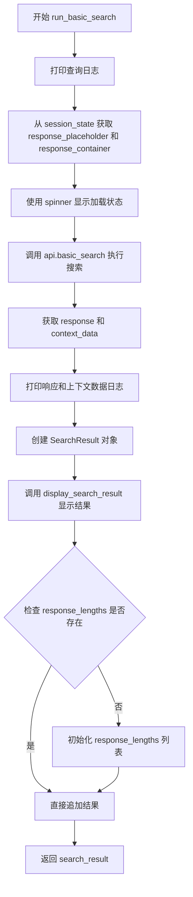

#### 带注释源码

```python
async def run_basic_search(
    query: str,
    sv: SessionVariables,
) -> SearchResult:
    """Run basic search."""
    # 打印查询日志，用于调试
    print(f"Basic search query: {query}")  # noqa T201

    # 从 Streamlit session_state 中获取用于显示响应的占位符和容器
    response_placeholder = st.session_state[
        f"{SearchType.Basic.value.lower()}_response_placeholder"
    ]
    response_container = st.session_state[f"{SearchType.Basic.value.lower()}_container"]

    # 使用 spinner 显示加载状态，提示用户正在生成答案
    with response_placeholder, st.spinner("Generating answer using basic RAG..."):
        # 初始化空上下文数据，用于非字典情况下的默认值
        empty_context_data: dict[str, pd.DataFrame] = {}

        # 调用 graphrag API 执行基础搜索
        response, context_data = await api.basic_search(
            config=sv.graphrag_config.value,  # 图谱配置
            text_units=sv.text_units.value,   # 文本单元数据
            query=query,                      # 用户查询
        )

        # 打印响应和上下文数据日志
        print(f"Basic Response: {response}")  # noqa T201
        print(f"Context data: {context_data}")  # noqa T201

    # 将响应和上下文数据封装为 SearchResult 对象
    search_result = SearchResult(
        search_type=SearchType.Basic,  # 搜索类型为基础搜索
        response=str(response),        # 转换为字符串的响应内容
        # 确保 context 为字典类型，否则使用空字典
        context=context_data if isinstance(context_data, dict) else empty_context_data,
    )

    # 调用 UI 组件显示搜索结果
    display_search_result(
        container=response_container, result=search_result, stats=None
    )

    # 初始化或追加 response_lengths 列表，用于跟踪响应长度
    if "response_lengths" not in st.session_state:
        st.session_state.response_lengths = []

    st.session_state["response_lengths"].append({
        "search": SearchType.Basic.value.lower(),
        "result": search_result,
    })

    # 返回搜索结果
    return search_result
```


### `load_knowledge_model`

该函数负责从数据源加载知识模型，并将模型中的各种实体、关系、社区报告等数据填充到会话变量（SessionVariables）中，以供后续的搜索和问答功能使用。

参数：

- `sv`：`SessionVariables`，会话变量对象，包含数据集配置和用于存储各类知识模型数据的属性

返回值：`SessionVariables`，返回更新后的会话变量对象，其中包含了从数据源加载的知识模型数据

#### 流程图

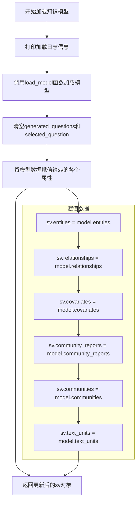

#### 带注释源码

```python
def load_knowledge_model(sv: SessionVariables):
    """Load knowledge model from the datasource.
    
    该函数从数据源加载知识模型，并将模型中的各种数据
    （实体、关系、社区报告、文本单元等）存储到会话变量中。
    
    Args:
        sv: SessionVariables会话变量对象，包含数据集配置和数据存储属性
        
    Returns:
        SessionVariables: 更新后的会话变量对象
    """
    # 打印加载日志，包含数据集名称和配置信息
    print("Loading knowledge model...", sv.dataset.value, sv.dataset_config.value)  # noqa T201
    
    # 调用load_model函数从数据源加载知识模型
    # load_model函数接受数据集名称和数据源对象作为参数
    model = load_model(sv.dataset.value, sv.datasource.value)

    # 重置问答相关状态
    sv.generated_questions.value = []  # 清空生成的问题列表
    sv.selected_question.value = ""    # 重置选中的问题

    # 将模型中的各种数据赋值给会话变量的各个属性
    sv.entities.value = model.entities              # 实体数据
    sv.relationships.value = model.relationships    # 关系数据
    sv.covariates.value = model.covariates          # 协变量数据
    sv.community_reports.value = model.community_reports  # 社区报告
    sv.communities.value = model.communities        # 社区数据
    sv.text_units.value = model.text_units          # 文本单元数据

    # 返回更新后的会话变量对象
    return sv
```


### `run_local_search`

该函数是一个异步函数，用于执行本地搜索（Local Search），通过调用图检索增强生成（GraphRAG）API 获取基于本地知识库的搜索结果，并将结果展示在 Streamlit UI 中，同时记录响应长度到会话状态。

参数：

- `query`：`str`，用户输入的搜索查询字符串
- `sv`：`SessionVariables`，会话变量对象，包含图检索配置、数据集配置、实体、社区、文本单元、关系及协变量等搜索所需数据

返回值：`SearchResult`，包含搜索类型（Local）、响应文本和上下文数据的搜索结果对象

#### 流程图

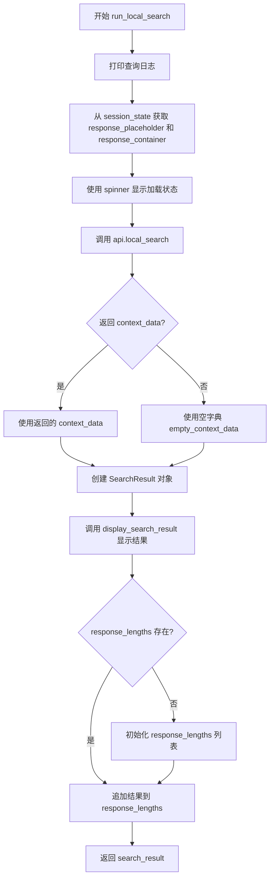

#### 带注释源码

```python
async def run_local_search(
    query: str,
    sv: SessionVariables,
) -> SearchResult:
    """Run local search."""
    # 打印查询日志，便于调试
    print(f"Local search query: {query}")  # noqa T201

    # 从 Streamlit session_state 获取用于显示响应的占位符和容器
    response_placeholder = st.session_state[
        f"{SearchType.Local.value.lower()}_response_placeholder"
    ]
    response_container = st.session_state[f"{SearchType.Local.value.lower()}_container"]

    # 使用占位符和 spinner 显示加载状态
    with response_placeholder, st.spinner("Generating answer using local search..."):
        # 初始化空上下文数据字典
        empty_context_data: dict[str, pd.DataFrame] = {}

        # 调用 GraphRAG API 执行本地搜索
        response, context_data = await api.local_search(
            config=sv.graphrag_config.value,          # 图检索配置
            communities=sv.communities.value,          # 社区数据
            entities=sv.entities.value,                # 实体数据
            community_reports=sv.community_reports.value,  # 社区报告
            text_units=sv.text_units.value,            # 文本单元
            relationships=sv.relationships.value,       # 关系数据
            covariates=sv.covariates.value,            # 协变量数据
            community_level=sv.dataset_config.value.community_level,  # 社区层级
            response_type="Multiple Paragraphs",       # 响应类型
            query=query,                               # 用户查询
        )

        # 打印响应和上下文数据日志
        print(f"Local Response: {response}")  # noqa T201
        print(f"Context data: {context_data}")  # noqa T201

    # 构建搜索结果对象，确保 context_data 是字典类型
    search_result = SearchResult(
        search_type=SearchType.Local,  # 搜索类型为本地搜索
        response=str(response),        # 响应文本
        context=context_data if isinstance(context_data, dict) else empty_context_data,
    )

    # 在 UI 中显示搜索结果
    display_search_result(
        container=response_container, result=search_result, stats=None
    )

    # 初始化或更新 session_state 中的响应长度记录
    if "response_lengths" not in st.session_state:
        st.session_state.response_lengths = []

    st.session_state["response_lengths"].append({
        "result": search_result,
        "search": SearchType.Local.value.lower(),
    })

    # 返回搜索结果
    return search_result
```


### `run_global_search`

执行全局搜索功能，使用 GraphRAG 的全局搜索 API 获取基于整个知识图谱的搜索结果。该函数异步运行，通过 `api.global_search` 调用底层搜索功能，并根据动态社区选择配置返回相应的搜索结果。

参数：

- `query`：`str`，用户输入的搜索查询字符串
- `sv`：`SessionVariables`，会话状态变量，包含图谱配置、实体、社区、文本单元等数据

返回值：`SearchResult`，包含搜索类型（Global）、响应文本和上下文数据的对象

#### 流程图

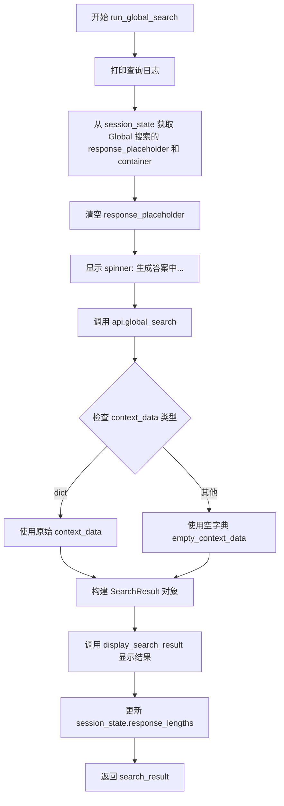

#### 带注释源码

```python
async def run_global_search(query: str, sv: SessionVariables) -> SearchResult:
    """Run global search."""
    # 打印全局搜索查询日志，便于调试
    print(f"Global search query: {query}")  # noqa T201

    # 构建全局搜索引擎
    # 从 session_state 中获取 Global 搜索类型的响应占位符和容器
    response_placeholder = st.session_state[
        f"{SearchType.Global.value.lower()}_response_placeholder"
    ]
    response_container = st.session_state[
        f"{SearchType.Global.value.lower()}_container"
    ]

    # 清空占位符并显示加载动画
    response_placeholder.empty()
    with response_placeholder, st.spinner("Generating answer using global search..."):
        # 初始化空上下文数据，用于类型检查
        empty_context_data: dict[str, pd.DataFrame] = {}

        # 调用 GraphRAG 的全局搜索 API
        # 参数说明：
        # - config: 图谱配置
        # - entities: 实体列表
        # - communities: 社区列表
        # - community_reports: 社区报告
        # - dynamic_community_selection: 是否动态选择社区（False 表示使用所有社区）
        # - response_type: 响应类型（多段落）
        # - community_level: 社区级别
        # - query: 查询字符串
        response, context_data = await api.global_search(
            config=sv.graphrag_config.value,
            entities=sv.entities.value,
            communities=sv.communities.value,
            community_reports=sv.community_reports.value,
            dynamic_community_selection=False,
            response_type="Multiple Paragraphs",
            community_level=sv.dataset_config.value.community_level,
            query=query,
        )

        # 打印上下文数据和响应结果
        print(f"Context data: {context_data}")  # noqa T201
        print(f"Global Response: {response}")  # noqa T201

    # 将响应和参考上下文显示到 UI
    # 构建 SearchResult 对象，确保 context_data 是字典类型
    search_result = SearchResult(
        search_type=SearchType.Global,
        response=str(response),
        context=context_data if isinstance(context_data, dict) else empty_context_data,
    )

    # 调用 UI 显示函数展示搜索结果
    display_search_result(
        container=response_container, result=search_result, stats=None
    )

    # 初始化或追加响应长度统计到 session_state
    if "response_lengths" not in st.session_state:
        st.session_state.response_lengths = []

    st.session_state["response_lengths"].append({
        "result": search_result,
        "search": SearchType.Global.value.lower(),
    })

    return search_result
```


# 设计文档：SearchType.Drift 相关代码分析

## 概述

`SearchType` 是定义在 `rag.typing` 模块中的枚举类型，用于标识不同的搜索方法。其中 `SearchType.Drift` 代表 Drift 搜索（漂移搜索）类型，这是一种图增强的检索增强生成（RAG）方法，允许在知识图谱中进行多跳推理和探索性搜索。

从代码中可以看到，`SearchType` 枚举包含以下成员：
- `SearchType.Local` - 本地搜索
- `SearchType.Global` - 全局搜索  
- `SearchType.Drift` - 漂移搜索
- `SearchType.Basic` - 基本搜索

## 代码中的使用情况

### 1. 枚举导入

```python
from rag.typing import SearchResult, SearchType
```

### 2. SearchType.Drift 在代码中的具体使用

#### 2.1 run_drift_search 函数

```python
async def run_drift_search(
    query: str,
    sv: SessionVariables,
) -> SearchResult:
    """Run drift search."""
    print(f"Drift search query: {query}")  # noqa T201

    # build drift search engine
    response_placeholder = st.session_state[
        f"{SearchType.Drift.value.lower()}_response_placeholder"
    ]
    response_container = st.session_state[f"{SearchType.Drift.value.lower()}_container"]

    with response_placeholder, st.spinner("Generating answer using drift search..."):
        empty_context_data: dict[str, pd.DataFrame] = {}

        response, context_data = await api.drift_search(
            config=sv.graphrag_config.value,
            entities=sv.entities.value,
            communities=sv.community_reports.value,
            community_reports=sv.community_reports.value,
            text_units=sv.text_units.value,
            relationships=sv.relationships.value,
            community_level=sv.dataset_config.value.community_level,
            response_type="Multiple Paragraphs",
            query=query,
        )

        print(f"Drift Response: {response}")  # noqa T201
        print(f"Context data: {context_data}")  # noqa T201

    # display response and reference context to UI
    search_result = SearchResult(
        search_type=SearchType.Drift,
        response=str(response),
        context=context_data if isinstance(context_data, dict) else empty_context_data,
    )

    display_search_result(
        container=response_container, result=search_result, stats=None
    )

    if "response_lengths" not in st.session_state:
        st.session_state.response_lengths = []

    st.session_state["response_lengths"].append({
        "result": None,
        "search": SearchType.Drift.value.lower(),
    })

    return search_result
```

#### 2.2 run_all_searches 函数中的调用

```python
async def run_all_searches(query: str, sv: SessionVariables) -> list[SearchResult]:
    """Run all search engines and return the results."""
    loop = asyncio.new_event_loop()
    asyncio.set_event_loop(loop)
    tasks = []
    if sv.include_drift_search.value:
        tasks.append(
            run_drift_search(
                query=query,
                sv=sv,
            )
        )
    # ... other searches
    return await asyncio.gather(*tasks)
```

---

### `SearchType.Drift`

`SearchType.Drift` 是 `SearchType` 枚举中的一个成员，代表漂移搜索（Drift Search）类型。漂移搜索是一种图增强的检索增强生成方法，它允许在知识图谱中进行多跳推理和探索性搜索，与传统的本地搜索和全局搜索不同，它能够动态地在图结构中"漂移"以发现相关信息。

#### 参数

- 无直接参数（`SearchType.Drift` 是一个枚举成员，不是函数）

#### 返回值

- 无直接返回值（`SearchType.Drift` 是一个枚举成员，不是函数）

#### 使用场景流程图

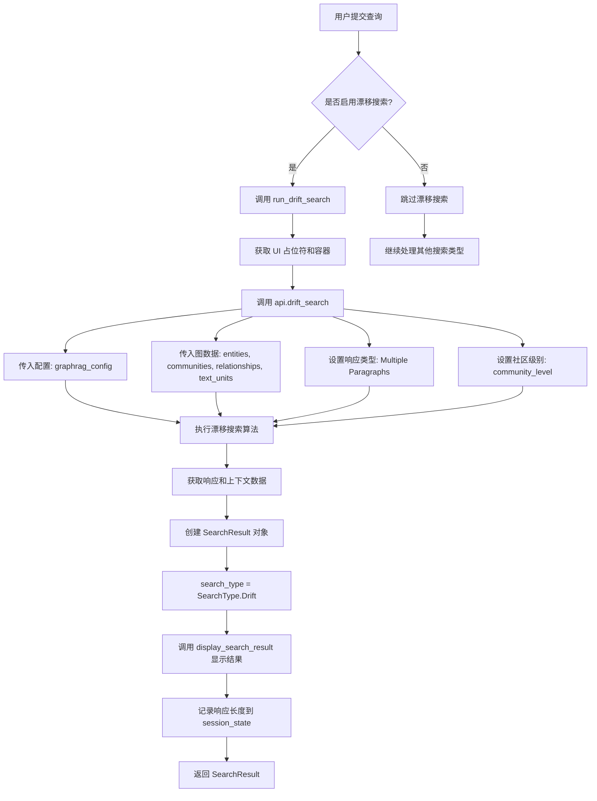

#### 关键组件信息

| 组件名称 | 描述 |
|---------|------|
| `SearchType.Drift` | 枚举成员，表示漂移搜索类型 |
| `run_drift_search` | 执行漂移搜索的异步函数 |
| `api.drift_search` | 底层 GraphRAG API 的漂移搜索实现 |
| `SearchResult` | 搜索结果的数据结构，包含响应和上下文 |

#### 技术债务和优化空间

1. **重复代码模式**: `run_drift_search` 与 `run_local_search`、`run_global_search` 存在大量重复代码，可以抽象出一个通用的搜索执行框架。

2. **错误处理缺失**: 当前函数没有显式的错误处理机制，如果 `api.drift_search` 失败，会导致整个应用崩溃。

3. **会话状态管理**: 使用 `st.session_state` 存储响应容器和占位符的方式较为耦合，可以考虑使用依赖注入或更清晰的状态管理方案。

4. **异步事件循环管理**: 在 `run_all_searches` 中手动创建事件循环的方式不够优雅，可以使用 `asyncio.run()` 或更好的异步入口点设计。

5. **硬编码的响应类型**: "Multiple Paragraphs" 作为硬编码值，应该从配置或用户设置中读取。

#### 其他项目

**设计目标**:
- 提供多种搜索策略供用户选择
- 支持在图结构上进行探索性搜索
- 通过异步并发执行提高响应速度

**约束**:
- 依赖 GraphRAG API 的实现
- 需要预先加载知识图谱数据（entities, communities, relationships, text_units）

**错误处理**:
- 缺少 try-except 包装
- 没有对 API 返回值的空值检查
- 上下文数据可能不是 dict 类型时的处理过于简单

**外部依赖**:
- `graphrag.api.drift_search`: 底层搜索 API
- `streamlit`: UI 框架
- `rag.typing.SearchType`: 搜索类型枚举
- `state.session_variables.SessionVariables`: 会话状态管理


### `run_basic_search`

执行基本的RAG（检索增强生成）搜索功能，通过调用图谱API的basic_search方法处理查询字符串，并在Streamlit UI中显示搜索结果。

参数：

- `query`：`str`，用户输入的搜索查询字符串
- `sv`：`SessionVariables`，包含图谱配置、数据单元和会话状态的会话变量对象

返回值：`SearchResult`，包含搜索类型为Basic的搜索结果对象，包含响应文本和上下文数据

#### 流程图

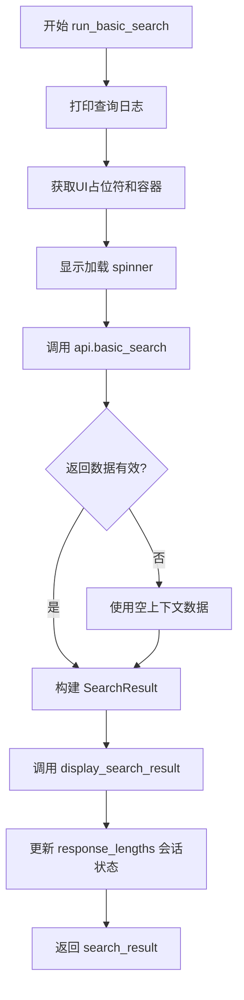

#### 带注释源码

```python
async def run_basic_search(
    query: str,
    sv: SessionVariables,
) -> SearchResult:
    """Run basic search."""
    # 打印查询日志用于调试
    print(f"Basic search query: {query}")  # noqa T201

    # 从会话状态获取Basic搜索的UI占位符和容器
    # 用于后续显示加载动画和结果
    response_placeholder = st.session_state[
        f"{SearchType.Basic.value.lower()}_response_placeholder"
    ]
    response_container = st.session_state[f"{SearchType.Basic.value.lower()}_container"]

    # 使用spinner显示加载状态，并执行basic_search调用
    with response_placeholder, st.spinner("Generating answer using basic RAG..."):
        # 初始化空上下文数据字典，用于存放DataFrame类型的数据
        empty_context_data: dict[str, pd.DataFrame] = {}

        # 调用graphrag API的basic_search方法
        # 传入图谱配置和文本单元数据进行搜索
        response, context_data = await api.basic_search(
            config=sv.graphrag_config.value,
            text_units=sv.text_units.value,
            query=query,
        )

        # 打印响应和上下文数据用于调试
        print(f"Basic Response: {response}")  # noqa T201
        print(f"Context data: {context_data}")  # noqa T201

    # 构建搜索结果对象
    # 确保context_data是字典类型，否则使用空数据
    search_result = SearchResult(
        search_type=SearchType.Basic,  # 设置搜索类型为Basic
        response=str(response),
        context=context_data if isinstance(context_data, dict) else empty_context_data,
    )

    # 在指定的UI容器中显示搜索结果
    display_search_result(
        container=response_container, result=search_result, stats=None
    )

    # 初始化response_lengths列表（如果不存在）
    if "response_lengths" not in st.session_state:
        st.session_state.response_lengths = []

    # 记录本次搜索的类型和结果到会话状态
    st.session_state["response_lengths"].append({
        "search": SearchType.Basic.value.lower(),
        "result": search_result,
    })

    # 返回构建的搜索结果
    return search_result
```

## 关键组件


### 会话变量与初始化

负责初始化Streamlit页面配置和会话状态，管理应用全局变量

### 数据集加载器

从数据源加载数据集配置、设置文件，并触发知识模型加载

### 知识模型加载

从数据源加载实体、关系、社区报告、社区、文本单元和协变量等知识图谱数据

### 全局搜索

执行基于社区的全局搜索，聚合多社区信息生成答案，支持动态社区选择

### 本地搜索

执行结合实体、关系、社区报告和文本单元的本地化搜索，提供细粒度上下文

### 漂移搜索

执行动态社区探索式搜索，支持在知识图谱中进行多路径推理

### 基础RAG搜索

执行基于文本单元的传统检索增强生成搜索

### 并发搜索调度

异步并发执行所有启用的搜索类型（漂移、基本、本地、全局），聚合结果返回

### 搜索结果展示

将搜索结果和上下文数据渲染到Streamlit容器中，支持结果统计

## 问题及建议


### 已知问题

-   **事件循环管理不当**：在多个异步函数（`run_all_searches`、`run_generate_questions`、`run_global_search_question_generation`、`run_local_search`、`run_global_search`、`run_drift_search`、`run_basic_search`）中重复创建新的事件循环 `asyncio.new_event_loop()` 和 `asyncio.set_event_loop(loop)`，且未在完成后关闭事件循环，导致资源泄漏风险
-   **代码重复严重**：搜索相关函数中存在大量重复代码，包括 `empty_context_data` 初始化、获取 `response_placeholder` 和 `response_container` 的模式、`SearchResult` 对象创建逻辑、`response_lengths` 追加逻辑以及 `display_search_result` 调用
-   **调试代码未清理**：多处使用 `print()` 语句进行调试输出（如 `print(f"Local search query: {query}")`），应替换为正式的日志记录
-   **缺乏错误处理**：所有异步搜索函数均无 try-except 异常捕获，若 API 调用失败会导致整个应用崩溃
-   **空值安全风险**：`dataset_name()` 函数在未找到对应数据集时直接调用 `.name` 属性，可能抛出 `AttributeError`
-   **类型注解不完整**：部分变量和返回值缺少类型注解，如 `run_all_searches` 中的 `tasks` 列表

### 优化建议

-   重构为单一入口点管理事件循环，使用 `asyncio.run()` 或在应用启动时创建一次事件循环，避免重复创建和关闭
-   提取公共逻辑到辅助函数，如创建 `SearchResult` 的工厂函数、处理 `response_lengths` 的通用方法，以及获取 placeholder 容器的统一方法
-   将所有 `print()` 语句替换为 `logger.info()` 或 `logger.debug()` 调用，使用结构化日志
-   为每个异步搜索函数添加 try-except 块，捕获特定异常类型并返回有意义的错误结果或向用户显示错误信息
-   为 `dataset_name()` 函数添加空值检查，使用 Optional 返回类型或抛出自定义异常
-   补充完整的类型注解，使用 `TypedDict` 或 `dataclass` 规范化数据结构

## 其它


### 设计目标与约束

本应用旨在构建一个基于GraphRAG的知识检索与问答系统，通过Streamlit Web界面为用户提供多种搜索模式（Local Search、Global Search、Drift Search、Basic Search）。设计约束包括：支持异步搜索执行以提高响应性能；通过SessionVariables集中管理应用状态；支持多数据集切换；依赖Azure OpenAI服务进行LLM推理。技术栈限制为Python 3.x，使用Streamlit作为前端框架，GraphRAG作为核心检索引擎。

### 错误处理与异常设计

代码中错误处理较为薄弱，主要体现在：1）多处使用print而非结构化日志记录；2）缺少try-except包裹的API调用；3）空值检查使用if-else而非异常捕获机制。改进建议：为所有async API调用（api.local_search、api.global_search、api.drift_search、api.basic_search）添加try-except块，捕获asyncio.TimeoutError、ConnectionError等网络异常；为load_dataset、load_knowledge_model添加数据加载失败的异常处理；将print语句替换为logging模块的标准日志记录；为SessionVariables的关键字段访问添加默认值和空值保护。

### 数据流与状态机

应用状态转换如下：1）Init状态：用户首次访问，调用initialize()创建SessionVariables；2）DatasetLoaded状态：load_dataset()成功加载数据集配置和数据源；3）ModelLoaded状态：load_knowledge_model()将entities、relationships、communities等数据加载到SessionVariables；4）SearchReady状态：所有搜索依赖数据就绪；5）Searching状态：用户提交查询，触发run_all_searches()并行执行多个搜索；6）ResultDisplayed状态：display_search_result()将SearchResult渲染到UI。状态转换由session_state中的标志位和SessionVariables的value属性驱动。

### 外部依赖与接口契约

主要外部依赖包括：1）graphrag.api模块：提供local_search()、global_search()、drift_search()、basic_search()异步接口，接收config、entities、communities等参数，返回(response, context_data)元组；2）knowledge_loader模块：create_datasource()创建数据源实例，load_dataset_listing()获取数据集列表，load_model()加载知识模型；3）streamlit模块：用于UI组件渲染和session_state管理；4）rag.typing模块：定义SearchResult和SearchType枚举。接口契约要求：SearchResult必须包含search_type、response(str)、context(dict)字段；SessionVariables的value属性必须可写且支持响应式更新；所有搜索函数必须返回SearchResult对象或包含SearchResult的列表。

### 并发模型与异步设计

代码使用asyncio实现并发搜索，通过asyncio.gather()并行执行多个搜索任务（drift、basic、local、global）。存在问题：1）run_all_searches()每次调用都创建新的event_loop而非复用；2）run_generate_questions()与run_all_searches()结构重复；3）未设置asyncio任务的超时时间。建议：使用asyncio.run()管理生命周期；为gather()添加return_exceptions=True以避免单点失败导致整体失败；为搜索任务设置合理的超时参数（如30秒）防止长时间阻塞。

### 配置管理与安全考量

dataset配置通过sv.dataset_config.value读取settings.yaml，路径拼接使用f-string直接格式化存在潜在注入风险（sv.dataset_config.value.path）。建议对dataset key进行白名单验证，防止路径遍历攻击。graphrag_config包含Azure OpenAI的API密钥等敏感信息，应确保不通过URL参数或日志暴露。st.query_params["dataset"]直接转换为小写后作为数据集key，未进行输入校验。

### 性能优化建议

1）搜索结果缓存：当前每次搜索都重新调用API，可考虑对相同query的结果进行缓存；2）懒加载：load_knowledge_model()一次性加载所有数据，可改为按需加载（仅加载当前搜索类型需要的数据）；3）会话状态清理：response_lengths持续增长，应设置上限或定期清理；4）UI渲染优化：display_search_result()中使用st.spinner，可考虑添加进度条显示各搜索任务的完成状态。

### 测试策略建议

单元测试应覆盖：1）SessionVariables的初始化和数据绑定；2）各搜索函数的参数验证和返回值结构；3）load_dataset()的数据源切换逻辑；4）空数据集和空查询的边界条件。集成测试应覆盖：1）完整的搜索流程（从query输入到结果渲染）；2）多数据集切换；3）并发搜索的竞态条件。Mock策略：使用unittest.mock模拟graphrag.api的返回值，避免实际调用OpenAI API。

    