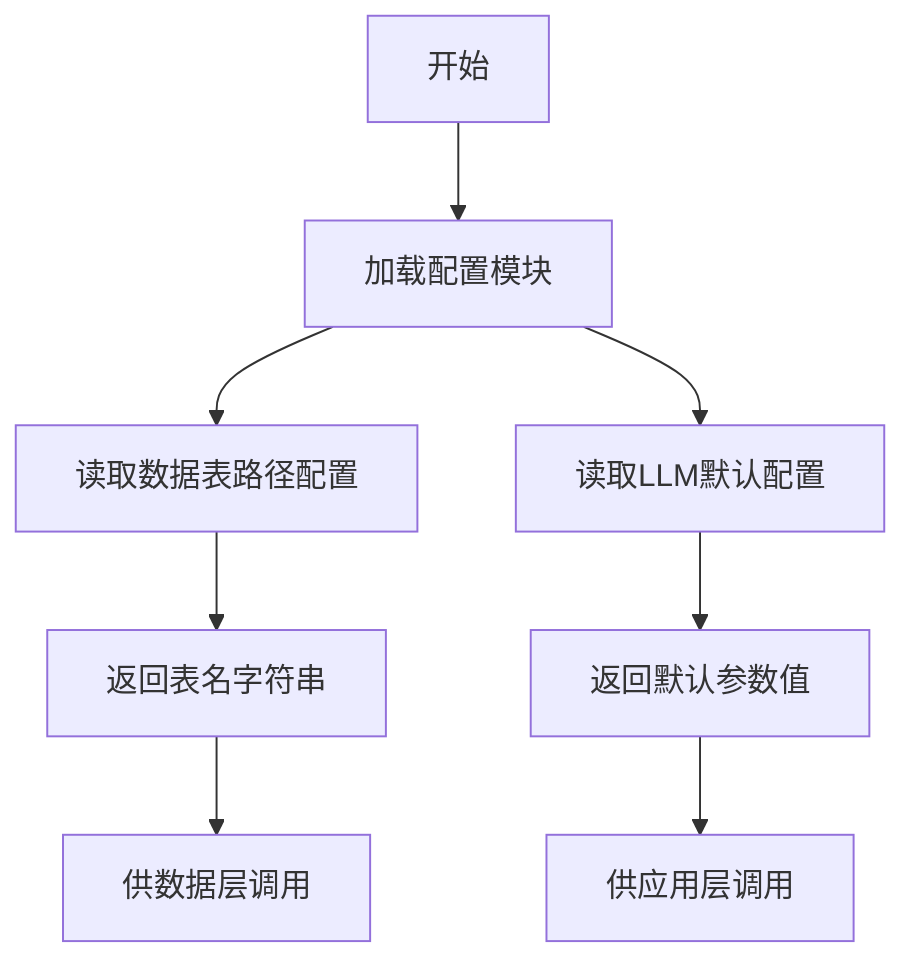

# `graphrag\unified-search-app\app\data_config.py` 详细设计文档

该文件用于存储图形索引数据（graph-indexed data）的表名配置以及应用程序中使用的LLM/嵌入模型的默认配置参数，包括社区表、社区报告表、实体表、关系表、共变量表、文本单元表等数据表的路径，以及建议问题数量和缓存TTL等运行时配置。

## 整体流程



## 类结构

```
该文件为纯配置文件，无类层次结构
所有配置项以模块级全局变量形式定义
```

## 全局变量及字段


### `communities_table`
    
图中存储社群数据的表名，默认为'output/communities'

类型：`str`
    


### `community_report_table`
    
图中存储社群报告数据的表名，默认为'output/community_reports'

类型：`str`
    


### `entity_table`
    
图中存储实体嵌入数据的表名，默认为'output/entities'

类型：`str`
    


### `relationship_table`
    
图中存储实体关系数据的表名，默认为'output/relationships'

类型：`str`
    


### `covariate_table`
    
图中存储实体协变量数据的表名，默认为'output/covariates'

类型：`str`
    


### `text_unit_table`
    
图中存储文本单元数据的表名，默认为'output/text_units'

类型：`str`
    


### `default_suggested_questions`
    
LLM生成答案时默认的建议问题数量，默认为5个

类型：`int`
    


### `default_ttl`
    
streamlit缓存的默认生存时间，默认为604800秒（7天）

类型：`int`
    


    

## 全局函数及方法


## 关键组件


### 社区表配置 (communities_table)

存储社区数据的图索引数据表名称配置

### 社区报告表配置 (community_report_table)

存储社区报告的图索引数据表名称配置

### 实体表配置 (entity_table)

存储实体嵌入向量的图索引数据表名称配置

### 关系表配置 (relationship_table)

存储实体间关系的图索引数据表名称配置

### 协变量表配置 (covariate_table)

存储实体协变量（如属性、特征）的图索引数据表名称配置

### 文本单元表配置 (text_unit_table)

存储文本单元（如句子、段落）的图索引数据表名称配置

### 默认建议问题数量配置 (default_suggested_questions)

LLM生成答案时使用的默认建议问题数量，用于所有搜索类型

### 默认缓存TTL配置 (default_ttl)

Streamlit缓存的默认过期时间，单位为秒，配置为7天

## 问题及建议


### 已知问题

-   **模块缺乏文档字符串**：整个模块没有模块级的docstring来说明其用途和作用域
-   **硬编码路径前缀**：所有表名都硬编码了"output/"前缀，缺乏灵活性，无法适应不同的输出目录配置
-   **缺少类型注解**：所有全局变量都缺乏类型注解，降低了代码的可读性和静态检查能力
-   **魔法数字缺乏解释**：default_suggested_questions = 5 是魔法数字，没有注释说明其选择依据或业务含义
-   **配置项职责不清晰**：将数据表路径配置与LLM运行时配置（如default_suggested_questions、default_ttl）混在一起，职责不单一
-   **缺乏配置验证**：没有对配置值进行有效性校验（如路径格式、数值范围等）
-   **命名不一致**：部分变量使用_table后缀（如communities_table），部分使用普通命名（如default_suggested_questions），风格不统一
-   **TTL计算表达式缺乏说明**：default_ttl = 60 * 60 * 24 * 7 虽然计算正确，但缺乏注释说明其实际含义（一周）

### 优化建议

-   为模块添加docstring，说明其用途为存储图索引数据和LLM/嵌入模型的配置
-   考虑将硬编码的"output/"前缀提取为可配置的根路径变量
-   为所有配置变量添加类型注解（如str、int等）
-   为关键配置项添加解释性注释，说明取值依据和业务含义
-   将配置按职责分离：数据表路径配置、LLM模型配置、应用运行时配置分属不同模块
-   添加配置验证逻辑，确保路径格式正确、数值在合理范围内
-   统一变量命名风格，如全部使用_table后缀或采用其他统一约定
-   将TTL的计算结果注释说明，增强可读性

## 其它


### 设计目标与约束

本配置文件模块的核心目标是为图形索引数据和LLM/嵌入模型提供集中式的配置管理。设计约束包括：表名配置必须与底层数据存储层保持一致；超时配置需考虑Streamlit缓存机制的限制；建议问题数量需根据LLM的token限制进行调整。

### 错误处理与异常设计

本模块为纯配置定义，不涉及运行时错误处理。若配置值缺失或类型错误，将在使用时由调用方抛出AttributeError或TypeError。建议调用方在加载配置后进行基础校验，例如验证表名字符串非空、TTL值为正整数等。

### 数据流与状态机

本模块作为静态配置提供者，不涉及数据流处理或状态机逻辑。配置数据在应用启动时由Streamlit或其他入口模块加载，随后传递给数据访问层用于查询图形索引表。

### 外部依赖与接口契约

本模块无外部Python依赖，仅定义字符串和整数常量。调用方需承诺：表名配置应与实际数据存储路径一致；default_ttl值（604800秒）需与Streamlit的st.cache_data或st.cache_resource配合使用；default_suggested_questions需与前端UI组件协调。

### 安全考虑

当前配置不涉及敏感信息（如API密钥、数据库凭证），因此无特殊安全要求。建议未来若添加敏感配置，应考虑使用环境变量或密钥管理系统而非明文硬编码。

### 性能考虑

配置模块本身无性能瓶颈。default_ttl设置为7天（604800秒）需根据实际数据更新频率调整，过长可能导致数据陈旧，过短则增加计算开销。

### 可维护性与扩展性

当前采用模块级常量定义方式，维护性较好。扩展建议：可将配置迁移至独立的YAML或JSON文件以支持运行时配置变更；可添加类型注解以提升代码可读性；可使用dataclass或Pydantic定义配置结构以支持验证。

### 版本兼容性

本模块明确标注适用于MIT License下的开源项目，配置值（如default_ttl）针对特定使用场景优化，迁移至其他版本时需评估兼容性。

### 使用示例

```python
from graphrag_app.config import (
    communities_table,
    community_report_table,
    entity_table,
    relationship_table,
    covariate_table,
    text_unit_table,
    default_suggested_questions,
    default_ttl,
)

# 使用示例：在数据查询时引用表名
def query_communities():
    return f"SELECT * FROM {communities_table}"

# 使用示例：在Streamlit缓存中应用TTL
@st.cache_data(ttl=default_ttl)
def load_entity_embeddings():
    # 加载操作
    pass
```

### 测试策略

由于本模块为纯配置定义，建议通过以下方式进行测试：验证所有常量可正常导入；验证常量类型符合预期（字符串或整数）；验证默认值在合理范围内（如default_ttl > 0）。

### 部署注意事项

部署时需确保配置模块与数据存储层的路径一致性；需根据目标环境的LLM模型类型调整default_suggested_questions参数；需根据Streamlit部署平台调整default_ttl值以适应缓存策略。

### 配置管理最佳实践建议

建议未来将配置拆分为多层结构：基础配置（表名）、模型配置（LLM参数）、应用配置（UI参数）。可引入环境变量覆盖机制以支持多环境部署（开发/测试/生产）。

    