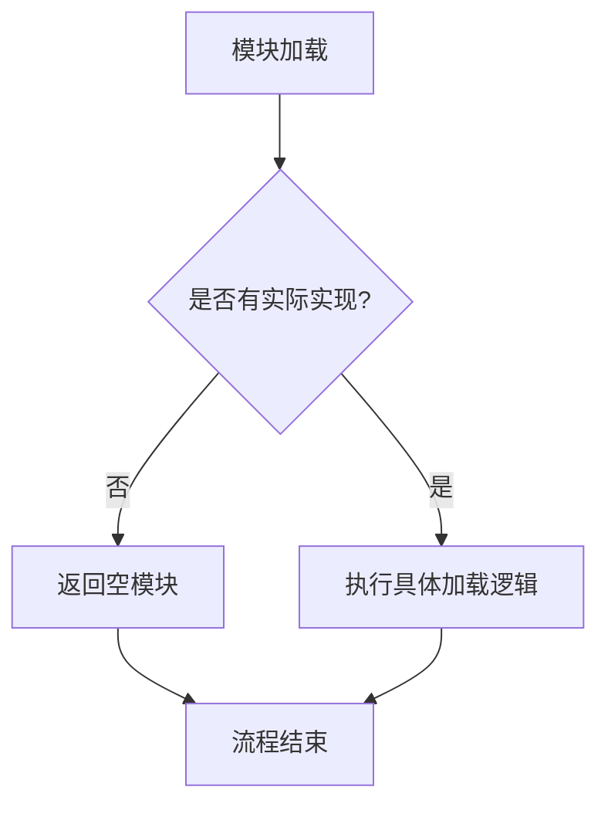

# `graphrag\unified-search-app\app\knowledge_loader\__init__.py` 详细设计文档

这是一个知识加载器模块的占位文件，目前仅包含模块文档字符串和版权声明，尚未实现具体功能。该模块预期用于加载和管理知识数据。

## 整体流程



## 类结构

```
KnowledgeLoader (模块命名空间)
└── (当前无具体类定义)
```

## 全局变量及字段


    

## 全局函数及方法


## 关键组件


### 核心功能概述

基于模块名称 "Knowledge loader module" 推断，该代码模块旨在实现知识库的加载功能，负责从存储介质中读取和解析知识数据，为上层应用提供统一的知识访问接口。

### 文件整体运行流程

由于当前代码文件仅包含版权声明和模块文档字符串，未包含实际实现代码，因此无法提供详细的运行流程分析。

### 类详细信息

当前代码文件中未定义任何类。

### 全局变量与全局函数

当前代码文件中未定义任何全局变量或全局函数。

### 关键组件信息

由于代码文件内容有限，未识别到具体的实现组件。可能的组件预期包括：

- **数据加载器**：负责从文件、数据库或API加载知识数据
- **数据解析器**：负责解析不同格式的知识数据（如JSON、XML、数据库记录等）
- **缓存管理**：优化知识数据的加载性能
- **错误处理机制**：处理加载过程中的异常情况

### 潜在技术债务或优化空间

由于缺乏实际代码实现，无法进行技术债务评估。建议在后续补充完整实现后，再进行相关分析。

### 其它项目

**设计目标与约束**：根据模块名称推测，设计目标应为提供高效、可靠的knowledge加载能力

**错误处理与异常设计**：无法评估当前代码的异常处理设计

**数据流与状态机**：无法评估当前代码的数据流设计

**外部依赖与接口契约**：无法评估当前代码的外部依赖关系


## 问题及建议


### 已知问题

-   **模块实现缺失**：代码仅包含版权声明和模块文档字符串，无任何实际功能实现，无法完成知识加载的核心职责
-   **接口定义缺失**：作为模块文件，未定义任何公共 API 接口（如 `load`, `parse`, `get_knowledge` 等函数）
-   **缺少文档说明**：模块文档字符串过于简略，未说明知识来源格式、支持的知识类型、加载策略等关键信息
-   **无错误处理机制**：空模块无法体现错误处理设计
-   **无依赖声明**：未定义所需的外部依赖或 Python 版本要求

### 优化建议

-   **实现核心加载逻辑**：根据模块定位，实现知识文件的读取、解析和转换功能
-   **定义清晰接口**：提供标准的加载函数，如 `load_knowledge(path)` 或类 `KnowledgeLoader`
-   **完善模块文档**：在 docstring 中补充功能说明、支持格式、使用示例
-   **添加类型注解**：为函数和类添加类型提示，提高代码可维护性
-   **考虑扩展性**：设计支持多种知识格式（JSON、YAML、Markdown 等）的插件式架构


## 其它


### 设计目标与约束

设计目标：实现一个高效、可扩展的知识加载模块，负责从各种数据源加载和解析知识数据，为上层应用提供统一的知识访问接口。该模块应支持多种知识格式，具备良好的错误处理机制和性能优化空间。

### 错误处理与异常设计

由于代码中未提供具体的异常处理实现，建议设计以下异常类：KnowledgeLoadError（知识加载异常）、ParseError（解析异常）、ValidationError（验证异常）。所有公共方法应包含try-except块进行异常捕获，向上层抛出有意义的错误信息，并记录详细的错误日志以便于问题排查。

### 数据流与状态机

模块的数据流主要包括：数据源接入→数据读取→格式解析→数据验证→知识建模→数据输出。建议设计状态机管理加载流程，状态包括：IDLE（初始）、LOADING（加载中）、PARSING（解析中）、VALIDATING（验证中）、READY（就绪）、ERROR（错误）。状态转换应遵循合理的流程控制，确保数据处理的完整性和一致性。

### 外部依赖与接口契约

接口契约应定义清晰的输入输出规范：load_knowledge()方法接受数据源路径或配置对象，返回标准化的知识对象；parse_knowledge()方法负责格式转换；validate_knowledge()方法进行数据校验。外部依赖建议明确标注版本要求，包括数据解析库（如pyyaml、json库）、日志库（如logging）等。

### 版本兼容性说明

应明确标注模块支持的Python版本范围（如Python 3.8+），以及与相关依赖库的兼容性信息。建议在文档中说明在不同Python版本下的行为差异和注意事项。

### 安全性考虑

应包含输入数据的 sanitization 处理，防止注入攻击；对于从外部源加载的知识数据，需要进行安全验证；敏感信息不应在日志中输出；如涉及网络请求，应考虑HTTPS和证书验证。

### 性能考量

建议设计缓存机制以提高重复加载的性能；考虑使用生成器或迭代器处理大规模知识数据；提供懒加载选项以减少初始内存占用；应包含性能基准测试和优化建议。

### 测试策略建议

建议包含单元测试覆盖所有公共方法，集成测试验证数据流完整性，压力测试评估大规模数据处理能力，mock外部依赖以提高测试独立性。

### 部署与配置说明

应说明模块的安装方式、配置选项、环保证以及多环境支持（如开发、测试、生产环境的差异化配置）。

### 文档与示例

建议提供详细的API文档、使用示例、最佳实践指南，以及常见问题和解决方案（FAQ）部分。


    