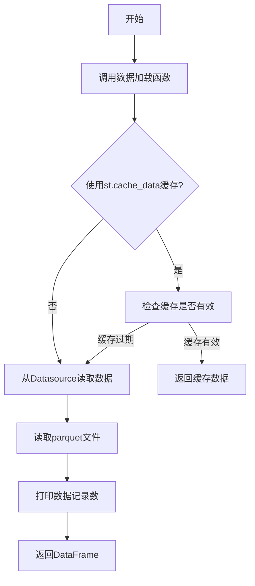
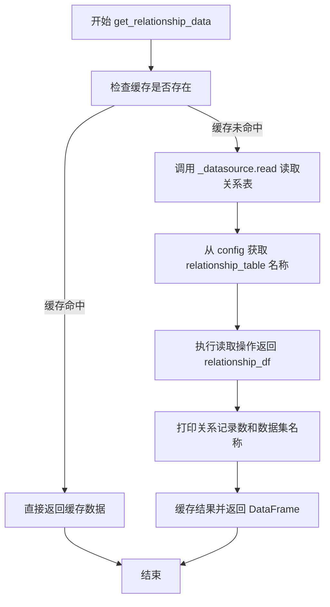
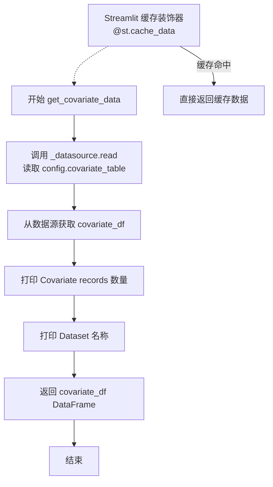
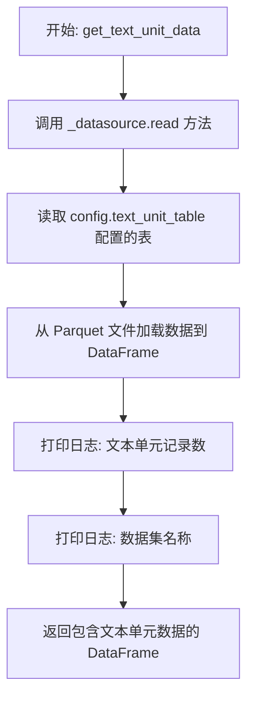
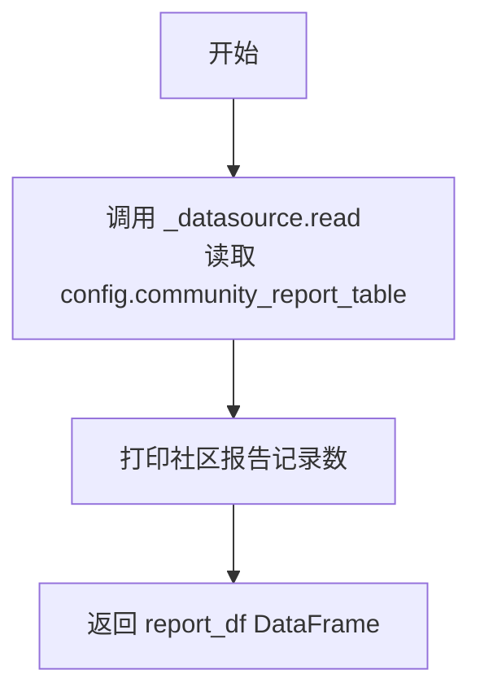
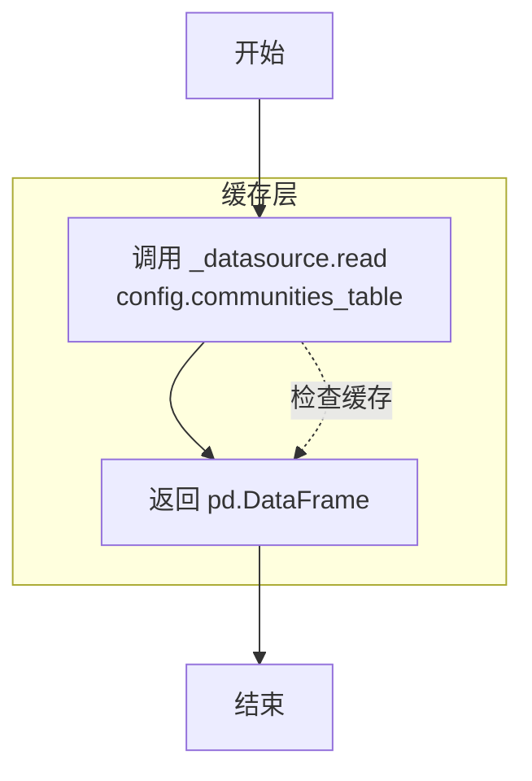

# `graphrag\unified-search-app\app\knowledge_loader\data_prep.py` 详细设计文档

这是一个数据准备模块，用于从parquet格式的索引数据文件中加载实体、关系、共变量、文本单元、社区报告和社区数据到pandas DataFrame中，供知识图谱编排函数使用。

## 整体流程



## 类结构

```
该文件为模块文件，无类定义
所有函数均为模块级全局函数
使用st.cache_data装饰器实现数据缓存
```

## 全局变量及字段


### `logger`
    
模块级别的日志记录器，用于记录程序运行过程中的信息

类型：`logging.Logger`
    


### `config`
    
数据配置模块，包含数据表名称、TTL等配置信息

类型：`module`
    


### `pd`
    
Pandas库，提供DataFrame数据结构和数据处理分析功能

类型：`pandas module`
    


### `st`
    
Streamlit库，提供Web界面创建和数据缓存功能

类型：`streamlit module`
    


    

## 全局函数及方法


### `get_entity_data`

该函数是一个 Streamlit 缓存数据加载函数，用于从已索引的数据源中读取实体数据并返回包含实体详情的 Pandas DataFrame，可通过数据集名称和数据源配置获取对应的实体表数据。

参数：

- `dataset`：`str`，标识要加载的数据集名称，用于日志记录和追踪数据来源
- `_datasource`：`Datasource`，数据源对象，提供读取已索引数据的方法接口

返回值：`pd.DataFrame`，返回包含所有实体记录的 DataFrame 对象，数据来源于配置中定义的实体表

#### 流程图

```mermaid
flowchart TD
    A[开始] --> B[接收参数: dataset, _datasource]
    B --> C[调用 _datasource.read 读取实体表]
    C --> D[获取 entity_details_df]
    D --> E[打印实体记录数: len(entity_details_df)]
    E --> F[打印数据集名称: dataset]
    F --> G[返回 entity_details_df]
    G --> H[结束]
```

#### 带注释源码

```python
@st.cache_data(ttl=config.default_ttl)  # Streamlit缓存装饰器，设置数据过期时间为config.default_ttl
def get_entity_data(dataset: str, _datasource: Datasource) -> pd.DataFrame:
    """Return a dataframe with entity data from the indexed-data."""
    
    # 从数据源读取实体表数据，返回包含实体详情的DataFrame
    entity_details_df = _datasource.read(config.entity_table)

    # 打印实体记录数量，用于调试和日志记录
    print(f"Entity records: {len(entity_details_df)}")  # noqa T201
    
    # 打印当前数据集名称，用于追踪数据来源
    print(f"Dataset: {dataset}")  # noqa T201
    
    # 返回包含实体数据的DataFrame，供下游模块使用
    return entity_details_df
```


### `get_relationship_data`

该函数是一个缓存的数据加载函数，用于从索引数据中读取实体之间的关联关系数据，并返回一个包含关系信息（如源实体、目标实体、关系类型等）的 Pandas DataFrame，供后续的知识模型构建和图检索使用。

参数：

- `dataset`：`str`，数据集标识符，用于日志打印和追踪数据来源
- `_datasource`：`Datasource`，数据源对象，提供从配置指定的关系表中读取数据的能力

返回值：`pd.DataFrame`，包含实体-实体关系数据的数据帧

#### 流程图



#### 带注释源码

```python
@st.cache_data(ttl=config.default_ttl)  # 使用 Streamlit 缓存装饰器，TTL 由配置决定
def get_relationship_data(dataset: str, _datasource: Datasource) -> pd.DataFrame:
    """Return a dataframe with entity-entity relationship data from the indexed-data."""
    # 从数据源读取关系表数据，table 名称由 config.relationship_table 指定
    relationship_df = _datasource.read(config.relationship_table)
    
    # 打印日志信息用于调试和监控：关系记录数和数据集标识
    print(f"Relationship records: {len(relationship_df)}")  # noqa T201
    print(f"Dataset: {dataset}")  # noqa T201
    
    # 返回包含所有关系记录的 DataFrame
    return relationship_df
```


### `get_covariate_data`

从索引数据中读取并返回包含协变量（covariate）数据的 Pandas DataFrame，同时记录数据条数和信息。

参数：

- `dataset`：`str`，数据集标识符，用于日志输出
- `_datasource`：`Datasource`，数据源对象，用于读取底层数据

返回值：`pd.DataFrame`，包含协变量数据的 DataFrame 对象

#### 流程图



#### 带注释源码

```python
@st.cache_data(ttl=config.default_ttl)  # Streamlit 缓存装饰器，配置默认 TTL（Time-To-Live）
def get_covariate_data(dataset: str, _datasource: Datasource) -> pd.DataFrame:
    """Return a dataframe with covariate data from the indexed-data."""
    
    # 使用数据源对象读取配置中定义的协变量表
    covariate_df = _datasource.read(config.covariate_table)
    
    # 输出协变量记录的总数，用于监控和调试
    print(f"Covariate records: {len(covariate_df)}")  # noqa T201
    
    # 输出当前数据集标识，用于日志追踪
    print(f"Dataset: {dataset}")  # noqa T201
    
    # 返回包含协变量数据的 DataFrame
    return covariate_df
```


### `get_text_unit_data`

该函数从索引数据中读取文本单元（即原始文档的文本块）数据，并将其作为 pandas DataFrame 返回，用于后续知识模型对象的创建和图检索 orchestration 函数的输入。

参数：

- `dataset`：`str`，数据集名称，用于日志输出和标识数据来源
- `_datasource`：`Datasource`，数据源对象，提供读取存储在 Parquet 文件中的索引数据的方法

返回值：`pd.DataFrame`，包含文本单元（text units）数据的 DataFrame 对象，每个文本单元代表原始文档中的一个文本块

#### 流程图



#### 带注释源码

```python
# 使用 streamlit 的缓存装饰器，ttl 为配置中的默认过期时间
# 这避免了每次调用时都重新从磁盘读取数据，提高性能
@st.cache_data(ttl=config.default_ttl)
def get_text_unit_data(dataset: str, _datasource: Datasource) -> pd.DataFrame:
    """Return a dataframe with text units (i.e. chunks of text from the raw documents) from the indexed-data."""
    
    # 从数据源读取文本单元表的数据
    # _datasource.read() 方法接受表名作为参数，返回 pandas DataFrame
    # config.text_unit_table 定义了文本单元表的名字
    text_unit_df = _datasource.read(config.text_unit_table)
    
    # 打印日志：文本单元记录数，用于调试和数据验证
    print(f"Text unit records: {len(text_unit_df)}")  # noqa T201
    
    # 打印日志：当前处理的数据集名称，便于追踪数据来源
    print(f"Dataset: {dataset}")  # noqa T201
    
    # 返回包含文本单元数据的 DataFrame
    # 该 DataFrame 将被用于创建知识模型的输入对象
    return text_unit_df
```


### `get_community_report_data`

该函数是一个使用 Streamlit 缓存的数据加载函数，用于从索引数据中读取社区报告（community report）数据，并将其作为 pandas DataFrame 返回，供后续的知识模型对象创建和图检索编排函数使用。

参数：

- `_datasource`：`Datasource`，数据源对象，用于从配置的社区报告表中读取数据

返回值：`pd.DataFrame`，包含社区报告数据的 DataFrame 对象

#### 流程图



#### 带注释源码

```python
@st.cache_data(ttl=config.default_ttl)
def get_community_report_data(
    _datasource: Datasource,
) -> pd.DataFrame:
    """Return a dataframe with community report data from the indexed-data."""
    # 使用数据源的 read 方法从社区报告表中读取数据
    report_df = _datasource.read(config.community_report_table)
    
    # 打印读取到的报告记录数量，用于调试和日志记录
    print(f"Report records: {len(report_df)}")  # noqa T201

    # 返回包含社区报告数据的 DataFrame
    return report_df
```


### `get_communities_data`

该函数是一个数据加载函数，用于从索引数据中读取社区（communities）数据。它通过 datasource 对象读取配置中指定的社区表，并返回包含社区数据的 pandas DataFrame。该函数使用 Streamlit 的 `@st.cache_data` 装饰器进行缓存，以提高重复调用的性能。

参数：

- `_datasource`：`Datasource`，数据源对象，用于从底层存储（Parquet 文件）读取数据

返回值：`pd.DataFrame`，包含来自索引数据的社区数据表

#### 流程图



#### 带注释源码

```python
@st.cache_data(ttl=config.default_ttl)  # 使用 Streamlit 缓存装饰器，TTL 从配置读取
def get_communities_data(
    _datasource: Datasource,  # 数据源对象，用于读取底层存储的数据
) -> pd.DataFrame:
    """Return a dataframe with communities data from the indexed-data."""
    return _datasource.read(config.communities_table)  # 读取配置中定义的社区表，返回 DataFrame
```

## 关键组件


### 数据加载与缓存层

该模块通过Streamlit的缓存机制（@st.cache_data）实现惰性加载，从datasource读取不同类型的索引数据（实体、关系、协变量、文本单元、社区报告和社区数据），并转换为Pandas DataFrame供下游使用。

### 实体数据加载函数 (get_entity_data)

从parquet文件读取实体详情数据，返回包含实体记录的DataFrame。

### 关系数据加载函数 (get_relationship_data)

从parquet文件读取实体间关系数据，返回包含关系记录的DataFrame。

### 协变量数据加载函数 (get_covariate_data)

从parquet文件读取协变量数据，返回包含协变量记录的DataFrame。

### 文本单元数据加载函数 (get_text_unit_data)

从parquet文件读取文本单元（即原始文档的文本块）数据，返回包含文本单元记录的DataFrame。

### 社区报告数据加载函数 (get_community_report_data)

从parquet文件读取社区报告数据，返回包含社区报告记录的DataFrame。

### 社区数据加载函数 (get_communities_data)

从parquet文件读取社区数据，返回包含社区记录的DataFrame。

### 配置与日志模块

使用logging模块进行日志记录，配置INFO级别，并通过data_config模块管理表名配置和TTL设置。


## 问题及建议


### 已知问题

-   **缓存键使用不当**：函数参数`dataset`未被使用但仍作为缓存键的一部分，可能导致不同数据集返回相同的缓存结果
-   **未使用的参数**：函数签名中的`dataset`参数未被使用，应添加下划线前缀（`_dataset`）或移除
-   **日志与打印混用**：使用`print`语句而非标准`logging`模块，在生产环境中不一致
-   **缺少异常处理**：`_datasource.read()`调用没有try-except包裹，读取失败会导致程序中断
-   **重复代码模式**：多个数据加载函数结构高度相似，存在代码重复

### 优化建议

-   统一使用`logging.info()`替代`print`语句，或将日志级别改为`logging.debug()`以减少生产环境输出
-   为所有数据加载函数添加异常处理逻辑，捕获并记录读取失败的情况
-   考虑抽取通用数据加载逻辑为内部函数，减少代码重复
-   移除或使用未使用的`dataset`参数，确保缓存行为符合预期

## 其它


### 设计目标与约束

本模块的设计目标是从Parquet文件中加载图索引数据，并将其转换为Pandas DataFrame格式，供知识模型对象使用。核心约束包括：使用Streamlit的缓存机制（@st.cache_data）来减少重复加载开销，缓存TTL由config.default_ttl控制；所有数据读取操作通过Datasource接口进行抽象，支持多种数据源；所有函数均为无状态函数，便于缓存和并发调用。

### 错误处理与异常设计

当前模块的错误处理较为基础，主要依赖Datasource接口的read方法抛出异常。未对空数据、文件不存在、权限问题等常见异常进行显式捕获和处理。建议增加：1）空数据检查，返回空DataFrame而非直接抛出异常；2）日志记录失败操作；3）为不同类型的异常（文件不存在、权限不足、数据格式错误）提供差异化处理；4）添加重试机制应对临时性IO错误。

### 数据流与状态机

数据流从Datasource接口开始，经过各get_*_data函数读取对应表的数据，返回的DataFrame直接传递给下游知识模型。模块本身无状态，状态由Streamlit的cache_data机制管理。数据流转路径：Parquet文件 → Datasource.read() → pd.DataFrame → 知识模型对象。无复杂状态机设计。

### 外部依赖与接口契约

本模块依赖以下外部组件：1）data_config模块（config对象），提供表名配置（entity_table、relationship_table、covariate_table、text_unit_table、community_report_table、communities_table）和default_ttl配置；2）streamlit库的st.cache_data装饰器，用于结果缓存；3）pandas库，用于DataFrame操作；4）knowledge_loader.data_sources.typing.Datasource接口，需实现read方法接受表名并返回pd.DataFrame。接口契约明确：Datasource.read(table_name)必须返回pd.DataFrame或可转换为DataFrame的对象。

### 性能考量与优化空间

当前模块使用@st.cache_data实现缓存，但存在以下优化空间：1）所有函数参数包含dataset和_datasource，但dataset参数未在函数体内使用，仅用于触发缓存区分（当dataset不同时缓存失效），这是合理设计；2）print语句用于调试，建议替换为logger.debug以支持生产环境的日志级别控制；3）可考虑添加数据采样或分页加载机制以应对大规模数据集；4）可增加缓存键的显式控制，允许手动刷新缓存。

### 配置与环境要求

模块正常工作需要：1）data_config模块正确配置各表名称；2）Datasource实现类正确配置Parquet文件路径；3）Streamlit运行环境以支持@st.cache_data装饰器；4）Python环境需安装pandas、streamlit及Datasource相关的依赖包。配置文件路径建议通过环境变量或配置文件外部化，以提高模块的可移植性。

### 测试策略建议

建议补充以下测试用例：1）单元测试验证各函数返回DataFrame类型；2）Mock Datasource测试验证数据读取逻辑；3）空数据源测试验证容错行为；4）缓存机制测试验证相同参数不重复读取；5）大数据集性能测试验证响应时间。测试文件可命名为test_data_prep.py或data_prep_test.py。

### 安全考量

当前模块未包含敏感数据处理，但建议注意：1）如果Parquet文件包含敏感信息，需确保Datasource读取时进行脱敏处理；2）日志输出需避免泄露业务敏感信息（当前print语句可能输出记录数等信息）；3）如部署在多租户环境，需确保不同租户的数据隔离。

### 版本与兼容性

当前版本基于MIT License，由Microsoft Corporation于2024年发布。需关注：1）streamlit版本兼容性（st.cache_data在不同streamlit版本中可能有变化）；2）pandas版本兼容性；3）Datasource接口的向后兼容性。建议在requirements.txt或pyproject.toml中明确依赖版本范围。

### 文档与可维护性

代码包含基本的docstring，但可增强：1）为每个函数添加参数说明和使用示例；2）添加模块级文档说明数据准备流程；3）添加配置项说明文档；4）添加常见问题排查指南。当前文档字符串仅说明函数功能，缺少参数说明和返回值示例。


    