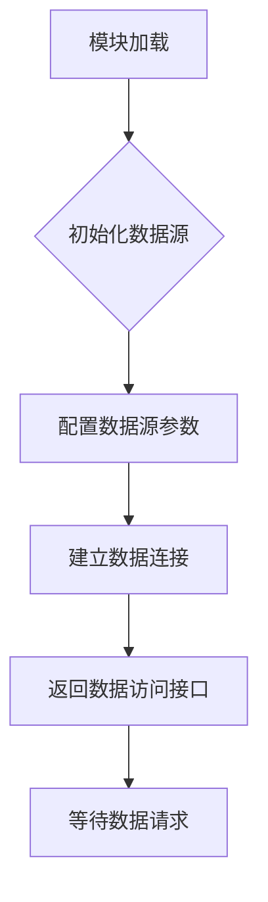

# `graphrag\unified-search-app\app\knowledge_loader\data_sources\__init__.py` 详细设计文档

该模块为数据源模块，用于管理与集成各类数据来源，为系统提供统一的数据访问接口。根据Microsoft Corporation的版权信息和模块命名推测，该模块可能用于AI/LLM应用中的数据源整合。

## 整体流程



## 类结构

```
DataSourcesModule (根模块)
└── [具体数据源类待定义]
```

## 全局变量及字段


    

## 全局函数及方法


## 关键组件


# 设计文档

## 1. 一段话描述

该模块为数据源（Data Sources）模块的占位文件，仅包含版权声明和模块 docstring，尚未实现任何具体功能。

## 2. 文件的整体运行流程

由于当前文件仅包含模块声明和文档字符串，无实际代码逻辑，因此不存在可描述的运行流程。

## 3. 类的详细信息

无类定义。

### 全局变量和全局函数

无全局变量或全局函数定义。

## 4. 关键组件信息

### 模块占位符

该模块作为数据源模块的入口点，目前仅定义了模块级别的文档字符串，等待后续实现具体的数据源类和相关功能。

## 5. 潜在的技术债务或优化空间

由于当前代码仅为空模块声明，不涉及技术债务。但后续实现时需考虑：

- 定义清晰的数据源接口抽象
- 实现统一的错误处理机制
- 考虑数据加载的惰性加载和缓存策略
- 设计合理的资源管理（如连接池、内存管理）

## 6. 其它项目

### 设计目标与约束

- 需遵循 MIT License 开源协议
- 归属 Microsoft Corporation

### 错误处理与异常设计

当前无实现，无法分析。

### 数据流与状态机

当前无实现，无法分析。

### 外部依赖与接口契约

当前无实现，无法分析。


## 问题及建议


### 已知问题

-   **模块内容为空**：当前代码仅包含版权声明和简单的模块文档字符串，没有任何实际的功能实现，不符合数据源模块的基本预期
-   **缺少模块级文档说明**：文档字符串仅为 `"""Data sources module."""`，缺乏对模块功能、职责、关键组件和用法的详细描述
-   **未定义数据源接口或抽象基类**：作为数据源模块，缺乏统一的数据源访问接口设计
-   **缺少类型注解**：代码中没有任何类型提示信息，不利于代码可维护性和IDE支持
-   **缺乏错误处理设计**：没有定义相关的自定义异常类
-   **缺少配置管理**：数据源通常需要配置管理，当前代码未体现

### 优化建议

-   **完善模块文档**：在文档字符串中详细描述模块的职责、支持的数 据源类型、核心功能和使用示例
-   **设计数据源抽象层**：创建抽象基类或协议（Protocol），定义统一的数据源接口（如 `connect()`, `query()`, `close()` 等方法）
-   **添加类型注解**：为所有函数、方法和变量添加适当的类型提示
-   **定义自定义异常类**：创建数据源相关的异常体系（如 `DataSourceError`, `ConnectionError`, `QueryError` 等）
-   **添加配置管理机制**：考虑添加数据源配置的管理能力，支持多种数据源的配置
-   **实现日志记录**：添加适当的日志记录功能，便于调试和监控
-   **添加连接池管理**：对于需要连接的数据源，考虑实现连接池以提高性能


## 其它


### 项目背景与目标
本模块为数据源模块（Data sources module），用于管理和提供各类数据源的接入功能。由于当前代码仅为模块占位符，实际功能实现需后续补充。模块设计目标包括：统一数据源接口规范、提供可扩展的数据源接入框架、支持多种数据源类型（数据库、API、文件等）、实现数据源的配置管理和连接池管理。

### 设计目标与约束
设计目标：建立统一的数据源抽象层，简化数据访问逻辑，提供灵活的数据源扩展机制，支持连接复用和性能优化。技术约束：需遵循MIT开源许可证（参见代码头部版权声明）、需与现有系统架构兼容、需考虑安全性（如凭证管理、SQL注入防护）、需支持主流数据源类型。

### 整体运行流程
由于当前代码为空模块，暂无实际运行流程。基于模块定位推测：数据源模块通常在系统初始化阶段加载配置→建立连接池→提供数据访问接口→处理数据请求→返回结果→管理连接生命周期。

### 核心类结构（预期）
基于模块名称推测，应包含以下核心类：DataSource（数据源基类）、DatabaseSource（数据库数据源）、APISource（API数据源）、FileSource（文件数据源）、ConnectionPool（连接池管理器）、DataSourceConfig（配置管理）。

### 类字段与全局变量（预期）
预期类字段包括：connection_string（连接字符串）、pool_size（连接池大小）、timeout（超时时间）、credentials（凭证信息）、retry_policy（重试策略）。全局变量可能包括：default_config（默认配置）、supported_source_types（支持的数据源类型列表）。

### 类方法与全局函数（预期）
预期方法包括：connect()（建立连接）、disconnect()（断开连接）、execute_query()（执行查询）、fetch_data()（获取数据）、validate_config()（验证配置）、get_connection()（获取连接）。全局函数可能包括：register_source_type()（注册数据源类型）、get_data_source()（获取数据源实例）、load_config()（加载配置）。

### 关键组件信息
数据源管理器（DataSourceManager）：负责所有数据源的生命周期管理。连接池（ConnectionPool）：管理连接复用和资源释放。配置加载器（ConfigLoader）：处理数据源配置的加载和验证。查询构建器（QueryBuilder）：构建和优化数据查询语句。

### 数据流与状态机
数据流：配置加载→连接建立→请求接收→查询执行→结果返回→连接释放。状态机：IDLE（空闲）→CONNECTING（连接中）→CONNECTED（已连接）→QUERYING（查询中）→DISCONNECTING（断开中）→ERROR（错误）。

### 错误处理与异常设计
预期异常类型：ConnectionError（连接失败）、QueryError（查询执行失败）、ConfigurationError（配置错误）、TimeoutError（超时）、AuthenticationError（认证失败）。异常处理策略：重试机制、降级处理、日志记录、向上传递具体异常信息。

### 外部依赖与接口契约
预期外部依赖：数据库驱动（psycopg2、pymysql等）、HTTP客户端（requests、aiohttp）、配置解析库（pyyaml、json）、连接池库（SQLAlchemy、asyncpg）。接口契约：所有数据源需实现统一的get_data()和execute()方法，需支持上下文管理器协议。

### 潜在技术债务与优化空间
当前代码为占位符状态，存在以下技术债务：模块功能完全未实现、缺少单元测试、缺少文档字符串具体说明、缺少类型注解。优化空间：添加异步支持、实现连接池自动调优、支持数据源健康检查、实现查询结果缓存。

### 安全性设计
需考虑的安全措施：敏感信息（密码、API密钥）不得硬编码、应使用环境变量或密钥管理服务、实现SQL注入防护、限制连接超时防止资源耗尽、审计日志记录敏感操作。

### 性能考量
性能优化策略：连接池复用减少连接开销、批量操作减少网络往返、异步IO提升并发能力、查询结果分页加载、实现连接健康检查及时剔除无效连接。

### 配置管理
配置格式建议使用YAML或JSON，支持多环境配置（开发、测试、生产），配置项应包括：连接参数、超时设置、连接池大小、重试策略、日志级别、认证凭证（引用环境变量）。

### 版本与兼容性
当前版本：0.0.1（占位符版本）。兼容性目标：Python 3.8+、保持接口稳定性、语义化版本控制。

### 总结与后续工作
本模块目前为框架占位状态，详细设计文档的完整内容需在实际代码实现后根据具体功能进行补充和完善。建议优先完成模块骨架搭建、定义核心接口、编写单元测试框架。

    