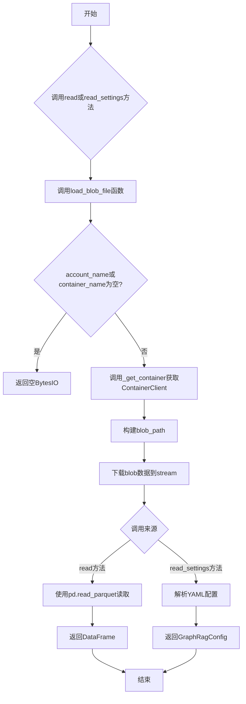
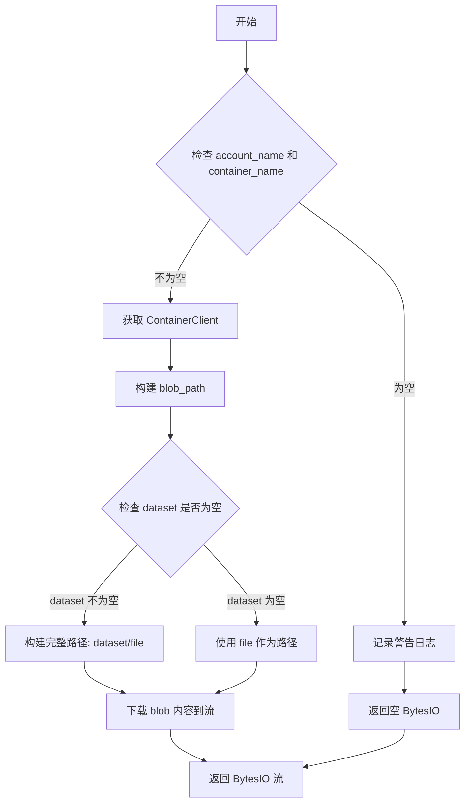
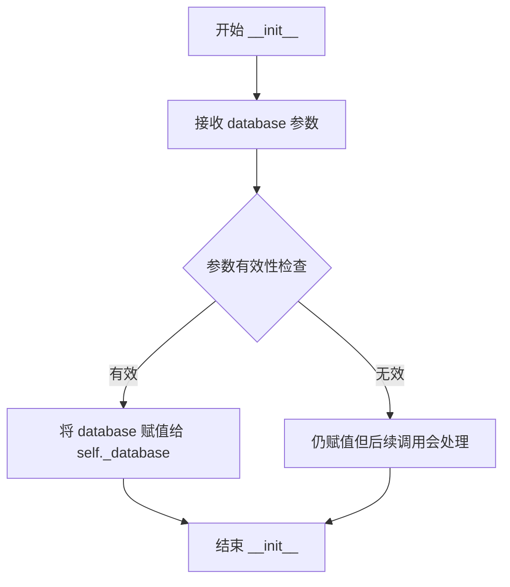
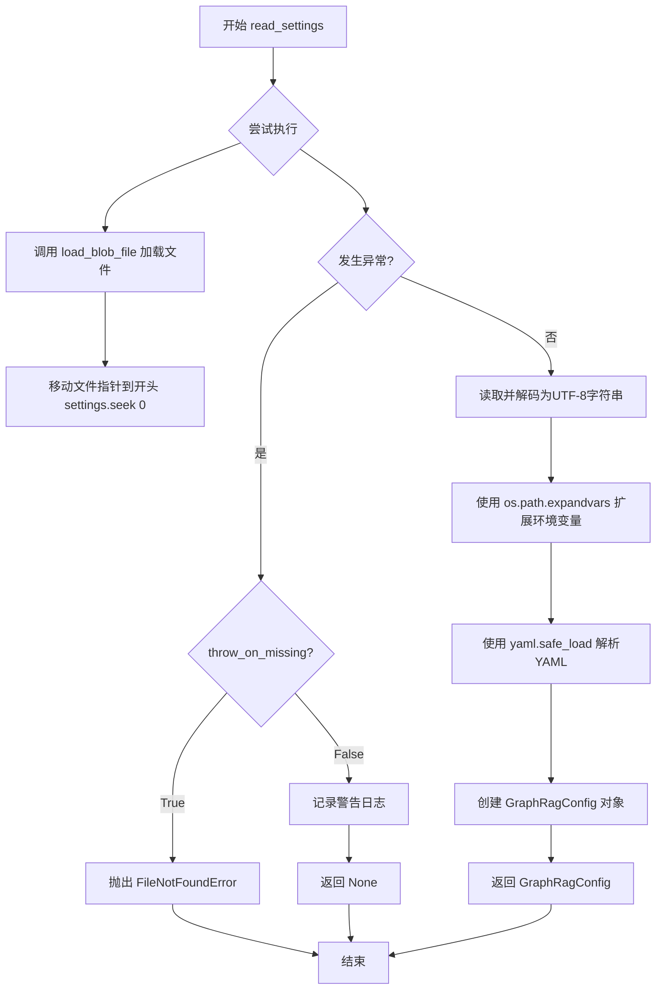

# `graphrag\unified-search-app\app\knowledge_loader\data_sources\blob_source.py` 详细设计文档

这是一个Azure Blob Storage数据源模块，用于从Blob Storage加载配置文件和Parquet数据文件，实现了Datasource接口以支持数据读取和设置加载功能。

## 整体流程



## 类结构

```
Datasource (抽象基类/接口)
└── BlobDatasource
```

## 全局变量及字段


### `logger`
    
模块级日志记录器，用于输出运行时日志信息

类型：`logging.Logger`
    


### `blob_account_name`
    
Blob存储账户名称，从default模块导入，可为空

类型：`str | None`
    


### `blob_container_name`
    
Blob存储容器名称，从default模块导入，可为空

类型：`str | None`
    


### `BlobDatasource._database`
    
数据库/容器路径，指定要访问的Blob存储中的数据集目录

类型：`str`
    
    

## 全局函数及方法


### `_get_container`

获取Azure Blob存储的容器客户端，并提供24小时缓存以避免重复创建连接。

参数：

- `account_name`：`str`，Azure Blob存储账户名称
- `container_name`：`str`，Azure Blob存储容器名称

返回值：`ContainerClient`，Azure Blob容器客户端，用于后续的Blob操作

#### 流程图

```mermaid
flowchart TD
    A[开始] --> B[检查缓存是否命中]
    B -->|缓存命中| C[直接返回缓存的ContainerClient]
    B -->|缓存未命中| D[构建账户URL: https://{account_name}.blob.core.windows.net]
    D --> E[使用DefaultAzureCredential获取凭证]
    E --> F[创建BlobServiceClient]
    F --> G[调用get_container_client获取ContainerClient]
    G --> H[缓存结果并返回]
```

#### 带注释源码

```python
@st.cache_data(ttl=60 * 60 * 24)  # 缓存24小时，避免频繁创建客户端
def _get_container(account_name: str, container_name: str) -> ContainerClient:
    """Return container from blob storage."""
    print("LOGIN---------------")  # noqa T201
    
    # 构建Azure Blob存储的账户URL
    account_url = f"https://{account_name}.blob.core.windows.net"
    
    # 使用DefaultAzureCredential进行Azure身份验证
    # 支持Managed Identity、Service Principal、环境变量等多种认证方式
    default_credential = DefaultAzureCredential()
    
    # 创建BlobServiceClient，用于与Azure Blob存储服务交互
    blob_service_client = BlobServiceClient(account_url, credential=default_credential)
    
    # 获取指定容器名称的ContainerClient
    # ContainerClient用于执行容器级别的操作，如列出Blob、下载Blob等
    return blob_service_client.get_container_client(container_name)
```


### `load_blob_prompt_config`

该函数用于从 Azure Blob 存储中加载提示配置文件。它接受数据集名称和可选的账户名称与容器名称作为参数，遍历指定数据集下的 prompts 目录，读取所有 YAML/文本配置文件，并返回一个以文件名（不含扩展名）为键、文件内容为值的字典。

参数：

- `dataset`：`str`，数据集名称，用于构建 Blob 存储路径前缀（格式：{dataset}/prompts/...）
- `account_name`：`str | None`，Azure Blob 存储账户名称，默认为 `blob_account_name`（从 default 模块导入）
- `container_name`：`str | None`，Azure Blob 容器名称，默认为 `blob_container_name`（从 default 模块导入）

返回值：`dict[str, str]`，返回提示配置字典，键为文件名（不含扩展名），值为文件内容的 UTF-8 解码字符串；如果 account_name 或 container_name 为 None，则返回空字典

#### 流程图

```mermaid
flowchart TD
    A[开始 load_blob_prompt_config] --> B{account_name 或 container_name 为 None?}
    B -->|是| C[返回空字典 {}]
    B -->|否| D[调用 _get_container 获取容器客户端]
    D --> E[构建前缀路径: {dataset}/prompts]
    E --> F[列出以该前缀开头的所有 Blob 文件]
    F --> G{遍历每个文件}
    G -->|文件1| H1[提取文件名并移除扩展名作为 map_name]
    H1 --> I1[下载 Blob 内容并解码为 UTF-8]
    I1 --> J1[添加到 prompts 字典]
    G -->|文件N| Hn[提取文件名并移除扩展名作为 map_name]
    Hn --> In[下载 Blob 内容并解码为 UTF-8]
    Jn[添加到 prompts 字典]
    G -->|遍历完成| K[返回 prompts 字典]
    C --> K
    J1 --> G
    Jn --> G
```

#### 带注释源码

```python
@st.cache_data(ttl=60 * 60 * 24)  # 使用 Streamlit 缓存，TTL 为 24 小时
def _get_container(account_name: str, container_name: str) -> ContainerClient:
    """Return container from blob storage."""
    print("LOGIN---------------")  # noqa T201
    account_url = f"https://{account_name}.blob.core.windows.net"
    # 使用 DefaultAzureCredential 进行 Azure 身份验证（支持 Managed Identity、CLI 等）
    default_credential = DefaultAzureCredential()
    blob_service_client = BlobServiceClient(account_url, credential=default_credential)
    return blob_service_client.get_container_client(container_name)


def load_blob_prompt_config(
    dataset: str,
    account_name: str | None = blob_account_name,  # 默认值从 default 模块导入
    container_name: str | None = blob_container_name,  # 默认值从 default 模块导入
) -> dict[str, str]:
    """Load blob prompt configuration."""
    # 参数校验：如果账户名或容器名为 None，直接返回空字典
    if account_name is None or container_name is None:
        return {}

    # 获取容器客户端（内部有缓存机制）
    container_client = _get_container(account_name, container_name)
    prompts = {}

    # 构建 Blob 路径前缀：{dataset}/prompts
    prefix = f"{dataset}/prompts"
    # 遍历该前缀下的所有 Blob 文件
    for file in container_client.list_blobs(name_starts_with=prefix):
        # 提取文件名：取最后一段并移除扩展名（如 "prompts/summarize.txt" -> "summarize"）
        map_name = file.name.split("/")[-1].split(".")[0]
        # 下载文件内容并解码为 UTF-8 字符串
        prompts[map_name] = (
            container_client.download_blob(file.name).readall().decode("utf-8")
        )

    return prompts
```


### `load_blob_file`

该函数用于从 Azure Blob Storage 容器中加载指定的文件，并将其内容以 BytesIO 流的形式返回，支持可选的数据集前缀和凭据配置。

参数：

- `dataset`：`str | None`，数据集名称，用于构建 blob 路径的前缀
- `file`：`str | None`，要加载的文件名
- `account_name`：`str | None`，Azure 存储账户名称，默认为 `blob_account_name`
- `container_name`：`str | None`，Azure 存储容器名称，默认为 `blob_container_name`

返回值：`BytesIO`，包含文件内容的字节流对象

#### 流程图



#### 带注释源码

```python
def load_blob_file(
    dataset: str | None,      # 数据集名称，作为 blob 路径的前缀
    file: str | None,         # 要加载的文件名
    account_name: str | None = blob_account_name,  # Azure 存储账户名称，默认值从模块导入
    container_name: str | None = blob_container_name,  # Azure 容器名称，默认值从模块导入
) -> BytesIO:                 # 返回包含文件内容的字节流
    """Load blob file from container."""
    # 初始化一个空的字节流对象
    stream = io.BytesIO()

    # 检查必要的凭据参数是否提供
    if account_name is None or container_name is None:
        logger.warning("No account name or container name provided")
        return stream  # 返回空流

    # 获取容器客户端实例
    container_client = _get_container(account_name, container_name)
    
    # 根据 dataset 是否存在构建 blob 路径
    # 如果 dataset 存在，路径格式为 "dataset/file"，否则直接使用 "file"
    blob_path = f"{dataset}/{file}" if dataset is not None else file

    # 将 blob 内容读取到流中
    container_client.download_blob(blob_path).readinto(stream)

    # 返回填充了内容的字节流
    return stream
```


### `BlobDatasource.__init__`

初始化 `BlobDatasource` 实例，用于从 Azure Blob 存储中读取数据。该方法接收数据库名称并将其存储为实例变量，供后续的 `read` 和 `read_settings` 方法使用。

参数：

- `database`：`str`，要连接的 Blob 存储中的数据库/容器路径名称

返回值：`None`，无返回值，仅初始化实例状态

#### 流程图



#### 带注释源码

```python
def __init__(self, database: str):
    """Init method definition."""
    # 将传入的 database 参数存储为实例变量 _database
    # 该变量将在 read() 和 read_settings() 方法中用于构建 Blob 路径
    self._database = database
```


### `BlobDatasource.read`

读取Parquet表数据，支持可选列筛选和表缺失处理。

参数：

-  `table`：`str`，要读取的Parquet表名称（不含文件扩展名）
-  `throw_on_missing`：`bool`，默认为False，当表不存在时是否抛出FileNotFoundError异常
-  `columns`：`list[str] | None`，默认为None，要读取的列名列表，None表示读取所有列

返回值：`pd.DataFrame`，返回读取的Parquet表数据，如果表不存在且throw_on_missing为False则返回空DataFrame

#### 流程图

```mermaid
flowchart TD
    A[开始 read 方法] --> B[调用 load_blob_file 加载 Parquet 文件]
    B --> C{是否发生异常}
    C -->|是| D{throw_on_missing?}
    D -->|True| E[构造错误信息: Table {table} does not exist]
    E --> F[抛出 FileNotFoundError]
    D -->|False| G[记录警告日志: Table {table} does not exist]
    G --> H{columns 是否为 None}
    H -->|True| I[返回空 DataFrame]
    H -->|False| J[返回带列名的空 DataFrame]
    C -->|否| K[调用 pd.read_parquet 读取数据]
    K --> L[返回 DataFrame]
    F --> M[结束]
    I --> M
    J --> M
    L --> M
```

#### 带注释源码

```python
def read(
    self,
    table: str,
    throw_on_missing: bool = False,
    columns: list[str] | None = None,
) -> pd.DataFrame:
    """Read file from container."""
    try:
        # 尝试从blob存储加载指定表名的Parquet文件
        # 拼接完整路径: {database}/{table}.parquet
        data = load_blob_file(self._database, f"{table}.parquet")
    except Exception as err:
        # 异常处理分支：表文件不存在或读取失败
        if throw_on_missing:
            # 如果设置了throw_on_missing=True，则抛出明确的FileNotFoundError
            error_msg = f"Table {table} does not exist"
            raise FileNotFoundError(error_msg) from err
        # 否则记录警告日志并返回空DataFrame
        logger.warning("Table %s does not exist", table)
        # 根据columns参数决定返回空DataFrame的结构
        return pd.DataFrame(columns=columns) if columns else pd.DataFrame()

    # 正常读取：使用pandas读取Parquet数据
    # columns参数传递给pd.read_parquet实现列筛选
    return pd.read_parquet(data, columns=columns)
```


### `BlobDatasource.read_settings`

读取配置文件，从Blob存储中加载YAML格式的设置文件，解析环境变量后转换为GraphRagConfig对象。

参数：

- `file`：`str`，配置文件名（相对于数据库路径）
- `throw_on_missing`：`bool`，当文件不存在时是否抛出异常，默认为False

返回值：`GraphRagConfig | None`，成功返回GraphRagConfig配置对象，失败或文件不存在时返回None

#### 流程图



#### 带注释源码

```python
def read_settings(
    self,
    file: str,
    throw_on_missing: bool = False,
) -> GraphRagConfig | None:
    """Read settings from container."""
    try:
        # 1. 调用 load_blob_file 从 Blob 存储加载文件为 BytesIO 流
        settings = load_blob_file(self._database, file)
        
        # 2. 将文件指针移动到流的开头，准备从头读取
        settings.seek(0)
        
        # 3. 读取二进制内容并解码为 UTF-8 字符串
        str_settings = settings.read().decode("utf-8")
        
        # 4. 使用 os.path.expandvars 展开字符串中的环境变量
        #    例如: ${HOME}/config 会展开为实际路径
        config = os.path.expandvars(str_settings)
        
        # 5. 使用 yaml.safe_load 解析 YAML 格式的配置字符串
        settings_yaml = yaml.safe_load(config)
        
        # 6. 使用解析出的 YAML 数据创建 GraphRagConfig 配置对象
        graphrag_config = GraphRagConfig(**settings_yaml)
    except Exception as err:
        # 7. 异常处理：根据 throw_on_missing 决定行为
        if throw_on_missing:
            # 如果要求严格模式，抛出文件不存在错误
            error_msg = f"File {file} does not exist"
            raise FileNotFoundError(error_msg) from err
        
        # 否则记录警告日志并返回 None
        logger.warning("File %s does not exist", file)
        return None

    # 8. 返回解析后的 GraphRagConfig 配置对象
    return graphrag_config
```

## 关键组件


### 惰性加载机制

使用`@st.cache_data(ttl=60 * 60 * 24)`装饰器实现容器客户端的缓存，通过24小时的TTL控制实现惰性加载，避免重复创建Azure Blob容器客户端。

### Blob文件加载器

`load_blob_file`函数负责从Azure Blob存储中按需加载文件，支持动态指定数据集和文件名，返回BytesIO流用于后续数据处理。

### Blob配置加载器

`load_blob_prompt_config`函数从Blob存储的指定路径加载提示配置，支持按数据集隔离配置文件的组织结构。

### BlobDatasource数据源类

实现`Datasource`接口的类，封装了从Blob存储读取Parquet表格数据和YAML配置文件的能力，提供错误处理和缺失文件处理机制。


## 问题及建议


### 已知问题

-   **缓存对象不当**：`_get_container`函数使用`@st.cache_data`缓存`ContainerClient`对象，但该对象包含连接状态和凭证信息，不适合直接缓存，可能导致凭证过期后仍使用旧连接。
-   **硬编码调试代码**：代码中存在`print("LOGIN---------------")`调试语句，不应出现在生产代码中。
-   **异常处理过于宽泛**：使用`except Exception`捕获所有异常并仅记录警告，可能隐藏真正的错误原因，影响问题排查。
-   **资源未正确释放**：`load_blob_file`返回`BytesIO`流，调用方需要在使用完毕后显式关闭，否则可能导致资源泄漏。
-   **日志输出不一致**：代码中混合使用`logger.warning`和`print`，日志输出目标不统一，不利于统一日志管理。
-   **配置展开安全风险**：`read_settings`中使用`os.path.expandvars`展开环境变量，若配置文件被恶意注入环境变量语法，可能导致意外的环境变量替换。
-   **缺少重试机制**：Blob存储的下载操作没有实现重试逻辑，网络波动时容易失败。
-   **类型提示不完整**：部分变量如`prefix`等缺少类型提示，影响代码可读性和静态分析。

### 优化建议

-   **重构缓存策略**：将缓存改为缓存凭证或账户信息，而非`ContainerClient`对象，或实现自定义缓存逻辑处理凭证刷新。
-   **移除调试代码**：删除所有`print`语句，统一使用日志记录。
-   **细化异常处理**：根据不同异常类型进行针对性处理，如`ResourceNotFoundError`用于文件不存在的情况，提供更精确的错误信息。
-   **使用上下文管理器**：将`load_blob_file`改为生成器模式或返回可关闭的对象，确保资源正确释放。
-   **统一日志规范**：移除所有`print`语句，使用`logger`统一记录。
-   **安全化配置读取**：使用安全的配置解析方式，避免环境变量展开带来的安全风险，或在展开前验证内容。
-   **添加重试机制**：使用`tenacity`等库为Blob操作添加重试逻辑，处理临时性网络错误。
-   **完善类型提示**：为所有函数参数和返回值添加完整的类型提示，提高代码质量。
-   **添加超时控制**：为Blob操作设置合理的超时时间，避免长时间挂起。
-   **考虑连接池**：对于频繁调用场景，考虑实现连接池或复用`BlobServiceClient`实例。


## 其它


### 设计目标与约束

本模块的设计目标是提供统一的Azure Blob Storage数据源接口，支持读取parquet数据文件、YAML配置文件和prompt文本文件。约束条件包括：依赖DefaultAzureCredential进行身份验证，默认缓存容器客户端24小时，必须提供account_name和container_name参数（可通过default.py中的全局变量或环境变量提供）。

### 错误处理与异常设计

错误处理采用分层策略：对于关键操作（如read_settings的throw_on_missing=True），抛出FileNotFoundError并携带明确错误信息；对于非关键操作，记录warning日志并返回空DataFrame或None。load_blob_file在account_name或container_name为None时返回空BytesIO并记录警告。所有Azure SDK异常被捕获后转换为项目自定义异常，保持异常链路（from err）以便于调试。

### 数据流与状态机

数据流遵循以下路径：外部调用 → BlobDatasource.read/read_settings → load_blob_file → _get_container（获取ContainerClient）→ Azure Blob下载 → 返回BytesIO或DataFrame。状态机涉及缓存状态：首次调用_get_container时创建ContainerClient并缓存，之后24小时内复用。list_blobs遍历产生器用于发现prompts文件，download_blob支持流式读取。

### 外部依赖与接口契约

核心依赖包括：azure-identity（DefaultAzureCredential）、azure-storage-blob（BlobServiceClient/ContainerClient）、pandas（read_parquet）、yaml（safe_load）、streamlit（@st.cache_data）。接口契约方面，Datasource基类定义read(table, throw_on_missing, columns)和read_settings(file, throw_on_missing)方法，返回pd.DataFrame或GraphRagConfig对象。

### 性能考虑

_get_container使用@st.cache_data(ttl=60*60*24)实现24小时缓存，避免重复创建BlobServiceClient。load_blob_file返回BytesIO流式对象，避免一次性加载大文件到内存。list_blobs使用name_starts_with过滤器减少网络请求。潜在优化点：对于频繁读取的小文件可考虑本地缓存，对于大parquet文件可使用pyarrow的RemoteDataset直接读取。

### 安全性考虑

依赖DefaultAzureCredential支持多种身份验证方式（Managed Identity、Service Principal、环境变量等）。建议在生产环境使用Managed Identity，避免在代码中硬编码凭据。Azure Storage默认启用HTTPS传输加密。容器和blob的访问控制依赖于Azure AD角色分配（需配置Storage Blob Data Reader角色）。

### 配置管理

配置通过三层层级传递：默认值（default.py中的blob_account_name和blob_container_name）→ 函数参数（account_name/container_name）→ 运行时环境变量（os.path.expandvars用于settings文件）。GraphRagConfig从YAML文件反序列化，支持环境变量展开（${VAR_NAME}语法）。

### 版本兼容性

代码使用Python 3.10+类型注解（str | None语法）。关键依赖版本约束：azure-identity、azure-storage-blob需兼容Azure SDK v12+，pandas需支持pyarrow后端。streamlit的cache_data在较新版本中行为可能有变化。

### 测试策略建议

建议添加单元测试覆盖：load_blob_file参数为None时的边界行为、BlobDatasource.read不存在表时的返回值、read_settings异常捕获逻辑。集成测试需要Mock Azure SDK或使用Azure Storage Emulator。_get_container的缓存机制需单独测试缓存失效场景。

### 部署注意事项

部署时需确保运行环境中已配置Azure身份验证（ Managed Identity或AZURE_TENANT_ID/CLIENT_ID/CLIENT_SECRET环境变量）。容器名称需符合Azure命名规范（小写、3-63字符）。list_blobs和download_blob操作需要网络连通性。建议在Kubernetes环境中使用Workload Identity。

### 监控与日志

logging模块配置：根logger级别INFO，azure SDK logger级别WARNING以减少噪声。关键操作记录INFO级别日志（如"LOGIN---------------"调试语句）。建议添加OpenTelemetry追踪download_blob的耗时，便于性能监控。

    