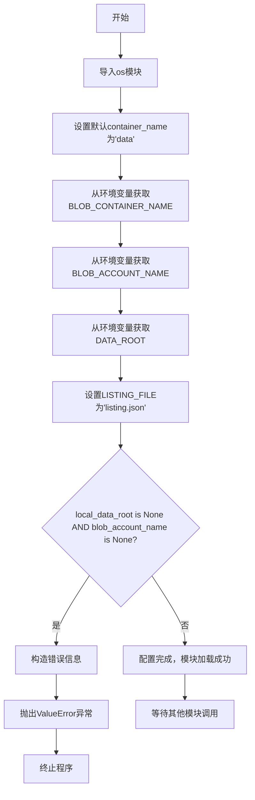

# `graphrag\unified-search-app\app\knowledge_loader\data_sources\default.py` 详细设计文档

这是一个数据源配置模块，用于管理和验证数据存储的环境变量配置。代码支持从本地文件系统(local_data_root)或Azure Blob Storage(blob_account_name)两种方式获取数据，并在启动时验证至少一种数据源已被正确配置，否则抛出ValueError异常。

## 整体流程



## 类结构

```
data_sources.py (模块文件)
└── 无类定义（纯配置模块）
```

## 全局变量及字段


### `container_name`
    
默认的数据容器名称常量，值为 "data"

类型：`str`
    


### `blob_container_name`
    
Azure Blob存储的容器名称，从环境变量BLOB_CONTAINER_NAME获取，默认为container_name的值

类型：`str`
    


### `blob_account_name`
    
Azure Blob存储账户名称，从环境变量BLOB_ACCOUNT_NAME获取，可能为None

类型：`str | None`
    


### `local_data_root`
    
本地数据根目录路径，从环境变量DATA_ROOT获取，可能为None

类型：`str | None`
    


### `LISTING_FILE`
    
列表文件的名称常量，值为 "listing.json"

类型：`str`
    


### `error_message`
    
当DATA_ROOT和BLOB_ACCOUNT_NAME都未设置时的错误信息字符串

类型：`str`
    


    

## 全局函数及方法


## 关键组件


### 环境变量配置

配置Azure Blob存储和本地数据存储的连接参数，从环境变量读取Blob账户名、容器名和数据根目录。

### 错误处理与验证

验证必需的环境变量，当DATA_ROOT和BLOB_ACCOUNT_NAME都未设置时抛出ValueError异常，确保程序在有效配置下运行。

### 常量定义

定义数据列表文件名LISTING_FILE为"listing.json"，用于后续数据源的枚举和检索。


## 问题及建议


### 已知问题

-   **硬编码默认值**：`container_name = "data"` 硬编码在代码中，缺乏灵活性，应考虑从环境变量读取或作为可配置参数
-   **环境变量验证不完整**：仅检查变量是否为 None，但未验证空字符串或无效值的情况（如 `blob_account_name = ""`）
-   **配置冲突处理不明确**：当同时设置了 `DATA_ROOT` 和 `BLOB_ACCOUNT_NAME` 时，代码没有明确的优先级或选择逻辑
-   **缺乏运行时验证**：模块导入时即执行验证逻辑，产生副作用，影响模块的可测试性和延迟加载
-   **错误信息不够友好**：仅告知需要设置环境变量，未说明各变量的用途及正确配置方式

### 优化建议

-   为 `blob_container_name`、`blob_account_name`、`local_data_root` 添加类型注解，提升代码可读性
-   增加对空字符串的验证逻辑，使用 `os.getenv(..., None)` 并结合 `str.strip()` 检查非空
-   考虑添加配置选择逻辑或日志记录，明确告知当前使用的是本地数据源还是云端 Blob 存储
-   将验证逻辑封装为函数或类方法，支持延迟执行，便于单元测试和配置校验
-   完善错误信息，包含环境变量的用途说明及示例，提升开发者体验

## 其它


### 设计目标与约束

本模块旨在为数据源访问提供统一的配置管理，支持本地文件系统和Azure Blob Storage两种数据存储方式。设计约束包括：必须配置DATA_ROOT或BLOB_ACCOUNT_NAME环境变量至少其一，不允许同时缺失。

### 错误处理与异常设计

当DATA_ROOT和BLOB_ACCOUNT_NAME环境变量均未设置时，抛出ValueError异常，错误消息明确提示需要配置的环境变量。异常信息格式为："Either DATA_ROOT or BLOB_ACCOUNT_NAME environment variable must be set."

### 数据流与状态机

本模块无复杂状态机，属于静态配置加载阶段。配置加载流程：读取环境变量 → 验证必要配置 → 完成初始化。数据流向为环境变量 → 模块级变量 → 供其他模块引用。

### 外部依赖与接口契约

外部依赖：
- os模块：用于环境变量读取
- 环境变量系统：DATA_ROOT（可选）、BLOB_ACCOUNT_NAME（可选）、BLOB_CONTAINER_NAME（可选，默认值"data"）

接口契约：
- blob_container_name：导出字符串，供Azure Blob存储访问使用
- blob_account_name：导出字符串，Azure存储账户名
- local_data_root：导出字符串，本地数据根目录
- LISTING_FILE：导出常量，列表文件名

### 安全性考虑

- BLOB_ACCOUNT_NAME若配置应视为敏感信息，需妥善保管
- local_data_root指向的路径应具有适当的访问权限控制
- 环境变量中不应存储明文密钥，建议使用Azure Key Vault等密钥管理服务

### 配置管理

配置通过环境变量管理，支持默认值：
- BLOB_CONTAINER_NAME默认值为"data"
- DATA_ROOT和BLOB_ACCOUNT_NAME必须至少配置一个

### 使用场景

- 本地开发：配置DATA_ROOT环境变量指向本地数据目录
- 云端部署：配置BLOB_ACCOUNT_NAME和BLOB_CONTAINER_NAME访问Azure Blob Storage

### 兼容性考虑

当前仅支持两种数据源模式，未来可扩展支持S3、GCS等其他云存储服务。设计时考虑了向后兼容性，新增数据源类型时不应影响现有配置。


    