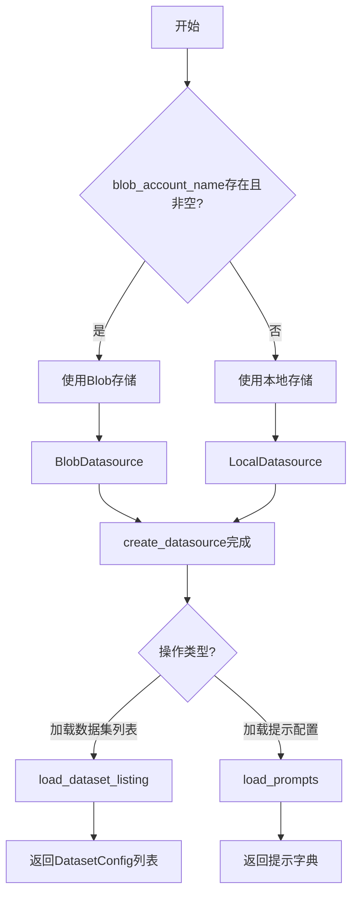
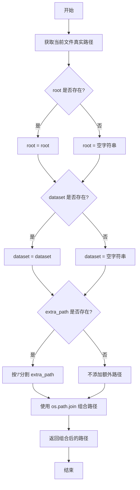
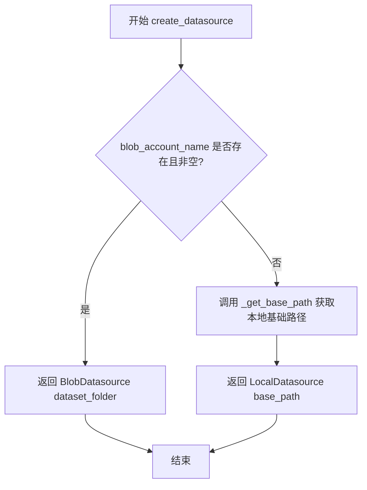
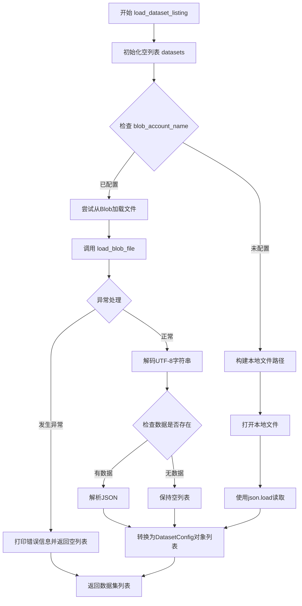
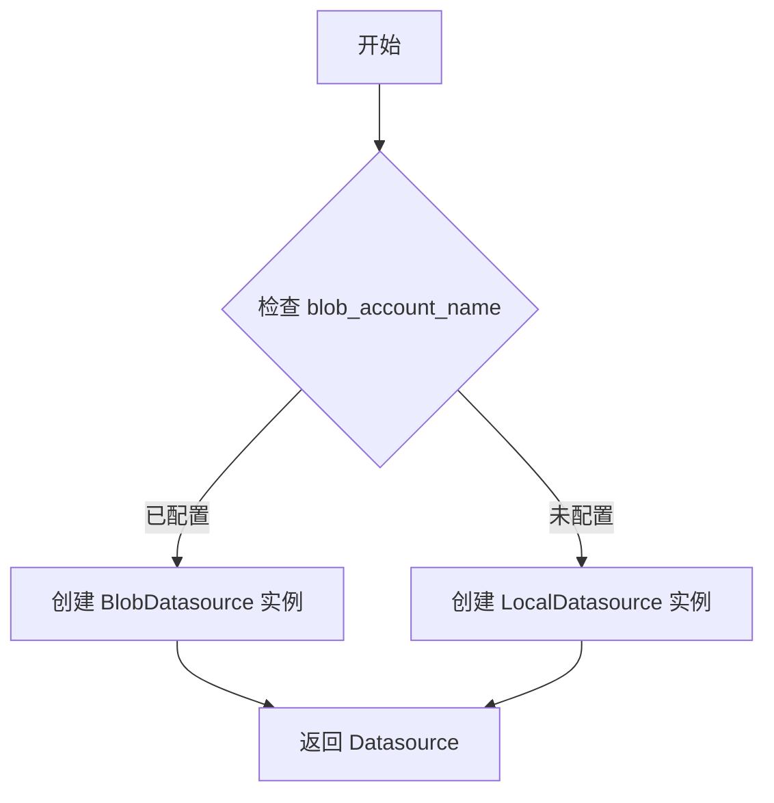
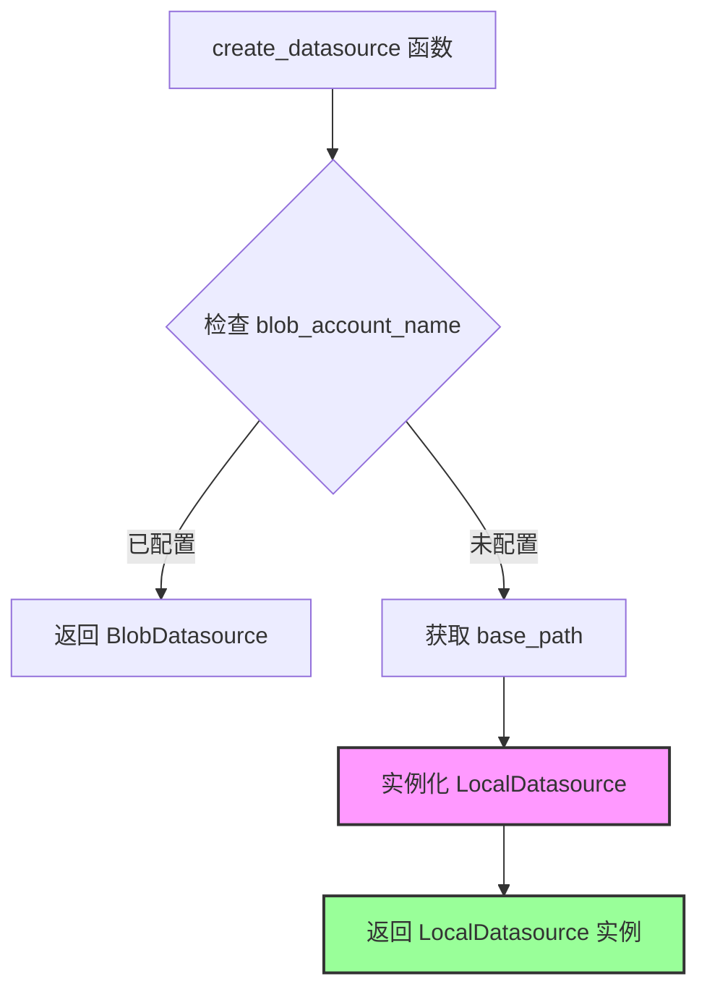
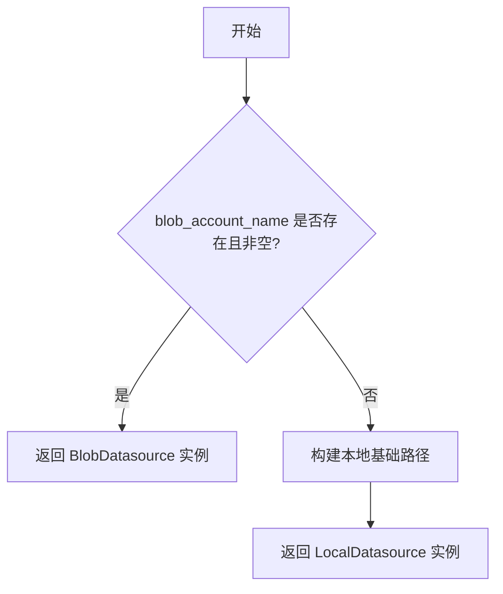
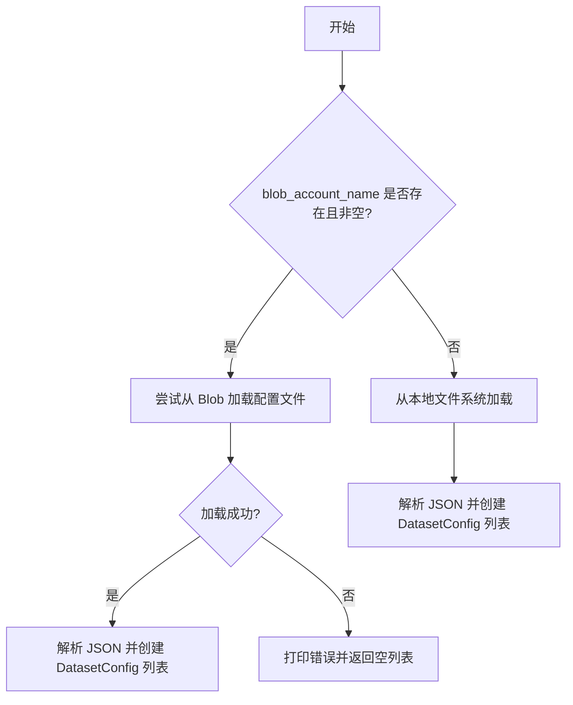
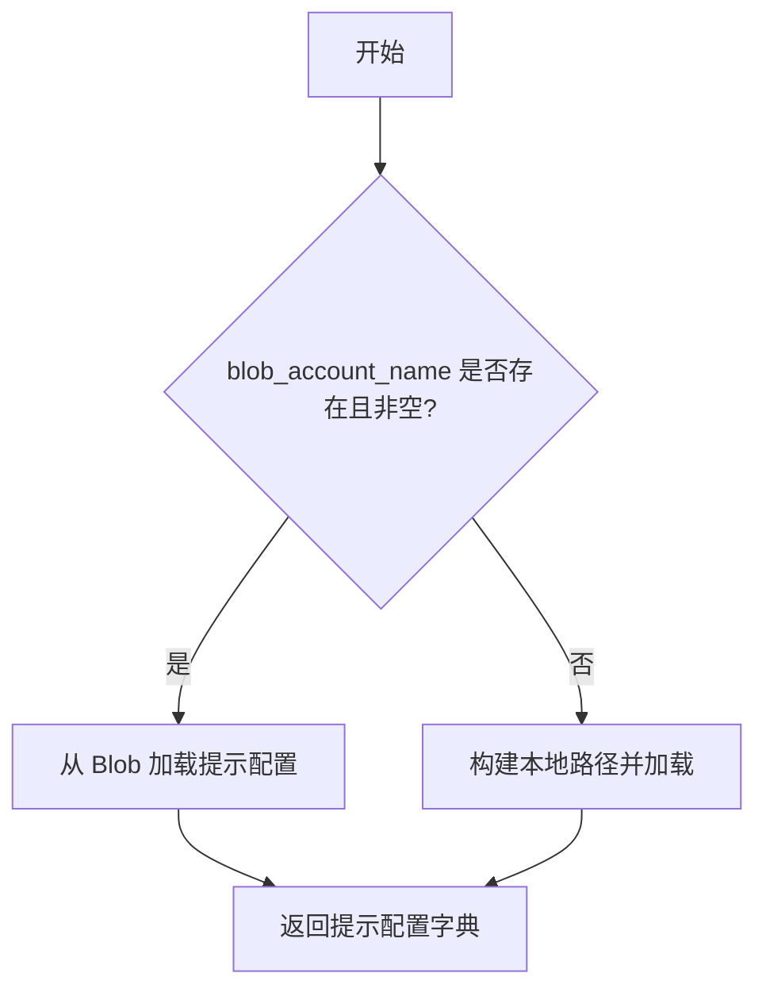
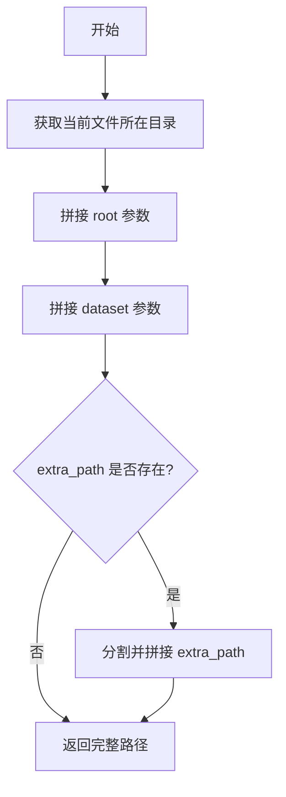

# `graphrag\unified-search-app\app\knowledge_loader\data_sources\loader.py` 详细设计文档

一个数据集加载器模块，用于从本地文件系统或Azure Blob存储加载数据集配置和提示文件，根据blob_account_name配置自动选择数据源类型。

## 整体流程



## 类结构

```
Datasource (抽象基类/协议)
├── BlobDatasource (Blob存储数据源)
└── LocalDatasource (本地文件数据源)

DatasetConfig (数据配置模型)
ModelBase (抽象基类，未直接使用)
```

## 全局变量及字段


### `logger`
    
模块日志记录器，用于记录运行时信息

类型：`logging.Logger`
    


### `LISTING_FILE`
    
数据集列表文件名，通常为listing.json

类型：`str`
    


### `blob_account_name`
    
Azure Blob存储账户名称，若为None或空则使用本地数据源

类型：`str | None`
    


### `local_data_root`
    
本地数据根目录路径，用于构建本地文件路径

类型：`str | None`
    


### `BlobDatasource.dataset_folder`
    
Blob存储中数据集的文件夹路径

类型：`str`
    


### `LocalDatasource.base_path`
    
本地数据存储的基础路径

类型：`str`
    


### `DatasetConfig.fields_from_typing`
    
数据集配置数据类，包含数据集的各种元数据字段（如名称、路径等）

类型：`dataclass`
    
    

## 全局函数及方法


### `_get_base_path`

为给定数据集和额外路径构造并返回基础路径。

参数：

- `dataset`：`str | None`，数据集名称
- `root`：`str | None`，根路径
- `extra_path`：`str | None`，额外的路径，默认为 None

返回值：`str`，返回构建的基础路径

#### 流程图



#### 带注释源码

```
def _get_base_path(
    dataset: str | None, root: str | None, extra_path: str | None = None
) -> str:
    """Construct and return the base path for the given dataset and extra path."""
    # 使用 os.path.join 组合路径：
    # 1. 获取当前文件所在目录的真实路径
    # 2. 拼接 root 参数（如果存在）
    # 3. 拼接 dataset 参数（如果存在）
    # 4. 如果 extra_path 存在，按 '/' 分割后展开追加
    return os.path.join(  # noqa: PTH118
        os.path.dirname(os.path.realpath(__file__)),  # noqa: PTH120
        root if root else "",          # 如果 root 存在则使用，否则使用空字符串
        dataset if dataset else "",    # 如果 dataset 存在则使用，否则使用空字符串
        *(extra_path.split("/") if extra_path else []),  # 展开 extra_path 的各部分
    )
```


### `create_datasource`

返回数据源实例，用于从本地存储或 Azure Blob 存储读取 Parquet 文件。函数根据 `blob_account_name` 是否配置来决定创建 `BlobDatasource` 还是 `LocalDatasource`。

参数：

- `dataset_folder`：`str`，数据集文件夹路径，用于指定数据源读取的数据集目录

返回值：`Datasource`，数据源对象，根据配置返回 `BlobDatasource`（Blob 存储）或 `LocalDatasource`（本地存储）实例

#### 流程图



#### 带注释源码

```python
def create_datasource(dataset_folder: str) -> Datasource:
    """Return a datasource that reads from a local or blob storage parquet file."""
    # 检查是否配置了 Azure Blob 存储账户名称
    if blob_account_name is not None and blob_account_name != "":
        # 如果配置了 Blob 账户，返回 BlobDatasource 实例
        return BlobDatasource(dataset_folder)

    # 未配置 Blob 账户，构建本地数据路径
    base_path = _get_base_path(dataset_folder, local_data_root)
    # 返回本地数据源实例
    return LocalDatasource(base_path)
```


### `load_dataset_listing`

该函数负责从本地文件系统或 Azure Blob 存储加载数据集列表配置文件（通常为 JSON 格式），并将其解析为 `DatasetConfig` 对象列表。根据 `blob_account_name` 配置决定数据源：无 blob 配置时从本地路径读取，有 blob 配置时从云端加载，同时包含异常处理机制确保加载失败时返回空列表。

参数：

- 无参数

返回值：`list[DatasetConfig]`，返回数据集配置对象列表，每个元素包含数据集的名称、路径、类型等配置信息

#### 流程图



#### 带注释源码

```python
def load_dataset_listing() -> list[DatasetConfig]:
    """Load dataset listing file."""
    # 初始化空列表用于存储数据集配置
    datasets = []
    
    # 判断是否配置了Azure Blob存储账户
    if blob_account_name is not None and blob_account_name != "":
        try:
            # 从Blob存储加载列表文件（LISTING_FILE）
            blob = load_blob_file(None, LISTING_FILE)
            # 获取Blob内容并解码为UTF-8字符串
            datasets_str = blob.getvalue().decode("utf-8")
            # 检查字符串是否有内容
            if datasets_str:
                # 解析JSON字符串为Python列表
                datasets = json.loads(datasets_str)
        except Exception as e:  # noqa: BLE001
            # 捕获异常并打印错误信息
            print(f"Error loading dataset config: {e}")  # noqa T201
            # 加载失败时返回空列表
            return []
    else:
        # 未配置Blob时，从本地文件系统加载
        # 构建本地列表文件的完整路径
        base_path = _get_base_path(None, local_data_root, LISTING_FILE)
        # 打开并读取JSON文件
        with open(base_path, "r") as file:  # noqa: UP015, PTH123
            datasets = json.load(file)

    # 将字典列表转换为DatasetConfig对象列表并返回
    return [DatasetConfig(**d) for d in datasets]
```


### `load_prompts`

该函数用于加载特定数据集的提示配置，支持从 Azure Blob 存储或本地文件系统读取配置，并返回包含提示信息的字典。

参数：

- `dataset`：`str`，要加载提示配置的数据集名称

返回值：`dict[str, str]`，返回特定数据集的提示配置字典，键为提示名称，值为提示内容

#### 流程图

```mermaid
flowchart TD
    A[开始 load_prompts] --> B{检查 blob_account_name}
    B -->|blob_account_name 存在且非空| C[调用 load_blob_prompt_config(dataset)]
    C --> D[返回 blob 配置]
    B -->|否则| E[调用 _get_base_path 构建本地路径]
    E --> F[路径: dataset + local_data_root + prompts]
    F --> G[调用 load_local_prompt_config(base_path)]
    G --> H[返回本地配置]
    D --> I[结束]
    H --> I
```

#### 带注释源码

```python
def load_prompts(dataset: str) -> dict[str, str]:
    """Return the prompts configuration for a specific dataset.
    
    根据配置决定从 Azure Blob 存储或本地文件系统加载提示配置。
    
    参数:
        dataset: 数据集名称，用于定位对应的提示配置文件
        
    返回:
        包含提示名称到提示内容映射的字典
    """
    # 检查是否配置了 Azure Blob 存储账户
    if blob_account_name is not None and blob_account_name != "":
        # 使用 Blob 存储方式加载提示配置
        return load_blob_prompt_config(dataset)

    # 构建本地提示配置的基础路径
    # 路径格式: {当前文件目录}/{local_data_root}/{dataset}/prompts
    base_path = _get_base_path(dataset, local_data_root, "prompts")
    
    # 使用本地方式加载提示配置
    return load_local_prompt_config(base_path)
```

#### 相关依赖函数信息

| 函数名 | 所属模块 | 功能描述 |
|--------|----------|----------|
| `blob_account_name` | knowledge_loader.data_sources.default | 全局变量，Azure Blob 存储账户名称 |
| `load_blob_prompt_config` | knowledge_loader.data_sources.blob_source | 从 Blob 存储加载提示配置 |
| `load_local_prompt_config` | knowledge_loader.data_sources.local_source | 从本地文件系统加载提示配置 |
| `_get_base_path` | 本模块 | 构建文件基础路径的辅助函数 |

#### 设计特点与潜在优化

1. **双模式支持**：同时支持 Blob 存储和本地文件两种数据源，具有良好的灵活性
2. **配置驱动**：根据 `blob_account_name` 是否配置自动选择数据源
3. **潜在优化**：
   - 缺少缓存机制，频繁调用时可能重复读取文件
   - 错误处理较为简单，未区分不同类型的异常
   - 未验证返回的字典内容是否符合预期格式


# 设计文档提取结果

## 说明

根据提供的代码，我需要提取 `BlobDatasource` 的详细信息。然而，当前提供的代码片段 **仅包含 `BlobDatasource` 的导入语句**，并未包含其具体实现。`BlobDatasource` 类定义在 `knowledge_loader.data_sources.blob_source` 模块中，但该模块的源代码未在当前代码片段中提供。

以下是当前代码中与 `BlobDatasource` 相关的上下文信息：

---

### `loader.py` 中对 `BlobDatasource` 的引用

#### 带注释源码

```python
# 从 blob_source 模块导入 BlobDatasource 类
# 该类的具体实现未在此代码片段中展示
from knowledge_loader.data_sources.blob_source import (
    BlobDatasource,           # 需要提取详细信息的类
    load_blob_file,           # 加载 Blob 文件的函数
    load_blob_prompt_config,  # 加载 Blob 提示配置的函数
)

# ...

def create_datasource(dataset_folder: str) -> Datasource:
    """Return a datasource that reads from a local or blob storage parquet file."""
    # 如果配置了 Blob 账户名称，则返回 BlobDatasource 实例
    if blob_account_name is not None and blob_account_name != "":
        return BlobDatasource(dataset_folder)  # 实例化 BlobDatasource

    # 否则返回 LocalDatasource
    base_path = _get_base_path(dataset_folder, local_data_root)
    return LocalDatasource(base_path)
```

---

## 提取结果

由于源代码不完整，以下信息基于代码上下文推断：

### `BlobDatasource`

从导入和使用方式推断，这是一个用于读取 Azure Blob 存储中 Parquet 文件的数据源类。

#### 推断信息

| 属性 | 推断内容 |
|------|----------|
| **名称** | `BlobDatasource` |
| **类型** | 类 (Class) |
| **参数** | `dataset_folder: str` - 数据集文件夹路径 |
| **返回值** | `Datasource` 类型的数据源实例 |

#### 流程图



---

## 建议

要获取 `BlobDatasource` 的完整设计文档，需要提供以下内容：

1. **`knowledge_loader/data_sources/blob_source.py`** 模块的完整源代码
2. **`BlobDatasource` 类的字段定义**
3. **`BlobDatasource` 类的方法实现**
4. **相关的接口定义** (`Datasource` 接口)

请提供 `blob_source.py` 模块的源代码，以便完成完整的详细设计文档提取。


### `LocalDatasource`

本地数据源类，用于从本地文件系统读取parquet格式的数据集，实现Datasource接口。由 `create_datasource` 函数在检测到未配置Blob存储时实例化。

参数：

- `base_path`：`str`，本地数据集的基础路径，用于定位数据文件

返回值：`LocalDatasource`，返回LocalDatasource实例

#### 流程图



#### 带注释源码

```python
# 在 loader.py 中的使用方式
def create_datasource(dataset_folder: str) -> Datasource:
    """Return a datasource that reads from a local or blob storage parquet file."""
    # 检查是否配置了Blob存储账户
    if blob_account_name is not None and blob_account_name != "":
        # 如果配置了Blob存储，返回BlobDatasource
        return BlobDatasource(dataset_folder)

    # 未配置Blob存储时，使用本地数据源
    # 构建本地数据的基础路径
    base_path = _get_base_path(dataset_folder, local_data_root)
    
    # 创建LocalDatasource实例，传入基础路径
    # LocalDatasource 用于从本地文件系统读取parquet数据
    return LocalDatasource(base_path)
```

**注意**：由于 `LocalDatasource` 类的完整定义在 `knowledge_loader.data_sources.local_source` 模块中（该模块在代码中通过导入引用，但未在当前代码段中展示），以上信息基于代码中的使用方式进行推断。该类实现了 `Datasource` 接口，用于从本地文件系统加载数据集。


### DatasetConfig 数据类

描述：DatasetConfig 是一个数据类，用于表示数据集配置信息，通过字典展开方式实例化，用于在 `load_dataset_listing()` 函数中将 JSON 数据转换为结构化的配置对象。

参数：

- `**d`：`dict`，将字典解包为数据类字段，字段内容取决于 JSON 配置文件的结构，通常包含数据集的名称、路径、类型等配置信息

返回值：`DatasetConfig`，返回一个 DatasetConfig 数据类实例，包含从字典数据构建的配置对象

#### 流程图

```mermaid
flowchart TD
    A[load_dataset_listing 被调用] --> B{检查 blob_account_name 是否存在}
    B -->|是| C[从 Blob 存储加载 listing 文件]
    B -->|否| D[从本地路径加载 listing 文件]
    C --> E[解析 JSON 字符串为 Python 字典]
    D --> F[使用 json.load 读取 JSON 文件]
    E --> G[遍历字典列表]
    F --> G
    G --> H[对每个字典 d 调用 DatasetConfig(**d)]
    H --> I[创建 DatasetConfig 数据类实例]
    I --> J[返回 DatasetConfig 实例列表]
```

#### 带注释源码

```python
# 从 typing 模块导入 DatasetConfig 数据类
# 注意：DatasetConfig 本身在此文件中未定义，是从 knowledge_loader.data_sources.typing 导入的
# 它是一个 dataclass，用于存储数据集配置信息

# 在 load_dataset_listing() 函数中的使用方式：
# return [DatasetConfig(**d) for d in datasets]

# DatasetConfig 的典型用法（基于代码推断）：
# 1. 从 JSON 文件或 Blob 加载字典列表
# 2. 每个字典包含数据集的配置字段
# 3. 使用 **d 将字典解包为关键字参数传递给数据类构造函数
# 4. 创建多个 DatasetConfig 实例并返回列表

# 示例（假设的 DatasetConfig 定义，基于使用方式推断）：
# @dataclass
# class DatasetConfig:
#     name: str          # 数据集名称
#     path: str          # 数据集路径
#     type: str          # 数据集类型
#     # ... 其他可能的配置字段
```

#### 补充说明

由于 `DatasetConfig` 类定义不在当前代码文件中（而是从 `knowledge_loader.data_sources.typing` 导入），基于代码中 `[DatasetConfig(**d) for d in datasets]` 的使用方式，可以推断：

1. **设计模式**：使用数据类（dataclass）模式，将字典配置转换为类型安全的对象
2. **实例化方式**：通过字典解包（`**d`）实现灵活的配置初始化
3. **数据来源**：配置数据来自 JSON 格式的 listing 文件
4. **存储后端**：支持从本地文件系统或 Azure Blob 存储加载配置


# 分析结果

根据提供的代码，我注意到以下情况：

1. **代码文件中没有直接定义 `Datasource` 类**：`Datasource` 是从 `knowledge_loader.data_sources.typing` 模块导入的接口/抽象类
2. **当前文件定义了以下函数**：
   - `_get_base_path` (内部函数)
   - `create_datasource` (公共函数)
   - `load_dataset_listing` (公共函数)
   - `load_prompts` (公共函数)

---

## 无法提取的内容

**`Datasource` 接口方法** 不在此代码文件中定义，它是从 `knowledge_loader.data_sources.typing` 模块导入的抽象类型。当前代码只是使用了 `Datasource` 接口，并未展示其具体方法定义。

---

## 可提取的函数信息

### `create_datasource`

创建并返回一个数据源实例，根据配置从本地存储或 Azure Blob 存储中选择。

**参数：**

- `dataset_folder`：`str`，数据集文件夹路径

**返回值：**`Datasource`，返回实现 `Datasource` 接口的数据源实例（`BlobDatasource` 或 `LocalDatasource`）

#### 流程图



#### 带注释源码

```python
def create_datasource(dataset_folder: str) -> Datasource:
    """Return a datasource that reads from a local or blob storage parquet file."""
    # 检查是否配置了 Blob 存储账户
    if blob_account_name is not None and blob_account_name != "":
        # 如果配置了 Blob 存储，返回 BlobDatasource
        return BlobDatasource(dataset_folder)

    # 否则使用本地存储
    base_path = _get_base_path(dataset_folder, local_data_root)
    return LocalDatasource(base_path)
```

---

### `load_dataset_listing`

加载数据集列表配置文件。

**参数：**无

**返回值：**`list[DatasetConfig]`，返回数据集配置对象列表

#### 流程图



#### 带注释源码

```python
def load_dataset_listing() -> list[DatasetConfig]:
    """Load dataset listing file."""
    datasets = []
    # 根据存储类型选择加载方式
    if blob_account_name is not None and blob_account_name != "":
        try:
            # 从 Blob 存储加载
            blob = load_blob_file(None, LISTING_FILE)
            datasets_str = blob.getvalue().decode("utf-8")
            if datasets_str:
                datasets = json.loads(datasets_str)
        except Exception as e:  # noqa: BLE001
            print(f"Error loading dataset config: {e}")  # noqa T201
            return []
    else:
        # 从本地文件系统加载
        base_path = _get_base_path(None, local_data_root, LISTING_FILE)
        with open(base_path, "r") as file:  # noqa: UP015, PTH123
            datasets = json.load(file)

    # 将字典转换为 DatasetConfig 对象
    return [DatasetConfig(**d) for d in datasets]
```

---

### `load_prompts`

加载指定数据集的提示配置文件。

**参数：**

- `dataset`：`str`，数据集名称

**返回值：**`dict[str, str]`，返回提示配置字典

#### 流程图



#### 带注释源码

```python
def load_prompts(dataset: str) -> dict[str, str]:
    """Return the prompts configuration for a specific dataset."""
    # 根据存储类型选择加载方式
    if blob_account_name is not None and blob_account_name != "":
        # 从 Blob 存储加载
        return load_blob_prompt_config(dataset)

    # 从本地文件系统加载
    base_path = _get_base_path(dataset, local_data_root, "prompts")
    return load_local_prompt_config(base_path)
```

---

### `_get_base_path` (内部函数)

构建并返回给定数据集的基础路径。

**参数：**

- `dataset`：`str | None`，数据集名称
- `root`：`str | None`，根目录路径
- `extra_path`：`str | None`，额外路径（可选）

**返回值：**`str`，返回构建后的完整路径

#### 流程图



#### 带注释源码

```python
def _get_base_path(
    dataset: str | None, root: str | None, extra_path: str | None = None
) -> str:
    """Construct and return the base path for the given dataset and extra path."""
    # 使用 os.path.join 构建路径，确保跨平台兼容性
    return os.path.join(  # noqa: PTH118
        os.path.dirname(os.path.realpath(__file__)),  # noqa: PTH120
        root if root else "",
        dataset if dataset else "",
        # 如果有额外路径，按 "/" 分割后展开拼接
        *(extra_path.split("/") if extra_path else []),
    )
```

---

## 总结

如果您需要获取 `Datasource` 接口的完整方法定义，您需要查看 `knowledge_loader/data_sources/typing.py` 文件，因为 `Datasource` 接口定义在那个文件中，而不是在当前的 loader 模块中。

## 关键组件


### 数据源工厂 (create_datasource)

负责根据配置创建相应数据源实例的工厂函数，自动检测并选择Blob存储或本地存储作为数据来源

### 路径构建器 (_get_base_path)

用于构造数据集的基础路径，支持数据集名称、根目录和额外路径参数的灵活组合

### 数据集列表加载器 (load_dataset_listing)

从配置的数据源加载可用数据集列表，返回DatasetConfig对象列表，支持从Blob或本地文件读取

### 提示配置加载器 (load_prompts)

根据指定数据集加载对应的提示词配置文件，返回包含提示词内容的字典

### Blob存储集成

通过BlobDatasource和相关函数实现Azure Blob存储的数据访问能力，包括配置文件和提示配置的远程加载

### 本地存储集成

通过LocalDatasource和相关函数实现本地文件系统数据访问，支持本地提示配置加载

### 数据源抽象层

定义Datasource接口和DatasetConfig类型，统一不同存储后端的数据访问契约


## 问题及建议


### 已知问题

-   **异常处理过于宽泛且不当**：`load_dataset_listing` 中使用 `except Exception as e` 捕获所有异常，仅使用 `print` 输出错误后返回空列表，掩盖了真实错误信息，且不符合最佳实践
-   **日志与打印混用**：代码定义了 `logger`，但在错误处理时使用 `print()` 而非 `logger.error()`，导致日志级别不一致
-   **重复的条件判断逻辑**：`blob_account_name is not None and blob_account_name != ""` 在 `create_datasource`、`load_dataset_listing`、`load_prompts` 三个函数中重复出现，应提取为辅助函数
-   **魔法字符串与硬编码**：`"prompts"` 目录名和 `"utf-8"` 编码硬编码在函数中，缺乏配置化
-   **类型提示不完整**：`extra_path.split("/")` 返回 `list[str]`，但函数签名未明确标注返回类型，且 `extra_path` 可能为 `None` 时会引发 `AttributeError`
-   **资源未正确关闭**：`load_blob_file` 返回的 `blob` 对象使用后未显式关闭，可能导致资源泄漏

### 优化建议

-   将 `blob_account_name is not None and blob_account_name != ""` 提取为 `_is_blob_configured()` 辅助函数，提高可读性和可维护性
-   统一使用 `logger` 进行日志记录，移除 `print` 语句，使用适当的日志级别（error/warning）
-   对异常处理进行细化，捕获具体异常类型（如 `json.JSONDecodeError`、`FileNotFoundError`），并根据异常类型采取不同策略
-   将 `"prompts"` 等字符串常量提取为配置常量或枚举
-   为 `_get_base_path` 添加完整的类型注解，考虑使用 `pathlib.Path` 替代 `os.path` 以提高代码可读性
-   添加缓存机制（如 `functools.lru_cache`）用于 `load_dataset_listing`，避免重复读取文件
-   使用 `with` 语句确保文件资源正确关闭，或考虑使用上下文管理器

## 其它


### 设计目标与约束

该模块旨在提供统一的数据加载接口，支持从本地文件系统或Azure Blob存储加载知识库数据集和提示配置。主要约束包括：仅支持JSON格式的配置文件读取，支持parquet格式的数据文件，强制依赖azure-storage-blob库（当使用Blob存储时），且本地模式需要文件系统访问权限。

### 错误处理与异常设计

Blob模式下的异常捕获使用宽泛的`Exception`捕获并打印错误后返回空列表，缺乏具体的异常类型区分；本地文件模式未进行异常处理。改进建议：应定义自定义异常类（如`DatasetNotFoundError`、`ConfigLoadError`），区分可恢复错误与不可恢复错误，并建立统一的错误日志记录机制而非仅打印到stdout。

### 数据流与状态机

数据流分为两条路径：数据集列表加载流程（load_dataset_listing）和提示配置加载流程（load_prompts）。两者都先检查blob_account_name配置项，决定使用BlobDatasource还是LocalDatasource。状态转换：初始化 → 检查存储类型 → 创建对应数据源 → 加载数据 → 返回结果。当前设计为无状态模式，每次调用都重新创建数据源实例。

### 外部依赖与接口契约

核心依赖包括：json（标准库）、logging（标准库）、os（标准库）、azure-storage-blob（Blob存储SDK）、knowledge_loader.data_sources子模块（内部模块）。公开接口契约：create_datasource返回Datasource抽象类型，load_dataset_listing返回List[DatasetConfig]，load_prompts返回Dict[str, str]。所有路径构造通过_get_base_path统一处理。

### 安全性考虑

当前代码未实现任何认证凭据的安全管理，blob_account_name直接明文使用。改进建议：应从环境变量或安全密钥管理系统获取凭证，避免硬编码；文件读取操作应验证路径遍历攻击风险（虽然当前通过os.path.realpath进行了处理）。

### 性能考虑

每次调用都重新实例化数据源和重新读取配置文件，未实现缓存机制。对于高频调用场景，应考虑引入内存缓存或连接池。文件读取未使用流式处理，大文件可能导致内存压力。

### 配置管理

配置通过全局变量（blob_account_name、local_data_root、LISTING_FILE）从knowledge_loader.data_sources.default模块导入，缺少配置验证逻辑。LISTING_FILE文件名硬编码，缺乏灵活性。建议引入配置类或配置对象进行集中管理。

### 测试策略

代码缺少单元测试和集成测试。建议覆盖：Blob存储可用/不可用两种场景的切换、JSON格式错误时的异常处理、文件不存在场景、路径构造的各种边界情况（dataset为None、extra_path包含特殊字符等）。

### 版本兼容性

代码使用了Python 3.10+的类型联合语法（str | None），要求Python 3.10及以上版本。依赖的azure-storage-blob库版本未在代码中明确声明。

### 部署注意事项

部署时需确保：Python环境满足3.10+要求；使用Blob模式时需安装azure-storage-blob包；local_data_root路径需预先创建并具备读取权限；LISTING_FILE文件必须存在于指定路径。

### 监控与日志

当前仅使用基础的logging模块配置，未实现结构化日志。错误信息直接print输出到stdout而非日志系统。缺少关键指标埋点（如加载耗时、成功率等）。

### 代码规范与约束

遵循了部分PEP8规范（如PTH118、PTH120等路径处理规则），使用了类型提示。但存在改进空间：except Exception捕获过于宽泛（BLE001）、with语句使用UP015（open函数简写形式）。


    