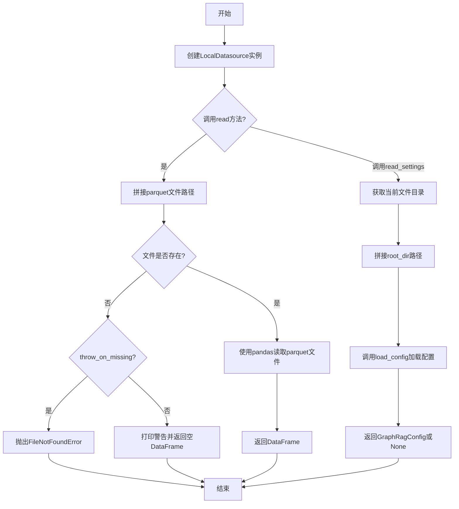
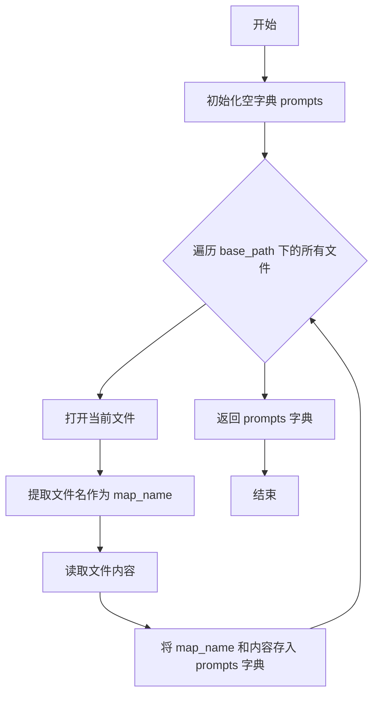
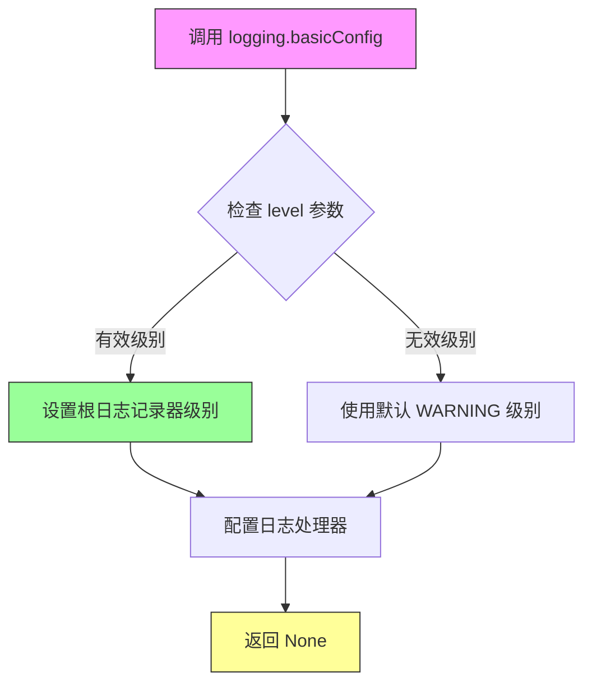
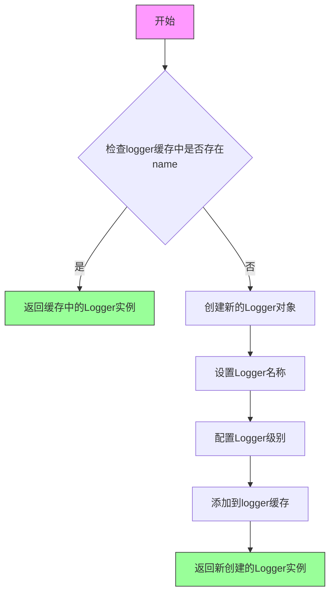
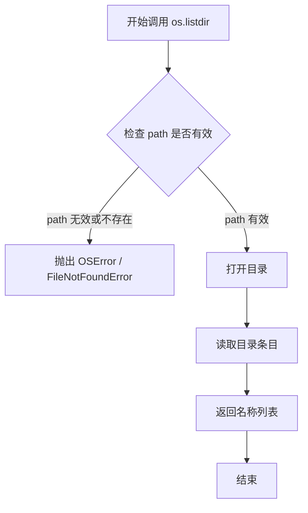
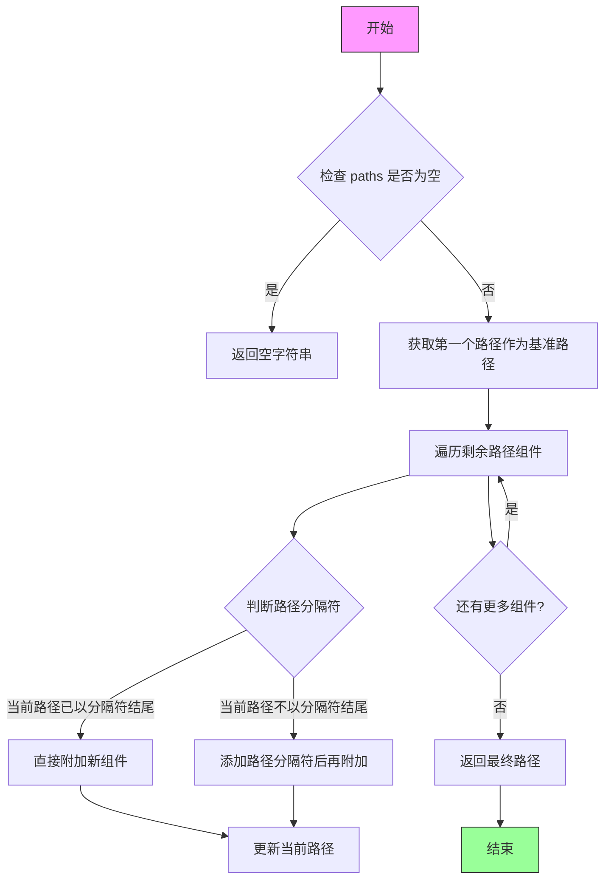
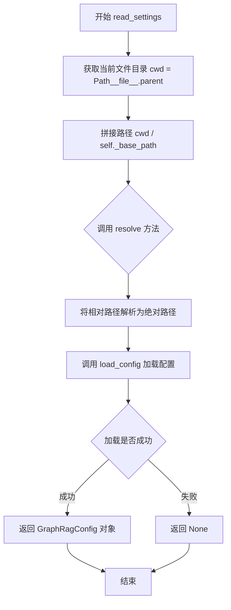
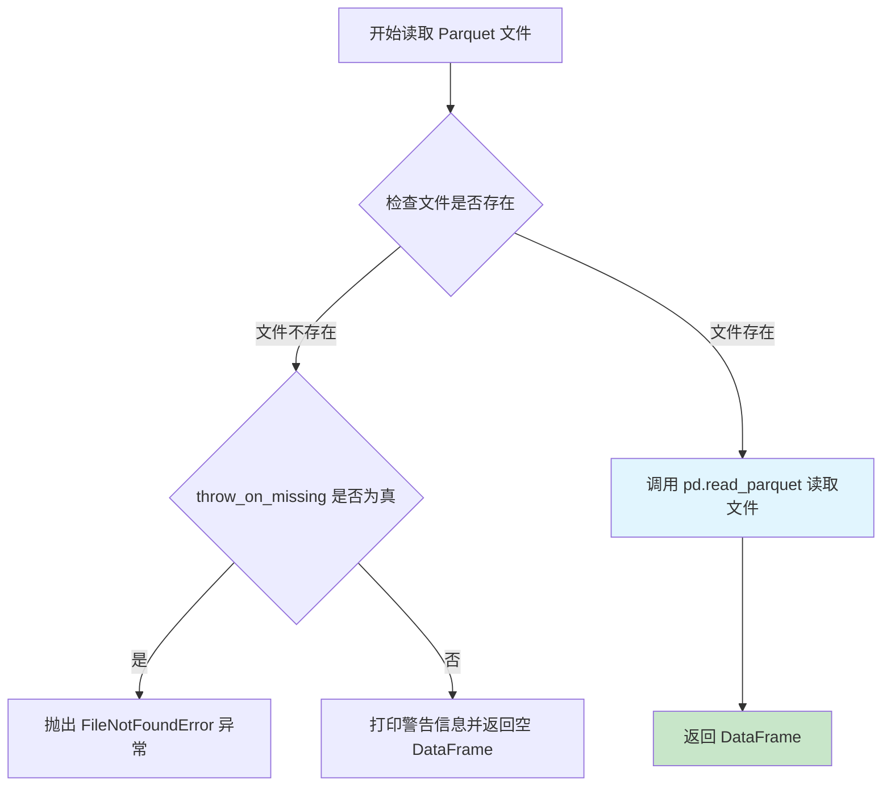
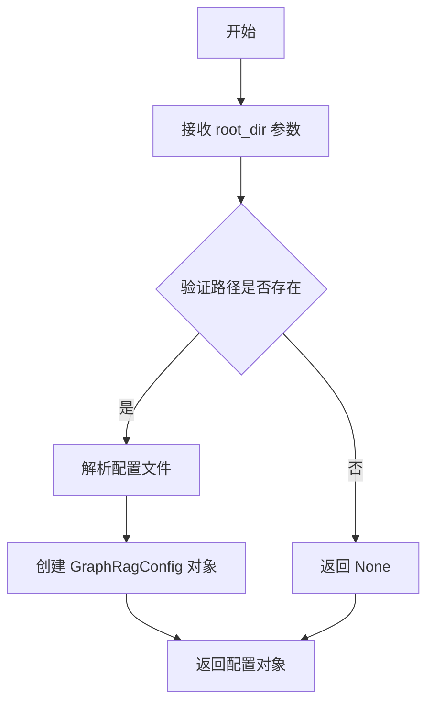
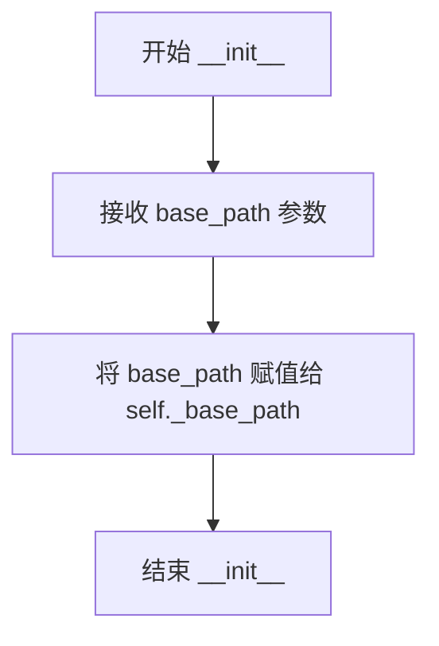

# `graphrag\unified-search-app\app\knowledge_loader\data_sources\local_source.py` 详细设计文档

这是一个本地数据源模块，用于从本地parquet文件读取数据，并提供加载本地提示配置和GraphRag配置文件的功能。它实现了Datasource接口，支持按表名读取数据、错误处理和设置文件的加载。

## 整体流程



## 类结构

```
Datasource (抽象基类/接口)
└── LocalDatasource (本地数据源实现类)
```

## 全局变量及字段


### `logging`
    
Python标准日志模块，用于配置日志记录

类型：`logging模块`
    


### `logger`
    
模块级日志记录器，用于记录运行时信息

类型：`Logger对象`
    


### `prompts`
    
提示配置字典，键为文件名（不含扩展名），值为文件内容

类型：`dict[str, str]`
    


### `map_name`
    
文件名（不含扩展名），用于构建prompts字典的键

类型：`str`
    


### `cwd`
    
当前文件所在目录的Path对象

类型：`Path对象`
    


### `root_dir`
    
解析后的根目录，基于cwd和_base_path拼接并解析的绝对路径

类型：`Path对象`
    


### `table`
    
完整的表文件路径，由_base_path和表名拼接而成的parquet文件路径

类型：`str`
    


### `error_msg`
    
错误消息字符串，用于在文件不存在时抛出异常

类型：`str`
    


### `LocalDatasource._base_path`
    
本地基础路径，用于定位数据文件和配置文件的根目录

类型：`str`
    
    

## 全局函数及方法


### `load_local_prompt_config`

加载本地提示配置文件，将指定目录下的所有文件读取为提示配置字典。

参数：

- `base_path`：`str`，基础路径，默认为空字符串，用于指定提示配置文件的存储目录

返回值：`dict[str, str]`，返回提示配置字典，键为文件名（不含扩展名），值为文件内容字符串

#### 流程图



#### 带注释源码

```python
def load_local_prompt_config(base_path="") -> dict[str, str]:
    """Load local prompt configuration."""
    # 用于存储提示配置的字典，键为文件名（不含扩展名），值为文件内容
    prompts = {}

    # 遍历基础路径下的所有文件
    for path in os.listdir(base_path):  # noqa: PTH208
        # 拼接完整文件路径并打开文件
        with open(os.path.join(base_path, path), "r") as f:  # noqa: UP015, PTH123, PTH118
            # 从文件名提取名称（去掉扩展名）
            map_name = path.split(".")[0]
            # 读取文件内容并存储到字典中
            prompts[map_name] = f.read()
    
    # 返回提示配置字典
    return prompts
```


### `logging.basicConfig(level: int)`

配置 Python 日志模块的根日志记录器，设置全局日志级别，用于控制日志信息的输出详细程度。

参数：

- `level`：`int`，日志级别，指定要记录的最低日志严重程度（如 `logging.INFO`、`logging.DEBUG`、`logging.WARNING` 等）

返回值：`None`，该函数配置日志记录器，不返回任何值。

#### 流程图



#### 带注释源码

```python
# 设置根日志记录器的日志级别为 INFO
# INFO 级别会显示: INFO, WARNING, ERROR, CRITICAL
# DEBUG 级别会显示所有日志
logging.basicConfig(level=logging.INFO)

# 将 azure 相关日志器的级别设置为 WARNING
# 减少 azure 库过于详细的日志输出
logging.getLogger("azure").setLevel(logging.WARNING)

# 获取当前模块的命名日志器
logger = logging.getLogger(__name__)
```


### `logging.getLogger(name: str)`

获取命名空间日志记录器，用于获取或创建一个与指定名称关联的 Logger 对象。在代码中用于设置日志级别和获取模块级日志记录器。

参数：

- `name`：`str`，日志记录器的名称，通常使用 `__name__` 变量表示当前模块的完全限定名称

返回值：`logging.Logger`，返回对应的日志记录器实例，如果不存在则创建一个新的 logger

#### 流程图



#### 带注释源码

```python
# 标准库 logging 模块的 getLogger 方法
# 这是 Python 内置日志系统的核心函数

import logging

# 方法签名: logging.getLogger(name: str) -> logging.Logger

# 使用示例 1: 获取名为 "azure" 的日志记录器并设置级别
# 在代码中用于抑制 azure 相关库的详细日志输出
logging.getLogger("azure").setLevel(logging.WARNING)

# 使用示例 2: 获取当前模块的日志记录器
# __name__ 是 Python 自动设置的模块全名（如 'knowledge_loader.local_source'）
# 这行代码创建了模块级的 logger 变量，供后续日志记录使用
logger = logging.getLogger(__name__)

# 底层机制说明:
# 1. logging 模块维护一个 Logger 字典缓存
# 2. 首次调用时创建新 Logger 并缓存
# 3. 后续调用相同 name 直接返回缓存实例（单例模式）
# 4. Logger 可以设置级别、handlers、formatters 等
```

#### 在当前代码中的实际使用

```python
# 第13行: 配置根日志记录器的基本设置
logging.basicConfig(level=logging.INFO)

# 第14行: 获取 azure 命名空间的 logger 并设置级别为 WARNING
# 目的: 降低 azure 相关库的日志噪音，只显示 WARNING 及以上级别
logging.getLogger("azure").setLevel(logging.WARNING)

# 第15行: 获取当前模块的 logger，赋值给模块级变量 logger
# __name__ 在此模块中为 'knowledge_loader.local_source'
# 这个 logger 用于模块内部的日志记录
logger = logging.getLogger(__name__)
```


### `os.listdir`

列出指定目录的内容，返回该目录下所有文件和目录名称的列表。

参数：

- `path`：`str`，要列出的目录路径。如果为空字符串或`.`，则表示当前工作目录。

返回值：`list[str]`，返回包含目录中所有条目名称（不含路径）的列表。

#### 流程图



#### 带注释源码

```python
# os.listdir 是 Python 标准库 os 模块的函数
# 位置：/usr/lib/python3.11/os.py (Python 内置实现)

def listdir(path=None):
    """Return a list containing the names of the entries in the directory.
    
    Args:
        path: Path to the directory to list. If None, uses current directory.
        
    Returns:
        A list of strings representing the names of entries in the directory.
        The entries are not sorted.
        
    Raises:
        OSError: If the path does not exist or is not a directory.
        PermissionError: If permission is denied to access the directory.
    """
    
    # 参数处理：如果 path 为 None，则使用当前目录 '.'
    if path is None:
        path = '.'
    
    # 调用底层的 dir_fd 封装函数
    # 内部实现会：
    # 1. 验证 path 是否存在
    # 2. 验证 path 是否为目录
    # 3. 调用操作系统底层的 readdir() 系统调用
    # 4. 提取文件名并构建列表返回
    
    return _listdir_default(path)  # 内部实现函数
```


### `os.path.join`

这是 Python 标准库 `os.path` 模块中的一个函数，用于将多个路径组件智能地拼接成一个路径。在代码中，该函数被用于拼接目录和文件名，生成正确的文件路径。

参数：

- `*paths`：`str`，可变数量的路径组件（字符串），可以是目录名、文件名或其他路径片段
- 第一个路径通常作为基础路径，后续路径组件会被追加到基础路径上
- 支持使用 `..` 表示上级目录，使用 `.` 表示当前目录

返回值：`str`，拼接后的规范化路径字符串

#### 流程图



#### 带注释源码

```python
# os.path.join 是 Python 标准库 os.path 模块中的函数
# 位于 /usr/lib/python3.x/posixpath.py 或 ntpath.py（取决于操作系统）

def join(*paths):
    """
    Join two or more pathname components, inserting '/' as needed.
    If any component is an absolute path, all previous components are discarded.
    
    参数:
        *paths: 可变数量的路径组件
        
    返回值:
        str: 拼接后的路径字符串
    """
    
    # 示例说明：
    # os.path.join('/home/user', 'docs', 'file.txt')
    # 结果: '/home/user/docs/file.txt'
    
    # os.path.join('/home/user', '/absolute/path', 'file.txt')
    # 结果: '/absolute/path/file.txt'（前面的路径被丢弃）
    
    # 实现逻辑（简化版）：
    # 1. 取第一个路径作为基准
    # 2. 遍历后续路径，依次追加
    # 3. 如果当前路径以分隔符结尾，直接追加
    # 4. 如果当前路径不以分隔符结尾，添加分隔符后再追加
    # 5. 如果后续路径是绝对路径，重置基准路径为该绝对路径
```

#### 代码中的实际使用示例

```python
# 示例 1: 在 load_local_prompt_config 函数中
# 遍历目录中的文件时，拼接基础路径和文件名
for path in os.listdir(base_path):
    # os.path.join 用于将 base_path 和 path 拼接成完整路径
    file_path = os.path.join(base_path, path)
    # 例如：os.path.join('/path/to/prompts', 'summarize.txt')
    # 结果：'/path/to/prompts/summarize.txt'
    with open(file_path, "r") as f:
        prompts[path.split(".")[0]] = f.read()

# 示例 2: 在 LocalDatasource.read 方法中
# 拼接基础路径和表名，生成 parquet 文件的完整路径
table_path = os.path.join(self._base_path, f"{table}.parquet")
# 例如：os.path.join('/data', 'users')
# 结果：'/data/users.parquet'
```

---

### 补充说明

#### 设计目标与约束

- **跨平台兼容性**：`os.path.join` 会根据操作系统自动使用正确的路径分隔符（Windows 用 `\`，Unix/Linux/macOS 用 `/`）
- **智能处理**：自动处理路径中的分隔符，避免重复的分隔符
- **绝对路径处理**：当遇到绝对路径时，会丢弃之前的所有路径组件

#### 错误处理与异常设计

- 如果传入空路径，可能返回空字符串或当前工作目录
- 不检查路径是否存在，仅做字符串拼接
- 不自动创建目录

#### 潜在的技术债务或优化空间

在当前代码中，`os.path.join` 的使用是正确的。但可以考虑：

1. 使用 `pathlib.Path` 替代字符串拼接（Python 3.4+），例如：
   ```python
   from pathlib import Path
   file_path = Path(base_path) / path  # 使用 / 操作符更直观
   ```
2. 对于大量文件操作，可以考虑使用 `pathlib` 的 `glob` 或 `rglob` 方法批量处理


### `os.path.exists`

检查指定路径（文件或目录）是否存在，返回布尔值。

参数：

- `path`：`str`，要检查的路径，可以是文件或目录路径

返回值：`bool`，如果路径存在返回 `True`，否则返回 `False`

#### 流程图


#### 带注释源码

```python
# 在 LocalDatasource.read 方法中调用 os.path.exists
# 用于检查 parquet 文件是否存在
table = os.path.join(self._base_path, f"{table}.parquet")  # noqa: PTH118

if not os.path.exists(table):  # noqa: PTH110
    # 如果文件不存在，根据 throw_on_missing 参数决定行为
    if throw_on_missing:
        error_msg = f"Table {table} does not exist"
        raise FileNotFoundError(error_msg)
    
    # 否则打印警告信息并返回空 DataFrame
    print(f"Table {table} does not exist")  # noqa T201
    return (
        pd.DataFrame(data=[], columns=columns)
        if columns is not None
        else pd.DataFrame()
    )
# 文件存在则继续读取
return pd.read_parquet(table, columns=columns)
```


### `LocalDatasource.read_settings` 方法中的 `Path.resolve()` 使用

在 `LocalDatasource` 类的 `read_settings` 方法中，使用了 `Path.resolve()` 来解析配置文件路径为绝对路径。

参数：

-  `self`：`LocalDatasource` 实例本身
-  `file`：`str`，配置文件名（参数存在但方法内未使用，可能为技术债务）
-  `throw_on_missing`：`bool = False`，当文件不存在时是否抛出异常

返回值：`GraphRagConfig | None`，返回加载的配置对象，如果加载失败则返回 `None`

#### 流程图



#### 带注释源码

```python
def read_settings(
    self,
    file: str,
    throw_on_missing: bool = False,
) -> GraphRagConfig | None:
    """Read settings file from local source."""
    # 获取当前模块文件所在的目录作为基准目录
    cwd = Path(__file__).parent
    
    # 拼接基础路径并解析为绝对路径
    # resolve() 方法将相对路径转换为绝对路径
    # 解析过程包括：
    # 1. 将 cwd 和 self._base_path 拼接
    # 2. 将结果路径规范化并解析为绝对路径
    # 3. 解析符号链接（如果存在）
    # 4. 返回绝对路径的 Path 对象
    root_dir = (cwd / self._base_path).resolve()
    
    # 使用解析后的绝对路径加载配置
    return load_config(root_dir=root_dir)
```

---

### `Path.resolve()` 方法本身的信息

`Path.resolve()` 是 Python `pathlib.Path` 类的实例方法。

参数：无参数

返回值：`Path`，返回一个新的 `Path` 对象，表示解析后的绝对路径

#### 带注释源码（Python 标准库实现逻辑）

```python
# pathlib.Path.resolve() 方法的实现逻辑：
# 1. 如果路径已经是绝对路径，直接返回
# 2. 如果路径是相对路径，则：
#    a. 将当前工作目录与相对路径拼接
#    b. 规范化路径（去除多余的 / 和 ..）
#    c. 解析符号链接（使用 os.path.realpath）
#    d. 返回绝对路径
#
# 在本代码中的具体使用：
root_dir = (cwd / self._base_path).resolve()
# 等价于：
# root_dir = Path(os.path.realpath(cwd / self._base_path))
```


### `pd.read_parquet`

读取 Parquet 格式的列式存储文件，并将其转换为 Pandas DataFrame。

参数：

- `path`（在代码中对应 `table` 变量）：`str`，要读取的 Parquet 文件的完整路径
- `columns`：`list[str] | None`，可选参数，指定要读取的列名列表，若为 `None` 则读取所有列

返回值：`pd.DataFrame`，包含从 Parquet 文件中读取的数据的 DataFrame 对象

#### 流程图



#### 带注释源码

```python
# 在 LocalDatasource.read() 方法内部
# 参数 table 是由 base_path 和 table 名称拼接而成的完整路径
table = os.path.join(self._base_path, f"{table}.parquet")  # 构建完整的 parquet 文件路径

# ...

# 读取 Parquet 文件的核心调用
# 参数说明：
# - table: str 类型，parquet 文件的路径
# - columns: list[str] | None 类型，要读取的列名列表，None 表示读取所有列
# 返回值：pd.DataFrame 对象，包含文件中的数据
return pd.read_parquet(table, columns=columns)
```


### `LocalDatasource.read`

该方法用于从本地 parquet 文件读取数据，支持指定列筛选，当文件不存在时可根据配置返回空 DataFrame 或抛出异常。

参数：

- `self`：`LocalDatasource` 实例本身
- `table`：`str`，要读取的表名（不含 .parquet 扩展名）
- `throw_on_missing`：`bool`，是否在文件缺失时抛出异常，默认为 False
- `columns`：`list[str] | None`，指定要读取的列名列表，默认为 None（读取所有列）

返回值：`pd.DataFrame`，从 parquet 文件读取的数据框，若文件不存在且 `throw_on_missing=False` 时返回空 DataFrame

#### 流程图

```mermaid
flowchart TD
    A[开始 read 方法] --> B[构建文件路径 table_path]
    B --> C{文件是否存在?}
    C -->|是| D[调用 pd.read_parquet 读取数据]
    C -->|否| E{throw_on_missing?}
    E -->|True| F[抛出 FileNotFoundError]
    E -->|False| G{columns 参数是否为 None?}
    G -->|是| H[返回空 DataFrame pd.DataFrame()]
    G -->|否| I[返回带列名的空 DataFrame pd.DataFrame data=[], columns=columns]
    D --> J[返回读取的 DataFrame]
    H --> J
    I --> J
    F --> K[结束]
    J --> K
```

#### 带注释源码

```python
def read(
    self,
    table: str,
    throw_on_missing: bool = False,
    columns: list[str] | None = None,
) -> pd.DataFrame:
    """Read file from local source."""
    # 拼接完整的 parquet 文件路径：base_path/table_name.parquet
    table = os.path.join(self._base_path, f"{table}.parquet")  # noqa: PTH118

    # 检查文件是否存在
    if not os.path.exists(table):  # noqa: PTH110
        # 若配置了 throw_on_missing=True，则抛出文件不存在异常
        if throw_on_missing:
            error_msg = f"Table {table} does not exist"
            raise FileNotFoundError(error_msg)

        # 否则打印警告信息并返回空 DataFrame
        print(f"Table {table} does not exist")  # noqa T201
        # 根据 columns 参数决定返回空 DataFrame 的形式
        return (
            pd.DataFrame(data=[], columns=columns)  # 创建带指定列名的空 DataFrame
            if columns is not None
            else pd.DataFrame()  # 创建完全空的 DataFrame
        )
    # 文件存在时，使用 pd.read_parquet 读取数据
    return pd.read_parquet(table, columns=columns)
```


### `load_config`

加载 GraphRAG 配置文件，并返回一个配置对象。

参数：

- `root_dir`：`Path`，配置文件的根目录路径

返回值：`GraphRagConfig | None`，成功加载时返回 `GraphRagConfig` 配置对象，加载失败时返回 `None`

#### 流程图



#### 带注释源码

```python
def read_settings(
    self,
    file: str,
    throw_on_missing: bool = False,
) -> GraphRagConfig | None:
    """Read settings file from local source."""
    # 获取当前文件所在目录作为基准路径
    cwd = Path(__file__).parent
    # 拼接基础路径并解析为绝对路径
    root_dir = (cwd / self._base_path).resolve()
    # 调用 load_config 加载 GraphRAG 配置
    # 参数 root_dir: Path 类型，指定配置根目录
    # 返回值: GraphRagConfig 对象或 None
    return load_config(root_dir=root_dir)
```


### `LocalDatasource.__init__`

初始化 `LocalDatasource` 实例的构造函数，接受一个本地路径参数并将其存储为实例属性，供后续 `read` 和 `read_settings` 方法使用。

参数：

- `base_path`：`str`，本地数据源的基础路径，用于定位 parquet 文件和配置文件

返回值：`None`，无返回值（构造函数）

#### 流程图



#### 带注释源码

```python
def __init__(self, base_path: str):
    """Init method definition."""
    # 将传入的 base_path 参数存储为实例属性 _base_path
    # 供后续的 read() 和 read_settings() 方法使用
    self._base_path = base_path
```


### `LocalDatasource.read`

读取本地Parquet文件并返回Pandas DataFrame。该方法根据传入的表名构建Parquet文件路径，支持可选的列筛选，并在文件缺失时根据配置决定是否抛出异常或返回空DataFrame。

参数：

- `table`：`str`，要读取的Parquet文件名（不含扩展名）
- `throw_on_missing`：`bool = False`，当文件不存在时是否抛出FileNotFoundError异常
- `columns`：`list[str] | None = None`，指定要读取的列名列表，None表示读取所有列

返回值：`pd.DataFrame`，包含所读取数据的Pandas DataFrame对象，若文件不存在且throw_on_missing为False则返回空DataFrame

#### 流程图

```mermaid
flowchart TD
    A[开始 read 方法] --> B[构建完整文件路径: {base_path}/{table}.parquet]
    B --> C{检查文件是否存在}
    C -->|不存在| D{throw_on_missing?}
    C -->|存在| G[使用 pd.read_parquet 读取文件]
    D -->|True| E[抛出 FileNotFoundError]
    D -->|False| F[打印警告信息并返回空 DataFrame]
    G --> H[返回 DataFrame]
    E --> I[结束]
    F --> I
    H --> I
    
    style G fill:#90EE90
    style E fill:#FFB6C1
    style F fill:#FFE4B5
```

#### 带注释源码

```python
def read(
    self,
    table: str,
    throw_on_missing: bool = False,
    columns: list[str] | None = None,
) -> pd.DataFrame:
    """Read file from local source.
    
    Args:
        table: The name of the parquet table to read (without .parquet extension)
        throw_on_missing: If True, raise FileNotFoundError when file doesn't exist
        columns: Optional list of column names to read. None means read all columns
    
    Returns:
        pd.DataFrame: The data from the parquet file, or an empty DataFrame if file 
                     doesn't exist and throw_on_missing is False
    """
    # Step 1: 构建完整的 Parquet 文件路径
    # Join base_path with table name and .parquet extension
    table = os.path.join(self._base_path, f"{table}.parquet")

    # Step 2: 检查文件是否存在
    if not os.path.exists(table):
        # Step 3a: 如果 throw_on_missing 为 True，抛出异常
        if throw_on_missing:
            error_msg = f"Table {table} does not exist"
            raise FileNotFoundError(error_msg)

        # Step 3b: 否则打印警告并返回空 DataFrame
        print(f"Table {table} does not exist")
        # 如果指定了 columns，返回带有指定列名的空 DataFrame
        return (
            pd.DataFrame(data=[], columns=columns)
            if columns is not None
            else pd.DataFrame()
        )
    
    # Step 4: 文件存在，使用 pandas 读取 Parquet 文件
    # columns=None 表示读取所有列
    return pd.read_parquet(table, columns=columns)
```


### `LocalDatasource.read_settings`

从本地数据源读取配置文件，解析并返回 GraphRagConfig 配置对象，支持可选的缺失文件异常处理机制。

参数：

- `file`：`str`，配置文件名（当前实现中未被使用）
- `throw_on_missing`：`bool`，缺失文件时是否抛出异常，默认为 `False`

返回值：`GraphRagConfig | None`，成功返回配置对象，失败返回 `None`

#### 流程图

```mermaid
flowchart TD
    A[开始 read_settings] --> B[获取当前文件目录 Path(__file__).parent]
    B --> C[拼接根目录: cwd / self._base_path]
    C --> D[调用 load_config root_dir=root_dir]
    D --> E{配置加载成功?}
    E -->|是| F[返回 GraphRagConfig 对象]
    E -->|否| G[返回 None]
    F --> H[结束]
    G --> H
    
    style A fill:#f9f,stroke:#333
    style F fill:#9f9,stroke:#333
    style G fill:#f99,stroke:#333
```

#### 带注释源码

```python
def read_settings(
    self,
    file: str,
    throw_on_missing: bool = False,
) -> GraphRagConfig | None:
    """Read settings file from local source.
    
    从本地源读取设置文件。
    
    参数:
        file: 配置文件名（当前实现中未使用）
        throw_on_missing: 是否在文件缺失时抛出异常
    
    返回:
        GraphRagConfig 配置对象，失败时返回 None
    """
    # 获取当前源文件所在目录作为基准路径
    cwd = Path(__file__).parent
    
    # 拼接基础路径与数据源路径，解析为绝对路径
    root_dir = (cwd / self._base_path).resolve()
    
    # 调用配置加载器，加载 GraphRag 配置
    return load_config(root_dir=root_dir)
```

#### 潜在技术债务与优化空间

1. **未使用的参数**：`file` 参数在方法签名中定义但在实现中完全未使用，这会导致调用者困惑，且 `throw_on_missing` 参数也未被使用（未实现文件存在性检查逻辑）

2. **配置加载失败处理**：方法未捕获 `load_config` 可能抛出的异常，若加载失败会直接向上抛出，而非返回 `None`

3. **路径计算依赖**：`root_dir` 计算依赖 `__file__` 位置，若文件被移动或打包，可能导致路径解析错误

## 关键组件


### load_local_prompt_config

从指定基础路径读取所有本地提示配置文件，并将文件名（不含扩展名）作为键，文件内容作为值返回的函数。

### LocalDatasource

本地数据源类，负责从本地文件系统读取parquet格式的数据表和GraphRag配置文件。

### LocalDatasource.read

从本地parquet文件读取数据的核心方法，支持指定列、缺失文件处理，返回pandas DataFrame。

### LocalDatasource.read_settings

从本地文件系统读取GraphRag配置文件的方法，使用graphrag配置加载器解析设置。

### _base_path

LocalDatasource类的私有属性，存储数据源的基础路径字符串，用于定位parquet文件和配置文件。


## 问题及建议


### 已知问题

- **日志配置位置不当**：`logging.basicConfig(level=logging.INFO)`在模块级别调用，应该在应用入口处配置
- **不一致的错误处理**：`read`方法在文件不存在时使用`print`输出而非`logger`，且对不同错误情况的处理方式不统一（打印、抛出异常、返回空DataFrame）
- **缺乏异常处理**：`load_local_prompt_config`函数没有try-except包装，文件读取失败会导致程序崩溃；`read_settings`方法同样缺乏异常处理
- **路径验证缺失**：`load_local_prompt_config`没有验证`base_path`是否存在；`os.listdir`会返回所有文件包括非提示文件
- **隐藏文件处理不当**：`os.listdir`会包含隐藏文件，可能导致尝试读取非预期文件
- **类型提示不完整**：`load_local_prompt_config`返回类型为`dict[str, str]`，未考虑空目录或读取失败的情况
- **魔法数字**：`".parquet"`扩展名硬编码在`read`方法中，缺乏配置化
- **未使用的导入**：`Path`导入后在代码中未被实际使用

### 优化建议

- 移除模块级日志配置，将日志初始化交给调用方或应用入口
- 使用`logger.warning`或`logger.error`替代`print`语句输出错误信息
- 为`load_local_prompt_config`添加异常处理，使用`os.scandir`替代`os.listdir`并过滤非文件项
- 添加路径存在性验证，为`base_path`参数提供默认值或空值检查
- 考虑将文件扩展名、默认值等抽取为配置常量或类属性
- 统一错误处理策略，明确何时抛出异常、何时返回空值
- 为`read_settings`方法添加异常处理和更完善的返回值说明

## 其它


### 设计目标与约束

本模块旨在为GraphRag框架提供本地数据源支持，支持从本地文件系统读取parquet格式的数据文件和配置文件。约束条件包括：仅支持parquet文件格式、配置文件必须位于base_path目录下，不支持远程数据源或云存储。

### 错误处理与异常设计

模块采用分层异常处理策略：FileNotFoundError用于处理表文件不存在的情况，可通过throw_on_missing参数选择抛出异常或返回空DataFrame；os.listdir()调用时不检查路径合法性，可能抛出OSError；pd.read_parquet()的异常由调用方处理。

### 数据流与状态机

数据流为：调用方传入table名称 → 拼接完整路径 → 检查文件是否存在 → 不存在时根据throw_on_missing决定返回空DataFrame或抛异常 → 存在时调用pandas读取parquet → 返回DataFrame对象。无状态机设计，类实例维护base_path状态。

### 外部依赖与接口契约

外部依赖包括：pandas库用于数据读取、graphrag.config模块提供配置加载功能、knowledge_loader.data_sources.typing.Datasource作为抽象基类。接口契约要求实现Datasource抽象接口的read()和read_settings()方法，read()返回pd.DataFrame，read_settings()返回GraphRagConfig或None。

### 性能考虑与优化空间

os.listdir()无过滤机制会读取所有文件包括非prompt文件；每个文件都完整读取内容，大文件可能导致内存压力；缺少缓存机制，重复调用会重复读取文件。建议添加文件类型过滤、异步读取、缓存机制。

### 线程安全与并发访问

当前实现为单线程设计，无线程锁保护。_base_path为实例级变量，多线程环境下read()方法可能存在竞争条件，但pandas读取操作本身为原子性，实际风险较低。

### 配置管理与环境适配

支持通过base_path参数指定数据目录，默认为相对路径。load_local_prompt_config函数无默认值校验，空字符串会列出当前目录。建议添加路径规范化、相对路径转绝对路径、环境变量配置支持。

### 日志记录与监控

使用标准logging模块，日志级别设为INFO，azure相关日志设为WARNING。logger仅在模块级别初始化，未在方法内部记录操作日志。建议在read()和read_settings()方法中添加关键操作日志以便追踪数据加载过程。

    