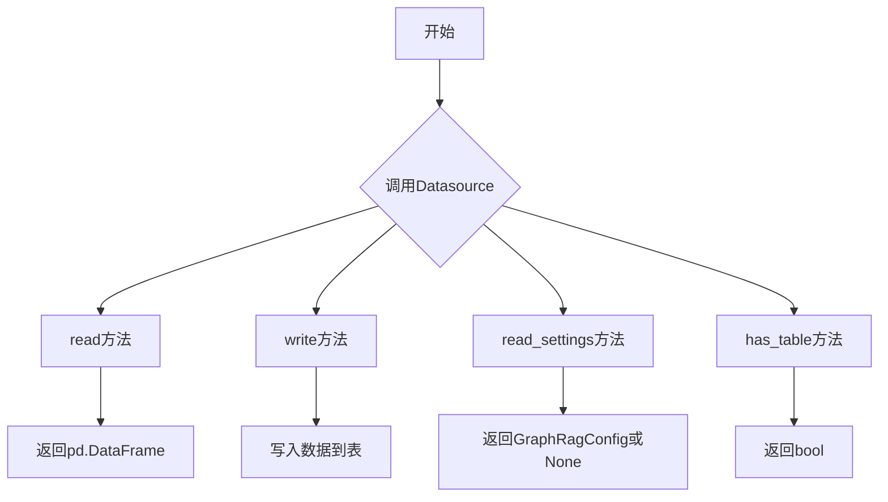
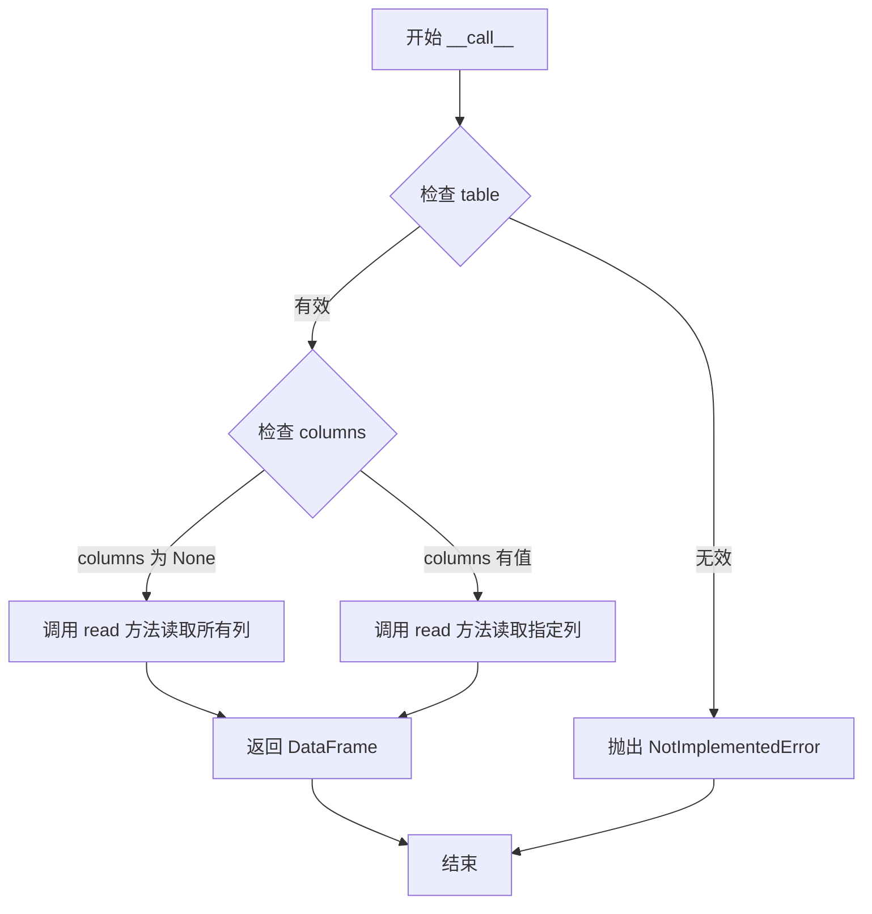
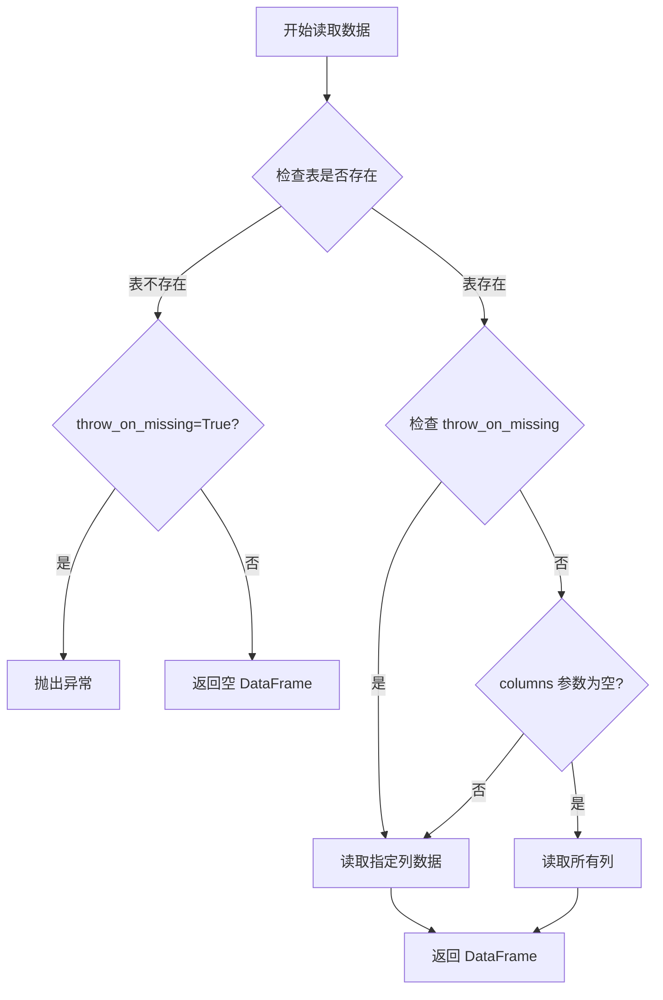
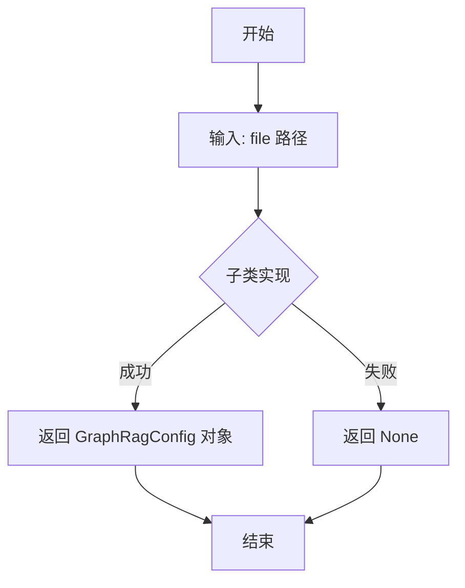
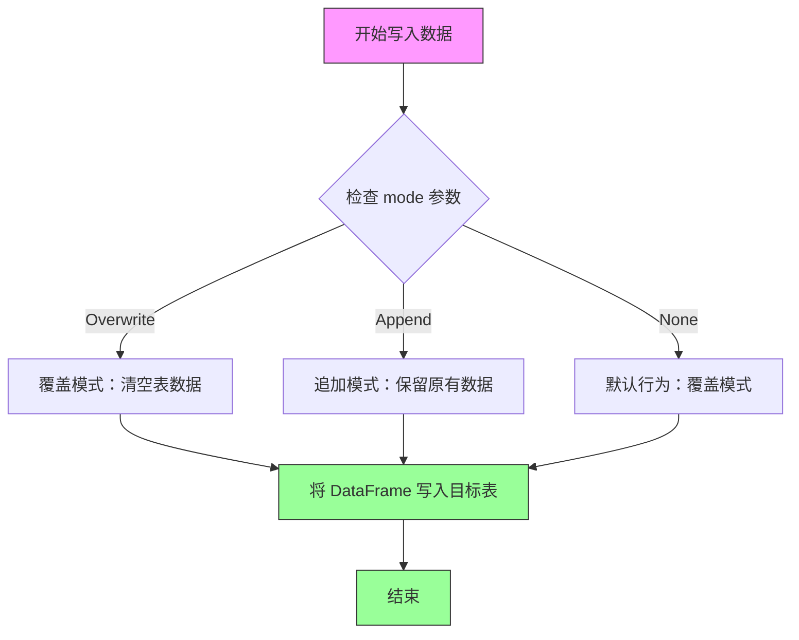
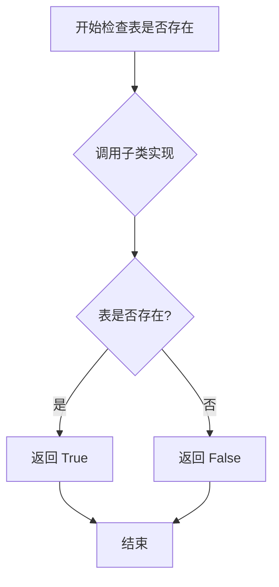

# `graphrag\unified-search-app\app\knowledge_loader\data_sources\typing.py` 详细设计文档

该模块定义了数据源相关的类型系统，包括数据源抽象接口（Datasource）用于数据的读写操作，向量索引配置（VectorIndexConfig）和数据集配置（DatasetConfig）用于管理图检索增强生成系统的数据源设置，以及写入模式枚举（WriteMode）定义数据覆盖或追加策略。

## 整体流程



## 类结构

```
WriteMode (Enum)
├── Overwrite
└── Append

Datasource (ABC)
├── __call__
├── read
├── read_settings
├── write
└── has_table

VectorIndexConfig (dataclass)
├── index_name
├── embeddings_file
└── content_file

DatasetConfig (dataclass)
├── key
├── path
├── name
├── description
└── community_level
```

## 全局变量及字段


### `WriteMode`
    
数据源写入模式的枚举类，包含覆盖(Overwrite)和追加(Append)两种模式

类型：`Enum`
    


### `WriteMode.Overwrite`
    
覆盖写入模式，表示表中所有数据将被新数据替换

类型：`WriteMode`
    


### `WriteMode.Append`
    
追加写入模式，表示新数据将追加到表中现有数据的末尾

类型：`WriteMode`
    


### `VectorIndexConfig.index_name`
    
向量索引的名称，用于标识和引用特定的向量索引

类型：`str`
    


### `VectorIndexConfig.embeddings_file`
    
嵌入向量文件的路径，指向包含预计算嵌入向量的文件

类型：`str`
    


### `VectorIndexConfig.content_file`
    
内容文件的路径，指向原始内容数据，可为None表示无独立内容文件

类型：`str | None`
    


### `DatasetConfig.key`
    
数据集的唯一标识键，用于在系统中识别和引用该数据集

类型：`str`
    


### `DatasetConfig.path`
    
数据集的路径，指向数据存储的位置

类型：`str`
    


### `DatasetConfig.name`
    
数据集的名称，用于显示和人类可读的标识

类型：`str`
    


### `DatasetConfig.description`
    
数据集的描述，说明数据集的用途和内容

类型：`str`
    


### `DatasetConfig.community_level`
    
社区级别，表示数据集中社区划分的层级深度

类型：`int`
    
    

## 全局函数及方法


### Datasource.__call__

这是一个抽象基类方法，定义数据源的调用接口，允许通过函数调用的方式读取数据表，返回指定列的 DataFrame。

参数：

- `table`：`str`，要读取的数据表名称
- `columns`：`list[str] | None`，可选，要读取的列名列表，None 表示读取所有列

返回值：`pd.DataFrame`，返回包含指定列的数据框

#### 流程图



#### 带注释源码

```python
def __call__(self, table: str, columns: list[str] | None) -> pd.DataFrame:
    """
    Call method definition.
    
    这是一个抽象方法，具体实现由子类提供。
    该方法允许将 Datasource 实例作为函数调用，
    方便以统一的方式读取数据。
    
    参数:
        table: str - 要读取的数据表名称
        columns: list[str] | None - 可选的列名列表，None 表示读取所有列
    
    返回:
        pd.DataFrame - 包含所请求列的数据框
    
    异常:
        NotImplementedError - 如果子类未实现此方法
    """
    # 抽象方法，具体实现由子类override
    # 子类需要实现具体的数据库/文件读取逻辑
    raise NotImplementedError
```


### `Datasource.read`

这是一个抽象方法，用于从数据源读取指定表的数据并返回 Pandas DataFrame，支持按列筛选和缺失表处理配置。

参数：

- `table`：`str`，要读取的表名
- `throw_on_missing`：`bool`，当表不存在时是否抛出异常，默认为 False（返回空 DataFrame）
- `columns`：`list[str] | None`，要读取的列名列表，None 表示读取所有列

返回值：`pd.DataFrame`，包含所请求表数据的 Pandas DataFrame 对象

#### 流程图



#### 带注释源码

```python
@abstractmethod
def read(
    self,
    table: str,
    throw_on_missing: bool = False,
    columns: list[str] | None = None,
) -> pd.DataFrame:
    """Read method definition.
    
    抽象方法，由子类实现具体的数据读取逻辑。
    
    参数:
        table: str - 要读取的表名
        throw_on_missing: bool - 如果为 True，当表不存在时抛出异常；否则返回空 DataFrame
        columns: list[str] | None - 指定要读取的列，None 表示读取所有列
    
    返回:
        pd.DataFrame - 包含读取数据的 DataFrame 对象
    
    异常:
        NotImplementedError - 此方法为抽象方法，需由子类实现
    """
    raise NotImplementedError
```


### `Datasource.read_settings`

读取设置文件的抽象方法，由子类实现具体逻辑。该方法接收一个文件路径作为参数，解析文件内容并返回对应的 `GraphRagConfig` 配置对象，如果文件不存在或解析失败则返回 `None`。

参数：

- `file`：`str`，设置文件的路径

返回值：`GraphRagConfig | None`，返回解析后的配置对象，如果文件不存在或读取失败则返回 `None`

#### 流程图



#### 带注释源码

```python
@abstractmethod
def read_settings(self, file: str) -> GraphRagConfig | None:
    """Read settings method definition.
    
    抽象方法，由子类实现具体的配置文件读取逻辑。
    
    Args:
        file: 设置文件的路径
        
    Returns:
        解析后的 GraphRagConfig 对象，如果文件不存在或解析失败则返回 None
    """
    raise NotImplementedError
```


### `Datasource.write`

将数据写入指定表的抽象方法，由子类实现具体的数据写入逻辑。

参数：

- `self`：`Datasource`，当前数据源实例
- `table`：`str`，目标表的名称
- `df`：`pd.DataFrame`，需要写入的 DataFrame 数据
- `mode`：`WriteMode | None`，写入模式，可选为覆盖（Overwrite）或追加（Append），默认为 None

返回值：`None`，无返回值

#### 流程图



#### 带注释源码

```python
def write(
    self, table: str, df: pd.DataFrame, mode: WriteMode | None = None
) -> None:
    """Write method definition.
    
    将数据写入指定表的抽象方法，由子类实现具体逻辑。
    此方法在基类中未实现，调用时会抛出 NotImplementedError。
    
    参数:
        table: str - 目标表的名称，用于指定数据写入的位置
        df: pd.DataFrame - 要写入的 DataFrame 对象，包含实际数据
        mode: WriteMode | None - 写入模式，Overwrite 表示覆盖整个表，
              Append 表示追加到现有数据，None 默认为覆盖模式
    
    返回:
        None - 此方法不返回任何值
    
    异常:
        NotImplementedError - 基类中未实现，子类需重写此方法
    """
    raise NotImplementedError
```


### Datasource.has_table

检查数据源中是否存在指定的表。该方法是抽象方法，由子类具体实现，用于验证某个表是否在数据源中存在。

参数：

- `table`：`str`，要检查存在的表名

返回值：`bool`，如果指定表在数据源中存在返回 True，否则返回 False

#### 流程图



#### 带注释源码

```python
def has_table(self, table: str) -> bool:
    """Check if table exists method definition.
    
    这是一个抽象方法，用于检查数据源中是否存在指定的表。
    子类需要重写此方法以提供具体的表存在性检查逻辑。
    
    参数:
        table: str - 要检查存在的表名
        
    返回:
        bool - 如果表存在返回 True，否则返回 False
    """
    raise NotImplementedError
```

## 关键组件


### 一段话描述

该代码模块定义了数据源的抽象接口和配置类，用于管理GraphRag系统中的数据读写操作，支持覆盖和追加两种写入模式，并提供了向量索引和数据集的配置定义。

### 文件的整体运行流程

该模块作为类型定义和接口规范存在，不包含实际执行逻辑。其运行流程为：
1. 定义WriteMode枚举用于指定数据写入策略
2. 定义Datasource抽象基类规定数据源接口契约
3. 实现VectorIndexConfig和DatasetConfig数据类用于配置管理
4. 具体的Datasource实现类（如SQLDatasource、ParquetDatasource等）会继承Datasource并实现具体的数据读写逻辑

### 类的详细信息

#### WriteMode 枚举类
- **描述**: 用于指定数据写入模式的枚举类型
- **字段**:
  - `Overwrite` (int): 覆盖模式，所有表数据将被新数据替换，值为1
  - `Append` (int): 追加模式，新数据将追加到现有数据，值为2

#### Datasource 抽象基类
- **描述**: 数据源的抽象接口类，定义数据读写操作的标准契约
- **字段**:
  - 无类字段（仅包含方法定义）
- **方法**:
  - `__call__(self, table: str, columns: list[str] | None) -> pd.DataFrame`: 调用方法，委托给read方法
  - `read(self, table: str, throw_on_missing: bool = False, columns: list[str] | None = None) -> pd.DataFrame`: 抽象方法，用于读取指定表的数据
  - `read_settings(self, file: str) -> GraphRagConfig | None`: 抽象方法，用于读取配置文件
  - `write(self, table: str, df: pd.DataFrame, mode: WriteMode | None = None) -> None`: 抽象方法，用于写入数据
  - `has_table(self, table: str) -> bool`: 抽象方法，用于检查表是否存在

#### VectorIndexConfig 数据类
- **描述**: 向量索引配置的数据类，用于配置向量索引相关参数
- **字段**:
  - `index_name` (str): 索引名称
  - `embeddings_file` (str): 嵌入向量文件路径
  - `content_file` (str | None): 内容文件路径，可选

#### DatasetConfig 数据类
- **描述**: 数据集配置的数据类，用于配置数据集的元信息
- **字段**:
  - `key` (str): 数据集唯一标识键
  - `path` (str): 数据集路径
  - `name` (str): 数据集名称
  - `description` (str): 数据集描述
  - `community_level` (int): 社区级别

### 关键组件信息

### WriteMode 枚举
定义数据写入策略，支持覆盖整个表或追加新数据，是数据源写入操作的核心配置选项。

### Datasource 抽象基类
作为数据源的统一接口规范，定义了read、write、read_settings、has_table等核心操作契约，使得不同类型的数据源（SQL、Parquet、CSV等）可以采用一致的访问方式。

### VectorIndexConfig 配置类
封装向量索引所需的配置信息，包含索引名称、嵌入文件路径和内容文件路径，用于支持向量检索功能。

### DatasetConfig 配置类
封装数据集的元数据信息，包括标识、路径、名称、描述和社区级别，用于数据集管理和组织。

### 潜在的技术债务或优化空间

1. **接口设计不完整**: Datasource类的多个方法使用raise NotImplementedError而非abstractmethod，子类实现时容易遗漏
2. **缺乏连接池管理**: 未定义数据源连接池或生命周期管理机制
3. **错误处理缺失**: 没有定义统一的异常类，错误处理逻辑分散
4. **类型注解不够精确**: columns参数使用list[str]而非tuple[str, ...]或Sequence[str]
5. **配置验证不足**: VectorIndexConfig和DatasetConfig缺少字段验证逻辑

### 其它项目

#### 设计目标与约束
- 提供统一的数据源抽象接口
- 支持多种数据存储后端（通过子类实现）
- 保持配置与实现分离

#### 错误处理与异常设计
- 使用NotImplementedError表示方法未实现
- throw_on_missing参数控制缺失表的处理行为
- 建议后续增加自定义异常类（如DatasourceError、TableNotFoundError等）

#### 数据流与状态机
- 数据流：配置 -> Datasource实现类 -> 具体数据存储
- 写入模式状态：Overwrite（覆盖）/ Append（追加）
- 读取操作支持指定列过滤

#### 外部依赖与接口契约
- 依赖pandas库进行数据操作
- 依赖GraphRagConfig类型进行配置管理
- 依赖abc模块实现抽象基类
- 子类必须实现所有abstractmethod以提供具体功能


## 问题及建议


### 已知问题

-   **抽象方法定义不完整**：`__call__`、`write`和`has_table`方法未使用`@abstractmethod`装饰器，只是抛出`NotImplementedError`，这允许实例化抽象类但调用时才会出错，无法在编译时发现实现缺陷。
-   **文档字符串不完整**：`__call__`、`write`、`has_table`等方法的文档字符串仅包含"method definition"占位符，未描述参数、返回值和功能行为。
-   **类型注解缺失**：`VectorIndexConfig`数据类的字段`index_name`和`embeddings_file`缺少类型注解。
-   **返回值语义不明确**：`read_settings`方法返回`GraphRagConfig | None`，但未文档化何种情况下返回`None`，调用者无法判断是否需要处理None情况。
-   **write方法设计缺陷**：`mode`参数默认为`None`，但未定义`None`时的默认行为或是否允许为`None`，与`WriteMode`枚举的设计目的相悖。
-   **参数类型一致性**：`DatasetConfig.community_level`使用`int`类型，但根据枚举类命名习惯，可能是离散级别，应考虑使用`Enum`或添加验证逻辑。
-   **Python版本兼容性**：使用`list[str] | None`语法（Python 3.10+），如需兼容更低版本应使用`Optional[List[str]]`或`Union`。

### 优化建议

-   将`write`和`has_table`方法添加`@abstractmethod`装饰器，确保子类必须实现这些核心数据操作方法。
-   完善所有方法的文档字符串，使用标准格式描述参数、返回值和异常。
-   为`VectorIndexConfig`的所有字段添加类型注解：`index_name: str`, `embeddings_file: str`, `content_file: str | None`。
-   明确定义`write`方法的默认行为，建议`mode`参数默认为`WriteMode.Overwrite`或`WriteMode.Append`，避免`None`带来的歧义。
-   为`read_settings`方法添加文档说明返回`None`的条件（如文件不存在、解析失败等）。
-   考虑为`DatasetConfig.community_level`添加验证逻辑或使用更具体的类型约束。
-   在模块文档字符串中添加模块级别的说明，描述该模块的职责和主要用途。


## 其它


### 设计目标与约束

本模块作为GraphRag数据源的抽象类型定义层，提供统一的数据读写接口抽象，支持多种数据源实现（文件系统、数据库、云存储等）。约束：所有数据源实现必须继承Datasource抽象类并实现其定义的接口方法；配置类必须保持数据类（dataclass）的轻量特性；依赖pandas和graphrag.config模块。

### 错误处理与异常设计

NotImplementedError：用于Datasource抽象方法，当子类未实现对应方法时被触发。TypeError：参数类型不匹配时由Python解释器自动抛出。数据读取失败时返回空DataFrame或依据throw_on_missing参数决定是否抛出异常。设计原则：抽象层仅定义接口规范，具体异常处理由实现类负责。

### 数据流与状态机

数据流：外部调用者 → Datasource实例 → read()/write()方法 → 具体数据源实现 → pandas DataFrame。状态机：数据源实例存在三种状态-未初始化（新建）、已连接（read成功）、可写（write成功）。WriteMode枚举控制数据写入行为-Overwrite替换全表，Append追加新数据。

### 外部依赖与接口契约

依赖项：pandas（数据处理）、graphrag.config.models.graph_rag_config.GraphRagConfig（配置模型）。接口契约：Datasource.read()接受table名称和可选columns列表，返回pd.DataFrame；Datasource.write()接受table名称、DataFrame和可选WriteMode；Datasource.read_settings()接受file路径返回GraphRagConfig或None；Datasource.has_table()返回布尔值表示表是否存在。

### 性能考虑

read()方法支持columns参数实现列剪裁，减少不必要的数据加载。write()方法的mode参数允许选择追加模式，避免全量重写。设计为懒加载模式，具体数据读取延迟到实际调用时执行。

### 安全性考虑

当前模块为纯类型定义层，无敏感数据处理逻辑。read_settings()方法返回的配置对象可能包含敏感信息（如API密钥、连接凭证），调用方需自行负责保密。向量子索引配置中的embeddings_file和content_file路径需验证合法性防止路径遍历攻击。

### 版本兼容性

依赖Python 3.10+的类型联合语法（list[str] | None）。依赖pandas 2.0+支持的新特性。GraphRagConfig类型来自graphrag.config模块，需保持版本同步。

### 配置管理

VectorIndexConfig和DatasetConfig作为数据类（dataclass），自动生成__init__、__repr__、__eq__方法。VectorIndexConfig的content_file为可选字段（默认为None）。DatasetConfig包含key、path、name、description、community_level五个必需字段。

### 生命周期管理

Datasource实例由调用方负责创建和销毁。write()方法的mode参数默认为None，具体行为由实现类决定。配置类实例为不可变对象，创建后状态不变。

### 使用示例

```python
# 创建配置实例
vec_config = VectorIndexConfig(
    index_name="example_index",
    embeddings_file="./embeddings.parquet"
)

dataset_config = DatasetConfig(
    key="dataset_001",
    path="./data",
    name="Example Dataset",
    description="示例数据集",
    community_level=2
)

# 使用WriteMode
mode = WriteMode.Append  # 追加模式
```


    