# `graphrag\unified-search-app\app\knowledge_loader\model.py` 详细设计文档

该模块是一个知识模型加载模块，通过Streamlit的缓存机制从多种数据源（实体、关系、社区报告、社区、文本单元、协变量）加载图索引数据，并将其封装为KnowledgeModel对象，供graphrag-orchestration函数使用。

## 整体流程

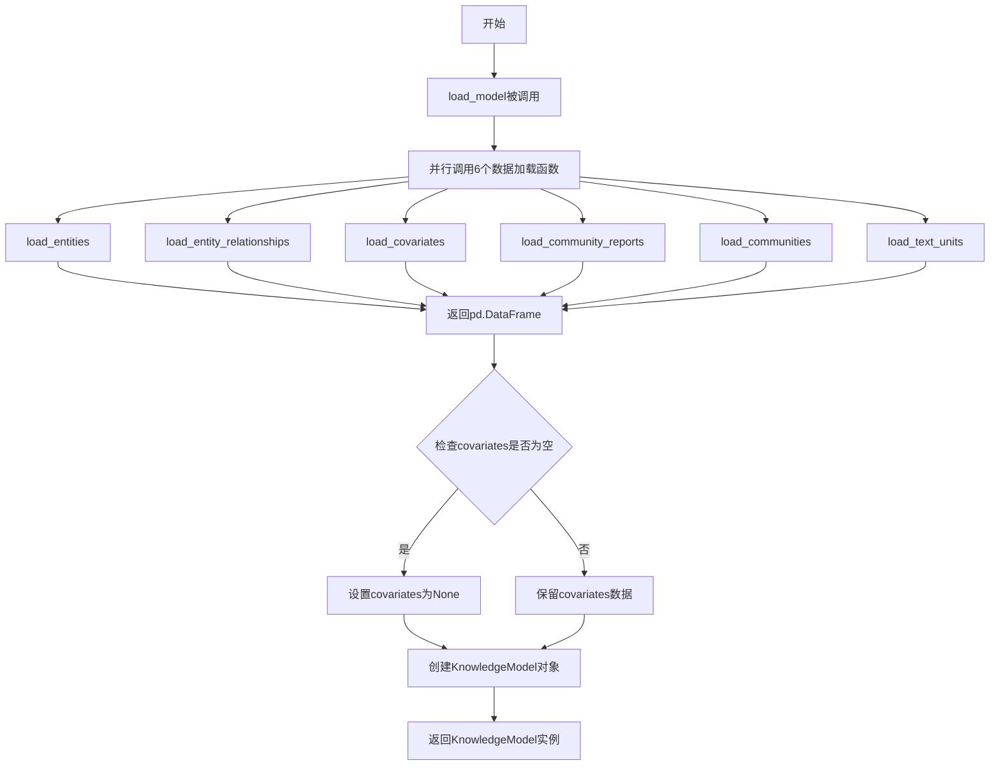

## 类结构

```
KnowledgeModel (数据类)
└── fields: entities, relationships, community_reports, communities, text_units, covariates
```

## 全局变量及字段


### `default_ttl`
    
用于Streamlit缓存的默认生存时间（TTL）配置值

类型：`Any`
    


### `KnowledgeModel.entities`
    
存储从数据源加载的实体对象集合，包含图中所有实体的属性数据

类型：`pd.DataFrame`
    


### `KnowledgeModel.relationships`
    
存储从数据源加载的关系对象集合，包含图中所有实体间关系的连接数据

类型：`pd.DataFrame`
    


### `KnowledgeModel.community_reports`
    
存储从数据源加载的社区报告对象集合，包含图中各社区的摘要和分析报告

类型：`pd.DataFrame`
    


### `KnowledgeModel.communities`
    
存储从数据源加载的社区对象集合，包含图中实体的社区分组信息

类型：`pd.DataFrame`
    


### `KnowledgeModel.text_units`
    
存储从数据源加载的文本单元对象集合，包含用于分析的基础文本内容块

类型：`pd.DataFrame`
    


### `KnowledgeModel.covariates`
    
存储从数据源加载的协变量对象集合，包含与实体相关的额外属性信息，可能为空

类型：`pd.DataFrame | None`
    
    

## 全局函数及方法


### `load_entities`

该函数是一个使用Streamlit缓存的数据加载函数，用于从指定的数据源中获取实体数据并返回为Pandas DataFrame格式，供下游知识模型构建使用。

参数：

- `dataset`：`str`，表示要加载的数据集标识符，用于指定从数据源中检索哪个数据集的实体数据
- `_datasource`：`Datasource`，数据源对象，提供访问底层存储数据的方法接口

返回值：`pd.DataFrame`，包含从数据源加载的实体对象集合，以表格形式返回

#### 流程图

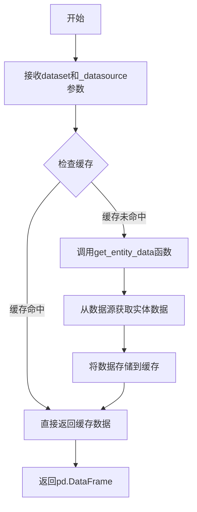

#### 带注释源码

```python
@st.cache_data(ttl=default_ttl)
def load_entities(
    dataset: str,
    _datasource: Datasource,
) -> pd.DataFrame:
    """Return a list of Entity objects."""
    return get_entity_data(dataset, _datasource)
```

#### 补充信息

**设计目标与约束**：

- 该函数使用Streamlit的`@st.cache_data`装饰器实现数据缓存，缓存有效期由`default_ttl`配置决定，以减少重复数据加载提升性能
- 函数遵循模块化设计，仅负责实体数据的加载，具体的实体数据获取逻辑委托给`get_entity_data`函数

**错误处理与异常设计**：

- 未在函数内部实现显式的异常处理机制，假设`get_entity_data`函数会处理底层数据访问异常并返回适当的错误信息或空DataFrame
- 缓存机制可能导致数据更新延迟，需要在缓存失效或数据刷新场景下注意数据一致性

**外部依赖与接口契约**：

- 依赖`knowledge_loader.data_prep`模块中的`get_entity_data`函数获取实体数据
- 依赖`streamlit`库的缓存机制实现性能优化
- 依赖`pandas`库作为数据传输格式
- 参数`_datasource`遵循`Datasource`接口规范，需要实现特定的数据访问方法


### `load_entity_relationships`

该函数是GraphRAG知识模型加载模块的核心组件之一，负责从指定的数据源加载实体关系数据。它利用Streamlit的`@st.cache_data`装饰器实现数据缓存，避免重复加载开销，提升应用性能。函数接受数据集标识符和数据源对象作为输入，通过调用底层数据访问函数获取关系数据并返回pandas DataFrame格式的结果。

参数：

- `dataset`：`str`，数据集标识符，指定要加载的关系数据所属的数据集
- `_datasource`：`Datasource`，数据源对象，提供数据访问接口和数据获取逻辑

返回值：`pd.DataFrame`，包含实体关系数据的DataFrame对象

#### 流程图

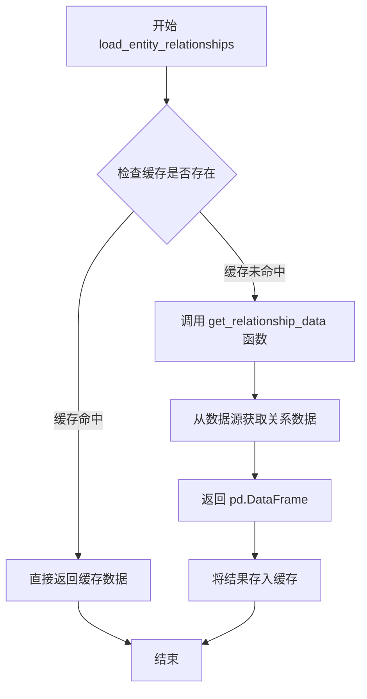

#### 带注释源码

```python
@st.cache_data(ttl=default_ttl)
def load_entity_relationships(
    dataset: str,
    _datasource: Datasource,
) -> pd.DataFrame:
    """
    加载实体关系数据到DataFrame中。
    
    该函数使用Streamlit的cache_data装饰器进行数据缓存，
    缓存有效期由default_ttl配置决定，避免重复从数据源加载相同数据。
    
    Args:
        dataset: 数据集标识符，用于指定要加载的数据集
        _datasource: 数据源对象，提供数据访问接口
        
    Returns:
        包含实体关系数据的pandas DataFrame对象
    """
    # 调用底层数据访问函数获取关系数据
    return get_relationship_data(dataset, _datasource)
```


### `load_covariates`

该函数用于从指定的数据源加载协变量（Covariate）数据，并将其作为 Pandas DataFrame 返回。函数使用 Streamlit 的缓存装饰器来避免重复加载相同的数据。

参数：

- `dataset`：`str`，目标数据集的名称，用于指定从哪个数据集加载协变量数据
- `_datasource`：`Datasource`，数据源对象，提供访问底层数据存储的接口

返回值：`pd.DataFrame`，包含协变量对象的 DataFrame，key 为协变量类型

#### 流程图

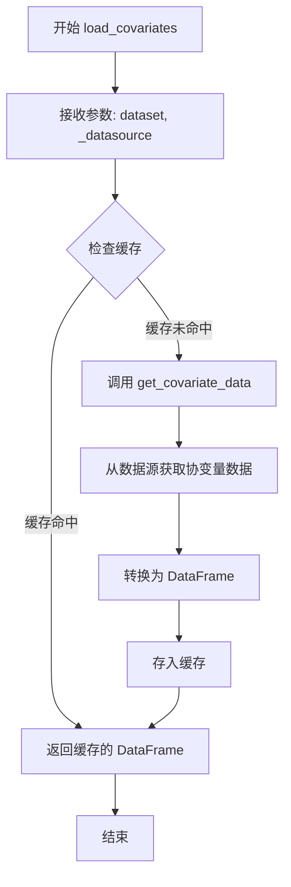

#### 带注释源码

```python
@st.cache_data(ttl=default_ttl)  # Streamlit 缓存装饰器，TTL 为 default_ttl 秒
def load_covariates(
    dataset: str,          # 数据集标识符
    _datasource: Datasource,  # 数据源对象（前置下划线表示内部参数）
) -> pd.DataFrame:
    """
    Return a dictionary of Covariate objects, with the key being the covariate type.
    
    注意：文档字符串描述与实际返回值不完全匹配，
    实际返回的是 pd.DataFrame 而非 dictionary
    """
    return get_covariate_data(dataset, _datasource)  # 委托给 data_prep 模块获取数据
```

---

**补充信息：**

- **数据流**：此函数位于数据加载层，从 `knowledge_loader.data_prep` 模块获取协变量数据，供 `KnowledgeModel` 类使用
- **缓存机制**：使用 `@st.cache_data` 装饰器，确保同一会话中相同参数的调用不会重复查询数据源
- **潜在优化点**：
  1. 文档字符串与实际返回值类型不一致（描述为 dictionary，实际返回 DataFrame）
  2. 缺少显式的错误处理和异常捕获机制
  3. 未对输入参数进行有效性验证（如 dataset 是否为空、_datasource 是否有效）


### `load_community_reports`

该函数用于从指定的数据源加载社区报告（Community Report）数据，并通过 Streamlit 的缓存装饰器缓存结果，以减少重复加载开销。

参数：

- `_datasource`：`Datasource`，数据源对象，用于获取社区报告数据

返回值：`pd.DataFrame`，返回包含社区报告对象的 DataFrame 数据

#### 流程图

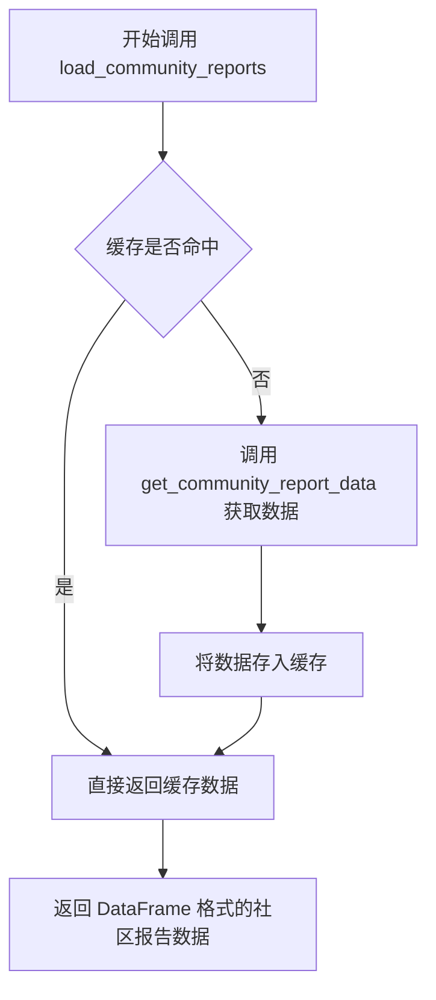

#### 带注释源码

```python
@st.cache_data(ttl=default_ttl)  # 使用 Streamlit 缓存装饰器，设置 TTL 为 default_ttl
def load_community_reports(
    _datasource: Datasource,  # 数据源对象，用于从数据源获取社区报告数据
) -> pd.DataFrame:
    """Return a list of CommunityReport objects."""
    # 调用底层数据获取函数，传入数据源，获取社区报告数据并返回
    return get_community_report_data(_datasource)
```


### `load_communities`

加载社区数据并返回包含社区对象的数据框。该函数使用 Streamlit 的缓存装饰器来避免重复加载相同的数据。

参数：

-  `_datasource`：`Datasource`，数据源对象，用于从指定的数据源获取社区数据

返回值：`pd.DataFrame`，包含社区对象的数据框

#### 流程图

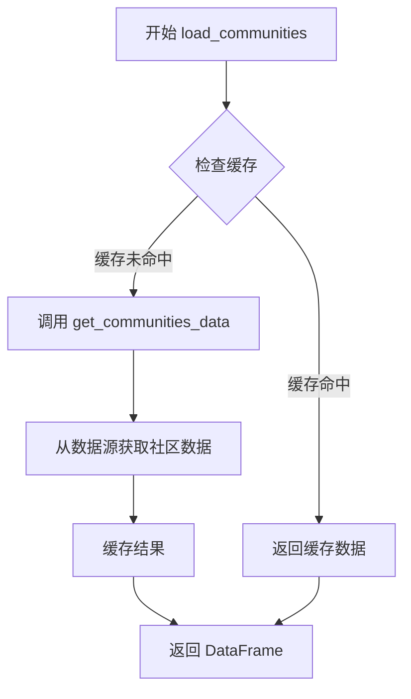

#### 带注释源码

```python
@st.cache_data(ttl=default_ttl)  # 使用 Streamlit 缓存装饰器，ttl=default_ttl 控制缓存有效期
def load_communities(
    _datasource: Datasource,  # 数据源对象，用于获取社区数据
) -> pd.DataFrame:  # 返回类型为 pandas DataFrame
    """Return a list of Communities objects."""  # 函数文档字符串，说明返回社区对象列表
    return get_communities_data(_datasource)  # 调用底层数据加载函数获取社区数据并返回
```


### `load_text_units`

该函数是一个 Streamlit 缓存数据加载函数，用于从指定的数据源加载文本单元（TextUnit）数据，并返回包含文本单元信息的 pandas DataFrame。

参数：

- `dataset`：`str`，指定要加载的数据集名称，用于标识要获取的文本单元所属的数据集
- `_datasource`：`Datasource`，数据源对象，提供访问底层数据存储的接口，用于获取文本单元数据

返回值：`pd.DataFrame`，返回一个包含 TextUnit 对象集合的 DataFrame，用于后续的知识模型构建

#### 流程图

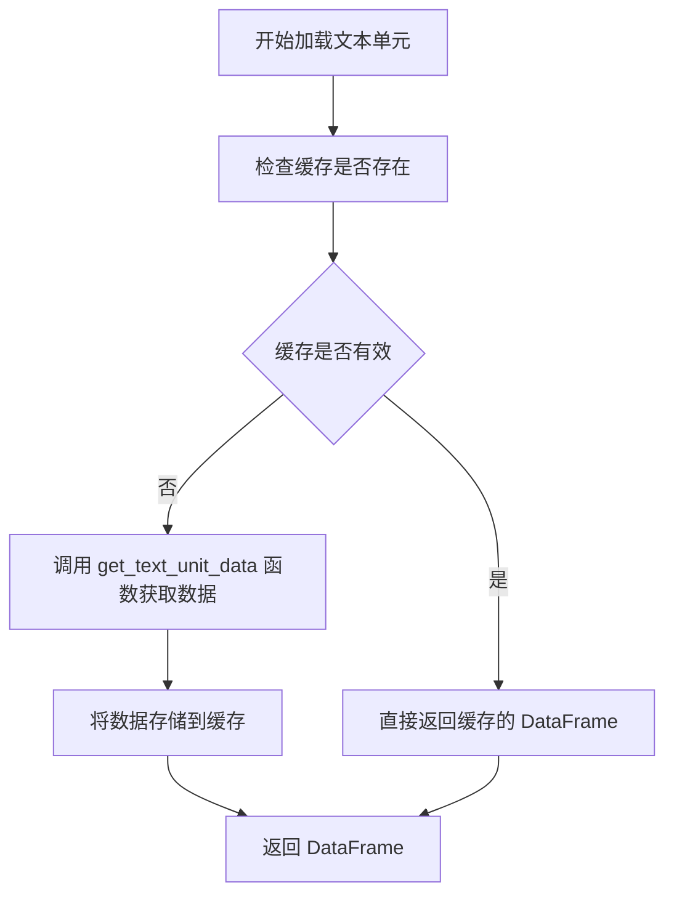

#### 带注释源码

```python
@st.cache_data(ttl=default_ttl)
def load_text_units(dataset: str, _datasource: Datasource) -> pd.DataFrame:
    """Return a list of TextUnit objects."""
    return get_text_unit_data(dataset, _datasource)
```

- `@st.cache_data(ttl=default_ttl)`：Streamlit 缓存装饰器，ttl 参数指定缓存的有效时间（从 data_config 模块的 default_ttl 变量获取），避免重复加载数据
- `dataset: str`：输入参数，字符串类型，表示要加载的文本单元所属的数据集标识符
- `_datasource: Datasource`：输入参数，数据源对象（注意：下划线前缀表示该参数仅用于内部处理，不直接使用其值），用于从底层存储中检索数据
- `get_text_unit_data(dataset, _datasource)`：调用 knowledge_loader.data_prep 模块中的函数，实际执行数据获取逻辑
- 返回值：pd.DataFrame 类型，包含所有文本单元记录的数据框，每行代表一个文本单元


### `load_model`

该函数是知识模型加载的核心入口，负责从指定的数据源中一次性加载所有图索引数据（包括实体、关系、协变量、社区报告、社区和文本单元），并将其组装为统一的 `KnowledgeModel` 数据对象供下游流程使用。

参数：

- `dataset`：`str`，数据集名称，用于标识需要加载的数据集
- `datasource`：`Datasource`，数据源对象，提供数据访问接口

返回值：`KnowledgeModel`，包含所有加载的知识图谱组件（实体、关系、社区报告、社区、文本单元及协变量）的数据模型对象

#### 流程图

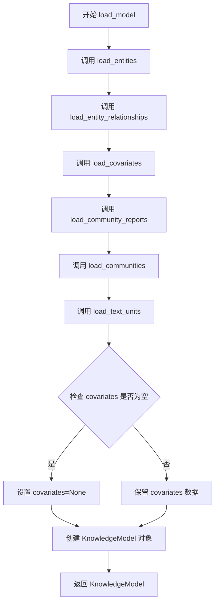

#### 带注释源码

```python
def load_model(
    dataset: str,
    datasource: Datasource,
):
    """
    Load all relevant graph-indexed data into collections of knowledge model objects and store the model collections in the session variables.

    This is a one-time data retrieval and preparation per session.
    """
    # 从数据源加载实体数据，返回包含实体信息的 DataFrame
    entities = load_entities(dataset, datasource)
    
    # 从数据源加载实体关系数据，返回包含关系信息的 DataFrame
    relationships = load_entity_relationships(dataset, datasource)
    
    # 从数据源加载协变量数据，返回包含协变量信息的 DataFrame
    covariates = load_covariates(dataset, datasource)
    
    # 从数据源加载社区报告数据
    community_reports = load_community_reports(datasource)
    
    # 从数据源加载社区数据
    communities = load_communities(datasource)
    
    # 从数据源加载文本单元数据
    text_units = load_text_units(dataset, datasource)

    # 构建并返回知识模型对象
    # 如果协变量数据为空，则设置为 None；否则保留实际数据
    return KnowledgeModel(
        entities=entities,
        relationships=relationships,
        community_reports=community_reports,
        communities=communities,
        text_units=text_units,
        covariates=(None if covariates.empty else covariates),
    )
```


### `get_entity_data`

从知识加载模块获取实体数据的函数，将图索引数据加载为实体对象集合。该函数是 GraphRAG 知识模型加载流程的核心组件之一，被 `load_entities` 包装函数调用。

参数：

- `dataset`：`str`，要加载的数据集名称，用于指定从哪个数据集获取实体数据
- `_datasource`：`Datasource`，数据源对象，提供数据访问接口

返回值：`pd.DataFrame`，包含实体数据的 Pandas DataFrame 对象

#### 流程图

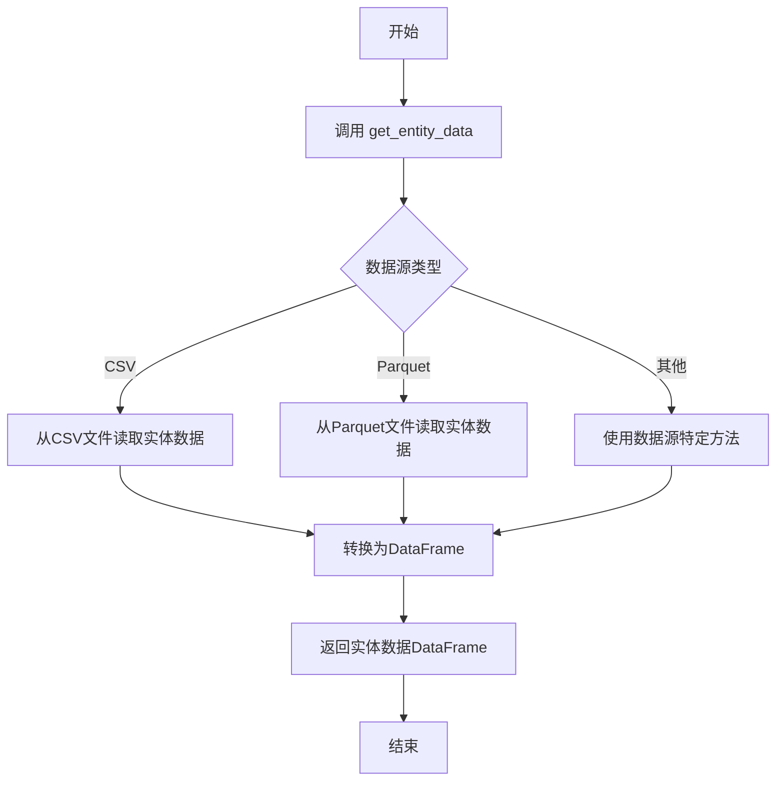

#### 带注释源码

```python
# 该函数定义在 knowledge_loader.data_prep 模块中
# 当前文件从该模块导入此函数

# 以下为调用方的使用方式（参考源码中的调用）：

@st.cache_data(ttl=default_ttl)  # Streamlit缓存装饰器，TTL为默认存活时间
def load_entities(
    dataset: str,           # 数据集名称字符串
    _datasource: Datasource, # 数据源对象（下划线前缀表示内部使用）
) -> pd.DataFrame:
    """Return a list of Entity objects."""
    # 调用 get_entity_data 获取实体数据
    # 参数：dataset - 数据集标识符
    # 参数：_datasource - 数据访问接口
    # 返回：包含实体记录的 DataFrame
    return get_entity_data(dataset, _datasource)


# 实际使用示例（在 load_model 函数中）：
def load_model(
    dataset: str,
    datasource: Datasource,
):
    """
    Load all relevant graph-indexed data into collections of knowledge model objects.
    """
    # 调用 get_entity_data 获取实体数据
    entities = load_entities(dataset, datasource)
    
    # ... 其他数据加载操作
    
    return KnowledgeModel(
        entities=entities,
        # ... 其他模型属性
    )
```

> **注意**：提供的代码文件中 `get_entity_data` 是从 `knowledge_loader.data_prep` 模块导入的外部函数，其具体实现未在此文件中展示。以上源码反映了该函数在当前上下文中的调用方式和使用场景。


### `get_relationship_data`

该函数从指定数据源加载实体关系数据，返回包含关系信息的 Pandas DataFrame。从代码的导入语句和调用方式来看，该函数由 `knowledge_loader.data_prep` 模块提供，具体实现未在本文件中展示。

参数：

- `dataset`：`str`，数据集标识符，用于指定要加载的数据集
- `_datasource`：`Datasource`，数据源对象，提供数据访问接口

返回值：`pd.DataFrame`，包含实体关系数据的 DataFrame 对象

#### 流程图

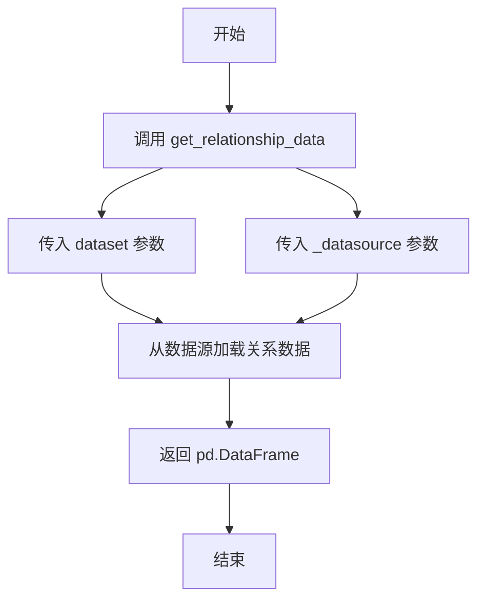

#### 带注释源码

```python
# 注：此函数定义未在当前文件中展示，
# 仅通过导入语句引入：
# from knowledge_loader.data_prep import get_relationship_data
#
# 该函数在 load_entity_relationships 中被调用：
#
# @st.cache_data(ttl=default_ttl)
# def load_entity_relationships(
#     dataset: str,
#     _datasource: Datasource,
# ) -> pd.DataFrame:
#     """Return lists of Entity and Relationship objects."""
#     return get_relationship_data(dataset, _datasource)

# 预期函数签名（根据调用推断）：
def get_relationship_data(
    dataset: str,
    _datasource: Datasource,
) -> pd.DataFrame:
    """
    从数据源加载实体关系数据。
    
    参数:
        dataset: 数据集标识符
        _datasource: 数据源对象
    
    返回:
        包含关系数据的 DataFrame
    """
    # 具体实现未在当前文件中展示
    pass
```


### `get_covariate_data`

获取指定数据集的协变量数据，并将其转换为 pandas DataFrame 返回。该函数是知识模型加载流程中的关键组件，用于从数据源中检索协变量信息（如实体属性、标签等）。

参数：

- `dataset`：`str`，目标数据集的名称或标识符，用于指定要加载哪个数据集的协变量
- `_datasource`：`Datasource`，数据源对象，提供数据访问接口，负责从底层存储或外部源读取协变量数据

返回值：`pd.DataFrame`，包含所有协变量记录的 DataFrame，每行代表一个协变量实例，列对应协变量的各个属性字段

#### 流程图

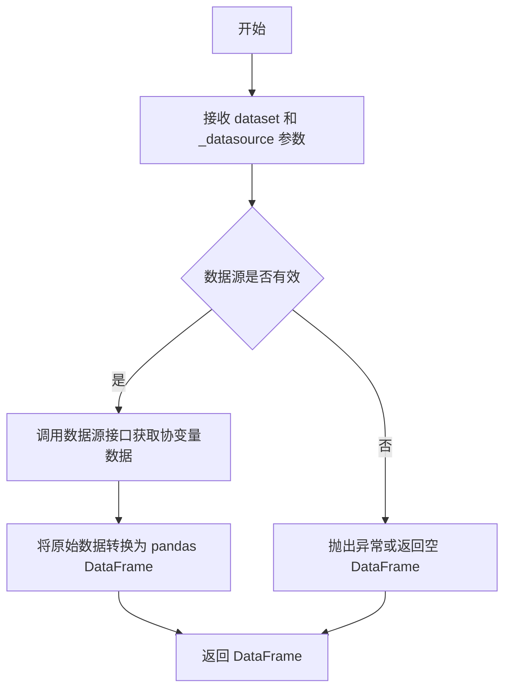

#### 带注释源码

```python
# 注意：此源码为基于调用方推断的函数签名，
# 实际实现位于 knowledge_loader.data_prep 模块中
def get_covariate_data(
    dataset: str,          # 数据集标识，用于定位要加载的数据
    _datasource: Datasource  # 数据源对象，提供数据读取能力
) -> pd.DataFrame:
    """
    从指定数据源加载指定数据集的协变量数据。
    
    协变量（Covariate）通常指与图中实体相关的额外信息，如：
    - 实体的属性值
    - 实体的分类标签
    - 时序相关的统计数据
    
    Args:
        dataset: 数据集名称或标识符
        _datasource: 数据源实例，负责底层数据访问
        
    Returns:
        包含协变量数据的 pandas DataFrame
    """
    # 实际实现会调用 _datasource 的相关方法
    # 例如：_datasource.get_covariates(dataset)
    # 并将结果转换为 DataFrame 返回
    pass
```


### `get_community_report_data`

从代码中可以看出，`get_community_report_data` 是一个从 `knowledge_loader.data_prep` 模块导入的函数。该函数用于从数据源加载社区报告（Community Report）数据，并返回一个包含社区报告对象的 Pandas DataFrame。

参数：

-  `_datasource`：`Datasource`（来自 `knowledge_loader.data_sources.typing` 模块），数据源对象，用于获取社区报告数据

返回值：`pd.DataFrame`，返回社区报告对象列表

#### 流程图

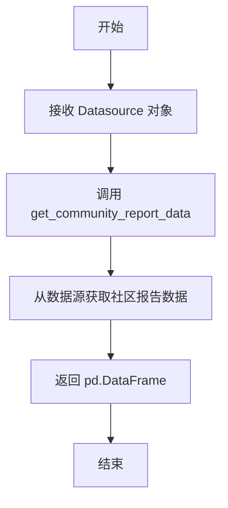

#### 带注释源码

```
# 从 knowledge_loader.data_prep 模块导入函数
# 注意：实际实现不在当前文件中，位于 knowledge_loader/data_prep.py 中
from knowledge_loader.data_prep import (
    get_community_report_data,
    # ... 其他导入
)

# 在 load_community_reports 函数中调用
@st.cache_data(ttl=default_ttl)
def load_community_reports(
    _datasource: Datasource,
) -> pd.DataFrame:
    """Return a list of CommunityReport objects."""
    return get_community_report_data(_datasource)
```

---

**注意**：由于 `get_community_report_data` 函数的实际实现位于 `knowledge_loader/data_prep.py` 模块中，当前代码文件仅展示了其导入和调用方式。如需获取完整的函数实现（包含具体的数据加载逻辑），请提供 `knowledge_loader/data_prep.py` 文件的内容。


### `get_communities_data`

从外部模块 `knowledge_loader.data_prep` 导入的函数，用于从数据源加载社区（Communities）数据并返回为 Pandas DataFrame 格式。

参数：

- `_datasource`：`Datasource`，数据源对象，提供社区数据的读取接口

返回值：`pd.DataFrame`，包含社区数据的 DataFrame 对象

#### 流程图

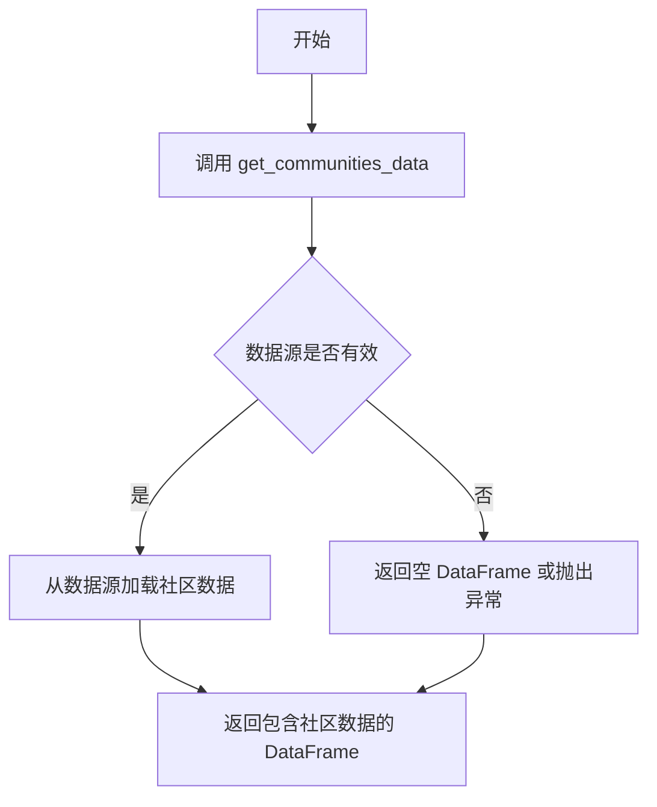

#### 带注释源码

```python
# 该函数定义在 knowledge_loader.data_prep 模块中
# 当前文件通过以下方式导入：
from knowledge_loader.data_prep import get_communities_data

# 在 load_communities 函数中被调用：
@st.cache_data(ttl=default_ttl)
def load_communities(
    _datasource: Datasource,
) -> pd.DataFrame:
    """Return a list of Communities objects."""
    return get_communities_data(_datasource)

# 参数说明：
# - _datasource: Datasource 类型，来自 knowledge_loader.data_sources.typing 模块
# 返回值说明：
# - pd.DataFrame 类型，包含社区（Communities）数据
```

---

**注意**：该函数的完整实现在 `knowledge_loader/data_prep.py` 模块中，当前代码文件仅包含导入和使用该函数的代码片段。如需查看完整的函数实现，请参考 `knowledge_loader/data_prep.py` 文件。


### `get_text_unit_data`

该函数为外部导入的函数，用于从指定的数据源加载文本单元（TextUnit）数据，并返回包含文本单元信息的 pandas DataFrame。

参数：

- `dataset`：`str`，数据集的名称标识
- `_datasource`：`Datasource`，数据源对象，用于获取底层数据

返回值：`pd.DataFrame`，包含文本单元数据的 DataFrame 对象

#### 流程图

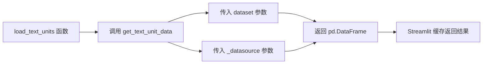

#### 带注释源码

```
# 该函数定义位于 knowledge_loader.data_prep 模块中
# 当前文件通过导入语句引用该函数
from knowledge_loader.data_prep import (
    get_text_unit_data,
)

# 在本文件中的调用方式
@st.cache_data(ttl=default_ttl)
def load_text_units(dataset: str, _datasource: Datasource) -> pd.DataFrame:
    """Return a list of TextUnit objects."""
    return get_text_unit_data(dataset, _datasource)
```

#### 补充说明

该函数是外部依赖函数，其完整实现位于 `knowledge_loader.data_prep` 模块中。从当前代码可知：

1. **函数签名**：`get_text_unit_data(dataset: str, _datasource: Datasource) -> pd.DataFrame`
2. **调用场景**：被 `load_text_units` 函数包装，使用 Streamlit 的 `@st.cache_data` 装饰器进行缓存，缓存超时时间由 `default_ttl` 配置
3. **数据流**：接收数据集名称和数据源对象，返回文本单元的 DataFrame 格式数据

## 关键组件


### Streamlit 缓存与惰性加载机制

使用 @st.cache_data 装饰器配合 default_ttl 实现数据缓存与惰性加载，避免重复从数据源加载相同数据

### 知识模型数据结构

KnowledgeModel 数据类作为容器，整合实体、关系、社区报告、社区、文本单元和协变量等多种图索引数据

### 数据加载函数集合

提供独立的加载函数分别加载实体、实体关系、协变量、社区报告、社区和文本单元数据，通过统一的数据源接口获取数据

### 数据源接口

通过 Datasource 抽象接口实现底层数据访问解耦，支持不同数据源实现


## 问题及建议


### 已知问题

- **类型注解不一致**: `load_covariates` 函数的文档字符串声称“返回 Covariate 对象字典”，但实际返回类型是 `pd.DataFrame`，存在文档与实现不匹配的问题。
- **参数设计不一致**: `load_community_reports` 和 `load_communities` 函数不接受 `dataset` 参数，而其他加载函数（如 `load_entities`、`load_text_units` 等）都接受 `dataset` 参数，导致 API 设计不一致。
- **缺少返回类型注解**: `load_model` 函数没有定义返回类型注解（应为 `KnowledgeModel`），影响代码可读性和类型检查。
- **数据源缓存问题**: 使用 `st.cache_data` 装饰器但传入的 `_datasource` 对象可能无法被正确哈希用于缓存键，可能导致缓存失效或意外行为。
- **空值处理逻辑问题**: `load_model` 中使用 `covariates.empty` 检查，但在 `KnowledgeModel` 定义中 `covariates` 类型为 `pd.DataFrame | None`，逻辑处理存在潜在风险。
- **缺乏错误处理**: 所有加载函数均没有 try-except 块和错误处理机制，网络异常、文件不存在或数据格式错误时会导致程序直接崩溃。
- **未使用的导入**: 导入了 `dataclass` 装饰器但 `KnowledgeModel` 类没有定义任何方法，仅作为纯数据容器使用。

### 优化建议

- 统一所有加载函数的参数设计，考虑是否需要为 `load_community_reports` 和 `load_communities` 添加 `dataset` 参数。
- 为 `load_model` 函数添加明确的返回类型注解 `: -> KnowledgeModel`。
- 将 `st.cache_data` 替换为更通用的缓存机制（如 `functools.lru_cache`），或确保 `Datasource` 对象实现正确的 `__hash__` 方法。
- 为所有加载函数添加异常处理和重试逻辑，提升健壮性。
- 考虑将 `KnowledgeModel` 改为具有验证逻辑的数据类，使用 `__post_init__` 方法进行数据校验。
- 考虑使用异步加载或并行加载多个数据集，提升 `load_model` 的性能。

## 其它


### 设计目标与约束

本模块的设计目标是将图索引数据（实体、关系、社区、文本单元、协变量等）从各种数据源加载到统一的KnowledgeModel对象中，供下游的graphrag-orchestration函数使用。约束包括：1）使用Streamlit的cache_data装饰器实现数据缓存以提升性能；2）所有数据加载函数必须接受dataset参数和datasource参数；3）协变量数据可能为空，需要处理None情况；4）返回类型统一使用pandas DataFrame以便于后续数据处理。

### 错误处理与异常设计

数据加载过程中的错误处理包括：1）数据源连接失败时向上抛出异常，由调用方处理；2）当协变量数据为空DataFrame时，转换为None存储；3）使用Streamlit的cache_data装饰器时，若缓存失效会自动重新执行加载函数；4）未对get_*_data函数的返回值进行显式验证，假设数据源返回有效数据。主要异常来源包括数据源不可用、数据格式不符合预期、dataset参数无效等。

### 数据流与状态机

数据流从外部数据源开始，经过各get_*_data函数获取原始数据，然后通过load_model函数组装成KnowledgeModel对象。数据流状态包括：初始状态（未加载）→加载中（各load_*_函数执行）→缓存状态（Streamlit cache）→就绪状态（返回KnowledgeModel）。每个load_*_函数独立缓存，支持部分数据刷新。KnowledgeModel对象在Session周期内保持有效。

### 外部依赖与接口契约

主要外部依赖包括：1）streamlit模块（提供@st.cache_data装饰器）；2）pandas模块（提供DataFrame数据结构）；3）data_config模块（提供default_ttl配置）；4）knowledge_loader.data_prep模块（提供各get_*_data函数）；5）knowledge_loader.data_sources.typing模块（提供Datasource类型）。接口契约方面：所有load_*函数接受dataset(str)和_datasource(Datasource)参数，返回pd.DataFrame；load_model函数返回KnowledgeModel对象；Datasource类型需实现数据读取接口。

### 性能考虑

性能优化主要通过Streamlit的@st.cache_data装饰器实现，TTL设置为default_ttl。每个数据加载函数独立缓存，支持按需刷新。潜在性能瓶颈包括：1）首次加载所有数据时可能耗时较长；2）大型数据集的DataFrame序列化和反序列化；3）缓存击穿时同时触发多个加载函数。建议在数据量大时考虑分页加载或流式处理。

### 安全性考虑

代码本身不直接处理敏感数据，但数据源可能包含敏感信息。安全考量包括：1）缓存数据可能存储在Streamlit的缓存目录中，需注意数据泄露风险；2）dataset参数未做输入验证，可能存在注入风险；3）_datasource参数以下划线开头表示为内部参数，应由系统初始化而非用户直接传入。建议添加输入验证和敏感数据脱敏机制。

### 配置与参数说明

关键配置参数包括：1）default_ttl（缓存生存时间），在data_config模块中定义；2）dataset（数据集标识符），用于区分不同数据源；3）datasource（Datasource对象），封装数据源连接和读取逻辑。KnowledgeModel类的字段包括：entities（实体数据）、relationships（关系数据）、community_reports（社区报告）、communities（社区数据）、text_units（文本单元）、covariates（协变量，可为None）。

### 缓存策略

采用Streamlit内置的st.cache_data装饰器实现缓存策略，TTL由default_ttl控制。缓存键基于函数参数生成，dataset和datasource变化时会触发缓存刷新。缓存适用于Session周期，刷新页面或修改参数会更新缓存。缓存失效场景包括：TTL过期、函数代码变更、输入参数变化。

### 数据验证

当前代码未实现显式的数据验证逻辑，依赖数据源返回有效数据。隐式验证包括：1）协变量为空时转换为None；2）DataFrame类型检查由pandas自动完成。建议添加的验证包括：1）验证必填字段存在性；2）验证数据类型符合预期；3）验证数据非空；4）验证实体ID唯一性等业务规则。

### 版本兼容性

代码依赖Python 3.8+特性（如dataclass、类型注解中的|操作符）。pandas版本需支持DataFrame操作。Streamlit版本需支持st.cache_data装饰器。建议在requirements.txt中明确指定：streamlit>=1.28.0、pandas>=1.5.0、Python>=3.8。类型注解使用from __future__ import annotations以提高兼容性。

    