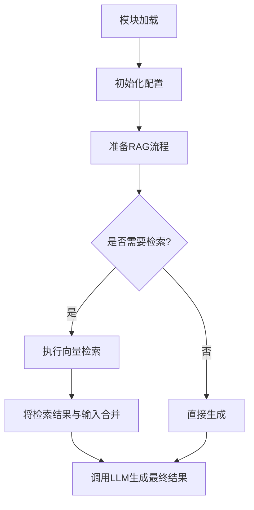

# `graphrag\unified-search-app\app\rag\__init__.py` 详细设计文档

该模块是RAG（检索增强生成）功能的基础框架模块，目前仅定义了模块入口和版权信息，具体实现待开发。

## 整体流程



## 类结构

```
RagModule (根模块)
├── (待定义: 检索组件)
├── (待定义: 向量存储组件)
└── (待定义: 生成组件)
```

## 全局变量及字段


    

## 全局函数及方法


## 关键组件


### 核心功能概述

由于提供的源代码仅包含版权声明和模块名称（"Rag module."），没有实际的代码实现，因此无法进行详细的功能分析和组件识别。

### 文件整体运行流程

无法分析 - 代码中未提供具体实现。

### 类详细信息

无法分析 - 代码中未包含任何类定义。

### 关键组件信息

由于源代码仅包含模块声明而无实际实现，识别不出具体的组件（如张量索引、惰性加载、反量化支持、量化策略等）。

### 潜在技术债务或优化空间

无法分析 - 代码中未包含任何实现代码。

### 其他项目

- **设计目标与约束**：无法确定 - 缺少代码实现细节
- **错误处理与异常设计**：无法分析 - 无实现代码
- **数据流与状态机**：无法分析 - 无实现代码
- **外部依赖与接口契约**：无法分析 - 无实现代码


## 问题及建议


### 已知问题

-   **模块内容为空**：该模块仅包含版权声明和简单的文档字符串，没有实现任何实际功能
-   **缺乏公共API**：未定义任何公开接口、类或函数，无法提供实际业务能力
-   **文档不完整**：模块文档仅为"Rag module"一句话说明，缺乏对功能、用途的详细描述
-   **无类型标注**：缺少类型提示(type hints)，不利于静态分析和IDE支持
-   **包结构未明确**：若作为包使用，缺少`__init__.py`文件或内容

### 优化建议

-   **实现核心功能**：根据"RAG"(Retrieval-Augmented Generation)定位，实现检索、增强、生成等核心功能模块
-   **定义公共API**：通过`__all__`明确导出接口，设计清晰的类和方法结构
-   **完善文档**：添加模块级文档，说明功能概述、使用方式、依赖关系等
-   **添加类型提示**：为所有函数和类添加完整的类型注解，提升代码可维护性
-   **包结构设计**：若为包结构，添加`__init__.py`并合理组织子模块导入
-   **错误处理机制**：设计统一的异常类和错误处理流程
-   **日志与配置**：添加适当的日志记录和配置管理机制


## 其它


### 一段话描述

该代码是Microsoft Corporation发布的RAG（检索增强生成）模块的初始占位文件，目前仅包含版权声明和模块文档字符串，尚未实现任何具体功能。作为一个RAG模块的框架，它预期将提供检索增强生成的核心功能，包括文档处理、向量存储、相似性搜索和生成式问答等能力。

### 文件的整体运行流程

由于当前代码仅为空壳模块，未包含任何可执行逻辑，因此无法描述具体的运行流程。基于模块名称"Rag module"的推测，预期该模块将作为RAG系统的核心组件，与向量数据库、嵌入模型和大型语言模型进行交互，实现从文档检索到答案生成的完整流程。

### 类的详细信息

当前代码中未定义任何类。基于RAG模块的典型架构，预期将包含以下核心类：

1. **Retriever类**：负责从文档集合中检索相关信息
2. **DocumentProcessor类**：负责文档加载、分 chunk 和预处理
3. **VectorStore类**：负责向量存储和相似性搜索
4. **RagPipeline类**：负责编排完整的RAG流程

### 类字段和全局变量

当前代码中未定义任何类字段或全局变量。

### 类方法和全局函数

当前代码中未定义任何类方法或全局函数。

### 关键组件信息

由于代码为空壳，无法识别具体的组件。

### 潜在的技术债务或优化空间

1. **代码完整性缺失**：模块尚未实现任何功能，需要大量开发工作
2. **文档完善**：需要补充API文档、使用示例和架构说明
3. **测试覆盖**：需要建立完整的单元测试和集成测试体系
4. **类型注解**：建议添加完整的类型注解以提高代码可维护性

### 设计目标与约束

基于模块名称推测，该RAG模块的设计目标应包括：支持多种文档格式的加载和处理、提供高效的向量检索能力、与主流LLM框架无缝集成、支持可扩展的架构设计。约束条件可能包括：需要兼容Microsoft的生态系统、遵循MIT开源许可协议、需要在性能和准确率之间取得平衡。

### 错误处理与异常设计

由于代码尚未实现，无法定义具体的异常类型。建议设计以下异常体系：RAGException作为基异常类、DocumentProcessingException用于文档处理错误、RetrievalException用于检索相关错误、VectorStoreException用于向量存储操作错误、ConfigurationException用于配置相关错误。

### 数据流与状态机

当前模块无状态机实现。预期的数据流为：文档输入 → 文档加载 → 文本分块 → 向量嵌入 → 向量存储 ←→ 查询输入 → 向量检索 → 上下文组装 → LLM生成 → 答案输出。

### 外部依赖与接口契约

基于RAG模块的典型需求，预期的外部依赖包括：向量数据库（如Azure AI Search、Qdrant等）、嵌入模型服务（如OpenAI Embeddings、Azure OpenAI等）、LLM服务（如GPT模型）、文档加载库（如LangChain、LlamaIndex等）。接口契约应定义标准的文档输入格式、检索查询接口、结果返回格式等。

### 性能要求与基准

由于模块尚未实现，无法定义具体的性能基准。但RAG模块通常需要满足以下性能要求：文档处理吞吐量、向量检索延迟（建议<100ms）、端到端响应时间、内存占用优化等。

### 安全考虑

需要考虑的安全因素包括：敏感文档的访问控制、向量化数据的加密传输和存储、API密钥的安全管理、用户数据的隐私保护、输入验证以防止注入攻击等。

### 兼容性设计

应考虑向后兼容性、跨版本支持、与主流LLM框架的集成兼容性、不同运行环境（本地、云端）的部署兼容性等。

    