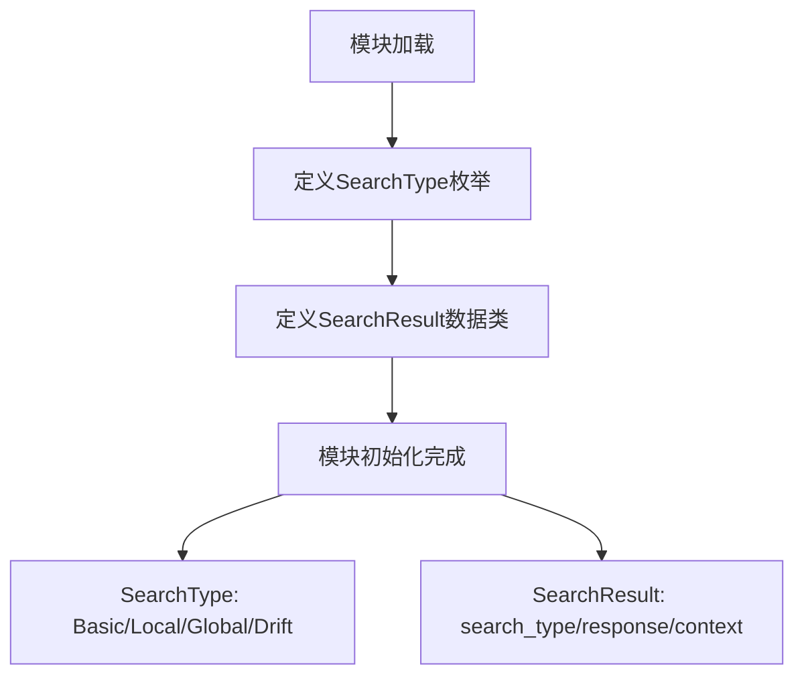
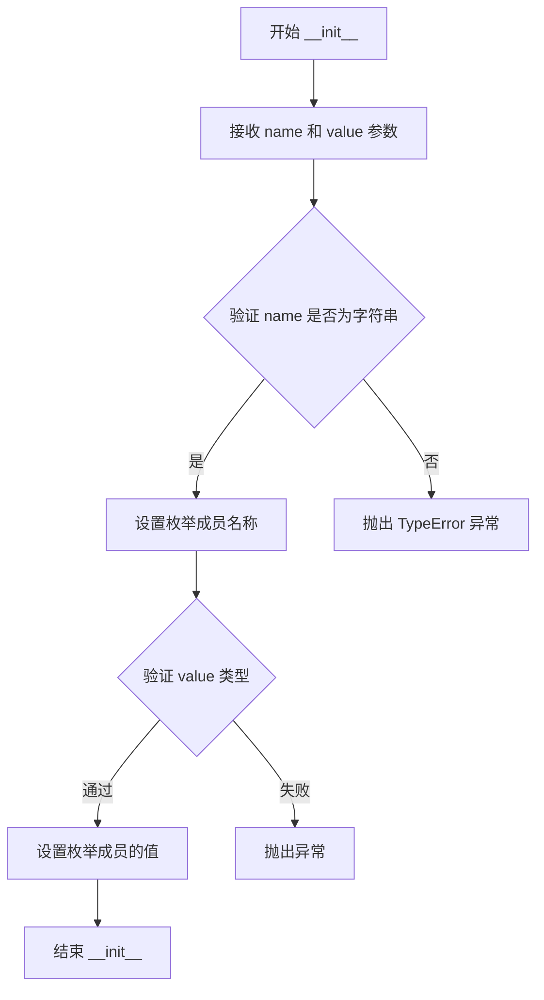
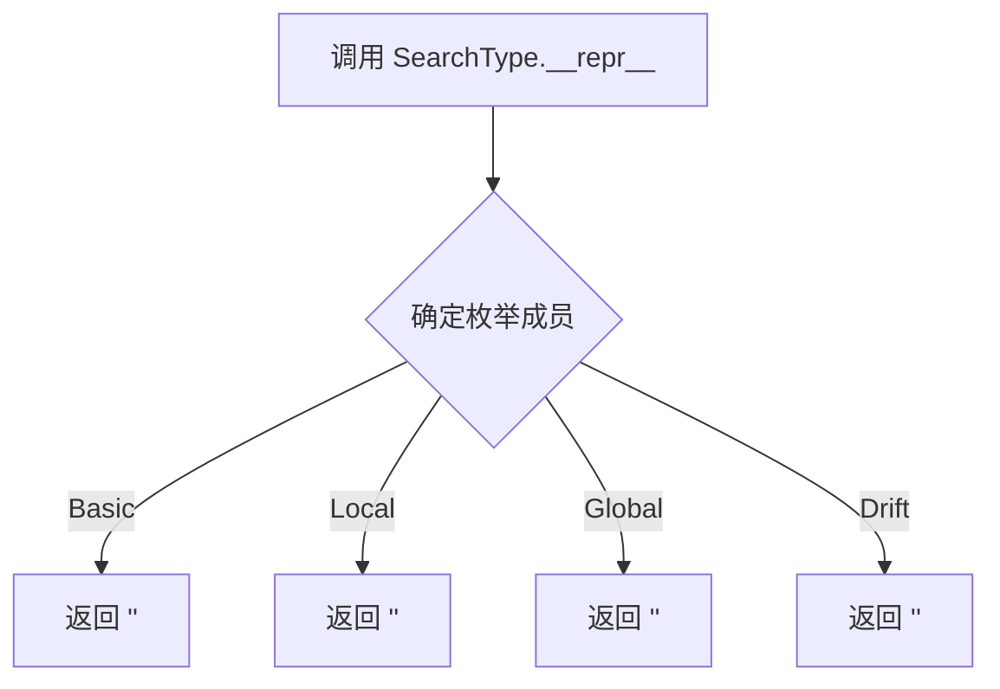
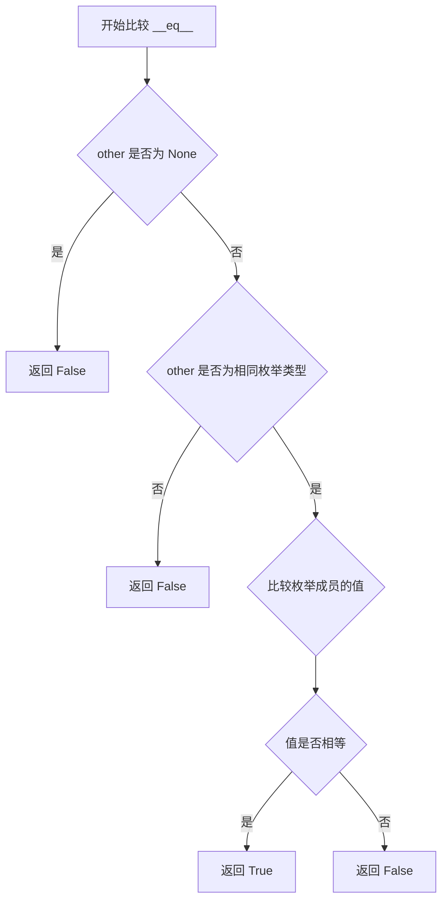
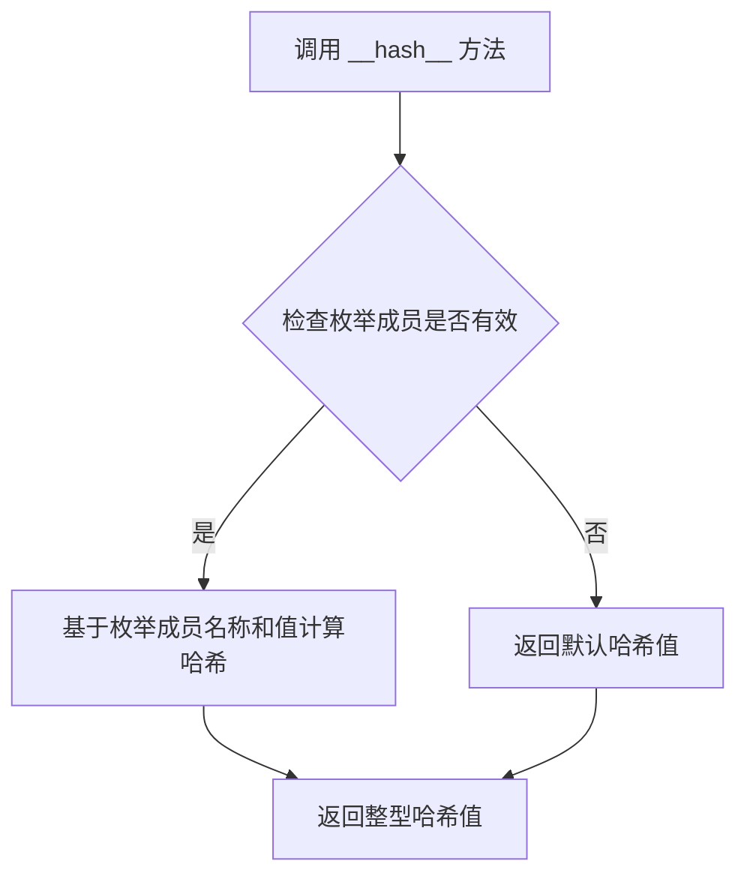
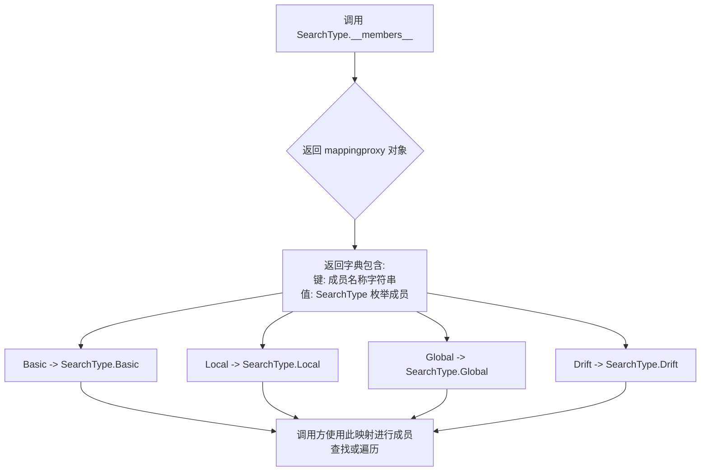
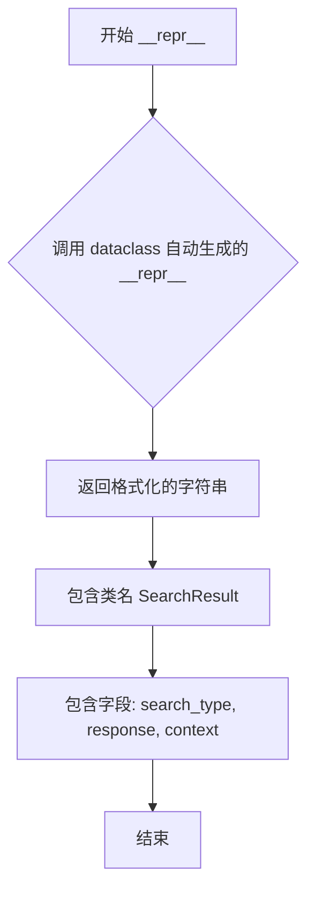
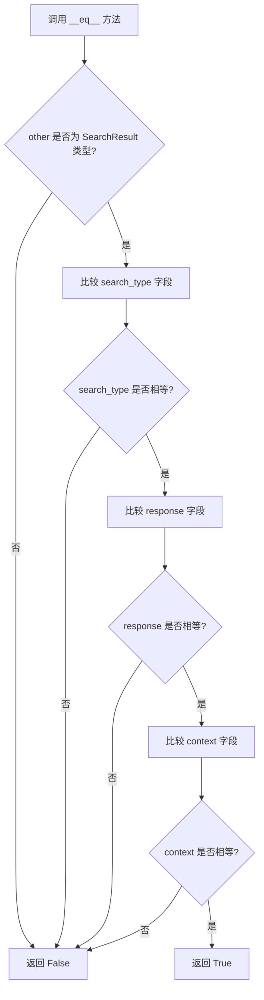

# `graphrag\unified-search-app\app\rag\typing.py` 详细设计文档

这是一个类型定义模块，定义了搜索功能的枚举类型SearchType和搜索结果的数据类SearchResult，用于支持不同搜索算法（基本搜索、本地搜索、全局搜索、漂移搜索）的结果存储和传递。

## 整体流程



## 类结构

```
SearchType (Enum)
└── Basic, Local, Global, Drift
SearchResult (dataclass)
└── search_type: SearchType
└── response: str
└── context: dict[str, pd.DataFrame]
```

## 全局变量及字段


### `SearchType`
    
Enumeration defining the types of search algorithms available: Basic, Local, Global, and Drift.

类型：`Enum`
    


### `SearchResult`
    
Data class for storing search results including the search type, response text, and context data as DataFrames.

类型：`Dataclass`
    


### `SearchType.SearchType.Basic`
    
Enum member representing a basic search algorithm.

类型：`SearchType`
    


### `SearchType.SearchType.Local`
    
Enum member representing a local search algorithm.

类型：`SearchType`
    


### `SearchType.SearchType.Global`
    
Enum member representing a global search algorithm.

类型：`SearchType`
    


### `SearchType.SearchType.Drift`
    
Enum member representing a drift search algorithm.

类型：`SearchType`
    


### `SearchResult.SearchResult.search_type`
    
Field indicating which search algorithm was used to generate this result.

类型：`SearchType`
    


### `SearchResult.SearchResult.response`
    
Field containing the textual response or result from the search operation.

类型：`str`
    


### `SearchResult.SearchResult.context`
    
Field storing supplementary context data as a dictionary mapping string keys to pandas DataFrames.

类型：`dict[str, pd.DataFrame]`
    
    

## 全局函数及方法


### `SearchType.__init__`

这是 Python Enum 类的默认初始化方法，用于初始化枚举成员的名称和值。由于 SearchType 继承自 Enum 且未显式定义 __init__ 方法，因此使用 Enum 类的默认实现。

参数：

- `name`：`str`，枚举成员的名称（如 "Basic", "Local" 等）
- `value`：`Any`，枚举成员的值（如 "basic", "local" 等）

返回值：`None`，无返回值（初始化方法）

#### 流程图



#### 带注释源码

```python
# SearchType 类继承自 Python 内置的 Enum 类
# 由于未显式定义 __init__ 方法，因此使用 Enum 类的默认实现
class SearchType(Enum):
    """SearchType class definition."""

    # 枚举成员的赋值操作会调用 Enum.__init__ 方法
    # 格式：MemberName = "member_value"
    # 其中 "member_value" 将作为 value 参数传递给 __init__
    # name 参数自动从成员名称获取（如 "Basic", "Local" 等）
    
    Basic = "basic"      # 调用 Enum.__init__(self, "Basic", "basic")
    Local = "local"      # 调用 Enum.__init__(self, "Local", "local")
    Global = "global"    # 调用 Enum.__init__(self, "Global", "global")
    Drift = "drift"      # 调用 Enum.__init__(self, "Drift", "drift")


# 实际的 Enum.__init__ 源码逻辑（来自 Python 标准库）
# def __init__(self, name, value=None, **kwargs):
#     # 确保 name 是字符串类型
#     if not isinstance(name, str):
#         raise TypeError(f"Invalid name: {name!r}")
#     # 设置枚举成员的属性
#     self._name_ = name
#     self._value_ = value if value is not None else name
#     # 存储额外的关键字参数（如果存在）
#     for k, v in kwargs.items():
#         setattr(self, k, v)
```


### `SearchType.__repr__`

该方法是 Python Enum 类的默认 `__repr__` 方法，用于返回枚举成员的标准字符串表示形式。在 SearchType 枚举类中未显式定义此方法，因此使用 Python Enum 基类提供的默认实现。

参数：

- `self`：`SearchType`，表示调用该方法的枚举实例本身（Basic、Local、Global 或 Drift 之一）

返回值：`str`，返回枚举成员的字符串表示形式，格式为 `<SearchType.成员名称: '成员值'>`

#### 流程图



#### 带注释源码

```python
# SearchType 是 Python 内置 Enum 类的子类
# 未显式定义 __repr__ 方法，使用 Enum 基类的默认实现
class SearchType(Enum):
    """
    SearchType 枚举类定义。
    用于表示搜索算法的四种类型：基础搜索、本地搜索、全局搜索和漂移搜索。
    """
    
    Basic = "basic"      # 基础搜索类型
    Local = "local"      # 本地搜索类型
    Global = "global"    # 全局搜索类型
    Drift = "drift"      # 漂移/变异搜索类型
    
    # 以下是 Enum 基类默认提供的 __repr__ 方法实现
    # def __repr__(self):
    #     return '<%s.%s: %r>' % (self.__class__.__name__, self._name_, self._value_)
    
    # 调用示例：
    # >>> SearchType.Basic
    # <SearchType.Basic: 'basic'>
    # >>> repr(SearchType.Local)
    # <SearchType.Local: 'local'>
```


### `SearchType.__eq__`

用于比较 `SearchType` 枚举成员与其他对象是否相等。Python 枚举的 `__eq__` 方法不仅会比较枚举成员的标识，还会比较其值（value），确保枚举成员的唯一性和一致性。

参数：

- `self`：`SearchType`，枚举实例本身，即当前进行相等性比较的枚举成员
- `other`：`Any`，需要与枚举实例进行比较的任意对象，可以是枚举成员或其他类型

返回值：`bool`，如果两个对象相等返回 `True`，否则返回 `False`

#### 流程图



#### 带注释源码

```python
# 继承自 Python Enum 类的 __eq__ 方法实现
# SearchType 枚举类继承自 Enum，因此自动获得此方法

def __eq__(self, other):
    """
    比较枚举成员与其他对象是否相等。
    
    比较逻辑：
    1. 如果 other 为 None，返回 False
    2. 如果 other 不是相同类型的枚举实例，返回 False
    3. 如果枚举成员的值相等，返回 True，否则返回 False
    
    注意：Python 枚举的 __eq__ 方法会比较枚举成员的名称和值，
    确保每个枚举值在类型内是唯一的。
    """
    # Enum 基类的实际实现逻辑
    if other is None:
        return False
    
    # 检查是否为同一枚举类型
    if not isinstance(other, self.__class__):
        return False
    
    # 比较枚举成员的值
    return self.value == other.value


# 使用示例
# basic = SearchType.Basic
# local = SearchType.Local
# basic == SearchType.Basic  # True
# basic == SearchType.Local  # False
# basic == "basic"           # False（值类型不同）
```

#### 潜在优化空间

由于 `__eq__` 继承自 Python 标准库 `Enum` 类，其实现已经过高度优化。如需自定义相等性比较逻辑（如支持字符串值比较 `SearchType.Basic == "Basic"`），可以显式重写该方法。


### `SearchType.__hash__`

该方法为Python Enum类自动提供的哈希方法，用于支持SearchType枚举类型作为字典键或放入集合中。由于SearchType继承自Enum且其成员值均为字符串类型，默认实现的哈希逻辑基于枚举成员的名称和值，确保相同成员具有相同的哈希值且不可变。

参数：此方法不接受任何显式参数（使用Python隐式self参数）

- `self`：枚举实例本身，表示当前的SearchType枚举成员

返回值：`int`，返回枚举成员的哈希值，确保该枚举类型可以用于字典键或集合中

#### 流程图



#### 带注释源码

```python
# SearchType类继承自Python内置的Enum类
# Enum类自动提供了__hash__方法的默认实现
# 以下是Python Enum对__hash__方法的核心逻辑说明：

# 隐式继承的__hash__方法实现逻辑：
def __hash__(self):
    """
    返回枚举成员的哈希值。
    
    Python Enum的默认__hash__实现基于：
    1. 枚举类的名称（SearchType）
    2. 枚举成员的名称（如'Basic', 'Local'等）
    3. 枚举成员的值（如'basic', 'local'等）
    
    哈希计算公式（简化版）：
    hash((self.__class__.__name__, self.name, self.value))
    
    返回：
        int: 枚举成员的哈希值，确保相同成员返回相同哈希
    """
    # 由于SearchType是Enum，Python自动提供此方法
    # 返回基于(类名, 成员名, 成员值)的元组哈希
    return hash((self.__class__.__name__, self.name, self.value))


# 使用示例：
# search_type = SearchType.Basic
# print(hash(search_type))  # 输出: 一个整型哈希值
# print(SearchType.Basic.__hash__())  # 显式调用方式
```

#### 实际使用示例

```python
# 以下代码展示了SearchType.__hash__的实际应用场景

# 场景1：作为字典键
search_algorithms = {
    SearchType.Basic: "基础搜索算法",
    SearchType.Local: "局部搜索算法",
    SearchType.Global: "全局搜索算法",
    SearchType.Drift: "漂移搜索算法"
}

# 场景2：放入集合中
allowed_types = {SearchType.Basic, SearchType.Local}

# 场景3：哈希值验证
print(f"SearchType.Basic的哈希值: {hash(SearchType.Basic)}")
print(f"SearchType.Local的哈希值: {hash(SearchType.Local)}")
print(f"相同枚举成员哈希值相等: {hash(SearchType.Basic) == hash(SearchType.Basic)}")
```


### `SearchType.__members__`

该方法是 Python 枚举类的内置属性，返回一个只读的映射字典（mappingproxy），键为枚举成员的名称字符串，值为对应的枚举成员对象，可用于按名称访问枚举成员或遍历所有成员。

参数：

- （无额外参数，继承自 Enum 基类）

返回值：`mappingproxy`，返回一个只读字典，键为枚举成员名称（str 类型），值为对应的枚举成员（SearchType 类型），描述了所有定义的枚举成员及其名称映射关系。

#### 流程图



#### 带注释源码

```python
# SearchType 枚举类定义
class SearchType(Enum):
    """SearchType class definition."""

    Basic = "basic"
    Local = "local"
    Global = "global"
    Drift = "drift"


# __members__ 是 Enum 类的内置属性
# 调用方式：SearchType.__members__
# 返回值类型：mappingproxy (只读的字典类型)

# 示例用法：
# 1. 获取所有成员名称 -> 列表
# names = list(SearchType.__members__.keys())  # ['Basic', 'Local', 'Global', 'Drift']

# 2. 获取所有成员对象 -> 列表
# members = list(SearchType.__members__.values())  # [SearchType.Basic, SearchType.Local, ...]

# 3. 按名称查找成员
# member = SearchType.__members__.get('Basic')  # 返回 SearchType.Basic

# 4. 遍历所有成员
# for name, member in SearchType.__members__.items():
#     print(f"{name}: {member.value}")
```


### `SearchResult.__init__`

SearchResult 类的初始化方法，用于创建一个 SearchResult 数据类实例，存储搜索算法的搜索类型、响应字符串和上下文数据字典。

参数：

- `search_type`：`SearchType`，搜索算法的类型，枚举值包括 Basic、Local、Global、Drift
- `response`：`str`，搜索算法返回的响应字符串
- `context`：`dict[str, pd.DataFrame]，搜索算法返回的上下文数据，以字符串为键、pandas DataFrame 为值的字典

返回值：`None`，构造函数不返回值，仅初始化实例属性

#### 流程图

```mermaid
flowchart TD
    A[开始 __init__] --> B{接收参数}
    B --> C[search_type: SearchType]
    B --> D[response: str]
    B --> E[context: dict[str, pd.DataFrame]]
    C --> F[赋值给 self.search_type]
    D --> G[赋值给 self.response]
    E --> H[赋值给 self.context]
    F --> I[创建并返回 SearchResult 实例]
    G --> I
    H --> I
    I[结束 __init__]
```

#### 带注释源码

```python
@dataclass
class SearchResult:
    """SearchResult class definition."""

    # create a dataclass to store the search result of each algorithm
    # 搜索类型字段，存储搜索算法的类型（Basic/Local/Global/Drift）
    search_type: SearchType
    
    # 响应字段，存储搜索算法返回的字符串结果
    response: str
    
    # 上下文字段，存储搜索算法的上下文数据
    # 键为字符串（通常为节点ID或实体名称），值为 pandas DataFrame
    context: dict[str, pd.DataFrame]
```

> **注意**：由于 `SearchResult` 使用 `@dataclass` 装饰器，Python 会自动生成 `__init__` 方法。上述源码展示了 dataclass 的字段定义，这些字段在初始化时自动成为 `__init__` 方法的参数。上图流程描述了当调用 `SearchResult(search_type, response, context)` 时的参数传递和赋值过程。


### `SearchResult.__repr__`

该方法是 `SearchResult` 数据类自动生成的字符串表示方法，用于返回对象的可读字符串描述，包含搜索类型、响应内容以及上下文数据框的摘要信息。

参数： 无

返回值： `str`，返回对象的官方字符串表示，包含类名以及所有字段的名称和值

#### 流程图



#### 带注释源码

```python
# 由于 SearchResult 使用 @dataclass 装饰器
# Python 会自动为其生成 __repr__ 方法
# 该方法无需显式定义，直接使用 dataclass 提供的默认实现

# 自动生成的 __repr__ 方法等效于以下实现：
def __repr__(self) -> str:
    """
    返回 SearchResult 对象的官方字符串表示。
    
    返回格式:
    'SearchResult(search_type=..., response=..., context=...)'
    """
    return (
        f"SearchResult("
        f"search_type={self.search_type!r}, "
        f"response={self.response!r}, "
        f"context={self.context!r})"
    )

# 使用示例：
# result = SearchResult(
#     search_type=SearchType.Basic,
#     response="Example response",
#     context={"table1": pd.DataFrame()}
# )
# print(result)
# 输出: SearchResult(search_type=<SearchType.Basic: 'basic'>, response='Example response', context={'table1': Empty DataFrame...})
```


### `SearchResult.__eq__`

由于 `SearchResult` 是一个使用 `@dataclass` 装饰器定义的类，`__eq__` 方法是由 Python 数据类自动生成的。该方法通过比较对象的所有字段（`search_type`、`response` 和 `context`）来确定两个实例是否相等。

参数：

- `self`：`SearchResult`，当前对象（隐式参数）
- `other`：`object`，要与之比较的另一个对象

返回值：`bool`，如果两个 `SearchResult` 对象的所有字段都相等则返回 `True`，否则返回 `False`

#### 流程图



#### 带注释源码

```python
def __eq__(self, other: object) -> bool:
    """
    自动生成的 __eq__ 方法，用于比较两个 SearchResult 对象是否相等。
    
    该方法由 @dataclass 装饰器自动生成，通过递归比较所有字段来确定相等性：
    - search_type: SearchType 枚举类型
    - response: str 字符串类型
    - context: dict[str, pd.DataFrame] 字典类型
    
    参数:
        other: 要与之比较的对象
        
    返回值:
        bool: 所有字段都相等时返回 True，否则返回 False
    """
    if not isinstance(other, SearchResult):
        # 如果比较对象不是 SearchResult 类型，直接返回 False
        return NotImplemented
    
    # 比较所有三个字段是否相等
    return (
        self.search_type == other.search_type and
        self.response == other.response and
        self.context == other.context
    )
```

#### 说明

此方法由 Python 的 `@dataclass` 装饰器在类定义时自动生成。当且仅当两个 `SearchResult` 实例的 `search_type`、`response` 和 `context` 三个字段全部相等时，它们被视为相等。


## 关键组件


### SearchType 枚举类

定义搜索算法的类型枚举，包含四种搜索模式：基础搜索、本地搜索、全局搜索和漂移搜索，用于区分不同的搜索策略和算法实现。

### SearchResult 数据类

存储搜索算法执行结果的数据结构，包含搜索类型、响应文本和上下文数据三个字段，其中上下文数据以字符串键到 Pandas DataFrame 的字典形式存储，支持多种搜索结果的复合返回。

### pd.DataFrame 上下文存储

使用 Pandas DataFrame 作为搜索结果的上下文容器，支持结构化表格数据的存储和操作，便于后续的数据分析和处理。

### dict[str, pd.DataFrame] 类型提示

采用类型提示定义字典结构，键为字符串类型（可能用于标识数据来源或索引），值为 DataFrame 类型，确保类型安全和代码可读性。


## 问题及建议


### 已知问题

-   **pandas依赖过重**：typing模块中直接引用`pd.DataFrame`作为类型提示，会导致任何使用该模块的项目都必须引入pandas库，增加了不必要的依赖重量
-   **Python版本兼容性问题**：使用了Python 3.9+的内置类型提示语法`dict[str, pd.DataFrame]`，未添加`from __future__ import annotations`以支持Python 3.8
-   **类型约束不够精确**：`response`字段仅声明为`str`类型，无法表达具体的响应格式或结构约束
-   **上下文字典键类型不明确**：`dict[str, pd.DataFrame]`中的键类型仅为`str`，缺乏具体的约束和文档说明
-   **缺少数据验证**：SearchResult作为数据类，没有任何验证逻辑，无法保证数据的有效性和完整性
-   **缺乏可扩展性**：SearchResult类仅包含数据字段，缺少方便的方法来操作或处理结果
-   **文档不完整**：SearchResult的各个字段缺少详细的docstring说明其用途和约束

### 优化建议

-   **解除pandas强耦合**：使用泛型或Protocol定义抽象的表格数据类型，将pandas依赖移至具体实现层
-   **添加Python版本兼容支持**：在文件顶部添加`from __future__ import annotations`以支持Python 3.8
-   **增强类型提示**：为`response`字段使用更具体的类型定义或泛型参数，为context字典的键定义枚举或常量类
-   **添加数据验证**：在SearchResult类中添加`__post_init__`方法进行数据验证，或使用Pydantic替代dataclass
-   **扩展功能方法**：添加便捷方法如`to_dict()`、`from_dict()`或`merge()`等，提升类的可用性
-   **完善文档注释**：为每个字段添加详细的docstring，说明其含义、约束条件和示例


## 其它


### 设计目标与约束

本模块旨在为搜索算法提供类型定义支持，定义统一的搜索结果数据结构，支持多种搜索类型（Basic、Local、Global、Drift），并确保与pandas数据结构的兼容性。约束包括：仅支持Python 3.8+版本，需要pandas依赖。

### 错误处理与异常设计

本模块本身不涉及复杂的错误处理，主要通过Python类型检查器进行静态类型验证。SearchResult的context字段要求值必须为pd.DataFrame类型，若传入非DataFrame类型将在运行时引发TypeError。建议在使用时进行类型检查或使用try-except捕获DataFrame相关异常。

### 数据流与状态机

本模块为数据定义模块，不涉及状态机设计。SearchResult作为数据容器在搜索算法和调用方之间传递数据，典型流程为：搜索算法执行→生成SearchResult实例→返回给调用方→调用方读取response和context进行后续处理。

### 外部依赖与接口契约

主要依赖包括：pandas（用于DataFrame结构）、dataclasses（Python标准库）、enum（Python标准库）。SearchResult的context字段为dict[str, pd.DataFrame]，调用方需保证传入的字典值类型正确。SearchType枚举值均为字符串，可序列化为JSON。

### 性能考虑与资源约束

SearchResult使用dataclass实现，相比普通类具有较低的记忆体开销。context字段存储DataFrame引用而非复制，内存占用取决于调用方传入的DataFrame大小。建议避免在context中存储过大的DataFrame，或考虑使用DataFrame的分块处理。

### 安全性考虑

本模块为纯数据定义模块，不涉及用户输入处理或敏感数据操作。context字段可能包含从外部数据源读取的DataFrame，需确保数据源的可信性。SearchResult实例在跨进程传递时需注意DataFrame的序列化兼容性。

### 测试策略

建议单元测试覆盖：SearchType枚举值完整性验证、SearchResult实例化及字段访问、context字段类型检查、枚举值字符串表示验证。可使用pytest框架结合pandas测试工具进行测试。

### 配置与扩展性

SearchType枚举可直接扩展新搜索类型，SearchResult可通过继承或组合模式扩展新字段。建议使用枚举而非字符串常量以获得类型安全和IDE支持。未来可考虑将SearchResult改为Protocol以支持更多数据结构。

### 版本兼容性

代码使用Python 3.8+的dataclass语法（frozen=False, order=False默认参数）。pandas依赖版本建议>=1.0.0以确保dict类型提示的兼容性。SearchType枚举值采用字符串形式，便于跨版本序列化。

### 使用示例

```python
# 创建SearchResult实例
result = SearchResult(
    search_type=SearchType.Basic,
    response="搜索完成",
    context={"data": pd.DataFrame({"col": [1, 2, 3]})}
)

# 访问搜索结果
print(result.search_type)  # SearchType.Basic
print(result.response)     # 搜索完成
print(result.context["data"])
```


    