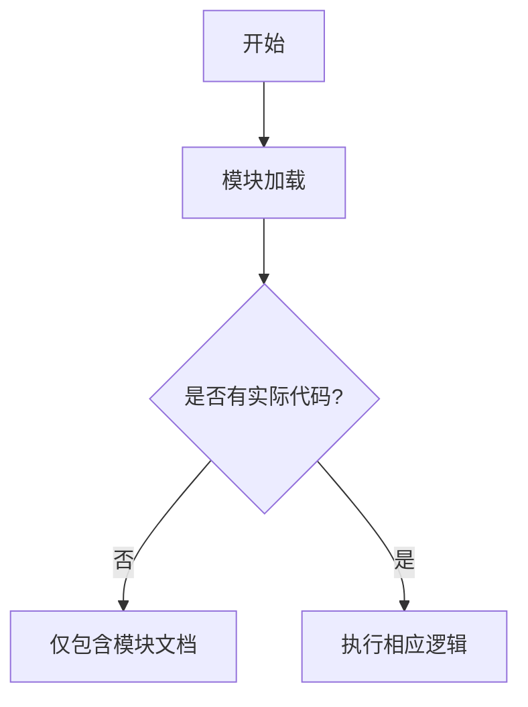

# `graphrag\unified-search-app\app\state\__init__.py` 详细设计文档

该模块为应用程序状态管理模块，但当前文件仅包含版权声明和模块文档字符串，尚未实现任何实际功能代码。

## 整体流程



## 类结构

```
该文件目前无类定义
```

## 全局变量及字段


    

## 全局函数及方法


## 关键组件


## 问题及建议


### 已知问题

-   该模块仅为空壳文件，仅包含版权声明和模块文档字符串，无任何实际实现代码
-   缺少应用状态管理相关的任何类、函数或变量定义
-   无法从当前代码中提取任何具体的业务流程或逻辑实现
-   缺乏状态持久化、状态变更通知等核心功能的定义

### 优化建议

-   根据"App state module"的命名，建议实现完整的状态管理类，包括状态存储、状态获取、状态更新等基本操作
-   建议定义清晰的状态数据结构（如使用dataclass或Pydantic模型），明确状态字段及其类型
-   建议实现状态变更监听机制，支持观察者模式或回调函数，以便状态变化时通知相关组件
-   建议考虑线程安全性，如果应用涉及并发操作，应使用锁或线程安全的数据结构
-   建议添加状态持久化支持，如序列化和反序列化方法，支持应用重启后状态恢复
-   建议定义错误处理机制，包括无效状态转换的校验和异常处理
-   建议添加状态历史记录或版本控制功能，便于调试和审计


## 其它


### 设计目标与约束

本文档旨在定义应用状态管理模块的核心架构设计。设计目标包括：提供清晰的状态管理接口、支持状态的持久化和恢复、确保状态变更的可追踪性。约束条件包括：必须兼容现有模块、无外部状态存储依赖、遵循既定的编码规范。

### 错误处理与异常设计

定义状态模块可能抛出的异常类型，包括：StateInitializationError（状态初始化失败）、StateValidationError（状态验证失败）、StatePersistenceError（状态持久化失败）。异常处理策略：模块内部捕获并记录日志，向上层抛出业务异常，由调用方决定处理方式。

### 数据流与状态机

状态模块的数据流遵循以下路径：外部输入 → 状态验证 → 状态更新 → 状态发布 → 持久化。状态转换由状态机管理，定义以下状态：Initial（初始状态）、Loading（加载中）、Ready（就绪）、Error（错误）、Dirty（待持久化）。

### 外部依赖与接口契约

本模块依赖以下外部组件：Python标准库（logging、json、pickle）、可能的持久化后端（文件系统或数据库）。对外接口包括：get_state()、set_state()、reset_state()、subscribe()、unsubscribe()。

### 性能考虑

状态模块的性能指标目标：状态读取延迟 < 1ms、状态写入延迟 < 5ms、内存占用与状态规模成正比。优化策略：采用懒加载、缓存热点状态、批量持久化。

### 安全性考虑

状态数据敏感性分析：可能包含用户配置、临时数据。安全措施：敏感数据不持久化、状态数据脱敏处理、访问控制检查。

### 兼容性/版本控制

API版本管理策略：主版本号变更表示不兼容更新、次版本号变更表示向后兼容的新增功能。状态格式版本控制：包含版本标识符，支持旧版本状态的迁移。

### 测试策略

单元测试覆盖要求：所有公共方法100%覆盖、边界条件测试、异常路径测试。集成测试策略：与持久化层集成测试、状态同步测试、性能基准测试。

### 配置管理

配置项定义：持久化路径、持久化策略、日志级别、自动恢复开关。配置来源优先级：环境变量 > 配置文件 > 默认值。

### 日志与监控

日志规范：使用Python标准logging模块、记录状态变更事件、记录异常堆栈。监控指标：状态变更频率、持久化操作耗时、内存使用量。

### 变更历史/版本历史

本章节记录模块的版本演进：v0.1.0（初始版本，模块骨架）、v0.2.0（添加基础状态管理功能）、v1.0.0（正式版本，完整功能）。

    