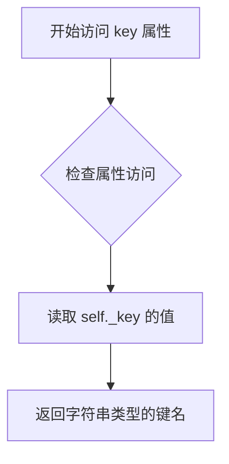
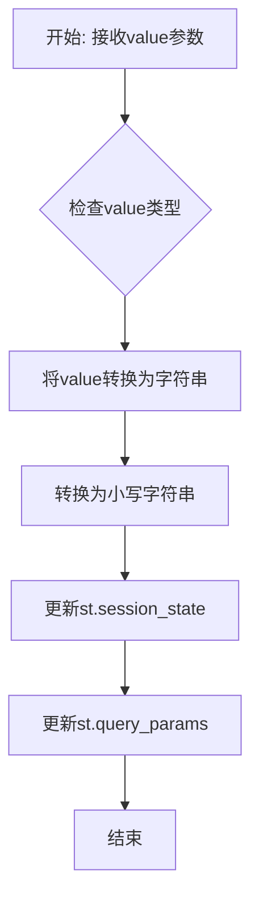

# `graphrag\unified-search-app\app\state\query_variable.py` 详细设计文档

QueryVariable类用于管理Streamlit应用URL查询字符串中的变量，实现了字符串与布尔值之间的转换，并通过session state实现与query params的同步更新。

## 整体流程

```mermaid
graph TD
    A[开始] --> B{key是否在query_params中?}
B -- 是 --> C[获取query_params值并转为小写]
B -- 否 --> D[使用default值]
C --> E{值是否为'true'?}
D --> E
E -- 是 --> F[val = True]
E -- 否 --> G{值是否为'false'?}
G -- 是 --> H[val = False]
G -- 否 --> I[保持原值]
F --> J{key是否在session_state中?]
H --> J
I --> J
J -- 否 --> K[写入session_state]
J -- 是 --> L[初始化完成]
K --> L
M[读取value] --> N[从session_state获取值]
O[设置value] --> P[更新session_state]
P --> Q[更新query_params为小写字符串]
```

## 类结构

```
QueryVariable (查询变量管理类)
```

## 全局变量及字段


### `QueryVariable._key`
    
存储查询参数的键名，用于在会话状态和URL查询参数中标识变量

类型：`str`
    
    

## 全局函数及方法


### `QueryVariable.__init__`

初始化QueryVariable实例，管理URL查询字符串与Streamlit会话状态之间的变量同步。

参数：

- `key`：`str`，用于标识变量的键名，也是URL查询参数和会话状态中的键
- `default`：`Any | None`，当查询参数中不存在该键时使用的默认值

返回值：`None`，构造函数无返回值，用于初始化对象状态

#### 流程图

```mermaid
flowchart TD
    A[开始 __init__] --> B[设置 self._key = key]
    B --> C{key 是否在 st.query_params 中?}
    C -->|是| D[获取 st.query_params[key] 并转为小写]
    C -->|否| E[使用 default 值]
    D --> F{val == 'true'?}
    E --> F
    F -->|是| G[val = True]
    F -->|否| H{val == 'false'?}
    H -->|是| I[val = False]
    H -->|否| J{key 不在 st.session_state 中?}
    G --> J
    I --> J
    J -->|是| K[st.session_state[key] = val]
    J -->|否| L[结束]
    K --> L
```

#### 带注释源码

```python
def __init__(self, key: str, default: Any | None):
    """Init method definition."""
    # 将传入的键名存储为实例属性
    self._key = key
    
    # 从URL查询参数中获取值，若不存在则使用默认值
    # 并将值转换为小写以统一处理（URL参数始终小写）
    val = st.query_params[key].lower() if key in st.query_params else default
    
    # 处理字符串形式的布尔值，转换为Python布尔类型
    if val == "true":
        val = True
    elif val == "false":
        val = False
    
    # 仅当会话状态中不存在该键时初始化
    # 这样可以保留用户会话中已有的状态
    if key not in st.session_state:
        st.session_state[key] = val
```


### `QueryVariable.key`

该属性方法用于获取 QueryVariable 实例的唯一标识键（key），返回存储在对象内部的私有属性 `_key`，它对应于 URL 查询字符串中的参数名称。

参数：
- 无（仅包含隐式参数 `self`）

返回值：`str`，返回查询变量的键名，用于标识该变量在 URL 查询参数和 session state 中的唯一标识。

#### 流程图



#### 带注释源码

```python
@property
def key(self) -> str:
    """Key property definition."""
    return self._key
```

**说明：**
- `@property` 装饰器：将此方法转换为属性访问器，允许通过 `instance.key` 的方式直接获取值，而无需调用方法（括号）
- `self._key`：访问实例的私有属性，该属性在 `__init__` 方法初始化时被设置为传入的 `key` 参数
- 返回类型注解 `-> str`：明确表示该属性返回字符串类型
- 该属性为只读属性（只有 getter，没有 setter），因为键名在对象创建后不应被修改


### `QueryVariable.value`

获取与当前查询变量关联的值。该属性从 Streamlit 的 session state 中读取存储的值，允许通过统一的接口访问 URL 查询参数和会话状态管理的变量。

参数：

- 无（该方法为属性 getter，通过 `self` 隐式访问实例）

返回值：`Any`，返回存储在 session state 中的变量值，该值可能是任何类型（字符串、布尔值、列表等）

#### 流程图

```mermaid
flowchart TD
    A[开始读取 value 属性] --> B{检查 session_state 中是否存在键}
    B -->|存在| C[返回 st.session_state[self._key] 的值]
    B -->|不存在| D[返回 None 或默认值]
    C --> E[结束]
    D --> E
```

#### 带注释源码

```python
@property
def value(self) -> Any:
    """Value property definition."""
    # 从 Streamlit session_state 中检索与 self._key 关联的值
    # session_state 在 __init__ 时已初始化，包含从 URL 查询参数转换的值
    return st.session_state[self._key]
```


### `QueryVariable.value` (setter)

设置查询变量的值，同时同步更新到 Streamlit 的 session state 和 URL 查询参数中。

参数：

- `value`：`Any`，要设置的变量值

返回值：`None`，无返回值，仅执行状态更新操作

#### 流程图



#### 带注释源码

```python
@value.setter
def value(self, value: Any) -> None:
    """Value setter definition."""
    # 将值存入 session_state，用于应用内部状态管理
    st.session_state[self._key] = value
    
    # 将值转为字符串并转换为小写，存入 URL 查询参数
    # 以保持 URL 的一致性（URL 不区分大小写）
    st.query_params[self._key] = f"{value}".lower()
```

## 关键组件


### QueryVariable 类

管理URL查询字符串中的变量，实现与Streamlit会话状态的同步，并处理字符串与布尔值之间的类型转换。

### URL查询参数管理

通过 `st.query_params` 与URL查询字符串交互，读取和写入查询参数，支持将状态持久化到URL中。

### 会话状态同步机制

使用 `st.session_state` 作为状态存储的单一事实源，确保widget自动读取和UI状态的一致性。

### 字符串到布尔值的转换

实现了对URL参数值的自动类型转换，将小写的"true"字符串转换为Python布尔值True，将"false"转换为False。

### 属性封装

通过property装饰器提供key和value属性的只读访问，value属性还包含setter以支持双向绑定和数据同步。


## 问题及建议


### 已知问题

- **类型转换不完整**：仅支持 bool 类型的字符串转换（"true"/"false"），不支持 int、float、list 等其他常见类型的序列化和反序列化
- **空值处理缺失**：未处理空字符串、`None` 值的情况，可能导致意外的类型转换结果
- **session_state 初始化逻辑缺陷**：`__init__` 中只在 key 不存在时才写入 session_state，但 query_params 中的值可能与 session_state 中的值不同步
- **key 大小写处理不一致**：对 value 进行了 `.lower()` 处理，但对 key 本身没有进行标准化处理，可能导致查询参数匹配问题
- **错误处理缺失**：访问 `st.query_params` 时未进行异常处理，如果 key 不存在或访问失败会导致程序崩溃
- **类型注解过于宽泛**：返回值类型声明为 `Any`，无法提供类型安全性和 IDE 自动补全支持

### 优化建议

- 添加更完善的类型支持，如 `int`、`float`、`list` 等类型的自动转换，可考虑使用类型提示参数指定期望类型
- 在 `__init__` 方法中添加空值检查和默认值类型验证逻辑
- 考虑在设置值时增加类型检查，确保 session_state 和 query_params 的一致性
- 添加 key 的标准化处理，如统一小写或提供配置选项
- 添加 try-except 异常处理，处理 key 不存在或其他 Streamlit 相关的访问错误
- 明确类型注解，使用泛型或 Union 类型提供更精确的类型声明
- 考虑添加类型验证器或使用 Pydantic 等库进行类型约束

## 其它


### 设计目标与约束

本模块的设计目标是提供一个简洁的接口，用于在Streamlit应用中将URL查询参数与Session状态同步，支持布尔值的自动转换，并处理URL小写问题。约束条件包括：仅依赖Streamlit内置的query_params和session_state功能，不引入额外外部依赖；假设URL始终为小写（always-lowercase URLs）；所有变量管理通过session_state进行，以支持自动读取部件。

### 错误处理与异常设计

代码中对错误的处理较为简单。当查询参数中不存在指定key时，使用传入的default值作为初始值。若default值本身为None且未在session_state中初始化，后续访问value属性时会抛出KeyError。布尔值转换逻辑仅处理"true"和"false"字符串，其他非法字符串值会保持原样（字符串类型），可能导致类型不一致问题。建议增加对非法布尔值字符串的异常抛出或默认值回退机制。

### 数据流与状态机

数据流动方向为：URL query_params → session_state（初始化）→ 用户读取value属性；用户修改value属性 → session_state更新 → query_params同步更新。状态转换路径包括：初始状态（key不在session_state）→ 初始化状态（key已存在于session_state）→ 更新状态（value被修改）。状态变更触发场景为：类实例化时、value属性setter被调用时。

### 外部依赖与接口契约

本模块仅依赖两个外部组件：streamlit.query_params（URL查询参数接口）和streamlit.session_state（会话状态接口）。query_params接口约定返回字符串类型值（当参数存在时），session_state接口约定可存储任意类型值。模块公开的接口包括：构造函数__init__(key: str, default: Any | None)、只读属性key和value、写入属性value setter。所有接口均为同步操作，无异步支持。

### 安全性考虑

代码未对输入值进行安全验证。key参数直接用于session_state和query_params的访问，存在注入风险——恶意构造的key可能访问敏感状态或覆盖其他关键参数。value值在转换为字符串后直接写入query_params，可能暴露敏感数据至URL。建议对key和value进行白名单验证或格式校验，敏感数据应避免通过URL参数传递。

### 性能考量

每次QueryVariable实例化都会访问st.query_params和st.session_state，这些操作在Streamlit中可能有性能开销。value的getter和setter每次访问都会读写session_state和query_params，频繁调用时存在冗余操作。建议对已访问过的值进行本地缓存，或提供批量更新接口减少状态访问次数。

### 兼容性考虑

代码使用了Python 3.10+的类型联合语法（Any | None），不支持Python 3.9及以下版本。布尔值转换逻辑假设URL参数为小写，与某些代理服务器或浏览器行为可能冲突。Streamlit的query_params API在不同版本间可能有细微差异，需确认目标Streamlit版本。

### 使用示例

```python
# 创建QueryVariable实例
var = QueryVariable("theme", "dark")
print(var.key)   # 输出: theme
print(var.value) # 输出: dark (从default或query_params获取)

# 修改值并同步到URL
var.value = "light"
# 此时URL变为 ?theme=light，session_state["theme"]变为"light"

# 布尔值示例
bool_var = QueryVariable("debug", False)
bool_var.value = True
# URL变为 ?debug=true (小写)
```

### 边界条件处理

边界条件包括：key为None或空字符串、default为None且session_state中无对应key、query_params返回非预期格式（如列表或复杂字符串）、多次实例化同一key的不同default值（以首次实例化的default为准）。当前代码对这些边界情况处理不完善，可能导致不可预期的行为。

### 测试策略建议

建议编写单元测试覆盖以下场景：正常初始化（key存在于query_params）、正常初始化（key不存在于query_params，使用default）、布尔值字符串转换（"true"→True，"false"→False）、value setter更新、session_state与query_params同步、多实例化同一key。集成测试应验证在真实Streamlit环境下的行为，以及URL参数与页面刷新后的状态保持。


    