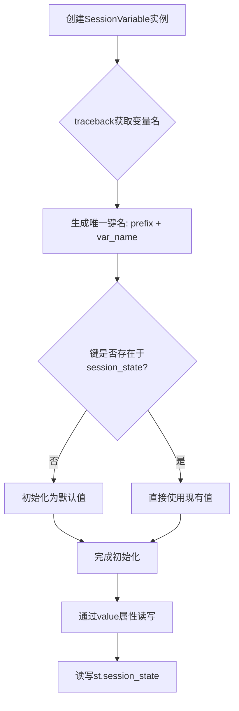
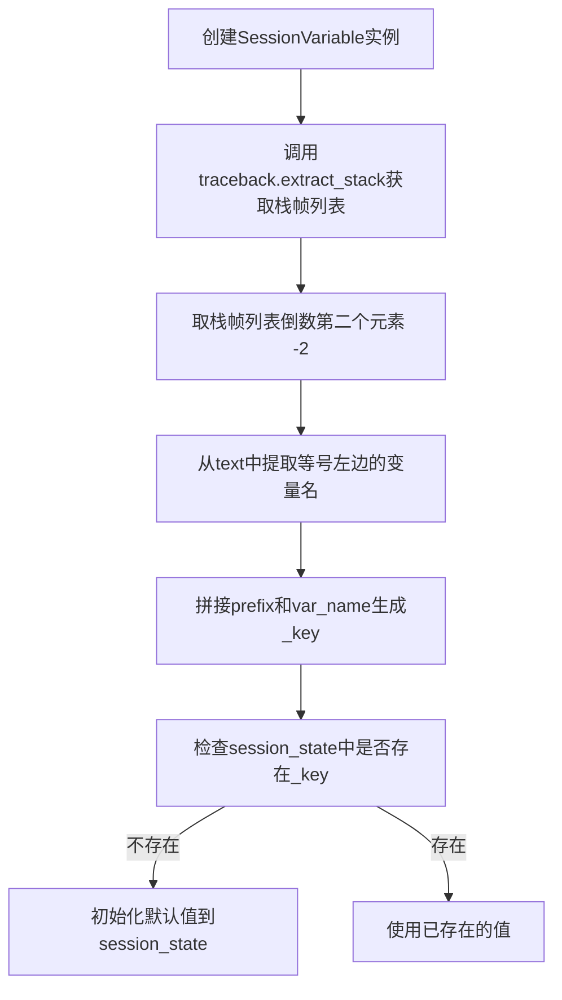
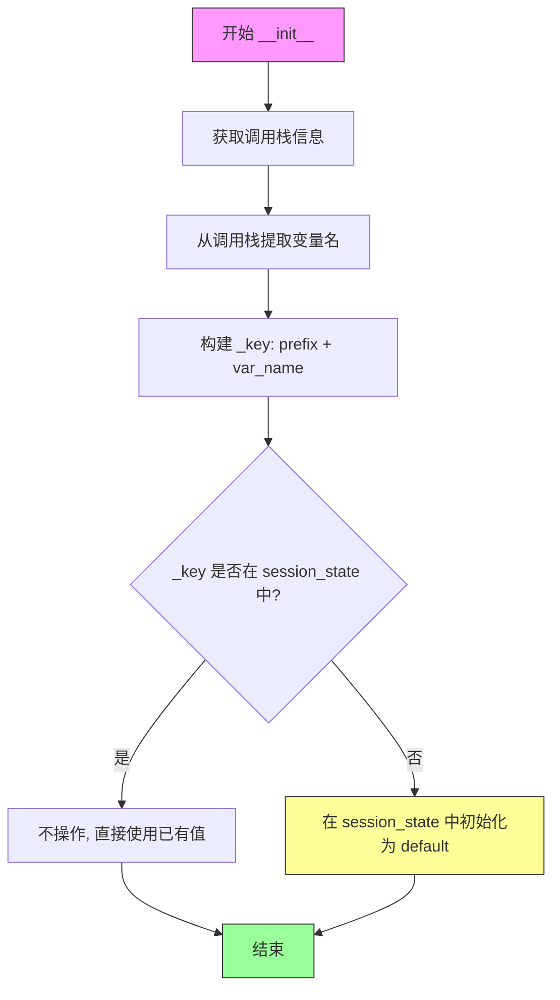
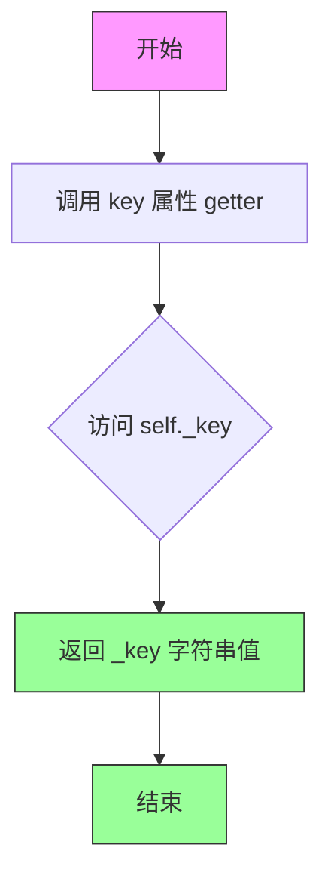
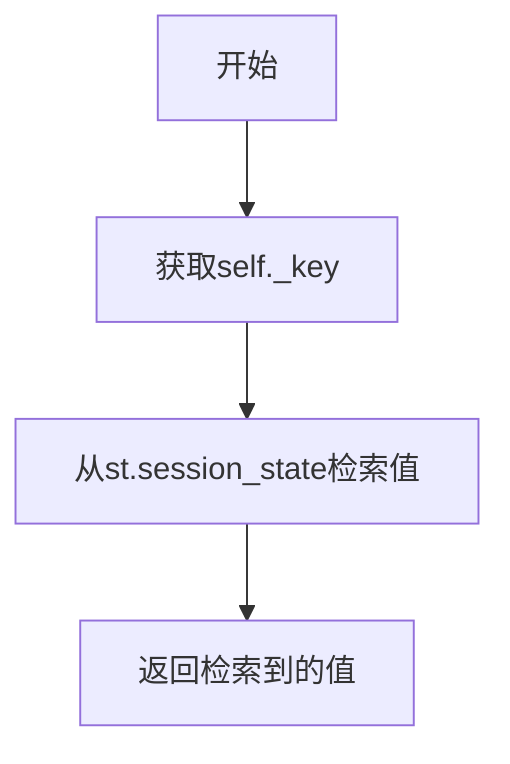
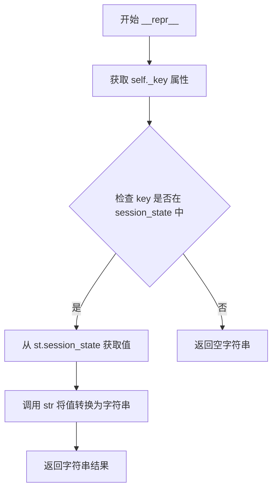

```mermaid
flowchart TD
    A[开始 setter] --> B[接收 value 参数]
    B --> C{检查 _key 是否有效}
    C -->|是| D[将 value 存入 st.session_state&#91;self._key&#93;]
    D --> E[结束 setter]
    
    style A fill:#f9f,stroke:#333
    style D fill:#9f9,stroke:#333
    style E fill:#9f9,stroke:#333
```

# `graphrag\unified-search-app\app\state\session_variable.py` 详细设计文档

一个用于Streamlit应用的会话变量管理模块，通过SessionVariable类提供更便捷的状态管理方式，支持前缀避免命名冲突，并可像普通变量一样直接赋值和读取值。

## 整体流程



## 类结构

```
SessionVariable (会话变量管理类)
```

## 全局变量及字段


### `traceback`
    
Python内置模块，用于提取调用栈信息以获取变量名

类型：`module`
    


### `st`
    
Streamlit库别名，用于管理Web应用的状态和会话状态

类型：`module`
    


### `Any`
    
typing模块中的类型，表示任意类型用于类型提示

类型：`type`
    


### `SessionVariable._key`
    
存储变量的唯一标识键，由前缀和变量名组成

类型：`str`
    


### `SessionVariable._value`
    
存储默认值，在首次初始化时使用

类型：`Any`
    
    

## 全局函数及方法


### `traceback.extract_stack`

该函数用于从调用栈中提取栈帧信息，在此代码中通过获取倒数第二个栈帧（即调用`SessionVariable()`构造函数的那一行代码）来自动解析变量名，从而生成唯一的session_state键名。

参数：

-  `limit`：`int`，可选参数，限制返回的栈帧数量，默认为`None`（返回所有栈帧）
-  `context`：`int`，可选参数，每条栈帧周围保留的源代码行数，默认为`5`

返回值：`list[FrameSummary]`，返回栈帧列表，每个元素是`FrameSummary`对象，包含以下属性：

- `filename`：文件名
- `lineno`：行号
- `name`：函数名
- `line`：源代码行内容

在`SessionVariable.__init__`中的具体返回值：`tuple[str, int, str, str]`，即(filename, lineno, name, text)的4元组形式。

#### 流程图



#### 带注释源码

```python
# 提取调用栈信息，[-2]表示获取调用SessionVariable()的那一行代码
# 因为[-1]是当前traceback.extract_stack这一行
(_, _, _, text) = traceback.extract_stack()[-2]

# text的示例内容: "name = SessionVariable(default='Bob')"
# 通过查找"="的位置，提取等号左边的变量名作为key的一部分
var_name = text[: text.find("=")].strip()
# 最终得到 var_name = "name"

# 使用前缀和变量名拼接成唯一的session_state键名
self._key = "_".join(arg for arg in [prefix, var_name] if arg != "")
# 示例: prefix="user", var_name="name" -> "_user_name"
```


### `SessionVariable`

此类用于管理Streamlit应用中的会话状态变量，提供面向对象的接口以避免直接操作`st.session_state`字典，并通过前缀机制防止变量名冲突。

参数：

- `self`：隐式参数，表示类的实例本身
- `default`：`Any`，可选，默认为空字符串，定义会话变量的初始值
- `prefix`：`str`，可选，默认为空字符串，用于避免不同模块间变量名冲突的前缀

返回值：`SessionVariable`类的实例

#### 流程图

```mermaid
graph TD
    A[创建SessionVariable实例] --> B{检查_key是否在session_state}
    B -->|不存在| C[初始化session_state[_key] = default]
    B -->|已存在| D[保持现有值]
    C --> E[实例创建完成]
    D --> E
    E --> F[访问value属性]
    F --> G[从session_state读取值]
    E --> H[设置value属性]
    H --> I[更新session_state中的值]
```

#### 带注释源码

```python
# 导入traceback模块用于获取调用栈信息
import traceback
# 导入Any类型用于泛型支持
from typing import Any

# 导入streamlit库
import streamlit as st


class SessionVariable:
    """定义将在应用中使用的会话变量结构。"""

    def __init__(self, default: Any = "", prefix: str = ""):
        """创建带有默认值和前缀的托管会话变量。

        前缀用于避免具有相同名称的变量之间的冲突。

        要修改变量请使用value属性，例如：name.value = "Bob"
        要获取值请直接使用变量本身，例如：name

        使用此类可以直接使用变量而避免直接使用st.session_state字典。
        这些变量将在不同文件间共享值，只要使用相同的变量名和前缀。
        """
        # 获取调用者代码的行信息，用于提取变量名
        # traceback.extract_stack()返回调用栈列表，-2表示上一级调用（即赋值语句所在行）
        (_, _, _, text) = traceback.extract_stack()[-2]
        # 从"var_name = ..."格式中提取变量名
        var_name = text[: text.find("=")].strip()

        # 构建存储键名：连接前缀和变量名，去除空字符串
        self._key = "_".join(arg for arg in [prefix, var_name] if arg != "")
        # 保存默认值
        self._value = default

        # 如果键不存在于session_state中，则初始化它
        if self._key not in st.session_state:
            st.session_state[self._key] = default

    @property
    def key(self) -> str:
        """键属性定义。"""
        return self._key

    @property
    def value(self) -> Any:
        """值属性定义。"""
        # 每次访问时从session_state读取最新值
        return st.session_state[self._key]

    @value.setter
    def value(self, value: Any) -> None:
        """值设置器定义。"""
        # 更新session_state中的值
        st.session_state[self._key] = value

    def __repr__(self) -> Any:
        """Repr方法定义。"""
        # 返回session_state中存储的值的字符串表示
        return str(st.session_state[self._key])
```


### `SessionVariable.__init__`

初始化会话变量，创建一个带有默认值和前缀的托管会话变量，用于在Streamlit应用中管理状态。

参数：

- `default`：`Any`，默认值，默认为空字符串，用于初始化会话变量的值
- `prefix`：`str`，前缀，默认为空字符串，用于避免不同位置同名义变量冲突

返回值：`None`，无返回值（Python中__init__方法隐式返回None）

#### 流程图



#### 带注释源码

```python
def __init__(self, default: Any = "", prefix: str = ""):
    """Create a managed session variable with a default value and a prefix.

    The prefix is used to avoid collisions between variables with the same name.

    To modify the variable use the value property, for example: `name.value = "Bob"`
    To get the value use the variable itself, for example: `name`

    Use this class to avoid using st.session_state dictionary directly and be able to
    just use the variables. These variables will share values across files as long as you use
    the same variable name and prefix.
    """
    # 从调用栈中获取创建变量的代码行信息，用于自动提取变量名
    # traceback.extract_stack()[-2] 获取调用者（上一帧）的信息
    (_, _, _, text) = traceback.extract_stack()[-2]
    
    # 从 "var_name = value" 格式的代码中提取变量名
    # 例如: "my_var = SessionVariable()" -> "my_var"
    var_name = text[: text.find("=")].strip()

    # 构建唯一键名: 将前缀和变量名用下划线连接
    # 例如: prefix="app", var_name="user" -> "app_user"
    # 空字符串会被过滤掉
    self._key = "_".join(arg for arg in [prefix, var_name] if arg != "")
    
    # 存储默认值
    self._value = default

    # 如果键不存在于 session_state 中，则初始化为默认值
    # 这样确保变量在首次访问时自动创建
    if self._key not in st.session_state:
        st.session_state[self._key] = default
```


### `SessionVariable.key`

返回会话变量的键，用于在 `st.session_state` 字典中标识该变量。

参数：此方法不需要参数（属性getter）

返回值：`str`，返回变量在 session_state 中存储的键名，格式为 `prefix_varName`（如果提供了 prefix）或 `varName`（如果没有提供 prefix）。

#### 流程图



#### 带注释源码

```python
@property
def key(self) -> str:
    """Key property definition.
    
    该属性用于获取会话变量在 st.session_state 字典中存储的键名。
    键名的生成规则：在类初始化时通过 traceback 获取变量定义时的名称，
    并结合 prefix 前缀生成，格式为 "prefix_varName"。
    
    Returns:
        str: 会话状态中用于存储该变量值的键名
    """
    return self._key
```


### SessionVariable.value

返回会话状态中存储的值，用于获取当前会话变量的值。

参数：无需参数（属性 getter，仅包含 self 隐式参数）

返回值：`Any`，返回会话状态中与该变量键关联的值

#### 流程图



#### 带注释源码

```python
@property
def value(self) -> Any:
    """Value property definition."""
    return st.session_state[self._key]
```

**说明**：这是一个属性 getter 方法，通过 `self._key` 从 Streamlit 的会话状态字典 `st.session_state` 中检索并返回当前存储的值。该类的设计确保了在初始化时 key 已存在于 session_state 中，因此 getter 无需进行额外的空值检查。


### `SessionVariable.value`

该方法是 `SessionVariable` 类的属性 setter，用于将值设置到 Streamlit 的会话状态中。它接收一个任意类型的值，并将其存储到 `st.session_state` 字典中，键为该会话变量实例的 `_key` 属性。

参数：

- `value`：`Any`，要设置的任意类型的值

返回值：`None`，无返回值（setter 方法）

#### 流程图



#### 带注释源码

```python
@value.setter
def value(self, value: Any) -> None:
    """Value setter definition.
    
    将传入的 value 参数存储到 Streamlit 的会话状态中。
    使用实例的 _key 作为键来确保正确的变量映射。
    
    Args:
        value: 任意类型的值，要设置到会话状态中的数据
    
    Returns:
        None，此为 setter 方法，不返回任何值
    """
    # 将值存储到 Streamlit 的 session_state 字典中
    # self._key 是通过 traceback 自动提取的变量名加上前缀生成的唯一键
    st.session_state[self._key] = value
```


### `SessionVariable.__repr__`

该方法返回 SessionVariable 实例在 session state 中存储值的字符串表示，用于调试和日志输出。

参数： 无（仅包含隐式参数 `self`）

返回值：`Any`，返回 session state 中当前变量的字符串表示形式

#### 流程图



#### 带注释源码

```python
def __repr__(self) -> Any:
    """Repr method definition."""
    # 访问 st.session_state 字典，使用实例的 _key 作为键
    # 获取当前存储的值，并将其转换为字符串返回
    # 这样可以在 Python 控制台或日志中直接查看变量的当前值
    return str(st.session_state[self._key])
```

## 关键组件


### SessionVariable 类

用于在 Streamlit 应用中管理会话状态变量的核心类，通过 traceback 自动获取变量名，支持前缀避免命名冲突，并封装了 session_state 的访问接口。

### `__init__` 初始化方法

负责创建会话变量实例，使用 traceback 自动提取变量名，结合前缀生成唯一键，并初始化 session_state 中的值。

### `value` 属性 getter

提供只读方式访问 session_state 中存储的值，每次调用时实时从 session_state 读取。

### `value` 属性 setter

提供写操作接口，将新值更新到 session_state 中，实现响应式状态管理。

### `key` 属性

返回会话变量的唯一标识键，由前缀和变量名组成，用于 session_state 的存取操作。

### `__repr__` 方法

将当前存储的值转换为字符串形式返回，便于调试和展示。

### 全局变量 `st`

Streamlit 库导入，用于访问 session_state 进行状态管理。

### 全局变量 `traceback`

Python 内置模块，用于提取调用栈信息以自动获取变量名。


## 问题及建议


### 已知问题

-   **使用 traceback 获取变量名**：通过 `traceback.extract_stack()` 动态获取变量名的方法非常脆弱，依赖调用栈的具体实现，在不同 Python 版本或运行环境下可能失效，且限制了使用方式必须为 `var = SessionVariable()` 形式。
-   **类型注解不准确**：`__repr__` 方法的返回类型标注为 `Any`，实际应返回 `str`。
-   **缺少错误处理**：未处理 `st.session_state` 不可用的情况（在非 Streamlit 环境运行时会报错），也未对 default 值进行类型验证。
-   **重复访问 session_state**：在 `__repr__`、`value` 属性 getter 中多次访问 `st.session_state[self._key]`，增加不必要的查找开销。
-   **缺少资源清理方法**：没有提供删除或重置变量的方法，无法显式移除 session_state 中的键。

### 优化建议

-   **显式传递变量名**：废弃 traceback 方案，要求用户在初始化时显式传入变量名，如 `SessionVariable("var_name", default=..., prefix=...)`，提高代码可预测性和可维护性。
-   **完善类型注解**：修正 `__repr__` 返回类型为 `str`，添加更精确的泛型类型支持。
-   **添加错误处理**：在 `__init__` 中检查 `st.session_state` 是否可用，提供友好的错误信息或降级方案。
-   **添加 reset/delete 方法**：提供显式的变量重置或删除功能，增强可控性。
-   **缓存访问**：在实例属性中缓存 `st.session_state[self._key]` 的值，减少重复访问（注意需要在 setter 中同步更新缓存）。

## 其它


### 设计目标与约束

**设计目标：**
- 提供一种类型安全、易于使用的会话状态管理方式
- 避免直接操作st.session_state字典带来的命名冲突问题
- 实现类似属性的访问方式，使代码更简洁直观

**约束：**
- 依赖于Streamlit的session_state机制
- 变量名必须通过赋值语句左侧的表达式自动推断，不支持显式命名
- 默认值类型为Any，支持任意类型

### 错误处理与异常设计

- **Key不存在处理**：首次访问时自动从默认值初始化
- **类型转换**：不进行类型校验，依赖Python动态类型特性
- **traceback解析失败**：当无法从堆栈中提取变量名时，var_name可能为空字符串，导致生成下划线前缀的key

### 数据流与状态机

- **数据流**：用户代码 → SessionVariable实例化 → 自动推断变量名 → 生成key → 写入/读取st.session_state
- **状态机**：未初始化 → 已初始化(首次访问) → 持久化(整个session周期)
- **状态转换**：实例化时检查key是否存在，不存在则初始化，存在则读取现有值

### 外部依赖与接口契约

- **streamlit**：依赖st.session_state进行状态存储
- **traceback**：依赖traceback.extract_stack()获取源代码上下文
- **typing**：依赖Any类型提示

### 使用示例

```python
# 创建会话变量
user_name = SessionVariable(default="", prefix="app")
user_age = SessionVariable(default=0, prefix="app")

# 读取值
print(user_name)  # 或 user_name.value

# 赋值
user_name.value = "Alice"
user_age.value = 25
```

### 性能考虑

- 每次实例化都会调用traceback.extract_stack()，存在一定性能开销
- 建议在模块级别预定义会话变量，避免在频繁调用的函数中重复实例化

### 安全性考虑

- key生成依赖前缀拼接，不包含敏感信息
- value访问直接透传session_state，需确保不存储敏感数据

### 兼容性考虑

- 依赖Streamlit框架，仅适用于Streamlit应用
- Python 3.x兼容（traceback模块为标准库）

### 限制和边界条件

- 必须在赋值语句左侧使用才能正确推断变量名
- 不支持在表达式中使用或作为函数参数直接传递
- 多线程环境下Streamlit的session_state本身非线程安全


    