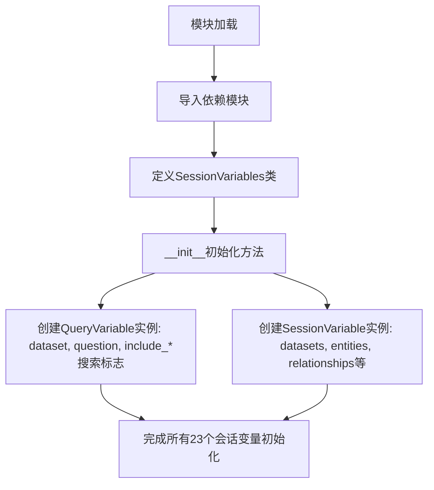

# `graphrag\unified-search-app\app\state\session_variables.py` 详细设计文档

该模块定义了应用中使用会话级别的状态变量管理类SessionVariables，用于存储和管理查询、数据集、图谱搜索配置、实体关系等运行时状态数据，支持全局搜索、本地搜索、漂移搜索和基础RAG等多种查询模式的开关控制。

## 整体流程



## 类结构

```
SessionVariables (会话变量管理类)
```

## 全局变量及字段


### `default_suggested_questions`
    
默认建议问题列表，从data_config模块导入

类型：`list`
    


### `SessionVariables.dataset`
    
当前查询的数据集名称

类型：`QueryVariable`
    


### `SessionVariables.datasets`
    
数据集列表

类型：`SessionVariable`
    


### `SessionVariables.dataset_config`
    
数据集配置对象

类型：`SessionVariable`
    


### `SessionVariables.datasource`
    
数据源配置

类型：`SessionVariable`
    


### `SessionVariables.graphrag_config`
    
GraphRAG配置

类型：`SessionVariable`
    


### `SessionVariables.question`
    
当前问题/查询文本

类型：`QueryVariable`
    


### `SessionVariables.suggested_questions`
    
建议问题列表

类型：`SessionVariable`
    


### `SessionVariables.entities`
    
实体列表

类型：`SessionVariable`
    


### `SessionVariables.relationships`
    
关系列表

类型：`SessionVariable`
    


### `SessionVariables.covariates`
    
协变量字典

类型：`SessionVariable`
    


### `SessionVariables.communities`
    
社区列表

类型：`SessionVariable`
    


### `SessionVariables.community_reports`
    
社区报告列表

类型：`SessionVariable`
    


### `SessionVariables.text_units`
    
文本单元列表

类型：`SessionVariable`
    


### `SessionVariables.question_in_progress`
    
进行中的问题

类型：`SessionVariable`
    


### `SessionVariables.include_global_search`
    
全局搜索开关

类型：`QueryVariable`
    


### `SessionVariables.include_local_search`
    
本地搜索开关

类型：`QueryVariable`
    


### `SessionVariables.include_drift_search`
    
漂移搜索开关

类型：`QueryVariable`
    


### `SessionVariables.include_basic_rag`
    
基础RAG开关

类型：`QueryVariable`
    


### `SessionVariables.selected_report`
    
选中的报告

类型：`SessionVariable`
    


### `SessionVariables.graph_community_level`
    
图社区级别

类型：`SessionVariable`
    


### `SessionVariables.selected_question`
    
选中的问题

类型：`SessionVariable`
    


### `SessionVariables.generated_questions`
    
生成的问题列表

类型：`SessionVariable`
    


### `SessionVariables.show_text_input`
    
是否显示文本输入

类型：`SessionVariable`
    
    

## 全局函数及方法


### `SessionVariables.__init__`

初始化 SessionVariables 类，创建所有会话变量实例，用于管理应用中的全局状态和查询参数。

参数：

- `self`：SessionVariables，当前类的实例

返回值：`None`，无返回值，仅初始化实例属性

#### 流程图

```mermaid
flowchart TD
    A[开始 __init__] --> B[创建 dataset QueryVariable]
    B --> C[创建 datasets SessionVariable]
    C --> D[创建 dataset_config SessionVariable]
    D --> E[创建 datasource SessionVariable]
    E --> F[创建 graphrag_config SessionVariable]
    F --> G[创建 question QueryVariable]
    G --> H[创建 suggested_questions SessionVariable]
    H --> I[创建 entities SessionVariable]
    I --> J[创建 relationships SessionVariable]
    J --> K[创建 covariates SessionVariable]
    K --> L[创建 communities SessionVariable]
    L --> M[创建 community_reports SessionVariable]
    M --> N[创建 text_units SessionVariable]
    N --> O[创建 question_in_progress SessionVariable]
    O --> P[创建 include_global_search QueryVariable]
    P --> Q[创建 include_local_search QueryVariable]
    Q --> R[创建 include_drift_search QueryVariable]
    R --> S[创建 include_basic_rag QueryVariable]
    S --> T[创建 selected_report SessionVariable]
    T --> U[创建 graph_community_level SessionVariable]
    U --> V[创建 selected_question SessionVariable]
    V --> W[创建 generated_questions SessionVariable]
    W --> X[创建 show_text_input SessionVariable]
    X --> Y[结束 __init__]
```



#### 带注释源码

```python
def __init__(self):
    """Init method definition."""
    
    # 数据集相关变量
    self.dataset = QueryVariable("dataset", "")  # 当前选中的数据集名称
    self.datasets = SessionVariable([])  # 可用数据集列表
    self.dataset_config = SessionVariable()  # 数据集配置信息
    self.datasource = SessionVariable()  # 数据源配置
    
    # GraphRAG 全局配置
    self.graphrag_config = SessionVariable()  # GraphRAG 框架配置
    
    # 查询相关变量
    self.question = QueryVariable("question", "")  # 当前用户问题
    self.suggested_questions = SessionVariable(default_suggested_questions)  # 建议问题列表
    
    # 索引数据 - 实体和关系
    self.entities = SessionVariable([])  # 提取的实体列表
    self.relationships = SessionVariable([])  # 实体间关系列表
    self.covariates = SessionVariable({})  # 协变量/附加属性字典
    self.communities = SessionVariable([])  # 社区列表
    self.community_reports = SessionVariable([])  # 社区报告列表
    self.text_units = SessionVariable([])  # 文本单元列表
    
    # 查询进度状态
    self.question_in_progress = SessionVariable("")  # 正在处理的问题
    
    # 搜索选项开关
    self.include_global_search = QueryVariable("include_global_search", True)  # 是否包含全局搜索
    self.include_local_search = QueryVariable("include_local_search", True)  # 是否包含本地搜索
    self.include_drift_search = QueryVariable("include_drift_search", False)  # 是否包含漂移搜索
    self.include_basic_rag = QueryVariable("include_basic_rag", False)  # 是否包含基础 RAG
    
    # UI 状态变量
    self.selected_report = SessionVariable()  # 当前选中的报告
    self.graph_community_level = SessionVariable(0)  # 社区图的层级
    
    # 交互式问答状态
    self.selected_question = SessionVariable("")  # 用户选中的问题
    self.generated_questions = SessionVariable([])  # 生成的问题列表
    self.show_text_input = SessionVariable(True)  # 是否显示文本输入框
```

## 关键组件


### QueryVariable（查询变量）

用于存储用户输入的查询相关变量，支持动态更新，包括dataset、question以及各类搜索开关标志

### SessionVariable（会话变量）

用于存储应用程序的会话状态，支持默认值初始化，用于管理entities、relationships、communities等图数据以及界面状态

### 数据集管理组件

包含dataset、datasets、dataset_config、datasource等变量，用于管理数据源配置和当前数据集状态

### 图数据组件

管理图谱核心数据，包括entities（实体）、relationships（关系）、covariates（协变量）、communities（社区）、community_reports（社区报告）、text_units（文本单元）

### 搜索策略组件

包含include_global_search、include_local_search、include_drift_search、include_basic_rag四个布尔变量，用于控制不同搜索策略的启用状态

### 用户交互状态组件

管理用户交互相关状态，包括question_in_progress（进行中的问题）、selected_question（选中的问题）、generated_questions（生成的问题）、suggested_questions（建议问题）

### 界面显示控制组件

包含show_text_input（显示文本输入）、selected_report（选中的报告）、graph_community_level（图社区级别），用于控制界面显示和交互


## 问题及建议


### 已知问题

-   **类型注解缺失**：整个类和方法没有使用 Python 类型注解（Type Hints），降低了代码的可读性和 IDE 支持
-   **属性无文档说明**：每个 SessionVariable/QueryVariable 属性的用途没有注释说明，后期维护者难以理解各变量的业务含义
-   **默认值不一致**：部分 `SessionVariable` 传入初始值（如 `SessionVariable([])`），部分为空（如 `SessionVariable()`），缺乏统一的初始化模式
-   **硬编码魔法值**：`self.graph_community_level = SessionVariable(0)` 中的 0 为魔法数字，缺少解释
-   **配置分散**：`default_suggested_questions` 从外部导入，其他默认值却直接硬编码，配置管理不一致
-   **初始化方法冗长**：`__init__` 方法包含大量重复的属性赋值代码，可读性较差
-   **缺乏验证逻辑**：所有属性直接暴露，无访问器（getter/setter）或属性验证机制

### 优化建议

-   为类属性和方法添加类型注解，提高代码可维护性
-   为每个 SessionVariable 属性添加文档注释，说明其用途和业务含义
-   考虑抽取配置到统一的配置类或 YAML/JSON 文件中，消除硬编码
-   将相似属性的初始化逻辑抽取为私有方法，如 `_init_search_variables()`、`_init_data_variables()`
-   对于 `graph_community_level` 等魔法值，定义为类常量或枚举，并添加说明注释
-   考虑使用 dataclass 或 Pydantic 模型替代手动属性定义，可自动生成类型注解和验证逻辑

## 其它


### 设计目标与约束

本模块的设计目标是统一管理GraphRAG应用中的所有会话状态变量，提供类型安全的变量定义机制，支持查询变量(QueryVariable)和会话变量(SessionVariable)两种模式。设计约束包括：必须从data_config模块导入默认建议问题列表，所有变量必须继承自指定的基类(QueryVariable或SessionVariable)，变量名称必须与GraphRAG系统其他模块保持一致以确保状态共享。

### 错误处理与异常设计

当前模块未实现显式的错误处理机制。潜在异常场景包括：data_config模块导入失败会导致模块初始化失败；QueryVariable和SessionVariable的构造函数参数类型不匹配可能引发TypeError；变量名称重复定义会导致后定义的变量覆盖先前的定义。建议在__init__方法中添加try-except块捕获导入异常，并为关键变量添加类型校验和默认值保护逻辑。

### 数据流与状态机

SessionVariables类作为应用状态容器，承载以下数据流：用户输入的问题(question)经过QueryVariable封装后流向查询引擎；数据集相关信息(dataset, datasource, dataset_config)通过SessionVariable在数据加载阶段流转；实体(entities)、关系(relationships)、协变量(covariates)、社区(communities)等图数据通过检索阶段填充到对应变量；搜索配置变量(include_global_search等)控制不同搜索策略的启用状态。状态转换遵循"初始化→数据加载→查询处理→结果展示"的典型流程。

### 外部依赖与接口契约

本模块依赖两个外部模块：data_config模块提供default_suggested_questions常量；state.query_variable和state.session_variable模块分别提供QueryVariable和SessionVariable基类。接口契约方面：QueryVariable接受name和default_value两个参数，name必须为字符串类型；SessionVariable构造函数参数灵活但推荐提供有意义的初始值；所有SessionVariable实例应保持与GraphRAG配置对象(graphrag_config)的同步。

### 安全性考虑

当前模块未包含敏感数据处理逻辑，但建议关注：dataset_config和datasource可能包含数据库连接凭证，应避免持久化明文凭证；question_in_progress和selected_question变量可能包含用户输入，需考虑XSS防护；generated_questions变量来自LLM生成内容，需要输出过滤。建议在后续迭代中增加敏感变量标记和自动脱敏机制。

### 性能考虑

模块本身的性能开销极低，主要性能考量在于：大量SessionVariable实例可能占用较多内存，建议对大型列表变量(如entities、relationships)实施懒加载策略；suggested_questions使用默认列表引用而非深拷贝，多处修改可能产生意外共享状态；graphrag_config对象序列化/反序列化可能耗时，应考虑缓存策略。

### 配置管理

本模块采用代码内硬编码的初始化方式，配置灵活性有限。建议改进方向：支持从外部配置文件(YAML/JSON)加载默认变量值；支持环境变量覆盖机制以适应不同部署环境；提供配置验证方法确保必需参数完整；考虑添加配置热更新能力而无需重启应用。

### 生命周期管理

SessionVariables实例的生命周期与用户会话绑定。创建时机应在用户会话初始化阶段，销毁时机在会话结束或超时后。当前实现未提供显式的清理方法，建议添加clear()方法用于重置所有变量状态，添加validate()方法用于检查必需变量是否已正确初始化，以及实现__enter__和__exit__方法支持上下文管理器用法。

### 并发处理

当前模块未考虑并发访问场景。潜在并发问题包括：多个请求同时修改同一SessionVariable实例可能导致竞态条件；graphrag_config的并发读写可能产生不一致状态。建议改进：使用threading.Lock保护共享变量的写操作；为需要事务性更新的变量提供原子操作接口；考虑使用asyncio兼容的异步变量类型支持异步框架。

### 测试策略

建议补充的测试用例包括：模块导入测试验证所有依赖可用；初始化测试验证所有变量正确创建且默认值符合预期；变量类型测试验证QueryVariable和SessionVariable实例属性正确；状态转换测试验证变量赋值后状态一致性；边界条件测试验证空值、空列表、None等边界值的处理。

### 监控和日志

当前模块未实现日志记录和监控功能。建议添加：__init__方法执行时记录初始化日志；关键变量赋值时记录状态变更日志；异常发生时记录错误日志和堆栈信息；可选用metrics库暴露变量数量、类型分布等监控指标。

### 版本兼容性

本模块使用Python 3类型注解语法(with语句)，要求Python 3.7+版本。外部依赖模块(QueryVariable、SessionVariable)的接口变更可能导致兼容性破坏。建议在文档中明确标注依赖模块的版本范围要求，并使用版本守卫处理可能的接口变化。

### 扩展性设计

当前模块通过直接添加类属性的方式扩展，不支持运行时动态添加变量。建议考虑：实现__setattr__钩子方法支持动态验证和转换；提供register_variable()方法支持运行时注册新变量类型；设计变量依赖关系系统自动处理级联更新；支持变量分组管理便于批量操作。


    