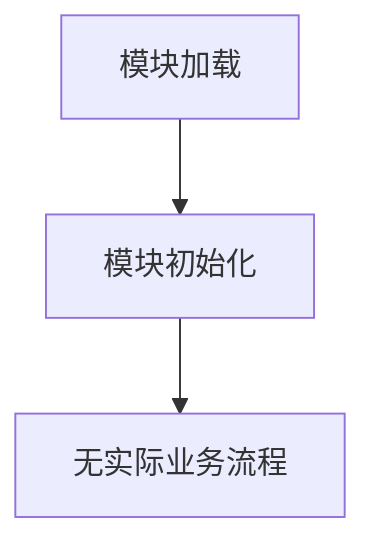

# `graphrag\unified-search-app\app\ui\__init__.py` 详细设计文档

这是一个App UI模块的占位符文件，仅包含版权声明和模块级文档字符串，没有实现任何业务逻辑、类、函数或变量。

## 整体流程



## 类结构

```
该文件无类层次结构
```

## 全局变量及字段


    

## 全局函数及方法


## 关键组件


## 代码概述

该代码片段仅为一个Python模块的版权声明和文档字符串，不包含任何实际功能实现，仅定义了模块的许可证信息和基本描述。

## 文件整体运行流程

由于该文件仅包含模块级别的文档字符串和版权声明，不存在可执行的代码流程。该模块被导入时仅会加载模块级别的文档字符串，不会执行任何逻辑。

## 类信息

该代码片段中不包含任何类定义。

## 全局变量与全局函数

该代码片段中不包含任何全局变量或全局函数定义。

## 关键组件信息

### 模块文档字符串

该模块的文档字符串，描述该模块为"App UI module"，但未提供具体的功能说明或实现细节。

## 潜在技术债务或优化空间

1. **功能实现缺失**：该模块仅包含版权信息和文档字符串，缺少实际的App UI功能实现，需要根据实际需求添加相应的UI组件和逻辑。
2. **文档不完整**：模块文档字符串过于简略，未说明该模块的具体职责、依赖关系和使用方式。

## 其它项目

### 设计目标与约束

由于代码内容有限，无法确定具体的设计目标和约束。

### 错误处理与异常设计

由于没有实际代码实现，不涉及错误处理和异常设计。

### 数据流与状态机

由于没有实际代码实现，不涉及数据流或状态机设计。

### 外部依赖与接口契约

由于没有实际代码实现，不涉及外部依赖或接口契约定义。


## 问题及建议


### 已知问题

-   代码仅包含模块文档字符串和版权声明，缺乏实际的实现代码，无法进行全面的技术债务分析
-   模块命名"App UI module"过于宽泛，未明确其具体职责和边界
-   缺少模块级别的文档说明（如README或详细的模块文档）来描述该模块在系统中的角色
-   未定义任何公共接口或API契约，无法评估其与其他模块的集成方式
-   缺乏任何功能实现，无法验证代码质量和设计合理性

### 优化建议

-   补充完整的模块实现代码，包括核心业务逻辑、UI组件或服务接口
-   在模块文档字符串中添加更详细的描述，说明模块的功能、依赖关系和使用方式
-   明确模块的职责范围，采用更具体的命名（如 `DocumentViewerUI`、`DataVisualizationUI` 等）
-   添加类型注解和完整的函数/类文档字符串，遵循项目的文档规范
-   建立模块的单元测试和集成测试框架，确保代码质量
-   如该模块为占位符，应明确标记为"TODO"或"placeholder"，并规划具体的实现时间表


## 其它


### 设计目标与约束

本模块旨在提供应用程序的用户界面核心功能，支持模块化、可扩展的UI组件架构。设计目标包括：实现响应式用户界面，支持多种设备和屏幕尺寸；提供统一的组件库，确保UI一致性和可维护性；实现数据驱动的界面更新机制；支持主题切换和多语言国际化。约束条件包括：必须兼容主流浏览器（Chrome、Firefox、Safari、Edge）的最近两个版本；需要保持轻量级依赖，避免引入过重的UI框架；需要遵循无障碍访问标准（WCAG 2.1 AA级别）；需要在现代JavaScript环境下运行（ES2020+）。

### 错误处理与异常设计

本模块的错误处理采用分层策略：UI组件层捕获用户交互产生的异常并显示友好的错误提示；业务逻辑层处理数据验证错误并触发相应的UI更新；底层服务层捕获网络请求、存储访问等操作的异常并记录日志。异常分类包括：用户输入验证错误（InvalidInputError）、网络通信错误（NetworkError）、数据解析错误（ParseError）、组件渲染错误（RenderError）。所有异常都包含错误码、错误消息和上下文信息，便于问题排查。用户可见的错误通过统一的提示组件展示，系统内部错误仅记录日志不暴露给用户。

### 数据流与状态机

本模块采用单向数据流架构，状态管理遵循Redux或类似模式。核心状态包括：用户认证状态（登录/登出）、UI主题状态（亮色/暗色/系统）、导航状态（当前路由、历史记录）、业务数据状态（用户信息、配置数据）。数据流遵循"用户操作 → Action分发 → Reducer处理 → 状态更新 → UI重新渲染"的流程。状态转换通过状态机管理，确保状态变更的可预测性。主要状态机包括：应用生命周期状态机（初始化→就绪→运行→挂起→销毁）、用户会话状态机（未认证→认证中→已认证→认证失败）、导航状态机（路由变化→页面加载→渲染完成）。

### 外部依赖与接口契约

本模块依赖以下外部库和接口：前端框架依赖（如React、Vue或Angular）、状态管理库（如Redux、Vuex或MobX）、路由管理库（如React Router、Vue Router或Angular Router）、样式处理库（如Styled Components、SCSS或Tailwind CSS）、国际化库（如i18next、react-intl或vue-i18n）、图表和数据可视化库（如D3.js、ECharts或Chart.js）。接口契约方面：组件props采用TypeScript接口定义，明确输入类型和默认值；事件发射采用统一的事件规范，包含事件名称、负载数据和时间戳；状态更新采用不可变数据模式，确保状态可追溯；API调用层定义统一的请求/响应接口规范。

### 性能要求

本模块的性能指标要求：首次内容渲染（FCP）不超过1.8秒、首次有意义渲染（FMP）不超过2.5秒、交互准备时间（TTI）不超过3.8秒、页面滚动帧率保持60fps、组件更新延迟不超过100ms。优化策略包括：代码分割和懒加载、虚拟列表处理大数据集、图片懒加载和响应式图片、组件Memo化避免不必要的重渲染、debounce/throttle处理高频事件、使用Web Worker处理复杂计算任务。

### 安全性考虑

本模块的安全措施包括：所有用户输入进行XSS过滤和CSRF防护、敏感数据不存储在本地存储或Cookie中、采用内容安全策略（CSP）限制脚本执行、API请求使用HTTPS并实现请求签名、组件渲染进行输入验证和清理、防止点击劫持和iframe嵌套攻击、会话超时自动登出机制、密码输入字段启用自动填充保护。

### 可访问性要求

本模块遵循WCAG 2.1 AA标准，所有交互元素支持键盘导航，焦点可见性符合规范，图片和图标提供替代文本，表单控件关联对应标签，颜色对比度符合4.5:1文本和3:1大文本要求，支持屏幕阅读器正确读取，支持用户自定义字体大小和缩放，支持减少动画偏好设置，所有错误提示可通过可访问方式传达。

### 响应式设计

本模块采用移动优先的响应式设计策略，断点设置遵循业界标准：移动设备（<768px）、平板设备（768px-1024px）、桌面设备（1024px-1440px）、大屏设备（>1440px）。布局采用弹性盒子和CSS Grid，图片和媒体使用响应式srcset，触摸目标最小尺寸为44x44像素，支持横竖屏自适应，支持高DPI屏幕显示优化。

### 主题和样式管理

本模块支持多主题切换，包括亮色主题、暗色主题和系统主题跟随。样式采用CSS变量（Custom Properties）实现主题配置，主题变量涵盖颜色、字体、间距、阴影、圆角等设计令牌。组件样式采用CSS Modules或类似方案实现样式隔离，防止样式冲突。暗色主题实现遵循媒体查询和JavaScript检测双重机制，确保用户体验一致性。


    