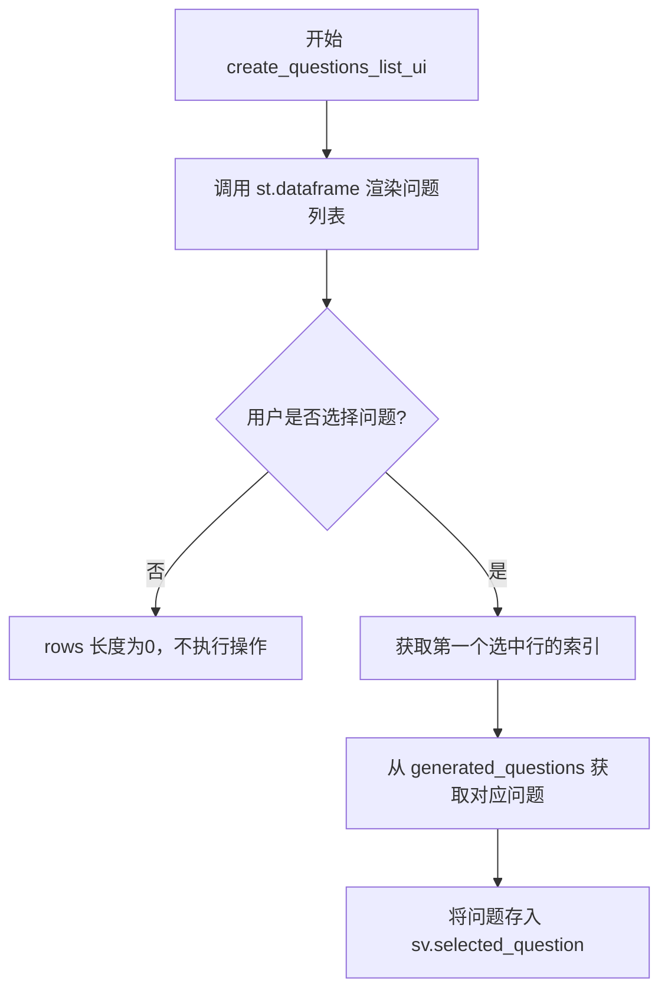
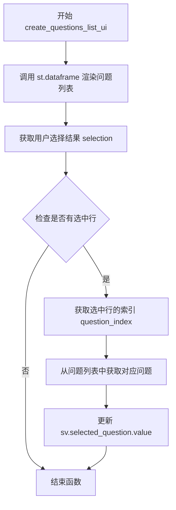

# `graphrag\unified-search-app\app\ui\questions_list.py` 详细设计文档

这是一个Streamlit UI模块，用于在Web界面中展示生成的问题列表，并允许用户单选问题，将选中的问题存储到会话状态变量中。

## 整体流程



## 类结构

```
question_list (模块)
└── 函数: create_questions_list_ui
```

## 全局变量及字段


### `selection`
    
st.dataframe返回的选择对象，包含selection.rows属性，用于获取用户选中的行索引

类型：`DataframeSelection`
    


### `rows`
    
用户选中的行索引列表，通过selection.selection.rows获取

类型：`list[int]`
    


### `question_index`
    
用户选中的第一个问题的索引，用于从问题列表中获取对应的问题

类型：`int`
    


    

## 全局函数及方法


### `create_questions_list_ui`

该函数是问题列表模块的核心UI组件，使用Streamlit的`dataframe`组件渲染生成的问题列表，支持单行选择交互，并将用户选中的问题更新到会话状态中。

参数：

- `sv`：`SessionVariables`，会话状态管理器，包含生成的问题列表和选中问题的状态

返回值：`None`，该函数直接修改`sv.selected_question`的值，不返回任何内容

#### 流程图



#### 带注释源码

```python
# 导入Streamlit库，用于构建Web UI
import streamlit as st
# 导入会话变量类，用于管理应用状态
from state.session_variables import SessionVariables


def create_questions_list_ui(sv: SessionVariables):
    """Return question list UI component."""
    # 使用Streamlit的dataframe组件渲染问题列表
    # sv.generated_questions.value: 存储生成的问题列表数据
    # use_container_width=True: 表格宽度自适应容器
    # hide_index=True: 隐藏数据索引列
    # selection_mode="single-row": 设置为单行选择模式
    # column_config={"value": "question"}: 将"value"列显示为"question"
    # on_select="rerun": 选择后重新运行应用以更新状态
    selection = st.dataframe(
        sv.generated_questions.value,
        use_container_width=True,
        hide_index=True,
        selection_mode="single-row",
        column_config={"value": "question"},
        on_select="rerun",
    )
    # 获取用户选中的行索引列表
    rows = selection.selection.rows
    # 检查是否有选中任何问题
    if len(rows) > 0:
        # 获取第一个选中问题的索引（单行模式）
        question_index = selection.selection.rows[0]
        # 根据索引从问题列表中获取对应的问题内容
        # 并更新会话状态中的选中问题
        sv.selected_question.value = sv.generated_questions.value[question_index]
```

## 关键组件


### Question List UI 组件

负责创建问题列表的用户界面，支持单行选择并更新会话状态中的选中问题。

### SessionVariables 状态管理

通过 SessionVariables 管理应用状态，包括生成的问题列表和用户当前选中的问题。

### Streamlit DataFrame 组件

使用 st.dataframe 渲染问题列表，支持单行选择模式，并将选中行的索引存储到 selection 中。

### 选择状态处理机制

当用户选择某一行时，提取选中行的索引，并从生成的问题列表中获取对应的问题，更新到 selected_question 状态中。


## 问题及建议


### 已知问题

-   **空值/空列表未做防护**：直接访问 `sv.generated_questions.value`，未检查是否为 `None` 或空列表，会导致后续索引访问时抛出异常
-   **数组越界风险**：使用 `selection.selection.rows[0]` 获取索引后直接访问列表元素，没有边界验证
-   **类型假设缺乏校验**：未验证 `sv.generated_questions.value` 的实际类型，假设其为可索引对象
-   **选中状态重置逻辑缺失**：当用户取消选择时（如再次点击已选中行），代码未处理该场景，可能导致状态不一致
-   **硬编码魔法字符串**：`"question"`、`"single-row"` 等字符串散落在代码中，缺乏常量定义，不利于维护和国际化

### 优化建议

-   在访问 `generated_questions.value` 前增加空值和空列表检查，提前返回或显示友好提示
-   使用 `len(rows) > 0 and rows[0] < len(sv.generated_questions.value)` 进行边界验证，防止越界
-   提取魔法字符串为模块级常量，如 `QUESTION_COLUMN = "question"`
-   添加 `else` 分支处理用户取消选择的场景，清空 `selected_question` 或保持原状态
-   考虑添加 `@st.fragment` 装饰器（Streamlit 1.33+）实现细粒度局部刷新，减少全页面 rerun 开销
-   增加日志记录，便于调试和监控用户交互行为

## 其它


### 设计目标与约束

本模块旨在为Streamlit应用提供一个交互式的问题列表UI组件，允许用户从生成的问题列表中选择单个问题。设计约束包括：依赖Streamlit框架的dataframe组件和session状态管理机制；仅支持单行选择模式；数据源来自SessionVariables中的generated_questions状态；选择结果通过selected_question状态持久化。

### 错误处理与异常设计

代码中未包含显式的错误处理机制。潜在异常场景包括：generated_questions.value为None或空列表时可能导致dataframe渲染异常；selection.selection.rows访问时若未选择任何行返回空列表；索引越界风险（当generated_questions.value长度小于选中索引时）。建议增加空值检查和边界验证逻辑。

### 数据流与状态机

数据流从SessionVariables的generated_questions状态开始，流经st.dataframe组件进行渲染，用户交互选择后，通过selection.selection.rows获取选中行的索引，再从generated_questions.value数组中取出对应问题，最后存储到selected_question状态。状态转换路径：无选中 → 有选中 → 更新选中。

### 外部依赖与接口契约

核心依赖包括streamlit框架（st.dataframe、st.rerun）、session_variables模块（SessionVariables类）。函数签名为create_questions_list_ui(sv: SessionVariables)，接受SessionVariables实例作为参数，无返回值。generated_questions.value期望为列表类型，selected_question.value期望为单一问题字符串。

### 性能考虑

当前实现每次rerun时重新渲染整个dataframe。对于大规模问题列表，可能存在性能瓶颈。可考虑使用st.fragment或条件渲染优化。selection_mode参数已限制为单行模式，减少状态更新频率。

### 可测试性

当前模块可测试性较低，因其直接依赖Streamlit内部组件和SessionVariables。建议将核心选择逻辑抽取为纯函数，接受数据列表和选中索引作为参数，返回选中结果，便于单元测试。

### 配置与扩展性

column_config配置硬编码了"value"列映射为"question"显示名称。扩展性考虑：可将该配置参数化以支持不同数据源；可选增加多选模式支持；可集成搜索/过滤功能增强用户体验。

### 版本兼容性

代码标注版权年份为2024年，使用MIT许可证。需确保Streamlit版本支持dataframe的selection和on_select参数（Streamlit 1.33+版本引入）。建议在requirements中明确最低Streamlit版本要求。


    