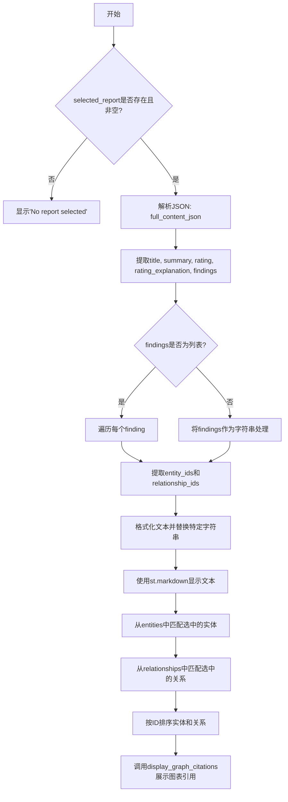
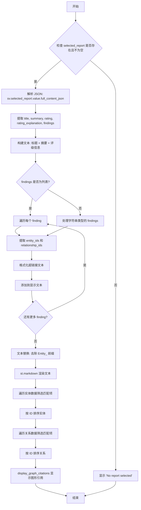
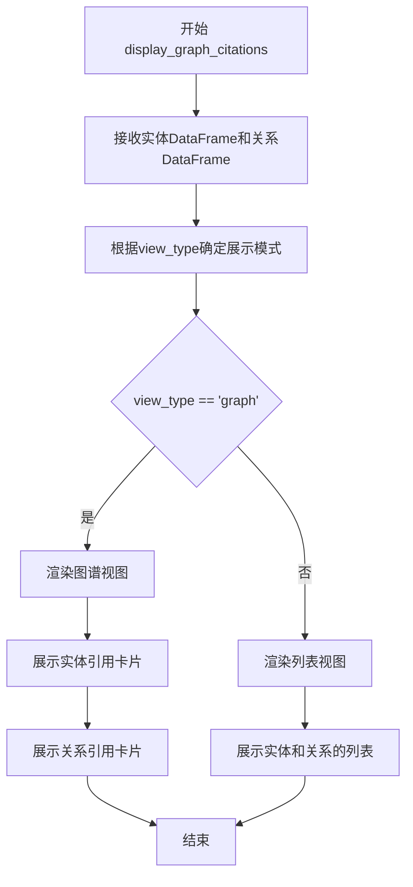
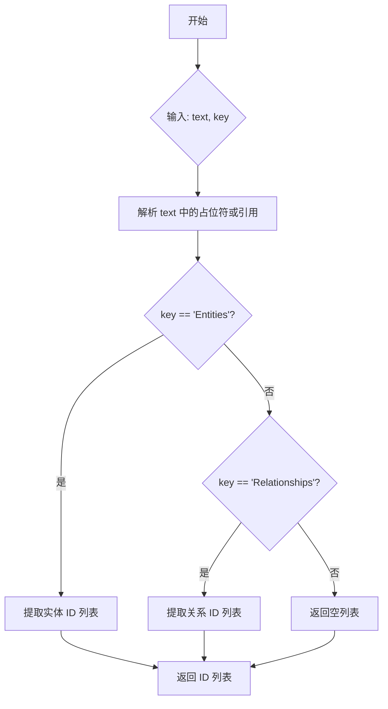

```mermaid
flowchart TD
    A[开始 format_response_hyperlinks] --> B{输入验证}
    B -->|text为空| C[返回空字符串]
    B -->|text非空| D[解析link_type]
    
    D --> E{查找文本中的引用模式}
    E -->|找到匹配| F[提取引用ID和类型]
    F --> G[构建超链接HTML]
    G --> E
    
    E -->|无匹配| H[返回原始文本]
    
    I[返回格式化后的文本] --> J[结束]
    
    style F fill:#f9f,color:#000
    style G fill:#bbf,color:#000
```

# `graphrag\unified-search-app\app\ui\report_details.py` 详细设计文档

A Streamlit UI模块，用于解析并展示报告详情，包括标题、摘要、评级、关键发现，并从报告中提取实体ID和关系ID，匹配并展示相关的实体和关系信息。

## 整体流程



## 类结构

```
模块级函数
└── create_report_details_ui (主UI构建函数)
```

## 全局变量及字段


### `sv`
    
会话状态管理对象，包含选中的报告、实体和关系等状态数据

类型：`SessionVariables`
    


### `text`
    
用于构建Markdown格式的报告详情文本字符串

类型：`str`
    


### `entity_ids`
    
存储从报告发现中提取的实体ID列表，用于后续实体匹配

类型：`list`
    


### `relationship_ids`
    
存储从报告发现中提取的关系ID列表，用于后续关系匹配

类型：`list`
    


### `report`
    
从JSON字符串解析后的报告数据字典，包含标题、摘要、评级等信息

类型：`dict`
    


### `title`
    
报告的标题字段

类型：`str`
    


### `summary`
    
报告的摘要内容

类型：`str`
    


### `rating`
    
报告的优先级评级

类型：`str`
    


### `rating_explanation`
    
评级说明文字

类型：`str`
    


### `findings`
    
报告的关键发现，可以是列表或字符串格式

类型：`list or str`
    


### `text_replacement`
    
替换Entity相关关键字后的最终显示文本

类型：`str`
    


### `selected_entities`
    
从全局实体中筛选出的与报告相关的实体列表

类型：`list`
    


### `sorted_entities`
    
按ID排序后的选中实体列表

类型：`list`
    


### `selected_relationships`
    
从全局关系中筛选出的与报告相关的关系列表

类型：`list`
    


### `sorted_relationships`
    
按ID排序后的选中关系列表

类型：`list`
    


### `finding`
    
遍历发现列表时的当前发现项

类型：`dict or str`
    


### `formatted_text`
    
格式化为可点击超链接的发现说明文本

类型：`str`
    


### `_index`
    
DataFrame迭代时的行索引（未使用）

类型：`int`
    


### `row`
    
DataFrame迭代时的当前行数据

类型：`pd.Series`
    


    

## 全局函数及方法


### `create_report_details_ui`

该函数是报告详情 UI 组件的创建者，负责解析并展示选定报告的完整内容，包括标题、摘要、评级、发现信息，同时从报告中提取相关的实体和关系 ID，并在 UI 中以图形化方式展示这些引用。

参数：

-  `sv`：`SessionVariables`，会话变量对象，包含当前选定的报告（`selected_report`）、实体列表（`entities`）和关系列表（`relationships`）等状态数据

返回值：`None`，该函数通过 Streamlit 组件直接渲染 UI，不返回任何值

#### 流程图



#### 带注释源码

```python
def create_report_details_ui(sv: SessionVariables):
    """Return report details UI component."""
    # 检查是否已选择报告且报告不为空
    if sv.selected_report.value is not None and sv.selected_report.value.empty is False:
        text = ""
        entity_ids = []      # 用于存储提取的实体 ID 列表
        relationship_ids = []  # 用于存储提取的关系 ID 列表
        
        try:
            # 解析报告的 JSON 内容
            report = json.loads(sv.selected_report.value.full_content_json)
            
            # 提取报告的基本信息
            title = report["title"]                    # 报告标题
            summary = report["summary"]                # 报告摘要
            rating = report["rating"]                  # 评级（如高/中/低）
            rating_explanation = report["rating_explanation"]  # 评级说明
            findings = report["findings"]              # 主要发现（可能是列表或字符串）
            
            # 构建显示文本：标题和摘要
            text += f"#### {title}\n\n{summary}\n\n"
            # 添加评级信息
            text += f"**Priority: {rating}**\n\n{rating_explanation}\n\n##### Key Findings\n\n"
            
            # 判断 findings 的类型并分别处理
            if isinstance(findings, list):
                # 遍历每个发现项
                for finding in findings:
                    # 从发现的说明中提取实体和关系 ID
                    entity_ids.extend(
                        get_ids_per_key(finding["explanation"], "Entities")
                    )
                    relationship_ids.extend(
                        get_ids_per_key(finding["explanation"], "Relationships")
                    )

                    # 格式化发现的说明文本中的超链接
                    formatted_text = format_response_hyperlinks(
                        finding["explanation"], "graph"
                    )
                    # 添加发现标题和格式化后的内容
                    text += f"\n\n**{finding['summary']}**\n\n{formatted_text}"
            elif isinstance(findings, str):
                # findings 为字符串时的处理
                # 从说明中提取实体和关系 ID（添加类型注解避免类型检查警告）
                entity_ids.extend(get_ids_per_key(finding["explanation"], "Entities"))  # type: ignore
                relationship_ids.extend(
                    get_ids_per_key(finding["explanation"], "Relationships")  # type: ignore
                )

                # 格式化超链接并添加文本
                formatted_text = format_response_hyperlinks(findings, "graph")
                text += f"\n\n{formatted_text}"

        except json.JSONDecodeError:
            # JSON 解析错误处理
            st.write("Error parsing report.")
            st.write(sv.selected_report.value.full_content_json)
        
        # 文本替换：将内部命名转换为用户友好的显示名称
        text_replacement = (
            text
            .replace("Entity_Relationships", "Relationships")
            .replace("Entity_Claims", "Claims")
            .replace("Entity_Details", "Entities")
        )
        
        # 使用 Markdown 渲染报告内容（允许 HTML）
        st.markdown(f"{text_replacement}", unsafe_allow_html=True)

        # 从会话变量中提取匹配的实体
        selected_entities = []
        # 遍历所有实体，筛选出在 entity_ids 列表中的实体
        for _index, row in sv.entities.value.iterrows():
            if str(row["human_readable_id"]) in entity_ids:
                selected_entities.append({
                    "id": str(row["human_readable_id"]),
                    "title": row["title"],
                    "description": row["description"],
                })

        # 按实体 ID 排序
        sorted_entities = sorted(selected_entities, key=lambda x: int(x["id"]))

        # 从会话变量中提取匹配的关系
        selected_relationships = []
        # 遍历所有关系，筛选出在 relationship_ids 列表中的关系
        for _index, row in sv.relationships.value.iterrows():
            if str(row["human_readable_id"]) in relationship_ids:
                selected_relationships.append({
                    "id": str(row["human_readable_id"]),
                    "source": row["source"],
                    "target": row["target"],
                    "description": row["description"],
                })

        # 按关系 ID 排序
        sorted_relationships = sorted(
            selected_relationships, key=lambda x: int(x["id"])
        )

        # 显示图形化的引用（实体和关系）
        display_graph_citations(
            pd.DataFrame(sorted_entities), pd.DataFrame(sorted_relationships), "graph"
        )
    else:
        # 无报告选中时的提示信息
        st.write("No report selected")
```


### `display_graph_citations`

该函数是用于在 Streamlit 界面上展示图谱引用信息的 UI 组件，接收实体和关系数据并以图形化方式呈现。

参数：

- `entities_df`：`pd.DataFrame`，包含排序后的实体数据，具有 id、title、description 等列
- `relationships_df`：`pd.DataFrame`，包含排序后的关系数据，具有 id、source、target、description 等列
- `view_type`：`str`，指定视图类型，"graph" 表示图谱视图模式

返回值：`None`，该函数直接在 Streamlit 界面上渲染内容，无返回值

#### 流程图



#### 带注释源码

```python
# 注意：此函数从 ui.search 模块导入，以下为调用处的代码片段
# 函数签名推断如下：

def display_graph_citations(
    entities_df: pd.DataFrame,    # 实体数据DataFrame，包含id/title/description
    relationships_df: pd.DataFrame, # 关系数据DataFrame，包含id/source/target/description
    view_type: str                # 视图类型，"graph"表示图谱视图
) -> None:
    """Display graph citations in Streamlit UI.
    
    Args:
        entities_df: DataFrame containing sorted entity data with columns:
                    - id: entity human readable ID
                    - title: entity title
                    - description: entity description
        relationships_df: DataFrame containing sorted relationship data with columns:
                    - id: relationship human readable ID
                    - source: source entity ID
                    - target: target entity ID
                    - description: relationship description
        view_type: String specifying view mode, "graph" for graph visualization
    """
    # 调用处代码示例：
    display_graph_citations(
        pd.DataFrame(sorted_entities),   # 排序后的实体列表
        pd.DataFrame(sorted_relationships), # 排序后的关系列表
        "graph"                          # 视图类型为图谱
    )
```


### `format_response_hyperlinks`

该函数用于将文本中的实体或关系引用格式化为可点击的超链接，以便在报告中实现交互式引用导航。

参数：

- `text`：`str`，需要格式化的文本内容，包含需要转换为超链接的实体或关系引用
- `link_type`：`str`，超链接的类型标识（如 "graph"），用于确定格式化的上下文和样式

返回值：`str`，返回格式化后的文本，其中的实体或关系引用已被转换为可点击的超链接格式

#### 流程图



#### 带注释源码

```python
# 该函数为外部导入函数，以下为基于调用方式的推断源码
# 实际实现位于 ui.search 模块中

def format_response_hyperlinks(text: str, link_type: str) -> str:
    """
    将文本中的实体或关系引用格式化为可点击的超链接。
    
    参数:
        text: str - 需要格式化的原始文本
        link_type: str - 超链接类型标识，用于确定格式化和样式
    
    返回:
        str - 格式化后的文本，包含可点击的超链接
    """
    # 1. 参数验证
    if not text:
        return ""
    
    # 2. 根据link_type确定解析模式
    # "graph" 类型会查找 Entity_Relationships, Entity_Claims, Entity_Details 等引用
    
    # 3. 使用正则表达式查找文本中的引用模式
    # 匹配格式如: [[entity_id]] 或 [entity_type|entity_id] 等
    
    # 4. 对每个匹配项:
    #    - 提取实体/关系ID
    #    - 构建对应的超链接URL
    #    - 替换原始引用为HTML超链接标签
    
    # 5. 返回格式化后的文本
    return formatted_text
```

#### 备注

由于 `format_response_hyperlinks` 是从 `ui.search` 模块导入的外部函数，上述源码为基于其调用方式的合理推断。实际实现可能包含更多的格式化选项和错误处理逻辑。该函数在 `create_report_details_ui` 中被调用两次，用于将报告 findings 中的实体和关系引用转换为交互式超链接，提升用户体验。


# 分析结果

根据提供的代码，`get_ids_per_key` 函数是从 `ui.search` 模块导入的，但**该函数的实现源码并未包含在给定的代码片段中**。因此，我将基于代码中的**调用方式**和**上下文**来推断其功能。

---

### `get_ids_per_key`

从 `ui.search` 模块导入的函数，用于根据指定的键（如 "Entities" 或 "Relationships"）从文本中提取相关的 ID。

参数：

-  `text`：`str`，需要解析的文本（通常是 `finding["explanation"]` 或 `findings` 字符串）
-  `key`：`str`，指定的键名，用于确定要提取哪类 ID（如 "Entities" 或 "Relationships"）

返回值：`List[str]`，返回提取到的 ID 列表（如实体 ID 或关系 ID）

#### 流程图



#### 带注释源码

**注意**：由于源代码中未提供 `get_ids_per_key` 的实现，以下为基于调用方式的合理推测：

```python
# 推测实现（基于调用方式推断）
def get_ids_per_key(text: str, key: str) -> list[str]:
    """
    从文本中提取指定键对应的 ID。
    
    参数:
        text: 包含占位符或引用的文本
        key: 指定的键名 ('Entities' 或 'Relationships')
    
    返回:
        提取到的 ID 列表
    """
    import re
    
    # 假设文本中包含类似 [Entities: id1, id2] 或 {Entities:123} 的格式
    # 正则表达式用于匹配指定 key 后的 ID 列表
    pattern = rf"\[{key}:\s*([^\]]+)\]"
    match = re.search(pattern, text)
    
    if match:
        ids_str = match.group(1)
        # 分割并清理 ID 字符串
        ids = [i.strip() for i in ids_str.split(",") if i.strip()]
        return ids
    
    return []
```

---

## 补充说明

### 潜在问题

1.  **缺少源码**：`get_ids_per_key` 的实现未在提供的代码中给出，无法确定其精确行为。
2.  **依赖外部模块**：该函数依赖 `ui.search` 模块，需确保该模块存在且可访问。
3.  **类型推断**：返回值类型基于 `.extend()` 的使用方式推断，实际返回类型可能为 `list`（元素类型需确认）。

### 建议

若需完整的详细设计文档，建议提供 `ui.search` 模块中 `get_ids_per_key` 函数的完整实现代码。

## 关键组件


### create_report_details_ui 函数

主UI组件函数，负责渲染报告详情页面。该函数从会话变量中获取选中的报告，解析JSON内容，提取实体和关系ID，并最终通过Streamlit展示报告文本及相关的图引用。

### JSON解析模块

负责将报告的full_content_json字段解析为Python字典。提取title、summary、rating、rating_explanation和findings等关键字段，用于后续的UI展示和数据提取。

### 数据提取组件

从报告的findings中提取实体ID和关系ID。通过调用get_ids_per_key函数，分别从每个finding的explanation中解析出"Entities"和"Relationships"类型的ID列表，用于后续的实体和关系筛选。

### 文本格式化组件

负责格式化报告文本内容。包括：1）将报告标题、摘要、优先级和解释格式化；2）调用format_response_hyperlinks将finding的explanation转换为可点击的超链接格式；3）进行文本替换，将"Entity_Relationships"、"Entity_Claims"、"Entity_Details"等占位符替换为更友好的显示名称。

### 实体筛选模块

从全局实体数据（sv.entities.value）中筛选出与报告相关的实体。通过比较human_readable_id与之前提取的entity_ids列表，选中的实体包含id、title和description字段，并按ID数值排序。

### 关系筛选模块

从全局关系数据（sv.relationships.value）中筛选出与报告相关的关系。通过比较human_readable_id与之前提取的relationship_ids列表，选中的关系包含id、source、target和description字段，并按ID数值排序。

### 图引用展示组件

调用display_graph_citations函数，将筛选出的实体和关系数据以图引用形式展示。该组件接收两个pandas DataFrame作为参数，分别包含排序后的实体和关系数据。

### 错误处理模块

包含JSON解析错误的捕获和处理。当JSON解析失败时，显示错误消息并输出原始JSON内容供调试。同时处理了findings字段可能是list或string两种不同数据结构的兼容性问题。


## 问题及建议


### 已知问题

-   **JSON解析异常处理不完善**：仅使用`json.JSONDecodeError`捕获异常，但没有日志记录错误详情，不利于生产环境调试和问题追踪
-   **代码重复**：在处理`findings`为列表和字符串两种情况时，`get_ids_per_key`、`entity_ids`和`relationship_ids`的提取逻辑重复
-   **类型安全风险**：使用`# type: ignore`绕过类型检查，且在`findings`为字符串时仍尝试访问`finding["explanation"]`（第42-43行），存在运行时错误风险
-   **字符串替换方式低效**：使用三链式`.replace()`调用进行文本替换，可读性差且难以维护
-   **未使用的变量**：循环中的`_index`变量声明但未使用
-   **数据验证缺失**：未对`report`字典的必要字段（如title、summary、rating等）存在性进行验证，可能导致KeyError
-   **性能考虑**：每次渲染都重新解析JSON并遍历DataFrame，没有缓存机制

### 优化建议

-   **添加日志记录**：使用Python的logging模块记录JSON解析错误，包括错误堆栈信息
-   **提取公共逻辑**：将`findings`处理逻辑抽取为独立函数，消除代码重复
-   **完善类型注解**：移除`# type: ignore`，添加正确的类型注解，确保类型安全
-   **使用正则表达式或映射表**：将字符串替换逻辑改为使用正则表达式或配置化映射表
-   **添加数据验证**：在解析JSON后，验证必要字段是否存在，可使用Pydantic或自定义验证函数
-   **性能优化**：考虑对已解析的报告内容进行缓存，避免重复解析
-   **统一错误处理**：为不同的异常情况（JSON解析错误、数据缺失等）提供更友好的用户提示


## 其它


### 设计目标与约束

设计目标：该模块旨在为用户提供一个交互式的报告详情查看界面，能够解析JSON格式的报告数据，提取标题、摘要、评级、发现等信息，并将相关实体和关系以引用的形式展示给用户。

约束条件：
- 依赖于SessionVariables对象中的selected_report、entities和relationships状态
- 报告内容必须为有效的JSON格式
- 实体和关系数据来自pandas DataFrame结构
- 使用Streamlit作为UI框架，受其渲染机制约束

### 错误处理与异常设计

**JSON解析异常**：代码使用try-except捕获json.JSONDecodeError，当报告的full_content_json字段无法被解析为有效JSON时，显示错误信息并输出原始内容供调试。

**数据缺失处理**：
- 使用条件检查`sv.selected_report.value is not None and sv.selected_report.value.empty is False`确保报告存在且非空
- 对findings字段进行类型检查，区分list和str两种可能的数据结构

**潜在异常**：
- KeyError风险：直接使用report["title"]、report["findings"]等键访问，缺少键存在性检查
- IndexError风险：访问finding["explanation"]、finding["summary"]时未检查键是否存在

### 数据流与状态机

**输入数据流**：
1. sv.selected_report.value.full_content_json → JSON字符串 → 解析为dict
2. sv.entities.value → DataFrame → 过滤匹配实体
3. sv.relationships.value → DataFrame → 过滤匹配关系

**输出数据流**：
1. text变量 → markdown格式文本 → st.markdown()渲染
2. selected_entities → DataFrame → display_graph_citations()
3. selected_relationships → DataFrame → display_graph_citations()

**状态转换**：
- 初始状态：无报告选中 → 显示"No report selected"
- 加载状态：报告存在 → 解析JSON → 提取数据 → 渲染UI
- 错误状态：JSON解析失败 → 显示错误信息

### 外部依赖与接口契约

**外部依赖模块**：
- `json` - Python标准库，用于JSON解析
- `pandas` - DataFrame数据结构处理
- `streamlit` - UI渲染框架
- `state.session_variables.SessionVariables` - 会话状态管理类
- `ui.search` - 搜索UI模块（包含display_graph_citations、format_response_hyperlinks、get_ids_per_key函数）

**接口契约**：
- `create_report_details_ui(sv: SessionVariables)` - 主入口函数，接受SessionVariables对象
- `get_ids_per_key(text: str, key: str)` - 从文本中提取指定键对应的ID列表
- `format_response_hyperlinks(text: str, link_type: str)` - 格式化文本中的超链接
- `display_graph_citations(entities_df, relationships_df, citation_type)` - 显示图引用组件

### 安全性考虑

**XSS风险**：代码第74行使用`st.markdown(f"{text_replacement}", unsafe_allow_html=True)`，允许渲染HTML内容，存在跨站脚本攻击风险。用户输入的finding["explanation"]和finding["summary"]内容可能包含恶意脚本。

**缓解措施建议**：
- 对用户输入内容进行HTML转义处理
- 考虑使用`unsafe_allow_html=False`并自定义Markdown解析
- 对entity_ids和relationship_ids进行输入验证，确保只包含数字

### 性能考虑

**潜在性能问题**：
1. 字符串拼接使用`+=`操作符，在循环中效率较低，建议使用列表join方式
2. `get_ids_per_key`函数在每次循环中重复调用，可能存在重复解析
3. DataFrame的iterrows()遍历效率较低，尤其在数据量大时

**优化建议**：
- 使用f-string列表构建替代字符串拼接
- 预先提取所有entity_ids和relationship_ids
- 考虑使用向量化操作替代iterrows()遍历

### 可测试性

**测试策略**：
- 单元测试：测试JSON解析逻辑、字符串替换逻辑、ID提取逻辑
- 集成测试：测试与SessionVariables的交互、UI组件渲染
- Mock对象：需要Mock st对象、SessionVariables对象、pandas DataFrame

**测试难点**：
- Streamlit的st.markdown()等函数难以在非渲染环境测试
- SessionVariables的依赖使得单元测试需要大量mock

### 日志与监控

**当前状态**：代码中未实现日志记录功能

**建议添加**：
- 记录JSON解析成功/失败次数
- 记录用户查看报告详情的次数
- 记录异常发生的上下文信息
- 添加性能监控指标（解析耗时、渲染耗时）

    