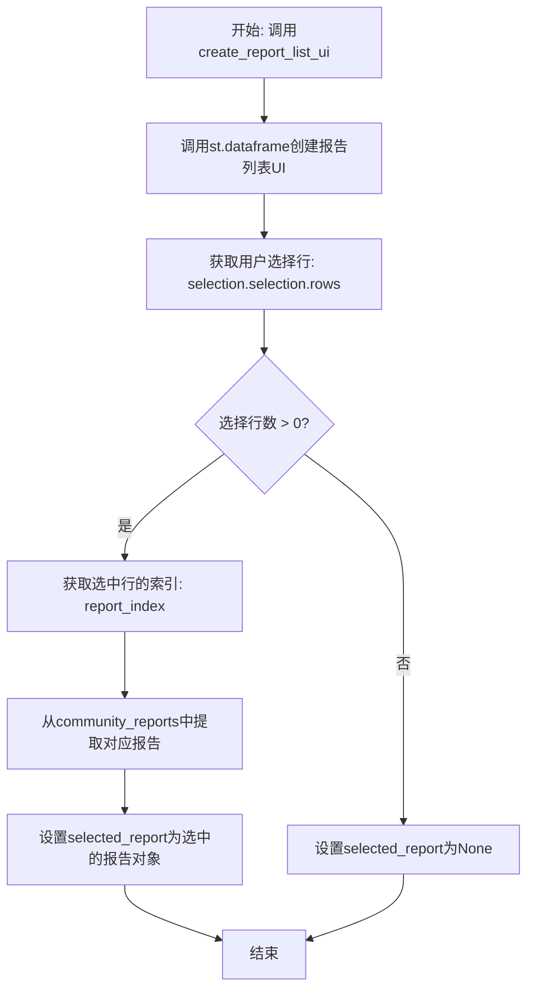
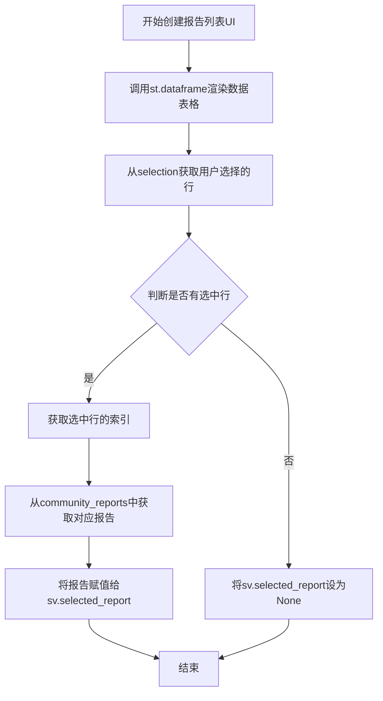

# `graphrag\unified-search-app\app\ui\report_list.py` 详细设计文档

这是一个Streamlit UI模块，用于在社区报告中创建一个可交互的数据表格组件，允许用户通过单行选择模式查看具体的社区报告信息，并将选中的报告存储到会话状态中。

## 整体流程



## 类结构

```
模块级函数
└── create_report_list_ui (主函数)
```

## 全局变量及字段


### `sv`
    
会话变量管理器，用于存储和管理应用状态

类型：`SessionVariables`
    


### `selection`
    
数据框选择结果，包含用户选中的行信息

类型：`DataframeSelection`
    


### `rows`
    
用户选中的行索引列表

类型：`list`
    


### `report_index`
    
用户选中的报告索引值

类型：`int`
    


### `st`
    
Streamlit框架模块，提供UI组件构建功能

类型：`module`
    


### `SessionVariables.community_reports`
    
存储社区报告列表的会话状态

类型：`SessionState`
    


### `SessionVariables.selected_report`
    
存储当前选中报告的会话状态

类型：`SessionState`
    


### `SessionState.value`
    
会话状态的实际值，包含报告数据

类型：`DataFrame`
    
    

## 全局函数及方法


### `create_report_list_ui`

该函数是报告列表模块的核心UI组件，用于在Streamlit页面中创建一个可交互的数据表格，展示社区报告列表并处理用户的选择操作，将用户选中的报告存储到会话状态中。

参数：

- `sv`：`SessionVariables`，会话状态管理器，包含社区报告数据和选中的报告状态

返回值：`None`，该函数通过修改 `sv.selected_report` 的值来返回结果，不使用return语句

#### 流程图



#### 带注释源码

```python
# 导入Streamlit库用于创建UI组件
import streamlit as st
# 导入会话状态管理器
from state.session_variables import SessionVariables


def create_report_list_ui(sv: SessionVariables):
    """Return report list UI component."""
    # 使用Streamlit的dataframe组件渲染社区报告列表
    # 参数说明：
    # - sv.community_reports.value: 数据源，数据帧格式
    # - height=1000: 表格高度1000像素
    # - hide_index=True: 隐藏索引列
    # - column_order=["human_readable_id", "title"]: 指定显示列顺序
    # - selection_mode="single-row": 单行选择模式
    # - on_select="rerun": 选择后重新运行脚本
    selection = st.dataframe(
        sv.community_reports.value,
        height=1000,
        hide_index=True,
        column_order=["human_readable_id", "title"],
        selection_mode="single-row",
        on_select="rerun",
    )
    # 获取用户选择的行索引列表
    rows = selection.selection.rows
    
    # 判断用户是否有选择报告
    if len(rows) > 0:
        # 获取第一个选中行的索引
        report_index = selection.selection.rows[0]
        # 从数据帧中获取对应的报告数据并存储到会话状态
        sv.selected_report.value = sv.community_reports.value.iloc[report_index]
    else:
        # 用户未选择任何报告时，清空选中状态
        sv.selected_report.value = None
```

---

#### 关键组件信息

| 组件名称 | 一句话描述 |
|---------|-----------|
| `SessionVariables` | 会话状态管理器，用于在Streamlit应用中跨会话共享和持久化数据 |
| `st.dataframe` | Streamlit的数据表格组件，提供交互式数据展示和选择功能 |

#### 潜在的技术债务或优化空间

1. **硬编码配置值**：`height=1000`、列顺序 `["human_readable_id", "title"]` 等配置应该抽取为配置参数或常量
2. **缺少错误处理**：未对 `sv.community_reports.value` 为 `None` 或空数据的情况进行异常处理
3. **magic string**：列名 `"human_readable_id"` 和 `"title"` 应该定义为常量，避免拼写错误
4. **布局灵活性**：固定高度1000px在不同屏幕尺寸下可能不友好，考虑使用自适应高度或可配置参数

#### 其它项目

- **设计目标**：提供直观的报告列表选择界面，通过数据表格形式展示报告供用户快速浏览和选择
- **约束条件**：依赖Streamlit框架和自定义的SessionVariables状态管理系统
- **错误处理**：当前实现未包含错误处理逻辑，建议添加对数据为空或格式异常的容错处理
- **数据流**：数据从 `sv.community_reports.value`（输入）流向 `sv.selected_report.value`（输出），用户交互通过 `selection` 对象传递

## 关键组件


### 报告列表UI组件

这是一个Streamlit数据框架组件，用于显示社区报告列表并支持单行选择功能，通过SessionVariables管理选中的报告状态。

### 数据索引访问

使用pandas的`.iloc[report_index]`方法进行精确索引访问，实现报告数据的惰性加载和按需获取。

### 状态管理

通过SessionVariables对象管理社区报告列表和选中报告的状态，使用value属性进行状态存取。

### 选择事件处理

实现单行选择模式的事件处理逻辑，当用户选择报告时更新selected_report状态，未选择时设为None。


## 问题及建议


### 已知问题

- **空值未检查**：直接访问 `sv.community_reports.value` 和 `.iloc[report_index]`，若值为 `None` 或空 DataFrame 时会抛出异常
- **魔法数字**：高度 1000 被硬编码，应提取为常量或配置参数
- **重复访问属性**：`selection.selection.rows` 被访问多次，可缓存结果
- **selection.rows 覆盖声明**：第 12 行声明了 `rows` 变量，第 13 行又通过 `selection.selection.rows[0]` 访问，造成代码冗余
- **缺少错误处理**：没有 try-except 捕获可能的索引越界或类型错误
- **硬编码列名**：`column_order` 中的列名字符串应定义为常量或从配置读取

### 优化建议

- 在访问 `value` 前添加空值检查：`if sv.community_reports.value is not None and not sv.community_reports.value.empty:`
- 将 1000 提取为常量 `DEFAULT_LIST_HEIGHT = 1000` 或接受配置参数
- 使用变量缓存行索引：`rows = selection.selection.rows`，并统一使用该变量
- 添加 try-except 块处理可能的异常情况
- 将列名 `["human_readable_id", "title"]` 定义为常量或从外部配置注入，提高可维护性
- 考虑添加加载状态和空数据提示，提升用户体验

## 其它


### 设计目标与约束

**设计目标**：为用户提供一个交互式的报告列表选择界面，支持单行选择并实时更新选中报告的状态。

**约束条件**：
- 依赖Streamlit框架的dataframe组件
- 必须与SessionVariables状态管理集成
- 仅支持单行选择模式（selection_mode="single-row"）
- 固定显示列：human_readable_id和title

### 错误处理与异常设计

**异常处理机制**：
- 空选择处理：当用户未选择任何行时，通过`if len(rows) > 0`判断，将`selected_report.value`设置为None
- 索引安全：使用`selection.selection.rows[0]`获取第一行索引前，已进行长度检查
- 隐式异常：依赖Streamlit框架自身的参数验证

**边界情况**：
- community_reports.value为空DataFrame时，dataframe显示空列表
- selection.rows为空列表时，else分支处理

### 数据流与状态机

**数据输入**：
- sv.community_reports.value：DataFrame类型，作为数据源输入到dataframe组件

**状态转换**：
1. 初始状态：selected_report.value = None
2. 用户选择：触发on_select="rerun"重新运行
3. 选中状态：selected_report.value = 选中的DataFrame行数据
4. 取消选择：selected_report.value = None

**数据流向**：
```
community_reports.value → st.dataframe → 用户选择 → selection.rows → selected_report.value
```

### 外部依赖与接口契约

**依赖项**：
- streamlit：UI框架，版本需支持st.dataframe的selection参数
- state.session_variables.SessionVariables：自定义状态管理类

**接口契约**：
- 函数签名：create_report_list_ui(sv: SessionVariables) -> None
- 输入参数sv必须包含：
  - sv.community_reports.value：pandas.DataFrame类型
  - sv.selected_report：可写的状态变量
- 输出：通过sv.selected_report.value传递选中结果

### 性能考虑

- dataframe设置height=1000，可能导致初始加载较慢，建议评估是否需要分页
- on_select="rerun"会触发完整脚本重新执行，对于大数据集可能有性能影响

### 用户交互设计

- 固定列顺序：仅显示human_readable_id和title两列
- 隐藏索引：hide_index=True提升视觉整洁度
- 单行模式：避免多选复杂性
- 立即反馈：选择后立即rerun提供即时反馈

### 安全性考虑

- 未发现直接的安全风险
- 建议验证community_reports.value的数据来源可信度
- 建议对selected_report的赋值进行类型检查

### 可测试性分析

- 函数依赖Streamlit上下文，单元测试需使用streamlit.testing框架mock
- 建议提取数据选择逻辑到独立函数便于测试


    