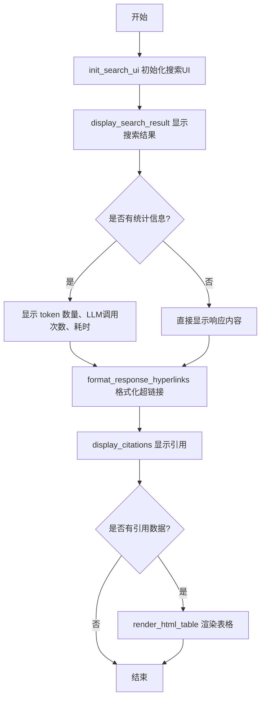
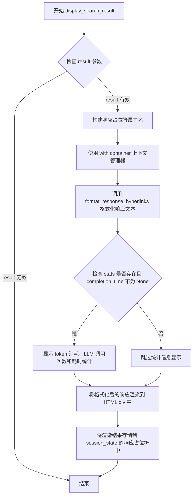
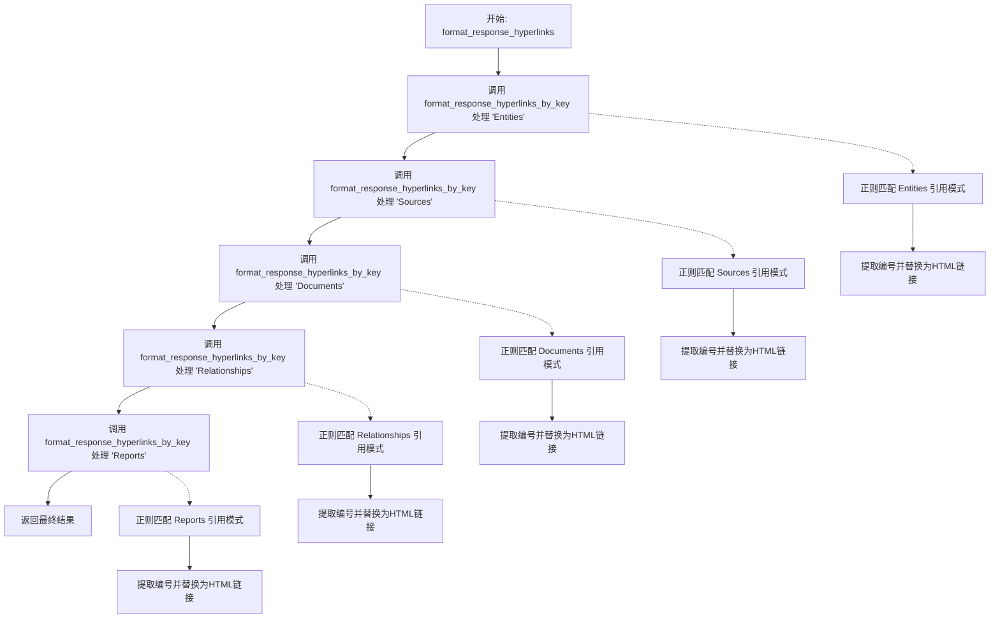
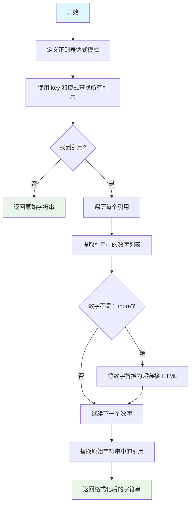
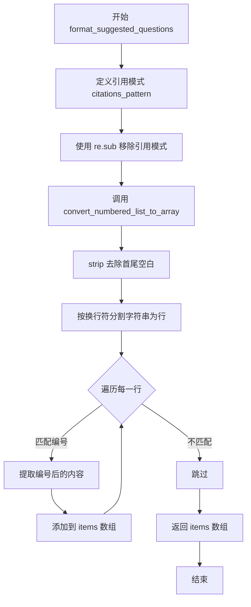
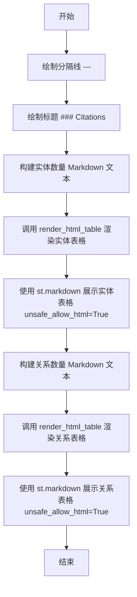

# `graphrag\unified-search-app\app\ui\search.py` 详细设计文档

这是一个搜索模块，用于在Streamlit UI中展示搜索结果、支持超链接、引用和统计信息显示的功能模块。

## 整体流程



## 类结构

```
SearchStats (数据类)
└── 包含: completion_time, llm_calls, prompt_tokens
```

## 全局变量及字段


### `SHORT_WORDS`
    
短词数量阈值，用于控制表格单元格中显示的词数

类型：`int`
    


### `LONG_WORDS`
    
长词数量阈值，用于控制表格单元格title属性中显示的词数

类型：`int`
    


### `SearchStats.completion_time`
    
完成时间

类型：`float`
    


### `SearchStats.llm_calls`
    
LLM调用次数

类型：`int`
    


### `SearchStats.prompt_tokens`
    
提示词token数量

类型：`int`
    
    

## 全局函数及方法


### `init_search_ui`

初始化搜索UI组件，在指定的Streamlit容器中设置搜索页面的标题、说明文字以及用于存储响应和上下文的占位符。

参数：

- `container`：`DeltaGenerator`，Streamlit的容器对象，用于承载搜索UI组件
- `search_type`：`SearchType`，搜索类型枚举，用于确定搜索模式和生成对应的session state键名
- `title`：`str`，搜索页面的主标题，以Markdown格式显示
- `caption`：`str`，搜索页面的说明文字，以caption样式显示

返回值：`None`，该函数无返回值，仅通过副作用（session_state）存储UI占位符

#### 流程图

```mermaid
flowchart TD
    A[开始 init_search_ui] --> B[接收参数 container, search_type, title, caption]
    B --> C[使用 with container 进入容器上下文]
    C --> D[使用 st.markdown 显示 title]
    D --> E[使用 st.caption 显示 caption]
    E --> F[获取 ui_tag = search_type.value.lower]
    F --> G[创建 response_placeholder: st.session_state[f'{ui_tag}_response_placeholder']]
    G --> H[创建 context_placeholder: st.session_state[f'{ui_tag}_context_placeholder']]
    H --> I[保存 container 引用: st.session_state[f'{ui_tag}_container']]
    I --> J[结束函数]
```

#### 带注释源码

```python
def init_search_ui(
    container: DeltaGenerator, search_type: SearchType, title: str, caption: str
):
    """Initialize search UI component."""
    # 使用 with 语句进入 Streamlit 容器上下文
    # 所有在 with 块内的 st.* 调用都会渲染到指定容器中
    with container:
        # 使用 Markdown 渲染搜索页面的主标题
        # 支持 Markdown 语法，如加粗、斜体、链接等
        st.markdown(title)
        
        # 使用 caption 显示搜索页面的说明文字
        # caption 样式比普通文字更小、更淡，用于辅助说明
        st.caption(caption)

        # 将搜索类型转换为小写字符串，作为 session_state 键的前缀
        # 例如: search_type = SearchType.Entity 则 ui_tag = 'entity'
        ui_tag = search_type.value.lower()

        # 在 session_state 中创建响应占位符
        # 用于后续异步更新搜索结果响应内容
        # 键名格式: {ui_tag}_response_placeholder
        st.session_state[f"{ui_tag}_response_placeholder"] = st.empty()

        # 在 session_state 中创建上下文占位符
        # 用于后续显示搜索引用的上下文信息（如 citations）
        # 键名格式: {ui_tag}_context_placeholder
        st.session_state[f"{ui_tag}_context_placeholder"] = st.empty()

        # 保存容器引用到 session_state
        # 便于在其他函数中访问同一个容器进行UI更新
        # 键名格式: {ui_tag}_container
        st.session_state[f"{ui_tag}_container"] = container
```


### `display_search_result`

该函数负责将搜索结果数据渲染到 Streamlit UI 界面中，包括格式化响应文本、显示搜索统计信息（如 token 消耗、LLM 调用次数和耗时），并将结果内容注入到指定的 UI 容器中。

参数：

- `container`：`DeltaGenerator`，Streamlit 的容器组件，用于承载和显示搜索结果内容
- `result`：`SearchResult`，包含搜索响应内容、搜索类型等信息的搜索结果对象
- `stats`：`SearchStats | None`，可选的搜索统计数据，包含完成时间、LLM 调用次数和 prompt token 数量

返回值：`None`，该函数直接操作 Streamlit UI 进行渲染，无返回值

#### 流程图



#### 带注释源码

```python
def display_search_result(
    container: DeltaGenerator, result: SearchResult, stats: SearchStats | None = None
):
    """Display search results data into the UI."""
    # 根据搜索类型构建对应的响应占位符属性名
    # 例如：对于 'local' 类型，生成 'local_response_placeholder'
    response_placeholder_attr = (
        result.search_type.value.lower() + "_response_placeholder"
    )

    # 使用 Streamlit 容器上下文管理器，在指定容器中渲染内容
    with container:
        # 调用格式化函数处理响应文本中的超链接
        # 将 Entities、Sources、Documents、Relationships、Reports 等引用转换为可点击链接
        response = format_response_hyperlinks(
            result.response, result.search_type.value.lower()
        )

        # 检查是否提供了统计信息且完成时间有效
        if stats is not None and stats.completion_time is not None:
            # 在 UI 中显示搜索统计信息：token 数量、LLM 调用次数、耗时（秒）
            st.markdown(
                f"*{stats.prompt_tokens:,} tokens used, {stats.llm_calls} LLM calls, {int(stats.completion_time)} seconds elapsed.*"
            )
        
        # 将格式化后的响应内容渲染为 HTML 并显示在 UI 中
        # 使用 result.search_type 构建唯一的 HTML 元素 ID，便于后续引用和导航
        st.session_state[response_placeholder_attr] = st.markdown(
            f"<div id='{result.search_type.value.lower()}-response'>{response}</div>",
            unsafe_allow_html=True,
        )
```


### `display_citations`

该函数负责将搜索结果中的引用信息（上下文数据）渲染到Streamlit UI界面上，支持显示不同类型的引用来源（如sources、reports等），并通过HTML表格形式呈现。

参数：

- `container`：`DeltaGenerator | None`，Streamlit容器对象，用于承载UI元素，若为None则直接在主容器中显示
- `result`：`SearchResult | None`，搜索结果对象，包含需要显示的引用上下文数据，若为None则不显示任何内容

返回值：`None`，该函数直接操作Streamlit UI，无返回值

#### 流程图

```mermaid
flowchart TD
    A[开始 display_citations] --> B{container is not None?}
    B -->|否| C[直接返回，不显示内容]
    B -->|是| D{result is not None?}
    D -->|否| C
    D -->|是| E[获取 result.context 数据]
    E --> F[对 context_data 按键排序]
    F --> G[显示分隔线 ---]
    G --> H[显示标题 ### Citations]
    H --> I[遍历 context_data.items]
    I --> J{当前键值对长度 > 0?}
    J -->|否| K[继续下一键值对]
    J -->|是| L{key == 'sources'?}
    L -->|是| M[显示标题: Relevant chunks of source documents]
    L -->|否| N{key == 'reports'?}
    N -->|是| O[显示标题: Relevant AI-generated network reports]
    N -->|否| P[显示标题: Relevant AI-extracted {key}]
    M --> Q
    O --> Q
    P --> Q[调用 render_html_table 渲染HTML表格]
    Q --> K
    K --> R{还有更多键值对?}
    R -->|是| I
    R -->|否| S[结束]
```

#### 带注释源码

```python
def display_citations(
    container: DeltaGenerator | None = None, result: SearchResult | None = None
):
    """Display citations into the UI."""
    # 检查container参数是否提供
    if container is not None:
        # 使用container上下文管理器，在指定容器中显示内容
        with container:
            # 检查result参数是否提供
            if result is not None:
                # 从result对象中获取上下文数据（引用来源）
                context_data = result.context
                # 按键名排序上下文数据，确保显示顺序一致
                context_data = dict(sorted(context_data.items()))

                # 显示水平分隔线
                st.markdown("---")
                # 显示引用区域的标题
                st.markdown("### Citations")
                
                # 遍历上下文中每个键值对
                for key, value in context_data.items():
                    # 仅处理非空的值
                    if len(value) > 0:
                        key_type = key
                        # 根据键的类型显示不同的标题描述
                        if key == "sources":
                            # 文档来源引用
                            st.markdown(
                                f"Relevant chunks of source documents **({len(value)})**:"
                            )
                            key_type = "sources"
                        elif key == "reports":
                            # AI生成的报告引用
                            st.markdown(
                                f"Relevant AI-generated network reports **({len(value)})**:"
                            )
                        else:
                            # 其他类型的AI提取引用（如entities、relationships等）
                            st.markdown(
                                f"Relevant AI-extracted {key} **({len(value)})**:"
                            )
                        
                        # 调用render_html_table将数据渲染为HTML表格并显示
                        # 参数: value - DataFrame数据, search_type - 搜索类型, key_type - 键类型
                        st.markdown(
                            render_html_table(
                                value, result.search_type.value.lower(), key_type
                            ),
                            unsafe_allow_html=True,
                        )
```


### `format_response_hyperlinks`

该函数用于将搜索响应文本中的引用标记（如 `(1)`, `(1,2)` 等）转换为可点击的超链接 HTML 标签，使其在 UI 中能够直接跳转到对应的引用来源。它通过遍历预定义的五个关键字（Entities、Sources、Documents、Relationships、Reports）并调用辅助函数逐个处理，最终返回包含完整超链接的响应文本。

参数：

- `str_response`：`str`，原始的响应字符串，包含需要被格式化的引用标记
- `search_type`：`str`，搜索类型，用于生成超链接的锚点标识符，默认为空字符串

返回值：`str`，返回格式化后的响应字符串，其中的引用标记已被替换为 HTML 超链接标签

#### 流程图



#### 带注释源码

```python
def format_response_hyperlinks(str_response: str, search_type: str = ""):
    """Format response to show hyperlinks inside the response UI.
    
    将响应文本中的引用标记转换为可点击的超链接。
    支持 Entities、Sources、Documents、Relationships、Reports 五种引用类型。
    
    Args:
        str_response: 原始响应字符串，包含引用标记如 "(1)" 或 "(1,2,+more)"
        search_type: 搜索类型，用于构建超链接的锚点ID
    
    Returns:
        包含HTML超链接的格式化响应字符串
    """
    # 初始化结果变量，从原始响应开始
    results_with_hyperlinks = format_response_hyperlinks_by_key(
        str_response, "Entities", "Entities", search_type
    )
    # 处理 Sources 引用，将结果传递给下一步
    results_with_hyperlinks = format_response_hyperlinks_by_key(
        results_with_hyperlinks, "Sources", "Sources", search_type
    )
    # 处理 Documents 引用，映射到 Sources 锚点
    results_with_hyperlinks = format_response_hyperlinks_by_key(
        results_with_hyperlinks, "Documents", "Sources", search_type
    )
    # 处理 Relationships 引用
    results_with_hyperlinks = format_response_hyperlinks_by_key(
        results_with_hyperlinks, "Relationships", "Relationships", search_type
    )
    # 处理 Reports 引用
    results_with_hyperlinks = format_response_hyperlinks_by_key(
        results_with_hyperlinks, "Reports", "Reports", search_type
    )

    # 返回最终包含所有超链接的响应文本
    # noqa: RET504 - 允许在此处返回局部变量以提高性能
    return results_with_hyperlinks
```


### `format_response_hyperlinks_by_key`

该函数用于在搜索响应文本中将特定键（如 Entities、Sources、Documents 等）的引用数字转换为可点击的超链接格式，以便用户在 UI 中直接点击引用跳转到对应的引用内容。

参数：

- `str_response`：`str`，需要处理的原始响应字符串，包含需要被格式化的引用
- `key`：`str`，要匹配的键名（如 "Entities"、"Sources"、"Documents"、"Relationships"、"Reports"）
- `anchor`：`str`，超链接中使用的锚点名称，通常与 key 相同或映射到特定的引用类型
- `search_type`：`str`，搜索类型标识，用于构建超链接的 ID 前缀，默认为空字符串

返回值：`str`，返回格式化后的字符串，其中匹配的引用数字已被替换为 HTML 超链接标签

#### 流程图



#### 带注释源码

```python
def format_response_hyperlinks_by_key(
    str_response: str, key: str, anchor: str, search_type: str = ""
):
    """Format response to show hyperlinks inside the response UI by key.
    
    将响应文本中的引用数字转换为 HTML 超链接，使其可以在 UI 中点击跳转。
    例如：'Entities (1, 2)' -> 'Entities <a href="#web-entities-1">1</a>, <a href="#web-entities-2">2</a>'
    
    Args:
        str_response: 原始响应字符串
        key: 要匹配的键名（Entities/Sources/Documents/Relationships/Reports）
        anchor: 超链接中使用的锚点名称
        search_type: 搜索类型，用于构建超链接 ID
    
    Returns:
        格式化后的字符串，包含可点击的超链接
    """
    # 正则表达式模式：匹配括号中的数字，支持多个数字逗号分隔，支持 +more 后缀
    # 例如匹配: (1), (1, 2), (1, 2, +more)
    pattern = r"\(\d+(?:,\s*\d+)*(?:,\s*\+more)?\)"

    # 使用正则表达式查找所有匹配的引用，格式为 "key (numbers)"
    # 例如：key="Entities", 匹配 "Entities (1, 2)"
    citations_list = re.findall(f"{key} {pattern}", str_response)

    # 初始化结果为原始字符串
    results_with_hyperlinks = str_response
    
    # 如果找到了引用，则进行处理
    if len(citations_list) > 0:
        # 遍历每个引用（如 "Entities (1, 2)"）
        for occurrence in citations_list:
            # 转换为字符串
            string_occurrence = str(occurrence)
            
            # 提取括号内的数字列表（去掉括号）
            # 例如："(1, 2)" -> "1, 2" -> ["1", "2"]
            numbers_list = string_occurrence[
                string_occurrence.find("(") + 1 : string_occurrence.find(")")
            ].split(",")
            
            # 初始化带超链接的字符串为原始引用
            string_occurrence_hyperlinks = string_occurrence
            
            # 遍历每个数字
            for number in numbers_list:
                # 如果不是 "+more" 标记，则转换为超链接
                if number.lower().strip() != "+more":
                    # 构建超链接 HTML:
                    # href 格式: #{search_type}-{anchor}-{number}
                    # 例如: #web-entities-1
                    string_occurrence_hyperlinks = string_occurrence_hyperlinks.replace(
                        number,
                        f'<a href="#{search_type.lower().strip()}-{anchor.lower().strip()}-{number.strip()}">{number}</a>',
                    )

            # 用格式化后的超链接版本替换原始引用
            results_with_hyperlinks = results_with_hyperlinks.replace(
                occurrence, string_occurrence_hyperlinks
            )

    # 返回格式化后的结果
    return results_with_hyperlinks
```


### `format_suggested_questions`

该函数用于将建议问题字符串格式化为UI可显示的数组格式。它首先通过正则表达式移除字符串中的引用模式（如 `[1]` 等），然后调用辅助函数将编号列表转换为字符串数组返回。

参数：

- `questions`：`str`，需要格式化的建议问题字符串，通常是包含编号列表的问题文本

返回值：`List[str]`，返回格式化后的建议问题字符串数组

#### 流程图



#### 带注释源码

```python
def format_suggested_questions(questions: str):
    """Format suggested questions to the UI."""
    # 定义正则表达式模式，用于匹配方括号内的引用，如 [1], [1,2,3]
    citations_pattern = r"\[.*?\]"
    
    # 使用正则表达式移除所有引用模式，并去除首尾空白
    # 例如：输入 "What is AI? [1]\n1. Question one\n2. Question two"
    # 输出 "What is AI?\n1. Question one\n2. Question two"
    substring = re.sub(citations_pattern, "", questions).strip()
    
    # 调用辅助函数将编号列表字符串转换为字符串数组并返回
    return convert_numbered_list_to_array(substring)
```


### `convert_numbered_list_to_array`

将编号列表格式的字符串（如 "1. 第一项\n2. 第二项"）解析并转换为字符串数组。

参数：

- `numbered_list_str`：`str`，需要转换的编号列表字符串，格式为每行以数字和句点开头（如 "1. 项目"）

返回值：`list[str]`，转换后的字符串数组，只包含编号后的内容部分

#### 流程图

```mermaid
flowchart TD
    A[开始] --> B[去除字符串首尾空白并按行分割]
    B --> C[初始化空列表 items]
    C --> D{遍历每一行}
    D -->|是| E[使用正则匹配 '^\d+\.\s*(.*)']
    E --> F{匹配成功?}
    F -->|是| G[提取捕获组1的内容并去除空白]
    G --> H[将提取的内容添加到 items 列表]
    H --> D
    F -->|否| D
    D -->|遍历完毕| I[返回 items 列表]
    I --> J[结束]
```

#### 带注释源码

```python
def convert_numbered_list_to_array(numbered_list_str):
    """Convert numbered list result into an array of elements."""
    # 步骤1: 去除字符串首尾空白，按换行符分割成行列表
    lines = numbered_list_str.strip().split("\n")
    
    # 步骤2: 初始化用于存储结果的空列表
    items = []

    # 步骤3: 遍历每一行内容
    for line in lines:
        # 使用正则表达式匹配编号列表格式: 数字开头 + 句点 + 可选空格 + 捕获剩余内容
        # 正则模式: ^\d+\.\s*(.*)
        #   ^       - 行的开始
        #   \d+     - 一个或多个数字
        #   \.      - 字面句点
        #   \s*     - 零个或多个空白字符
        #   (.*)    - 捕获组，匹配任意字符直到行尾
        match = re.match(r"^\d+\.\s*(.*)", line)
        
        # 如果匹配成功（说明这行是有效的编号列表项）
        if match:
            # 提取捕获组中的内容（编号后面的实际文本）
            item = match.group(1).strip()
            
            # 将提取的文本添加到结果列表中
            items.append(item)

    # 返回转换后的字符串数组
    return items
```


### `get_ids_per_key`

该函数用于从包含引用标记的响应文本中，提取特定键（key）后面括号内的所有数字ID列表，常用于解析如 "Entities (1, 2, +more)" 这类引用格式的文本。

参数：

- `str_response`：`str`，原始响应字符串，包含需要解析的引用标记
- `key`：`str`，目标键名，用于匹配特定类型的引用（如 "Entities"、"Sources"、"Reports" 等）

返回值：`list[str]`，返回提取到的数字ID字符串列表，若未找到匹配则返回空列表

#### 流程图

```mermaid
flowchart TD
    A[开始 get_ids_per_key] --> B[定义正则表达式 pattern]
    B --> C[使用 f-string 构造完整匹配模式: f'{key} {pattern}']
    C --> D[在 str_response 中查找所有匹配的 citations_list]
    D --> E{判断 citations_list 长度 > 0?}
    E -->|否| F[初始化空列表 numbers_list]
    E -->|是| G[遍历每个 occurrence]
    G --> H[将 occurrence 转换为字符串]
    H --> I[提取括号内内容: find '(' +1 到 find ')']
    J --> K[按逗号分割提取数字]
    I --> J[使用 split(',') 分割]
    J --> L[将分割结果添加到 numbers_list]
    L --> G
    G --> M[返回 numbers_list]
    F --> M
```

#### 带注释源码

```python
def get_ids_per_key(str_response: str, key: str):
    """Filter ids per key.
    
    从响应文本中提取指定键后面的引用ID列表。
    例如: 输入 'Entities (1, 2, 3)' 和 key='Entities'，返回 ['1', '2', '3']
    
    Args:
        str_response: 包含引用标记的原始响应字符串
        key: 要匹配的键名（如 'Entities', 'Sources', 'Reports' 等）
    
    Returns:
        提取到的数字ID字符串列表，若无匹配则返回空列表
    """
    # 定义正则表达式：匹配括号内的数字、逗号分隔的数字、以及 +more 标记
    # \d+ 匹配一个或多个数字
    # (?:,\s*\d+)* 匹配零个或多个逗号加数字的组合
    # (?:,\s*\+more)? 可选的 +more 后缀
    pattern = r"\(\d+(?:,\s*\d+)*(?:,\s*\+more)?\)"
    
    # 构造完整的搜索模式：键名 + 空格 + 正则表达式
    # 例如: "Entities (\d+(?:,\s*\d+)*(?:,\s*\+more)?)"
    citations_list = re.findall(f"{key} {pattern}", str_response)
    
    # 初始化结果列表
    numbers_list = []
    
    # 如果找到了匹配的引用
    if len(citations_list) > 0:
        # 遍历每个匹配到的引用项
        for occurrence in citations_list:
            # 转换为字符串确保操作安全
            string_occurrence = str(occurrence)
            
            # 提取括号内的内容：找到 '(' 和 ')' 的位置
            # 从 '(' 之后开始，到 ')' 之前结束
            # 例如: "Entities (1, 2, 3)" -> "1, 2, 3"
            numbers_list = string_occurrence[
                string_occurrence.find("(") + 1 : string_occurrence.find(")")
            ].split(",")
    
    # 返回提取到的数字ID列表
    return numbers_list
```


### `render_html_table`

该函数用于将 Pandas DataFrame 数据渲染为 HTML 表格并返回 HTML 字符串，支持长文本截断、JSON 字段提取和可访问性属性设置，常用于在 Streamlit UI 中以表格形式展示搜索结果或引用数据。

参数：

- `df`：`pd.DataFrame`，需要渲染为 HTML 表格的 Pandas DataFrame 数据源
- `search_type`：`str`，搜索类型标识，用于生成 HTML 元素的唯一 ID（如 "entities"、"relationships"）
- `key`：`str`，数据键名，用于生成 HTML 元素 ID 和区分不同类型的数据表

返回值：`str`，返回生成的 HTML 表格字符串，可直接在 Streamlit 中通过 `st.markdown(..., unsafe_allow_html=True)` 渲染

#### 流程图

```mermaid
flowchart TD
    A[开始 render_html_table] --> B[定义表格容器样式 table_container]
    B --> C[定义表格样式 table_style]
    C --> D[定义表头样式 th_style]
    D --> E[定义单元格样式 td_style]
    E --> F[创建表格外层 div 元素]
    F --> G[创建 table 元素]
    G --> H[遍历 DataFrame 列生成表头 thead]
    H --> I[遍历 DataFrame 行生成表格主体 tbody]
    I --> J{当前行是否有 id 字段?}
    J -->|是| K[生成包含 id 的 html_id]
    J -->|否| L[生成 row-{index} 作为 html_id]
    K --> M[创建 tr 元素并添加 id 属性]
    L --> M
    M --> N[遍历行中每个单元格值]
    N --> O{值是否为字符串类型?}
    O -->|是| P{字符串是否以 '{' 开头?}
    P -->|是| Q[解析 JSON 并提取 summary 字段]
    P -->|否| R[直接使用原字符串]
    Q --> S[按空格分割字符串为数组]
    R --> S
    O -->|否| T[将非字符串值转为字符串]
    S --> U{数组长度 >= SHORT_WORDS?}
    U -->|是| V[截取前 SHORT_WORDS 个词 + '...']
    U -->|否| W[使用完整字符串]
    V --> X[生成 td_value 显示用]
    W --> X
    T --> X
    X --> Y{数组长度 >= LONG_WORDS?}
    Y -->|是| Z[截取前 LONG_WORDS 个词 + '...']
    Y -->|否| AA[使用完整字符串]
    Z --> AB[对 title_value 进行 HTML 转义]
    AA --> AB
    AB --> AC[生成带 title 属性的 td 元素]
    AC --> AD[将 td 元素添加到 tr 中]
    AD --> AE{是否还有未处理的单元格?}
    AE -->|是| N
    AE -->|否| AF{是否还有未处理的行?}
    AF -->|是| I
    AF -->|否| AG[闭合 tbody 和 table 标签]
    AG --> AH[返回生成的 HTML 字符串]
```

#### 带注释源码

```python
# 全局常量：短词阈值，用于表格单元格显示的截断长度
SHORT_WORDS = 12
# 全局常量：长词阈值，用于 title 属性（鼠标悬停显示完整内容）的截断长度
LONG_WORDS = 200


def render_html_table(df: pd.DataFrame, search_type: str, key: str):
    """Render HTML table into the UI.
    
    将 Pandas DataFrame 转换为 HTML 表格字符串，支持：
    1. 自动提取 JSON 格式字段中的 summary 内容
    2. 长文本截断显示，完整内容通过 title 属性展示
    3. 为每一行生成唯一的 html_id 用于页面内导航
    4. 响应式布局和自动换行样式
    
    Args:
        df: 要渲染的 DataFrame 数据
        search_type: 搜索类型，用于生成元素 ID
        key: 数据键名，用于生成元素 ID
    
    Returns:
        HTML 表格字符串
    """
    # 定义表格容器样式：最大宽度100%，隐藏溢出，居中显示
    table_container = """
        max-width: 100%;
        overflow: hidden;
        margin: 0 auto;
    """

    # 定义表格整体样式：宽度100%，边框合并，固定表格布局
    table_style = """
        width: 100%;
        border-collapse: collapse;
        table-layout: fixed;
    """

    # 定义表头样式：允许长单词换行，保持正常空白处理
    th_style = """
        word-wrap: break-word;
        white-space: normal;
    """

    # 定义单元格样式：1px 浅灰色边框，允许换行
    td_style = """
        border: 1px solid #efefef;
        word-wrap: break-word;
        white-space: normal;
    """

    # 开始构建 HTML，先创建外层 div 容器
    table_html = f'<div style="{table_container}">'
    # 添加 table 元素
    table_html += f'<table style="{table_style}">'

    # 生成表头 thead 部分
    table_html += "<thead><tr>"
    for col in pd.DataFrame(df).columns:
        # 遍历所有列名，创建 th 元素
        table_html += f'<th style="{th_style}">{col}</th>'
    table_html += "</tr></thead>"

    # 生成表格主体 tbody 部分
    table_html += "<tbody>"
    # 遍历 DataFrame 的每一行
    for index, row in pd.DataFrame(df).iterrows():
        # 生成行级 HTML id：优先使用 row.id 字段，否则使用 row-{index}
        # 格式：{search_type}-{key}-{id值}，如 "vector-entities-123"
        html_id = (
            f"{search_type.lower().strip()}-{key.lower().strip()}-{row.id.strip()}"
            if "id" in row
            else f"row-{index}"
        )
        # 创建 tr 元素并设置 id 属性，用于页面内锚点跳转
        table_html += f'<tr id="{html_id}">'
        
        # 遍历行中每个单元格的值
        for value in row:
            # 判断是否为字符串类型
            if isinstance(value, str):
                # 检查字符串是否以 '{' 开头（可能是 JSON 格式）
                if value[0:1] == "{":
                    # 解析 JSON 并提取 summary 字段
                    value_casted = json.loads(value)
                    value = value_casted["summary"]
                
                # 按空格分割字符串为单词数组
                value_array = str(value).split(" ")
                
                # 计算单元格显示值：超过 SHORT_WORDS 则截断并加省略号
                td_value = (
                    " ".join(value_array[:SHORT_WORDS]) + "..."
                    if len(value_array) >= SHORT_WORDS
                    else value
                )
                
                # 计算 title 属性值：超过 LONG_WORDS 则截断
                title_value = (
                    " ".join(value_array[:LONG_WORDS]) + "..."
                    if len(value_array) >= LONG_WORDS
                    else value
                )
                
                # 对 title_value 进行 HTML 实体转义，防止属性值中的引号破坏 HTML
                title_value = (
                    title_value
                    .replace('"', "&quot;")
                    .replace("'", "&apos;")
                    .replace("\n", " ")
                    .replace("\n\n", " ")
                    .replace("\r\n", " ")
                )
                
                # 生成 td 元素：设置样式和 title 属性（鼠标悬停显示完整内容）
                table_html += (
                    f'<td style="{td_style}" title="{title_value}">{td_value}</td>'
                )
            else:
                # 非字符串类型（如数字、布尔值等），直接转为字符串显示
                table_html += f'<td style="{td_style}" title="{value}">{value}</td>'
        
        # 结束当前 tr 元素
        table_html += "</tr>"
    
    # 闭合 tbody、table 和 div 标签
    table_html += "</tbody></table></div>"

    # 返回生成的完整 HTML 字符串
    return table_html
```


### `display_graph_citations`

显示图形引用到UI，该函数接收实体和关系数据并将其渲染为HTML表格形式展示在Streamlit界面上。

参数：

-  `entities`：`pd.DataFrame`，包含AI提取的实体数据
-  `relationships`：`pd.DataFrame`，包含AI提取的关系数据
-  `citation_type`：`str`，用于标识引用类型的字符串，将作为HTML表格的搜索类型参数

返回值：`None`，该函数无返回值，直接在Streamlit页面上渲染内容

#### 流程图



#### 带注释源码

```python
def display_graph_citations(
    entities: pd.DataFrame, relationships: pd.DataFrame, citation_type: str
):
    """Display graph citations into the UI."""
    # 绘制水平分隔线，区分内容区块
    st.markdown("---")
    # 绘制二级标题"Citations"
    st.markdown("### Citations")

    # 显示实体数量统计，使用Markdown加粗格式
    st.markdown(f"Relevant AI-extracted entities **({len(entities)})**:")
    # 调用render_html_table将实体DataFrame转换为HTML表格
    # 传入citation_type作为搜索类型，"entities"作为表格的key
    st.markdown(
        render_html_table(entities, citation_type, "entities"),
        unsafe_allow_html=True,  # 允许渲染HTML标签
    )

    # 显示关系数量统计
    st.markdown(f"Relevant AI-extracted relationships **({len(relationships)})**:")
    # 同样方式渲染关系表格
    st.markdown(
        render_html_table(relationships, citation_type, "relationships"),
        unsafe_allow_html=True,
    )
```

## 关键组件


### init_search_ui

Search UI component initialization function that sets up the search interface with title, caption, and session state placeholders for response and context containers.

### SearchStats

A dataclass that stores search operation statistics including completion time, LLM call count, and prompt token usage for tracking search performance.

### display_search_result

Function that renders search result data into the Streamlit UI, formatting the response with hyperlinks and displaying search statistics if available.

### display_citations

Function that displays contextual citations in the UI, organizing and rendering sources, reports, and other reference materials in an HTML table format.

### format_response_hyperlinks

Core response formatting function that processes text responses to embed clickable hyperlinks for referenced entities, sources, documents, relationships, and reports using regex pattern matching.

### format_response_hyperlinks_by_key

Helper function that performs key-specific hyperlink formatting by extracting citation patterns and converting numeric references into anchor links within the response text.

### render_html_table

Function that converts pandas DataFrame data into styled HTML tables with hover tooltips, handling text truncation for long content and JSON parsing for structured summary fields.

### display_graph_citations

Function that renders graph-based citations including AI-extracted entities and relationships as formatted HTML tables in the Streamlit UI.

### get_ids_per_key

Utility function that extracts numeric citation IDs from response text based on a specified key using regex pattern matching.

### format_suggested_questions

Function that processes suggested questions by removing citation brackets and converting numbered list strings into an array of question items.

### convert_numbered_list_to_array

Helper function that parses numbered list text format into an array by matching and extracting content after numeric prefixes.

### SHORT_WORDS / LONG_WORDS

Global constants defining word count thresholds (12 and 200 respectively) for table cell text truncation and tooltip display length control.

## 问题及建议


### 已知问题

-   **重复代码逻辑**：`format_response_hyperlinks_by_key` 和 `get_ids_per_key` 函数中提取数字列表的逻辑重复，可抽取为独立工具函数。
-   **正则表达式重复编译**：相同的正则模式 `r"\(\d+(?:,\s*\d+)*(?:,\s*\+more)?\)"` 在多个函数中重复使用，应预编译为常量以提升性能。
-   **JSON 解析缺乏错误处理**：`render_html_table` 中使用 `json.loads(value)` 时未做异常捕获，若数据格式错误会导致程序崩溃。
-   **硬编码字符串散落各处**：如 "Entities"、"Sources"、"Documents"、"Relationships" 等键名在代码中多处硬编码，应抽取为常量或枚举类。
-   **全局常量作用域不当**：`SHORT_WORDS` 和 `LONG_WORDS` 定义为模块级全局变量，但仅在 `render_html_table` 中使用，宜移入函数或配置类。
-   **Session State 滥用**：`init_search_ui` 中将 UI 占位符存入 `st.session_state`，但这些仅为内部临时状态，非应用级全局状态，宜通过参数传递或局部管理。
-   **类型提示不完整**：`display_citations` 和 `display_search_result` 等函数缺少完整的类型标注（部分参数为 `None` 时未指定 `Optional`）。
-   **魔法数字缺乏注释**：代码中 `12`、`200`、"-response"、"-container" 等数值和字符串缺乏说明，后续维护困难。
-   **DataFrame 重复转换**：`render_html_table` 中循环内多次调用 `pd.DataFrame(df)`，应在循环外缓存结果。
-   **函数职责过载**：`render_html_table` 兼任数据处理、JSON 解析、HTML 生成等多职，宜拆分职责。

### 优化建议

-   抽取公共逻辑为独立函数，如 `extract_citation_numbers(citations_list)` 并预编译正则表达式。
-   将所有键名常量定义为 `SearchKeys` 枚举类或常量字典。
-   为 `json.loads` 添加 try-except 保护，解析失败时记录日志并使用原始值。
-   将 `SHORT_WORDS` 和 `LONG_WORDS` 移入函数参数或创建配置类管理。
-   移除 `st.session_state` 对占位符的存储，改为函数返回值传递或使用局部变量。
-   完善类型提示，使用 `Optional` 和 `Union` 明确定义 nullable 参数。
-   在循环外执行 `pd.DataFrame(df)` 一次，避免重复转换开销。
-   考虑将 `render_html_table` 拆分为数据预处理函数和 HTML 生成函数。

## 其它


### 设计目标与约束

本模块的设计目标是为Streamlit应用提供一个统一的搜索结果展示框架，支持多种搜索类型（SearchType）的结果显示，包括响应格式化、引用展示和超链接渲染。约束方面，模块依赖于Streamlit的DeltaGenerator进行UI渲染，假设输入的SearchResult数据结构符合rag.typing中定义的格式，且主要面向支持HTML的Streamlit容器环境。

### 错误处理与异常设计

代码中的错误处理主要体现在以下几个方面：1) format_response_hyperlinks_by_key中使用try-except处理正则匹配和字符串替换；2) render_html_table中对JSON解析使用隐式异常捕获，当value不是JSON格式时直接跳过解析；3) get_ids_per_key中处理空citations_list的情况。目前缺少显式的异常抛出和日志记录，建议在关键函数入口添加参数校验和异常捕获机制。

### 数据流与状态机

数据流主要遵循以下路径：SearchResult对象传入display_search_result进行响应格式化，然后通过display_citations展示引用内容。SessionState用于维护各搜索类型的placeholder引用，形成状态依赖关系。SearchType枚举决定UI渲染的具体行为，包括超链接锚点生成和表格列标识。状态转换主要体现在response_placeholder和context_placeholder的更新过程中。

### 外部依赖与接口契约

主要外部依赖包括：streamlit用于UI渲染，pandas用于数据表格处理，json用于JSON解析，re用于正则表达式匹配，rag.typing模块提供SearchResult和SearchType类型定义。接口契约方面，init_search接受DeltaGenerator、SearchType、title和caption参数；display_search_result要求result参数实现search_type和response属性；render_html_table要求输入pd.DataFrame且包含可选的id列。

### 性能考虑与优化空间

当前实现存在以下性能瓶颈：1) render_html_table中每次调用都重新构建完整的HTML字符串，建议使用模板引擎或缓存机制；2) format_response_hyperlinks进行多次正则匹配和字符串替换，时间复杂度为O(n*m)；3) pd.DataFrame(df)在render_html_table中被重复调用多次。建议优化方向：使用StringIO或HTML模板库减少字符串拼接开销，对正则表达式进行预编译，对频繁调用的表格渲染结果进行缓存。

### 安全性考虑

代码中存在以下安全风险：1) render_html_table直接使用用户提供的数据填充HTML属性（title、id），未进行XSS过滤；2) display_search_result和display_citations使用unsafe_allow_html=True允许HTML渲染；3) JSON解析部分未处理恶意构造的输入。建议添加HTML转义函数对用户输入进行消毒处理，严格限制可渲染的HTML标签范围。

### 可扩展性设计

模块的可扩展性体现在：1) format_response_hyperlinks通过format_response_hyperlinks_by_key支持可配置的键名映射，便于添加新的引用类型；2) SearchType枚举可扩展支持新的搜索类型；3) render_html_table的表格样式可通过配置参数自定义。当前限制是硬编码的样式字符串，未来可考虑提取为配置常量或外部主题文件。

### 测试策略建议

建议补充的测试用例包括：1) 单元测试覆盖format_response_hyperlinks对各类型引用的格式化；2) 集成测试验证display_search_result与Streamlit组件的交互；3) 边界测试处理空DataFrame、缺失id列、异常JSON格式等情况；4) 性能测试评估大数据量下的渲染耗时。
    