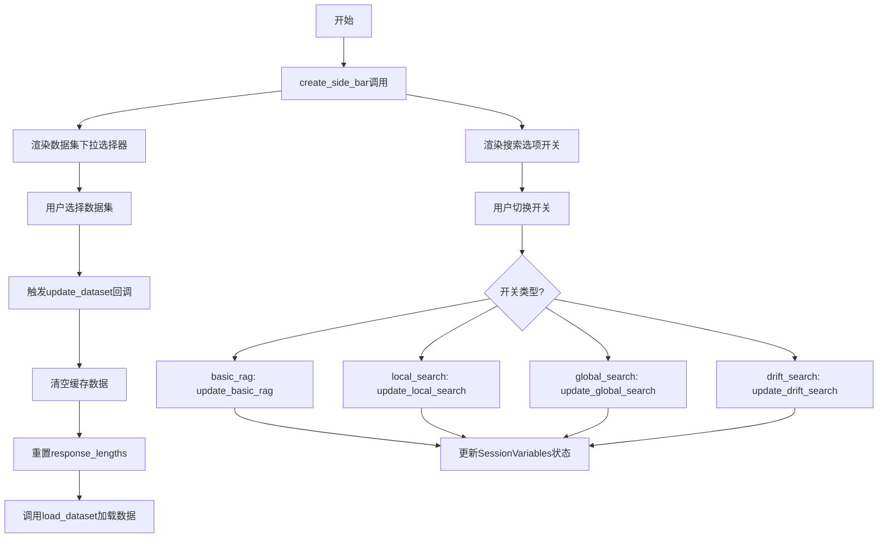
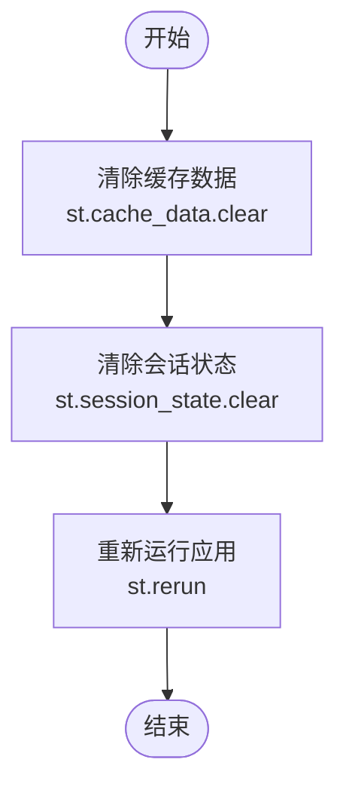
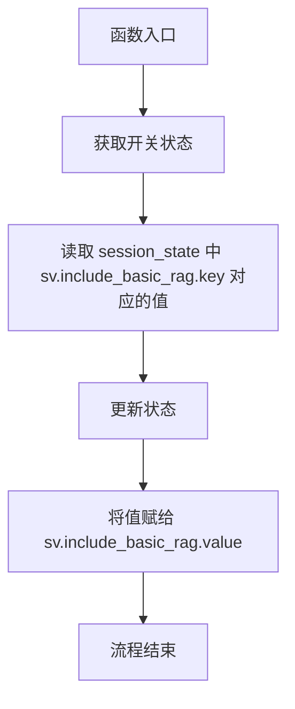
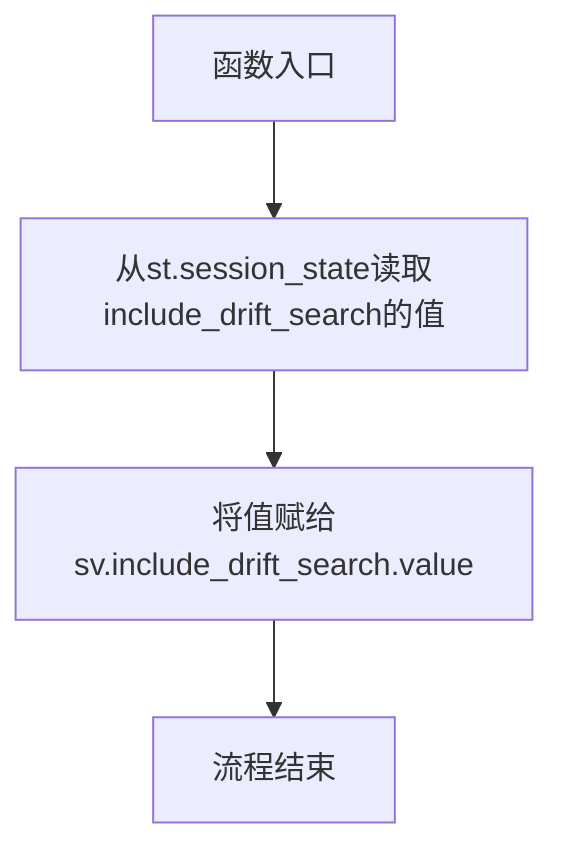
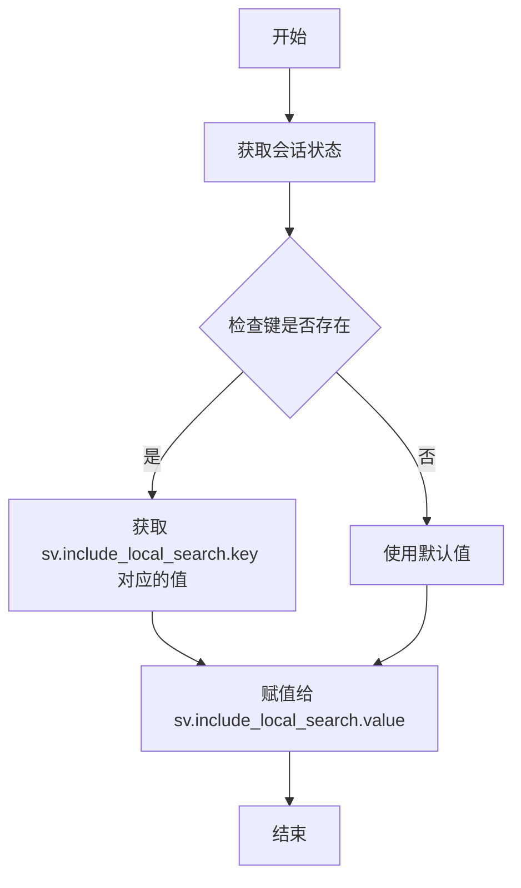
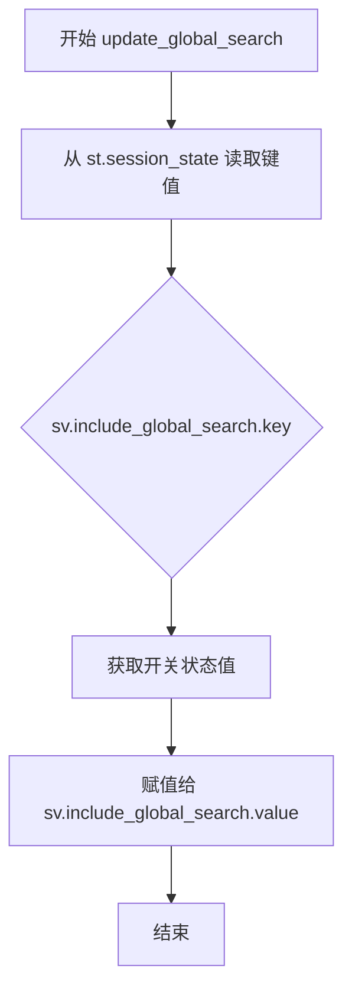
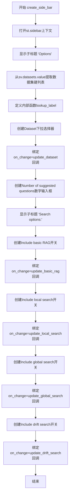
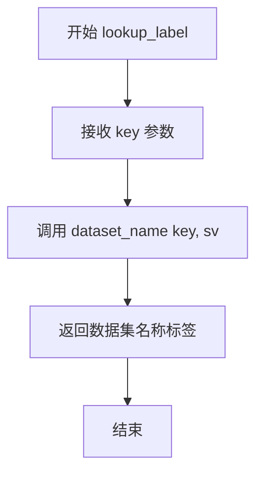

# `graphrag\unified-search-app\app\ui\sidebar.py` 详细设计文档

Sidebar模块，提供Streamlit应用的用户界面控件，用于数据集选择、搜索选项配置（基础RAG、本地搜索、全局搜索、漂移搜索）以及应用重置功能，通过SessionVariables管理应用状态。

## 整体流程



## 类结构

```
sidebar.py (功能模块)
├── reset_app (全局函数)
├── update_dataset (全局函数)
├── update_basic_rag (全局函数)
├── update_drift_search (全局函数)
├── update_local_search (全局函数)
├── update_global_search (全局函数)
├── create_side_bar (主函数)
└── lookup_label (内部函数)
```

## 全局变量及字段


### `st`
    
Streamlit库模块，用于构建Web UI

类型：`module`
    


### `dataset_name`
    
从app_logic模块导入的函数，用于获取数据集的显示名称

类型：`function`
    


### `load_dataset`
    
从app_logic模块导入的函数，用于加载数据集

类型：`function`
    


### `SessionVariables`
    
从state.session_variables模块导入的类，用于管理会话状态变量

类型：`class`
    


### `全局函数参数.sv`
    
会话变量对象，用于管理应用的配置状态

类型：`SessionVariables`
    


### `update_dataset函数局部变量.value`
    
从session_state中获取的选中的数据集键值

类型：`str`
    


### `create_side_bar函数局部变量.options`
    
可用数据集键的列表，用于填充下拉选择框

类型：`list[str]`
    


### `lookup_label函数参数.key`
    
数据集的键值，用于查找对应的显示标签

类型：`str`
    
    

## 全局函数及方法


### `reset_app`

该函数用于将 Streamlit 应用程序重置到其初始状态，清除所有缓存数据和会话状态，并重新运行应用程序。

参数：none

返回值：`None`，无返回值

#### 流程图



#### 带注释源码

```python
def reset_app():
    """重置应用到初始状态。
    
    该函数执行以下操作：
    1. 清除所有缓存的数据
    2. 清除所有会话状态变量
    3. 重新运行 Streamlit 应用
    """
    # 清除 Streamlit 的数据缓存，防止旧数据影响重新初始化
    st.cache_data.clear()
    
    # 清除所有会话状态变量，包括用户选择、数据加载状态等
    st.session_state.clear()
    
    # 触发 Streamlit 应用重新运行，以反映重置后的状态
    st.rerun()
```


### `update_dataset`

该函数用于从下拉菜单更新数据集，清除缓存并重新加载选定的数据集到应用程序中。

参数：

- `sv`：`SessionVariables`，会话变量对象，用于管理应用程序的状态，包括数据集键、缓存配置等

返回值：`None`，该函数不返回任何值，仅执行状态更新和数据加载操作

#### 流程图

```mermaid
flowchart TD
    A[开始 update_dataset] --> B[获取选定的数据集值]
    B --> C[value = st.session_state[sv.dataset.key]
    C --> D[清除 Streamlit 数据缓存]
    D --> E{response_lengths 是否存在}
    E -->|是| F[清空 response_lengths 列表]
    E -->|否| G[初始化空列表]
    F --> H[调用 load_dataset 加载数据]
    G --> H
    H --> I[结束]
```

#### 带注释源码

```python
def update_dataset(sv: SessionVariables):
    """Update dataset from the dropdown."""
    # 从 session_state 获取用户通过下拉菜单选择的数据集键值
    value = st.session_state[sv.dataset.key]
    
    # 清除 Streamlit 的数据缓存，确保加载新数据时不受旧缓存影响
    st.cache_data.clear()
    
    # 检查 response_lengths 是否已存在于 session_state 中
    if "response_lengths" not in st.session_state:
        # 如果不存在，初始化为空列表
        st.session_state.response_lengths = []
    
    # 清空 response_lengths 列表，为加载新数据集做准备
    st.session_state.response_lengths = []
    
    # 调用 load_dataset 函数，将选定的数据集加载到应用程序中
    load_dataset(value, sv)
```


### `update_basic_rag`

该函数用于更新 Basic RAG 开关的状态。当用户在侧边栏切换 "Include basic RAG" 选项时，通过 session_state 获取当前开关状态，并将其同步到 SessionVariables 对象的 `include_basic_rag` 属性中。

参数：

- `sv`：`SessionVariables`，会话变量对象，包含应用的所有配置状态

返回值：`None`，无返回值（隐式返回 None）

#### 流程图



#### 带注释源码

```python
def update_basic_rag(sv: SessionVariables):
    """Update basic rag state."""
    # 从 Streamlit 的 session_state 中获取开关的当前状态
    # sv.include_basic_rag.key 是存储在 session_state 中的键名
    # st.session_state[sv.include_basic_rag.key] 返回布尔值（True 或 False）
    sv.include_basic_rag.value = st.session_state[sv.include_basic_rag.key]
```


### `update_drift_search`

更新drift搜索模块的启用状态，通过读取Streamlit会话状态中的值并同步到SessionVariables对象中。

参数：

- `sv`：`SessionVariables`，会话变量对象，用于存储应用的状态信息，包含`include_drift_search`属性

返回值：`None`，无返回值，仅修改对象状态

#### 流程图



#### 带注释源码

```
def update_drift_search(sv: SessionVariables):
    """Update drift rag state."""
    # 从Streamlit的session_state中获取include_drift_search开关的当前状态
    # st.session_state是一个字典，存储了所有UI组件的状态值
    # sv.include_drift_search.key是预先定义的键名，用于在session_state中查找对应的值
    sv.include_drift_search.value = st.session_state[sv.include_drift_search.key]
```


### `update_local_search`

更新本地 RAG（检索增强生成）搜索选项的状态，将 Streamlit 会话状态中的值同步到会话变量对象中。

参数：

- `sv`：`SessionVariables`，会话变量对象，用于管理应用的配置状态，包含各种搜索选项的开关状态

返回值：`None`，该函数不返回任何值，仅执行状态更新操作

#### 流程图



#### 带注释源码

```python
def update_local_search(sv: SessionVariables):
    """Update local rag state."""
    # 从 Streamlit 会话状态中获取当前 UI 开关的状态值
    # sv.include_local_search.key 是该控件在 session_state 中的键名
    st_session_value = st.session_state[sv.include_local_search.key]
    
    # 将 UI 状态同步到会话变量对象中
    # 这样应用的其他部分可以通过 sv.include_local_search.value 访问最新的开关状态
    sv.include_local_search.value = st_session_value
```


### `update_global_search`

更新全局搜索（Global RAG）的开关状态，将 Streamlit 会话状态中的全局搜索选项同步到应用程序的状态管理器中。

参数：

- `sv`：`SessionVariables`，会话状态变量对象，用于管理应用程序的配置状态，通过 `sv.include_global_search.key` 获取对应的 session_state 键名

返回值：`None`，该函数无返回值，直接修改传入的 `SessionVariables` 对象的 `include_global_search.value` 属性

#### 流程图



#### 带注释源码

```python
def update_global_search(sv: SessionVariables):
    """Update global rag state."""
    # 从 Streamlit 的 session_state 中读取全局搜索开关的状态
    # sv.include_global_search.key 是 session_state 中存储该选项的键名
    # st.session_state 是一个字典，存储页面级别的状态数据
    sv.include_global_search.value = st.session_state[sv.include_global_search.key]
```


### `create_side_bar`

该函数用于在Streamlit应用的侧边栏中创建交互式控件面板，包括数据集下拉选择器、建议问题数量输入框以及多个搜索选项开关（basic RAG、local search、global search、drift search），并为每个控件绑定相应的状态更新回调函数。

参数：

-  `sv`：`SessionVariables`，会话状态管理对象，用于访问和存储应用配置

返回值：`None`，该函数无返回值，通过修改Streamlit UI组件和session_state产生副作用

#### 流程图



#### 带注释源码

```python
def create_side_bar(sv: SessionVariables):
    """Create a side bar panel.."""
    # 使用Streamlit的sidebar上下文管理器，在应用侧边栏创建UI控件
    with st.sidebar:
        # 添加"Options"子标题
        st.subheader("Options")

        # 从sv.datasets.value中提取所有数据集的key，组成选项列表
        options = [d.key for d in sv.datasets.value]

        # 定义内部函数lookup_label，用于将数据集key格式化为显示标签
        def lookup_label(key: str):
            return dataset_name(key, sv)

        # 创建数据集下拉选择器
        # key: 指定session_state中存储值的键名
        # on_change: 当值改变时触发的回调函数
        # kwargs: 传递给回调函数的额外参数
        # format_func: 用于格式化显示选项的函数
        st.selectbox(
            "Dataset",
            key=sv.dataset.key,
            on_change=update_dataset,
            kwargs={"sv": sv},
            options=options,
            format_func=lookup_label,
        )
        
        # 创建建议问题数量的数字输入框
        # min_value/max_value: 限制输入范围为1-100
        # step: 每次增减的步长为1
        st.number_input(
            "Number of suggested questions",
            key=sv.suggested_questions.key,
            min_value=1,
            max_value=100,
            step=1,
        )
        
        # 添加搜索选项子标题
        st.subheader("Search options:")
        
        # 创建Include basic RAG开关，绑定状态更新回调
        st.toggle(
            "Include basic RAG",
            key=sv.include_basic_rag.key,
            on_change=update_basic_rag,
            kwargs={"sv": sv},
        )
        
        # 创建Include local search开关
        st.toggle(
            "Include local search",
            key=sv.include_local_search.key,
            on_change=update_local_search,
            kwargs={"sv": sv},
        )
        
        # 创建Include global search开关
        st.toggle(
            "Include global search",
            key=sv.include_global_search.key,
            on_change=update_global_search,
            kwargs={"sv": sv},
        )
        
        # 创建Include drift search开关
        st.toggle(
            "Include drift search",
            key=sv.include_drift_search.key,
            on_change=update_drift_search,
            kwargs={"sv": sv},
        )
```


### `lookup_label`

`lookup_label` 是一个嵌套在 `create_side_bar` 函数内部的局部函数，用于将数据集中的键值转换为其对应的显示标签（数据集名称）。它通过调用 `dataset_name` 函数并传入键和会话变量来获取人类可读的名称，主要供 Streamlit 的 `st.selectbox` 组件的 `format_func` 参数使用，以在下拉菜单中显示友好的数据集名称而非原始键值。

参数：

- `key`：`str`，需要查询标签的数据集键值

返回值：未知（取决于 `dataset_name` 函数的返回类型，但通常为 `str`），返回给定键对应的数据集显示名称

#### 流程图



#### 带注释源码

```python
def lookup_label(key: str):
    """根据给定的键值查找并返回对应的数据集显示名称。
    
    这是一个局部函数，定义在 create_side_bar 函数内部。
    它通过闭包访问 sv (SessionVariables) 对象。
    
    参数:
        key: str - 数据集的键值，用于在数据集中查找对应的名称
        
    返回:
        返回 dataset_name 函数的结果，通常是数据集的显示名称字符串
    """
    return dataset_name(key, sv)
```

## 关键组件


### Streamlit会话状态管理

通过`SessionVariables`类管理应用状态，包括数据集选择、搜索选项开关等，使用`st.session_state`存储和访问状态值，实现前端UI与后端逻辑的状态同步。

### 侧边栏UI组件创建

使用Streamlit的`st.sidebar`上下文创建侧边栏面板，包含`st.selectbox`、`st.number_input`、`st.toggle`等输入组件，每个组件绑定`on_change`回调函数实现响应式状态更新。

### 回调函数状态更新机制

通过`update_dataset`、`update_basic_rag`、`update_drift_search`、`update_local_search`、`update_global_search`等函数，将UI组件的状态变化同步到`SessionVariables`对象，实现配置变更的响应式处理。

### 数据集加载与缓存管理

`update_dataset`函数调用`load_dataset`加载数据，使用`st.cache_data.clear()`清除缓存确保数据新鲜，同时重置`response_lengths`会话变量维护数据一致性。

### 应用重置功能

`reset_app`函数通过`st.cache_data.clear()`、`st.session_state.clear()`和`st.rerun()`三重操作实现应用完全重置，返回初始状态。


## 问题及建议


### 已知问题

-   **硬编码的状态键**：`"response_lengths"` 作为字符串硬编码在代码中，容易产生拼写错误且难以维护，应提取为常量或配置
-   **重复代码模式**：`update_basic_rag`、`update_drift_search`、`update_local_search`、`update_global_search` 四个函数逻辑几乎完全相同，仅更新的属性不同，可合并为通用函数
-   **缓存清除策略粗粒度**：每次更新数据集都调用 `st.cache_data.clear()` 清除所有缓存，可能影响应用中其他组件的性能
-   **缺少错误处理**：`load_dataset(value, sv)` 调用没有 try-except 包装，加载失败会导致应用崩溃
- **副作用过载**：update 函数同时承担了读取 session_state 和更新 SessionVariables 对象两个职责，违反了单一职责原则，不利于单元测试
- **模块耦合度高**：sidebar 模块直接导入并调用 `app_logic` 模块的 `dataset_name` 和 `load_dataset`，应通过接口或依赖注入解耦
- **SessionVariables 依赖未验证**：代码直接访问 `sv.datasets.value`、`sv.dataset.key` 等属性，未检查属性是否存在或有效，可能导致运行时 AttributeError
- **magic numbers**：`min_value=1, max_value=100` 应提取为配置常量，避免未来调整时修改多处

### 优化建议

-   抽取 `"response_lengths"` 为常量或纳入 SessionVariables 管理
-   创建通用的 `update_flag(sv: SessionVariables, flag: SessionVariable)` 函数来合并重复的 update 函数
-   考虑按数据集名称构建缓存键，实现细粒度缓存清除
-   为 `load_dataset` 调用添加异常处理和用户友好的错误提示
-   分离读取 session_state 和更新 SessionVariables 的逻辑，或采用观察者模式
-   引入依赖注入或抽象接口，降低 sidebar 模块与 app_logic 的耦合
-   在访问 SessionVariables 属性前增加存在性检查或使用 Optional 类型
-   将数字输入的边界值提取为配置常量，如 `DEFAULT_MIN_QUESTIONS = 1`, `DEFAULT_MAX_QUESTIONS = 100`

## 其它


### 设计目标与约束

本模块作为Streamlit应用的UI侧边栏组件，目标是提供一个直观的配置界面，使用户能够选择数据集、设置建议问题数量，以及开关各种RAG搜索选项（basic、local、global、drift）。设计约束包括：依赖Streamlit框架、依赖SessionVariables进行状态管理、依赖app_logic模块的dataset_name和load_dataset函数。

### 错误处理与异常设计

本模块主要通过Streamlit的控件回调机制处理用户交互。当update_dataset被触发时，若load_dataset(value, sv)抛出异常，Streamlit会显示错误信息。代码中未显式捕获异常，建议在load_dataset调用处添加try-except块处理数据集加载失败的情况。当会话状态中不存在response_lengths时，代码会初始化为空列表，这是对状态不一致性的隐式处理。

### 数据流与状态机

数据流方向为：用户通过侧边栏控件输入 → 触发on_change回调 → 更新SessionVariables对象的value属性 → 其他模块读取SessionVariables获取配置。具体状态转换：dataset变更时清除缓存并重置response_lengths；toggle变更时直接更新对应的include_xxx_search标志位。状态存储在st.session_state中，SessionVariables作为包装器提供类型安全的访问接口。

### 外部依赖与接口契约

本模块依赖三个外部组件：1) streamlit库用于UI控件创建；2) app_logic模块的dataset_name(key, sv)函数，接收数据集键和SessionVariables对象，返回数据集显示名称；3) app_logic模块的load_dataset(value, sv)函数，接收选中的数据集值和SessionVariables对象，无返回值；4) state.session_variables模块的SessionVariables类，提供数据集列表和各项配置键值管理。

### 安全性考虑

代码中直接使用st.session_state[sv.dataset.key]获取用户输入，未进行输入验证。若sv.dataset.key被外部恶意篡改，可能导致安全问题。建议在update_dataset中添加对value参数的类型和范围校验。此外，st.cache_data.clear()清除所有缓存数据，可能影响其他用户的缓存数据（多用户场景下），需评估是否需要更细粒度的缓存管理。

### 性能考虑

每次数据集变更都会调用st.cache_data.clear()清除所有缓存，这可能导致性能问题，因为其他不相关的数据也会被清除。建议改为使用st.cache_data.clear弹性的参数或st.cache_data.clear特定键值。create_side_bar中每次调用都会重新创建所有控件，当侧边栏频繁重新渲染时可能导致UI闪烁，建议使用st.fragment或streamlit >= 1.23的session state优化技术。

### 可测试性

当前模块的可测试性较低，因为直接依赖st.session_state和Streamlit控件。建议将update_dataset、update_basic_rag等更新逻辑抽取为纯函数，接收参数而非直接读取st.session_state，便于单元测试。对于create_side_bar，由于其副作用较多，建议拆分为UI构建逻辑和状态更新逻辑两部分，分别进行测试。

### 日志与监控

代码中缺少日志记录语句。建议在reset_app、update_dataset等关键函数中添加日志，记录用户操作（如选择了哪个数据集、启用了哪些搜索选项），便于问题排查和用户行为分析。可以使用Python标准库logging模块，在函数入口处记录INFO级别日志，在异常处理处记录ERROR级别日志。

### 配置管理

模块中的硬编码字符串（如"Options"、"Dataset"、"Search options:"）不符合配置管理最佳实践。建议将这些UI文本提取到独立的配置文件或常量定义中，便于后续国际化或主题定制。控件的默认值（如suggested_questions的min_value=1, max_value=100）也应通过配置文件或环境变量管理。

### 版本兼容性

代码使用了st.rerun()（Streamlit 1.23+）、st.toggle()（Streamlit 1.27+）和st.cache_data（早期版本为st.cache），需确保部署环境的Streamlit版本 >= 1.27。建议在requirements.txt或setup.py中明确声明最低Streamlit版本要求，避免运行时兼容性问题。


    