# `jieba\jieba\__init__.py` 详细设计文档

这是一个中文分词库（jieba）的核心模块，提供了基于前缀词典和隐马尔可夫模型的中文分词功能，支持精确模式、全模式、搜索引擎模式分词，以及用户自定义词典和并行分词。

## 整体流程

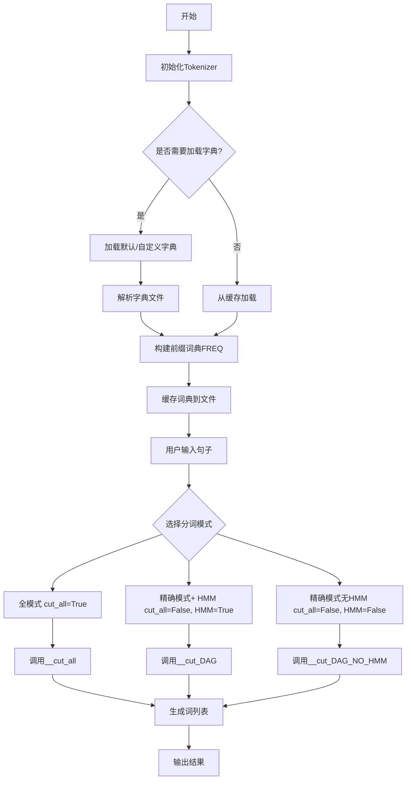

## 类结构

```
Tokenizer (分词器类)
├── gen_pfdict (静态方法: 解析字典文件)
├── initialize (初始化方法)
├── check_initialized (检查初始化)
├── calc (计算最佳分词路径)
├── get_DAG (构建有向无环图)
├── __cut_all (全模式分词)
├── __cut_DAG_NO_HMM (精确模式无HMM)
├── __cut_DAG (精确模式+ HMM)
├── cut (主分词方法)
├── cut_for_search (搜索引擎分词)
├── lcut / lcut_for_search (返回列表的分词)
├── _lcut_* (内部返回列表方法)
├── load_userdict (加载用户字典)
├── add_word / del_word (增删词汇)
├── suggest_freq (建议词频)
├── tokenize (分词并返回位置)
└── set_dictionary (设置字典路径)
```

## 全局变量及字段


### `__version__`
    
版本号，当前值为 '0.42.1'

类型：`str`
    


### `__license__`
    
许可证类型，当前值为 'MIT'

类型：`str`
    


### `DEFAULT_DICT`
    
默认字典路径，初始化为 None，实际使用时会设置为内置字典

类型：`NoneType`
    


### `DEFAULT_DICT_NAME`
    
默认字典文件名，为 'dict.txt'

类型：`str`
    


### `log_console`
    
日志控制台处理器，用于将日志输出到 stderr

类型：`logging.StreamHandler`
    


### `default_logger`
    
默认日志记录器，用于输出调试信息

类型：`logging.Logger`
    


### `DICT_WRITING`
    
字典写入锁字典，用于管理字典文件的并发写入

类型：`dict`
    


### `pool`
    
多进程池，用于并行分词（初始化为 None，调用 enable_parallel 后变为 Pool 实例）

类型：`NoneType/multiprocessing.Pool`
    


### `re_userdict`
    
用户词典正则表达式，用于解析用户词典条目

类型：`re.Pattern`
    


### `re_eng`
    
英文正则表达式，用于匹配英文字母和数字

类型：`re.Pattern`
    


### `re_han_default`
    
中文汉字正则表达式，用于匹配中文字符

类型：`re.Pattern`
    


### `re_skip_default`
    
跳过正则表达式，用于匹配空白字符

类型：`re.Pattern`
    


### `dt`
    
默认的分词器实例

类型：`Tokenizer`
    


### `_get_abs_path`
    
获取绝对路径的 lambda 函数

类型：`function`
    


### `Tokenizer.dictionary`
    
字典文件路径

类型：`str`
    


### `Tokenizer.lock`
    
线程锁，用于保证初始化过程的线程安全

类型：`threading.RLock`
    


### `Tokenizer.FREQ`
    
词频字典，存储词语及其出现频率

类型：`dict`
    


### `Tokenizer.total`
    
总词频，所有词语频率的总和

类型：`int`
    


### `Tokenizer.user_word_tag_tab`
    
用户词性表，存储用户添加词语的词性

类型：`dict`
    


### `Tokenizer.initialized`
    
初始化标志，表示分词器是否已初始化

类型：`bool`
    


### `Tokenizer.tmp_dir`
    
临时目录，用于存放缓存文件

类型：`str`
    


### `Tokenizer.cache_file`
    
缓存文件路径

类型：`str`
    
    

## 全局函数及方法


### `setLogLevel`

设置默认日志器的日志级别。

参数：
- `log_level`：`int`，日志级别（如 `logging.DEBUG`、`logging.INFO`、`logging.WARNING`、`logging.ERROR`、`logging.CRITICAL` 等）

返回值：`None`，无返回值

#### 流程图

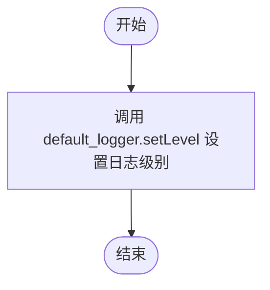

#### 带注释源码

```python
def setLogLevel(log_level):
    """
    设置默认日志器的日志级别。
    
    参数:
        log_level: int, 日志级别（如logging.DEBUG、logging.INFO等）
    """
    default_logger.setLevel(log_level)  # 调用 logging 模块的 Logger 对象的 setLevel 方法
```


### `enable_parallel`

该函数用于启用 jieba 分词模块的并行模式，将默认的串行分词函数替换为支持多进程并行处理的版本，从而提升大规模文本分词的执行效率。

参数：

- `processnum`：`int` 或 `None`，指定并行处理的进程数量，默认为 `None`，即自动使用 CPU 核心数

返回值：`None`，该函数无返回值，通过修改全局函数指针实现并行分词

#### 流程图

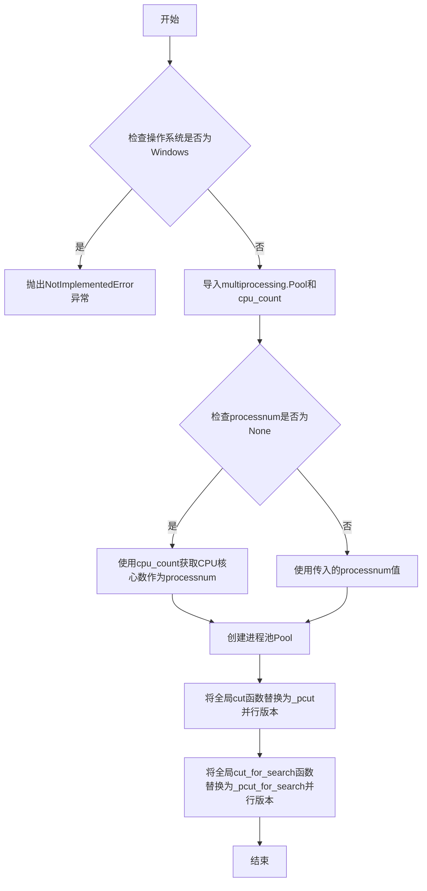

#### 带注释源码

```python
def enable_parallel(processnum=None):
    """
    Change the module's `cut` and `cut_for_search` functions to the
    parallel version.

    Note that this only works using dt, custom Tokenizer
    instances are not supported.
    """
    # 声明修改全局变量：pool进程池、dt默认分词器、cut和cut_for_search函数
    global pool, dt, cut, cut_for_search
    # 从multiprocessing模块导入cpu_count函数，用于获取CPU核心数
    from multiprocessing import cpu_count
    # 检查当前操作系统类型，Windows系统不支持此并行功能
    if os.name == 'nt':
        # 抛出未实现错误，提醒用户仅支持POSIX系统
        raise NotImplementedError(
            "jieba: parallel mode only supports posix system")
    else:
        # 导入multiprocessing的Pool类，用于创建进程池
        from multiprocessing import Pool
    # 确保默认分词器已初始化
    dt.check_initialized()
    # 如果未指定进程数，则使用CPU核心数作为默认进程数
    if processnum is None:
        processnum = cpu_count()
    # 创建进程池实例，指定并行进程数量
    pool = Pool(processnum)
    # 将全局cut函数替换为并行版本_pcut
    cut = _pcut
    # 将全局cut_for_search函数替换为并行版本_pcut_for_search
    cut_for_search = _pcut_for_search
```


### `disable_parallel`

该函数用于禁用jieba分词库的并行模式，将全局的`cut`和`cut_for_search`函数恢复为默认的单线程版本，关闭并清理进程池资源。

参数：无

返回值：`None`，无返回值描述

#### 流程图

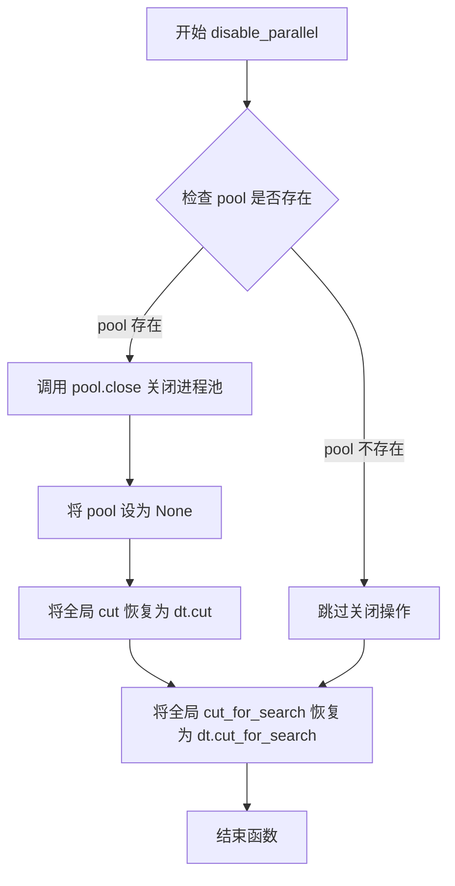

#### 带注释源码

```python
def disable_parallel():
    """
    禁用并行模式，将cut和cut_for_search函数恢复为Tokenizer实例的默认方法。
    同时关闭并清理进程池资源。
    """
    # 声明使用全局变量，以便修改模块级别的变量
    global pool, dt, cut, cut_for_search
    
    # 检查进程池是否存在（即并行模式是否已启用）
    if pool:
        # 关闭进程池，释放资源
        pool.close()
        # 将pool变量置为None，表示并行模式已禁用
        pool = None
    
    # 恢复全局cut函数为Tokenizer实例的cut方法
    cut = dt.cut
    
    # 恢复全局cut_for_search函数为Tokenizer实例的cut_for_search方法
    cut_for_search = dt.cut_for_search
```


### `_pcut`

`_pcut` 是 jieba 分词库的并行分词函数，通过多进程方式将句子按行分割后并行执行分词操作，支持精确模式、全模式和 HMM 三种分词模式，并使用生成器方式逐个返回分词结果。

参数：

- `sentence`：`str`，需要分词的输入句子
- `cut_all`：`bool`，是否使用全模式分词，默认为 False（精确模式）
- `HMM`：`bool`，是否使用隐马尔可夫模型，默认为 True

返回值：`generator`，分词结果生成器，逐个产出分词后的词语

#### 流程图

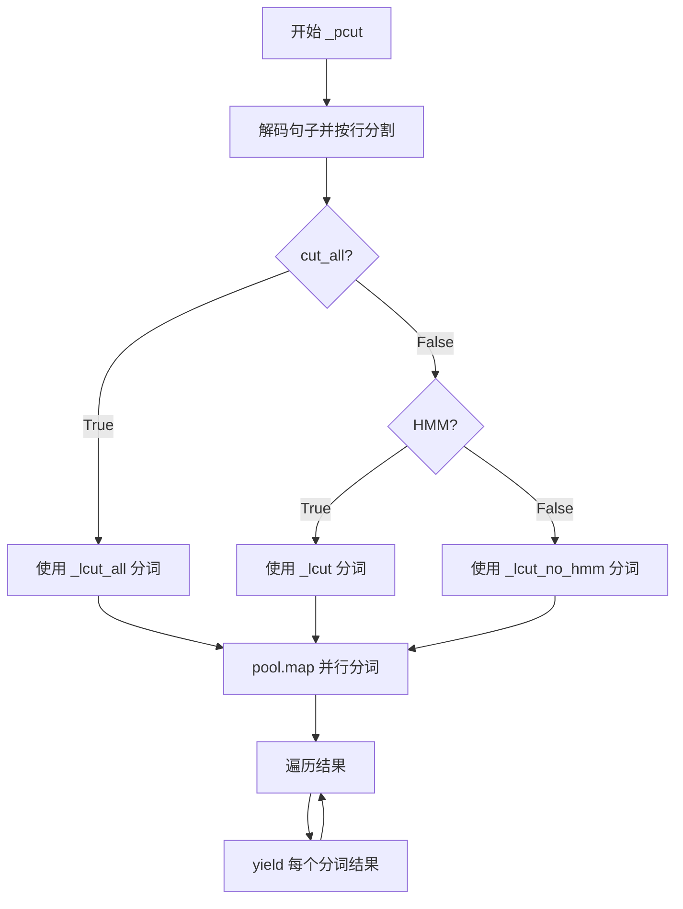

#### 带注释源码

```python
def _pcut(sentence, cut_all=False, HMM=True):
    """
    并行分词函数
    
    参数:
        sentence: 需要分词的句子
        cut_all: 是否全模式分词
        HMM: 是否使用HMM模型
    """
    # 将输入句子解码并按行分割，保留行尾符号
    parts = strdecode(sentence).splitlines(True)
    
    # 根据分词模式选择对应的分词函数
    if cut_all:
        # 全模式：输出所有可能的词语组合
        result = pool.map(_lcut_all, parts)
    elif HMM:
        # 精确模式 + HMM：使用隐马尔可夫模型进行新词发现
        result = pool.map(_lcut, parts)
    else:
        # 精确模式但不使用HMM
        result = pool.map(_lcut_no_hmm, parts)
    
    # 遍历多进程池的执行结果，平铺所有分词结果
    for r in result:
        for w in r:
            # 使用 yield 实现生成器，节省内存
            yield w
```

#### 关键组件信息

- `pool`：全局多进程池对象，由 `enable_parallel()` 函数初始化
- `strdecode`：来自 `._compat` 模块的字符串解码函数
- `_lcut`, `_lcut_all`, `_lcut_no_hmm`：三种不同模式的分词函数

#### 潜在的技术债务或优化空间

1. **Windows 兼容性**：`enable_parallel()` 在 Windows 上会抛出 `NotImplementedError`，导致 `_pcut` 无法在 Windows 平台使用
2. **全局状态依赖**：函数依赖全局变量 `pool`，如果未调用 `enable_parallel()` 直接调用 `_pcut` 会导致 `NameError`
3. **缺乏错误处理**：未对 `sentence` 为空、线程池异常等情况进行处理
4. **内存使用**：使用 `splitlines(True)` 会保留行尾符，可能导致额外的内存开销

#### 其它项目

- **设计目标**：通过多进程并行化提升大规模文本分词的性能
- **约束条件**：仅在 POSIX 系统（Linux/macOS）下可用，需要 `multiprocessing` 模块支持
- **外部依赖**：依赖 `multiprocessing.Pool` 和 `._compat.strdecode`
- **调用路径**：用户通过 `jieba.enable_parallel()` 激活并行模式后，`dt.cut` 会被替换为 `_pcut`


### `_pcut_for_search`

这是一个并行版本的 `cut_for_search` 函数，用于在多进程环境下对文本进行更细粒度的分词，适用于搜索引擎场景。它接受一个句子和HMM参数，将句子分割成多行，利用进程池并行执行分词，最后合并所有结果。

参数：

- `sentence`：`str`，需要分词的句子文本
- `HMM`：`bool`，是否使用隐马尔科夫模型进行分词，默认为 `True`

返回值：`generator`，生成器，逐个产出分词后的词语

#### 流程图

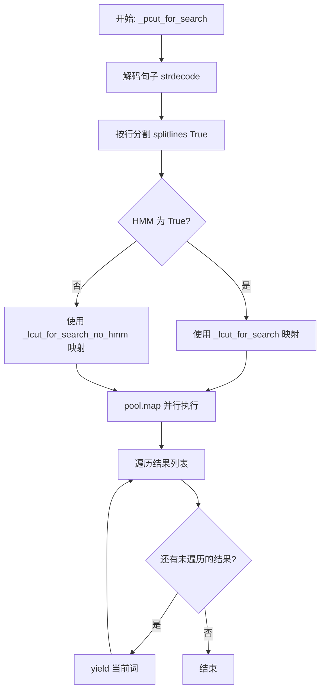

#### 带注释源码

```python
def _pcut_for_search(sentence, HMM=True):
    """
    并行版本的 cut_for_search，用于搜索引擎的细粒度分词。
    
    参数:
        sentence: 要分词的句子字符串
        HMM: 是否使用隐马尔可夫模型，默认为 True
    
    返回:
        生成器，产出分词后的词语
    """
    # 将句子解码为统一编码格式
    parts = strdecode(sentence).splitlines(True)
    
    # 根据 HMM 参数选择使用哪种分词方法
    if HMM:
        # 使用带 HMM 的 lcut_for_search 进行并行处理
        result = pool.map(_lcut_for_search, parts)
    else:
        # 使用不带 HMM 的 lcut_for_search_no_hmm 进行并行处理
        result = pool.map(_lcut_for_search_no_hmm, parts)
    
    # 遍历所有并行分词结果，合并为一个生成器
    for r in result:
        for w in r:
            # 逐个产出分词结果
            yield w
```


### `Tokenizer._lcut_all`

该方法是 `Tokenizer` 类的实例方法，用于对句子进行全模式分词（cut_all=True），返回分词结果的列表形式。它内部调用 `lcut` 方法并传入 `cut_all=True` 参数。

参数：

- `sentence`：`str`，需要分词的输入句子

返回值：`list`，分词后的词语列表

#### 流程图

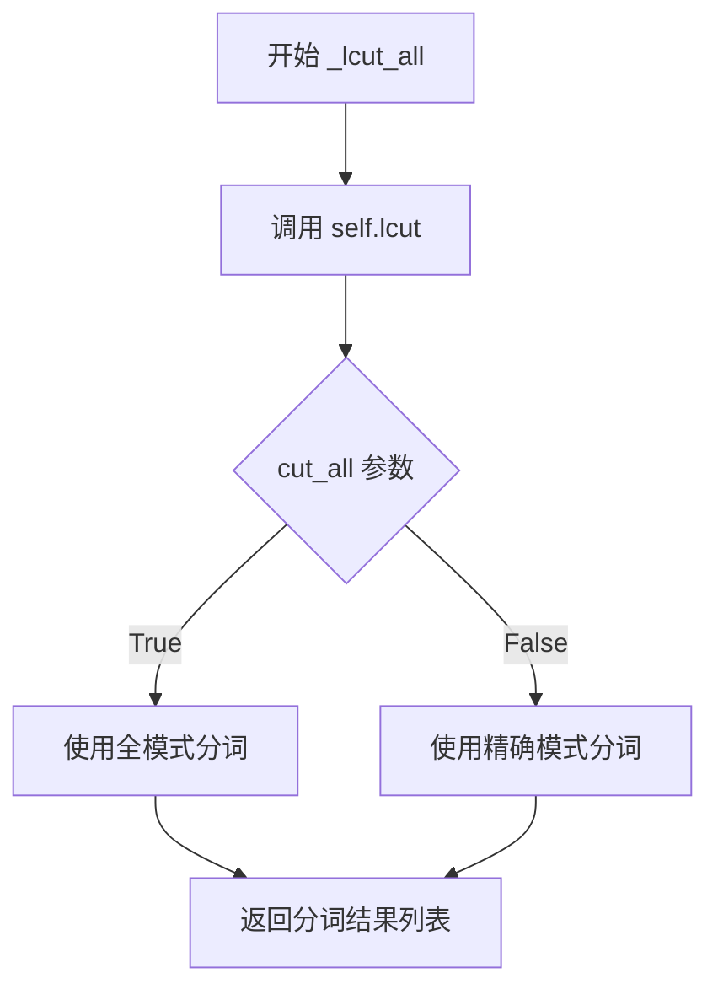

#### 带注释源码

```python
def _lcut_all(self, sentence):
    """
    对句子进行全模式分词，返回列表形式的结果。
    
    参数:
        sentence: str, 要分词的句子
        
    返回:
        list: 分词后的词语列表
    """
    return self.lcut(sentence, True)
```

---

### `_lcut_all`（模块级函数）

该模块级函数是 `Tokenizer` 实例 `dt` 的 `_lcut_all` 方法的包装器，提供全局函数接口供外部调用。

参数：

- `s`：`str`，需要分词的输入句子

返回值：`list`，分词后的词语列表

#### 流程图

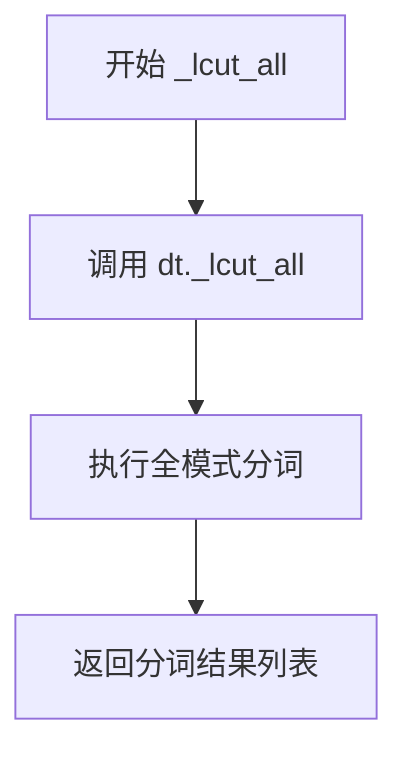

#### 带注释源码

```python
def _lcut_all(s):
    """
    全局函数形式的全模式分词接口。
    
    参数:
        s: str, 要分词的句子
        
    返回:
        list: 分词后的词语列表
    """
    return dt._lcut_all(s)
```


### `Tokenizer._lcut`

该方法是 `Tokenizer` 类的实例方法，作为 `lcut` 方法的内部实现封装，直接调用 `lcut` 方法并返回列表形式的结果。用于将分词器对文本的分割结果直接以列表形式输出，避免使用生成器。

参数：

- `*args`：可变位置参数，传递给 `self.cut` 方法，用于指定待分词的文本及其他分词参数（如 `cut_all`、`HMM`、`use_paddle`）
- `**kwargs`：可变关键字参数，传递给 `self.cut` 方法，用于指定分词选项

返回值：`list`，返回分词后的词语列表

#### 流程图

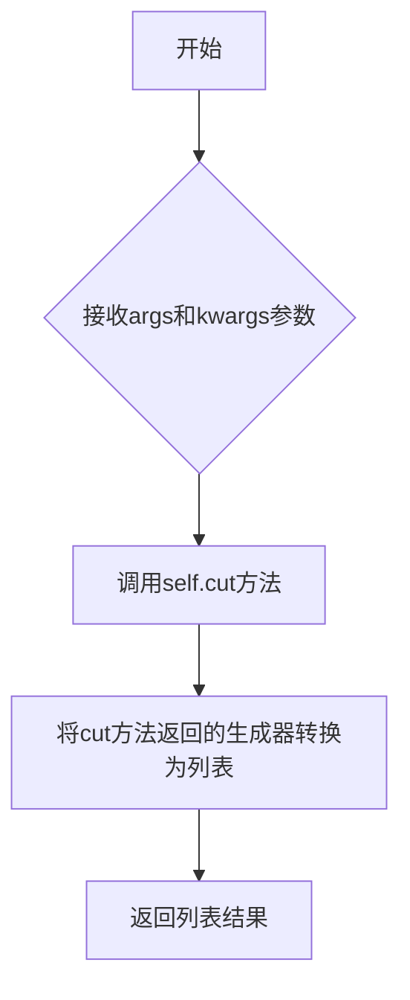

#### 带注释源码

```python
def _lcut(self, *args, **kwargs):
    """
    内部方法，将cut方法返回的生成器转换为列表。
    
    参数:
        *args: 可变位置参数，传递给self.cut方法
        **kwargs: 可变关键字参数，传递给self.cut方法
    
    返回值:
        list: 分词结果列表
    """
    # 调用lcut方法（实际调用self.cut并转换为列表）
    return self.lcut(*args, **kwargs)
```


### `Tokenizer._lcut_no_hmm`

该方法是 `Tokenizer` 类的私有方法，用于对句子进行不分词（不使用 HMM 模型）的精确模式分词，直接调用 `lcut` 方法并显式关闭 HMM 模式和全模式，返回分词结果列表。

参数：

- `self`：`Tokenizer` 实例，隐式参数，代表当前分词器对象
- `sentence`：`str`，需要分词的中文（或中英混合）句子字符串

返回值：`list`，分词后的词语列表

#### 流程图

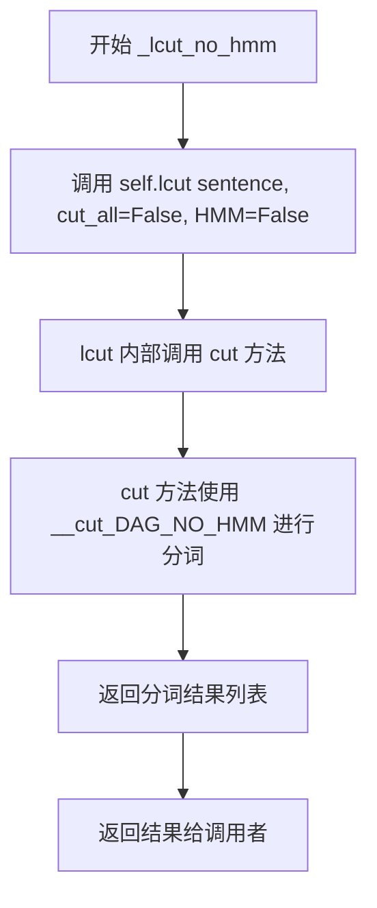

#### 带注释源码

```python
def _lcut_no_hmm(self, sentence):
    """
    对句子进行分词，不使用 HMM 模型。
    
    该方法是 lcut 的封装，内部调用 lcut(sentence, cut_all=False, HMM=False)。
    - cut_all=False 表示使用精确模式分词
    - HMM=False 表示不使用隐马尔可夫模型（用于处理未登录词）
    
    参数:
        self: Tokenizer 实例
        sentence: str, 要分词的句子
    
    返回:
        list: 分词后的词语列表
    """
    # 调用 lcut 方法，参数说明：
    # sentence: 要分词的句子
    # False: cut_all 参数，表示不使用全模式（精确模式）
    # False: HMM 参数，表示不使用隐马尔可夫模型
    return self.lcut(sentence, False, False)
```


### `Tokenizer._lcut_for_search`

该方法是 jieba 分词库中用于搜索引擎的细粒度分词功能，它接收句子并返回分词结果列表（而非生成器），内部通过 `cut_for_search` 方法对句子进行更细致的分词，生成二元语法和三元语法片段以提升搜索召回率。

参数：

- `self`：`Tokenizer` 对象，jieba 分词器实例
- `*args, **kwargs`：可变参数，实际接收参数同 `cut_for_search`

返回值：`list`，分词后的词语列表

#### 流程图

```mermaid
flowchart TD
    A[开始] --> B[调用 cut_for_search 方法获取分词生成器]
    B --> C{遍历每个分词结果 w}
    C --> D{w 长度 > 2?}
    D -->|是| E[遍历 w 的所有起始位置 i]
    E --> F[取 w[i:i+2] 二元语法 gram2]
    F --> G{gram2 在 FREQ 词典中?}
    G -->|是| H[yield gram2]
    G -->|否| I[继续下一个位置]
    H --> I
    E --> I
    D --> J{w 长度 > 3?}
    J -->|是| K[遍历 w 的所有起始位置 i]
    K --> L[取 w[i:i+3] 三元语法 gram3]
    L --> M{gram3 在 FREQ 词典中?}
    M -->|是| N[yield gram3]
    M -->|否| O[继续下一个位置]
    N --> O
    K --> O
    J --> P{yield w 单词本身}
    D -->|否| P
    P --> Q{还有更多分词结果?}
    Q -->|是| C
    Q -->|否| R[将生成器转为列表返回]
    R --> S[结束]
```

#### 带注释源码

```python
def lcut_for_search(self, *args, **kwargs):
    """
    将 cut_for_search 的生成器结果转换为列表返回
    """
    return list(self.cut_for_search(*args, **kwargs))


# 模块级函数，实际调用 dt 实例的方法
def _lcut_for_search(s):
    return dt._lcut_for_search(s)


# 核心的分词方法（供上面调用）
def cut_for_search(self, sentence, HMM=True):
    """
    为搜索引擎提供的更细粒度分词方法。
    除了返回原始分词结果外，还会提取二元语法和三元语法，
    以提高搜索引擎的召回率。

    参数:
        - sentence: str，需要分词的句子
        - HMM: bool，是否使用隐马尔可夫模型进行新词发现

    返回:
        - 生成器 yield 各个分词结果
    """
    # 首先调用标准的 cut 方法进行基础分词
    words = self.cut(sentence, HMM=HMM)
    for w in words:
        # 如果词长度大于2，提取所有可能的二元语法
        if len(w) > 2:
            for i in xrange(len(w) - 1):
                gram2 = w[i:i + 2]
                # 仅当二元语法存在于词典中时才输出
                if self.FREQ.get(gram2):
                    yield gram2

        # 如果词长度大于3，提取所有可能的三元语法
        if len(w) > 3:
            for i in xrange(len(w) - 2):
                gram3 = w[i:i + 3]
                # 仅当三元语法存在于词典中时才输出
                if self.FREQ.get(gram3):
                    yield gram3

        # 最后输出原始单词
        yield w
```


### Tokenizer._lcut_for_search_no_hmm

该方法是 `Tokenizer` 类的成员方法，用于执行不带隐马尔可夫模型（HMM）的搜索引擎细粒度分词，并返回列表结果。它是 `_lcut_for_search` 的无HMM版本，通过调用 `lcut_for_search` 方法并传入 `HMM=False` 参数来实现。

参数：

-  `self`：`Tokenizer` 对象，调用该方法的实例本身
-  `sentence`：待分词的字符串（str/unicode），需要分词的文本输入

返回值：`list`，分词结果列表，包含按搜索引擎优化方式切分后的词汇列表

#### 流程图

```mermaid
flowchart TD
    A[开始 _lcut_for_search_no_hmm] --> B[调用 lcut_for_search with HMM=False]
    B --> C[调用 cut_for_search 方法]
    C --> D[调用 cut 方法进行基础分词<br/>参数 HMM=False]
    D --> E{遍历每个分词结果 w}
    E -->|len[w] > 2| F[生成2-gram词组]
    F --> G{检查2-gram是否在FREQ词典中}
    G -->|是| H[yield 2-gram]
    G -->|否| I[继续]
    E -->|len[w] > 3| J[生成3-gram词组]
    J --> K{检查3-gram是否在FREQ词典中}
    K -->|是| L[yield 3-gram]
    K -->|否| M[继续]
    E --> N[yield 原始词 w]
    N --> O{遍历结束?}
    O -->|否| E
    O -->|是| P[将结果转换为list]
    P --> Q[返回分词结果列表]
```

#### 带注释源码

```python
def _lcut_for_search_no_hmm(self, sentence):
    """
    执行不带HMM的搜索引擎细粒度分词并返回列表
    
    参数:
        sentence: 待分词的字符串
    
    返回:
        分词结果列表
    """
    # 调用 lcut_for_search 方法，传入 HMM=False 参数
    # lcut_for_search 内部会调用 cut_for_search 并将结果转换为list
    return self.lcut_for_search(sentence, False)


# 相关的 lcut_for_search 方法
def lcut_for_search(self, *args, **kwargs):
    """将 cut_for_search 结果转换为列表返回"""
    return list(self.cut_for_search(*args, **kwargs))


# 相关的 cut_for_search 方法
def cut_for_search(self, sentence, HMM=True):
    """
    搜索引擎用的更细粒度分词
    
    参数:
        sentence: 待分词字符串
        HMM: 是否使用隐马尔可夫模型，默认为True
    
    生成:
        词汇生成器，包括2-gram、3-gram和原词
    """
    # 调用 cut 方法获取基础分词结果
    words = self.cut(sentence, HMM=HMM)
    
    # 遍历每个分词结果
    for w in words:
        # 对于长度大于2的词，生成2-gram
        if len(w) > 2:
            for i in xrange(len(w) - 1):
                gram2 = w[i:i + 2]
                # 检查2-gram是否在词频词典中
                if self.FREQ.get(gram2):
                    yield gram2
        
        # 对于长度大于3的词，生成3-gram
        if len(w) > 3:
            for i in xrange(len(w) - 2):
                gram3 = w[i:i + 3]
                # 检查3-gram是否在词频词典中
                if self.FREQ.get(gram3):
                    yield gram3
        
        # 最后输出原始词
        yield w
```


### Tokenizer.cut

该方法是结巴分词库的核心分词函数，负责将包含中文字符的句子分割成独立的词语。它支持多种分词模式（精确模式、全模式）、隐马尔可夫模型（HMM）处理未登录词，以及PaddlePaddle深度学习模型支持。

参数：

- `self`：`Tokenizer` 对象，分词器实例本身
- `sentence`：`str` 或 `unicode`，需要分词的输入文本
- `cut_all`：`bool`，分词模式，True 表示全模式（所有可能的词语组合），False 表示精确模式（默认）
- `HMM`：`bool`，是否使用隐马尔可夫模型处理未登录词，默认为 True
- `use_paddle`：`bool`，是否使用 PaddlePaddle 深度学习模型进行分词，默认为 False

返回值：`generator`，生成器类型，返回分词后的词语列表

#### 流程图

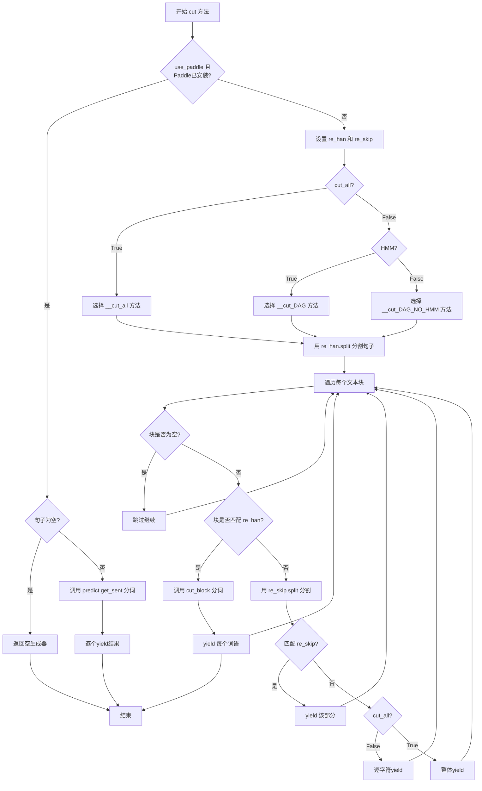

#### 带注释源码

```python
def cut(self, sentence, cut_all=False, HMM=True, use_paddle=False):
    """
    The main function that segments an entire sentence that contains
    Chinese characters into separated words.

    Parameter:
        - sentence: The str(unicode) to be segmented.
        - cut_all: Model type. True for full pattern, False for accurate pattern.
        - HMM: Whether to use the Hidden Markov Model.
    """
    # 检查 PaddlePaddle 是否已安装
    is_paddle_installed = check_paddle_install['is_paddle_installed']
    # 对输入句子进行解码，确保编码正确
    sentence = strdecode(sentence)
    
    # 如果启用 Paddle 且已安装 Paddle
    if use_paddle and is_paddle_installed:
        # 如果句子为空，返回空生成器（避免 Paddle 抛出异常）
        if sentence is None or len(sentence) == 0:
            return
        # 导入 Paddle 预测模块
        import jieba.lac_small.predict as predict
        # 获取分词结果
        results = predict.get_sent(sentence)
        # 逐个 yield 分词结果，过滤 None 值
        for sent in results:
            if sent is None:
                continue
            yield sent
        return
    
    # 设置正则表达式：re_han 用于匹配中文混合内容，re_skip 用于匹配跳过内容
    re_han = re_han_default
    re_skip = re_skip_default
    
    # 根据参数选择不同的分词核心方法
    if cut_all:
        # 全模式：返回所有可能的词语组合
        cut_block = self.__cut_all
    elif HMM:
        # 精确模式 + HMM：使用隐马尔可夫模型处理未登录词
        cut_block = self.__cut_DAG
    else:
        # 精确模式不使用 HMM：仅使用字典分词
        cut_block = self.__cut_DAG_NO_HMM
    
    # 使用 re_han 正则表达式分割句子（按中文字符混合串分割）
    blocks = re_han.split(sentence)
    
    # 遍历分割后的每个文本块
    for blk in blocks:
        # 跳过空块
        if not blk:
            continue
        
        # 如果块匹配 re_han（包含中文字符），调用核心分词方法
        if re_han.match(blk):
            for word in cut_block(blk):
                yield word
        else:
            # 否则按 re_skip（空白字符等）进一步分割
            tmp = re_skip.split(blk)
            for x in tmp:
                # 如果匹配 re_skip，直接 yield（保留标点等）
                if re_skip.match(x):
                    yield x
                # 非全模式下，英文数字等逐字符输出
                elif not cut_all:
                    for xx in x:
                        yield xx
                # 全模式下整体输出
                else:
                    yield x
```


### `Tokenizer.lcut`

该方法是 `Tokenizer` 类的成员方法，用于将分词结果（生成器）转换为列表形式返回。它是对 `cut` 方法的封装，方便需要列表类型返回值的场景。

参数：

- `*args`：可变位置参数，会透传给 `cut` 方法
- `**kwargs`：可变关键字参数，会透传给 `cut` 方法

返回值：`list`，分词后的词语列表

#### 流程图

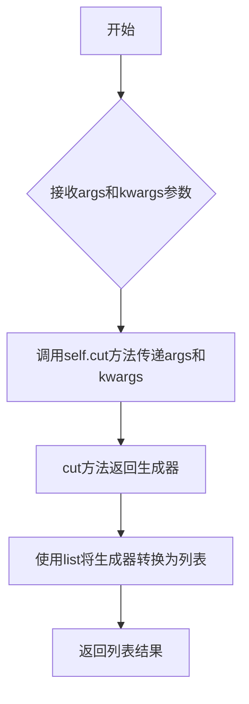

#### 带注释源码

```python
def lcut(self, *args, **kwargs):
    """
    将分词结果转换为列表返回
    
    参数:
        *args: 可变位置参数，传递给self.cut方法
        **kwargs: 可变关键字参数，传递给self.cut方法
    
    返回值:
        list: 分词后的词语列表
    """
    return list(self.cut(*args, **kwargs))
```


### `Tokenizer.cut_for_search`

该方法是 jieba 分词库中用于对句子进行搜索引擎优化的细粒度分词方法。它在基础分词结果的基础上，进一步提取二元语法（bigram）和三元语法（trigram）组合，以提升搜索召回率，适用于搜索引擎索引构建场景。

参数：

- `sentence`：`str`，需要细粒度分词的中文句子（Unicode 字符串）
- `HMM`：`bool`，是否使用隐马尔可夫模型进行基础分词，默认为 True

返回值：`generator`，生成器，逐个产出分词结果（包括原始词及符合条件的二元、三元语法组合）

#### 流程图

```mermaid
flowchart TD
    A[开始 cut_for_search] --> B[调用 self.cut 基础分词]
    B --> C{遍历分词结果 words}
    C -->|取下一个词 w| D{len w > 2?}
    D -->|是| E[遍历 w 的位置 i]
    E --> F[提取二元语法 gram2 = w[i:i+2]]
    F --> G{self.FREQ.get gram2 存在?}
    G -->|是| H[yield gram2]
    G -->|否| I[继续下一个位置]
    I --> E
    E --> J{遍历完所有位置?}
    J -->|否| E
    J -->|是| K{len w > 3?}
    D -->|否| K
    K -->|是| L[遍历 w 的位置 i]
    L --> M[提取三元语法 gram3 = w[i:i+3]]
    M --> N{self.FREQ.get gram3 存在?}
    N -->|是| O[yield gram3]
    N -->|否| P[继续下一个位置]
    P --> L
    L --> Q{遍历完所有位置?}
    Q -->|否| L
    Q -->|是| R[yield w 原始词]
    K -->|否| R
    O --> R
    H --> R
    R --> C
    C -->|遍历完毕| S[结束]
```

#### 带注释源码

```python
def cut_for_search(self, sentence, HMM=True):
    """
    Finer segmentation for search engines.
    
    该方法在基础分词结果之上，进一步提取二元语法和三元语法组合，
    以提供更细粒度的分词结果，适用于搜索引擎建立索引的场景。
    
    参数:
        sentence: 需要进行细粒度分词的中文句子
        HMM: 是否使用隐马尔可夫模型进行基础分词，默认为 True
    
    生成器产出:
        基础分词结果中的词，以及符合条件的二元语法和三元语法组合
    """
    # Step 1: 调用基础分词方法获取初步分词结果
    # 使用 cut 方法进行初次分词，HMM 参数控制是否使用隐马尔可夫模型
    words = self.cut(sentence, HMM=HMM)
    
    # Step 2: 遍历每个分词结果，进行细粒度处理
    for w in words:
        # Step 3: 提取二元语法（bigram）
        # 当词长度大于 2 时，遍历所有可能的位置组合
        if len(w) > 2:
            for i in xrange(len(w) - 1):
                # 提取从位置 i 开始的连续两个字符
                gram2 = w[i:i + 2]
                # 检查该二元语法是否在词典中（存在于 FREQ 字典）
                if self.FREQ.get(gram2):
                    # 如果存在，则产出该二元语法
                    yield gram2
        
        # Step 4: 提取三元语法（trigram）
        # 当词长度大于 3 时，遍历所有可能的位置组合
        if len(w) > 3:
            for i in xrange(len(w) - 2):
                # 提取从位置 i 开始的连续三个字符
                gram3 = w[i:i + 3]
                # 检查该三元语法是否在词典中
                if self.FREQ.get(gram3):
                    # 如果存在，则产出该三元语法
                    yield gram3
        
        # Step 5: 最后产出原始分词结果
        # 无论是否提取了 n-gram，都需要产出原始的词
        yield w
```


### `Tokenizer.lcut_for_search`

该方法是 `Tokenizer` 类的成员方法，用于对句子进行搜索引擎友好的分词，并返回列表形式的结果。它首先调用 `cut_for_search` 方法获取生成器，然后将其转换为列表返回。相比基础分词，该方法会额外输出文本中的二元组和三元组，以提高搜索覆盖率。

参数：

- `*args`：可变位置参数，传递给 `cut_for_search` 方法，通常包括分词句子
- `**kwargs`：可变关键字参数，传递给 `cut_for_search` 方法，通常包括 `HMM` 参数

返回值：`list`，返回分词后的词语列表，包含原始词语以及从长词中提取的二元组和三元组

#### 流程图

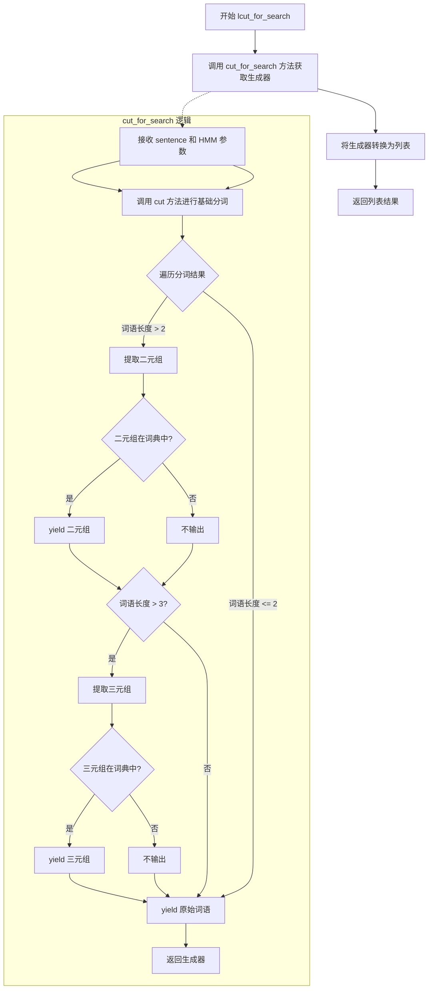

#### 带注释源码

```python
def lcut_for_search(self, *args, **kwargs):
    """
    返回列表形式的搜索引擎分词结果。
    该方法是 cut_for_search 的包装器，将生成器结果转换为列表。
    
    参数:
        *args: 可变位置参数，传递给 cut_for_search 方法
        **kwargs: 可变关键字参数，传递给 cut_for_search 方法
    
    返回值:
        list: 分词后的词语列表，包含原始词语及提取的二元组、三元组
    """
    # 调用 cut_for_search 方法获取分词生成器，然后转换为列表返回
    # cut_for_search 方法会：
    # 1. 先进行基础分词（调用 cut 方法）
    # 2. 对每个长度 > 2 的词，提取所有存在的二元组
    # 3. 对每个长度 > 3 的词，提取所有存在的三元组
    # 4. 最后输出原始词语
    return list(self.cut_for_search(*args, **kwargs))
```


### Tokenizer.add_word

向词典中添加一个新词或更新现有词的词频。

参数：

- `word`：`str`，要添加的词语，必须为非空字符串
- `freq`：`int` 或 `None`，词频。如果为 `None`，则通过 `suggest_freq` 自动计算一个确保该词能被切分出来的频率值
- `tag`：`str` 或 `None`，词语的词性标签（如 "n" 表示名词，"v" 表示动词等），可省略

返回值：`None`，无返回值，该方法直接修改实例的内部状态

#### 流程图

```mermaid
flowchart TD
    A[add_word 调用] --> B{self.check_initialized}
    B -->|未初始化| C[调用 initialize 方法]
    B -->|已初始化| D[strdecode word]
    C --> D
    D --> E{freq is not None}
    E -->|是| F[freq = int(freq)]
    E -->|否| G[freq = self.suggest_freq]
    F --> H[写入 self.FREQ[word] = freq]
    G --> H
    H --> I[self.total += freq]
    I --> J{tag is not None}
    J -->|是| K[写入 self.user_word_tag_tab[word] = tag]
    J -->|否| L[遍历 word 的每个字符]
    K --> L
    L --> M[取前缀 wfrag = word[:ch+1]]
    M --> N{wfrag not in FREQ}
    N -->|是| O[self.FREQ[wfrag] = 0]
    N -->|否| P{循环结束}
    O --> P
    P --> Q{freq == 0}
    Q -->|是| R[finalseg.add_force_split word]
    Q -->|否| S[结束]
    R --> S
```

#### 带注释源码

```python
def add_word(self, word, freq=None, tag=None):
    """
    Add a word to dictionary.

    freq and tag can be omitted, freq defaults to be a calculated value
    that ensures the word can be cut out.
    """
    # 确保分词器已初始化，若未初始化则先初始化词典
    self.check_initialized()
    # 将 word 转换为系统兼容的字符串格式（处理编码问题）
    word = strdecode(word)
    # 如果未提供 freq，则使用 suggest_freq 自动计算一个合适的词频
    # 确保该词在分词时能被正确识别为一个完整的词语
    freq = int(freq) if freq is not None else self.suggest_freq(word, False)
    # 将词语及其词频添加到词频字典 FREQ 中
    self.FREQ[word] = freq
    # 更新总词频计数
    self.total += freq
    # 如果提供了词性标签，则记录到词性标签表中
    if tag:
        self.user_word_tag_tab[word] = tag
    # 遍历词语的每个前缀字符，将不存在的前缀加入词典
    # 这是为了维护前缀词典的完整性，支持最长匹配算法
    for ch in xrange(len(word)):
        wfrag = word[:ch + 1]
        if wfrag not in self.FREQ:
            self.FREQ[wfrag] = 0
    # 如果词频为 0，表示该词应被强制拆分（不作为一个整体出现）
    # 调用 finalseg 模块的 add_force_split 进行强制分词标记
    if freq == 0:
        finalseg.add_force_split(word)
```


### `Tokenizer.del_word`

删除字典中的指定词汇，通过将其词频设置为0来实现。

参数：

- `word`：`str`，要删除的词汇

返回值：`None`，无返回值

#### 流程图

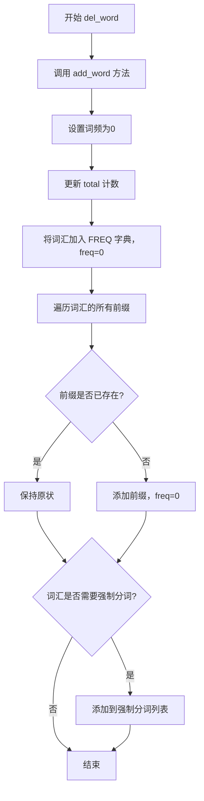

#### 带注释源码

```python
def del_word(self, word):
    """
    Convenient function for deleting a word.
    删除字典中指定词汇的便捷方法
    
    该方法实际上是通过将词频设置为0来实现删除效果，
    这样可以保持词典结构的完整性，同时让该词不会被分词出来
    """
    self.add_word(word, 0)  # 调用 add_word，传入 freq=0 表示删除该词
```


### `get_FREQ`

获取默认分词器词典中指定词条的频率值。

参数：

- `k`：任意类型，字典的键（词条）
- `d`：任意类型（默认为None），当键不存在时返回的默认值

返回值：任意类型，返回词典中键`k`对应的频率值，如果键不存在则返回默认值`d`。

#### 流程图

```mermaid
flowchart TD
    A[开始] --> B{检查dt.FREQ中是否存在键k}
    B -->|是| C[返回dt.FREQ[k]]
    B -->|否| D[返回默认值d]
    C --> E[结束]
    D --> E
```

#### 带注释源码

```
get_FREQ = lambda k, d=None: dt.FREQ.get(k, d)
# get_FREQ: 全局函数，用于获取默认Tokenizer实例dt的FREQ字典中指定词条的频率
# 参数k: 要查询的词条（键）
# 参数d: 默认值，当词条不存在时返回，默认为None
# 返回值: 词条对应的频率值，若词条不存在则返回默认值d
# 实际调用dt.FREQ.get(k, d)方法，从Tokenizer的词频字典中获取值
```


### `Tokenizer.calc`

该方法使用动态规划算法，基于词频的对数概率计算句子分词的最佳路径。通过从句子末尾向前遍历，对每个位置的所有可能词组合计算最大概率路径，从而确定最优的分词方案。

参数：

- `sentence`：`str`，要分词的句子
- `DAG`：`dict`，有向无环图，表示句子中每个位置开始的可能的词结束位置列表
- `route`：`dict`，用于存储计算出的最佳路径结果，键为位置索引，值为(对数概率, 上一词结束位置)的元组

返回值：`None`（结果通过修改 `route` 字典参数输出）

#### 流程图

```mermaid
flowchart TD
    A[开始 calc] --> B[获取句子长度N]
    B --> C[初始化route[N] = (0, 0)]
    C --> D[计算logtotal = logself.total]
    D --> E{idx从N-1遍历到0}
    E --> F[对DAGidx中的每个x计算]
    F --> G[计算对数概率: logFREQget或1 - logtotal + route[x+1][0]]
    G --> H[选择最大概率的x作为routeidx]
    H --> E
    E --> I[结束]
```

#### 带注释源码

```python
def calc(self, sentence, DAG, route):
    """
    使用动态规划计算句子分词的最佳路径
    
    参数:
        sentence: 要分词的句子字符串
        DAG: 有向无环图，每个位置索引对应的可能词结束位置列表
        route: 用于存储最佳路径的字典，结果为(对数概率, 上一词结束位置)
    """
    # 获取句子长度
    N = len(sentence)
    
    # 初始化最后一个位置，概率为0
    route[N] = (0, 0)
    
    # 计算词频总数对数，用于归一化概率
    logtotal = log(self.total)
    
    # 从句子末尾向前遍历，使用动态规划计算最佳路径
    for idx in xrange(N - 1, -1, -1):
        # 对当前idx位置的所有可能词结束位置x，计算最大概率路径
        # 公式: log(P(word)) + route[x+1].prob
        # 即: log(FREQ[word]/total) + next_prob
        # 等价于: log(FREQ[word] or 1) - logtotal + route[x+1][0]
        route[idx] = max((
            # 计算当前词的对数概率
            log(self.FREQ.get(sentence[idx:x + 1]) or 1) - 
            logtotal + 
            # 加上从下一位置开始的最优路径概率
            route[x + 1][0], 
            # 记录到达位置x
            x
        ) for x in DAG[idx])
```


### `Tokenizer.get_DAG`

该函数用于构建句子的有向无环图（Directed Acyclic Graph, DAG），是jieba分词的核心算法之一。它通过查找词典中存在的词组，确定句子中每个字符位置可能作为词语结束的位置，为后续的最大概率分词提供图结构支持。

参数：

- `sentence`：`str`，需要分词的中文句子字符串

返回值：`dict`，返回有向无环图，键为起始位置索引，值为该起始位置对应的所有可能结束位置索引列表

#### 流程图

```mermaid
flowchart TD
    A[开始 get_DAG] --> B[check_initialized 检查初始化]
    B --> C[创建空DAG字典<br/>N = len(sentence)]
    C --> D{k &lt; N}
    D -->|是| E[创建空tmplist<br/>i = k<br/>frag = sentence[k]]
    D -->|否| I[返回DAG]
    E --> F{i &lt; N 且 frag 在 FREQ 中}
    F -->|是| G{FREQ[frag] 非零}
    F -->|否| H{not tmplist}
    G -->|是| G1[tmplist.append(i)]
    G -->|否| G2[不添加]
    G1 --> G2 --> G3[i += 1<br/>frag = sentence[k:i+1]]
    G3 --> F
    H -->|是| H1[tmplist.append(k)]
    H -->|否| I1[DAG[k] = tmplist]
    H1 --> I1
    I1 --> D
```

#### 带注释源码

```python
def get_DAG(self, sentence):
    """
    构建句子的有向无环图（DAG）
    
    参数:
        sentence: 待分词的句子字符串
    
    返回:
        dict: DAG字典，键为起始位置，值为可能结束位置列表
    """
    # 确保词典已初始化，若未初始化则先初始化
    self.check_initialized()
    
    # 初始化DAG字典，用于存储每个位置的可能结束位置
    DAG = {}
    # 获取句子长度
    N = len(sentence)
    
    # 遍历句子的每个字符位置作为起始位置
    for k in xrange(N):
        # 临时列表，存储当前位置k对应的所有可能结束位置
        tmplist = []
        # i为当前检查的结束位置
        i = k
        # frag为从位置k开始到当前位置i的子串
        frag = sentence[k]
        
        # 持续向后扩展子串，直到超出句子长度或子串不在词典中
        while i < N and frag in self.FREQ:
            # 如果该词在词典中的频率大于0，则记录为一个可能的结束位置
            if self.FREQ[frag]:
                tmplist.append(i)
            # 继续向后扩展一个字符
            i += 1
            frag = sentence[k:i + 1]
        
        # 如果没有找到任何可能的词（tmplist为空），则当前位置只能作为单字存在
        if not tmplist:
            tmplist.append(k)
        
        # 将位置k的可能结束位置列表存入DAG
        DAG[k] = tmplist
    
    # 返回构建完成的有向无环图
    return DAG
```


### `Tokenizer.get_dict_file`

该方法用于获取词典文件对象，根据当前设置的字典路径返回对应的文件资源。如果是默认词典，则从模块资源中获取；否则打开自定义词典文件。

参数：

- `self`：`Tokenizer` 实例本身，无需显式传递

返回值：`file`（文件对象），返回可用于读取词频词典的文件对象。如果使用默认词典，返回模块内置资源；如果使用自定义词典，返回打开的文件对象。

#### 流程图

```mermaid
flowchart TD
    A[开始] --> B{self.dictionary == DEFAULT_DICT?}
    B -->|是| C[调用 get_module_res(DEFAULT_DICT_NAME)]
    C --> D[返回模块资源文件对象]
    B -->|否| E[以二进制模式打开 self.dictionary]
    E --> F[返回文件对象]
    D --> G[结束]
    F --> G
```

#### 带注释源码

```python
def get_dict_file(self):
    """
    获取词典文件对象。
    
    根据字典类型返回对应的文件资源：
    - 默认词典：从模块资源中获取
    - 自定义词典：打开指定路径的文件
    
    返回值：
        file: 词典文件对象，用于读取词频信息
    """
    # 判断是否为默认词典
    if self.dictionary == DEFAULT_DICT:
        # 从模块资源中获取默认词典文件对象
        return get_module_res(DEFAULT_DICT_NAME)
    else:
        # 打开自定义词典文件，以二进制读取模式
        return open(self.dictionary, 'rb')
```


### `Tokenizer.initialize`

该方法用于初始化分词器词典，根据传入的字典路径加载词典文件并构建前缀词典（FREQ和total）。方法首先检查是否已有缓存，若有则直接加载，否则重新构建词典并序列化缓存，同时处理多线程并发访问字典文件的情况。

参数：

- `dictionary`：`str` 或 `None`，可选参数，指定自定义词典路径。如果为 `None`，则使用默认词典（`DEFAULT_DICT`）

返回值：`None`，该方法无返回值，直接修改 `Tokenizer` 实例的内部状态

#### 流程图

```mermaid
flowchart TD
    A[开始 initialize] --> B{dictionary 是否为空?}
    B -->|是| C[abs_path = self.dictionary]
    B -->|否| D[计算 abs_path = _get_abs_path(dictionary)]
    D --> E{self.dictionary == abs_path<br/>且 self.initialized?}
    C --> E
    E -->|是| F[直接返回，不做任何操作]
    E -->|否| G[更新 self.dictionary<br/>设置 self.initialized = False]
    G --> H[获取锁 self.lock]
    H --> I{检查 DICT_WRITING[abs_path]}
    I --> J[尝试获取写锁]
    J --> K{再次检查 self.initialized?}
    K -->|是| F
    K -->|否| L{是否有缓存文件?}
    L -->|是且有效| M[从缓存加载 FREQ 和 total]
    L -->|否| N[构建缓存文件名]
    M --> O[load_from_cache_fail = False]
    N --> P[获取或创建写锁]
    O --> Q[load_from_cache_fail = True]
    P --> Q
    Q --> R{load_from_cache_fail?}
    R -->|否| S[设置 self.initialized = True]
    R -->|是| T[调用 gen_pfdict<br/>生成 FREQ 和 total]
    T --> U[写入缓存文件]
    U --> S
    S --> V[结束]
    F --> V
```

#### 带注释源码

```python
def initialize(self, dictionary=None):
    """
    初始化分词器词典，加载或构建前缀词典。
    
    参数:
        dictionary: 可选的自定义词典路径，若为None则使用默认词典
    """
    # 1. 处理字典路径
    if dictionary:
        abs_path = _get_abs_path(dictionary)
        # 如果路径相同且已初始化，则直接返回，避免重复加载
        if self.dictionary == abs_path and self.initialized:
            return
        else:
            self.dictionary = abs_path
            self.initialized = False
    else:
        abs_path = self.dictionary

    # 2. 使用锁保证线程安全
    with self.lock:
        # 尝试获取字典的写锁，防止并发写入
        try:
            with DICT_WRITING[abs_path]:
                pass
        except KeyError:
            pass
        
        # 双重检查：获取锁后再次确认是否已初始化
        if self.initialized:
            return

        # 3. 确定缓存文件名
        default_logger.debug("Building prefix dict from %s ..." % (abs_path or 'the default dictionary'))
        t1 = time.time()
        if self.cache_file:
            cache_file = self.cache_file
        # 默认词典使用固定的缓存文件名
        elif abs_path == DEFAULT_DICT:
            cache_file = "jieba.cache"
        # 自定义词典使用MD5生成唯一的缓存文件名
        else:
            cache_file = "jieba.u%s.cache" % md5(
                abs_path.encode('utf-8', 'replace')).hexdigest()
        
        # 拼接完整缓存路径
        cache_file = os.path.join(
            self.tmp_dir or tempfile.gettempdir(), cache_file)
        tmpdir = os.path.dirname(cache_file)

        # 4. 尝试从缓存加载
        load_from_cache_fail = True
        # 检查缓存文件是否存在，且比词典文件更新
        if os.path.isfile(cache_file) and (abs_path == DEFAULT_DICT or
                                           os.path.getmtime(cache_file) > os.path.getmtime(abs_path)):
            default_logger.debug(
                "Loading model from cache %s" % cache_file)
            try:
                with open(cache_file, 'rb') as cf:
                    # 使用marshal反序列化加载FREQ和total
                    self.FREQ, self.total = marshal.load(cf)
                load_from_cache_fail = False
            except Exception:
                # 加载失败，回退到重新构建
                load_from_cache_fail = True

        # 5. 缓存加载失败，重新构建词典
        if load_from_cache_fail:
            # 获取或创建该词典的写锁
            wlock = DICT_WRITING.get(abs_path, threading.RLock())
            DICT_WRITING[abs_path] = wlock
            with wlock:
                # 从词典文件生成前缀词典
                self.FREQ, self.total = self.gen_pfdict(self.get_dict_file())
                default_logger.debug(
                    "Dumping model to file cache %s" % cache_file)
                try:
                    # 使用临时文件写入，然后原子性移动（防止跨文件系统问题）
                    fd, fpath = tempfile.mkstemp(dir=tmpdir)
                    with os.fdopen(fd, 'wb') as temp_cache_file:
                        marshal.dump(
                            (self.FREQ, self.total), temp_cache_file)
                    _replace_file(fpath, cache_file)
                except Exception:
                    # 缓存写入失败不影响主流程，仅记录日志
                    default_logger.exception("Dump cache file failed.")

            # 清理写锁
            try:
                del DICT_WRITING[abs_path]
            except KeyError:
                pass

        # 6. 标记初始化完成
        self.initialized = True
        default_logger.debug(
            "Loading model cost %.3f seconds." % (time.time() - t1))
        default_logger.debug("Prefix dict has been built successfully.")
```


### `Tokenizer.load_userdict`

该方法用于加载用户自定义词典，以提升分词的准确率。支持从文件路径或文件类对象加载，文件格式为每行包含词语、频率和词性（词性可选），均采用 UTF-8 编码。

参数：

- `f`：`str` 或 `file-like object`，用户词典文件路径或文件对象，文件应为 UTF-8 编码的纯文本文件，每行格式为 "词语 频率 词性"（频率和词性可选）

返回值：`None`，无返回值，直接修改实例的 FREQ 词典和 user_word_tag_tab

#### 流程图

```mermaid
flowchart TD
    A[开始加载用户词典] --> B{检查是否已初始化}
    B -->|否| C[调用 check_initialized 初始化]
    B -->|是| D{判断 f 是否为字符串}
    D -->|是| E[获取文件路径 f_name, 以二进制模式打开文件]
    D -->|否| F[使用 resolve_filename 获取文件名]
    E --> G[遍历文件的每一行]
    F --> G
    G --> H{行是否为空}
    H -->|是| I[跳过当前行]
    H -->|否| J{行是否为文本类型}
    J -->|否| K[尝试用 UTF-8 解码并去除 BOM]
    J -->|是| L[正则匹配提取 word, freq, tag]
    K -->|失败| M[抛出 ValueError 异常]
    K -->|成功| L
    L --> N{频率和标签是否需要去除空白}
    N -->|是| O[去除 freq 和 tag 的空白字符]
    N -->|否| P[调用 add_word 方法添加词]
    O --> P
    P --> Q{是否还有下一行}
    Q -->|是| G
    Q -->|否| R[结束]
    I --> Q
    M --> R
```

#### 带注释源码

```python
def load_userdict(self, f):
    '''
    Load personalized dict to improve detect rate.

    Parameter:
        - f : A plain text file contains words and their ocurrences.
              Can be a file-like object, or the path of the dictionary file,
              whose encoding must be utf-8.

    Structure of dict file:
    word1 freq1 word_type1
    word2 freq2 word_type2
    ...
    Word type may be ignored
    '''
    # 确保分词器已初始化，如果未初始化会先加载默认词典
    self.check_initialized()
    
    # 判断输入是文件路径还是已打开的文件对象
    if isinstance(f, string_types):
        # 如果是字符串路径，记录文件名并以二进制模式打开
        f_name = f
        f = open(f, 'rb')
    else:
        # 如果是文件对象，通过 resolve_filename 获取文件名
        f_name = resolve_filename(f)
    
    # 遍历文件的每一行，逐行处理
    for lineno, ln in enumerate(f, 1):
        # 去除行首尾空白
        line = ln.strip()
        
        # 如果行不是文本类型（可能是字节串），尝试用 UTF-8 解码
        if not isinstance(line, text_type):
            try:
                # 解码并去除 UTF-8 BOM 标记
                line = line.decode('utf-8').lstrip('\ufeff')
            except UnicodeDecodeError:
                # 解码失败则抛出异常
                raise ValueError('dictionary file %s must be utf-8' % f_name)
        
        # 跳过空行
        if not line:
            continue
        
        # 使用正则表达式匹配行，提取词语、频率和词性
        # 匹配格式：word [freq] [tag]
        # match won't be None because there's at least one character
        word, freq, tag = re_userdict.match(line).groups()
        
        # 如果频率不为 None，去除前后空白
        if freq is not None:
            freq = freq.strip()
        
        # 如果词性不为 None，去除前后空白
        if tag is not None:
            tag = tag.strip()
        
        # 调用 add_word 方法将词添加到词典
        self.add_word(word, freq, tag)
```


### `Tokenizer.set_dictionary`

该方法用于设置自定义词典路径，重置分词器的初始化状态，使其在下次分词时加载新的词典文件。

参数：

- `dictionary_path`：`str`，词典文件的路径，可以是相对路径或绝对路径

返回值：`None`，该方法无返回值

#### 流程图

```mermaid
graph TD
    A[开始] --> B[获取锁 self.lock]
    B --> C[获取绝对路径 _get_abs_path(dictionary_path)]
    C --> D{检查文件是否存在}
    D -->|否| E[抛出 Exception 异常: jieba: file does not exist: abs_path]
    D -->|是| F[设置 self.dictionary = abs_path]
    F --> G[设置 self.initialized = False]
    G --> H[释放锁]
    H --> I[结束]
    E --> H
```

#### 带注释源码

```python
def set_dictionary(self, dictionary_path):
    """
    设置自定义词典路径，重置分词器以便加载新词典。
    
    参数:
        dictionary_path: 词典文件路径
    """
    # 获取锁，确保线程安全
    with self.lock:
        # 将输入的路径转换为绝对路径
        abs_path = _get_abs_path(dictionary_path)
        # 检查词典文件是否存在
        if not os.path.isfile(abs_path):
            # 文件不存在则抛出异常
            raise Exception("jieba: file does not exist: " + abs_path)
        # 更新分词器的词典路径
        self.dictionary = abs_path
        # 重置初始化标志为 False
        # 这样在下次分词时会重新加载词典
        self.initialized = False
```


### `Tokenizer.suggest_freq`

该方法用于根据给定的分词结果建议词频，可以强制将字符连接在一起或分开。当tune为True时，会将计算出的建议频率实际添加到词典中。

参数：

- `self`：`Tokenizer`实例，调用该方法的分词器对象本身
- `segment`：字符串或可迭代对象类型，表示期望的分词方式。若要将词作为整体处理，应传入字符串；若要将词切成多个片段，应传入包含这些片段的元组或列表
- `tune`：布尔类型，默认为False。当设置为True时，会将计算出的建议频率实际添加到词典中

返回值：`int`类型，返回计算出的建议词频值

#### 流程图

```mermaid
flowchart TD
    A[suggest_freq 开始] --> B[检查并初始化词典]
    B --> C{segment 是字符串类型?}
    C -->|Yes| D[将 word 设为 segment]
    D --> E[使用 HMM=False 对 word 进行分词]
    E --> F[遍历每个分词结果 seg]
    F --> G[freq *= FREQ.getseg, 1 / total]
    G --> H[freq = intfreq * total + 1 和 FREQ.getword, 1 的较大值]
    H --> I{tune 为 True?}
    I -->|Yes| J[调用 add_wordword, freq]
    I -->|No| K[返回 freq]
    C -->|No| L[将 segment 转换为元组]
    L --> M[word = joinsegment]
    M --> N[遍历 segment 中的每个 seg]
    N --> O[freq *= FREQ.getseg, 1 / total]
    O --> P[freq = intfreq * total 和 FREQ.getword, 0 的较小值]
    P --> I
```

#### 带注释源码

```python
def suggest_freq(self, segment, tune=False):
    """
    Suggest word frequency to force the characters in a word to be
    joined or splitted.

    Parameter:
        - segment : The segments that the word is expected to be cut into,
                    If the word should be treated as a whole, use a str.
        - tune : If True, tune the word frequency.

    Note that HMM may affect the final result. If the result doesn't change,
    set HMM=False.
    """
    # 确保词典已初始化
    self.check_initialized()
    # 将总词频转换为浮点数
    ftotal = float(self.total)
    # 初始化频率为1，用于乘法计算
    freq = 1
    
    # 判断输入是字符串还是可迭代对象（列表/元组）
    if isinstance(segment, string_types):
        # 字符串处理：整个词作为整体
        word = segment
        # 使用HMM=False对词进行分词，获得分词片段列表
        for seg in self.cut(word, HMM=False):
            # 计算每个分词片段的频率乘积
            # FREQ.getseg, 1 表示如果分词结果不在词典中，默认频率为1
            freq *= self.FREQ.get(seg, 1) / ftotal
        # 计算最终频率：int(freq * total) + 1 与词典中该词现有频率的较大值
        # 这样确保返回的频率至少比现有频率大1，保证词被Cut出来
        freq = max(int(freq * self.total) + 1, self.FREQ.get(word, 1))
    else:
        # 元组/列表处理：将每个元素视为需要分开的片段
        # 将输入的元素进行解码处理并转换为元组
        segment = tuple(map(strdecode, segment))
        # 将所有片段拼接成完整词
        word = ''.join(segment)
        # 遍历每个片段计算频率乘积
        for seg in segment:
            freq *= self.FREQ.get(seg, 1) / ftotal
        # 计算最终频率：int(freq * total) 与词典中该词现有频率的较小值
        # 这样确保返回的频率不会比现有频率大，避免覆盖已有词频
        freq = min(int(freq * self.total), self.FREQ.get(word, 0))
    
    # 如果tune为True，将计算出的频率实际添加到词典
    if tune:
        self.add_word(word, freq)
    
    # 返回计算出的建议频率
    return freq
```


### `Tokenizer.tokenize`

该方法用于将输入的句子分词，并以生成器形式返回每个词及其在原句中的起止位置。支持默认模式和搜索引擎模式（search），搜索引擎模式会额外输出二元词组和三元词组。

参数：

- `self`：`Tokenizer`类实例本身
- `unicode_sentence`：`str`（或`unicode`），需要分词的输入句子
- `mode`：`str`，分词模式，默认为"default"，可选"search"进行更细粒度的分词
- `HMM`：`bool`，是否使用隐马尔可夫模型进行分词，默认为True

返回值：`generator`，生成器，每一轮迭代返回`(word, start, end)`形式的元组，其中word是分词结果，start是起始位置，end是结束位置

#### 流程图

```mermaid
flowchart TD
    A[开始 tokenize] --> B{unicode_sentence是否为text_type}
    B -->|否| C[抛出ValueError异常]
    B -->|是| D[start = 0]
    D --> E{mode == 'default'}
    E -->|是| F[调用self.cut分词]
    E -->|否| G[调用self.cut分词]
    F --> H[遍历分词结果]
    H --> I[计算word宽度width]
    I --> J[yield (word, start, start+width)]
    J --> K[start += width]
    K --> L{还有更多词}
    L -->|是| H
    L -->|否| M[结束]
    G --> N[遍历分词结果]
    N --> O[计算word宽度width]
    O --> P{len > 2}
    P -->|是| Q[遍历所有二元组]
    Q --> R[self.FREQ.get gram2]
    R --> S{yield gram2和对应位置}
    P -->|否| T{len > 3}
    T -->|是| U[遍历所有三元组]
    U --> V[self.FREQ.get gram3]
    V --> W{yield gram3和对应位置}
    T -->|否| X[yield word和位置]
    S --> X
    W --> X
    X --> Y[start += width]
    Y --> Z{还有更多词}
    Z -->|是| N
    Z -->|否| M
```

#### 带注释源码

```python
def tokenize(self, unicode_sentence, mode="default", HMM=True):
    """
    Tokenize a sentence and yields tuples of (word, start, end)

    Parameter:
        - sentence: the str(unicode) to be segmented.
        - mode: "default" or "search", "search" is for finer segmentation.
        - HMM: whether to use the Hidden Markov Model.
    """
    # 参数类型检查，确保输入是Unicode文本类型
    if not isinstance(unicode_sentence, text_type):
        raise ValueError("jieba: the input parameter should be unicode.")
    
    # 初始化起始位置为0
    start = 0
    
    # 根据mode选择不同的分词策略
    if mode == 'default':
        # 默认模式：直接遍历cut结果，生成(word, start, end)元组
        for w in self.cut(unicode_sentence, HMM=HMM):
            width = len(w)  # 计算当前词的宽度（字符数）
            yield (w, start, start + width)  # yield词及其起止位置
            start += width  # 更新起始位置
    else:
        # 搜索模式：除了完整词，还输出二元词组和三元词组
        for w in self.cut(unicode_sentence, HMM=HMM):
            width = len(w)
            
            # 输出所有存在于词典中的二元词组（bigrams）
            if len(w) > 2:
                for i in xrange(len(w) - 1):
                    gram2 = w[i:i + 2]  # 提取二元组
                    if self.FREQ.get(gram2):  # 检查是否在词典中
                        yield (gram2, start + i, start + i + 2)
            
            # 输出所有存在于词典中的三元词组（trigrams）
            if len(w) > 3:
                for i in xrange(len(w) - 2):
                    gram3 = w[i:i + 3]  # 提取三元组
                    if self.FREQ.get(gram3):  # 检查是否在词典中
                        yield (gram3, start + i, start + i + 3)
            
            # 输出完整词及其位置
            yield (w, start, start + width)
            start += width
```


### `user_word_tag_tab`

该变量是 `Tokenizer` 类中的一个实例变量（字典），用于存储用户自定义词典中词语的标签（tag）信息。在调用 `add_word` 方法添加新词时，如果提供了 `tag` 参数，则会将该词语及其对应标签存储在此字典中，以便后续在分词或词性标注时使用。

参数：
- 无（这是一个实例变量/属性，而非方法）

返回值：`dict`，返回存储词语标签的字典

#### 流程图

```mermaid
flowchart TD
    A[Tokenizer 实例初始化] --> B[创建空字典 user_word_tag_tab]
    C[调用 add_word 方法] --> D{是否提供 tag 参数?}
    D -->|是| E[将 word 作为键, tag 作为值存入 user_word_tag_tab]
    D -->|否| F[不进行任何操作]
    E --> G[分词/词性标注时使用]
```

#### 带注释源码

```python
# 在 Tokenizer 类 __init__ 方法中初始化
self.user_word_tag_tab = {}  # 用于存储用户自定义词典中词语的标签

# 在 add_word 方法中使用
def add_word(self, word, freq=None, tag=None):
    """
    Add a word to dictionary.
    """
    self.check_initialized()
    word = strdecode(word)
    freq = int(freq) if freq is not None else self.suggest_freq(word, False)
    self.FREQ[word] = freq
    self.total += freq
    if tag:
        # 当提供 tag 参数时，将词语和标签存储到 user_word_tag_tab 字典中
        self.user_word_tag_tab[word] = tag
    for ch in xrange(len(word)):
        wfrag = word[:ch + 1]
        if wfrag not in self.FREQ:
            self.FREQ[wfrag] = 0
    if freq == 0:
        finalseg.add_force_split(word)

# 在模块级别作为全局变量暴露
user_word_tag_tab = dt.user_word_tag_tab  # 引用默认 Tokenizer 实例的 user_word_tag_tab
```


### `Tokenizer.__init__`

该方法是Tokenizer类的构造函数，用于初始化分词器实例。它接收一个可选的dictionary参数（默认使用系统默认词典），并初始化分词器所需的各种属性，包括线程锁、词频字典FREQ、词总数total、用户词典标签表user_word_tag_tab、初始化状态标志initialized、临时目录tmp_dir和缓存文件路径cache_file。

参数：

- `dictionary`：`str` 或 `None`，指定分词词典的路径，默认为`DEFAULT_DICT`（即None，表示使用内置的jieba默认词典）。如果传入自定义词典路径，会自动转换为绝对路径。

返回值：`None`，构造函数不返回任何值，仅初始化对象状态。

#### 流程图

```mermaid
flowchart TD
    A[开始 __init__] --> B{parameter dictionary == DEFAULT_DICT?}
    B -->|Yes| C[直接使用dictionary值]
    B -->|No| D[调用_get_abs_path转换为绝对路径]
    C --> E[创建threading.RLock对象到self.lock]
    D --> E
    E --> F[初始化self.FREQ为空字典]
    F --> G[初始化self.total为0]
    G --> H[初始化self.user_word_tag_tab为空字典]
    H --> I[初始化self.initialized为False]
    I --> J[初始化self.tmp_dir为None]
    J --> K[初始化self.cache_file为None]
    K --> L[结束 __init__]
```

#### 带注释源码

```python
def __init__(self, dictionary=DEFAULT_DICT):
    """
    初始化Tokenizer分词器实例。
    
    参数:
        dictionary: 词典路径，默认为DEFAULT_DICT(None)，
                   表示使用jieba内置的默认词典。
    """
    # 创建递归锁用于线程同步，确保多线程环境下词典加载等操作的安全性
    self.lock = threading.RLock()
    
    # 判断是否使用默认词典
    if dictionary == DEFAULT_DICT:
        # 使用默认词典，直接赋值
        self.dictionary = dictionary
    else:
        # 使用自定义词典，将路径转换为绝对路径
        self.dictionary = _get_abs_path(dictionary)
    
    # FREQ字典用于存储词语及其词频信息（前缀词典）
    # 格式: {词语: 词频}
    self.FREQ = {}
    
    # total用于存储词典中所有词语的词频总和
    # 用于计算DAG分词时的对数概率
    self.total = 0
    
    # user_word_tag_tab用于存储用户词典中词语的词性标签
    # 格式: {词语: 词性标签}
    self.user_word_tag_tab = {}
    
    # initialized标志位，记录词典是否已完成初始化加载
    # False表示词典尚未加载，True表示已加载
    self.initialized = False
    
    # tmp_dir用于指定缓存文件的临时目录
    # 默认为None，会使用系统临时目录
    self.tmp_dir = None
    
    # cache_file用于指定缓存文件的路径
    # 默认为None，会在initialize方法中根据词典路径自动生成
    self.cache_file = None
```


### `Tokenizer.__repr__`

该方法是一个特殊方法（Python魔术方法），用于返回Tokenizer对象的字符串表示形式，以便于调试和日志输出。它简单明了地展示Tokenizer实例所加载的词典路径。

参数：无（仅包含隐式参数`self`）

返回值：`str`，返回表示Tokenizer对象的字符串，格式为`<Tokenizer dictionary={dictionary值}>`

#### 流程图

```mermaid
flowchart TD
    A[开始 __repr__] --> B[获取 self.dictionary 的值]
    B --> C[使用 %r 格式化字符串]
    C --> D[返回 '<Tokenizer dictionary=...' 字符串]
    D --> E[结束]
```

#### 带注释源码

```python
def __repr__(self):
    """
    返回对象的字符串表示形式。
    
    这是一个Python特殊方法（魔术方法），当需要将对象转换为字符串时，
    或在调试/日志输出时自动调用。例如：print(tokenizer) 会输出此方法返回的字符串。
    
    Returns:
        str: 包含Tokenizer实例字典路径的字符串，格式如 '<Tokenizer dictionary=xxx>'
    """
    return '<Tokenizer dictionary=%r>' % self.dictionary
    # %r 是repr格式化符，会使用对象的repr()方式来显示值
    # 对于字符串，会加上引号并处理转义字符
    # self.dictionary 是Tokenizer实例化时传入的词典路径
```


### `Tokenizer.gen_pfdict`

这是一个静态方法，用于从词典文件中解析词条，构建前缀词典（Prefix Dictionary）。该方法读取包含词和频率的词典文件，生成词频字典并计算总频率，同时为每个词生成所有可能的前缀词条（前缀树的扁平化表示）。

参数：

- `f`：`file` 类型，词典文件对象，包含词和频率（格式：word freq），用于读取词典数据

返回值：`(dict, int)`，返回一个元组
  - `lfreq`：`dict`，键为词（字符串），值为频率（整数），包含所有词及其频率，以及所有词的前缀词条（频率为0）
  - `ltotal`：`int`，所有词的总频率

#### 流程图

```mermaid
graph TD
    A([开始]) --> B[初始化空字典 lfreq 和计数器 ltotal = 0]
    B --> C[获取文件名 f_name]
    C --> D{遍历文件每一行}
    D -->|lineno, line| E{尝试解析}
    E -->|成功| F[去除首尾空白并解码为UTF-8]
    F --> G[按空格分割取前两项: word, freq]
    G --> H[freq 转换为整数]
    H --> I[lfreq[word] = freq]
    I --> J[ltotal += freq]
    J --> K[遍历词的每个字符位置 ch]
    K --> L[取前缀 wfrag = word[:ch+1]]
    L --> M{前缀 wfrag 是否已存在?}
    M -->|否| N[lfreq[wfrag] = 0]
    M -->|是| K
    N --> K
    K --> D
    E -->|失败| O[抛出 ValueError 异常]
    O --> P[关闭文件 f.close]
    P --> Q[[返回 lfreq, ltotal]]
    D -->|文件结束| P
```

#### 带注释源码

```python
@staticmethod
def gen_pfdict(f):
    """
    从词典文件生成前缀词典（Prefix Dictionary）
    
    参数:
        f: 文件对象，包含词和频率，格式为 "word freq"
    
    返回:
        (lfreq, ltotal): 元组
            - lfreq: 词频字典，包含所有词及其频率，以及所有词的前缀（前缀频率为0）
            - ltotal: 所有词的总频率
    """
    # 初始化词频字典和总频率计数器
    lfreq = {}
    ltotal = 0
    # 获取文件名用于错误信息
    f_name = resolve_filename(f)
    
    # 遍历文件的每一行，lineno 从 1 开始计数
    for lineno, line in enumerate(f, 1):
        try:
            # 去除首尾空白字符并解码为 UTF-8
            line = line.strip().decode('utf-8')
            # 按空格分割取前两项（词和频率）
            word, freq = line.split(' ')[:2]
            # 将频率转换为整数
            freq = int(freq)
            # 将词和频率存入字典
            lfreq[word] = freq
            # 累加总频率
            ltotal += freq
            
            # 为每个词生成所有前缀（前缀树的扁平化表示）
            # 例如词 "北京" 会生成前缀: "北", "北京"
            for ch in xrange(len(word)):
                wfrag = word[:ch + 1]
                # 仅当该前缀不存在时添加，频率设为0
                if wfrag not in lfreq:
                    lfreq[wfrag] = 0
        except ValueError:
            # 解析失败时抛出详细错误信息
            raise ValueError(
                'invalid dictionary entry in %s at Line %s: %s' % (f_name, lineno, line))
    
    # 关闭文件
    f.close()
    # 返回词频字典和总频率
    return lfreq, ltotal
```


### `Tokenizer.initialize`

该方法负责初始化分词器的词典数据，包括从文件加载词典或从缓存恢复已加载的词典，并构建前缀词典（Forward Maximum Matching 所需的词频字典）。方法内部实现了缓存机制以提高重复初始化的性能，同时使用线程锁确保多线程环境下的安全访问。

参数：

- `dictionary`：`str` 或 `None`，可选参数，指定自定义词典的路径。如果为 `None`，则使用默认词典。

返回值：`None`，该方法无返回值，仅更新实例的内部状态。

#### 流程图

```mermaid
flowchart TD
    A[开始 initialize] --> B{dictionary 参数是否提供?}
    B -->|是| C[获取绝对路径 abs_path]
    B -->|否| D[使用当前 self.dictionary 作为 abs_path]
    C --> E{self.dictionary == abs_path<br/>且 self.initialized?}
    E -->|是| F[直接返回]
    E -->|否| G[更新 self.dictionary = abs_path<br/>设置 self.initialized = False]
    D --> H[获取锁 self.lock]
    F --> Z[结束]
    G --> H
    H --> I{检查 DICT_WRITING[abs_path]}
    I --> J[尝试获取写锁]
    J --> K{self.initialized?}
    K -->|是| Z
    K -->|否| L[确定缓存文件名]
    L --> M{缓存文件存在且有效?}
    M -->|是| N[从缓存加载 FREQ 和 total]
    M -->|否| O[获取写锁并生成词典]
    N --> P{加载成功?}
    P -->|是| Q[设置 load_from_cache_fail = False]
    P -->|否| O
    O --> R[调用 gen_pfdict 生成词典]
    R --> S[写入缓存文件]
    S --> T[释放写锁]
    Q --> T
    T --> U[设置 self.initialized = True]
    U --> V[输出调试日志]
    V --> Z
```

#### 带注释源码

```python
def initialize(self, dictionary=None):
    """
    初始化分词器词典，加载词频字典到内存。
    
    参数:
        dictionary: 可选的自定义词典路径，默认为 None 使用内置词典
    """
    # 1. 处理传入的 dictionary 参数
    if dictionary:
        # 获取绝对路径
        abs_path = _get_abs_path(dictionary)
        # 如果路径相同且已初始化，则直接返回，避免重复加载
        if self.dictionary == abs_path and self.initialized:
            return
        else:
            # 更新词典路径并标记为未初始化
            self.dictionary = abs_path
            self.initialized = False
    else:
        # 未提供参数时使用实例当前保存的词典路径
        abs_path = self.dictionary

    # 2. 使用线程锁确保多线程安全
    with self.lock:
        # 尝试检查是否存在正在写入的字典
        try:
            with DICT_WRITING[abs_path]:
                pass
        except KeyError:
            pass
        # 双重检查：若已初始化则直接返回
        if self.initialized:
            return

        # 3. 日志记录开始构建前缀词典
        default_logger.debug("Building prefix dict from %s ..." % (abs_path or 'the default dictionary'))
        t1 = time.time()
        
        # 4. 确定缓存文件名
        if self.cache_file:
            # 使用实例指定的缓存文件
            cache_file = self.cache_file
        elif abs_path == DEFAULT_DICT:
            # 默认词典使用默认缓存文件 jieba.cache
            cache_file = "jieba.cache"
        else:
            # 自定义词典使用基于路径 MD5 值的缓存文件
            cache_file = "jieba.u%s.cache" % md5(
                abs_path.encode('utf-8', 'replace')).hexdigest()
        
        # 拼接完整缓存路径，使用临时目录
        cache_file = os.path.join(
            self.tmp_dir or tempfile.gettempdir(), cache_file)
        tmpdir = os.path.dirname(cache_file)

        # 5. 尝试从缓存加载
        load_from_cache_fail = True
        if os.path.isfile(cache_file) and (abs_path == DEFAULT_DICT or
                                           os.path.getmtime(cache_file) > os.path.getmtime(abs_path)):
            default_logger.debug(
                "Loading model from cache %s" % cache_file)
            try:
                # 使用 marshal 反序列化加载词频字典
                with open(cache_file, 'rb') as cf:
                    self.FREQ, self.total = marshal.load(cf)
                load_from_cache_fail = False
            except Exception:
                # 加载失败，标记需要重新生成
                load_from_cache_fail = True

        # 6. 缓存加载失败，生成新词典
        if load_from_cache_fail:
            # 获取或创建写锁，防止并发写入
            wlock = DICT_WRITING.get(abs_path, threading.RLock())
            DICT_WRITING[abs_path] = wlock
            with wlock:
                # 调用 gen_pfdict 解析词典文件
                self.FREQ, self.total = self.gen_pfdict(self.get_dict_file())
                default_logger.debug(
                    "Dumping model to file cache %s" % cache_file)
                try:
                    # 创建临时文件并写入缓存，防止跨文件系统移动失败
                    fd, fpath = tempfile.mkstemp(dir=tmpdir)
                    with os.fdopen(fd, 'wb') as temp_cache_file:
                        marshal.dump(
                            (self.FREQ, self.total), temp_cache_file)
                    # 移动临时文件到目标缓存路径
                    _replace_file(fpath, cache_file)
                except Exception:
                    # 写入失败仅记录异常，不中断执行
                    default_logger.exception("Dump cache file failed.")

            # 清理写锁资源
            try:
                del DICT_WRITING[abs_path]
            except KeyError:
                pass

        # 7. 标记初始化完成并输出性能日志
        self.initialized = True
        default_logger.debug(
            "Loading model cost %.3f seconds." % (time.time() - t1))
        default_logger.debug("Prefix dict has been built successfully.")
```


### Tokenizer.check_initialized

该方法用于确保分词器已完成初始化。如果分词器的`initialized`标志为False，则调用`initialize`方法进行初始化。这是一个延迟初始化的实现，确保在实际使用分词功能前，词典和必要的内部数据结构已被正确加载。

参数：

- 该方法没有显式参数（仅包含隐式参数`self`）

返回值：`None`，无返回值，仅执行初始化检查和触发操作

#### 流程图

```mermaid
flowchart TD
    A[开始 check_initialized] --> B{self.initialized == True?}
    B -->|是| C[直接返回]
    B -->|否| D[调用 self.initialize 方法]
    D --> C
    C --> E[结束]
```

#### 带注释源码

```python
def check_initialized(self):
    """
    检查分词器是否已初始化，如果没有则进行初始化。
    
    这是一个延迟初始化（lazy initialization）方法，确保在实际使用
    分词功能（如cut、get_DAG等）之前，词典数据已经被加载到内存中。
    该方法被多个需要词典数据的方法（如get_DAG、load_userdict、
    add_word、suggest_freq等）调用，以确保在使用前触发初始化流程。
    """
    # 检查对象的initialized标志位
    if not self.initialized:
        # 如果未初始化（initialized为False），调用initialize方法完成初始化
        # initialize方法会加载词典文件并设置initialized为True
        self.initialize()
```


### Tokenizer.calc

该方法使用动态规划算法，基于词频的对数概率计算句子最优分词路径，通过遍历句子所有可能的分词位置，选择累计概率最大的分词方案。

参数：
- `self`：`Tokenizer`对象，当前分词器实例，包含词频字典`FREQ`和总词数`total`等属性
- `sentence`：`str`，需要分词的输入句子
- `DAG`：`dict`，句子的有向无环图（Directed Acyclic Graph），键为句子中的位置索引，值为该位置可能到达的结束位置列表
- `route`：`dict`，路由表，用于存储每个位置的最优分词路径和累计对数概率，键为位置索引，值为`(累计对数概率, 下一个分词位置)`的元组

返回值：`None`，该方法直接修改`route`字典，不返回任何值

#### 流程图

```mermaid
graph TD
    A[开始] --> B[计算句子长度N]
    B --> C[设置route[N] = (0, 0)]
    C --> D[计算logtotal = log(self.total)]
    D --> E{idx从N-1遍历到0}
    E --> F[遍历DAG[idx]中的每个可能位置x]
    F --> G[计算词频对数概率: log(FREQ.get(sentence[idx:x+1]) or 1) - logtotal]
    G --> H[累加route[x+1][0]的对数概率]
    H --> I[选择概率最大的x更新route[idx]]
    I --> F
    F --> E
    E --> J[结束]
```

#### 带注释源码

```python
def calc(self, sentence, DAG, route):
    """
    使用动态规划算法计算最优分词路径
    
    该方法基于词频的对数概率，通过从后向前的动态规划遍历，
    为句子中的每个位置确定最优的分词结束位置，使得整个句子的
    分词路径概率最大。
    
    参数:
        sentence: str, 待分词的输入句子
        DAG: dict, 有向无环图，表示每个位置可能的分词结束位置
        route: dict, 路由表，用于存储最优分词路径，传入时为空字典
    """
    N = len(sentence)  # 获取句子长度
    route[N] = (0, 0)  # 设置句子结束位置的最优路径为(0, 0)，表示到达终点
    
    # 计算词频总数self.total的对数，用于概率归一化
    logtotal = log(self.total)
    
    # 从句子的最后一个字符向前遍历，动态规划计算最优分词
    for idx in xrange(N - 1, -1, -1):
        # 对当前位置idx，遍历所有可能的下一个分词结束位置x
        # 计算每种分词方案的对数概率：词的对数概率 + 后续路径的对数概率
        # 选择概率最大的分词位置x
        route[idx] = max((
            log(self.FREQ.get(sentence[idx:x + 1]) or 1) - logtotal + route[x + 1][0], 
            x
        ) for x in DAG[idx])
```


### `Tokenizer.get_DAG`

该方法用于构建分词所需的有向无环图（Directed Acyclic Graph, DAG），通过分析句子中每个位置可能作为词语结束的点，确定所有可能的词语切分路径，为后续的最优路径计算提供基础数据结构。

参数：

- `sentence`：`str`（字符串），需要分词的输入句子

返回值：`dict`（字典），返回一个字典对象，键为句子中每个字符的索引位置（起始位置），值为该位置可能作为词语结束的位置索引列表（即从该起始位置开始可以形成的词语结束位置集合）

#### 流程图

```mermaid
flowchart TD
    A[开始 get_DAG] --> B{检查初始化状态}
    B --> C[调用 check_initialized]
    C --> D[初始化空字典 DAG]
    D --> E[N = len(sentence)]
    E --> F[k = 0 to N-1]
    F --> G[初始化空列表 tmplist]
    G --> H[i = k, frag = sentence[k]]
    H --> I{i < N and frag in FREQ}
    I -->|是| J{FREQ[frag] 非零}
    J -->|是| K[tmplist.append(i)]
    K --> L[i += 1]
    L --> M[frag = sentence[k:i+1]]
    M --> I
    J -->|否| L
    I -->|否| N{tmplist 为空}
    N -->|是| O[tmplist.append(k)]
    O --> P[DAG[k] = tmplist]
    N -->|否| P
    P --> Q{k < N-1?}
    Q -->|是| F
    Q -->|否| R[返回 DAG]
    R --> S[结束]
```

#### 带注释源码

```python
def get_DAG(self, sentence):
    """
    构建有向无环图（DAG）用于分词
    
    参数:
        sentence: 需要分词的输入字符串
    
    返回:
        dict: 键为起始位置索引，值为可能结束位置索引列表的字典
    """
    # 首先检查并确保词典已初始化
    self.check_initialized()
    
    # 初始化DAG字典，用于存储每个位置的可能结束位置
    DAG = {}
    
    # 获取句子长度
    N = len(sentence)
    
    # 遍历句子中的每个字符位置作为起始点
    for k in xrange(N):
        # 临时列表，存储从位置k开始的所有可能词语结束位置
        tmplist = []
        
        # 从位置k开始，尝试扩展词语
        i = k
        # 当前片段，从第k个字符开始
        frag = sentence[k]
        
        # 继续扩展直到超出句子长度或片段不在词典中
        while i < N and frag in self.FREQ:
            # 如果该片段在词典中的频率大于0，则是一个有效词语结束位置
            if self.FREQ[frag]:
                tmplist.append(i)
            
            # 继续扩展下一个字符
            i += 1
            # 更新当前片段为从k开始到i位置的子串
            frag = sentence[k:i + 1]
        
        # 如果没有找到任何有效词语结束位置（即该字符无法与任何后续字符组成词典中的词）
        if not tmplist:
            # 将该位置本身作为默认结束位置（单字符词）
            tmplist.append(k)
        
        # 将该起始位置的可能结束位置列表存入DAG
        DAG[k] = tmplist
    
    # 返回构建好的DAG
    return DAG
```


### `Tokenizer.__cut_all`

该方法是 jieba 分词库中用于全模式（cut_all=True）分词的核心实现，通过构建有向无环图（DAG）遍历所有可能的词语组合，并处理中英文混合文本的连续扫描。

参数：

- `sentence`：`str` 或 `unicode`，需要分词的输入句子

返回值：`generator`，产生分词后的词语（字符串），全模式下的所有可能分词结果

#### 流程图

```mermaid
flowchart TD
    A[开始 __cut_all] --> B[获取句子DAG]
    B --> C[初始化 old_j=-1, eng_scan=0, eng_buf='']
    C --> D{遍历DAG中的每个位置k和对应列表L}
    D --> E{检测英文扫描结束?}
    E -->|是| F[eng_scan置为0, yield eng_buf]
    E -->|否| G{判断单候选词且位置前进?}
    G -->|是| H[获取词 word=sentence[k:L[0]+1]]
    G -->|否| I[遍历L中每个位置j]
    
    H --> J{word是否为英文?}
    J -->|是| K{当前在扫描英文?}
    J -->|否| L{eng_scan是否为0?}
    
    K -->|否| M[开始英文扫描, eng_buf=word]
    K -->|是| N[继续累加英文, eng_buf+=word]
    M --> O{eng_scan为0?}
    N --> O
    
    L -->|是| P[yield word]
    L -->|否| Q[跳过]
    O --> P
    
    I --> R{yield sentence[k:j+1]}
    R --> S[更新old_j=j]
    S --> D
    
    F --> T{DAG遍历完成?}
    T -->|否| D
    T --> |是| U{eng_scan==1?}
    U -->|是| V[yield eng_buf]
    U -->|否| W[结束]
    V --> W
```

#### 带注释源码

```python
def __cut_all(self, sentence):
    """
    全模式分词：生成句子中所有可能的词语组合
    
    参数:
        sentence: 输入的字符串（可能包含中英文）
    
    生成:
        str: 分词后的词语
    """
    # 获取句子的有向无环图(DAG)，包含所有可能的分词路径
    dag = self.get_DAG(sentence)
    
    # old_j: 上一次输出的词语的结束位置，初始化为-1
    old_j = -1
    
    # eng_scan: 英文连续扫描标志，0表示未在扫描英文，1表示正在扫描
    eng_scan = 0
    
    # eng_buf: 英文缓冲区，用于存储连续的英文字符
    eng_buf = u''
    
    # 遍历DAG中的每个位置k和对应的候选列表L
    for k, L in iteritems(dag):
        # 如果当前正在扫描英文，且当前位置不是英文字符
        # 则结束英文扫描，输出缓冲区中的英文内容
        if eng_scan == 1 and not re_eng.match(sentence[k]):
            eng_scan = 0
            yield eng_buf
        
        # 判断条件：只有一个候选且位置向前移动
        if len(L) == 1 and k > old_j:
            # 提取词语：从位置k到候选列表中第一个位置+1
            word = sentence[k:L[0] + 1]
            
            # 判断提取的词语是否为英文
            if re_eng.match(word):
                if eng_scan == 0:
                    # 开始新的英文扫描
                    eng_scan = 1
                    eng_buf = word
                else:
                    # 继续累加到现有的英文缓冲区
                    eng_buf += word
            
            # 如果当前不在扫描英文状态，则输出该词语
            if eng_scan == 0:
                yield word
            
            # 更新old_j为当前候选的结束位置
            old_j = L[0]
        else:
            # 多个候选的情况：输出所有可能的词语
            for j in L:
                if j > k:
                    yield sentence[k:j + 1]
                    old_j = j
    
    # 处理最后可能残留的英文缓冲区
    if eng_scan == 1:
        yield eng_buf
```


### `Tokenizer.__cut_DAG_NO_HMM`

该方法是Tokenizer类的私有方法，用于使用DAG（前缀词典）分词算法对句子进行分词，但不使用HMM（隐马尔可夫模型）进行新词发现。它通过动态规划计算最优分词路径，并将连续的单字符英文单词合并后输出。

参数：

- `self`：`Tokenizer`实例，Tokenizer类本身
- `sentence`：`str`，需要分词的输入句子

返回值：`generator`，分词结果生成器，逐个yield返回分词后的词语

#### 流程图

```mermaid
flowchart TD
    A[开始 __cut_DAG_NO_HMM] --> B[获取DAG: DAG = self.get_DAG(sentence)]
    B --> C[初始化route字典]
    C --> D[计算最优路径: self.calc(sentence, DAG, route)]
    D --> E[初始化变量: x = 0, N = len(sentence), buf = '']
    E --> F{判断 x < N?}
    F -->|是| G[计算y = route[x][1] + 1]
    G --> H[获取词: l_word = sentence[x:y]]
    H --> I{判断 re_eng.match(l_word) 且 len(l_word) == 1?}
    I -->|是| J[追加到buf: buf += l_word]
    J --> K[x = y]
    K --> F
    I -->|否| L{判断 buf 非空?}
    L -->|是| M[yield buf]
    M --> N[清空buf: buf = '']
    N --> O[yield l_word]
    O --> K
    L -->|否| O
    F -->|否| P{判断 buf 非空?}
    P -->|是| Q[yield buf]
    Q --> R[结束]
    P -->|否| R
```

#### 带注释源码

```python
def __cut_DAG_NO_HMM(self, sentence):
    """
    使用DAG分词但不使用HMM的私有方法
    
    参数:
        sentence: str, 需要分词的输入句子
        
    返回:
        generator, 分词结果生成器
    """
    # 1. 获取句子的有向无环图(DAG)
    # DAG是一个字典，key是起始位置，value是所有可能的结束位置列表
    DAG = self.get_DAG(sentence)
    
    # 2. 初始化route字典，用于存储最优路径
    # route[idx] 存储的是 (log概率, 下一个词的起始位置)
    route = {}
    
    # 3. 使用动态规划计算最优分词路径
    # 根据词频计算每个位置的最佳分割点
    self.calc(sentence, DAG, route)
    
    # 4. 初始化分词变量
    x = 0           # 当前处理位置
    N = len(sentence)  # 句子长度
    buf = ''        # 缓冲区，用于合并连续的单字符英文单词
    
    # 5. 遍历句子进行分词
    while x < N:
        # 根据route获取下一个词的结束位置
        # route[x][1] 是从位置x开始的最优分割点的结束位置
        y = route[x][1] + 1
        
        # 获取从x到y的子串作为候选词
        l_word = sentence[x:y]
        
        # 6. 判断是否为单字符英文单词
        # 如果是英文单字符，则合并到缓冲区
        if re_eng.match(l_word) and len(l_word) == 1:
            buf += l_word
            x = y
        else:
            # 7. 如果缓冲区有内容，先yield缓冲区的内容
            if buf:
                yield buf
                buf = ''
            
            # 8. yield当前词
            yield l_word
            
            # 9. 移动到下一个位置
            x = y
    
    # 10. 处理最后可能剩余的缓冲区内容
    if buf:
        yield buf
        buf = ''
```


### `Tokenizer.__cut_DAG`

该方法是基于DAG（有向无环图）和HMM模型的中文分词核心实现，通过动态规划计算最优分词路径，并使用HMM模型处理未登录词（即不在词典中的词），实现精准的中文词语切分。

参数：

- `self`：Tokenizer类实例本身
- `sentence`：`str`，需要分词的中文句子

返回值：生成器（`generator`），逐个yield返回分词后的词语（字符串类型）

#### 流程图

```mermaid
flowchart TD
    A[开始 __cut_DAG] --> B[调用get_DAG构建DAG]
    B --> C[调用calc计算最优路径route]
    C --> D[初始化x=0, buf='', N=len(sentence)]
    D --> E{x < N?}
    E -->|是| F[y = route[x][1] + 1]
    F --> G[l_word = sentence[x:y]]
    G --> H{y - x == 1?}
    H -->|是 单字| I[buf += l_word]
    I --> J[x = y]
    J --> E
    H -->|否 词语| K{buf非空?}
    K -->|是| L{len(buf)==1?}
    K -->|否| M[yield l_word]
    M --> J
    L -->|是| N[yield buf, buf='']
    N --> M
    L -->|否| O{FREQ中存在buf?}
    O -->|否| P[调用finalseg.cut处理buf]
    P --> Q[yield HMM分词结果]
    Q --> M
    O -->|是| R[逐字符yield buf]
    R --> M
    E -->|否| S{buf非空?}
    S -->|是| T{len(buf)==1?}
    S -->|否| U[结束]
    T -->|是| V[yield buf]
    T -->|否| W{FREQ中存在buf?}
    V --> U
    W -->|否| X[调用finalseg.cut处理buf]
    X --> Y[yield HMM分词结果]
    Y --> U
    W -->|是| Z[逐字符yield buf]
    Z --> U
```

#### 带注释源码

```python
def __cut_DAG(self, sentence):
    """
    基于DAG和HMM模型的中文分词核心方法
    
    算法思路：
    1. 构建有向无环图(DAG)表示句子中所有可能的词边界
    2. 使用动态规划计算从每个位置出发的最优分词路径
    3. 遍历最优路径，输出分词结果
    4. 对于单字或未登录词，尝试使用HMM模型进行识别
    """
    # Step 1: 获取句子的有向无环图(DAG)
    # DAG[key] = list of possible end positions for word starting at key
    DAG = self.get_DAG(sentence)
    
    # Step 2: 初始化路由表，用于存储最优路径
    route = {}
    
    # Step 3: 使用动态规划计算最优分词路径
    # calc方法从句子末尾向前计算每个位置的最优下一个词边界
    self.calc(sentence, DAG, route)
    
    # Step 4: 遍历句子，根据最优路径进行分词
    x = 0  # 当前遍历位置
    buf = ''  # 缓冲区，用于收集连续的单字
    N = len(sentence)  # 句子长度
    
    while x < N:
        # 从route获取下一个词的结束位置
        # route[x]存储的是(log概率, 结束位置)的元组
        y = route[x][1] + 1
        
        # 取出当前词语
        l_word = sentence[x:y]
        
        # 判断当前词语长度是否为1（单字）
        if y - x == 1:
            # 单字，添加到缓冲区
            buf += l_word
        else:
            # 多字词，需要处理缓冲区中的单字
            if buf:
                # 缓冲区有内容
                if len(buf) == 1:
                    # 缓冲区只有一个字，直接输出
                    yield buf
                    buf = ''
                else:
                    # 缓冲区有多个字
                    if not self.FREQ.get(buf):
                        # 缓冲区内容不在词典中，尝试使用HMM分词
                        # finalseg.cut使用隐马尔可夫模型进行新词发现
                        recognized = finalseg.cut(buf)
                        for t in recognized:
                            yield t
                    else:
                        # 缓冲区内容在词典中，逐字输出
                        for elem in buf:
                            yield elem
                    buf = ''
            
            # 输出当前词语
            yield l_word
        
        # 移动到下一个位置
        x = y
    
    # 处理最后缓冲区中剩余的内容
    if buf:
        if len(buf) == 1:
            # 最后一个单字
            yield buf
        elif not self.FREQ.get(buf):
            # 最后一段不在词典中，使用HMM处理
            recognized = finalseg.cut(buf)
            for t in recognized:
                yield t
        else:
            # 最后一段在词典中，逐字输出
            for elem in buf:
                yield elem
```


### `Tokenizer.cut`

该方法是jieba分词库的核心分词函数，负责将包含中文字符的整个句子分割成独立的词语。支持精确模式、全模式和HMM模型三种分词策略，并能根据参数选择是否使用PaddlePaddle进行分词。

参数：

- `self`：Tokenizer对象，调用该方法的对象实例
- `sentence`：`str` (unicode)，要分词的输入句子
- `cut_all`：`bool`，分词模式选择，True表示全模式（最大粒度匹配），False表示精确模式（默认）
- `HMM`：`bool`，是否使用隐马尔可夫模型进行新词发现，默认为True
- `use_paddle`：`bool`，是否使用PaddlePaddle进行分词，默认为False

返回值：`generator`，产生分词后的词语序列

#### 流程图

```mermaid
flowchart TD
    A[开始 cut方法] --> B{use_paddle && is_paddle_installed}
    B -->|是| C{sentence为空?}
    C -->|是| D[直接返回]
    C -->|否| E[导入paddle预测模块]
    E --> F[predict.get_sent sentence]
    F --> G{yield sent结果}
    G -->|sent非空| H[yield sent]
    H --> G
    G -->|遍历完成| I[结束]
    
    B -->|否| J[设置正则表达式]
    J --> K{cut_all参数?}
    K -->|True| L[选择__cut_all方法]
    K -->|False| M{HMM参数?}
    M -->|True| N[选择__cut_DAG方法]
    M -->|False| O[选择__cut_DAG_NO_HMM方法]
    
    L --> P[re_han分割句子]
    N --> P
    O --> P
    
    P --> Q[遍历每个文本块]
    Q --> R{块为空?}
    R -->|是| Q
    R -->|否| S{匹配re_han?}
    
    S -->|是| T[使用cut_block分词]
    T --> U{yield每个分词结果}
    U --> Q
    
    S -->|否| V[re_skip分割块]
    V --> W[遍历分割结果]
    W --> X{匹配re_skip?}
    X -->|是| Y[yield该部分]
    X -->|否| Z{cut_all?}
    Z -->|否| AA[按字符yield]
    Z -->|是| AB[yield整个部分]
    
    Y --> W
    AA --> W
    AB --> W
```

#### 带注释源码

```python
def cut(self, sentence, cut_all=False, HMM=True, use_paddle=False):
    """
    The main function that segments an entire sentence that contains
    Chinese characters into separated words.

    Parameter:
        - sentence: The str(unicode) to be segmented.
        - cut_all: Model type. True for full pattern, False for accurate pattern.
        - HMM: Whether to use the Hidden Markov Model.
    """
    # 检查PaddlePaddle是否已安装
    is_paddle_installed = check_paddle_install['is_paddle_installed']
    # 将句子解码为unicode格式
    sentence = strdecode(sentence)
    
    # 如果启用Paddle且已安装Paddle
    if use_paddle and is_paddle_installed:
        # 如果句子为空，返回空（避免paddle抛出异常）
        if sentence is None or len(sentence) == 0:
            return
        # 导入paddle预测模块
        import jieba.lac_small.predict as predict
        # 获取分词结果
        results = predict.get_sent(sentence)
        # 逐个yield结果
        for sent in results:
            if sent is None:
                continue
            yield sent
        return
    
    # 设置中文和跳过字符的正则表达式
    re_han = re_han_default
    re_skip = re_skip_default
    
    # 根据参数选择分词策略
    if cut_all:
        # 全模式：返回所有可能的词
        cut_block = self.__cut_all
    elif HMM:
        # 精确模式+HMN：使用隐马尔可夫模型进行新词识别
        cut_block = self.__cut_DAG
    else:
        # 精确模式：不使用HMM
        cut_block = self.__cut_DAG_NO_HMM
    
    # 使用中文正则分割句子（保留分隔符）
    blocks = re_han.split(sentence)
    
    # 遍历每个文本块
    for blk in blocks:
        # 跳过空块
        if not blk:
            continue
        # 如果是中文块
        if re_han.match(blk):
            # 使用选定的分词方法进行分词
            for word in cut_block(blk):
                yield word
        else:
            # 非中文块（数字、标点等）
            # 使用跳过正则分割
            tmp = re_skip.split(blk)
            for x in tmp:
                # 如果匹配跳过正则（空白字符等），直接输出
                if re_skip.match(x):
                    yield x
                # 非全模式时，按单个字符输出
                elif not cut_all:
                    for xx in x:
                        yield xx
                # 全模式时，输出整个片段
                else:
                    yield x
```


### `Tokenizer.cut_for_search`

该方法用于搜索引擎的细粒度分词，在基础分词结果上进一步生成二元组和三元组词汇，以提高搜索引擎的召回率。

参数：

- `self`：`Tokenizer`，隐式参数，当前 Tokenizer 实例
- `sentence`：`str`，需要细粒度分词的输入句子
- `HMM`：`bool`，可选（默认 `True`），是否使用隐马尔可夫模型进行基础分词

返回值：`generator`，产生细粒度的词语序列，包含原始词语及其子串（二元组、三元组）

#### 流程图

```mermaid
flowchart TD
    A[开始 cut_for_search] --> B[调用 self.cut 进行基础分词]
    B --> C{遍历每个词语 w}
    C --> D{w 长度 > 2?}
    D -->|是| E[遍历 w 的所有位置 i]
    E --> F[取子串 gram2 = w[i:i+2]]
    F --> G{gram2 在 FREQ 字典中?}
    G -->|是| H[yield gram2]
    G -->|否| I[继续下一个位置]
    I --> E
    E --> J{w 长度 > 3?}
    D -->|否| J
    J -->|是| K[遍历 w 的所有位置 i]
    K --> L[取子串 gram3 = w[i:i+3]]
    L --> M{gram3 在 FREQ 字典中?}
    M -->|是| N[yield gram3]
    M -->|否| O[继续下一个位置]
    O --> K
    J -->|否| P[yield 原始词语 w]
    P --> C
    C --> Q[结束]
```

#### 带注释源码

```python
def cut_for_search(self, sentence, HMM=True):
    """
    Finer segmentation for search engines.
    
    该方法在基础分词结果上生成更细粒度的词语序列。
    对于每个基础词语：
    - 如果长度大于2，生成所有存在的二元组
    - 如果长度大于3，生成所有存在的三元组
    - 最后输出原始词语
    
    适用于搜索引擎需要更多索引粒度的场景。
    
    参数:
        sentence: str, 需要分词的输入句子
        HMM: bool, 是否使用隐马尔可夫模型进行基础分词
    
    返回:
        generator: 细粒度的词语生成器
    """
    # 调用基础的 cut 方法获取初步分词结果
    words = self.cut(sentence, HMM=HMM)
    
    # 遍历每个基础分词结果
    for w in words:
        # 当词语长度大于2时，提取所有可能的二元组
        if len(w) > 2:
            # 遍历从0到len(w)-2的位置
            for i in xrange(len(w) - 1):
                # 提取相邻的两个字符组成的二元组
                gram2 = w[i:i + 2]
                # 检查该二元组是否在词频字典中（是否为有效词语）
                if self.FREQ.get(gram2):
                    # 有效则输出该二元组
                    yield gram2
        
        # 当词语长度大于3时，提取所有可能的三元组
        if len(w) > 3:
            # 遍历从0到len(w)-3的位置
            for i in xrange(len(w) - 2):
                # 提取相邻的三个字符组成的三元组
                gram3 = w[i:i + 3]
                # 检查该三元组是否在词频字典中
                if self.FREQ.get(gram3):
                    # 有效则输出该三元组
                    yield gram3
        
        # 最后输出原始词语
        yield w
```


### `Tokenizer.lcut`

该方法是 `Tokenizer` 类的分词结果列表封装函数，通过调用内部的 `cut` 方法获取分词生成器，并将结果转换为列表形式返回，提供与 `cut` 方法相同的功能但直接得到分词列表而非生成器。

参数：

- `*args`：可变位置参数，会透传给 `self.cut` 方法。通常包括：
  - `sentence`：`str`，待分词的文本字符串
  - `cut_all`：`bool`，可选，分词模式，True 表示全模式，False 表示精确模式（默认值）
  - `HMM`：`bool`，可选，是否使用隐马尔可夫模型进行中文分词（默认值 True）
  - `use_paddle`：`bool`，可选，是否使用 PaddlePaddle 模式（默认值 False）
- `**kwargs`：可变关键字参数，会透传给 `self.cut` 方法

返回值：`list`，返回分词后的词语列表

#### 流程图

```mermaid
flowchart TD
    A[开始] --> B{接收args和kwargs参数}
    B --> C[调用self.cut方法]
    C --> D[传递sentence及其他参数给cut]
    E[cut方法执行分词逻辑返回生成器] --> F[使用list将生成器转换为列表]
    F --> G[返回分词结果列表]
    
    C -.->|args/kwargs| D
```

#### 带注释源码

```python
def lcut(self, *args, **kwargs):
    """
    将分词结果以列表形式返回。
    
    该方法是 cut 方法的包装器，直接调用内部的 cut 方法获取分词结果，
    并将返回的生成器转换为列表形式，方便直接索引访问分词结果。
    
    参数:
        *args: 可变位置参数，会透传给 self.cut 方法
               主要参数包括:
               - sentence: str, 要分词的文本
               - cut_all: bool, 分词模式, True全模式, False精确模式
               - HMM: bool, 是否使用隐马尔可夫模型
               - use_paddle: bool, 是否使用PaddlePaddle
        **kwargs: 可变关键字参数，会透传给 self.cut 方法
    
    返回值:
        list: 分词后的词语列表
    
    示例:
        >>> import jieba
        >>> jieba.lcut("我来到北京天安门")
        ['我', '来到', '北京', '天安门']
        >>> jieba.lcut("我来到北京天安门", cut_all=True)
        ['我', '来', '来到', '到', '北京', '天安', '天安门', '门']
    """
    return list(self.cut(*args, **kwargs))
```


### `Tokenizer.lcut_for_search`

该方法是jieba分词库中Tokenizer类的成员方法，用于对句子进行更细粒度的分词，以满足搜索引擎索引的需求。相比于普通的分词，它会额外输出句子中符合词典要求的2字词组和3字词组，提高搜索召回率。

参数：

- `self`：Tokenizer对象，分词器实例本身
- `*args`：可变位置参数，会传递给`cut_for_search`方法
- `**kwargs`：可变关键字参数，会传递给`cut_for_search`方法

返回值：`list`，返回分词结果列表

#### 流程图

```mermaid
flowchart TD
    A[调用lcut_for_search方法] --> B[将参数透传给cut_for_search]
    B --> C[调用cut方法获取基础分词结果]
    C --> D{遍历每个分词结果w}
    D --> E{w长度是否大于2?}
    E -->|是| F[遍历w中所有2-gram组合]
    F --> G{2-gram是否在词频字典中?}
    G -->|是| H[yield输出2-gram词组]
    G -->|否| I[继续下一个2-gram]
    H --> I
    I --> J{w长度是否大于3?}
    E -->|否| J
    J -->|是| K[遍历w中所有3-gram组合]
    K --> L{3-gram是否在词频字典中?}
    L -->|是| M[yield输出3-gram词组]
    L -->|否| N[继续下一个3-gram]
    M --> N
    N --> O[yield输出原始词w]
    J -->|否| O
    O --> P{还有更多分词结果?}
    P -->|是| D
    P -->|否| Q[将所有yield结果转换为列表]
    Q --> R[返回列表]
```

#### 带注释源码

```python
def lcut_for_search(self, *args, **kwargs):
    """
    将cut_for_search的生成器结果转换为列表返回
    
    参数:
        *args: 可变位置参数，会透传给cut_for_search方法
        **kwargs: 可变关键字参数，会透传给cut_for_search方法
    
    返回值:
        list: 包含更细粒度分词结果的列表，包括原始词和n-gram词组
    """
    # 调用cut_for_search方法并将返回的生成器转换为列表
    # cut_for_search方法会生成更细粒度的分词结果
    return list(self.cut_for_search(*args, **kwargs))

# 实际的细粒度分词逻辑在cut_for_search方法中：
def cut_for_search(self, sentence, HMM=True):
    """
    为搜索引擎提供更细粒度的分词服务
    
    该方法会在基础分词结果上，额外输出2字词组和3字词组，
    以提高搜索引擎的召回率。
    
    参数:
        sentence: str，需要分词的输入句子
        HMM: bool，是否使用隐马尔可夫模型进行新词发现，默认为True
    
    返回值:
        generator: 生成器，逐个输出分词结果（词组）
    """
    # 首先调用cut方法获取基础分词结果
    words = self.cut(sentence, HMM=HMM)
    
    # 遍历每个基础分词结果
    for w in words:
        # 如果词长度大于2，提取所有2-gram并输出字典中存在的词组
        if len(w) > 2:
            for i in xrange(len(w) - 1):
                gram2 = w[i:i + 2]  # 提取2-gram
                if self.FREQ.get(gram2):  # 检查是否在词频字典中
                    yield gram2
        
        # 如果词长度大于3，提取所有3-gram并输出字典中存在的词组
        if len(w) > 3:
            for i in xrange(len(w) - 2):
                gram3 = w[i:i + 3]  # 提取3-gram
                if self.FREQ.get(gram3):  # 检查是否在词频字典中
                    yield gram3
        
        # 最后输出原始词
        yield w
```


### `Tokenizer._lcut_no_hmm`

该方法是 `Tokenizer` 类的实例方法，提供一种便捷的精确分词调用方式，通过禁用 HMM（隐马尔可夫模型）和全模式分词，直接调用 `lcut` 方法实现无 HMM 的精准分词，返回分词后的词语列表。

参数：

- `sentence`：`str`，需要分词的输入字符串

返回值：`list`，分词后的词语列表

#### 流程图

```mermaid
flowchart TD
    A[开始] --> B[调用 self.lcut<br/>参数: sentence<br/>cut_all=False<br/>HMM=False]
    B --> C[返回分词结果列表]
    C --> D[结束]
```

#### 带注释源码

```
def _lcut_no_hmm(self, sentence):
    """
    无HMM的精确分词封装方法
    
    该方法是对lcut方法的简单封装，强制使用精确模式分词
    并禁用隐马尔可夫模型，用于获得更确定性的分词结果。
    
    参数:
        sentence: 需要分词的字符串
        
    返回:
        分词后的词语列表
    """
    # 调用lcut方法，传入sentence作为待分词文本
    # 第二个参数False表示不使用全模式分词（cut_all=False）
    # 第三个参数False表示不使用HMM模型（HMM=False）
    return self.lcut(sentence, False, False)
```


### Tokenizer._lcut_all

对输入的句子进行全模式分词（cut_all=True），即返回句子中所有可能的词语组合，结果以列表形式返回。

参数：
- `self`：`Tokenizer` 对象，分词器实例本身。
- `sentence`：字符串（str 或 unicode），需要分词的输入文本。

返回值：`list`，包含全部分词结果的字符串列表。

#### 流程图

```mermaid
graph TD
    A[输入 sentence] --> B[调用 self.lcut with cut_all=True]
    B --> C[调用 self.cut with cut_all=True]
    C --> D{判断 cut_all}
    D -->|True| E[选择 __cut_all 分词方法]
    D -->|False| F[选择其他分词方法]
    E --> G[正则分句处理]
    F --> G
    G --> H[对汉字块调用 __cut_all]
    H --> I[输出词语列表]
```

#### 带注释源码

```python
def _lcut_all(self, sentence):
    """
    全模式分词接口。
    该方法是 lcut 的包装，强制使用全模式（cut_all=True）进行分词。
    全模式会将句子中所有可能的词语都切分出来，例如 "今天天气很好" 
    可能会被切分为 "今天", "天天", "天气", "气很", "很好" 等。
    
    参数:
        sentence: 需要分词的字符串。
    
    返回值:
        list: 包含所有分词结果的列表。
    """
    return self.lcut(sentence, True)
```


### `Tokenizer._lcut_for_search_no_hmm`

该方法是一个用于搜索引擎的细粒度分词方法，内部调用 `lcut_for_search` 并显式禁用隐马尔可夫模型（HMM），返回分词结果列表。

参数：

- `self`：`Tokenizer` 对象，jieba 分词器的实例
- `sentence`：`str` 或 `unicode`，需要分词的输入文本

返回值：`list`，分词后的词语列表

#### 流程图

```mermaid
flowchart TD
    A[开始] --> B[调用 self.lcut_for_search with HMM=False]
    B --> C{执行 cut_for_search}
    C --> D[调用 self.cut 分词基础词语]
    D --> E{对每个词语 w}
    E -->|len(w) > 2| F[生成所有2-gram]
    E -->|len(w) > 3| G[生成所有3-gram]
    F --> H[yield 2-gram]
    G --> I[yield 3-gram]
    H --> J[yield 原始词语 w]
    I --> J
    E -->|其他| J
    J --> K[将生成器转换为列表]
    K --> L[返回列表]
```

#### 带注释源码

```python
def _lcut_for_search_no_hmm(self, sentence):
    """
    不使用HMM模型的搜索引擎模式分词，返回列表结果。
    
    该方法是 lcut_for_search 的封装，强制禁用 HMM 模型。
    内部调用 lcut_for_search(sentence, HMM=False)。
    
    参数:
        sentence: 需要分词的字符串文本
    
    返回值:
        list: 分词后的词语列表
    """
    return self.lcut_for_search(sentence, False)
```


### `Tokenizer.get_dict_file`

该方法用于获取词典文件的文件对象。如果使用默认词典，则从模块资源中获取；否则打开自定义词典文件。

参数：无（仅含隐式参数 `self`）

返回值：`file`（文件对象），返回词典文件的打开对象，用于后续读取词典数据

#### 流程图

```mermaid
flowchart TD
    A[开始 get_dict_file] --> B{self.dictionary == DEFAULT_DICT?}
    B -->|是| C[调用 get_module_res DEFAULT_DICT_NAME]
    B -->|否| D[open self.dictionary 'rb']
    C --> E[返回文件对象]
    D --> E
```

#### 带注释源码

```python
def get_dict_file(self):
    """
    获取词典文件的文件对象。
    
    如果使用默认词典，则从模块资源中加载；
    否则以二进制读模式打开自定义词典文件。
    
    返回值:
        file: 词典文件的打开对象
    """
    # 判断是否为默认词典
    if self.dictionary == DEFAULT_DICT:
        # 从模块资源获取默认词典文件
        return get_module_res(DEFAULT_DICT_NAME)
    else:
        # 以二进制读模式打开自定义词典文件
        return open(self.dictionary, 'rb')
```


### `Tokenizer.load_userdict`

加载个性化词典以提高分词检测率。该方法读取用户提供的词典文件，解析其中的词条、频率和标签信息，并将这些词条添加到分词器的词典中。

参数：

- `f`：`str` 或文件对象，词典文件路径或文件类对象，文件编码必须为 UTF-8

返回值：`None`，无返回值，直接修改分词器内部状态

#### 流程图

```mermaid
flowchart TD
    A[开始加载用户词典] --> B{检查是否已初始化}
    B -->|未初始化| C[调用 check_initialized 初始化]
    B -->|已初始化| D
    C --> D
    
    D{判断 f 是否为字符串}
    D -->|是| E[记录文件名 f_name]
    D -->|否| F[通过 resolve_filename 获取文件名]
    E --> G[以二进制模式打开文件]
    F --> G
    G --> H[逐行读取文件]
    
    H --> I{读取下一行}
    I -->|已到文件末尾| J[结束]
    I -->|还有内容| K[去除行首尾空白]
    
    K --> L{检查是否为文本类型}
    L -->|否| M[尝试 UTF-8 解码并去除 BOM]
    L -->|是| N
    M --> N{解码成功?}
    M -->|失败| O[抛出 ValueError 异常]
    N --> O
    
    O --> P{行是否为空}
    P -->|是| I
    P -->|否| Q[正则匹配解析词条]
    
    Q --> R[提取 word, freq, tag]
    R --> S{freq 不为空?}
    S -->|是| T[去除空白]
    S -->|否| U
    T --> U
    
    U{tag 不为空?}
    U -->|是| V[去除空白]
    U -->|否| W
    V --> W
    
    W --> X[调用 add_word 添加词条]
    X --> I
```

#### 带注释源码

```python
def load_userdict(self, f):
    '''
    Load personalized dict to improve detect rate.

    Parameter:
        - f : A plain text file contains words and their ocurrences.
              Can be a file-like object, or the path of the dictionary file,
              whose encoding must be utf-8.

    Structure of dict file:
    word1 freq1 word_type1
    word2 freq2 word_type2
    ...
    Word type may be ignored
    '''
    # 确保分词器已初始化，若未初始化则先进行初始化操作
    self.check_initialized()
    
    # 判断输入参数 f 的类型：字符串路径 或 文件对象
    if isinstance(f, string_types):
        # 记录文件名（用于错误信息显示）
        f_name = f
        # 以二进制模式打开文件（与 gen_pfdict 保持一致）
        f = open(f, 'rb')
    else:
        # 文件对象情况下，通过 resolve_filename 获取文件名
        f_name = resolve_filename(f)
    
    # 逐行枚举读取文件内容，lineno 从 1 开始计数
    for lineno, ln in enumerate(f, 1):
        # 去除行首尾的空白字符
        line = ln.strip()
        
        # 检查行内容是否为文本类型（str 或 unicode）
        if not isinstance(line, text_type):
            try:
                # 尝试使用 UTF-8 解码，并去除 BOM 标记（\ufeff）
                line = line.decode('utf-8').lstrip('\ufeff')
            except UnicodeDecodeError:
                # 解码失败时抛出明确的 ValueError 异常
                raise ValueError('dictionary file %s must be utf-8' % f_name)
        
        # 跳过空行
        if not line:
            continue
        
        # 使用正则表达式 re_userdict 解析行内容
        # 正则: ^(.+?)( [0-9]+)?( [a-z]+)?$
        # 匹配: 词条 [频率] [标签]
        # match won't be None because there's at least one character
        word, freq, tag = re_userdict.match(line).groups()
        
        # 处理频率字段：去除可能存在的空白
        if freq is not None:
            freq = freq.strip()
        
        # 处理标签字段：去除可能存在的空白
        if tag is not None:
            tag = tag.strip()
        
        # 调用 add_word 方法将词条添加到分词器词典
        # add_word 会更新 FREQ 字典、total 计数和 user_word_tag_tab
        self.add_word(word, freq, tag)
```


### `Tokenizer.add_word`

该方法用于向分词词典中添加新词或更新现有词的词频和词性标签，支持自动计算词频、处理前缀片段，并可在词频为零时强制分词。

参数：

- `word`：`str` 或 `unicode`，要添加到词典的词语
- `freq`：`int` 或 `None`，词频，整数类型；如果为 `None`，则调用 `suggest_freq` 自动计算一个保证该词能被切分出来的频率值
- `tag`：`str` 或 `None`，词性标签，可选参数，用于标注词语的词性

返回值：`None`，该方法直接修改 `Tokenizer` 实例的内部状态，不返回任何值

#### 流程图

```mermaid
flowchart TD
    A[开始 add_word] --> B[调用 check_initialized 确保词典已初始化]
    B --> C[使用 strdecode 解码 word]
    C --> D{参数 freq 是否为 None?}
    D -->|是| E[调用 suggest_freq 计算词频]
    D -->|否| F[将 freq 转换为 int 类型]
    E --> G[将词频存入 FREQ 字典]
    F --> G
    G --> H[更新 total 总词频]
    H --> I{参数 tag 是否存在?}
    I -->|是| J[将词性标签存入 user_word_tag_tab]
    I -->|否| K[遍历词的所有前缀]
    J --> K
    K --> L{前缀是否已存在于 FREQ?}
    L -->|否| M[将该前缀加入 FREQ, 词频设为 0]
    L -->|是| N[继续下一个前缀]
    M --> N
    N --> O{词频是否等于 0?}
    O -->|是| P[调用 finalseg.add_force_split 强制分割]
    O -->|否| Q[结束]
    P --> Q
```

#### 带注释源码

```python
def add_word(self, word, freq=None, tag=None):
    """
    Add a word to dictionary.

    freq and tag can be omitted, freq defaults to be a calculated value
    that ensures the word can be cut out.
    """
    # 确保词典已初始化，若未初始化则先加载词典
    self.check_initialized()
    # 将word解码为unicode字符串，确保编码一致
    word = strdecode(word)
    # 如果未提供freq，则自动计算一个合适的词频值
    # 该值保证该词能够在分词时被切分出来
    freq = int(freq) if freq is not None else self.suggest_freq(word, False)
    # 将词语及其词频存入词频字典FREQ
    self.FREQ[word] = freq
    # 更新总词频total
    self.total += freq
    # 如果提供了词性标签，则存入用户词性表
    if tag:
        self.user_word_tag_tab[word] = tag
    # 遍历词的所有前缀（前缀树需要所有前缀都存在于词典中）
    for ch in xrange(len(word)):
        wfrag = word[:ch + 1]
        # 如果该前缀尚未存在于FREQ字典中，添加并设词频为0
        if wfrag not in self.FREQ:
            self.FREQ[wfrag] = 0
    # 如果词频为0，表示该词应被强制分割（不作为一个整体出现）
    if freq == 0:
        finalseg.add_force_split(word)
```


### Tokenizer.del_word

这是一个便捷的词语删除方法，通过将目标词语的词频设置为0来实现"删除"效果，实际删除操作委托给 `add_word` 方法完成。

参数：

- `word`：`str`，需要删除的词语

返回值：`None`，该方法无返回值

#### 流程图

```mermaid
flowchart TD
    A[开始 del_word] --> B{检查是否已初始化}
    B -->|否| C[调用 initialize]
    B -->|是| D[调用 add_word 方法]
    C --> D
    D --> E[add_word 将词频设为0]
    E --> F[结束, 返回 None]
    
    style A fill:#e1f5fe
    style D fill:#fff3e0
    style F fill:#e8f5e8
```

#### 带注释源码

```
def del_word(self, word):
    """
    Convenient function for deleting a word.
    删除词语的便捷方法
    
    参数:
        word: str, 要从词典中删除的词语
    
    返回:
        None
    
    实现原理:
        该方法实际上是通过调用 add_word 方法，将目标词语的词频 (freq) 
        设置为 0，从而实现"删除"效果。在 jieba 分词中，词频为 0 的词语
        不会被作为独立词输出，但词语的所有前缀片段仍保留在词典中。
    """
    # 调用 add_word 方法，传入词频 0，实现"删除"效果
    # add_word 方法内部会：
    # 1. 确保词典已初始化
    # 2. 将该词语的词频设为 0
    # 3. 更新总词频计数
    self.add_word(word, 0)
```


### `Tokenizer.suggest_freq`

该方法用于根据给定的分词建议词频，强制将字符连接或分离。当`tune`为`True`时，会实际修改词典中的词频。

参数：

- `segment`：`str` 或 `tuple`，期望词被切分成的分词列表。如果希望词作为整体处理，则使用字符串。
- `tune`：`bool`，如果为`True`，则调整词频并将其添加到词典中。

返回值：`int`，计算得到的建议词频。

#### 流程图

```mermaid
flowchart TD
    A[开始 suggest_freq] --> B{检查是否初始化}
    B -->|否| C[调用 check_initialized]
    B -->|是| D
    C --> D
    D[获取总词频 ftotal = float(self.total)] --> E[初始化 freq = 1]
    E --> F{segment 是否为字符串类型}
    F -->|是| G[将 segment 赋值给 word]
    F -->|否| H[将 segment 转换为元组并解码, 拼接为 word]
    G --> I[对 word 进行切分, 不使用 HMM]
    H --> J[遍历 segment 中的每个分词]
    I --> K[计算 freq *= FREQ.get(seg, 1) / ftotal]
    J --> K
    K --> L{segment 为字符串类型?}
    L -->|是| M[freq = max(int(freq * total) + 1, FREQ.get(word, 1))]
    L -->|否| N[freq = min(int(freq * total), FREQ.get(word, 0))]
    M --> O{tune == True?}
    N --> O
    O -->|是| P[调用 add_word(word, freq) 添加词频]
    O -->|否| Q
    P --> Q[返回 freq]
    Q[结束]
```

#### 带注释源码

```python
def suggest_freq(self, segment, tune=False):
    """
    Suggest word frequency to force the characters in a word to be
    joined or splitted.

    Parameter:
        - segment : The segments that the word is expected to be cut into,
                    If the word should be treated as a whole, use a str.
        - tune : If True, tune the word frequency.

    Note that HMM may affect the final result. If the result doesn't change,
    set HMM=False.
    """
    # 确保词典已初始化
    self.check_initialized()
    # 获取总词频并转换为浮点数
    ftotal = float(self.total)
    # 初始化频率为1，用于乘法计算
    freq = 1
    # 判断输入的segment是否为字符串类型
    if isinstance(segment, string_types):
        # 如果是字符串，直接赋值给word
        word = segment
        # 对word进行切分（不使用HMM模型），遍历每个分词
        for seg in self.cut(word, HMM=False):
            # 计算每个分词的频率乘积
            freq *= self.FREQ.get(seg, 1) / ftotal
        # 计算最终频率：取计算值与词典中已有频率的最大值
        # 公式：int(freq * total) + 1 与 FREQ.get(word, 1) 的较大值
        freq = max(int(freq * self.total) + 1, self.FREQ.get(word, 1))
    else:
        # 如果是可迭代对象（如元组），先解码并转换为元组
        segment = tuple(map(strdecode, segment))
        # 将各分词连接成完整词语
        word = ''.join(segment)
        # 遍历segment中的每个分词
        for seg in segment:
            # 计算每个分词的频率乘积
            freq *= self.FREQ.get(seg, 1) / ftotal
        # 计算最终频率：取计算值与词典中已有频率的较小值
        # 公式：int(freq * total) 与 FREQ.get(word, 0) 的较小值
        freq = min(int(freq * self.total), self.FREQ.get(word, 0))
    # 如果tune为True，则将计算出的频率添加到词典中
    if tune:
        self.add_word(word, freq)
    # 返回计算得到的建议频率
    return freq
```


### `Tokenizer.tokenize`

该方法是jieba分词库的核心方法之一，用于对句子进行分词并返回词元（token）及其在原句中的起止位置。支持默认模式和搜索模式两种分词方式，搜索模式会额外输出2元组和3元组信息。

参数：

- `unicode_sentence`：`str` 或 `unicode`，需要分词的Unicode字符串
- `mode`：`str`，分词模式，"default"为默认模式，"search"为搜索模式（用于更细粒度的分词）
- `HMM`：`bool`，是否使用隐马尔可夫模型进行分词，默认为True

返回值：`generator`，生成器，产生元组 `(word, start, end)`，其中word是分词结果，start是起始位置，end是结束位置

#### 流程图

```mermaid
flowchart TD
    A[开始 tokenize] --> B{unicode_sentence是否为unicode类型}
    B -->|否| C[抛出ValueError异常]
    B -->|是| D[初始化start=0]
    D --> E{mode == 'default'}
    E -->|是| F[调用self.cut分词]
    E -->|否| G[调用self.cut分词并进入search模式处理]
    F --> H[遍历分词结果]
    H --> I[计算词元宽度width]
    I --> J[yield词元及其位置]
    J --> K[start += width]
    K --> L{分词结果遍历完毕}
    L -->|否| H
    L -->|是| M[结束]
    G --> N[遍历分词结果]
    N --> O{词长度>2}
    O -->|是| P[生成2元组gram2]
    O -->|否| Q{词长度>3}
    P --> Q
    Q -->|是| R[生成3元组gram3]
    Q -->|否| S[yield完整词元]
    R --> S
    S --> T[start += width]
    T --> U{分词结果遍历完毕}
    U -->|否| N
    U -->|是| M
```

#### 带注释源码

```python
def tokenize(self, unicode_sentence, mode="default", HMM=True):
    """
    Tokenize a sentence and yields tuples of (word, start, end)

    Parameter:
        - sentence: the str(unicode) to be segmented.
        - mode: "default" or "search", "search" is for finer segmentation.
        - HMM: whether to use the Hidden Markov Model.
    """
    # 检查输入是否为unicode类型，如果不是则抛出ValueError异常
    if not isinstance(unicode_sentence, text_type):
        raise ValueError("jieba: the input parameter should be unicode.")
    
    # 初始化起始位置为0
    start = 0
    
    # 默认模式：直接返回分词结果及其位置
    if mode == 'default':
        # 调用cut方法进行分词，返回一个生成器
        for w in self.cut(unicode_sentence, HMM=HMM):
            # 计算当前词元的宽度（字符长度）
            width = len(w)
            # yield词元及其起始和结束位置
            yield (w, start, start + width)
            # 更新起始位置
            start += width
    else:
        # 搜索模式：除了返回完整词元外，还会额外输出2元组和3元组
        for w in self.cut(unicode_sentence, HMM=HMM):
            width = len(w)
            
            # 如果词长度大于2，生成所有可能的2元组（bigrams）
            if len(w) > 2:
                for i in xrange(len(w) - 1):
                    gram2 = w[i:i + 2]
                    # 检查2元组是否在词典中
                    if self.FREQ.get(gram2):
                        yield (gram2, start + i, start + i + 2)
            
            # 如果词长度大于3，生成所有可能的3元组（trigrams）
            if len(w) > 3:
                for i in xrange(len(w) - 2):
                    gram3 = w[i:i + 3]
                    # 检查3元组是否在词典中
                    if self.FREQ.get(gram3):
                        yield (gram3, start + i, start + i + 3)
            
            # yield完整的词元及其位置
            yield (w, start, start + width)
            # 更新起始位置
            start += width
```


### `Tokenizer.set_dictionary`

该方法用于设置分词器的词典文件路径，重置分词器的初始化状态，以便在下一次分词时使用新的词典。

参数：
- `dictionary_path`：`str`，要切换到的词典文件路径

返回值：`None`，该方法不返回任何值，仅修改实例的内部状态

#### 流程图

```mermaid
flowchart TD
    A[开始 set_dictionary] --> B[获取锁 self.lock]
    B --> C[调用 _get_abs_path 获取绝对路径]
    C --> D{检查文件是否存在}
    D -->|是| E[设置 self.dictionary = abs_path]
    D -->|否| F[抛出 Exception 异常]
    F --> G[结束]
    E --> H[设置 self.initialized = False]
    H --> I[释放锁]
    I --> G
```

#### 带注释源码

```python
def set_dictionary(self, dictionary_path):
    """
    设置分词器的词典文件路径
    
    参数:
        dictionary_path: 词典文件的路径，可以是相对路径或绝对路径
    """
    # 使用线程锁确保线程安全，防止并发修改词典路径
    with self.lock:
        # 将传入的路径转换为绝对路径
        abs_path = _get_abs_path(dictionary_path)
        
        # 检查词典文件是否真实存在
        if not os.path.isfile(abs_path):
            # 如果文件不存在，抛出异常提示用户
            raise Exception("jieba: file does not exist: " + abs_path)
        
        # 更新分词器的词典路径为绝对路径
        self.dictionary = abs_path
        
        # 重置初始化标志为False，强制分词器在下次分词时重新加载词典
        # 这样可以确保使用新设置的词典进行分词
        self.initialized = False
```

## 关键组件


### Tokenizer 类

核心分词器类，负责加载词典、构建前缀字典、执行分词逻辑，支持精确模式、全模式、搜索引擎模式分词，以及HMM模型未登录词识别。

### 前缀字典 (FREQ) 与 DAG 构建

使用前缀字典（FREQ）存储词频，通过动态规划在有向无环图（DAG）上计算最优分词路径，实现基于词典的最大概率中文分词。

### HMM 隐马尔可夫模型集成

在 `__cut_DAG` 方法中集成HMM模型处理未登录词（OOV），通过 finalseg 模块识别词典中不存在的词汇，提升分词准确性。

### 字典缓存机制

实现了基于marshal的序列化缓存，将构建好的前缀字典序列化到临时文件，避免重复加载和解码大型词典文件，提升初始化性能。

### 用户词典支持

提供 load_userdict、add_word、del_word、suggest_freq 等方法，支持运行时动态添加或删除词汇，自定义词频以调整分词结果。

### 并行分词引擎

通过 enable_parallel 和 disable_parallel 函数，利用 multiprocessing.Pool 实现多进程分词，提升大规模文本处理效率（仅支持POSIX系统）。

### 正则表达式分块策略

使用 re_han_default、re_skip_default、re_eng 等正则表达式对输入文本进行分块处理，分别处理中文、英文、数字、标点等不同字符类型。

### 路径解析与跨平台支持

通过 _get_abs_path 和 _replace_file 处理不同操作系统的文件路径差异，支持Windows和POSIX系统的文件重命名操作。

### 日志与调试系统

集成Python logging模块，提供可配置的日志输出（log_console、default_logger），支持运行时调整日志级别便于调试。

### PaddlePaddle 集成预留

在 cut 方法中预留了 use_paddle 参数和 paddle 检查逻辑，支持可选的PaddlePaddle深度学习分词模式。


## 问题及建议


### 已知问题

-   **重复定义函数**：代码中 `_lcut_all` 函数被定义了两次（第 318 行和第 323 行），第二个定义会覆盖第一个，但这是无意的重复，可能导致维护困难。
-   **全局状态管理混乱**：使用全局变量 `dt`、`pool`、`cut` 等，在多线程或多实例环境下容易产生状态污染和竞态条件，特别是在 `enable_parallel` 和 `disable_parallel` 切换时。
-   **线程安全问题**：`initialize` 方法中虽然使用了锁，但 `DICT_WRITING` 字典的读写操作并非原子操作，可能导致并发初始化时的冲突。
-   **缓存机制不完善**：使用 `marshal` 序列化进行缓存，不支持跨版本兼容，且缓存加载失败时未清理旧缓存文件，可能导致磁盘空间浪费。
-   **隐式初始化行为**：`initialize` 在首次调用 `cut` 时自动触发，这种隐式行为可能导致用户难以控制初始化时机，特别是在需要精确控制内存和加载时间的场景中。
-   **错误处理不充分**：大量异常被捕获后仅记录日志后继续执行，没有针对具体错误类型进行恢复或降级处理，可能导致隐藏的故障。
-   **API 不一致**：`cut` 方法返回生成器，而 `lcut` 返回列表，且部分内部方法（如 `_lcut`）直接暴露给用户，API 层次不清晰。
-   **Windows 平台支持不完整**：`enable_parallel` 在 Windows 上抛出 `NotImplementedError`，但没有提供替代方案或清晰的文档说明。
-   **代码兼容性负担**：通过 `_compat` 模块混合处理 Python 2/3 兼容性，增加了代码复杂度和维护成本。

### 优化建议

-   **移除重复代码**：删除重复的 `_lcut_all` 函数定义，并检查其他可能的重复。
- **改进状态管理**：考虑使用单例模式或依赖注入替代全局变量，或至少在文档中明确说明全局状态的使用场景和限制。
- **完善线程安全**：对 `DICT_WRITING` 的所有操作使用锁保护，或考虑使用线程安全的数据结构。
- **改进缓存机制**：使用更安全的序列化格式（如 JSON 或 msgpack），或添加缓存版本控制以支持跨版本升级；实现缓存失效时的清理逻辑。
- **显式初始化**：提供显式的初始化和销毁方法，并在文档中说明初始化时机的影响。
- **增强错误处理**：对关键操作添加重试机制或降级策略，而不是简单地记录日志后继续。
- **统一 API 设计**：明确区分公开 API 和内部 API，考虑为生成器方法提供列表返回的选项（如 `cut` 方法的参数控制）。
- **跨平台支持**：为 Windows 用户提供并行分词的替代方案，或在文档中明确说明平台限制。
- **清理兼容性代码**：如果项目目标仅支持 Python 3，可移除 `_compat` 模块和相关兼容性代码，以简化代码库。

## 其它


### 设计目标与约束

**设计目标**：为中文文本处理提供高效、准确的分词功能，支持精确模式、全模式和搜索引擎模式，同时支持用户自定义词典和HMM模型进行新词识别。

**约束条件**：
1. 必须兼容Python 2.x和Python 3.x（代码中使用了`__future__`导入和`_compat`模块）
2. 字典文件默认使用UTF-8编码
3. 在Windows平台下不支持并行分词功能
4. 缓存文件默认保存在系统临时目录中

### 错误处理与异常设计

**异常类型**：
1. `ValueError`：当字典文件格式不正确时抛出，提示"invalid dictionary entry in %s at Line %s: %s"
2. `ValueError`：当用户词典不是UTF-8编码时抛出，提示"dictionary file %s must be utf-8"
3. `ValueError`：当tokenize输入不是unicode时抛出，提示"jieba: the input parameter should be unicode"
4. `Exception`：当设置字典路径但文件不存在时抛出，提示"jieba: file does not exist: %s"
5. `KeyError`：在访问`DICT_WRITING`字典时可能抛出（但被捕获处理）
6. `NotImplementedError`：在Windows平台调用enable_parallel时抛出

**错误处理策略**：
- 字典加载失败时回退到重新生成模式
- 缓存文件损坏时自动重新生成
- 文件系统操作异常时记录日志但不中断执行

### 数据流与状态机

**Tokenizer状态机**：
1. **未初始化状态(initialized=False)**：初始状态，词典和频率表为空
2. **初始化中状态**：通过`initialize()`方法加载词典和构建前缀树
3. **已初始化状态(initialized=True)**：可以执行分词操作
4. **用户词典加载状态**：通过`load_userdict()`动态添加词汇

**分词流程状态转换**：
- 入口(cut/cut_for_search) → 检查初始化 → 文本预处理(正则分割) → 选择分词策略(DAG/HMM/ALL) → 结果输出

### 外部依赖与接口契约

**核心依赖**：
1. `marshal`：用于缓存文件的序列化和反序列化
2. `re`：正则表达式匹配（中文分词、英文识别）
3. `tempfile`：生成临时缓存文件
4. `threading`：线程锁确保初始化线程安全
5. `hashlib.md5`：生成缓存文件名
6. `math.log`：计算对数概率用于Viterbi算法
7. `finalseg`：HMM分词模块（来自同包`.finalseg`）
8. `_compat`：Python版本兼容性模块

**外部接口契约**：
1. 字典文件格式：每行"word freq [tag]"，UTF-8编码
2. 缓存文件格式：marshal序列化的(FREQ字典, total整数)元组
3. 用户词典格式：每行"word freq tag"，空格分隔
4. cut方法返回生成器，yield分词结果字符串

### 性能考虑

**时间复杂度**：
- 词典加载：O(n) n为字典词条数
- DAG构建：O(n²) n为句子长度（最坏情况）
- 动态规划计算：O(n×k) k为平均每个位置的可能跳转数

**空间复杂度**：
- FREQ字典：O(n) n为所有词前缀数量
- DAG结构：O(n²) 存储所有可能的分词路径
- 缓存文件：O(n) 与词典大小成正比

**优化策略**：
1. 缓存机制：加载过的词典序列化到磁盘
2. 延迟初始化：首次分词时才加载词典
3. 线程安全：使用RLock保护初始化过程
4. 前缀树优化：共享前缀减少内存占用

### 线程安全性分析

**线程安全组件**：
1. `self.lock = threading.RLock()`：保护`initialize()`方法的词典加载过程
2. `DICT_WRITING`：全局字典，使用线程锁保护并发写入
3. `dt`单例：通过`initialized`标志避免重复初始化

**非线程安全风险**：
1. `add_word()`和`del_word()`在多线程并发调用时可能造成`FREQ`和`total`数据不一致
2. `load_userdict()`与分词操作并发时可能导致不可预期结果

### 内存管理

**内存使用特点**：
1. 词典全量加载：所有词频信息常驻内存
2. 缓存文件映射：使用marshal快速序列化/反序列化
3. 生成器模式：分词结果使用生成器避免一次性内存占用

**内存优化建议**：
1. 可考虑实现词典懒加载和内存淘汰策略
2. 对于超大文本可考虑流式处理

### 并发模型

**并行分词实现**：
1. 使用`multiprocessing.Pool`实现多进程并行
2. 通过`enable_parallel(processnum)`启用，参数为进程数（默认CPU核数）
3. 按行分割文本，使用`pool.map()`并行处理各行
4. Windows平台不支持（抛出NotImplementedError）

**并发限制**：
1. 仅支持默认`dt`实例的并行化
2. 自定义Tokenizer实例不支持并行
3. 与HMM模型（Paddle）互斥

### 配置管理

**可配置项**：
1. `dictionary`：自定义词典路径（通过构造函数或`set_dictionary()`）
2. `tmp_dir`：缓存文件目录（通过`tmp_dir`属性）
3. `cache_file`：自定义缓存文件路径
4. `log_level`：日志级别（通过`setLogLevel()`）
5. `user_word_tag_tab`：用户词性标注表

**默认配置**：
- 默认字典：内置dict.txt
- 默认缓存：jieba.cache（默认字典）或jieba.u{hash}.cache（自定义字典）

### 扩展性设计

**扩展点**：
1. 自定义分词器：可继承Tokenizer类重写分词方法
2. 用户词典：支持动态添加/删除词汇
3. 词性标注：通过`user_word_tag_tab`存储词性信息
4. HMM模型：支持替换`finalseg`模块实现更好的新词识别

**插件式功能**：
- PaddlePaddle集成：检测到Paddle时自动启用深度学习分词模式

### 兼容性设计

**Python版本兼容**：
- 使用`__future__`导入支持Python 2/3
- `_compat`模块处理字符串/字典类型差异
- `xrange`兼容（Python 2为xrange，Python 3为range）
- 使用`six`或类似兼容性库处理文本/字节差异

**平台兼容性**：
- Windows平台特殊处理：使用`shutil.move`代替`os.rename`
- 文件系统操作考虑跨平台路径分隔符

### 安全性考虑

**潜在安全风险**：
1. 字典文件路径未做严格验证，可能存在路径遍历风险
2. 用户输入直接用于正则表达式（DoS风险）
3. 缓存文件临时目录可能存在符号链接攻击

**安全建议**：
1. 对用户提供的字典路径进行规范化验证
2. 对超长输入进行长度限制
3. 验证缓存文件来源和完整性

### 测试策略建议

**测试覆盖**：
1. 单元测试：各方法独立功能验证
2. 集成测试：完整分词流程测试
3. 性能测试：大量文本分词基准测试
4. 并发测试：多线程/多进程环境测试
5. 边界测试：空字符串、单字符、超长文本、特殊字符

### 版本兼容性

**版本信息**：
- 当前版本：0.42.1
- 许可证：MIT

**升级注意事项**：
- 缓存格式可能随版本变化，需处理旧缓存兼容
- API稳定性：核心方法(cut, add_word等)保持向后兼容


    