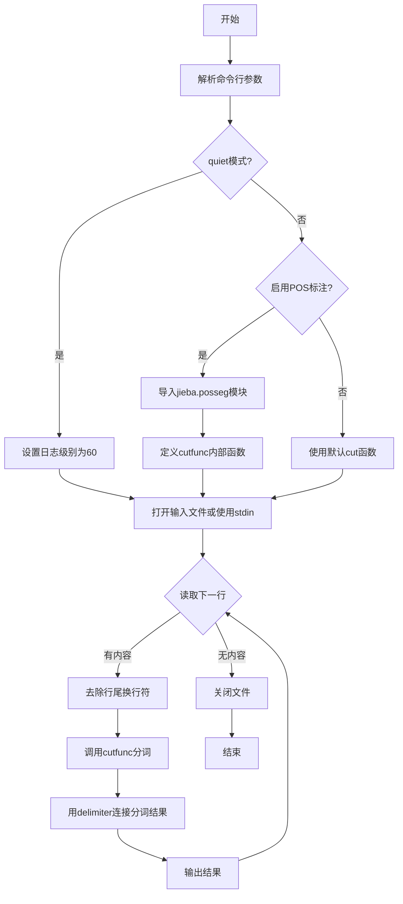
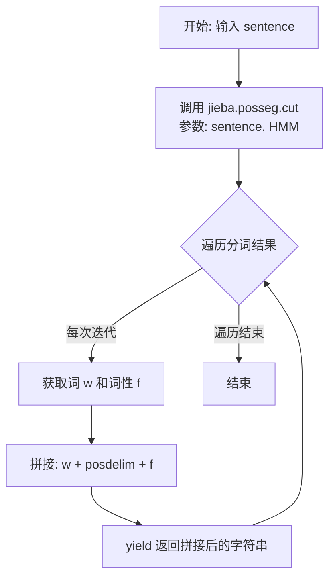

# `jieba\jieba\__main__.py` 详细设计文档

Jieba命令行界面工具，提供中文分词功能，支持自定义词典、词性标注、全模式分词等多种参数配置，可从文件或标准输入读取文本并输出分词结果。

## 整体流程



## 类结构

```
无类定义 (模块级脚本)
└── __main__ (命令行入口模块)
    ├── parser (ArgumentParser实例)
    ├── args (命名空间对象)
    ├── cutfunc (条件定义的内部函数)
    └── 流程控制代码块
```

## 全局变量及字段


### `parser`
    
命令行参数解析器实例

类型：`ArgumentParser`
    


### `args`
    
解析后的命令行参数命名空间对象

类型：`argparse.Namespace`
    


### `delim`
    
分词结果的分隔符，默认为' / '

类型：`str`
    


### `cutall`
    
是否启用全模式分词

类型：`bool`
    


### `hmm`
    
是否启用隐马尔可夫模型

类型：`bool`
    


### `fp`
    
输入文件句柄，如果未指定文件名则为标准输入

类型：`file`
    


### `posdelim`
    
词性标注分隔符，默认为'_'

类型：`str`
    


### `cutfunc`
    
分词函数，可为jieba.cut或自定义生成器函数

类型：`callable`
    


### `ln`
    
当前读取的原始行内容

类型：`str`
    


### `l`
    
去除换行符后的行内容

类型：`str`
    


### `result`
    
分词处理后的结果字符串

类型：`str`
    


    

## 全局函数及方法


### `cutfunc`

这是一个在命令行参数解析分支中动态定义的生成器函数，仅在启用词性标注模式（`--pos` 参数）时使用。该函数接收句子和分词模式参数，调用 `jieba.posseg.cut()` 进行带有词性标注的分词，并将分词结果与词性标签使用指定的分隔符连接后 yield 输出。

参数：

- `sentence`：`str`，待分词的输入句子
- `_`：下划线标识的占位参数（对应调用时传入的 `cutall` 参数，但在函数体内未使用）
- `HMM`：`bool`，可选参数，默认为 `True`，控制是否使用隐马尔可夫模型进行新词发现

返回值：`Generator[str, None, None]`，生成器对象，每次迭代 yield 返回拼接了词性和分隔符的词（例如 "word/词性"）

#### 流程图



#### 带注释源码

```python
def cutfunc(sentence, _, HMM=True):
    """
    词性标注分词生成器函数
    
    参数:
        sentence: str, 输入的待分词句子
        _: 占位参数, 对应调用时传入的 cutall 参数(此处未使用)
        HMM: bool, 是否使用隐马尔可夫模型, 默认为 True
    
    返回:
        Generator[str, None, None], 每次 yield 返回 "词/词性" 格式的字符串
    """
    # 遍历 jieba.posseg.cut() 返回的词-词性对
    # cut() 内部使用 HMM 模型进行新词发现和词性标注
    for w, f in jieba.posseg.cut(sentence, HMM):
        # 将词语、词性标注分隔符、词性标签拼接后输出
        # 例如: "今天/时间 天气/名词"
        yield w + posdelim + f
```

---

#### 潜在的技术债务与优化空间

1. **未使用参数**: 函数签名中的 `_` 参数接收了 `cutall` 值但完全未使用，可能导致调用逻辑不清晰，建议移除该参数或明确其用途
2. **硬编码分隔符依赖**: `posdelim` 来自外部闭包作用域，降低了函数的独立性和可测试性
3. **缺乏错误处理**: 未对空字符串、异常输入或 `jieba.posseg.cut()` 可能的异常进行处理
4. **代码重复**: 词性标注分支与默认分支（`jieba.cut`）的调用模式一致，可考虑抽象统一接口

## 关键组件


### 命令行参数解析模块

负责解析jieba命令行工具的各种参数，包括分词分隔符、词性标注、词典路径、用户词典、全模式分词、HMM模型开关、静默模式等配置。

### 分词功能选择模块

根据是否启用词性标注（-p参数）动态选择分词函数。若启用词性标注，使用jieba.posseg.cut并添加自定义分隔符；否则使用默认的jieba.cut。

### 文件输入处理模块

处理输入来源，支持从指定文件读取或从标准输入（STDIN）读取，并逐行处理内容。

### jieba初始化模块

负责jieba分词引擎的初始化，包括加载默认词典或自定义词典（-D参数），以及加载用户词典（-u参数）。

### 主循环处理模块

核心处理流程：逐行读取输入内容，调用分词函数进行处理，将分词结果用指定分隔符连接后输出，支持Python 2的编码处理。


## 问题及建议


### 已知问题

- **变量未使用**：`l = ln.rstrip('\r\n')` 定义了变量但在后续代码中从未使用，造成冗余
- **文件资源未正确管理**：文件打开后未使用 `with` 语句，如果程序在读取过程中发生异常，文件描述符不会被正确关闭
- **函数参数不匹配**：当启用词性标注时，`cutfunc` 定义为 `def cutfunc(sentence, _, HMM=True)`，但调用 `cutfunc(ln.rstrip('\r\n'), cutall, hmm)` 传入了三个参数，其中第二个参数 `cutall` 被忽略（用 `_` 表示），导致全模式切割参数实际不生效
- **编码处理不完善**：文件打开时未指定编码参数（`open(args.filename, 'r')`），可能因系统默认编码不同而导致读取错误；Python 2 的编码处理逻辑过时
- **缺少错误处理**：文件打开、jieba 初始化、用户字典加载等操作均无异常捕获，若文件不存在或字典加载失败会导致程序崩溃
- **参数校验缺失**：未验证字典文件路径、用户字典路径是否有效，也未校验分隔符参数的有效性

### 优化建议

- 使用 `with open(args.filename, 'r', encoding='utf-8') as fp:` 替代手动打开和关闭文件，确保资源正确释放
- 修正 `cutfunc` 的参数签名，确保 `cutall` 参数在词性标注模式下也能正确传递：`def cutfunc(sentence, cutall, HMM=True):`
- 添加 `try-except` 块处理文件不存在、字典加载失败等异常情况，提供友好的错误提示
- 统一使用 UTF-8 编码，移除 Python 2 兼容代码（`PY2` 检查和 `text_type`）
- 删除未使用的变量 `l`，或将其用于实际逻辑中
- 对命令行参数添加校验，如检查文件是否存在、路径是否合法等
- 考虑将核心逻辑封装为函数，便于测试和复用


## 其它


### 设计目标与约束

该命令行工具旨在为jieba分词库提供便捷的离线批处理能力，允许用户通过命令行对文本文件或标准输入进行中文分词处理。设计约束包括：1) 必须兼容Python 2和Python 3；2) 保持与jieba库主接口的一致性；3) 支持管道操作（从stdin读取，输出到stdout）；4) 最小化外部依赖，仅使用Python标准库和jieba核心模块。

### 错误处理与异常设计

主要错误场景包括：1) 文件不存在或无读取权限时，Python的open()会抛出FileNotFoundError；2) 词典文件路径错误时，jieba.initialize()会抛出异常；3) 编码问题导致读取失败时抛出UnicodeDecodeError；4) 命令行参数解析错误时，ArgumentParser会自动显示错误信息并退出。当前实现未对上述异常进行显式捕获和处理，错误会直接传播至上层导致程序中断。建议添加try-except块捕获关键异常，提供友好的错误提示信息。

### 数据流与状态机

数据处理流程为：1) 解析命令行参数 → 2) 初始化jieba分词器 → 3) 加载用户词典（如有）→ 4) 打开输入源（文件或stdin）→ 5) 逐行读取文本 → 6) 调用分词函数处理 → 7) 格式化输出结果 → 8) 关闭文件句柄。状态转换简单，主要处于"就绪→处理→完成"三个状态，无复杂状态机逻辑。

### 外部依赖与接口契约

核心依赖包括：1) jieba库（主分词引擎）；2) argparse模块（命令行参数解析，Python标准库）；3) sys模块（系统交互，Python标准库）；4) _compat模块（内部兼容性适配层）。接口契约：输入为UTF-8编码的文本文件或标准输入，每行视为独立句子；输出为分词后的文本，以指定分隔符连接各词元。当启用词性标注时，输出格式为"词元+分隔符+词性"。

### 性能考虑

当前实现采用逐行处理模式，内存占用较低。但存在以下性能瓶颈：1) 每行都调用join操作，频繁字符串拼接；2) 未使用缓冲区批量处理；3) 文件未使用with语句自动管理。建议优化：1) 使用列表收集结果后统一输出；2) 对于大文件考虑分块读取；3) 使用with语句简化资源管理。

### 安全性考虑

代码未对输入进行安全过滤，存在潜在风险：1) 未限制输入文件大小，可能导致内存溢出；2) 未对命令行参数进行长度限制；3) 用户词典路径未做路径遍历检查。建议添加：1) 输入文件大小检查；2) 参数长度限制；3) 路径规范化与安全验证。

### 配置管理

配置主要通过命令行参数传递，包括：1) 分隔符配置(-d/--delimiter)；2) 词性标注开关(-p/--pos)；3) 词典路径配置(-D/--dict, -u/--user-dict)；4) HMM模型开关(-n/--no-hmm)；5) 静默模式(-q/--quiet)。词典加载顺序为：默认词典→指定词典→用户词典，后续加载的词典会覆盖前面的词汇定义。

### 使用示例

基本分词用法：python -m jieba input.txt > output.txt；使用空格分隔：python -m jieba -d ' ' input.txt；启用词性标注：python -m jieba -p '_' input.txt；使用自定义词典：python -m jieba -u mydict.txt input.txt；全模式分词：python -m jieba -a input.txt；从stdin读取：echo "我爱中国" | python -m jieba

### 限制与注意事项

1) 该工具为离线批处理设计，不适合实时交互式场景；2) 默认仅支持UTF-8编码，其他编码需自行转换；3) 词性标注依赖jieba.posseg模块，该模块未安装时-p参数无法使用；4) 对于极短文本（如单字符）分词效果可能不理想；5) Windows平台下stdin行为可能与Unix系统略有差异；6) 未提供进度显示，大文件处理时用户无法感知处理进度。

### 版本兼容性

代码通过_compat模块处理Python 2/3兼容性，包括：1) text_type别名（str在Py3，unicode在Py2）；2) PY2布尔常量判断；3) default_encoding变量（utf-8在Py3，sys.getdefaultencoding()在Py2）。ArgumentParser在Python 2.7.2+和Python 3.x均可用。jieba库版本需0.42.1及以上以确保兼容性。

    