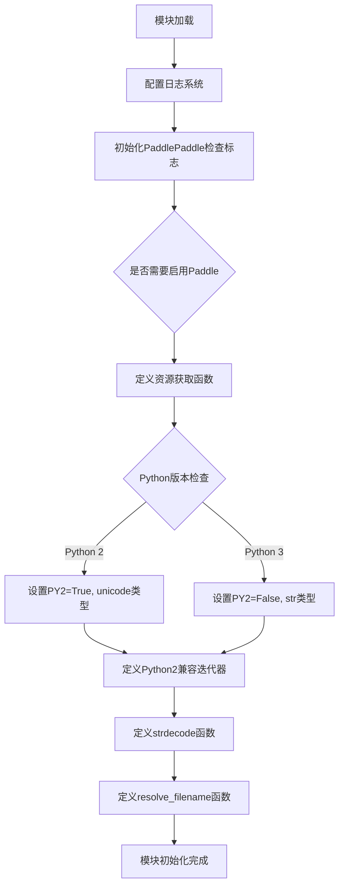
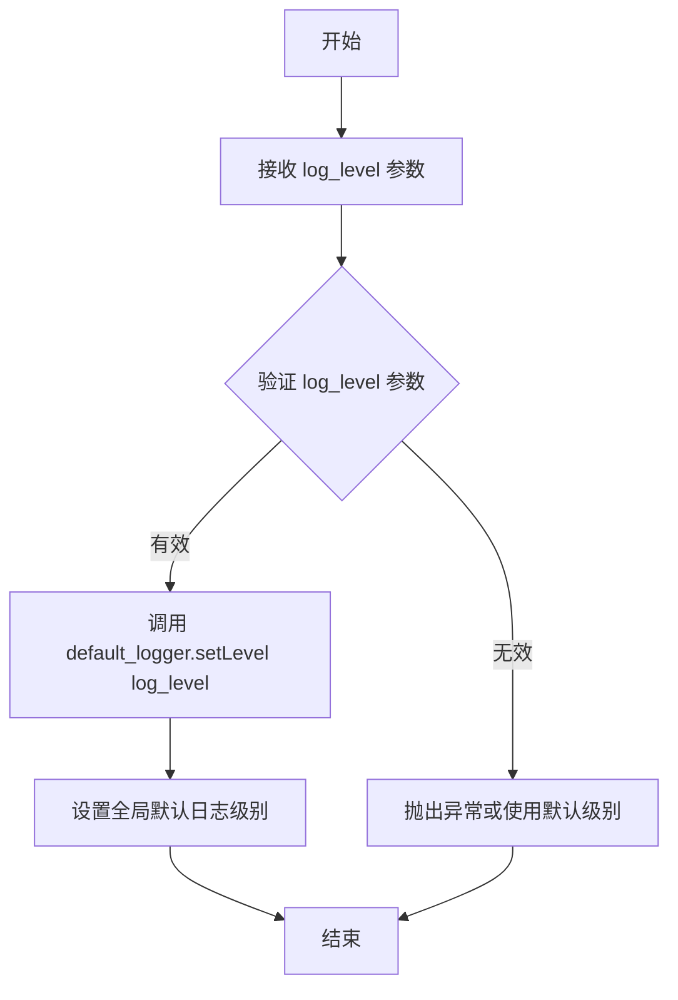
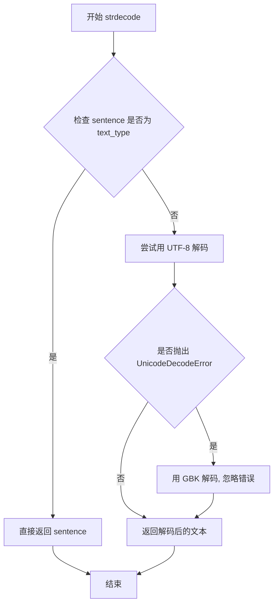

# `jieba\jieba\_compat.py` 详细设计文档

该代码是jieba中文分词库的初始化模块，主要负责配置日志系统、动态检测并安装PaddlePaddle深度学习框架以支持高级分词功能，同时提供Python 2和Python 3的兼容性处理工具函数。

## 整体流程



## 类结构

```
模块级代码 (无类定义)
├── 日志配置子模块
├── PaddlePaddle集成子模块
├── Python兼容性处理子模块
└── 工具函数子模块
```

## 全局变量及字段


### `log_console`
    
日志输出到stderr的处理器

类型：`logging.StreamHandler`
    


### `default_logger`
    
当前模块的日志记录器

类型：`logging.Logger`
    


### `check_paddle_install`
    
PaddlePaddle安装状态标志字典

类型：`dict`
    


### `get_module_res`
    
获取模块资源的lambda函数

类型：`function`
    


### `PY2`
    
Python版本标志，True表示Python 2

类型：`bool`
    


### `default_encoding`
    
文件系统默认编码

类型：`str`
    


### `text_type`
    
Python版本的文本类型（unicode/str）

类型：`type`
    


### `string_types`
    
字符串类型元组

类型：`tuple`
    


### `iterkeys`
    
字典键迭代器兼容函数

类型：`function`
    


### `itervalues`
    
字典值迭代器兼容函数

类型：`function`
    


### `iteritems`
    
字典项迭代器兼容函数

类型：`function`
    


    

## 全局函数及方法


### `setLogLevel`

设置默认日志记录器的日志级别，通过传入的日志级别参数配置全局日志输出行为。

参数：

- `log_level`：`int/str`，日志级别，可以是 logging 模块的级别常量（如 logging.DEBUG、logging.INFO 等）或对应的字符串表示（如 "DEBUG"、"INFO" 等）

返回值：`None`，该函数不返回任何值，仅执行日志级别设置操作

#### 流程图



#### 带注释源码

```python
def setLogLevel(log_level):
    """
    设置默认日志记录器的日志级别
    
    该函数用于配置全局默认日志记录器 default_logger 的输出级别。
    当日志级别设置后，只有等于或高于该级别的日志信息才会被输出。
    
    参数:
        log_level: 日志级别，可以是 logging 模块的整数值（如 logging.DEBUG=10,
                  logging.INFO=20, logging.WARNING=30, logging.ERROR=40, 
                  logging.CRITICAL=50）或字符串形式（如 'DEBUG', 'INFO' 等）
    
    返回值:
        None
    
    示例:
        >>> import logging
        >>> setLogLevel(logging.INFO)      # 设置为 INFO 级别
        >>> setLogLevel('DEBUG')           # 设置为 DEBUG 级别
    """
    default_logger.setLevel(log_level)
```


### `enable_paddle`

该函数用于检测并安装PaddlePaddle框架。首先尝试导入paddle模块，若导入失败则自动通过pip安装paddlepaddle-tiny，随后检查版本是否满足最低要求(1.6.1)，若满足则尝试导入jieba的lac_small预测模块，并标记Paddle已成功启用。

参数：

- 该函数无参数

返回值：`None`，该函数无返回值，通过修改全局变量 `check_paddle_install` 来标记Paddle是否安装成功

#### 流程图

```mermaid
flowchart TD
    A[开始 enable_paddle] --> B{尝试导入 paddle}
    B -->|成功| C{paddle.__version__ < '1.6.1'?}
    B -->|失败| D[记录日志: Installing paddle-tiny]
    D --> E[执行 pip install paddlepaddle-tiny]
    E --> F{尝试导入 paddle}
    F -->|失败| G[记录日志: Import paddle error, 请手动安装]
    F -->|成功| C
    C -->|是| H[记录日志: 版本不满足要求, 请升级]
    C -->|否| I{尝试导入 jieba.lac_small.predict}
    I -->|成功| J[记录日志: Paddle enabled successfully]
    J --> K[设置 check_paddle_install['is_paddle_installed'] = True]
    I -->|失败| L[记录日志: Import error, 无法找到模块]
    K --> M[结束]
    G --> M
    H --> M
    L --> M
```

#### 带注释源码

```python
def enable_paddle():
    """
    检测并启用PaddlePaddle框架
    1. 尝试导入paddle
    2. 若失败则自动安装paddlepaddle-tiny
    3. 检查版本是否满足最低要求(1.6.1)
    4. 尝试导入jieba的lac_small模块
    5. 设置全局标志位表示Paddle已启用
    """
    try:
        # 尝试导入paddle模块
        import paddle
    except ImportError:
        # 导入失败，记录日志并尝试安装paddlepaddle-tiny
        default_logger.debug("Installing paddle-tiny, please wait a minute......")
        # 使用os.system执行pip命令安装paddlepaddle-tiny
        os.system("pip install paddlepaddle-tiny")
        try:
            # 再次尝试导入paddle
            import paddle
        except ImportError:
            # 仍然失败，记录错误日志并提示手动安装
            default_logger.debug(
                "Import paddle error, please use command to install: pip install paddlepaddle-tiny==1.6.1."
                "Now, back to jieba basic cut......")
    
    # 检查paddle版本是否满足最低要求
    if paddle.__version__ < '1.6.1':
        # 版本过低，记录日志提示升级
        default_logger.debug("Find your own paddle version doesn't satisfy the minimum requirement (1.6.1), "
                             "please install paddle tiny by 'pip install --upgrade paddlepaddle-tiny', "
                             "or upgrade paddle full version by "
                             "'pip install --upgrade paddlepaddle (-gpu for GPU version)' ")
    else:
        # 版本满足要求，尝试导入jieba的lac_small预测模块
        try:
            import jieba.lac_small.predict as predict
            # 导入成功，记录成功日志
            default_logger.debug("Paddle enabled successfully......")
            # 设置全局标志位，表示Paddle已成功安装和启用
            check_paddle_install['is_paddle_installed'] = True
        except ImportError:
            # 导入失败，记录错误日志
            default_logger.debug("Import error, cannot find paddle.fluid and jieba.lac_small.predict module. "
                                 "Now, back to jieba basic cut......")
```


### `strdecode`

将输入的字符串或字节串解码为 Unicode 文本，确保返回 Python 文本类型（Python 3 为 str，Python 2 为 unicode）

参数：

- `sentence`：`任意类型`，需要解码的字符串或字节串

返回值：`text_type`，解码后的文本类型（Python 3 返回 str，Python 2 返回 unicode）

#### 流程图



#### 带注释源码

```python
def strdecode(sentence):
    """
    将输入的字符串解码为 Unicode 文本
    
    参数:
        sentence: 需要解码的字符串或字节串
        
    返回值:
        解码后的文本类型 (Python 3 为 str, Python 2 为 unicode)
    """
    # 检查输入是否为文本类型
    # Python 3: text_type = str
    # Python 2: text_type = unicode
    if not isinstance(sentence, text_type):
        try:
            # 尝试使用 UTF-8 解码
            sentence = sentence.decode('utf-8')
        except UnicodeDecodeError:
            # 如果 UTF-8 解码失败,使用 GBK 解码并忽略错误
            sentence = sentence.decode('gbk', 'ignore')
    return sentence
```


### `resolve_filename`

该函数用于从文件对象或文件名获取字符串表示，如果输入是文件对象则返回其name属性，否则返回对象的repr表示。

参数：

- `f`：`object`，文件对象或文件名

返回值：`str`，文件的字符串表示

#### 流程图

```mermaid
flowchart TD
    A[开始 resolve_filename] --> B{尝试获取 f.name}
    B -->|成功| C[返回 f.name]
    B -->|失败 AttributeError| D[返回 repr(f)]
    C --> E[结束]
    D --> E
```

#### 带注释源码

```python
def resolve_filename(f):
    """
    从文件对象或文件名获取字符串表示
    
    参数:
        f: 文件对象或文件名
        
    返回:
        str: 文件的字符串表示
    """
    try:
        # 尝试获取文件对象的name属性
        # 适用于文件对象（如open()返回的对象）
        return f.name
    except AttributeError:
        # 如果f没有name属性（如字符串文件名），则返回其repr表示
        # 这样可以确保无论输入何种类型，都能返回字符串
        return repr(f)
```

## 关键组件


### 日志系统

负责配置和管理日志输出，包含日志级别设置和错误信息输出。

### PaddlePaddle集成模块

实现PaddlePaddle的动态检测、安装提示和版本兼容性检查，是jieba分词的高性能NLP后端。

### Python 2/3兼容性层

提供跨Python版本的兼容接口，包括字符串类型、迭代器函数和内置函数别名。

### 字符串编码处理

处理输入文本的编码自动检测与转换，确保在不同编码环境下正确解码。

### 文件路径解析

将文件对象或文件路径统一转换为可用的文件名表示。

### 资源文件加载

封装了pkg_resources和标准文件打开两种方式，提供统一的模块资源访问接口。

### 全局状态标志

记录PaddlePaddle是否成功安装和可用的全局状态，供其他模块查询使用。


## 问题及建议


### 已知问题

-   **过时的Python 2兼容代码**：代码中包含大量Python 2兼容代码（如PY2判断、unicode、iterkeys等），但Python 2已于2020年停止支持，这些代码已成为技术债务。
-   **版本号字符串比较错误**：使用`'1.6.1'`进行字符串比较来检查版本（如`paddle.__version__ < '1.6.1'`），字符串比较逻辑不正确，应使用版本比较库。
-   **全局可变状态**：`check_paddle_install`使用全局字典存储状态，这种模式容易导致意外的副作用和难以追踪的bug。
-   **阻塞式安装依赖**：使用`os.system("pip install paddlepaddle-tiny")`同步安装包，会阻塞主线程且无法获取安装结果状态。
-   **日志配置不完整**：创建了`StreamHandler`但未添加到logger中（`default_logger.addHandler(log_console)`缺失），日志无法正常输出。
-   **缺少异常处理的精细度**：`enable_paddle`函数中多个导入和检查操作堆叠，异常处理粒度不够细，难以定位具体失败原因。
-   **冗余代码**：Python 3分支中定义`xrange = range`，这是冗余的，因为Python 3原生支持range。
-   **缺乏类型注解**：代码中没有任何类型提示，降低了代码的可维护性和IDE支持。

### 优化建议

-   **移除Python 2兼容代码**：删除所有PY2相关的条件分支（iterkeys/itervalues/iteritems/xrange等），简化代码库。
-   **使用版本比较库**：引入`packaging.version`或`distutils.version.StrictVersion`进行正确的版本比较。
-   **改进安装逻辑**：使用`subprocess.run()`或`pip`模块的API代替`os.system()`，并添加超时控制和结果检查。
-   **完善日志配置**：添加`default_logger.addHandler(log_console)`，或使用`logging.basicConfig()`简化配置。
-   **重构状态管理**：将`check_paddle_install`改为类属性或使用更清晰的状态管理模式。
-   **细化异常处理**：在`enable_paddle`中对各步骤分别捕获异常，提供更精确的错误信息。
-   **提取配置常量**：将`'1.6.1'`等硬编码值提取为模块级常量，便于维护。
-   **添加类型注解**：为函数参数和返回值添加类型提示，提升代码可读性。

## 其它


### 设计目标与约束

本模块旨在为jieba分词库提供可选的PaddlePaddle深度学习支持，同时确保在Python 2和Python 3环境下的兼容性。核心约束包括：1) 保持向后兼容性，支持Python 2.7及以上版本和Python 3.x；2) PaddlePaddle为可选依赖，当不可用时应回退到基础分词功能；3) 日志输出重定向到stderr避免干扰标准输出；4) 动态安装机制需在受限环境（如无网络或无sudo权限）下能够优雅失败。

### 错误处理与异常设计

代码采用分层异常处理策略。ImportError被捕获后提供替代实现（如get_module_res的回退方案）；UnicodeDecodeError被捕获后尝试GBK解码作为备选；Paddle版本检查不满足时输出调试日志而非抛出异常；系统命令执行错误被静默处理。这种设计的优势是保证模块加载不会因可选依赖失败而中断，代价是可能隐藏部分配置问题。建议在后续版本中添加配置项控制是否自动尝试安装Paddle。

### 数据流与状态机

模块初始化时执行以下流程：首先配置日志处理器和默认日志级别；然后尝试导入pkg_resources模块并设置资源读取lambda；接着检测Python版本并设置兼容函数；最后提供enable_paddle()函数供外部调用以激活Paddle支持。check_paddle_install字典作为全局状态标志，记录Paddle是否成功加载。整个模块无复杂状态机，状态转换主要发生在enable_paddle调用时：未安装->尝试安装->安装成功/失败->标记状态。

### 外部依赖与接口契约

本模块的直接依赖包括：Python标准库（logging、os、sys）、pkg_resources（来自setuptools，可选）、paddlepaddle-tiny（可选）。对外提供的接口包括：setLogLevel(log_level)函数用于设置日志级别；enable_paddle()函数用于激活Paddle支持；strdecode(sentence)函数用于字符串解码；resolve_filename(f)函数用于提取文件对象名称；全局变量check_paddle_install字典用于查询Paddle加载状态。所有接口均为同步调用，无异步支持。

### 性能考虑与优化空间

get_module_res使用lambda表达式每次调用时都会执行条件判断，建议预计算并缓存；enable_paddle()在每次调用时都会执行pip install命令，若已安装则造成资源浪费，应先检测再安装；全局lambda函数（iterkeys、itervalues、iteritems）在Python 3中实际返回迭代器而非列表，但保留了list转换的接口兼容性，当前实现已是Python 3下的最优方式。

### 安全性考虑

os.system()调用存在命令注入风险，尽管当前输入来自内部版本号验证，但仍建议使用subprocess模块替代；动态安装pip包需要网络访问，在受限环境中可能暴露安全策略；pkg_resources.resource_stream未做路径遍历检查，理论上可能存在路径穿越风险。

### 兼容性说明

本模块实现了Python 2到Python 3的全面兼容，包括：unicode/str类型统一、字典迭代方法兼容、range/xrange统一、文件系统编码处理。版本检测通过sys.version_info实现。测试时需覆盖Python 2.7、3.6、3.7、3.8、3.9、3.10、3.11等多个版本，以及Windows、Linux、macOS等操作系统。

### 使用示例

```python
import jieba
# 激活Paddle支持（可选）
jieba.lac_small.enable_paddle()
# 检查是否成功
if jieba.lac_small.check_paddle_install['is_paddle_installed']:
    print("Paddle enabled")
# 设置日志级别
jieba.lac_small.setLogLevel(logging.INFO)
# 使用字符串解码
text = b'\xe4\xb8\xad\xe6\x96\x87'
decoded = jieba.lac_small.strdecode(text)
```

### 测试考虑

建议添加以下测试用例：Python 2/3环境下的模块导入测试；Paddle可用/不可用时的回退功能测试；strdecode函数对UTF-8、GBK、二进制字符串的解码测试；resolve_filename对文件对象和字符串的处理测试；日志输出到stderr的验证测试；enable_paddle重复调用的幂等性测试。

### 版本演化说明

当前版本（代码片段）相对早期版本的主要变更包括：从直接import pkg_resources改为try-except包装以支持不可用情况；增加了Paddle版本检查逻辑；日志输出重定向到sys.stderr。建议在后续版本中：移除Python 2支持以简化代码；将os.system改为subprocess调用；增加类型注解支持mypy检查。

### 部署注意事项

部署时需确保：setuptools已安装以支持pkg_resources；如需Paddle支持需保证网络可达；日志配置需根据实际需求调整级别；在容器环境中注意pip install的网络超时设置；Windows环境下需确保系统编码配置正确。

    