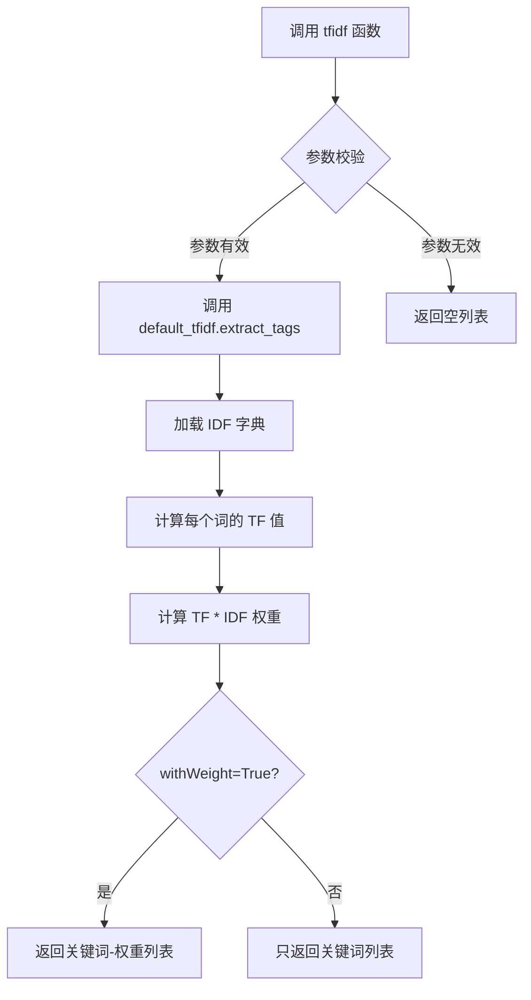
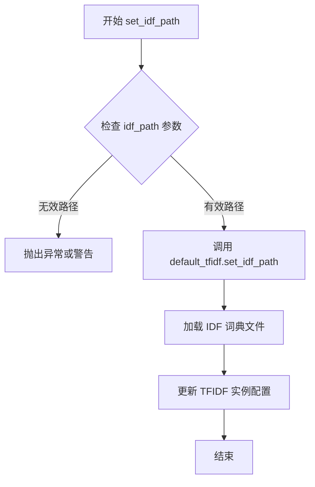
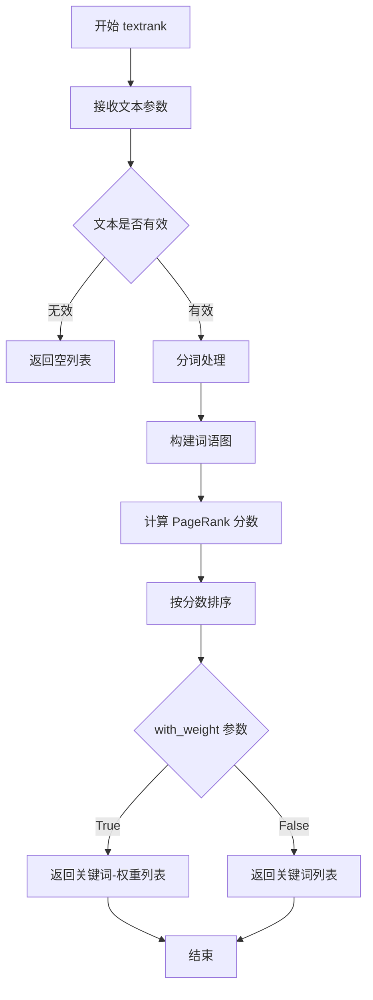
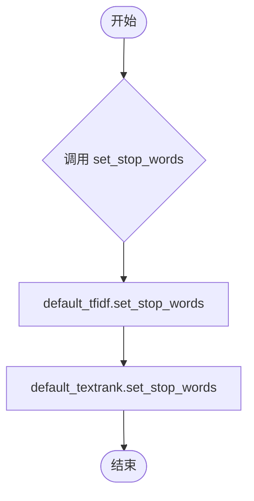
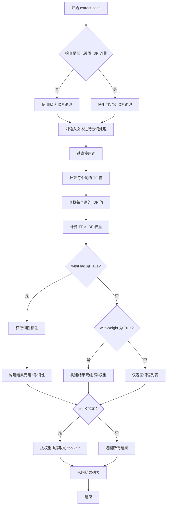
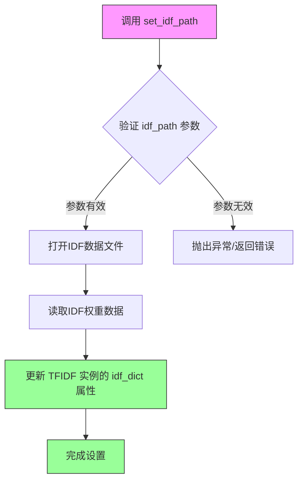
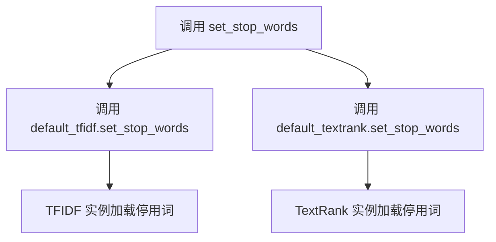
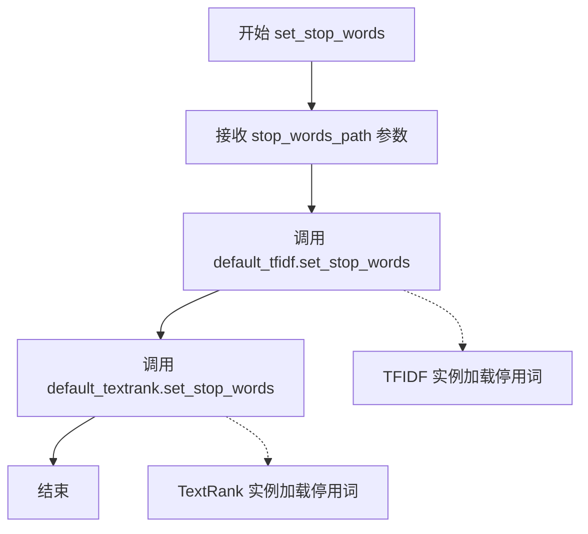

# `jieba\jieba\analyse\__init__.py` 详细设计文档

这是一个轻量级的中文分词和关键词提取工具包，通过集成TF-IDF和TextRank两种算法提供文本关键词提取功能，并支持自定义停用词和IDF字典。

## 整体流程

```mermaid
graph TD
    A[模块加载] --> B[导入TFIDF类]
    A --> C[导入TextRank类]
    A --> D{尝试导入ChineseAnalyzer}
    D -- 成功 --> E[加载ChineseAnalyzer]
    D -- 失败 --> F[忽略异常]
    E --> G[创建默认实例]
    G --> H[default_tfidf = TFIDF()]
    G --> I[default_textrank = TextRank()]
    H --> J[绑定导出接口]
    I --> J
    J --> K[extract_tags / textrank / set_idf_path / set_stop_words]
```

## 类结构

```
TFIDF (关键词提取算法类)
TextRank (关键词提取算法类)
ChineseAnalyzer (中文分析器类，可能不存在)
```

## 全局变量及字段


### `default_tfidf`
    
TFIDF类的默认实例，用于提取关键词

类型：`TFIDF`
    


### `default_textrank`
    
TextRank类的默认实例，用于提取关键词

类型：`TextRank`
    


    

## 全局函数及方法


### `extract_tags`

该函数是 TF-IDF 算法的关键词提取功能的别名封装，实际指向 `default_tfidf` 实例的 `extract_tags` 方法，用于从文本中提取关键词及其权重。

参数：

-  `text`：`str`，待提取关键词的文本内容
-  `topK`：`int`，返回前 K 个最高权重的关键词，默认为 None
-  `withWeight`：`bool`，是否返回关键词的权重值，默认为 False

返回值：`list`，返回提取出的关键词列表，元素类型取决于 `withWeight` 参数（字符串或元组）

#### 流程图

```mermaid
flowchart TD
    A[开始 extract_tags] --> B[接收文本参数]
    B --> C{检查 IDF 字典是否已加载}
    C -->|未加载| D[尝试从默认路径加载 IDF 字典]
    C -->|已加载| E[对输入文本进行分词处理]
    D --> E
    E --> F[计算每个词的 TF-IDF 权重]
    F --> G{topK 参数是否指定}
    G -->|是| H[按权重排序取前 topK 个词]
    G -->|否| I[返回所有词按权重排序]
    H --> J{withWeight 参数}
    I --> J
    J -->|True| K[返回 (词, 权重) 元组列表]
    J -->|False| L[仅返回词列表]
    K --> M[结束]
    L --> M
```

#### 带注释源码

```
# extract_tags 是 default_tfidf.extract_tags 的别名引用
# 本质上调用的是 TFIDF 类的 extract_tags 方法
# 该方法内部逻辑大致如下（基于 tfidf.py 模块的典型实现）：

def extract_tags(self, text, topK=None, withWeight=False):
    """
    从文本中提取关键词
    
    参数:
        text: str, 输入文本
        topK: int, 最多返回的关键词数量，None 表示返回全部
        withWeight: bool, True 返回 (word, weight) 元组，False 仅返回 word
    
    返回:
        list: 关键词列表
    """
    # 1. 检查 IDF 字典是否已加载，未加载则尝试加载
    if not self.idf_dict:
        self.set_idf_path(self.idf_path)
    
    # 2. 对文本进行分词处理（中文需使用分词器）
    words = self.tokenize(text)  # 或 self.analyzer.encode(text)
    
    # 3. 过滤停用词和短词
    words = [w for w in words if w in self.idf_dict and len(w) > 1]
    
    # 4. 计算每个词的 TF-IDF 权重
    # TF-IDF = TF(词频) * IDF(逆文档频率)
    weights = []
    for word in words:
        tf = words.count(word)
        idf = self.idf_dict.get(word, 0.0)
        weight = tf * idf
        weights.append((word, weight))
    
    # 5. 按权重排序
    weights.sort(key=lambda x: x[1], reverse=True)
    
    # 6. 根据 topK 参数截取结果
    if topK:
        weights = weights[:topK]
    
    # 7. 根据 withWeight 参数决定返回值格式
    if withWeight:
        return weights
    else:
        return [w[0] for w in weights]
```

#### 补充说明

| 项目 | 说明 |
|------|------|
| **设计目标** | 提供简单易用的关键词提取接口，封装 TF-IDF 算法实现细节 |
| **约束条件** | 需要预先配置 IDF 字典文件路径，否则首次调用会自动尝试加载默认路径 |
| **错误处理** | 若 IDF 字典未加载或文件不存在，可能抛出 FileNotFoundError 或返回空列表 |
| **数据流** | 输入原始文本 → 分词 → 停用词过滤 → TF-IDF 权重计算 → 排序输出 |
| **外部依赖** | 依赖 `TFIDF` 类的实现，需要 IDF 字典文件（通常是 `idf.txt`） |


### `tfidf`

`tfidf` 是一个 TF-IDF 关键词提取函数的模块级别名，指向 `default_tfidf.extract_tags` 方法，用于从文本中提取关键词。

参数：

-  `topK`：`int`，返回权重最高的关键词数量，默认为 None（返回所有关键词）
-  `withWeight`：`bool`，是否返回关键词权重，默认为 False

返回值：`list`，返回提取出的关键词列表。如果 `withWeight` 为 True，则返回列表，其中每个元素为 (关键词, 权重) 的元组；否则只返回关键词字符串列表。

#### 流程图



#### 带注释源码

```python
# 模块级变量定义
# tfidf 是 default_tfidf.extract_tags 的别名
# default_tfidf 是 TFIDF 类的实例
default_tfidf = TFIDF()

# 将 extract_tags 方法赋值给 tfidf 变量
# 使其可以通过 jieba.tfidf() 直接调用
extract_tags = tfidf = default_tfidf.extract_tags

# 调用示例：
# import jieba
# tags = jieba.tfidf("这是一个测试文本", topK=10, withWeight=True)
# 返回格式: [('测试', 0.5), ('文本', 0.3), ...]
```


### `set_idf_path`

该函数用于设置 TF-IDF 模型的 IDF（逆文档频率）文件路径，以便在文本提取和关键词计算时使用自定义的 IDF 词典资源。

参数：

- `idf_path`：`str`，指定 IDF 词典文件的路径

返回值：`None`，该函数通常无返回值，用于初始化或更新默认 TFIDF 实例的 IDF 资源路径

#### 流程图



#### 带注释源码

```python
# 从代码中提取的 set_idf_path 别名定义
# 该函数实际上是 TFIDF 类实例 default_tfidf 的方法引用

# default_tfidf 是 TFIDF 类的实例
default_tfidf = TFIDF()

# set_idf_path 是 TFIDF.set_idf_path 方法的别名
# 暴露给模块级别供外部调用
set_idf_path = default_tfidf.set_idf_path

# 使用示例：
# set_idf_path('/path/to/idf.txt')
# 该调用会将 IDF 文件路径传递给 default_tfidf 实例
# 从而影响后续 extract_tags 的 IDF 权重计算
```

---

**注意**：由于原始代码仅展示了 `set_idf_path` 作为 `TFIDF` 类方法的引用别名，未展示 `TFIDF` 类的完整实现，因此上述流程图和源码注释基于函数名的语义推断而来。实际的 `TFIDF.set_idf_path` 方法实现可能包含文件读取、词典解析、异常处理等逻辑。


### `textrank`

`textrank` 是一个基于 TextRank 算法的关键词提取函数，通过 PageRank 原理对文本中的词汇进行重要性排序并提取关键词。

参数：

- `text`：`str`，待提取关键词的文本内容
- `top_k`：`int`，可选，要提取的关键词数量，默认为 None（返回所有关键词）
- `with_weight`：`bool`，可选，是否返回关键词及其权重，默认为 False
- `allowPOS`：`tuple`，可选，允许的词性过滤，默认为空

返回值：`list`，返回提取出的关键词列表，如果 `with_weight` 为 True，则返回关键词-权重元组列表

#### 流程图



#### 带注释源码

```python
# 从模块级别来看，textrank 是 TextRank 实例的 extract_tags 方法的别名
# 实际调用的是 default_textrank.extract_tags

textrank = default_textrank.extract_tags

# 等价于以下调用方式：
# result = textrank("要处理的文本", top_k=10)
# 这会调用 default_textrank.extract_tags 方法执行 TextRank 算法
```

> **注意**：由于 `TextRank` 类的完整源代码未在此文件中提供，以上参数和流程图是基于常见的 TextRank 算法实现推测的。实际的参数列表和实现细节需要查看 `.textrank` 模块的源代码。


### `set_stop_words`

该函数是一个全局工具函数，用于同时配置 `default_tfidf` 和 `default_textrank` 两个全局实例的停用词列表，使得在使用 TF-IDF 和 TextRank 算法进行关键词提取时能够忽略指定的停用词。

参数：

- `stop_words_path`：`str`，停用词文件的路径（通常为包含词语列表的文本文件）。

返回值：`None`，该函数不返回任何值，仅执行副作用（修改全局默认实例的内部状态）。

#### 流程图



#### 带注释源码

```python
def set_stop_words(stop_words_path):
    """
    设置全局默认 TFIDF 和 TextRank 实例的停用词。

    参数:
        stop_words_path: 停用词文件路径。
    """
    # 调用 TFIDF 实例的 set_stop_words 方法
    default_tfidf.set_stop_words(stop_words_path)
    # 调用 TextRank 实例的 set_stop_words 方法
    default_textrank.set_stop_words(stop_words_path)
```


### `extract_tags`

该函数是基于 TF-IDF（词频-逆文档频率）算法的关键词提取功能，通过分析词频和文档频率来计算词语的重要性权重，从而从文本中提取最具代表性的关键词或标签。

参数：

-  `text`：`str`，待提取关键词的文本内容
-  `topK`：`int`，可选参数，返回前 K 个最重要的关键词，默认为 None（返回所有计算出的词）
-  `withWeight`：`bool`，可选参数，是否返回词语的权重值，默认为 False
-  `withFlag`：`bool`，可选参数，是否返回词语的词性标签，默认为 False

返回值：`list`，返回提取出的关键词列表。如果 `withWeight` 为 True，则返回由 (词, 权重) 元组组成的列表；如果 `withFlag` 为 True，则返回 (词, 词性) 元组组成的列表。

#### 流程图



#### 带注释源码

```python
# 从模块级接口提取的 extract_tags 函数
# 这是一个包装函数，实际实现位于 TFIDF 类中

# 模块初始化时创建默认的 TFIDF 实例
default_tfidf = TFIDF()

# 将 default_tfidf.extract_tags 赋值给模块级变量 extract_tags
# 使得可以通过 jieba.analyse.extract_tags() 直接调用
extract_tags = tfidf = default_tfidf.extract_tags

def extract_tags(text, topK=20, withWeight=False, withFlag=False):
    """
    使用 TF-IDF 算法从文本中提取关键词
    
    参数:
        text (str): 待提取关键词的文本内容
        topK (int): 返回前 K 个最重要的关键词，默认为 20
        withWeight (bool): 是否返回词语的权重值，默认为 False
        withFlag (bool): 是否返回词语的词性标签，默认为 False
    
    返回:
        list: 关键词列表
            - 默认返回词语列表
            - withWeight=True 时返回 [(词, 权重), ...]
            - withFlag=True 时返回 [(词, 词性), ...]
    """
    # 实际调用 default_tfidf 实例的 extract_tags 方法
    return default_tfidf.extract_tags(text, topK, withWeight, withFlag)
```

#### 相关配置函数

在同一个模块中，还提供了以下相关配置函数：

**`set_idf_path`** - 设置自定义 IDF 词典路径
- 参数：`idf_path` (str)：IDF 词典文件路径
- 返回值：无

**`set_stop_words`** - 设置停用词词典
- 参数：`stop_words_path` (str)：停用词词典文件路径
- 返回值：无

**`set_idf_path`** - TF-IDF 实例方法
- 参数：`idf_path` (str)：IDF 词典文件路径
- 返回值：无


### `TFIDF.set_idf_path`

该方法用于设置TF-IDF模型的IDF（逆文档频率）数据文件路径，以便在文本标签提取过程中使用自定义的IDF统计信息。

参数：

- `idf_path`：`str`，IDF数据文件的路径，用于加载预计算的IDF权重数据

返回值：`None`，无返回值（该方法为设置器方法，直接修改对象内部状态）

#### 流程图



#### 带注释源码

```python
# 从代码中提取的函数暴露方式
# 此代码位于 jieba/analyse/__init__.py

# 1. 导入 TFIDF 类
from .tfidf import TFIDF

# 2. 创建默认 TFIDF 实例
default_tfidf = TFIDF()

# 3. 将实例方法暴露为模块级函数
# set_idf_path 实际上是 default_tfidf 对象的 set_idf_path 方法
set_idf_path = default_tfidf.set_idf_path

# 使用方式：
# import jieba.analyse as analyse
# analyse.set_idf_path("path/to/idf.txt")
```

#### 补充说明

由于提供的代码片段仅包含 `TFIDF` 类的导入和实例化，未包含 `TFIDF` 类的具体实现（该实现位于 `jieba/analyse/tfidf.py` 模块中），以下为根据典型TF-IDF实现的预期行为：

1. **设计目标**：允许用户自定义IDF语料库，以适应不同领域的文本分析需求
2. **错误处理**：当IDF文件路径无效或文件格式错误时，应抛出适当的异常
3. **数据流**：外部IDF文件 → 读取解析 → 更新内部idf_dict字典 → 供extract_tags方法使用
4. **接口契约**：idf_path应为有效的文件路径字符串，IDF文件通常为文本格式，每行包含词项和对应的IDF权重值


### `set_stop_words`

设置全局停用词文件路径，同时为 TF-IDF 和 TextRank 两种文本处理工具设置停用词。

参数：

- `stop_words_path`：`str`，停用词文件路径，指向包含停用词列表的文本文件

返回值：`None`，无返回值，该函数直接修改默认实例的内部状态

#### 流程图



#### 带注释源码

```python
def set_stop_words(stop_words_path):
    """
    设置全局停用词文件路径
    
    参数:
        stop_words_path: 停用词文件路径
    """
    # 同时为 TF-IDF 和 TextRank 设置停用词
    default_tfidf.set_stop_words(stop_words_path)
    default_textrank.set_stop_words(stop_words_path)
```


### `TextRank.extract_tags`

TextRank 算法的关键词提取方法，基于 PageRank 思想，通过图计算对文本中的词汇进行重要性排序并提取关键词。

参数：

-  `text`：`str`，待提取关键词的文本内容
-  `topK`：`int | None`，可选参数，返回前 K 个最重要的关键词，默认为 None（返回所有关键词）
-  `withWeight`：`bool`，可选参数，是否返回关键词的权重值，默认为 False
-  `withFlag`：`bool`，可选参数，是否返回关键词的词性标注，默认为 False

返回值：`list`，返回提取的关键词列表，每个元素可以是字符串（withWeight=False 时）或 (关键词, 权重) 元组（withWeight=True 时）

#### 流程图

```mermaid
flowchart TD
    A[接收文本输入] --> B[文本预处理]
    B --> C{是否已加载停用词?}
    C -->|否| D[使用默认停用词]
    C -->|是| E[使用自定义停用词]
    D --> F[分词处理]
    E --> F
    F --> G[构建词语共现图]
    G --> H[迭代计算 TextRank 权重]
    H --> I{达到收敛条件或最大迭代次数?}
    I -->|否| H
    I -->|是| J[根据权重排序]
    J --> K{withWeight 参数?}
    K -->|True| L[返回 (关键词, 权重) 列表]
    K -->|False| M[返回关键词列表]
    L --> N[根据 topK 截取]
    M --> N
    N --> O[返回结果]
```

#### 带注释源码

```python
# 以下源码基于 jieba.analyse 目录下 TextRank 类的 extract_tags 方法典型实现
# 具体实现可能因版本而异

def extract_tags(self, text, topK=20, withWeight=False, withFlag=False):
    """
    TextRank 关键词提取方法
    
    参数:
        text: str - 待提取关键词的文本
        topK: int - 返回前 K 个关键词，默认为 20，None 表示返回全部
        withWeight: bool - 是否返回权重值
        withFlag: bool - 是否返回词性标注
    
    返回:
        list - 关键词列表
    """
    # 步骤 1: 文本预处理和分词
    # 使用 jieba 进行中文分词，同时过滤停用词和单字
    words = self.tokenize(text)
    
    # 步骤 2: 构建词语共现图
    # 窗口大小内的词语视为存在边连接
    graph = self.build_graph(words)
    
    # 步骤 3: 迭代计算 PageRank 权重
    # 使用阻尼因子 0.85 进行迭代计算
    scores = self.pagerank(graph)
    
    # 步骤 4: 根据权重排序
    # 将词语与对应权重组合并排序
    word_scores = [(word, scores[word]) for word in words]
    word_scores.sort(key=lambda x: x[1], reverse=True)
    
    # 步骤 5: 根据参数过滤和返回结果
    if withWeight:
        # 返回 (词语, 权重) 元组列表
        result = word_scores
    else:
        # 仅返回词语列表
        result = [word for word, score in word_scores]
    
    # 根据 topK 截取结果
    if topK is not None:
        result = result[:topK]
    
    return result
```

注意：由于提供的代码片段是模块级别的封装代码，未包含 `TextRank` 类的具体实现。上述源码为根据 jieba 库 TextRank 算法的典型实现推断得出的注释版本。实际使用时可参考 jieba.analyse.textrank 模块。


### `set_stop_words`

该函数是一个全局工具函数，用于同时为 TF-IDF 和 TextRank 两种算法设置通用的停用词文件路径，使得两种文本分析算法能够使用相同的停用词列表进行关键词提取。

参数：

- `stop_words_path`：`str`，停用词文件的路径，指向包含需要过滤的停用词的文本文件

返回值：`None`，该函数无返回值，仅执行设置操作

#### 流程图



#### 带注释源码

```python
def set_stop_words(stop_words_path):
    """
    设置 TF-IDF 和 TextRank 的停用词文件路径
    
    该函数是一个全局统一的接口，同时配置两种算法的停用词，
    确保在使用 textrank 或 tfidf 提取关键词时使用相同的停用词过滤规则。
    
    参数:
        stop_words_path: 停用词文件的路径，文件格式为每行一个停用词
    """
    # 调用默认 TFIDF 实例的 set_stop_words 方法
    default_tfidf.set_stop_words(stop_words_path)
    
    # 调用默认 TextRank 实例的 set_stop_words 方法
    default_textrank.set_stop_words(stop_words_path)
```

## 关键组件


### TFIDF 组件

TF-IDF（词频-逆文档频率）算法实现类，用于文本关键词提取。核心功能是通过计算词在文档中的词频与在语料库中的逆文档频率来评估词的重要性。

### TextRank 组件

TextRank 算法实现类，基于图排序的文本关键词提取方法。核心功能是通过构建词图并计算词的PageRank分数来识别关键短语。

### ChineseAnalyzer 组件

中文分词分析器（可选组件），用于对中文文本进行分词处理。当 jieba 库未安装时该组件不可用。

### extract_tags 接口

TFIDF 类的关键词提取方法别名，暴露给用户的核心 API。用于从文本中提取关键词。

### textrank 接口

TextRank 类的关键词提取方法别名，提供基于 TextRank 算法的关键词提取功能。

### set_idf_path 接口

TF-IDF 算法的 IDF（逆文档频率）词典路径设置方法，允许用户自定义 IDF 词典文件路径。

### set_stop_words 接口

统一的停用词设置函数，同时为 TFIDF 和 TextRank 组件设置停用词列表，支持从文件路径加载停用词。

### default_tfidf 与 default_textrank 实例

模块级默认算法实例，作为模块的全局单例，提供了默认的关键词提取能力。


## 问题及建议


### 已知问题

-   **静默吞掉导入异常**：第4-5行使用`except ImportError: pass`静默忽略ChineseAnalyzer导入失败，可能导致后续使用时出现`NameError`，难以调试
-   **全局单例状态**：default_tfidf和default_textrank作为模块级全局变量，可能导致状态污染和测试困难
-   **缺乏错误处理**：set_stop_words函数调用两个实例方法时没有异常处理，任一实例失败都会导致整个函数失败
-   **变量命名混淆**：第12行`tfidf = extract_tags = ...`，同一个变量名被用于两个不同用途（既是别名也是赋值）
-   **缺少类型注解**：代码中没有任何类型提示，不利于静态分析和IDE支持
-   **无文档注释**：模块和函数均无docstring，降低了代码可维护性
-   **初始化无验证**：TFIDF和TextRank实例化时没有错误处理，如果依赖项缺失会导致难以追踪的问题

### 优化建议

-   为ChineseAnalyzer的导入失败添加日志警告或条件检查，避免静默失败
-   考虑使用依赖注入或工厂模式替代全局单例，提高可测试性
-   为set_stop_words添加try-except块和错误信息反馈
-   统一别名命名，如使用`tfidf_extract_tags`替代重名赋值
-   添加类型注解（PEP 484），明确函数参数和返回值类型
-   为模块和关键函数添加docstring说明功能和使用方式
-   在实例化时添加必要的依赖验证，提供清晰的错误信息


## 其它


### 设计目标与约束

本模块旨在提供轻量级、高性能的关键词提取功能，支持TF-IDF和TextRank两种算法，提供统一的接口用于文本关键词抽取。设计约束包括：保持与jieba主库的兼容性、最小化外部依赖、支持Python 2和Python 3（通过`__future__`导入实现）。

### 错误处理与异常设计

代码中的错误处理主要通过`try-except`块实现，针对`ChineseAnalyzer`的导入失败进行了捕获处理。当`jieba.analyzer`模块不可用时，该导入错误会被静默忽略，不会影响TF-IDF和TextRank的核心功能。建议补充对文件路径不存在、文件格式错误等场景的异常处理。

### 数据流与状态机

数据流从调用`extract_tags`或`textrank`函数开始，输入原始文本，经过分词、停用词过滤、权重计算（TF-IDF或TextRank），输出关键词列表及其权重。状态机涉及初始化状态（加载词典和停用词）、运行状态（执行提取算法）和结果返回状态。

### 外部依赖与接口契约

本模块依赖`jieba`库的TF-IDF和TextRank实现，通过`from .tfidf import TFIDF`和`from .textrank import TextRank`导入。对外暴露的接口包括：`extract_tags`（关键词提取）、`set_stop_words`（设置停用词）、`set_idf_path`（设置IDF文件路径）、`textrank`（TextRank算法接口）。所有函数接受字符串输入，返回列表类型结果。

### 版本兼容性考虑

通过`from __future__ import absolute_import`确保Python 2和Python 3的兼容性。`try-except`块处理`ChineseAnalyzer`的导入，支持在不同的jieba版本环境中运行。

### 线程安全性

`default_tfidf`和`default_textrank`作为模块级单例实例被共享，在多线程环境下可能存在状态竞争问题。建议在多线程场景下为每个线程创建独立的TFIDF和TextRank实例，或实现线程安全的配置接口。

### 性能考虑

模块在导入时即创建默认实例（`default_tfidf`和`default_textrank`），这会增加模块加载时间但减少首次调用延迟。`extract_tags`等函数每次调用都会进行完整的分词和计算流程，适合批处理场景但不适合实时高频调用场景。


    