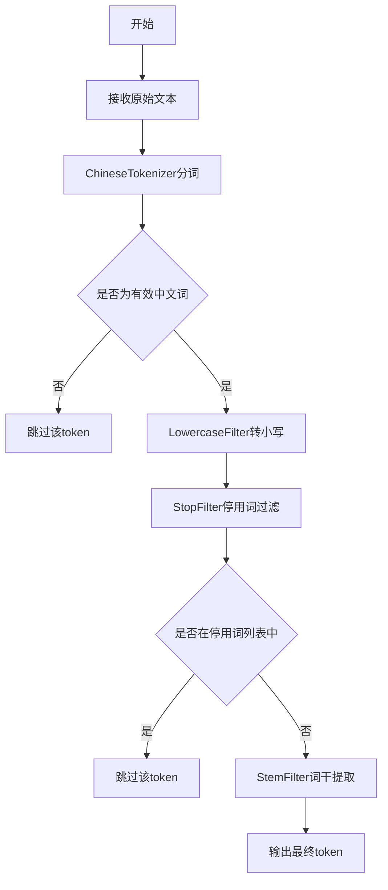
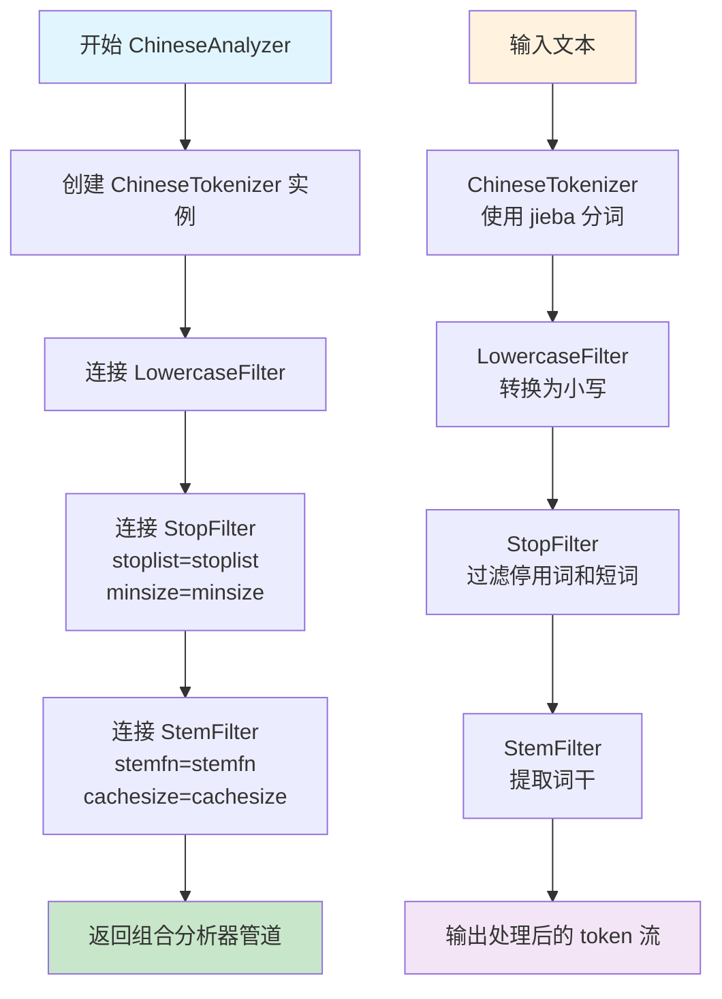
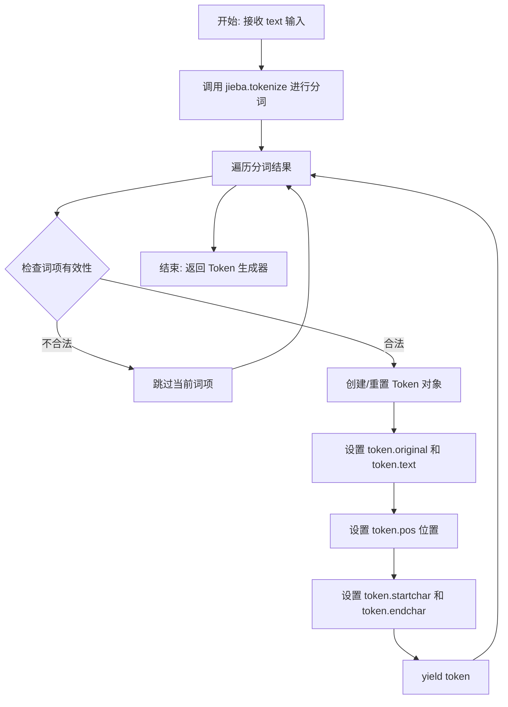

# `jieba\jieba\analyse\analyzer.py` 详细设计文档

该模块实现了一个中文文本分析器，结合jieba分词库与Whoosh文本分析框架，通过ChineseTokenizer进行中文分词，并依次经过LowercaseFilter、StopFilter和StemFilter进行小写转换、停用词过滤和词干提取，生成可供全文搜索使用的文本标记流。

## 整体流程



## 类结构

```
ChineseTokenizer (自定义分词器类)
└── 继承自 Whoosh Tokenizer 基类
```

## 全局变量及字段


### `STOP_WORDS`
    
A frozenset containing stop words for text analysis, including English and Chinese common words to be filtered out during tokenization

类型：`frozenset`
    


### `accepted_chars`
    
A regular expression pattern that matches Chinese characters in the Unicode range U+4E00 to U+9FD5, used to filter valid Chinese text tokens

类型：`re.Pattern`
    


    

## 全局函数及方法


### `ChineseAnalyzer`

ChineseAnalyzer 是一个用于中文文本分析的函数，它将分词器、中文分词库（jieba）、小写转换过滤器、停用词过滤器和词干提取过滤器组合成一个管道，用于对中文文本进行索引和分析处理。

参数：

- `stoplist`：`frozenset`，停用词集合，默认值为 STOP_WORDS（包含英文和中文停用词）
- `minsize`：`int`，最小词长阈值，默认值为 1
- `stemfn`：`function`，词干提取函数，默认值为 stem（来自 whoosh.lang.porter）
- `cachesize`：`int`，词干提取缓存大小，默认值为 50000

返回值：`CompositeAnalyzer`，返回由 ChineseTokenizer、LowercaseFilter、StopFilter 和 StemFilter 组成的分析器管道对象

#### 流程图



#### 带注释源码

```python
def ChineseAnalyzer(stoplist=STOP_WORDS, minsize=1, stemfn=stem, cachesize=50000):
    """
    中文文本分析器工厂函数
    
    创建一个组合的分析器管道，包含中文分词、小写转换、停用词过滤和词干提取功能。
    
    参数:
        stoplist: 停用词集合，用于过滤常见的无意义词汇
        minsize: 最小词长阈值，短于此长度的词将被过滤
        stemfn: 词干提取函数，默认使用 Porter 算法
        cachesize: 词干提取缓存大小，用于提高性能
    
    返回:
        CompositeAnalyzer: 由多个过滤器和分词器组成的分析器管道
    """
    
    # 创建中文分词器实例，使用 jieba 库进行中文分词
    # ChineseTokenizer 继承自 Tokenizer，会对文本进行中文分词处理
    tokenizer = ChineseTokenizer()
    
    # 使用管道操作符 | 将各个组件串联起来
    # 数据流: 原始文本 -> ChineseTokenizer -> LowercaseFilter -> StopFilter -> StemFilter
    return (tokenizer 
            | LowercaseFilter()                      # 将所有英文文本转换为小写
            | StopFilter(                            # 过滤停用词和短词
                stoplist=stoplist, 
                minsize=minsize
            ) 
            | StemFilter(                             # 应用词干提取
                stemfn=stemfn, 
                ignore=None, 
                cachesize=cachesize
            )
           )
```


### `ChineseTokenizer.__call__`

这是 ChineseTokenizer 类的核心方法，实现了分词器接口，接受文本输入后使用 jieba 库进行中文分词处理，通过过滤无效字符后生成 Token 对象序列。

参数：

- `self`：ChineseTokenizer 实例对象，分词器自身
- `text`：`str`，需要分词的输入文本
- `**kargs`：`dict`，可选关键字参数，传递给父类 Tokenizer 的额外参数（如 positions、mode 等）

返回值：`generator`，返回 Token 对象的生成器，每个 Token 包含原始文本、标准化文本、位置信息等

#### 流程图



#### 带注释源码

```python
def __call__(self, text, **kargs):
    """
    分词器调用方法，对输入文本进行中文分词处理
    
    参数:
        text: str, 需要分词的输入文本
        **kargs: dict, 传递给父类的可选关键字参数
    
    返回:
        generator: Token 对象的生成器
    """
    # 使用 jieba 库进行中文分词，mode="search" 支持搜索模式分词
    # 返回格式: (词, 起始位置, 结束位置) 的元组列表
    words = jieba.tokenize(text, mode="search")
    
    # 创建 Token 对象（复用该对象以提高性能）
    token = Token()
    
    # 遍历分词结果
    for (w, start_pos, stop_pos) in words:
        # 过滤条件：不是有效中文字符且长度<=1的词项被跳过
        # accepted_chars 匹配范围: \u4E00-\u9FD5 (中日韩统一表意文字)
        if not accepted_chars.match(w) and len(w) <= 1:
            continue  # 跳过无效词项
        
        # 设置 Token 的原始文本和标准化文本
        token.original = token.text = w
        
        # 设置词项在文本中的位置信息
        token.pos = start_pos          # 词项位置索引
        token.startchar = start_pos    # 起始字符位置
        token.endchar = stop_pos       # 结束字符位置
        
        # 生成 Token 对象
        yield token
```

## 关键组件


### ChineseTokenizer

基于jieba分词库的中文分词器实现，继承Whoosh的Tokenizer接口，将中文文本按搜索模式进行分词处理，并过滤掉非中文单字符 token。

### ChineseAnalyzer

中文分析器工厂函数，将分词器、低大小写过滤器、停用词过滤器和词干过滤器组合成管道，支持可配置的停用词列表、最小词长、词干函数和缓存大小。

### STOP_WORDS

预定义的多语言停用词集合（包含英文和中文），用于过滤常见无意义词汇，提升索引效率。

### accepted_chars

用于匹配中文字符的正则表达式编译对象，仅保留连续的中文字符序列，过滤其他符号和单字符。


## 问题及建议


### 已知问题

-   **正则表达式过滤逻辑缺陷**：`accepted_chars` 只匹配中文正则 `[\u4E00-\u9FD5]+`，导致英文字符串无论长度如何都会被接受，而中文单字会被错误过滤（当匹配不到中文时才会检查长度），与注释意图不符
-   **Token 对象复用潜在 bug**：在 `ChineseTokenizer.__call__` 中复用了同一个 `Token` 对象，在 for 循环中 yield同一个对象，可能导致调用方获取到错误的位置信息或数据
-   **停用词过滤不支持中文**：StopFilter 对英文停用词有效，但中文停用词（如 "的"、"了"、"和"）在 StemFilter 之后处理，可能导致中文停用词未被正确过滤
-   **缺乏错误处理**：代码未处理 `jieba.tokenize` 可能抛出的异常（如空文本、None输入等）
-   **StemFilter 与中文不兼容**：StemFilter 使用英文词干提取算法（porter stemmer），对中文文本无效且浪费计算资源

### 优化建议

-   修正 `accepted_chars` 正则表达式，或重写过滤逻辑，明确区分中英文处理规则
-   为每个 token 创建新的 Token 对象实例，避免对象复用问题
-   在 StopFilter 之前增加中文停用词处理逻辑，或自定义中文停用词过滤器
-   添加输入验证和异常处理机制，处理空值、异常输入情况
-   考虑条件性应用 StemFilter：对于中文文本跳过词干提取，或使用专门的中文处理组件
-   将 `STOP_WORDS` 中的中文停用词移除或单独处理，避免无效的过滤操作

## 其它


### 设计目标与约束

该模块旨在为Whoosh搜索引擎框架提供中文分词支持，通过集成jieba分词库实现中文文本的token化，同时结合Whoosh的内置过滤器（LowercaseFilter、StopFilter、StemFilter）完成文本的标准化处理。设计约束包括：仅处理中文字符和长度大于1的英文单词，接受Unicode编码的中文字符范围（\u4E00-\u9FD5），并通过可配置的停用词列表和词干提取函数实现灵活的文本分析策略。

### 错误处理与异常设计

代码中错误处理较为简单，主要依赖jieba和Whoosh框架自身的异常机制。当输入文本为空或格式不正确时，jieba.tokenize会返回空迭代器，ChineseTokenizer的yield逻辑会自动跳过。对于非法字符（非中文且长度≤1的字符），通过accepted_chars正则匹配进行过滤而非抛出异常。潜在改进：可增加输入验证、编码检测、异常日志记录等机制。

### 数据流与状态机

数据流处理遵循以下流程：输入原始文本 → ChineseTokenizer进行中文分词 → LowercaseFilter转小写 → StopFilter去除停用词 → StemFilter提取词干 → 输出标准化token序列。状态机表现为：文本输入状态 → 分词状态 → 过滤状态 → 输出状态。各过滤器通过Whoosh的Pipeline机制串联，形成链式处理模式。

### 外部依赖与接口契约

核心依赖包括：whoosh.analysis模块（Tokenizer、Token、LowercaseFilter、StopFilter、StemFilter）、whoosh.lang.porter.stem函数、jieba分词库、re正则模块。ChineseAnalyzer函数返回Whoosh标准Analyzer接口对象，接受stoplist（停用词集合）、minsize（最小词长）、stemfn（词干函数）、cachesize（缓存大小）四个可选参数，返回值必须符合Whoosh的Analyzer接口规范（包含__call__方法返回token生成器）。

### 配置与调优参数

STOP_WORDS：预定义的中英文停用词集合，包含30个英文停用词和2个中文停用词（“的”、“了”、“和”），可通过stoplist参数覆盖。accepted_chars：正则表达式，用于匹配中文字符范围。ChineseAnalyzer参数：stoplist（默认STOP_WORDS）、minsize（默认1）、stemfn（默认stem词干函数）、cachesize（默认50000）。调优建议：根据实际文档集调整停用词表、调整minsize过滤短词、调整cachesize优化内存使用。

### 使用示例

```python
from whoosh.index import create_in
from whoosh.fields import Schema, TEXT

# 创建索引模式
schema = Schema(content=TEXT(analyzer=ChineseAnalyzer()))

# 创建索引
ix = create_in("indexdir", schema)

# 添加文档
writer = ix.writer()
writer.add_document(content="这是一个中文分词测试文本")
writer.commit()

# 查询
with ix.searcher() as searcher:
    results = searcher.search("中文")
    print(results)
```

### 性能考虑

jieba.tokenize采用精确模式或搜索模式，本代码使用搜索模式（mode="search"）以提高召回率。StemFilter的cachesize参数（默认50000）影响词干缓存的内存占用。ChineseTokenizer逐词yield token，非一次性加载所有分词结果，有利于处理大规模文本。潜在性能瓶颈：jieba分词本身速度、StopFilter和StemFilter的重复遍历、Python GIL限制。优化方向：考虑使用jieba的cut_for_search替代tokenize、实现并行分词、使用Cython优化关键路径。

### 安全性考虑

代码本身不涉及用户输入验证、权限控制、敏感数据处理等安全功能。jieba分词依赖外部词典，如需防御词典投毒攻击应使用受信任的词典源。StopFilter和StemFilter的cachesize参数如设置过大可能导致内存耗尽（DoS风险），建议根据实际场景限制最大值。

### 测试考虑

建议编写以下测试用例：基本功能测试（验证中文分词、英文转小写、停用词过滤、词干提取）、边界条件测试（空字符串、纯符号、超长文本、特殊Unicode字符）、性能测试（大规模文本处理速度、内存占用）、集成测试（与Whoosh索引和查询流程的兼容性）、回归测试（jieba版本升级后的兼容性）。

    