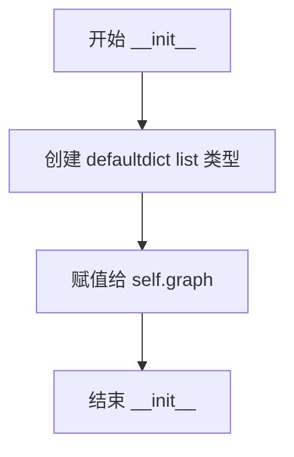
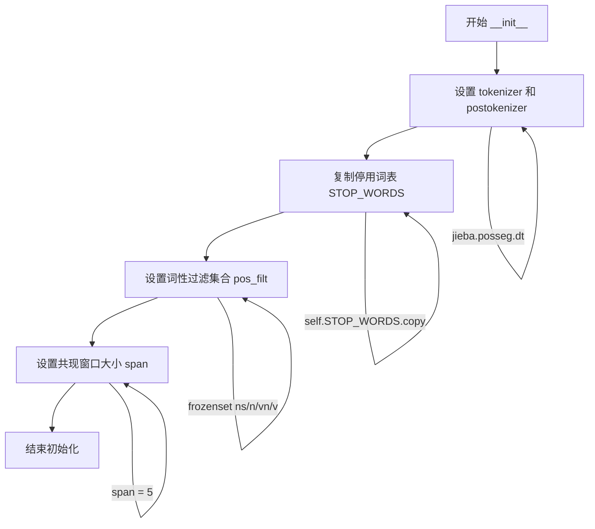
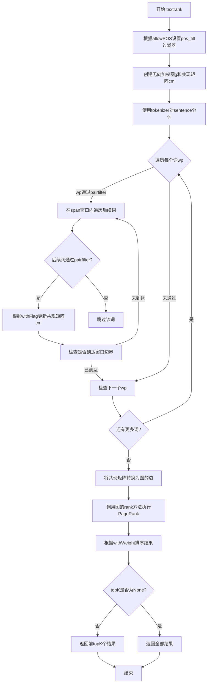
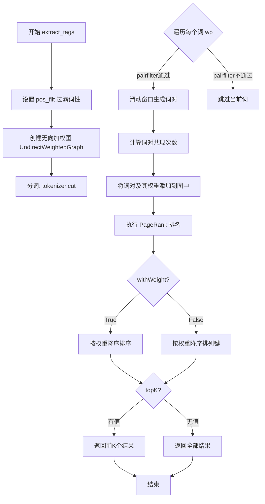

# `jieba\jieba\analyse\textrank.py` 详细设计文档

这是一个基于TextRank算法的关键词提取工具，通过构建词语共现图并利用PageRank算法计算词语权重，从给定句子中提取关键词。该实现继承自KeywordExtractor基类，支持词性过滤、权重返回、自定义POS标签等功能。

## 整体流程

```mermaid
graph TD
    A[开始 textrank 方法] --> B[设置 pos_filt 过滤器]
    B --> C[初始化 UndirectWeightedGraph]
    C --> D[使用分词器对句子进行分词]
    D --> E{遍历分词结果}
    E -->|通过 pairfilter| F[在 span 范围内构建词对]
    E -->|未通过| G[跳过当前词]
    F --> H{词对是否满足条件}
    H -->|是| I[更新共现矩阵 cm]
    I --> J{继续遍历}
    J --> E
    H -->|否| G
    G --> J
    E -->|遍历完成| K[将共现矩阵转换为图边]
    K --> L[调用图.rank()计算PageRank]
    L --> M{withWeight?}
    M -->|是| N[返回 (word, weight) 排序列表]
    M -->|否| O[返回 word 排序列表]
    N --> P{topK?}
    O --> P
    P -->|是| Q[返回前 topK 个结果]
    P -->|否| R[返回全部结果]
```

## 类结构

```
KeywordExtractor (抽象基类/接口)
└── TextRank (关键词提取实现类)
    └── UndirectWeightedGraph (无向加权图/内部类)
```

## 全局变量及字段


### `UndirectWeightedGraph.d`
    
PageRank 阻尼系数，默认为0.85

类型：`类变量 (float)`
    


### `UndirectWeightedGraph.graph`
    
存储无向图的边信息，格式为 {节点: [(起点, 终点, 权重), ...]}

类型：`实例变量 (defaultdict)`
    


### `TextRank.tokenizer`
    
分词器，默认为 jieba.posseg.dt

类型：`对象`
    


### `TextRank.postokenizer`
    
词性分词器，默认为 jieba.posseg.dt

类型：`对象`
    


### `TextRank.stop_words`
    
停用词集合，从 STOP_WORDS 复制

类型：`集合`
    


### `TextRank.pos_filt`
    
词性过滤器，默认为 ('ns', 'n', 'vn', 'v')

类型：`frozenset`
    


### `TextRank.span`
    
词对构建的窗口大小，默认为5

类型：`int`
    
    

## 全局函数及方法


### `UndirectWeightedGraph.__init__`

该方法是 `UndirectWeightedGraph` 类的构造函数，用于初始化一个无向加权图实例。在初始化过程中，创建一个使用 `defaultdict(list)` 实现的图数据结构，用于存储图中的所有边及其权重信息。

参数：

- `self`：`UndirectWeightedGraph`，正在初始化的无向加权图实例本身

返回值：`None`，构造函数不返回值，仅初始化实例属性

#### 流程图



#### 带注释源码

```python
def __init__(self):
    """
    构造函数，初始化无向加权图的数据结构
    
    初始化说明：
    - 创建一个 defaultdict(list) 用于存储图的边
    - defaultdict 允许在访问不存在的键时自动创建空列表
    - 图的存储结构为: {节点: [(起点, 终点, 权重), ...]}
    """
    # 初始化图数据结构，使用 defaultdict(list) 存储邻接表
    # defaultdict 会在访问不存在的键时自动创建空列表作为默认值
    # 图的结构：key 为节点，value 为该节点的所有边（以元组形式存储）
    # 每条边存储为 (start, end, weight) 元组
    self.graph = defaultdict(list)
```


### `UndirectWeightedGraph.addEdge`

该方法用于在无向加权图中添加一条边，将给定的起始节点和结束节点通过权重连接起来，同时维护双向的边关系。

参数：

- `start`：`任意可哈希类型`，起始节点
- `end`：`任意可哈希类型`，结束节点
- `weight`：`int` 或 `float`，边的权重值

返回值：`None`，无返回值（该方法直接修改图结构）

#### 流程图

```mermaid
flowchart TD
    A[开始 addEdge] --> B[接收参数 start, end, weight]
    B --> C[创建元组 (start, end, weight)]
    C --> D[将元组添加到 self.graph[start] 列表]
    D --> E[创建元组 (end, start, weight)]
    E --> F[将元组添加到 self.graph[end] 列表]
    F --> G[结束]
    
    style A fill:#f9f,color:#333
    style G fill:#9f9,color:#333
```

#### 带注释源码

```python
def addEdge(self, start, end, weight):
    # use a tuple (start, end, weight) instead of a Edge object
    # 使用元组 (起点, 终点, 权重) 存储边信息，而非 Edge 对象
    self.graph[start].append((start, end, weight))
    # 将边添加到起始节点的邻接列表中
    
    self.graph[end].append((end, start, weight))
    # 将边添加到结束节点的邻接列表中（无向图需双向存储）
    # 注意：这里交换了 start 和 end 的位置，表示反向的边
```


### `UndirectWeightedGraph.rank`

该方法实现了TextRank算法（PageRank算法的变体），用于计算无向加权图中各节点的重要性排名。它通过迭代计算节点的权重得分，经过多次迭代收敛后，对结果进行归一化处理，最终返回每个节点及其排名权重组成的字典。

参数：

- 该方法无显式参数（仅包含隐式参数 `self`）

返回值：`defaultdict(float)`，返回节点的排名权重字典，键为节点名称，值为计算得到的排名分数（经过归一化处理，范围大致在0到1之间）

#### 流程图

```mermaid
flowchart TD
    A[开始 rank 方法] --> B[初始化 ws 和 outSum 字典]
    B --> C[计算初始权重 wsdef = 1.0 / len(graph)]
    C --> D[遍历图中所有节点]
    D --> E[初始化每个节点的权重为 wsdef]
    E --> F[计算每个节点的出边权重总和 outSum]
    F --> G[对 sorted_keys 进行 10 次迭代]
    G --> H{迭代次数 < 10?}
    H -->|是| I[遍历当前节点的所有边]
    I --> J[计算节点得分: s += e[2] / outSum[e[1]] * ws[e[1]]]
    J --> K[更新节点权重: ws[n] = (1-d) + d * s]
    K --> H
    H -->|否| L[初始化 min_rank 和 max_rank]
    L --> M[遍历所有权重找出最小值和最大值]
    M --> N[对权重进行归一化处理]
    N --> O[ws[n] = (w - min/10) / (max - min/10)]
    O --> P[返回 ws 字典]
    P --> Q[结束]
```

#### 带注释源码

```python
def rank(self):
    """
    使用 PageRank 算法计算图中节点的排名权重
    
    该方法实现 TextRank 算法的核心部分，通过迭代计算每个节点的
    重要性得分。经过10次迭代后，对结果进行归一化处理。
    
    Returns:
        defaultdict(float): 节点名称到排名权重的映射字典
    """
    # ws: 存储每个节点的权重得分
    ws = defaultdict(float)
    # outSum: 存储每个节点的所有出边的权重之和
    outSum = defaultdict(float)

    # 初始化权重：每个节点的初始权重相等，为节点总数的倒数
    wsdef = 1.0 / (len(self.graph) or 1.0)
    
    # 遍历图中的所有节点，初始化权重和出边权重和
    for n, out in self.graph.items():
        ws[n] = wsdef
        # 计算该节点所有出边的权重之和（e[2]是边的权重）
        outSum[n] = sum((e[2] for e in out), 0.0)

    # 排序键以确保迭代顺序稳定（有利于结果可复现）
    sorted_keys = sorted(self.graph.keys())
    
    # 执行10次迭代计算 PageRank
    for x in xrange(10):  # 10 iters
        for n in sorted_keys:
            s = 0
            # 遍历当前节点的所有边
            for e in self.graph[n]:
                # 累加邻居节点的权重贡献
                # e[1] 是目标节点，e[2] 是边权重
                s += e[2] / outSum[e[1]] * ws[e[1]]
            # 更新节点权重：使用阻尼系数 d 进行线性插值
            # 公式：ws[n] = (1-d) + d * s
            ws[n] = (1 - self.d) + self.d * s

    # 初始化最小和最大排名值
    # 使用 sys.float_info 获取浮点数的最小值和最大值
    (min_rank, max_rank) = (sys.float_info[0], sys.float_info[3])

    # 遍历所有权重，找出最小值和最大值
    for w in itervalues(ws):
        if w < min_rank:
            min_rank = w
        if w > max_rank:
            max_rank = w

    # 对权重进行归一化处理，将其映射到 [0, 1] 区间
    # 注意：这里使用 min_rank / 10.0 作为调整因子，而非直接使用 min_rank
    for n, w in ws.items():
        # to unify the weights, don't *100.
        ws[n] = (w - min_rank / 10.0) / (max_rank - min_rank / 10.0)

    return ws
```


### `TextRank.__init__`

该方法是TextRank类的构造函数，用于初始化TextRank关键词提取器的各项配置参数，包括分词器、停用词表、词性过滤集合和共现窗口大小。

参数：
- `self`：TextRank实例本身，无需显式传递

返回值：`None`，构造函数不返回值，仅初始化实例属性

#### 流程图



#### 带注释源码

```python
def __init__(self):
    # 初始化分词器和词性标注器，使用jieba的默认分词器
    # tokenizer和postokenizer指向同一个jieba分词实例
    self.tokenizer = self.postokenizer = jieba.posseg.dt
    
    # 从父类KeywordExtractor继承的停用词表
    # 使用copy()创建副本，避免修改原始停用词表
    self.stop_words = self.STOP_WORDS.copy()
    
    # 词性过滤集合，用于筛选有意义的词语
    # ns: 地名, n: 名词, vn: 动名词, v: 动词
    # frozenset保证集合的不可变性，提高查找效率
    self.pos_filt = frozenset(('ns', 'n', 'vn', 'v'))
    
    # 共现窗口大小，决定词语之间多远仍视为有关联
    # 在TextRank算法中，用于构建词语共现图
    self.span = 5
```


### `TextRank.pairfilter`

该方法为TextRank算法的词对过滤函数，用于判断一个分词结果是否符合构建词图的条件。它通过词性筛选、长度检查和停用词过滤三个维度来确保只有有意义的词汇被纳入关键词提取流程。

参数：

- `wp`：`tuple`，表示一个分词对象（词-词性对），包含`word`（词内容）和`flag`（词性）属性

返回值：`bool`，返回True表示该词通过过滤条件可以被用于构建词图；返回False表示该词不符合条件应被过滤掉

#### 流程图

```mermaid
flowchart TD
    A[开始 pairfilter] --> B{wp.flag in self.pos_filt?}
    B -->|否| C[返回 False]
    B -->|是| D{len(wp.word.strip()) >= 2?}
    D -->|否| C
    D -->|是| E{wp.word.lower() not in self.stop_words?}
    E -->|否| C
    E -->|是| F[返回 True]
```

#### 带注释源码

```python
def pairfilter(self, wp):
    """
    过滤函数，用于判断分词是否应该被纳入TextRank图构建
    
    参数:
        wp: 分词对象，包含word（词内容）和flag（词性）属性
    
    返回:
        bool: 是否通过过滤条件
    """
    # 条件1：检查词性是否在允许的词性列表中
    # self.pos_filt 默认为 frozenset(('ns', 'n', 'vn', 'v'))，即地名、名词、动名词、动词
    return (wp.flag in self.pos_filt 
    
            # 条件2：检查词的长度是否大于等于2
            # 过滤掉单字词，因为单字词通常不具有明确的语义信息
            and len(wp.word.strip()) >= 2
            
            # 条件3：检查词是否不在停用词表中
            # 将词转为小写后与停用词表对比，过滤掉常见但无意义的词汇
            and wp.word.lower() not in self.stop_words)
```


### `TextRank.textrank`

该方法是TextRank算法的核心实现，通过构建词语共现图并使用PageRank算法计算词语权重，从而从句子中提取关键词。

参数：

- `sentence`：`str`，要进行关键词提取的原始句子
- `topK`：`int`，返回前K个关键词，默认为20，传入`None`则返回所有可能的词
- `withWeight`：`bool`，是否返回权重值，默认为`False`（只返回词），为`True`时返回`(词, 权重)`元组列表
- `allowPOS`：`tuple`，允许的词性列表，默认为`('ns', 'n', 'vn', 'v')`，只保留指定词性的词
- `withFlag`：`bool`，是否返回词性标记，默认为`False`（只返回词），为`True`时返回带词性的词对

返回值：`list`，返回提取出的关键词列表，格式取决于`withWeight`和`withFlag`参数

#### 流程图



#### 带注释源码

```python
def textrank(self, sentence, topK=20, withWeight=False, allowPOS=('ns', 'n', 'vn', 'v'), withFlag=False):
    """
    Extract keywords from sentence using TextRank algorithm.
    Parameter:
        - topK: return how many top keywords. `None` for all possible words.
        - withWeight: if True, return a list of (word, weight);
                      if False, return a list of words.
        - allowPOS: the allowed POS list eg. ['ns', 'n', 'vn', 'v'].
                    if the POS of w is not in this list, it will be filtered.
        - withFlag: if True, return a list of pair(word, weight) like posseg.cut
                    if False, return a list of words
    """
    # 1. 根据传入的allowPOS设置词性过滤器，将允许的词性转为frozenset提高查找效率
    self.pos_filt = frozenset(allowPOS)
    
    # 2. 创建无向加权图和共现矩阵（词频统计）
    g = UndirectWeightedGraph()
    cm = defaultdict(int)
    
    # 3. 对句子进行分词，返回词-词性对元组
    words = tuple(self.tokenizer.cut(sentence))
    
    # 4. 遍历所有词，构建共现关系
    for i, wp in enumerate(words):
        # 4.1 检查当前词是否通过pairfilter（词性过滤+长度过滤+停用词过滤）
        if self.pairfilter(wp):
            # 4.2 在span窗口范围内查找与当前词共现的其他词
            for j in xrange(i + 1, i + self.span):
                # 4.2.1 检查窗口边界
                if j >= len(words):
                    break
                # 4.2.2 检查窗口内的词是否通过过滤器
                if not self.pairfilter(words[j]):
                    continue
                # 4.2.3 根据withFlag决定存储格式（带词性还是纯词），更新共现矩阵
                if allowPOS and withFlag:
                    cm[(wp, words[j])] += 1
                else:
                    cm[(wp.word, words[j].word]) += 1

    # 5. 将共现关系转换为图的边（词为节点，共现次数为权重）
    for terms, w in cm.items():
        g.addEdge(terms[0], terms[1], w)
    
    # 6. 执行PageRank算法计算各词的权重
    nodes_rank = g.rank()
    
    # 7. 对结果排序
    if withWeight:
        # 7.1 按权重降序排序（返回词和权重的元组）
        tags = sorted(nodes_rank.items(), key=itemgetter(1), reverse=True)
    else:
        # 7.2 按权重降序排序（只返回词）
        tags = sorted(nodes_rank, key=nodes_rank.__getitem__, reverse=True)

    # 8. 根据topK返回结果
    if topK:
        return tags[:topK]
    else:
        return tags
```


### `TextRank.extract_tags`

该方法是 TextRank 算法的关键词提取接口，通过构建无向加权图并利用 PageRank 思想计算词语权重，从句子中提取符合词性要求的关键词。

参数：

- `sentence`：`str`，待提取关键词的原始文本句子
- `topK`：`int`，返回前 K 个关键词，设为 `None` 时返回所有可能的词
- `withWeight`：`bool`，为 `True` 时返回 (词, 权重) 元组列表，为 `False` 时仅返回词列表
- `allowPOS`：`tuple`，允许的词性列表，默认为 `('ns', 'n', 'vn', 'v')`，用于过滤不符合词性的词
- `withFlag`：`bool`，为 `True` 时返回带词性的词对，为 `False` 时仅返回词本身

返回值：`list`，根据参数配置返回关键词列表，类型可能为 `list[str]`、`list[tuple(str, float)]` 或带词性的词对列表

#### 流程图



#### 带注释源码

```python
def textrank(self, sentence, topK=20, withWeight=False, allowPOS=('ns', 'n', 'vn', 'v'), withFlag=False):
    """
    Extract keywords from sentence using TextRank algorithm.
    Parameter:
        - topK: return how many top keywords. `None` for all possible words.
        - withWeight: if True, return a list of (word, weight);
                      if False, return a list of words.
        - allowPOS: the allowed POS list eg. ['ns', 'n', 'vn', 'v'].
                    if the POS of w is not in this list, it will be filtered.
        - withFlag: if True, return a list of pair(word, weight) like posseg.cut
                    if False, return a list of words
    """
    # 1. 根据 allowPOS 参数更新词性过滤集合
    self.pos_filt = frozenset(allowPOS)
    
    # 2. 初始化无向加权图，用于构建词共现关系
    g = UndirectWeightedGraph()
    
    # 3. 使用 defaultdict 统计词对共现次数
    cm = defaultdict(int)
    
    # 4. 对句子进行分词，返回词-词性对
    words = tuple(self.tokenizer.cut(sentence))
    
    # 5. 遍历所有词，构建滑动窗口内的词对
    for i, wp in enumerate(words):
        # 5.1 过滤：词性符合要求、长度>=2、不在停用词中
        if self.pairfilter(wp):
            # 5.2 窗口大小为 self.span (默认5)，生成共现词对
            for j in xrange(i + 1, i + self.span):
                if j >= len(words):
                    break
                if not self.pairfilter(words[j]):
                    continue
                # 5.3 根据 withFlag 决定存储格式（带词性或纯词）
                if allowPOS and withFlag:
                    cm[(wp, words[j])] += 1
                else:
                    cm[(wp.word, words[j].word]) += 1

    # 6. 将所有词对及其权重添加到图中
    for terms, w in cm.items():
        g.addEdge(terms[0], terms[1], w)
    
    # 7. 执行 PageRank 算法计算词的重要性权重
    nodes_rank = g.rank()
    
    # 8. 根据 withWeight 决定排序方式
    if withWeight:
        # 带权重：按权重值降序排序
        tags = sorted(nodes_rank.items(), key=itemgetter(1), reverse=True)
    else:
        # 不带权重：按权重值降序排列关键词
        tags = sorted(nodes_rank, key=nodes_rank.__getitem__, reverse=True)

    # 9. 根据 topK 决定返回结果数量
    if topK:
        return tags[:topK]
    else:
        return tags


# extract_tags 是 textrank 方法的别名/alias
extract_tags = textrank
```

## 关键组件


### UndirectWeightedGraph

无向加权图类，用于构建词共现网络并通过PageRank算法计算节点权重。包含阻尼系数d、图数据结构addEdge边添加方法和rank PageRank排序方法。

### TextRank

关键词提取器类，继承自KeywordExtractor，基于TextRank算法从文本中提取关键词。包含分词器、停用词集、词性过滤集合和窗口大小等配置，以及pairfilter词对过滤和textrank核心提取方法。

### TextRank 算法实现

通过滑动窗口构建词共现图，应用PageRank迭代计算词的重要性，可配置词性过滤、返回词数、权重和词性标记输出。

### 词对过滤机制 (pairfilter)

根据词性和词长度过滤词对，排除停用词和短词，确保提取的关键词质量。

### 窗口滑动机制

使用span参数控制窗口大小，从当前词开始向前遍历指定范围内的词，构建共现关系。

### 词性过滤 (pos_filt)

支持ns(地名)、n(名词)、vn(动名词)、v(动词)等词性过滤，可自定义允许的词性列表。


## 问题及建议


### 已知问题

-   使用了 Python 2 特有的 `xrange`，在 Python 3 环境中无法运行
-   `rank` 方法中的循环变量 `x` 未被使用，只是单纯循环 10 次，属于无意义代码
-   `self.d = 0.85` 定义为类属性而非实例属性，导致所有实例共享同一 damping factor，缺乏灵活性
-   `addEdge` 方法使用驼峰命名（addEdge），不符合 Python 命名规范（应使用下划线）
-   `pos_filt` 在 `__init__` 中初始化后，又在 `textrank` 方法中被覆盖重置，逻辑冗余
-   `sorted_keys` 在每次 PageRank 迭代中都重新遍历，但图结构在迭代过程中不变，可提取到循环外
-   缺少对空输入或空句子的边界条件处理，可能导致除零错误或异常
-   `self.stop_words = self.STOP_WORDS.copy()` 依赖父类 `KeywordExtractor` 的 `STOP_WORDS` 属性，但该属性来源不明确
-   `ws[n] = (w - min_rank / 10.0) / (max_rank - min_rank / 10.0)` 中归一化计算存在语法歧义（可能意图是 `(w - min_rank) / 10.0`）
-   缺少类型注解和详细的文档说明，降低了代码可维护性

### 优化建议

-   将 `xrange` 替换为 `range` 以支持 Python 3，或使用 `.._compat` 中的兼容方法
-   删除无用的循环变量 `x`，或改用更语义化的迭代次数常量
-   将 `d` 改为实例属性 `self.d = 0.85`，并可通过构造函数参数自定义
-   重命名 `addEdge` 为 `add_edge`，遵循 Python 命名约定
-   将 `sorted_keys = sorted(self.graph.keys())` 提取到 rank 方法开头，避免重复排序
-   在 `textrank` 方法开头增加空输入检查：`if not sentence or not sentence.strip(): return []`
-   统一 `allowPOS` 参数设计，可考虑在构造函数中预设默认值的逻辑
-   修正归一化公式的括号位置，确保计算逻辑清晰
-   为关键方法添加类型注解和详细的文档字符串，说明参数和返回值含义
-   考虑将 `STOP_WORDS` 的初始化移至当前类中，或添加明确的依赖说明

## 其它


### 一段话描述

该代码实现了一个基于TextRank算法的关键词提取工具，通过构建无向加权图并利用PageRank算法思想计算词语权重，从而从给定句子中提取出最重要的关键词。

### 文件的整体运行流程

1. 导入必要的模块（jieba分词、collections、operator等）
2. 定义UndirectWeightedGraph类，用于构建无向加权图并实现TextRank算法
3. 定义TextRank类，继承自KeywordExtractor，实现关键词提取的核心逻辑
4. TextRank通过分词、过滤词性、构建词语共现图、计算Rank值，最终返回排序后的关键词

### 类详细信息

### UndirectWeightedGraph类

#### 类字段

| 名称 | 类型 | 描述 |
|------|------|------|
| d | float | 阻尼系数，默认为0.85，用于PageRank算法 |
| graph | defaultdict(list) | 存储图的邻接表，键为节点，值为边列表（起点，终点，权重） |

#### 类方法

##### addEdge方法

| 项目 | 内容 |
|------|------|
| 名称 | addEdge |
| 参数 | start: 起始节点<br>end: 结束节点<br>weight: 边权重 |
| 参数类型 | start: 任意可哈希类型<br>end: 任意可哈希类型<br>weight: int或float |
| 参数描述 | 添加一条无向边到图中，同时会在两个方向都添加边 |
| 返回值类型 | None |
| 返回值描述 | 无返回值，直接修改图结构 |
| 流程图 | ```mermaid<br>graph TD<br>A[开始addEdge] --> B[添加边 start->end, weight]<br>B --> C[添加边 end->start, weight]<br>C --> D[结束]``` |
| 源码 | ```python<br>def addEdge(self, start, end, weight):<br>    # use a tuple (start, end, weight) instead of a Edge object<br>    self.graph[start].append((start, end, weight))<br>    self.graph[end].append((end, start, weight))``` |

##### rank方法

| 项目 | 内容 |
|------|------|
| 名称 | rank |
| 参数 | 无 |
| 参数类型 | 无 |
| 参数描述 | 对图中的所有节点进行TextRank计算 |
| 返回值类型 | defaultdict(float) |
| 返回值描述 | 返回节点及其对应的Rank权重值字典 |
| 流程图 | ```mermaid<br>graph TD<br>A[开始rank] --> B[初始化ws和outSum]<br>B --> C[设置初始权重wsdef]<br>C --> D[遍历节点设置初始ws和outSum]<br>D --> E[迭代10次计算Rank值]<br>E --> F[归一化处理]<br>F --> G[返回ws字典]``` |
| 源码 | ```python<br>def rank(self):<br>    ws = defaultdict(float)<br>    outSum = defaultdict(float)<br><br>    wsdef = 1.0 / (len(self.graph) or 1.0)<br>    for n, out in self.graph.items():<br>        ws[n] = wsdef<br>        outSum[n] = sum((e[2] for e in out), 0.0)<br><br>    # this line for build stable iteration<br>    sorted_keys = sorted(self.graph.keys())<br>    for x in xrange(10):  # 10 iters<br>        for n in sorted_keys:<br>            s = 0<br>            for e in self.graph[n]:<br>                s += e[2] / outSum[e[1]] * ws[e[1]]<br>            ws[n] = (1 - self.d) + self.d * s<br><br>    (min_rank, max_rank) = (sys.float_info[0], sys.float_info[3])<br><br>    for w in itervalues(ws):<br>        if w < min_rank:<br>            min_rank = w<br>        if w > max_rank:<br>            max_rank = w<br><br>    for n, w in ws.items():<br>        # to unify the weights, don't *100.<br>        ws[n] = (w - min_rank / 10.0) / (max_rank - min_rank / 10.0)<br><br>    return ws``` |

---

### TextRank类

#### 类字段

| 名称 | 类型 | 描述 |
|------|------|------|
| tokenizer | 对象 | 分词器，默认为jieba.posseg.dt |
| postokenizer | 对象 | 词性标注分词器，默认为jieba.posseg.dt |
| stop_words | set | 停用词集合，从STOP_WORDS复制 |
| pos_filt | frozenset | 允许的词性过滤集合，默认为('ns', 'n', 'vn', 'v') |
| span | int | 窗口大小，默认为5，表示词语共现的最大距离 |

#### 类方法

##### pairfilter方法

| 项目 | 内容 |
|------|------|
| 名称 | pairfilter |
| 参数 | wp: 词语对对象 |
| 参数类型 | jieba.posseg下的词语对象（包含word和flag属性） |
| 参数描述 | 过滤词语对，判断是否符合条件：词性在允许列表中、词语长度>=2、不在停用词中 |
| 返回值类型 | bool |
| 返回值描述 | 返回True表示通过过滤，False表示不通过 |
| 流程图 | ```mermaid<br>graph TD<br>A[开始pairfilter] --> B{词性在pos_filt中?}<br>B -->|是| C{词语长度>=2?}<br>B -->|否| F[返回False]<br>C -->|是| D{不在停用词中?}<br>C -->|否| F<br>D -->|是| E[返回True]<n>D -->|否| F``` |
| 源码 | ```python<br>def pairfilter(self, wp):<br>    return (wp.flag in self.pos_filt and len(wp.word.strip()) >= 2<br>            and wp.word.lower() not in self.stop_words)``` |

##### textrank方法

| 项目 | 内容 |
|------|------|
| 名称 | textrank |
| 参数 | sentence: 待处理句子<br>topK: 返回前K个关键词<br>withWeight: 是否返回权重<br>allowPOS: 允许的词性列表<br>withFlag: 是否返回词性标志 |
| 参数类型 | sentence: str<br>topK: int或None<br>withWeight: bool<br>allowPOS: tuple或list<br>withFlag: bool |
| 参数描述 | 使用TextRank算法从句子中提取关键词 |
| 返回值类型 | list |
| 返回值描述 | 返回关键词列表，可能包含权重信息 |
| 流程图 | ```mermaid<br>graph TD<br>A[开始textrank] --> B[设置pos_filt过滤集合]<br>B --> C[创建无向加权图和共现字典]<br>C --> D[分词获取words列表]<br>D --> E[遍历words构建共现关系]<br>E --> F[根据共现关系添加图边]<br>F --> G[执行rank计算节点权重]<br>G --> H[排序并返回topK结果]``` |
| 源码 | ```python<br>def textrank(self, sentence, topK=20, withWeight=False, allowPOS=('ns', 'n', 'vn', 'v'), withFlag=False):<br>    """<br>    Extract keywords from sentence using TextRank algorithm.<br>    Parameter:<br>        - topK: return how many top keywords. `None` for all possible words.<br>        - withWeight: if True, return a list of (word, weight);<br>                      if False, return a list of words.<br>        - allowPOS: the allowed POS list eg. ['ns', 'n', 'vn', 'v'].<br>                    if the POS of w is not in this list, it will be filtered.<br>        - withFlag: if True, return a list of pair(word, weight) like posseg.cut<br>                    if False, return a list of words<br>    """<br>    self.pos_filt = frozenset(allowPOS)<br>    g = UndirectWeightedGraph()<br>    cm = defaultdict(int)<br>    words = tuple(self.tokenizer.cut(sentence))<br>    for i, wp in enumerate(words):<br>        if self.pairfilter(wp):<br>            for j in xrange(i + 1, i + self.span):<br>                if j >= len(words):<br>                    break<br>                if not self.pairfilter(words[j]):<br>                    continue<br>                if allowPOS and withFlag:<br>                    cm[(wp, words[j])] += 1<br>                else:<br>                    cm[(wp.word, words[j].word)] += 1<br><br>    for terms, w in cm.items():<br>        g.addEdge(terms[0], terms[1], w)<br>    nodes_rank = g.rank()<br>    if withWeight:<br>        tags = sorted(nodes_rank.items(), key=itemgetter(1), reverse=True)<br>    else:<br>        tags = sorted(nodes_rank, key=nodes_rank.__getitem__, reverse=True)<br><br>    if topK:<br>        return tags[:topK]<br>    else:<br>        return tags``` |

### 关键组件信息

| 名称 | 一句话描述 |
|------|------|
| UndirectWeightedGraph | 无向加权图数据结构，用于存储词语共现关系并执行TextRank算法 |
| TextRank | 关键词提取器类，基于TextRank算法实现词语重要性计算 |
| pairfilter | 词语对过滤器，根据词性、长度和停用词进行筛选 |
| addEdge | 边添加方法，在无向图中双向添加边并记录权重 |
| rank | PageRank算法实现，计算图中各节点的权重值 |
| textrank | 主方法，协调整个关键词提取流程 |

### 潜在的技术债务或优化空间

1. **硬编码迭代次数**：rank方法中固定迭代10次，应考虑根据收敛状态动态调整
2. **Python 2兼容性**：使用xrange和iteritems等Python 2语法，应迁移到Python 3
3. **缺乏异常处理**：没有对输入进行验证，如空字符串、None值等
4. **内存效率**：使用defaultdict存储所有共现关系，大规模文本可能内存占用较高
5. **归一化公式错误**：ws[n] = (w - min_rank / 10.0) / (max_rank - min_rank / 10.0) 中min_rank / 10.0的含义不明确
6. **参数复用问题**：textrank方法会修改self.pos_filt，可能影响后续调用

### 设计目标与约束

- **设计目标**：实现一个基于TextRank算法的轻量级关键词提取工具，能够从中文句子中提取名词、动词等关键词
- **约束条件**：依赖jieba分词库，需要保证分词和词性标注的准确性；算法复杂度为O(n*span)，其中n为词语数量

### 错误处理与异常设计

1. **空输入处理**：当sentence为空字符串或None时，应返回空列表而非抛出异常
2. **分词失败处理**：若tokenizer.cut失败，应捕获异常并返回空结果
3. **图为空处理**：当没有有效词语时，rank方法中除法操作需防止除零错误（已通过len(self.graph) or 1处理）
4. **类型检查缺失**：未对参数类型进行验证，可能导致运行时错误

### 数据流与状态机

1. **输入状态**：原始句子字符串
2. **分词状态**：将句子切分为词语+词性的元组序列
3. **过滤状态**：根据词性、长度、停用词过滤词语对
4. **建图状态**：构建词语共现图，边权重为共现频次
5. **计算状态**：迭代计算各节点的TextRank值
6. **输出状态**：返回排序后的关键词列表

### 外部依赖与接口契约

1. **jieba.posseg**：用于中文分词和词性标注，依赖jieba库
2. **KeywordExtractor**：父类，定义关键词提取器的抽象接口
3. **_compat**：兼容层，处理Python 2/3兼容性（如xrange、itervalues等）
4. **operator.itemgetter**：用于排序操作
5. **collections.defaultdict**：用于高效存储图和计数

### 其它项目

- **可配置性**：span参数控制窗口大小，allowPOS参数控制允许的词性，withWeight控制返回值格式
- **可扩展性**：TextRank继承自KeywordExtractor，便于实现其他关键词提取算法；pairfilter方法可重写以自定义过滤逻辑
- **性能考量**：使用frozenset提高词性过滤效率，使用defaultdict减少条件判断

    