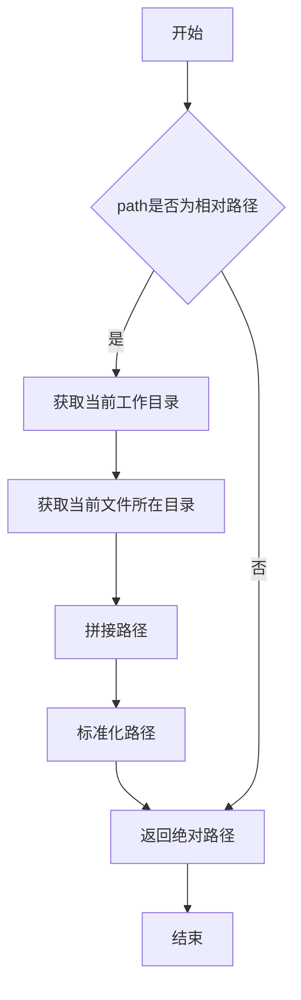
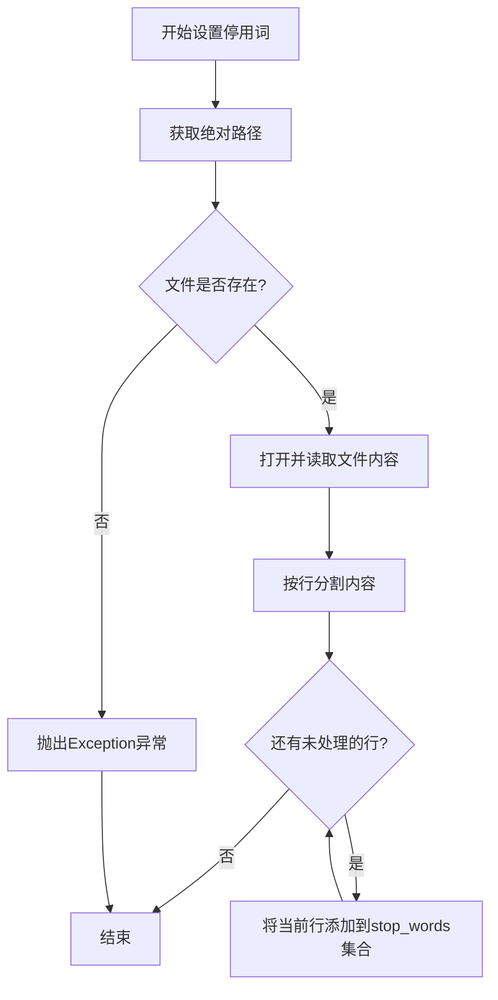
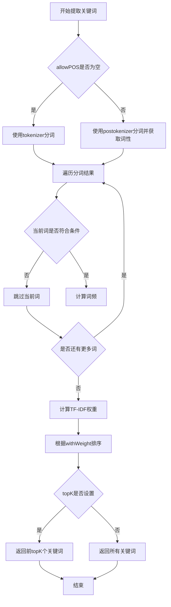
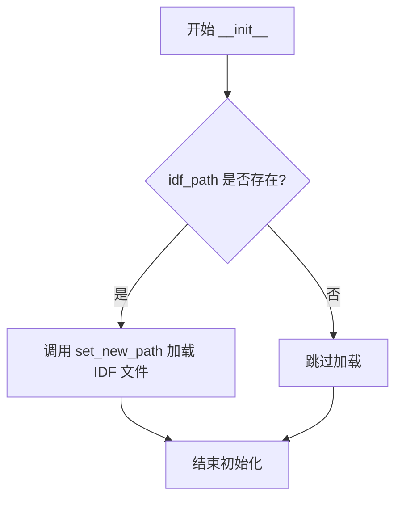
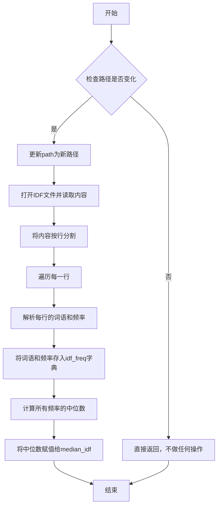
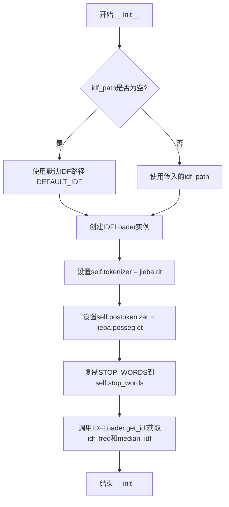
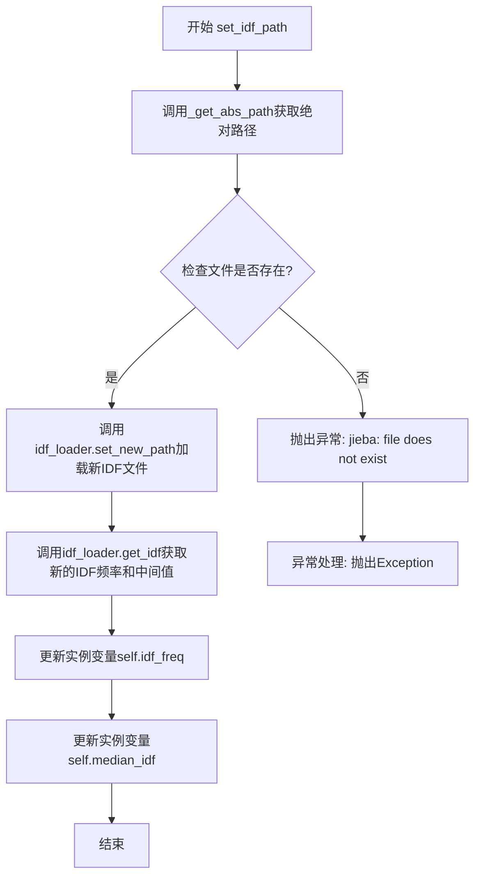
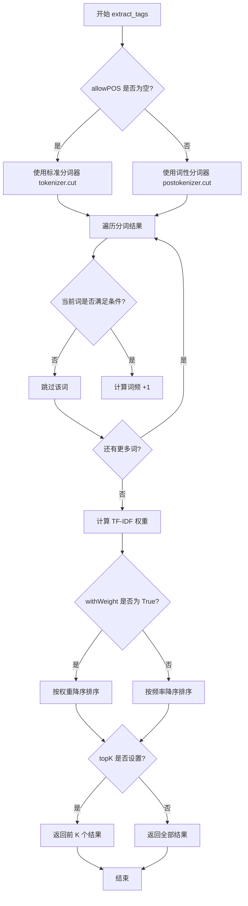

```mermaid
flowchart TD
    A[开始: 输入相对路径 path] --> B[获取当前工作目录 os.getcwd]
    B --> C[获取模块文件所在目录 os.path.dirname&#40;__file__&#41;]
    C --> D[拼接路径 os.path.join&#40;cwd, 模块目录, path&#41;]
    D --> E[规范化路径 os.path.normpath]
    E --> F[返回绝对路径]
    
    style A fill:#e1f5fe
    style F fill:#e8f5e8
```

# `jieba\jieba\analyse\tfidf.py` 详细设计文档

这是jieba分词库的TF-IDF关键词提取模块，通过计算词频(TF)和逆文档频率(IDF)来提取文本中的关键词，支持停用词过滤、词性过滤和权重返回。

## 整体流程

```mermaid
graph TD
    A[开始] --> B[创建/加载IDFLoader]
    B --> C[调用extract_tags方法]
C --> D{是否指定allowPOS?}
D -- 是 --> E[使用postokenizer分词]
D -- 否 --> F[使用tokenizer分词]
E --> G[遍历分词结果]
F --> G
G --> H{检查停用词和词长}
H -- 通过 --> I[计算词频]
H -- 过滤 --> G
I --> J{还有更多词?}
J -- 是 --> G
J -- 否 --> K[计算TF-IDF权重]
K --> L{withWeight=True?}
L -- 是 --> M[返回(word, weight)列表]
L -- 否 --> N[返回word列表]
M --> O{topK设置?}
N --> O
O -- 是 --> P[返回前topK个]
O -- 否 --> Q[返回全部]
P --> R[结束]
Q --> R
```

## 类结构

```
KeywordExtractor (抽象基类)
└── TFIDF (TF-IDF关键词提取实现)
IDFLoader (IDF文件加载器)
```

## 全局变量及字段


### `_get_module_path`
    
获取模块内资源路径的lambda函数

类型：`function`
    


### `_get_abs_path`
    
从jieba导入的获取绝对路径函数

类型：`function`
    


### `DEFAULT_IDF`
    
默认IDF文件路径常量

类型：`str`
    


### `KeywordExtractor.STOP_WORDS`
    
类级别停用词集合(类变量)

类型：`set`
    


### `KeywordExtractor.stop_words`
    
实例级别停用词集合

类型：`set`
    


### `KeywordExtractor.set_stop_words`
    
设置停用词文件

类型：`method`
    


### `KeywordExtractor.extract_tags`
    
提取关键词的抽象方法

类型：`method`
    


### `IDFLoader.path`
    
IDF文件路径

类型：`str`
    


### `IDFLoader.idf_freq`
    
词到IDF值的映射字典

类型：`dict`
    


### `IDFLoader.median_idf`
    
IDF值的中位数

类型：`float`
    


### `IDFLoader.__init__`
    
构造函数

类型：`method`
    


### `IDFLoader.set_new_path`
    
设置新的IDF文件路径并重新加载

类型：`method`
    


### `IDFLoader.get_idf`
    
返回(idf_freq, median_idf)元组

类型：`method`
    


### `TFIDF.tokenizer`
    
jieba默认分词器

类型：`object`
    


### `TFIDF.postokenizer`
    
jieba词性标注分词器

类型：`object`
    


### `TFIDF.stop_words`
    
停用词集合(从STOP_WORDS复制)

类型：`set`
    


### `TFIDF.idf_loader`
    
IDF文件加载器实例

类型：`IDFLoader`
    


### `TFIDF.idf_freq`
    
词到IDF值的映射字典

类型：`dict`
    


### `TFIDF.median_idf`
    
IDF值的中位数

类型：`float`
    


### `TFIDF.__init__`
    
构造函数，初始化分词器和IDF加载器

类型：`method`
    


### `TFIDF.set_idf_path`
    
设置自定义IDF文件路径

类型：`method`
    


### `TFIDF.extract_tags`
    
提取关键词的核心方法

类型：`method`
    
    

## 全局函数及方法


### `_get_module_path`

将相对路径转换为模块内的绝对路径，通过结合当前工作目录、模块文件所在目录和传入的相对路径，计算出资源文件的完整路径。

参数：

- `path`：`str`，需要转换的相对路径（如文件名或子目录路径）

返回值：`str`，转换后的模块内绝对路径

#### 流程图



#### 带注释源码

```python
# 定义一个lambda函数，用于获取模块内的绝对路径
# 参数:
#   - path: str, 相对路径（如资源文件名）
# 返回值:
#   - str, 规范化后的绝对路径
_get_module_path = lambda path: os.path.normpath(  # 规范化路径（处理..、.等）
    os.path.join(  # 拼接路径组件
        os.getcwd(),               # 获取当前工作目录
        os.path.dirname(__file__), # 获取当前模块文件所在的目录
        path                       # 要转换的相对路径
    )
)
```

#### 设计说明

| 项目 | 说明 |
|------|------|
| **设计目标** | 解决资源文件路径依赖问题，确保在任意工作目录下运行都能正确找到模块内置的资源文件（如idf.txt） |
| **实现原理** | 利用`__file__`获取当前模块文件的实际位置，结合`os.getcwd()`确保路径的完整性 |
| **依赖模块** | `os` - 操作系统路径处理标准库 |
| **调用场景** | 在模块初始化时获取默认idf.txt等内置资源文件的完整路径 |


### `_get_abs_path`

该函数是 jieba 分词库中的路径转换工具，用于将相对路径转换为绝对路径，确保资源文件的正确加载。

参数：

-  `path`：`str`，需要转换的相对路径或文件名

返回值：`str`，转换后的绝对路径

#### 流程图



#### 带注释源码

```python
# 从jieba模块导入_get_abs_path函数
# 该函数在jieba库内部实现，这里展示的是其典型的使用方式
_get_abs_path = jieba._get_abs_path

# 示例用法1：在KeywordExtractor.set_stop_words中使用
abs_path = _get_abs_path(stop_words_path)  # 将相对路径转为绝对路径
if not os.path.isfile(abs_path):  # 检查文件是否存在
    raise Exception("jieba: file does not exist: " + abs_path)

# 示例用法2：在TFIDF.set_idf_path中使用
new_abs_path = _get_abs_path(idf_path)  # 将相对路径转为绝对路径
if not os.path.isfile(new_abs_path):  # 检查文件是否存在
    raise Exception("jieba: file does not exist: " + new_abs_path)

# 补充：类似的路径处理lambda示例（用于对比理解）
_get_module_path = lambda path: os.path.normpath(os.path.join(
    os.getcwd(),                        # 获取当前工作目录
    os.path.dirname(__file__),          # 获取当前文件所在目录
    path                                # 相对路径
))
```

> **注意**：`_get_abs_path` 函数的实际实现位于 jieba 库内部（`jieba/_init__.py`），该函数通过 `os.path.abspath()` 或类似逻辑将传入的相对路径转换为绝对路径，确保无论程序从哪个工作目录运行，都能正确找到资源文件。


### `KeywordExtractor.set_stop_words`

设置停用词文件路径，读取停用词文件内容并将其添加到实例的停用词集合中。

参数：
- `stop_words_path`：`str`，停用词文件的路径

返回值：`None`，无返回值描述

#### 流程图



#### 带注释源码

```python
def set_stop_words(self, stop_words_path):
    """
    设置停用词文件路径，读取停用词并添加到实例的stop_words集合中
    
    参数:
        stop_words_path: 停用词文件的相对或绝对路径
    
    返回值:
        None
    
    异常:
        如果文件不存在则抛出Exception
    """
    # 将传入的路径转换为绝对路径
    abs_path = _get_abs_path(stop_words_path)
    
    # 检查文件是否存在，不存在则抛出异常
    if not os.path.isfile(abs_path):
        raise Exception("jieba: file does not exist: " + abs_path)
    
    # 以二进制模式读取文件内容并解码为UTF-8字符串
    content = open(abs_path, 'rb').read().decode('utf-8')
    
    # 遍历文件的每一行
    for line in content.splitlines():
        # 将每行添加到实例的stop_words集合中
        self.stop_words.add(line)
```


### `KeywordExtractor.extract_tags`

该方法是 `KeywordExtractor` 抽象基类中定义的提取关键词的抽象方法，声明了 TF-IDF 关键词提取器的接口规范，具体实现由子类（如 `TFIDF`）完成。该方法接收待处理文本及相关配置参数，通过分词、词性过滤、停用词过滤、词频统计和 IDF 加权计算，最终返回排序后的关键词列表。

#### 参数

- `*args`：可变位置参数，用于接收位置参数（具体由子类实现定义）
- `**kwargs`：可变关键字参数，用于接收关键字参数（具体由子类实现定义）
- **注意**：由于这是抽象方法，实际参数由子类 `TFIDF.extract_tags` 实现，参数如下：
  - `sentence`：`str`，待提取关键词的文本内容
  - `topK`：`int`，返回前 K 个最相关的关键词，默认为 20
  - `withWeight`：`bool`，是否返回关键词及其权重，默认为 False
  - `allowPOS`：`tuple` 或 `frozenset`，允许的词性列表，用于过滤不符合词性的词，默认为空元组
  - `withFlag`：`bool`，是否返回词性标记，默认为 False

#### 返回值

- **抽象方法声明**：`list`，由子类实现决定具体的返回类型
- **TFIDF 实现**：
  - 当 `withWeight=True` 时：返回 `list[tuple]` 形式的列表，每个元素为 `(关键词, 权重)` 元组
  - 当 `withWeight=False` 时：返回 `list[str]` 形式的列表，仅包含关键词
  - 当 `allowPOS` 不为空且 `withFlag=True` 时：返回包含词性标记的元组列表

#### 流程图



#### 带注释源码

```python
def extract_tags(self, *args, **kwargs):
    """
    提取关键词的抽象方法
    
    该方法定义了在 KeywordExtractor 基类中，用于从文本中提取关键词的接口。
    具体的实现由子类完成，例如 TFIDF 类实现了基于 TF-IDF 算法的关键词提取。
    
    参数:
        *args: 可变位置参数，具体由子类实现定义
        **kwargs: 可变关键字参数，具体由子类实现定义
    
    返回:
        list: 由子类实现定义具体的返回值类型
    
     Raises:
        NotImplementedError: 当子类未实现该方法时抛出
    """
    raise NotImplementedError
```


### `IDFLoader.__init__`

这是 `IDFLoader` 类的构造函数，用于初始化 IDF（逆文档频率）加载器实例。构造函数接收一个可选的 IDF 文件路径参数，如果提供则调用 `set_new_path` 方法加载 IDF 词典数据，否则使用空值初始化成员变量。

参数：

- `idf_path`：`str | None`，可选参数，指定 IDF 词典文件的路径。如果为 `None` 或未提供，则不加载任何 IDF 数据

返回值：无（`None`），构造函数不返回任何值

#### 流程图



#### 带注释源码

```python
def __init__(self, idf_path=None):
    """
    IDFLoader 构造函数
    
    参数:
        idf_path: str, optional - IDF 词典文件路径，默认值为 None
    """
    # 初始化实例变量：存储当前 IDF 文件路径
    self.path = ""
    
    # 初始化实例变量：存储词频字典，键为词语，值为 IDF 值
    self.idf_freq = {}
    
    # 初始化实例变量：存储 IDF 中位数，用于处理未登录词
    self.median_idf = 0.0
    
    # 如果传入了 IDF 文件路径，则调用 set_new_path 加载词典
    if idf_path:
        self.set_new_path(idf_path)
```


### `IDFLoader.set_new_path`

设置新的IDF文件路径，读取IDF文件内容并重新构建IDF词频字典，同时计算新的中位数IDF值。

参数：

- `new_idf_path`：`str`，新的IDF文件路径

返回值：`None`，无返回值，该方法直接修改对象内部状态

#### 流程图



#### 带注释源码

```python
def set_new_path(self, new_idf_path):
    """
    设置新的IDF文件路径并重新加载IDF词频数据
    
    参数:
        new_idf_path: str, 新的IDF文件路径
    
    返回:
        None
    """
    # 仅当路径发生变化时才执行重新加载操作，避免不必要的I/O操作
    if self.path != new_idf_path:
        # 更新内部存储的路径
        self.path = new_idf_path
        
        # 以二进制模式读取IDF文件并解码为UTF-8字符串
        content = open(new_idf_path, 'rb').read().decode('utf-8')
        
        # 清空之前的IDF词频字典
        self.idf_freq = {}
        
        # 逐行处理IDF文件
        for line in content.splitlines():
            # 去除首尾空白后，按空格分割获取词语和频率
            word, freq = line.strip().split(' ')
            # 将频率转换为浮点数并存储到字典中
            self.idf_freq[word] = float(freq)
        
        # 对所有IDF值进行排序，计算中位数
        # 用于处理不在IDF字典中的词语
        self.median_idf = sorted(
            self.idf_freq.values())[len(self.idf_freq) // 2]
```


### IDFLoader.get_idf

该方法用于获取 IDF（逆文档频率）词频字典及其中位数 IDF 值，是 IDFLoader 类的核心数据访问接口，直接返回实例内部维护的词频统计信息和统计指标，无需任何输入参数。

参数：

- （无参数，仅包含隐式 self 参数）

返回值：`tuple`，返回包含两个元素的元组 `(idf_freq, median_idf)`：
- `idf_freq`：`dict`，键为词语（str 类型），值为对应的 IDF 频率（float 类型）
- `median_idf`：`float`，所有词语 IDF 频率的中位数

#### 流程图

```mermaid
flowchart TD
    A[开始 get_idf] --> B{方法调用}
    B --> C[返回 self.idf_freq]
    B --> D[返回 self.median_idf]
    C --> E[组成元组 (idf_freq, median_idf)]
    D --> E
    E --> F[结束]
    
    style A fill:#e1f5fe
    style F fill:#e8f5e8
```

#### 带注释源码

```python
def get_idf(self):
    """
    获取 IDF 词频字典及其中位数 IDF 值。
    
    该方法直接返回 IDFLoader 实例在初始化或调用 set_new_path 时
    解析并计算得到的 IDF 词频字典及其统计指标，供外部调用者使用。
    
    返回值:
        tuple: 包含两个元素的元组
            - idf_freq (dict): 词语到 IDF 频率的映射字典
            - median_idf (float): 所有 IDF 频率的中位数
    
    示例:
        >>> loader = IDFLoader('/path/to/idf.txt')
        >>> idf_freq, median_idf = loader.get_idf()
        >>> print(f"词频字典包含 {len(idf_freq)} 个词条")
        >>> print(f"中位数 IDF: {median_idf}")
    """
    # 直接返回内部维护的 IDF 词频字典和中位数 IDF 值
    # 无需任何参数处理或计算，O(1) 时间复杂度
    return self.idf_freq, self.median_idf
```


### `TFIDF.__init__`

初始化TFIDF分词器，加载IDF词典和停用词表，准备TF-IDF关键词提取所需的分词器和统计信息。

参数：

- `idf_path`：`str` 或 `None`，可选参数，指定IDF词典文件路径，默认为`None`（使用默认IDF文件）

返回值：`None`，构造函数不返回任何值

#### 流程图



#### 带注释源码

```python
def __init__(self, idf_path=None):
    """
    初始化TFIDF分词器，加载IDF词典和停用词表
    
    参数:
        idf_path: str 或 None, IDF词典文件路径，默认为None使用内置DEFAULT_IDF
    """
    # 设置默认分词器，使用jieba.dt（默认分词器实例）
    self.tokenizer = jieba.dt
    
    # 设置词性分词器，用于支持词性标注的关键词提取
    self.postokenizer = jieba.posseg.dt
    
    # 复制父类KeywordExtractor的停用词集合，避免修改类属性
    self.stop_words = self.STOP_WORDS.copy()
    
    # 创建IDF加载器，如果idf_path为None则使用默认IDF文件路径
    # DEFAULT_IDF指向jieba库的idf.txt文件
    self.idf_loader = IDFLoader(idf_path or DEFAULT_IDF)
    
    # 从IDF加载器获取IDF频率字典和IDF中位数
    # idf_freq: dict, 存储每个词的IDF权重
    # median_idf: float, 所有词IDF值的中位数，用于处理未登录词
    self.idf_freq, self.median_idf = self.idf_loader.get_idf()
```


### `TFIDF.set_idf_path`

设置自定义IDF（逆文档频率）文件路径，用于更新TF-IDF计算所需的IDF词典和 IDF中位数。

参数：

- `idf_path`：`str`，自定义IDF文件的路径，可以是相对路径或绝对路径

返回值：`None`，该方法没有返回值（返回None）

#### 流程图



#### 带注释源码

```python
def set_idf_path(self, idf_path):
    """
    设置自定义IDF文件路径
    
    参数:
        idf_path: 自定义IDF文件的路径（相对路径或绝对路径）
    
    返回:
        None
    
    异常:
        Exception: 当IDF文件不存在时抛出
    """
    # 将传入的路径转换为绝对路径
    new_abs_path = _get_abs_path(idf_path)
    
    # 检查文件是否存在，如果不存在则抛出异常
    if not os.path.isfile(new_abs_path):
        raise Exception("jieba: file does not exist: " + new_abs_path)
    
    # 调用IDF加载器的set_new_path方法加载新的IDF文件
    self.idf_loader.set_new_path(new_abs_path)
    
    # 从IDF加载器获取更新后的IDF频率字典和IDF中位数
    # 并更新TFIDF实例的实例变量
    self.idf_freq, self.median_idf = self.idf_loader.get_idf()
```


### `TFIDF.extract_tags`

该方法是TFIDF类的核心方法，通过TF-IDF算法从给定的句子中提取关键词，支持按词性过滤、返回权重、前K个结果等功能。

参数：

- `sentence`：`str`，待提取关键词的输入句子
- `topK`：`int`，返回前K个最相关的关键词，默认为20；设为None时返回所有可能的词
- `withWeight`：`bool`，是否返回关键词及其权重，True返回列表[(word, weight), ...]，False返回纯词列表，默认为False
- `allowPOS`：`tuple`，允许的词性列表，如('ns', 'n', 'vn', 'v', 'nr')，用于过滤不符合词性的词，默认为空元组表示不过滤
- `withFlag`：`bool`，是否返回词性标记，仅在allowPOS不为空时生效，True返回(word, weight)对，False只返回词，默认为False

返回值：`list`，返回关键词列表。当withWeight=True时返回`[(word, weight), ...]`，否则返回`[word, ...]`

#### 流程图



#### 带注释源码

```python
def extract_tags(self, sentence, topK=20, withWeight=False, allowPOS=(), withFlag=False):
    """
    Extract keywords from sentence using TF-IDF algorithm.
    Parameter:
        - topK: return how many top keywords. `None` for all possible words.
        - withWeight: if True, return a list of (word, weight);
                      if False, return a list of words.
        - allowPOS: the allowed POS list eg. ['ns', 'n', 'vn', 'v','nr'].
                    if the POS of w is not in this list,it will be filtered.
        - withFlag: only work with allowPOS is not empty.
                    if True, return a list of pair(word, weight) like posseg.cut
                    if False, return a list of words
    """
    # 根据是否需要词性过滤选择分词器
    if allowPOS:
        allowPOS = frozenset(allowPOS)  # 转换为frozenset提高查找效率
        words = self.postokenizer.cut(sentence)  # 使用词性分词器
    else:
        words = self.tokenizer.cut(sentence)  # 使用标准分词器
    
    freq = {}  # 存储词频
    
    # 遍历所有分词结果
    for w in words:
        # 如果指定了词性列表，进行词性过滤
        if allowPOS:
            if w.flag not in allowPOS:
                continue  # 跳过不符合词性的词
            elif not withFlag:
                w = w.word  # 不需要词性标记时，只取词本身
        
        # 获取用于计数的词
        wc = w.word if allowPOS and withFlag else w
        
        # 过滤条件：词长度小于2 或 是停用词
        if len(wc.strip()) < 2 or wc.lower() in self.stop_words:
            continue
        
        # 词频累加
        freq[w] = freq.get(w, 0.0) + 1.0
    
    # 计算总词频
    total = sum(freq.values())
    
    # 计算 TF-IDF 权重：freq * idf / total
    for k in freq:
        kw = k.word if allowPOS and withFlag else k
        # 使用词对应的IDF值，如果不存在则使用中位数IDF
        freq[k] *= self.idf_freq.get(kw, self.median_idf) / total
    
    # 根据 withWeight 参数决定排序方式
    if withWeight:
        # 返回 (word, weight) 元组列表，按权重降序
        tags = sorted(freq.items(), key=itemgetter(1), reverse=True)
    else:
        # 只返回词列表，按权重降序（但忽略权重值）
        tags = sorted(freq, key=freq.__getitem__, reverse=True)
    
    # 根据 topK 参数决定返回结果数量
    if topK:
        return tags[:topK]  # 返回前K个
    else:
        return tags  # 返回全部
```

## 关键组件


### 一段话描述

该代码实现了一个基于TF-IDF算法的关键词提取工具，通过jieba分词库进行中文分词，结合IDF（逆文档频率）权重计算，从给定文本中提取最具代表性的关键词，支持停用词过滤、词性筛选、权重返回等多种功能。

### 文件的整体运行流程

1. **初始化阶段**：创建TFIDF实例时，自动加载默认IDF文件，初始化分词器、停用词集合和IDF加载器
2. **配置阶段**：可通过`set_idf_path`方法更换IDF文件，通过`set_stop_words`方法添加自定义停用词
3. **提取阶段**：调用`extract_tags`方法，对输入句子进行分词、词性过滤、停用词过滤、词频统计、TF-IDF权重计算，最后排序返回结果
4. **结果返回**：根据参数返回TopK个关键词或全部关键词，可选择是否包含权重信息

### 类的详细信息

#### 类：KeywordExtractor

**描述**：关键词提取器的抽象基类，定义了基本的接口和停用词集合

**类字段**：
| 名称 | 类型 | 描述 |
|------|------|------|
| STOP_WORDS | set | 英文停用词集合，包含常见的英文停用词 |

**类方法**：
| 名称 | 参数 | 参数类型 | 参数描述 | 返回值类型 | 返回值描述 |
|------|------|----------|----------|------------|------------|
| set_stop_words | stop_words_path | str | 停用词文件路径 | None | 无返回值，将文件中的词添加到停用词集合 |
| extract_tags | *args, **kwargs | 可变参数 | 子类实现的具体参数 | NotImplementedError | 抽象方法，抛出未实现异常 |

---

#### 类：IDFLoader

**描述**：IDF文件加载器，负责读取和解析IDF文件，计算IDF值和中位数IDF

**类字段**：
| 名称 | 类型 | 描述 |
|------|------|------|
| path | str | 当前IDF文件路径 |
| idf_freq | dict | 存储词到IDF频率的映射字典 |
| median_idf | float | IDF值的中位数，用于处理未登录词 |

**类方法**：
| 名称 | 参数 | 参数类型 | 参数描述 | 返回值类型 | 返回值描述 |
|------|------|----------|----------|------------|------------|
| __init__ | idf_path | str | IDF文件路径，可选参数 | None | 初始化IDF加载器，若提供路径则加载 |
| set_new_path | new_idf_path | str | 新的IDF文件路径 | None | 重新加载IDF文件，更新idf_freq和median_idf |
| get_idf | 无 | 无 | 无 | tuple | 返回(idf_freq字典, median_idf值)的元组 |

**带注释源码**：
```python
class IDFLoader(object):

    def __init__(self, idf_path=None):
        self.path = ""
        self.idf_freq = {}
        self.median_idf = 0.0
        if idf_path:
            self.set_new_path(idf_path)

    def set_new_path(self, new_idf_path):
        if self.path != new_idf_path:  # 避免重复加载相同路径
            self.path = new_idf_path
            # 读取IDF文件并解码为UTF-8
            content = open(new_idf_path, 'rb').read().decode('utf-8')
            self.idf_freq = {}
            # 按行解析IDF文件，格式为"词 IDF值"
            for line in content.splitlines():
                word, freq = line.strip().split(' ')
                self.idf_freq[word] = float(freq)
            # 计算IDF值的中位数
            self.median_idf = sorted(
                self.idf_freq.values())[len(self.idf_freq) // 2]

    def get_idf(self):
        return self.idf_freq, self.median_idf
```

---

#### 类：TFIDF

**描述**：TF-IDF关键词提取器的具体实现类，继承自KeywordExtractor，实现了从文本中提取关键词的核心功能

**类字段**：
| 名称 | 类型 | 描述 |
|------|------|------|
| tokenizer | object | jieba分词器主对象，用于基本分词 |
| postokenizer | object | jieba词性分词器，用于带词性的分词 |
| stop_words | set | 停用词集合，可动态添加 |
| idf_loader | IDFLoader | IDF加载器实例 |
| idf_freq | dict | 词到IDF值的映射字典 |
| median_idf | float | IDF中位数，用于未登录词 |

**类方法**：
| 名称 | 参数 | 参数类型 | 参数描述 | 返回值类型 | 返回值描述 |
|------|------|----------|----------|------------|------------|
| __init__ | idf_path | str | IDF文件路径，默认使用DEFAULT_IDF | None | 初始化TF-IDF提取器，加载IDF文件 |
| set_idf_path | idf_path | str | 新的IDF文件路径 | None | 动态更换IDF文件 |
| extract_tags | sentence, topK, withWeight, allowPOS, withFlag | str, int, bool, tuple, bool | 句子文本、返回前K个、是否带权重、允许的词性列表、是否返回词性标记 | list | 返回关键词列表或(词,权重)元组列表 |

**带注释源码**：
```python
class TFIDF(KeywordExtractor):

    def __init__(self, idf_path=None):
        self.tokenizer = jieba.dt  # 获取jieba默认分词器
        self.postokenizer = jieba.posseg.dt  # 获取jieba词性分词器
        self.stop_words = self.STOP_WORDS.copy()  # 复制默认停用词
        self.idf_loader = IDFLoader(idf_path or DEFAULT_IDF)  # 加载IDF文件
        self.idf_freq, self.median_idf = self.idf_loader.get_idf()  # 获取IDF数据

    def set_idf_path(self, idf_path):
        new_abs_path = _get_abs_path(idf_path)
        if not os.path.isfile(new_abs_path):
            raise Exception("jieba: file does not exist: " + new_abs_path)
        self.idf_loader.set_new_path(new_abs_path)
        self.idf_freq, self.median_idf = self.idf_loader.get_idf()

    def extract_tags(self, sentence, topK=20, withWeight=False, allowPOS=(), withFlag=False):
        """
        Extract keywords from sentence using TF-IDF algorithm.
        Parameter:
            - topK: return how many top keywords. `None` for all possible words.
            - withWeight: if True, return a list of (word, weight);
                          if False, return a list of words.
            - allowPOS: the allowed POS list eg. ['ns', 'n', 'vn', 'v','nr'].
                        if the POS of w is not in this list,it will be filtered.
            - withFlag: only work with allowPOS is not empty.
                        if True, return a list of pair(word, weight) like posseg.cut
                        if False, return a list of words
        """
        # 根据是否需要词性筛选选择分词器
        if allowPOS:
            allowPOS = frozenset(allowPOS)  # 转换为frozenset提高查询效率
            words = self.postokenizer.cut(sentence)
        else:
            words = self.tokenizer.cut(sentence)
        
        freq = {}  # 词频统计字典
        for w in words:
            if allowPOS:
                if w.flag not in allowPOS:  # 词性过滤
                    continue
                elif not withFlag:
                    w = w.word  # 提取词本身
            
            # 根据条件提取词或词+词性
            wc = w.word if allowPOS and withFlag else w
            
            # 过滤条件：长度小于2或为停用词
            if len(wc.strip()) < 2 or wc.lower() in self.stop_words:
                continue
            freq[w] = freq.get(w, 0.0) + 1.0  # 词频累加
        
        total = sum(freq.values())  # 总词频
        
        # 计算TF-IDF权重
        for k in freq:
            kw = k.word if allowPOS and withFlag else k
            # TF-IDF = TF * IDF，其中IDF使用中位数处理未登录词
            freq[k] *= self.idf_freq.get(kw, self.median_idf) / total

        # 排序：按权重降序
        if withWeight:
            tags = sorted(freq.items(), key=itemgetter(1), reverse=True)
        else:
            tags = sorted(freq, key=freq.__getitem__, reverse=True)
        
        # 返回TopK结果或全部结果
        if topK:
            return tags[:topK]
        else:
            return tags
```

---

### 全局变量和全局函数

| 名称 | 类型 | 描述 |
|------|------|------|
| _get_module_path | function | 获取模块内文件绝对路径的Lambda函数 |
| _get_abs_path | function | jieba库内置的路径解析函数 |
| DEFAULT_IDF | str | 默认IDF文件路径，指向idf.txt |
| itemgetter | class | operator模块的项获取器，用于排序 |

---

### 关键组件信息

#### TF-IDF算法核心实现

负责计算词的TF-IDF权重，通过词频乘以逆文档频率来评估词的重要程度，是整个模块的核心算法组件。

#### IDF加载与缓存机制

IDFLoader类实现了IDF文件的加载、解析和缓存，通过延迟加载和路径检查避免重复加载，提高性能。

#### 停用词过滤机制

支持英文停用词的内置集合，并通过set_stop_words方法支持自定义停用词文件的动态加载。

#### 词性筛选与过滤

通过allowPOS参数支持基于词性的关键词筛选，提供withFlag选项控制是否在结果中保留词性信息。

---

### 潜在的技术债务或优化空间

1. **文件读取未使用上下文管理器**：直接使用`open()`而未使用`with`语句，可能导致文件句柄泄漏
2. **异常处理不完善**：文件读取、解码、字符串分割等操作缺乏异常捕获，可能导致程序崩溃
3. **编码处理硬编码**：假设所有文件都是UTF-8编码，缺乏灵活性
4. **重复计算问题**：在extract_tags中，对同一词进行了多次属性访问（word、flag），可优化
5. **停用词仅支持英文**：内置STOP_WORDS只有英文停用词，对于中文关键词提取场景支持不足
6. **IDF文件重复加载**：虽然有路径检查，但首次加载时可能读取大文件，影响启动性能
7. **内存占用**：idf_freq字典存储所有词的IDF值，对于大规模词表可能占用较多内存

---

### 其它项目

#### 设计目标与约束

- **目标**：提供一个轻量级、易用的中文TF-IDF关键词提取工具
- **约束**：依赖jieba分词库，需要IDF词表文件支持
- **性能考虑**：通过中位数IDF处理未登录词，避免OOV问题

#### 错误处理与异常设计

- 文件不存在时抛出Exception
- 未实现的抽象方法抛出NotImplementedError
- 缺乏对空输入、非法参数的类型检查和健壮性处理

#### 数据流与状态机

1. **输入**：原始句子字符串 + 提取参数配置
2. **处理流程**：分词 → 词性过滤 → 停用词过滤 → 词频统计 → TF-IDF计算 → 排序
3. **输出**：排序后的关键词列表或带权重的关键词列表

#### 外部依赖与接口契约

- 依赖jieba库（jieba.dt, jieba.posseg.dt）
- 依赖IDF词表文件（idf.txt）
- 通过KeywordExtractor抽象类定义可扩展接口
- extract_tags方法返回类型根据参数变化，需要调用方注意区分


## 问题及建议


### 已知问题

-   文件资源未正确关闭：IDFLoader.set_new_path和KeywordExtractor.set_stop_words方法中打开文件后未显式关闭，存在资源泄漏风险。
-   异常处理不足：文件读取时未处理编码错误或文件不存在等异常，可能导致程序崩溃。
-   抽象方法定义不当：KeywordExtractor.extract_tags使用raise NotImplementedError而非abc.abstractmethod，不够规范。
-   代码逻辑复杂且易错：TFIDF.extract_tags中对于allowPOS和withFlag的处理逻辑混乱，可能导致类型不一致或错误。
-   依赖外部模块内部函数：_get_abs_path依赖jieba._get_abs_path，可能不够稳定。
-   缺少类型注解和文档：部分方法缺少文档和类型提示，影响可维护性。
-   Python 2兼容性代码：使用了from __future__ import absolute_import，但代码可能运行在Python 3中，可能不需要。
-   median_idf计算未处理空字典情况：当idf_freq为空时，sorted([])会导致IndexError。

### 优化建议

-   使用with语句自动关闭文件，或显式关闭文件。
-   添加异常处理，如try-except块，处理文件读取错误。
-   使用abc模块定义抽象方法。
-   重构extract_tags方法，统一处理words类型，简化逻辑。
-   考虑将_get_abs_path的调用封装为自己的函数，减少对jieba内部模块的依赖。
-   添加类型注解和完整文档字符串。
-   移除Python 2兼容代码，如果项目不需要支持Python 2。
-   在IDFLoader.set_new_path中添加对idf_freq为空的检查，避免计算median_idf时出错。


## 其它


### 设计目标与约束

- **目标**：提供基于 TF‑IDF 算法的关键词抽取功能，支持中文（依赖 jieba 分词）与英文，可自定义停用词、IDF 词典及词性过滤，返回带权重或不带权重的关键词列表。
- **约束**：
  - 必须依赖 `jieba` 库（包括 `jieba.dt`、`jieba.posseg.dt`）进行分词与词性标注。
  - 需要外部 IDF 词典文件（默认 `idf.txt`），文件必须为 UTF‑8 编码的“词 频率”格式。
  - 输入句子只能是 `str` 类型；返回值数量受 `topK` 参数限制（`topK=None` 时返回全部）。
  - 代码兼容 Python 2.7 与 Python 3.x（使用 `from __future__ import absolute_import`）。

### 错误处理与异常设计

- **文件不存在**：`set_stop_words`、`set_idf_path` 在文件路径无效时抛出 `Exception`，错误信息格式为 `"jieba: file does not exist: <path>"`。
- **IDF 文件解析错误**：`IDFLoader.set_new_path` 读取文件后对每一行执行 `line.strip().split(' ')`，若行格式不符合预期（不足两个字段）会抛出 `ValueError`，应在调用层捕获并提示“IDF 文件格式错误”。
- **输入类型错误**：`extract_tags` 接收的 `sentence` 必须为字符串，若传入非字符串应抛出 `TypeError`（当前实现未做显式检查，建议添加）。
- **单词不在 IDF 词典**：使用 `self.idf_freq.get(kw, self.median_idf)` 防止 `KeyError`，保证所有词都有默认权重。

### 数据流与状态机

- **主流程**  
  1. **输入**：待抽取的句子 `sentence`。  
  2. **分词**：若 `allowPOS` 不为空，使用 `postokenizer.cut`（带词性），否则使用 `tokenizer.cut`。  
  3. **过滤**：根据 `allowPOS` 与 `withFlag` 过滤词性；去除停用词、长度小于 2 的词。  
  4. **词频统计**：构建 `freq` 字典，键为词（或词+词性），值为出现次数。  
  5. **TF‑IDF 加权**：每个词的权重 = `freq[word] * (idf / total)`，其中 `idf` 取自 `idf_freq`（缺失时使用 `median_idf`）。  
  6. **排序**：依据权重降序排列。  
  7. **截取**：若 `topK` 大于 0，返回前 `topK` 项；否则返回全部。  

- **状态**  
  - `IDFLoader` 实例维护 `path`、`idf_freq`、`median_idf`，在 `set_new_path` 时更新。  
  - `TFIDF` 实例在初始化时通过 `idf_loader` 加载 IDF，随后可动态更换 IDF（`set_idf_path`），但不影响已有的 `stop_words`。

### 外部依赖与接口契约

| 依赖 | 作用 | 备注 |
|------|------|------|
| `jieba` | 中文分词、词性标注 | 需 `jieba.dt`、`jieba.posseg.dt` |
| `os` | 路径处理 | 用于 `_get_module_path`、`os.path.isfile` |
| `operator.itemgetter` | 排序键函数 | 辅助 `sorted` |
| `idf.txt` | IDF 词典文件 | 必须在运行目录下或通过 `idf_path` 指定 |

- **核心接口**  
  - `KeywordExtractor.set_stop_words(stop_words_path: str) -> None`：加载停用词文件并加入 `self.stop_words`。  
  - `KeywordExtractor.extract_tags(*args, **kwargs) -> list`：抽象方法，子类实现。  
  - `IDFLoader.set_new_path(new_idf_path: str) -> None`：重新加载 IDF，更新 `idf_freq`、`median_idf`。  
  - `TFIDF.extract_tags(sentence: str, topK: int = 20, withWeight: bool = False, allowPOS: tuple = (), withFlag: bool = False) -> list`：返回关键词列表。若 `withWeight=True` 返回 `(word, weight)` 元组；否则返回 `word`（或 `(word, flag)` 当 `withFlag=True`）。  

- **合约**：  
  - 输入 `sentence` 必须为 `str`；若 `allowPOS` 为空，则 `withFlag` 必须为 `False`。  
  - 当 `topK` 为 `0` 或 `None` 时返回全部已计算出的关键词。  
  - 所有文件路径均使用 UTF‑8 编码。

### 性能考虑

- **时间复杂度**：分词 O(L)（L 为句子长度），词频统计 O(N)（N 为词数），排序 O(N log N)。整体约为 O(N log N)。  
- **空间复杂度**：IDF 词典占用 O(M)（M 为词典词数），词频字典占用 O(N)。  
- **优化建议**：  
  - 使用 `collections.Counter` 替代手动 `freq` 累加，可略微提升计数效率。  
  - IDF 词典只在初始化或显式调用 `set_idf_path` 时加载，避免重复读取。  
  - `median_idf` 只在词典更新时重新计算一次。

### 线程安全与并发

- `IDFLoader` 与 `TFIDF` 实例本身不保存可变状态（除 `idf_freq`、`median_idf`），在实例创建后只读。  
- 全局 `jieba.dt` 与 `jieba.posseg.dt` 在首次初始化后可在多线程间共享，jieba 官方说明其为线程安全。  
- 若在运行时调用 `set_idf_path` 替换 IDF，建议在单线程或加锁环境下完成，以免出现读取到不完整的 `idf_freq`。

### 可配置性与扩展性

- **停用词**：通过 `set_stop_words` 动态加载外部停用词文件。  
- **IDF 词典**：通过 `set_idf_path` 更换不同的 IDF 词典（如针对特定领域的权重）。  
- **词性过滤**：`allowPOS` 参数允许只保留感兴趣的名词、动词等。  
- **返回形式**：`withWeight`、`withFlag` 组合可得到不同返回结构，便于下游任务（排序、可视化）。  
- **扩展**：可通过继承 `KeywordExtractor` 实现 `TextRank`、`LDA` 等其他抽取算法，只需实现 `extract_tags`。

### 安全性

- **路径遍历**：若用户传入 `stop_words_path` 或 `idf_path`，需校验路径是否为合法文件路径（不使用用户直接控制的绝对路径）。建议使用 `os.path.abspath` 并检查是否在预期目录内。  
- **文件读取**：使用二进制模式 `'rb'` 读取后再以 UTF‑8 解码，可防止因默认编码导致的异常。  
- **输入清洗**：虽然仅做分词与统计，但仍建议在日志中记录异常输入，以便审计。

### 可测试性

- **单元测试**：  
  - `IDFLoader` 可使用临时文件模拟 IDF 加载，验证 `idf_freq` 与 `median_idf` 计算正确性。  
  - `TFIDF.extract_tags` 可使用已知句子与固定 IDF，检验返回关键词数量、权重排序是否符合预期。  
- **停用词测试**：构造包含停用词的句子，验证过滤后不出现停用词。  
- **异常路径**：传入不存在的文件、非字符串输入，捕获并检查异常信息。

### 版本兼容性

- **Python**：代码兼容 Python 2.7+ 与 Python 3.5+（得益于 `from __future__ import absolute_import` 与 `print` 函数的使用）。  
- **jieba**：推荐使用 jieba ≥ 0.39，以确保 `jieba.dt`、`jieba.posseg.dt` 接口稳定。  
- **依赖**：仅依赖标准库与 jieba，无其他第三方库。

### 使用示例

```python
# -*- coding: utf-8 -*-
import jieba
from jieba.analyse import TFIDF

# 创建 TFIDF 实例（默认加载 jieba 提供的 idf.txt）
tfidf = TFIDF()

# 待抽取的中文句子
sentence = "自然语言处理是人工智能领域的重要方向"

# 抽取前 5 个带权重的关键词
keywords = tfidf.extract_tags(sentence, topK=5, withWeight=True)
print(keywords)
# 输出示例：[('自然语言处理', 12.5), ('人工智能', 9.8), ...]

# 仅抽取名词、动词，并返回词性标志
keywords_with_flag = tfidf.extract_tags(sentence, topK=5, allowPOS=('ns','n','v','vn'), withFlag=True)
print(keywords_with_flag)
```

### 部署与环境需求

- **运行时**：Python 2.7+ / 3.5+。  
- **依赖库**：`jieba`（`pip install jieba`）。  
- **资源文件**：同目录下需有 `idf.txt`（可从 jieba 包中复制）或通过 `idf_path` 指定路径。  
- **部署方式**：可直接打包为模块上传至 PyPI，或作为子项目嵌入到其他业务服务中。

### 监控与日志

- 目前代码未实现日志记录，建议在关键异常路径（如文件加载失败、IDF 解析错误）加入 `logging.warning`，帮助运维定位问题。  
- 可在 `extract_tags` 入口处记录输入句子长度、分词后词数等指标，用于后续性能监控。

### 数据持久化与存储

- 本模块不涉及持久化，所有状态均为内存中的 `idf_freq`、`stop_words`。  
- 如需持久化抽取结果，可将返回的关键词列表写入文件或数据库，格式自行决定（如 JSON、CSV）。

### 版权与许可证

- 本代码来源于 jieba 项目，采用 **MIT 许可证**（详见 jieba 官方仓库）。使用时请遵守相应许可证条款。

### 参考文献

- 结巴中文分词库：<https://github.com/fxsjy/jieba>  
- TF-IDF 算法：Salton, G., & McGill, M. J. (1983). *Introduction to Modern Information Retrieval*. McGraw-Hill.  
- Python 官方文档：<https://docs.python.org/3/>

    