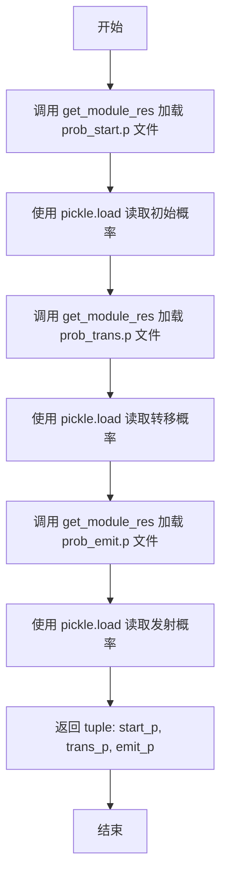
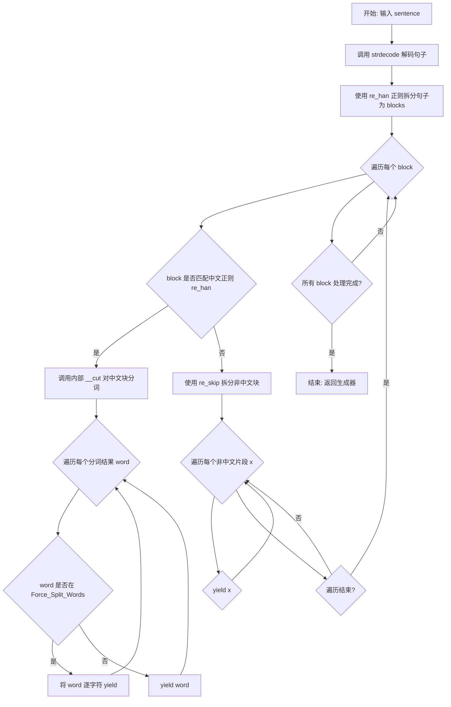
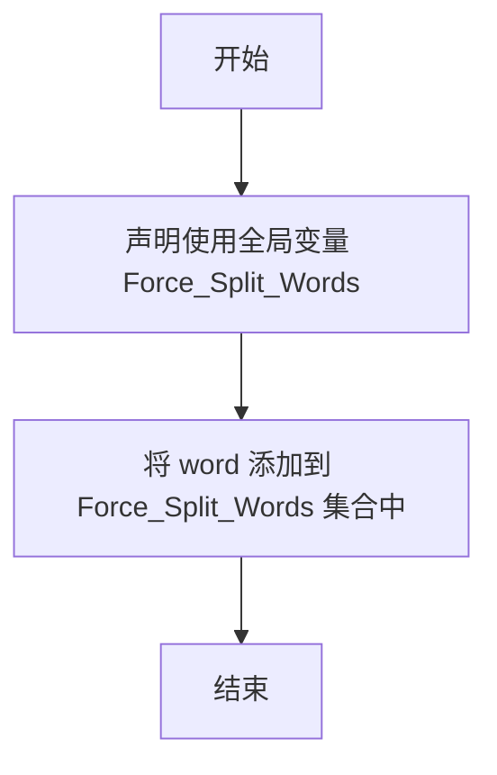

# `jieba\jieba\finalseg\__init__.py` 详细设计文档

这是一个基于隐马尔可夫模型(HMM)的中文分词模块，使用Viterbi算法进行最优路径求解，实现对中文句子的精准分词，支持强制分割词配置。

## 整体流程

```mermaid
graph TD
    A[开始分词] --> B[字符串解码]
B --> C[正则分割句子为汉字块和非汉字块]
C --> D{当前块是否为汉字?}
D -- 否 --> E[使用re_skip进一步分割并yield]
D -- 是 --> F[调用__cut进行HMM分词]
F --> G[Viterbi算法计算最优状态序列]
G --> H[根据状态序列(B/M/E/S)提取词语]
H --> I{检查是否为强制分割词?}
I -- 是 --> J[强制分割为单字]
I -- 否 --> K[yield完整词语]
E --> L[处理下一个块]
J --> L
K --> L
L --> M{还有更多块?}
M -- 是 --> C
M -- 否 --> N[结束]
```

## 类结构

```
无类定义 (模块级函数和全局变量)
```

## 全局变量及字段


### `MIN_FLOAT`
    
负无穷大常数，用于HMM概率计算

类型：`float`
    


### `PROB_START_P`
    
初始概率文件名

类型：`str`
    


### `PROB_TRANS_P`
    
转移概率文件名

类型：`str`
    


### `PROB_EMIT_P`
    
发射概率文件名

类型：`str`
    


### `PrevStatus`
    
状态转移映射表，定义B/M/E/S四种状态的合法前驱状态

类型：`dict`
    


### `Force_Split_Words`
    
强制分割词集合，用户可通过add_force_split添加

类型：`set`
    


### `start_P`
    
初始概率字典（HMM参数）

类型：`dict`
    


### `trans_P`
    
转移概率字典（HMM参数）

类型：`dict`
    


### `emit_P`
    
发射概率字典（HMM参数）

类型：`dict`
    


### `re_han`
    
正则表达式，匹配连续中文字符

类型：`re.Pattern`
    


### `re_skip`
    
正则表达式，匹配数字和英文（含小数点、百分号）

类型：`re.Pattern`
    


    

## 全局函数及方法


### `load_model`

加载HMM（隐马尔可夫模型）概率模型文件，包括初始概率、转移概率和发射概率，用于中文分词任务。

参数：

- 无参数

返回值：`tuple`，返回三个字典类型的概率模型（初始概率 start_p、转移概率 trans_p、发射概率 emit_p）

#### 流程图



#### 带注释源码

```python
def load_model():
    """
    加载HMM概率模型文件
    该函数用于加载中文分词所需的三个概率模型文件：
    - prob_start.p: 初始状态概率
    - prob_trans.p: 状态转移概率
    - prob_emit.p: 发射概率（观测概率）
    
    Returns:
        tuple: 包含三个字典的元组
            - start_p: 初始概率字典，key为状态(B/M/E/S)，value为概率值
            - trans_p: 转移概率字典，key为前一状态，value为到各状态的转移概率
            - emit_p: 发射概率字典，key为状态，value为各观测字符的概率
    """
    # 使用pickle加载初始概率文件，通过get_module_res获取finalseg模块资源
    start_p = pickle.load(get_module_res("finalseg", PROB_START_P))
    
    # 加载转移概率矩阵，表示状态之间的转移概率
    trans_p = pickle.load(get_module_res("finalseg", PROB_TRANS_P))
    
    # 加载发射概率矩阵，表示在给定状态下观测到某字符的概率
    emit_p = pickle.load(get_module_res("finalseg", PROB_EMIT_P))
    
    # 返回三个概率模型元组
    return start_p, trans_p, emit_p
```

#### 补充说明

- **资源获取方式**：通过 `get_module_res()` 函数从 `finalseg` 模块目录加载 `.p` 结尾的 pickle 文件
- **平台差异处理**：代码中根据 `sys.platform` 判断运行环境，非Java平台直接导入预计算的 `P` 对象，Java平台才调用 `load_model()` 动态加载
- **关联常量**：
  - `PROB_START_P = "prob_start.p"`：初始概率文件名
  - `PROB_TRANS_P = "prob_trans.p"`：转移概率文件名  
  - `PROB_EMIT_P = "prob_emit.p"`：发射概率文件名
  - `MIN_FLOAT = -3.14e100`：用于处理概率为0时的对数运算最小值


### `viterbi`

Viterbi算法实现，用于隐马尔可夫模型(HMM)解码，通过动态规划求解最可能的隐藏状态序列，常用于中文分词任务中的词性标注最优路径计算。

参数：

- `obs`：`list` 或 `tuple`，观测序列，待分词的句子（字符列表）
- `states`：`str`，隐藏状态序列，通常为 'BMES'（B: 词开始, M: 词中间, E: 词结束, S: 单字词）
- `start_p`：`dict`，起始状态概率矩阵，记录每个状态作为句子开始的概率
- `trans_p`：`dict`，状态转移概率矩阵，记录状态之间的转移概率
- `emit_p`：`dict`，发射/观测概率矩阵，记录从状态到观测字符的发射概率

返回值：`tuple`，返回元组 `(prob, path)`，其中 `prob` 为最大概率值（float），`path` 为最优状态序列（list）

#### 流程图

```mermaid
flowchart TD
    A[开始 Viterbi 算法] --> B[初始化 V[0] 和 path]
    B --> C{遍历状态 y in states}
    C -->|是| D[V[0][y] = start_p[y] + emit_p[y].get(obs[0], MIN_FLOAT)]
    D --> E[path[y] = [y]]
    E --> C
    C -->|否| F{t = 1 到 len(obs)-1}
    F -->|是| G[初始化 V[t] 和 newpath]
    G --> H{遍历状态 y in states}
    H -->|是| I[计算发射概率 em_p = emit_p[y].get(obs[t], MIN_FLOAT)]
    I --> J[遍历前一状态 y0 in PrevStatus[y]]
    J --> K[计算 V[t-1][y0] + trans_p[y0].get(y, MIN_FLOAT) + em_p]
    K --> L{寻找最大概率和对应状态}
    L --> M[V[t][y] = 最大概率]
    M --> N[newpath[y] = path[state] + [y]]
    N --> H
    H -->|否| O[更新 path = newpath]
    O --> F
    F -->|否| P[从状态 'ES' 中选择最大概率]
    P --> Q[返回 (prob, path[state])]
    Q --> R[结束]
```

#### 带注释源码

```python
def viterbi(obs, states, start_p, trans_p, emit_p):
    """
    Viterbi算法实现，用于HMM模型求解最优路径
    
    参数:
        obs: 观测序列（句子字符列表）
        states: 隐藏状态集合（'BMES'）
        start_p: 初始状态概率
        trans_p: 状态转移概率
        emit_p: 发射概率（状态->观测的概率）
    
    返回:
        (最大概率, 最优路径)
    """
    V = [{}]  # 动态规划表，V[t][y]表示t时刻状态y的最大概率
    path = {}  # 记录到达每个状态的最优路径
    
    # 初始化：计算观测序列第一个字符时各状态的概率
    for y in states:
        # 起始概率 + 发射概率（若字符不在发射表中，使用极小值）
        V[0][y] = start_p[y] + emit_p[y].get(obs[0], MIN_FLOAT)
        path[y] = [y]  # 记录路径
    
    # 动态规划：遍历观测序列的其余部分
    for t in xrange(1, len(obs)):
        V.append({})  # 添加新的时间步
        newpath = {}  # 新的路径记录
        
        for y in states:
            # 获取当前状态的发射概率
            em_p = emit_p[y].get(obs[t], MIN_FLOAT)
            
            # 找到前一状态中最优的前驱状态
            # PrevStatus[y]定义了允许从哪些状态转移到当前状态y
            (prob, state) = max(
                [(V[t - 1][y0] + trans_p[y0].get(y, MIN_FLOAT) + em_p, y0) 
                 for y0 in PrevStatus[y]]
            )
            
            # 记录当前时刻的最大概率
            V[t][y] = prob
            # 更新最优路径：拼接前驱路径和当前状态
            newpath[y] = path[state] + [y]
        
        # 更新路径记录
        path = newpath
    
    # 最终时刻：选择终止状态'ES'中的最优者
    (prob, state) = max((V[len(obs) - 1][y], y) for y in 'ES')
    
    # 返回最大概率和最优状态序列
    return (prob, path[state])
```


### `__cut`

该函数是内部HMM分词的核心函数，利用Viterbi算法对中文句子进行词性标注，然后根据B(_begin)、M(_middle)、E(_end)、S(_ingle)四种状态进行分词，生成器方式逐个输出分词结果。

参数：
- `sentence`：`str`，待分词的中文句子

返回值：`Generator[str, None, None]`，分词结果生成器，逐个产出分词后的词语

#### 流程图

```mermaid
flowchart TD
    A[开始 __cut] --> B[调用viterbi函数获取概率和词性列表]
    B --> C[初始化 begin=0, nexti=0]
    C --> D{遍历sentence中的每个字符}
    D -->|pos == 'B'| E[记录词开始位置 begin=i]
    D -->|pos == 'E'| F[产出词语 sentence[begin:i+1]]
    F --> G[更新nexti = i + 1]
    D -->|pos == 'S'| H[产出单字char]
    H --> G
    D -->|其他| I[继续下一字符]
    G --> I
    I --> D
    D --> J{遍历结束?}
    J -->|否| D
    J -->|是| K{nexti < len(sentence)?}
    K -->|是| L[产出剩余部分 sentence[nexti:]]
    K -->|否| M[结束]
    E --> I
    L --> M
```

#### 带注释源码

```python
def __cut(sentence):
    global emit_P
    # 调用Viterbi算法，获取最优路径的概率和词性标注序列
    # pos_list中的每个字符对应sentence中每个字符的B/M/E/S标注
    # B=词开始, M=词中间, E=词结束, S=单字成词
    prob, pos_list = viterbi(sentence, 'BMES', start_P, trans_P, emit_P)
    
    # 初始化：begin为词开始位置，nexti为下一个待处理位置
    begin, nexti = 0, 0
    
    # 遍历sentence中的每个字符及其索引
    for i, char in enumerate(sentence):
        # 获取当前字符的词性标注
        pos = pos_list[i]
        
        # B：词开始，记录当前位置为词开始
        if pos == 'B':
            begin = i
        
        # E：词结束，从begin到当前位置i+1为一个完整词语
        elif pos == 'E':
            yield sentence[begin:i + 1]
            nexti = i + 1
        
        # S：单字，当前字符单独成词
        elif pos == 'S':
            yield char
            nexti = i + 1
    
    # 处理剩余未分词部分（可能的连续未标注字符）
    if nexti < len(sentence):
        yield sentence[nexti:]
```


### `cut(sentence)`

`cut(sentence)` 是该模块的公开分词入口函数，支持中英文混合分词。它首先将句子按字符类型拆分为中文块和非中文块，然后对中文块使用基于隐马尔可夫模型（HMM）和维特比算法进行分词，对非中文块使用正则表达式进行简单切分，最终合并结果并返回分词后的词列表。

参数：

- `sentence`：`str`，需要分词的输入句子，支持中英文混合输入

返回值：`generator`，生成器，逐个输出分词后的词语（字符串）

#### 流程图



#### 带注释源码

```python
def cut(sentence):
    """
    公开的分词入口函数，支持中英文混合分词
    """
    # 调用兼容层解码函数，确保输入为unicode字符串
    sentence = strdecode(sentence)
    
    # 使用中文正则表达式拆分句子为中英文混合的blocks
    # re_han 匹配一个或多个中文字符
    blocks = re_han.split(sentence)
    
    # 遍历每个block块
    for blk in blocks:
        # 判断block是否为中文块
        if re_han.match(blk):
            # 对中文块调用内部__cut进行HMM分词
            for word in __cut(blk):
                # 如果词不在强制分词词典中，直接输出
                if word not in Force_Split_Words:
                    yield word
                else:
                    # 否则将词拆分为单字符输出（强制分词）
                    for c in word:
                        yield c
        else:
            # 对非中文块（数字、英文、标点等），使用re_skip拆分
            tmp = re_skip.split(blk)
            for x in tmp:
                # 过滤空字符串，输出非空片段
                if x:
                    yield x
```

---

### 全局变量详细信息

| 变量名称 | 类型 | 描述 |
|---------|------|------|
| `MIN_FLOAT` | `float` | 极小负数常量，用于维特比算法中对数概率的默认值 |
| `PROB_START_P` | `str` | 初始概率模型文件名 |
| `PROB_TRANS_P` | `str` | 转移概率模型文件名 |
| `PROB_EMIT_P` | `str` | 发射概率模型文件名 |
| `PrevStatus` | `dict` | 状态转移映射表，定义BMES四种状态的合法前驱状态 |
| `Force_Split_Words` | `set` | 强制分词词汇集合，用户可通过add_force_split添加 |
| `start_P` | `dict` | HMM初始概率分布 |
| `trans_P` | `dict` | HMM状态转移概率 |
| `emit_P` | `dict` | HMM发射概率（观测概率） |
| `re_han` | `re.Pattern` | 匹配中文字符的正则表达式 `[\u4E00-\u9FD5]+` |
| `re_skip` | `re.Pattern` | 匹配英文、数字、小数、百分比的正则表达式 |

---

### 核心函数详细信息

#### `load_model()`

参数：无

返回值：`tuple`，返回 `(start_p, trans_p, emit_p)` 三个概率字典

#### `viterbi(obs, states, start_p, trans_p, emit_p)`

参数：

- `obs`：`list` 或 `str`，观测序列（待分词的句子字符列表）
- `states`：`str`，状态序列（如 'BMES'）
- `start_p`：`dict`，初始概率
- `trans_p`：`dict`，转移概率
- `emit_p`：`dict`，发射概率

返回值：`tuple`，返回 `(prob, path)` 最优路径的概率和状态序列

#### `__cut(sentence)`

参数：

- `sentence`：`str`，已解码的中文字符串

返回值：`generator`，生成切分后的词语

---

### 关键组件信息

| 组件名称 | 描述 |
|---------|------|
| **HMM模型加载器** | `load_model` 函数负责从资源文件加载概率模型 |
| **维特比算法实现** | `viterbi` 函数实现动态规划最优路径搜索 |
| **中文分词核心** | `__cut` 函数基于维特比输出进行状态解码和词语切分 |
| **混合分词调度器** | `cut` 函数协调中英文分词逻辑，是公开API |
| **强制分词机制** | `add_force_split` 和 `Force_Split_Words` 支持用户自定义分词规则 |

---

### 潜在技术债务与优化空间

1. **Python 2/3兼容性代码**：使用了 `from __future__ import` 和 `xrange`、`strdecode` 等兼容层，建议清理Python 2兼容代码
2. **全局变量滥用**：`emit_P` 在 `__cut` 中使用 `global` 声明，违反函数纯度原则
3. **异常处理缺失**：`cut` 函数未对空字符串、None输入做防御性处理
4. **性能优化空间**：正则表达式 `re_han.split` 和 `re_skip.split` 可预编译优化；生成器逐个yield可考虑批量返回
5. **模型加载冗余**：`sys.platform.startswith("java")` 分支逻辑和 `load_model()` 加载方式可以考虑统一

---

### 设计目标与约束

- **设计目标**：实现基于隐马尔可夫模型的中文分词，支持在线加载模型，兼容Python 2/3
- **核心约束**：依赖 `.._compat` 兼容层和资源文件 `prob_*.p`
- **状态机**：BMES四状态模型（B-词开始，M-词中间，E-词结束，S-单字词）

---

### 错误处理与异常设计

- 输入解码：通过 `strdecode` 处理字节/字符串输入转换
- 未知字符：使用 `MIN_FLOAT` 作为对数概率默认值，避免 `KeyError`
- 未登录词：单字符词通过 'S' 状态处理

---

### 外部依赖与接口契约

- **依赖模块**：
  - `pickle`：模型反序列化
  - `re`：正则表达式
  - `.._compat`：Python兼容层（`strdecode`、`get_module_res`、`xrange`等）
- **资源文件**：
  - `prob_start.p`：初始概率
  - `prob_trans.p`：转移概率  
  - `prob_emit.p`：发射概率
- **公开接口**：`cut(sentence)` 函数返回生成器类型
- **兼容性**：支持Jython平台（通过 `sys.platform` 检测）


### `add_force_split`

添加强制分割词到全局集合中，以便在分词时强制将该词分割成单个字符。

参数：

- `word`：`str`，需要强制分割的词语

返回值：`None`，该函数没有返回值，仅执行副作用操作

#### 流程图



#### 带注释源码

```
def add_force_split(word):
    """
    添加强制分割词到全局集合
    
    该函数将指定的词语添加到全局集合Force_Split_Words中，
    在后续的分词过程中，如果遇到该集合中的词语，将被强制
    分割为单个字符。
    
    参数:
        word: 需要强制分割的词语
    
    返回值:
        None
    """
    global Force_Split_Words  # 声明使用全局变量，避免局部变量混淆
    Force_Split_Words.add(word)  # 将词语添加到强制分割词集合中
```

## 关键组件


### 中文分词核心引擎

该代码实现了一个基于隐马尔可夫模型（HMM）和Viterbi算法的中文分词系统，支持BMES状态标注、强制分词和混合文本处理。

### Viterbi算法实现

使用动态规划实现Viterbi算法，计算最优状态路径。接收观测序列（句子字符）、状态集（BMES）、初始概率、转移概率和发射概率，返回最大概率和最优路径。

### __cut内部切分函数

根据Viterbi输出的状态序列进行实际切分，将BMES状态转换为词语。支持词边界识别（B->E为词语结束），单字符处理（S为独立词）。

### cut主入口函数

外部调用的分词接口函数，对输入句子进行预处理（解码、混合文本分割），分别处理中文和其他字符（英文、数字、百分比），支持强制分词规则。

### Force_Split_Words强制分词集合

全局集合变量，用于存储需要强制分割的词语。在分词过程中，如果词语存在于该集合中，则会被强制拆分为单字输出。

### 状态映射表PrevStatus

定义HMM状态转移约束规则，B状态只能从ES转移，M从MB，S从SE，E从BM。确保状态序列的合法性。

### 概率模型加载

根据Python运行环境加载分词概率模型（start_p、trans_p、emit_p），支持Java平台和标准Python环境的不同加载方式。

### 正则表达式处理器

re_han用于匹配和分割中文字符串，re_skip用于分割英文、数字和百分比等非中文内容。

### add_force_split函数

全局函数，用于向Force_Split_Words集合添加需要强制分割的词语。


## 问题及建议


### 已知问题

- **全局可变状态**：`Force_Split_Words` 使用全局可变集合，`__cut` 函数中使用 `global emit_P`，导致隐藏的依赖关系和潜在的并发问题
- **不一致的命名风格**：变量命名不统一，如 `start_p`/`start_P`、`trans_p`/`trans_P`、`emit_p`/`emit_P` 混用下划线和混合大小写风格
- **硬编码字符串**：状态标签 'BMES'、'ES' 在多处硬编码，缺乏常量定义，修改时容易遗漏
- **条件导入逻辑混乱**：`if sys.platform.startswith("java")` 分支与其他平台的导入方式行为不一致，可能导致Jython环境下模型加载失败时难以调试
- **重复编译正则表达式**：`re_han` 和 `re_skip` 在每次调用 `cut` 时被重复使用，应在模块级别预编译
- **边界处理不完整**：`__cut` 函数中 `nexti` 变量初始化后未在循环前检查 `sentence` 是否为空
- **缺乏类型注解**：所有函数和变量均无类型提示，降低了代码的可读性和IDE支持
- **异常处理缺失**：`pickle.load`、字符串解码等操作没有异常捕获和错误处理机制

### 优化建议

- 将 `Force_Split_Words` 改为函数参数或使用类封装，避免全局状态
- 统一变量命名风格，使用下划线分隔的小写命名（如 `start_p`, `trans_p`, `emit_p`）
- 定义状态常量类或枚举，如 `State = Enum('State', 'B M E S')`
- 将正则表达式预编译为模块级常量：`re_han = re.compile(...)`
- 为 `viterbi`、`__cut`、`cut` 等核心函数添加类型注解
- 在关键操作周围添加 try-except 异常处理，并提供有意义的错误信息
- 考虑将分词逻辑封装为类，统一管理模型加载和状态

## 其它


### 设计目标与约束

**设计目标**：实现高效、准确的中文分词功能，基于隐马尔可夫模型（HMM）和Viterbi算法进行中文词语切分，支持强制分词、歧义处理和多种文本格式输入。

**设计约束**：
- 依赖Python 2.x兼容性（使用`__future__`导入和`xrange`）
- 需要预先训练的概率模型文件（prob_start.p、prob_trans.p、prob_emit.p）
- Java平台与Python平台的模型加载方式不同
- 必须使用`.._compat`模块保证Python 2/3兼容性

### 错误处理与异常设计

**异常处理机制**：
- 模型加载失败时使用`get_module_res`函数抛出FileNotFoundError
- `strdecode`函数处理Unicode/字节串转换失败情况
- Viterbi算法中当状态转移概率不存在时使用MIN_FLOAT（-3.14e100）作为默认值，避免除零错误
- 正则表达式匹配失败返回空列表，由调用方处理

**边界条件处理**：
- 空字符串输入返回空生成器
- 纯英文/数字句子通过re_skip直接分割
- 未闭合的B标签（句子以B开头）自动截断到句尾

### 数据流与状态机

**状态定义**：
- B（Begin）：词开始
- M（Middle）：词中部
- E（End）：词结束
- S（Single）：单字词

**状态转移规则（PrevStatus）**：
- B → ES（可转到E或S）
- M → MB（可转到M或B）
- S → SE（可转到S或E）
- E → BM（可转到B或M）

**数据处理流程**：
1. 输入原始句子（Unicode字符串）
2. 通过re_han正则分离中文和非中文区块
3. 对中文区块调用__cut执行Viterbi算法
4. 根据BMES标注结果yield切分后的词语
5. 对Force_Split_Words中的词进行强制单字分割

### 外部依赖与接口契约

**内部模块依赖**：
- `.._compat`：Python 2/3兼容工具（strdecode、PY2判断等）
- `finalseg.prob_start`：初始概率模型
- `finalseg.prob_trans`：转移概率模型
- `finalseg.prob_emit`：发射概率模型

**模块级函数接口**：
- `cut(sentence: str) -> generator`：主入口函数，输入句子返回词语生成器
- `__cut(sentence: str) -> generator`：内部切分函数，返回BMES标注序列
- `viterbi(obs, states, start_p, trans_p, emit_p) -> tuple`：维特比算法实现
- `load_model() -> tuple`：模型加载函数
- `add_force_split(word: str) -> None`：添加强制分词词库

### 性能考虑与优化空间

**当前实现**：
- 使用生成器模式减少内存占用
- Viterbi算法使用列表推导式和max函数，时间复杂度O(T×N²)
- 状态转移使用PrevStatus字典优化查找

**优化建议**：
- 概率模型可考虑使用numpy数组替代pickle提升加载速度
- 动态规划缓存可使用lru_cache减少重复计算
- 可引入并行处理加速大规模文本分词
- re_han和re_skip正则表达式可预编译为类属性

### 配置与常量说明

**常量定义**：
- `MIN_FLOAT = -3.14e100`：Viterbi算法中的负无穷大占位值
- `PROB_START_P = "prob_start.p"`：初始概率文件名
- `PROB_TRANS_P = "prob_trans.p"`：转移概率文件名
- `PROB_EMIT_P = "prob_emit.p"`：发射概率文件名
- `Force_Split_Words`：全局强制分词集合，可通过add_force_split动态添加

**平台判断**：
- `sys.platform.startswith("java")`：Jython环境检测，Jython环境下必须使用load_model()显式加载

### 使用示例

```python
# 基本分词
result = list(cut("我爱自然语言处理"))
# 输出：['我', '爱', '自然语言', '处理']

# 强制分词
add_forceect("自然语言")
result = list(cut("我爱自然语言处理"))
# 输出：['我', '爱', '自然', '语言', '处理']

# 混合文本处理
result = list(cut("Python3.5版本发布"))
# 输出：['Python', '3.5', '版本', '发布']
```

### 版本历史与变更记录

**初始版本功能**：
- 实现基于HMM的中文分词核心算法
- 支持BMES标注体系和Viterbi解码
- 提供强制分词接口（add_force_split）
- 兼容Python 2.x和Jython平台

**已知限制**：
- 仅支持简体中文分词（Unicode范围\u4E00-\u9FD5）
- 词性标注功能未在此模块实现
- 未登录词处理能力有限
    