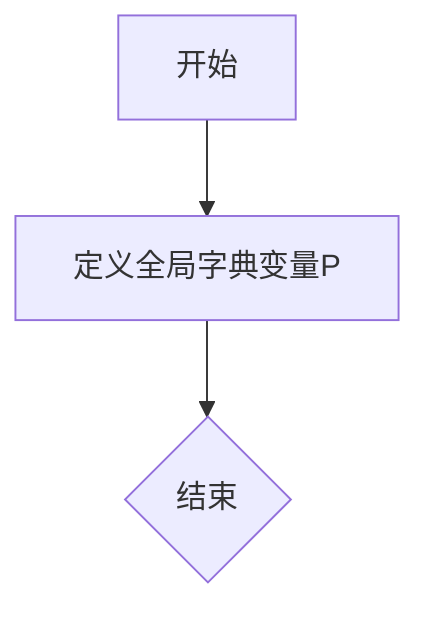

# `jieba\jieba\finalseg\prob_start.py` 详细设计文档

该代码定义了一个全局字典变量P，包含四个键值对，键为大写字母'B'、'E'、'M'、'S'，对应不同的浮点数值，可能用于某种机器学习模型的参数配置或概率计算。

## 整体流程



## 类结构

```
无类层次结构（仅包含全局变量）
```

## 全局变量及字段


### `P`
    
全局配置字典，存储包含B、E、M、S四个键的参数值，用于定义特定的数值配置项

类型：`dict`
    


    

## 全局函数及方法


## 关键组件


### P 字典

全局变量 P 是一个包含四个键值对的字典，用于存储量化相关的参数配置。其中键 'B' 对应基准参数，'E' 和 'M' 可能分别代表某种极值或最小/最大值参数，'S' 可能代表缩放因子参数。

### 参数键名

字典包含四个字符串键：'B'（基准）、'E'（极值）、'M'（最小值/中间值）、'S'（缩放因子）。这些键名暗示了该配置可能用于量化策略中的参数初始化或阈值设置。

### 参数值

所有值均为浮点数类型，其中三个参数（E、M、S）为极小值（-3.14e+100），这通常表示未初始化状态或用于表示负无穷的占位符，而 'B' 参数为正常的负小数数值。


## 问题及建议


### 已知问题

- **魔数问题**：字典中的数值（如-0.26268660809250016、-3.14e+100、-1.4652633398537678）均为硬编码的魔数（magic numbers），没有任何注释说明其来源、含义或用途
- **命名不明确**：变量名"P"过于简洁，无法表达其业务含义（如可能代表概率Parameters、位置Position、权重Weights等）
- **重复值未说明**：'E'和'M'使用相同的值-3.14e+100，这种重复是巧合还是有意为之无法判断
- **特殊数值无解释**：-3.14e+100是一个接近负无穷的特殊数值，在代码中直接使用而未做任何说明
- **缺乏类型注解**：Python字典未使用泛型进行类型标注，无法明确键值类型
- **不可配置性**：所有参数硬编码，若需调整参数需修改源代码，不符合配置与代码分离的原则
- **无文档说明**：缺少模块级或类级的docstring说明该配置的用途和使用场景

### 优化建议

- 为变量P使用更具描述性的名称，如`MODEL_PROBABILITIES`、`GAME_PAYOFFS`或`COEFFICIENTS`
- 添加详细的注释或文档字符串，说明每个数值对应的业务含义、计算方法或数据来源
- 考虑将配置数据提取到独立的配置文件（如JSON、YAML或.ini），或使用环境变量，提高可维护性
- 使用Python类型注解明确定义类型，如`P: Dict[str, float] = {...}`
- 对于具有相同含义的数值，定义常量或枚举以提高可读性，如`DEFAULT_NEGATIVE_VALUE = -3.14e+100`
- 考虑添加数据验证逻辑，确保配置值的合理范围
- 如这些参数来自机器学习或数学模型，应在注释中标明模型版本、训练数据或参考文献
</think>

## 其它


### 1. 一段话描述

该代码定义了一个名为P的Python字典，用于存储游戏或模拟系统中的参数配置，包含四个键值对，其中'B'对应浮点数-0.26268660809250016，'E'和'M'对应极小值-3.14e+100，'S'对应-1.4652633398537678，可能用于表示某种权重、能量或状态参数。

### 2. 文件的整体运行流程

该代码为配置数据定义，不涉及执行流程，仅在模块加载时被初始化为全局变量P，供其他模块导入使用。

### 3. 类的详细信息

该代码片段不包含类定义，无类字段和类方法。

### 4. 全局变量和全局函数信息

#### 4.1 全局变量

| 名称 | 类型 | 描述 |
|------|------|------|
| P | dict | 存储系统参数的字典，包含B、E、M、S四个键及其对应的浮点数值 |

### 5. 关键组件信息

| 名称 | 一句话描述 |
|------|-----------|
| P字典 | 存储系统配置参数的全局字典对象 |

### 6. 潜在的技术债务或优化空间

1. 缺少文档注释说明各参数含义和用途
2. 硬编码的数值缺乏可读性，建议使用具名常量或配置文件
3. E和M使用相同的极小值-3.14e+100，可能存在重复定义
4. 缺乏参数校验和类型检查
5. 没有版本控制和变更历史记录
6. 数值精度和科学计数法的使用缺乏说明

### 7. 其它项目

#### 7.1 设计目标与约束

该配置字典的设计目标是为系统提供运行时所需的参数初始化数据。约束包括：参数必须在模块加载时可用，键名必须为字符串类型，值为浮点数格式。

#### 7.2 错误处理与异常设计

当前代码无错误处理机制。建议增加：参数类型验证、数值范围检查、缺失键的默认值处理、配置加载失败时的降级策略。

#### 7.3 数据流与状态机

该字典为静态配置数据，不涉及运行时状态变化。数据流为：配置定义→模块导入→全局访问→参数使用。

#### 7.4 外部依赖与接口契约

该代码无外部依赖，仅使用Python内置dict类型。接口契约：其他模块通过`import`语句导入P字典，访问方式为`P['key']`或`P.get('key')`。

#### 7.5 配置管理策略

建议增加配置管理相关内容：配置来源、加载时机、修改权限、环境区分（开发/生产）、配置验证规则。

#### 7.6 版本兼容性

当前代码使用Python 3语法，无版本特定特性。建议标注最低Python版本要求。

#### 7.7 单元测试建议

建议增加配置加载测试、参数有效性测试、默认值回退测试、配置更新测试等测试用例。

#### 7.8 性能考量

该代码在模块导入时执行，无运行时性能影响。字典访问时间复杂度为O(1)。


    