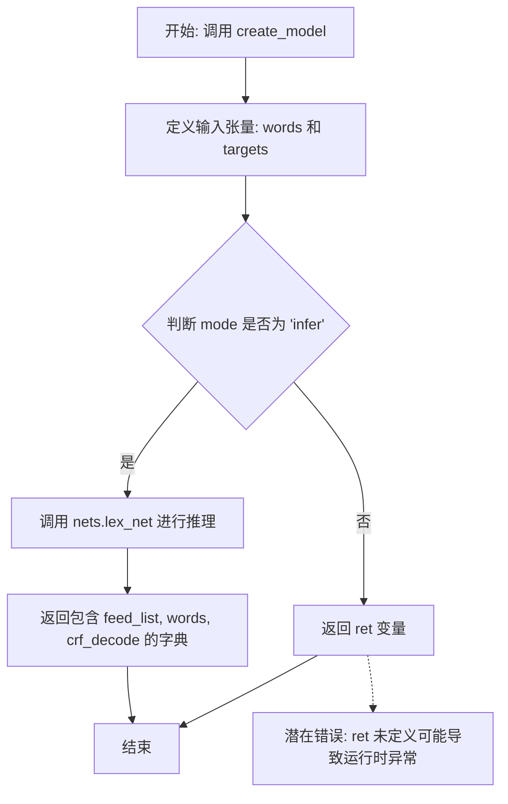
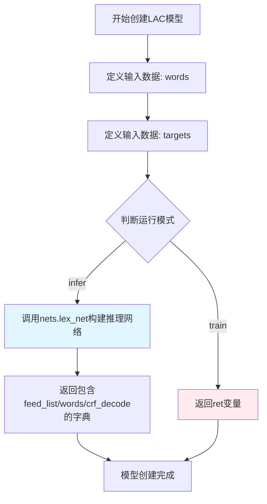

# `jieba\jieba\lac_small\creator.py` 详细设计文档

该代码定义了一个函数 create_model，用于基于 PaddlePaddle 框架创建词汇分析（Lexical Analysis, LAC）模型，支持训练和推理模式，并根据模式返回模型的网络结构或推理结果。

## 整体流程



## 类结构

```
无本地类定义，所有函数均为模块级函数。
```

## 全局变量及字段


### `sys`
    
Python标准库模块，提供对系统参数和函数的访问

类型：`module`
    


### `os`
    
Python标准库模块，提供操作系统相关功能，如文件和目录操作

类型：`module`
    


### `math`
    
Python标准库模块，提供数学函数和常量

类型：`module`
    


### `paddle`
    
PaddlePaddle深度学习框架主模块

类型：`module`
    


### `fluid`
    
PaddlePaddle fluid动态图执行子模块，用于构建和训练神经网络

类型：`module`
    


### `NormalInitializer`
    
PaddlePaddle中的正态分布初始化器类，用于初始化神经网络权重

类型：`class`
    


### `nets`
    
jieba.lac_small子模块，包含LAC词法分析模型的网络定义

类型：`module`
    


    

## 全局函数及方法


### `create_model`

该函数用于创建LAC（Lexical Analysis，词法分析）模型，支持训练和推理两种模式。根据传入的词汇表大小、标签数量和运行模式，构建相应的数据输入层和神经网络结构，推理模式下返回包含feed_list、words和crf_decode的字典，训练模式下返回未完整定义的ret变量（代码存在潜在缺陷）。

参数：

- `vocab_size`：`int`，词汇表大小，用于配置词嵌入层的词汇数量
- `num_labels`：`int`，标签数量，对应NER任务中的标签类别总数
- `mode`：`str`，运行模式，默认为'train'，可选值为'train'或'infer'，用于区分训练和推理场景

返回值：`dict` 或 `undefined`，推理模式下返回包含feed_list、words和crf_decode的字典，训练模式下返回ret变量（代码中存在返回未定义变量的bug）

#### 流程图



#### 带注释源码

```python
def create_model(vocab_size, num_labels, mode='train'):
    """create lac model"""
    # 模型的输入数据：words用于存储词序列，lod_level=1表示序列是变长的
    words = fluid.data(name='words', shape=[-1, 1], dtype='int64', lod_level=1)
    # 模型的标签数据：targets用于存储对应的标签序列
    targets = fluid.data(
        name='targets', shape=[-1, 1], dtype='int64', lod_level=1)

    # 推理模式下构建CRF解码网络
    if mode == 'infer':
        # 调用nets.lex_net构建词法分析网络，for_infer=True表示推理模式
        crf_decode = nets.lex_net(
            words, vocab_size, num_labels, for_infer=True, target=None)
        # 返回推理所需的组件：输入列表、词序列、CRF解码结果
        return {
            "feed_list": [words],
            "words": words,
            "crf_decode": crf_decode,
        }
    # 训练模式应返回训练相关的组件，但此处ret变量未定义，存在代码缺陷
    return ret
```

## 关键组件


### 词法分析模型创建函数 (create_model)

create_model是PaddlePaddle词法分析(LAC)模型的核心入口函数，负责根据不同运行模式(train/infer)创建相应的模型结构和数据占位符。该函数定义了模型所需的输入数据(words和targets)，并调用nets.lex_net构建神经网络。

### 模型输入数据占位符 (words)

fluid.data定义的词ID序列输入，占位符名称为'words'，形状为[-1, 1]，数据类型为int64，lod_level=1表示支持变长序列。为模型的词嵌入层提供输入数据。

### 目标标签数据占位符 (targets)

fluid.data定义的标签序列输入，占位符名称为'targets'，形状为[-1, 1]，数据类型为int64，lod_level=1表示支持变长序列。用于训练时的标签监督。

### 神经网络构建函数 (nets.lex_net)

调用paddle.jieba.lac_small.nets模块中的lex_net函数构建CRF序列标注网络，接受词ID、词汇表大小、标签数量等参数，for_infer参数控制是否为推理模式。

### 推理模式返回结构

当mode='infer'时，返回包含feed_list、words和crf_decode的字典，其中crf_decode为CRF解码输出，用于推理阶段的预测。

### 潜在技术债务

代码存在逻辑错误：infer模式提前return后，末尾的return ret语句无法执行，且train模式未完整实现返回逻辑。变量ret未定义会导致运行时错误。


## 问题及建议


### 已知问题

-   **未定义的变量 `ret`**：函数在非推理模式下返回 `ret` 变量，但该变量从未被定义，当 mode != 'infer' 时会触发 NameError。
-   **训练模式逻辑缺失**：代码创建了训练输入数据（words 和 targets），但未调用 nets.lex_net 构建训练模型，训练逻辑未实现。
-   **未使用的导入**：导入了 sys, os, math, NormalInitializer 等模块但未在代码中使用。
-   **参数校验缺失**：vocab_size 和 num_labels 参数未进行有效性校验，可能导致后续调用 nets.lex_net 时出现隐式错误。
-   **缺少类型注解**：函数参数和返回值均无类型提示，降低了代码的可读性和可维护性。
-   **文档不完整**：函数文档字符串仅有一句话，未说明参数的具体含义和用法。
-   **硬编码的输入维度**：words 和 targets 的 shape 固定为 [-1, 1]，缺乏灵活性。

### 优化建议

-   修复 mode != 'infer' 时的返回逻辑，实现完整的训练模型构建流程，调用 nets.lex_net 创建训练网络。
-   添加参数校验逻辑，确保 vocab_size > 0, num_labels > 0，mode 必须为 'train' 或 'infer'。
-   移除未使用的导入语句，保持代码整洁。
-   为函数添加完整的类型注解和详细的文档字符串，说明各参数的用途和约束。
-   考虑将输入数据的 shape 参数化，使其支持不同的序列长度配置。
-   添加错误处理机制，对非法输入参数抛出明确的异常信息。


## 其它


### 设计目标与约束

本模块旨在为PaddlePaddle词法分析（LAC）模型提供模型创建接口，支持训练模式和推理模式两种工作流程。设计约束包括：输入数据必须为整型序列（int64），批次大小可变，词汇表大小和标签数量必须在模型初始化时确定。模型采用CRF（条件随机场）解码器进行序列标注任务。

### 错误处理与异常设计

代码中未实现显式的错误处理机制。潜在异常场景包括：vocab_size或num_labels为非正数时可能导致内存分配失败；mode参数非'train'或'infer'时将返回未定义的ret变量；nets.lex_net调用失败时将直接向上抛出异常。建议添加参数校验逻辑，当参数不合法时抛出ValueError或IllegalArgumentException。

### 数据流与状态机

模型数据流分为两个状态：**训练状态（train）**和**推理状态（infer）**。在训练状态下，输入数据包含words（词序列）和targets（标签序列），模型输出存储在ret变量中（代码未完整实现）。在推理状态下，仅需输入words，通过lex_net的for_infer=True参数启用推理模式，输出crf_decode结果用于预测。数据流转过程中，words和targets采用LOD Tensor格式（lod_level=1），支持变长序列处理。

### 外部依赖与接口契约

本模块依赖以下外部组件：paddle（v0.1+）和paddle.fluid框架；jieba.lac_small.nets模块中的lex_net函数。接口契约规定：vocab_size类型为int，表示词汇表大小；num_labels类型为int，表示标签类别数；mode类型为str，取值范围为'train'或'infer'；返回值为字典类型，推理模式包含feed_list、words、crf_decode三个键。

### 性能考虑与优化空间

当前实现存在以下性能优化空间：1）ret变量未定义导致训练模式无法正常运行，需完善模型构建逻辑；2）未设置batch_size的动态调整机制，建议根据硬件资源动态配置；3）可考虑添加模型缓存机制，避免重复创建模型实例；4）可添加梯度裁剪和学习率调度器配置接口。

### 配置与参数说明

| 参数名 | 类型 | 必填 | 说明 |
|--------|------|------|------|
| vocab_size | int | 是 | 词汇表大小，决定embedding层维度 |
| num_labels | int | 是 | 标签数量，决定输出层维度 |
| mode | str | 否 | 默认为'train'，可选'infer' |

### 使用示例与调用流程

训练模式调用示例：
```python
model = create_model(vocab_size=10000, num_labels=4, mode='train')
```
推理模式调用示例：
```python
infer_model = create_model(vocab_size=10000, num_labels=4, mode='infer')
feed_dict = {"words": input_data}
result = exe.run(feed=feed_dict, fetch_list=[infer_model["crf_decode"]])
```

### 已知问题与限制

1. **代码不完整**：训练模式返回的ret变量未定义，函数直接返回ret会导致NameError；2. **缺乏错误校验**：未对输入参数进行合法性检查；3. **文档缺失**：未提供完整的API文档和使用说明；4. **硬编码问题**：words和targets的shape和dtype硬编码，缺乏灵活性；5. **资源清理**：未提供模型资源释放接口。


    