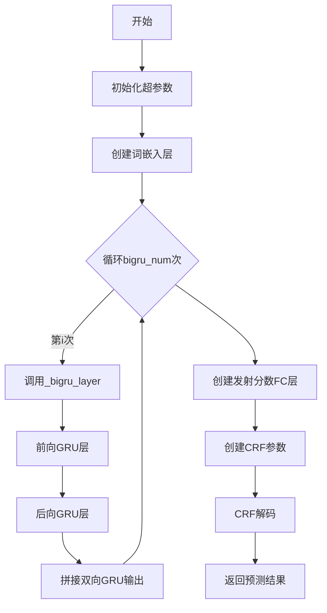
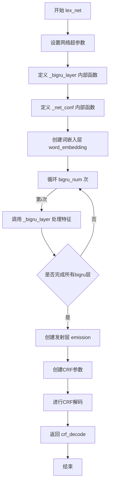
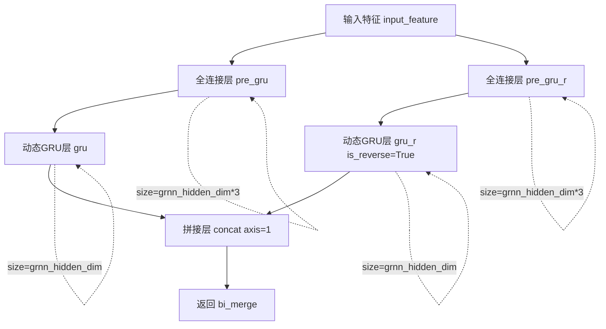
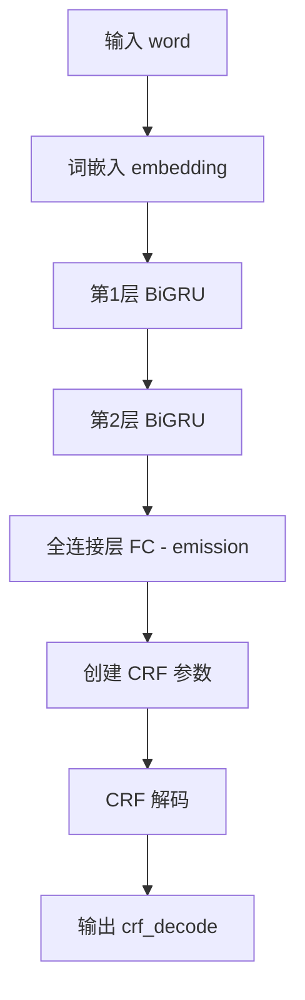
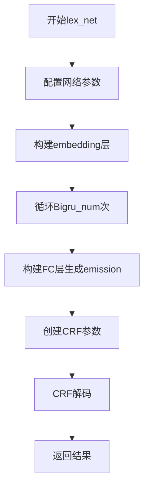

# `jieba\jieba\lac_small\nets.py` 详细设计文档

一个基于PaddlePaddle的词法分析网络，实现了BiGRU-CRF模型用于序列标注任务，包含词嵌入、双向GRU层和CRF解码层。

## 整体流程



## 类结构

```
lex_net (主函数)
├── _bigru_layer (内部函数 - 双向GRU层)
│   ├── fc (前向)
│   ├── dynamic_gru (前向)
│   ├── fc (后向)
│   ├── dynamic_gru (后向)
│   └── concat (拼接)
```

## 全局变量及字段


### `word_emb_dim`
    
词嵌入维度，设置为128

类型：`int`
    


### `grnn_hidden_dim`
    
GRNN隐藏层维度，设置为128

类型：`int`
    


### `bigru_num`
    
双向GRU层数，设置为2

类型：`int`
    


### `emb_lr`
    
词嵌入层学习率，设置为1.0

类型：`float`
    


### `crf_lr`
    
CRF层学习率，设置为1.0

类型：`float`
    


### `init_bound`
    
参数均匀初始化边界，设置为0.1

类型：`float`
    


### `IS_SPARSE`
    
是否使用稀疏嵌入，设置为True

类型：`bool`
    


    

## 全局函数及方法


### `lex_net`

该函数定义了词法分析的网络结构，使用双向GRU（BiGRU）结合CRF（条件随机场）实现序列标注任务，用于分词、词性标注等NLP任务。

参数：

- `word`：`fluid.Variable`，输入的词ID序列
- `vocab_size`：`int`，词汇表大小，用于词嵌入层
- `num_labels`：`int`，标签数量，对应输出类别数
- `for_infer`：`bool`，布尔值，指示模型用于推理还是训练（当前实现中未使用）
- `target`：`fluid.Variable`，目标标签序列（可选，当前实现中未使用）

返回值：`fluid.Variable`，CRF解码后的预测结果

#### 流程图



#### 带注释源码

```python
def lex_net(word, vocab_size, num_labels, for_infer=True, target=None):
    """
    定义词法分析网络结构
    word: 存储模型的输入（词ID序列）
    for_infer: 布尔值，指示创建的模型是用于训练还是预测
    
    返回:
        推理模式: 返回预测结果
        训练模式: 返回预测结果
    """
   
    # ==================== 网络超参数配置 ====================
    word_emb_dim = 128       # 词嵌入维度
    grnn_hidden_dim = 128     # GRN隐藏层维度
    bigru_num = 2            # 双向GRU层数
    emb_lr = 1.0             # 词嵌入层学习率
    crf_lr = 1.0             # CRF层学习率
    init_bound = 0.1         # 参数初始化边界
    IS_SPARSE = True          # 是否使用稀疏更新

    def _bigru_layer(input_feature):
        """
        定义双向GRU层
        将输入特征通过两个方向的GRU编码，捕捉上下文信息
        """
        # 正向GRU
        pre_gru = fluid.layers.fc(
            input=input_feature,
            size=grnn_hidden_dim * 3,  # 3 * hidden_dim 对应GRU的更新门、重置门和新内容
            param_attr=fluid.ParamAttr(
                initializer=fluid.initializer.Uniform(
                    low=-init_bound, high=init_bound),
                regularizer=fluid.regularizer.L2DecayRegularizer(
                    regularization_coeff=1e-4)))
        gru = fluid.layers.dynamic_gru(
            input=pre_gru,
            size=grnn_hidden_dim,
            param_attr=fluid.ParamAttr(
                initializer=fluid.initializer.Uniform(
                    low=-init_bound, high=init_bound),
                regularizer=fluid.regularizer.L2DecayRegularizer(
                    regularization_coeff=1e-4)))

        # 反向GRU
        pre_gru_r = fluid.layers.fc(
            input=input_feature,
            size=grnn_hidden_dim * 3,
            param_attr=fluid.ParamAttr(
                initializer=fluid.initializer.Uniform(
                    low=-init_bound, high=init_bound),
                regularizer=fluid.regularizer.L2DecayRegularizer(
                    regularization_coeff=1e-4)))
        gru_r = fluid.layers.dynamic_gru(
            input=pre_gru_r,
            size=grnn_hidden_dim,
            is_reverse=True,  # 反向处理序列
            param_attr=fluid.ParamAttr(
                initializer=fluid.initializer.Uniform(
                    low=-init_bound, high=init_bound),
                regularizer=fluid.regularizer.L2DecayRegularizer(
                    regularization_coeff=1e-4)))

        # 拼接正向和反向GRU输出，形成双向特征表示
        bi_merge = fluid.layers.concat(input=[gru, gru_r], axis=1)
        return bi_merge

    def _net_conf(word, target=None):
        """
        配置完整的网络结构
        包含：嵌入层 -> BiGRU层 -> 发射层 -> CRF解码层
        """
        # 1. 词嵌入层：将词ID转换为词向量
        word_embedding = fluid.embedding(
            input=word,
            size=[vocab_size, word_emb_dim],
            dtype='float32',
            is_sparse=IS_SPARSE,
            param_attr=fluid.ParamAttr(
                learning_rate=emb_lr,
                name="word_emb",
                initializer=fluid.initializer.Uniform(
                    low=-init_bound, high=init_bound)))

        # 2. 堆叠多层双向GRU
        input_feature = word_embedding
        for i in range(bigru_num):
            bigru_output = _bigru_layer(input_feature)
            input_feature = bigru_output

        # 3. 发射层：将BiGRU输出映射到标签空间
        emission = fluid.layers.fc(
            size=num_labels,
            input=bigru_output,
            param_attr=fluid.ParamAttr(
                initializer=fluid.initializer.Uniform(
                    low=-init_bound, high=init_bound),
                regularizer=fluid.regularizer.L2DecayRegularizer(
                    regularization_coeff=1e-4)))

        # 4. CRF解码：考虑标签间的转移概率
        size = emission.shape[1]
        fluid.layers.create_parameter(
            shape=[size + 2, size], dtype=emission.dtype, name='crfw')
        crf_decode = fluid.layers.crf_decoding(
            input=emission, param_attr=fluid.ParamAttr(name='crfw'))

        return crf_decode
    
    # 执行网络配置并返回结果
    return _net_conf(word)
```


### `_bigru_layer`

该函数定义了一个双向 GRU（BiGRU）层，用于对输入特征进行前向和后向的 GRU 运算，并将两个方向的输出拼接起来，形成双向特征表示。

参数：

- `input_feature`：`fluid.layers.Tensor` 或 PaddlePaddle 张量，表示输入特征数据

返回值：`fluid.layers.Tensor`，返回前向和后向 GRU 输出的拼接结果（bidirectional merge）

#### 流程图



#### 带注释源码

```python
def _bigru_layer(input_feature):
    """
    定义双向GRU层
    input_feature: 输入特征张量
    返回: 双向GRU拼接后的输出
    """
    # 前向GRU路径
    # 第一个全连接层，将输入映射到GRU所需的3倍隐层大小（包含更新门、重置门、候选隐状态）
    pre_gru = fluid.layers.fc(
        input=input_feature,
        size=grnn_hidden_dim * 3,  # GRU需要3倍大小：z, r, h_tilde
        param_attr=fluid.ParamAttr(
            initializer=fluid.initializer.Uniform(
                low=-init_bound, high=init_bound),  # 均匀分布初始化
            regularizer=fluid.regularizer.L2DecayRegularizer(
                regularization_coeff=1e-4)))  # L2正则化
    
    # 动态GRU层 - 前向
    gru = fluid.layers.dynamic_gru(
        input=pre_gru,
        size=grnn_hidden_dim,  # 隐层维度
        param_attr=fluid.ParamAttr(
            initializer=fluid.initializer.Uniform(
                low=-init_bound, high=init_bound),
            regularizer=fluid.regularizer.L2DecayRegularizer(
                regularization_coeff=1e-4)))

    # 后向GRU路径（is_reverse=True）
    # 另一个全连接层，用于后向GRU
    pre_gru_r = fluid.layers.fc(
        input=input_feature,
        size=grnn_hidden_dim * 3,
        param_attr=fluid.ParamAttr(
            initializer=fluid.initializer.Uniform(
                low=-init_bound, high=init_bound),
            regularizer=fluid.regularizer.L2DecayRegularizer(
                regularization_coeff=1e-4)))
    
    # 动态GRU层 - 后向（反向处理序列）
    gru_r = fluid.layers.dynamic_gru(
        input=pre_gru_r,
        size=grnn_hidden_dim,
        is_reverse=True,  # 关键参数：反向GRU
        param_attr=fluid.ParamAttr(
            initializer=fluid.initializer.Uniform(
                low=-init_bound, high=init_bound),
            regularizer=fluid.regularizer.L2DecayRegularizer(
                regularization_coeff=1e-4)))

    # 拼接前向和后向GRU输出
    # axis=1 表示在特征维度拼接，保留序列长度维度
    bi_merge = fluid.layers.concat(input=[gru, gru_r], axis=1)
    return bi_merge
```


### `lex_net._net_conf`

该内部函数负责配置神经网络结构，将输入的词嵌入经过双层双向GRU处理后，通过全连接层生成发射分数，最后使用CRF解码进行序列标注任务。

参数：

- `word`：`fluid.Tensor`，输入的词索引张量
- `target`：`fluid.Tensor`，目标标签张量（可选，默认None）

返回值：`fluid.Tensor`，CRF解码后的预测序列

#### 流程图



#### 带注释源码

```python
def _net_conf(word, target=None):
    """
    Configure the network
    配置网络结构
    """
    # 1. 词嵌入层：将词索引转换为词向量
    # input: word - 词索引张量
    # size: [vocab_size, word_emb_dim] - 词汇表大小 × 词向量维度
    # is_sparse: True - 使用稀疏更新加速训练
    word_embedding = fluid.embedding(
        input=word,
        size=[vocab_size, word_emb_dim],
        dtype='float32',
        is_sparse=IS_SPARSE,
        param_attr=fluid.ParamAttr(
            learning_rate=emb_lr,
            name="word_emb",
            initializer=fluid.initializer.Uniform(
                low=-init_bound, high=init_bound)))

    # 2. 准备输入特征
    input_feature = word_embedding
    
    # 3. 双层双向GRU循环处理
    # bigru_num = 2，双层BiGRU
    for i in range(bigru_num):
        bigru_output = _bigru_layer(input_feature)
        input_feature = bigru_output

    # 4. 全连接层：生成发射分数（emission scores）
    # 将BiGRU输出映射到标签空间
    # size: num_labels - 标签数量
    emission = fluid.layers.fc(
        size=num_labels,
        input=bigru_output,
        param_attr=fluid.ParamAttr(
            initializer=fluid.initializer.Uniform(
                low=-init_bound, high=init_bound),
            regularizer=fluid.regularizer.L2DecayRegularizer(
                regularization_coeff=1e-4)))

    # 5. 创建CRF转移矩阵参数
    # shape: [size + 2, size] - 增加开始和结束状态
    size = emission.shape[1]
    fluid.layers.create_parameter(
        shape=[size + 2, size], dtype=emission.dtype, name='crfw')
    
    # 6. CRF解码：利用转移概率和解码出最优标签序列
    crf_decode = fluid.layers.crf_decoding(
        input=emission, param_attr=fluid.ParamAttr(name='crfw'))

    # 7. 返回解码结果
    return crf_decode
```


## 关键组件


### lex_net函数

主网络构建函数，接收词ID、词汇表大小、标签数量等参数，构建用于词法分析的双向GRU+CRF神经网络结构，并返回CRF解码结果。

### _bigru_layer函数

双向GRU层实现函数，通过两个方向的GRU处理输入特征，然后将输出在特征维度上进行拼接，形成双向特征表示。

### _net_conf函数

网络配置函数，负责构建完整的网络结构，包括词嵌入层、双向GRU层、全连接发射层和CRF解码层。

### 词嵌入层 (fluid.embedding)

将输入的词ID转换为词向量表示，使用稀疏更新加速训练，嵌入维度为128。

### 双向GRU层

使用两层双向GRU（bigru_num=2，hidden_dim=128）提取序列特征，每个方向包含GRU和反向GRU。

### 全连接发射层 (fluid.layers.fc)

将GRU输出映射到标签空间，输出维度等于标签数量，用于生成CRF的发射分数。

### CRF解码层 (fluid.layers.crf_decoding)

使用条件随机场进行序列标注解码，通过CRF层建模标签之间的转移关系。

### 网络参数配置

包含词嵌入维度(128)、GRU隐藏维度(128)、双向GRU层数(2)、嵌入学习率(1.0)、CRF学习率(1.0)、参数初始化边界(0.1)等超参数。

### 潜在技术债务

1. 网络配置参数（word_emb_dim、grnn_hidden_dim等）硬编码在函数内部，缺乏灵活性
2. 重复的FC层和GRU层参数Attr定义，代码冗余，可提取为共享的ParamAttr
3. target参数定义但未使用
4. for_infer参数定义但未实际用于区分训练和推理模式
5. 缺少对输入数据的合法性校验


## 问题及建议


### 已知问题

- **硬编码超参数**：word_emb_dim（128）、grnn_hidden_dim（128）、bigru_num（2）、emb_lr（1.0）、crf_lr（1.0）、init_bound（0.1）等超参数被硬编码在函数内部，降低了代码的灵活性和可复用性，难以通过参数调优。
- **未使用的参数**：`lex_net`函数接收`target`参数但在函数体内完全未使用，可能导致调用者困惑。
- **循环逻辑冗余低效**：for循环迭代`bigru_num`次（2次），但每次迭代都会覆盖`bigru_output`，实际上只有最后一次迭代生效，前面的迭代结果被丢弃，循环逻辑没有实际意义。
- **参数创建方式不当**：使用`fluid.layers.create_parameter`创建CRF参数后未保存返回值，而是通过名称引用，这种隐式依赖容易导致参数重复创建或引用错误。
- **缺少输入验证**：未对vocab_size、num_labels等关键参数进行有效性检查，可能导致运行时错误。
- **变量命名不一致**：循环外使用`input_feature`，循环后直接使用`bigru_output`，变量切换容易造成理解混乱。

### 优化建议

- **参数化超参数**：将所有超参数提取为函数参数或配置对象，添加默认值以保持向后兼容。
- **移除target参数或实现其功能**：如果不需要序列标注的标签输入，应删除此参数；若需要，应在网络中使用。
- **简化BiGRU循环**：如果只需要单层BiGRU，直接移除循环；若需多层，应确保正确保留每层输出（如使用列表累积）。
- **显式管理CRF参数**：将`create_parameter`的返回值直接传递给`crf_decoding`的param_attr，避免依赖名称匹配。
- **添加参数校验**：在函数开头添加vocab_size > 0、num_labels > 0等基础验证。
- **优化变量命名**：统一使用描述性的变量名，明确区分中间结果和最终输出。

## 其它


### 一段话描述

该代码定义了一个用于词法分析（Lexical Analysis）的神经网络模型，采用双向GRU（BiGRU）结构提取序列特征，并结合CRF（条件随机场）层进行序列标注，适用于中文分词、词性标注等NLP任务。

### 文件的整体运行流程

1. 导入必要的库（paddle.fluid等）
2. 调用lex_net函数，传入word（输入词序列）、vocab_size（词汇表大小）、num_labels（标签数量）等参数
3. 在lex_net内部，首先配置网络超参数（词向量维度、GRU隐藏层维度、BiGRU层数等）
4. 构建embedding层，将输入的word转换为词向量
5. 通过Bigru_num次数的双向GRU层循环处理，提取上下文特征
6. 构建全连接层（FC）生成emission分数
7. 创建CRF解码层进行序列标注
8. 返回crf_decode结果

### 全局变量和全局函数详细信息

#### 全局变量

由于本代码为纯函数式实现，未定义模块级全局变量。所有配置参数均在函数内部定义。

#### 全局函数

##### lex_net

- **名称**: lex_net
- **参数**:
  - word: Variable，输入的词ID序列
  - vocab_size: int，词汇表大小
  - num_labels: int，标签数量
  - for_infer: bool，是否为推理模式（当前未使用）
  - target: Variable，目标序列（可选，当前未使用）
- **返回值类型**: Variable (CRF解码结果)
- **返回值描述**: 返回CRF解码后的序列标注结果
- **mermaid流程图**:



- **带注释源码**:

```python
def lex_net(word, vocab_size, num_labels, for_infer=True, target=None):
    """
    定义词法分析网络结构
    word: 存储模型的输入
    for_infer: 布尔值，指示创建的模型是用于训练还是预测
    返回: 预测结果
    """
   
    # 网络超参数配置
    word_emb_dim=128      # 词向量维度
    grnn_hidden_dim=128   # GRU隐藏层维度
    bigru_num=2           # BiGRU层数
    emb_lr = 1.0         # 词向量学习率
    crf_lr = 1.0         # CRF学习率
    init_bound = 0.1     # 参数初始化范围
    IS_SPARSE = True      # 是否使用稀疏embedding

    # 定义双向GRU层构建函数
    def _bigru_layer(input_feature):
        """
        定义双向GRU层
        """
        # 前向GRU
        pre_gru = fluid.layers.fc(
            input=input_feature,
            size=grnn_hidden_dim * 3,
            param_attr=fluid.ParamAttr(
                initializer=fluid.initializer.Uniform(
                    low=-init_bound, high=init_bound),
                regularizer=fluid.regularizer.L2DecayRegularizer(
                    regularization_coeff=1e-4)))
        gru = fluid.layers.dynamic_gru(
            input=pre_gru,
            size=grnn_hidden_dim,
            param_attr=fluid.ParamAttr(
                initializer=fluid.initializer.Uniform(
                    low=-init_bound, high=init_bound),
                regularizer=fluid.regularizer.L2DecayRegularizer(
                    regularization_coeff=1e-4)))

        # 反向GRU
        pre_gru_r = fluid.layers.fc(
            input=input_feature,
            size=grnn_hidden_dim * 3,
            param_attr=fluid.ParamAttr(
                initializer=fluid.initializer.Uniform(
                    low=-init_bound, high=init_bound),
                regularizer=fluid.regularizer.L2DecayRegularizer(
                    regularization_coeff=1e-4)))
        gru_r = fluid.layers.dynamic_gru(
            input=pre_gru_r,
            size=grnn_hidden_dim,
            is_reverse=True,
            param_attr=fluid.ParamAttr(
                initializer=fluid.initializer.Uniform(
                    low=-init_bound, high=init_bound),
                regularizer=fluid.regularizer.L2DecayRegularizer(
                    regularization_coeff=1e-4)))

        # 拼接双向GRU输出
        bi_merge = fluid.layers.concat(input=[gru, gru_r], axis=1)
        return bi_merge

    # 定义网络配置函数
    def _net_conf(word, target=None):
        """
        配置网络结构
        """
        # 创建词嵌入层
        word_embedding = fluid.embedding(
            input=word,
            size=[vocab_size, word_emb_dim],
            dtype='float32',
            is_sparse=IS_SPARSE,
            param_attr=fluid.ParamAttr(
                learning_rate=emb_lr,
                name="word_emb",
                initializer=fluid.initializer.Uniform(
                    low=-init_bound, high=init_bound)))

        input_feature = word_embedding
        # 循环堆叠BiGRU层
        for i in range(bigru_num):
            bigru_output = _bigru_layer(input_feature)
            input_feature = bigru_output

        # 全连接层生成emission分数
        emission = fluid.layers.fc(
            size=num_labels,
            input=bigru_output,
            param_attr=fluid.ParamAttr(
                initializer=fluid.initializer.Uniform(
                    low=-init_bound, high=init_bound),
                regularizer=fluid.regularizer.L2DecayRegularizer(
                    regularization_coeff=1e-4)))

        # 创建CRF transition矩阵参数
        size = emission.shape[1]
        fluid.layers.create_parameter(
            shape=[size + 2, size], dtype=emission.dtype, name='crfw')
        
        # CRF解码
        crf_decode = fluid.layers.crf_decoding(
            input=emission, param_attr=fluid.ParamAttr(name='crfw'))

        return crf_decode
    
    return _net_conf(word)
```

### 关键组件信息

#### 1. 词嵌入层 (Embedding Layer)

- **名称**: word_embedding
- **一句话描述**: 将离散的词ID转换为密集的词向量表示

#### 2. 双向GRU层 (BiGRU Layer)

- **名称**: _bigru_layer
- **一句话描述**: 提取序列的上下文特征，包含前向和反向两个GRU单元

#### 3. 全连接层 (FC Layer)

- **名称**: emission
- **一句话描述**: 将BiGRU输出映射到标签空间，生成每个位置的标签发射分数

#### 4. CRF解码层 (CRF Decoding)

- **名称**: crf_decode
- **一句话描述**: 使用条件随机场进行序列标注，考虑标签之间的转移关系

### 潜在的技术债务或优化空间

1. **硬编码超参数**: word_emb_dim、grnn_hidden_dim、bigru_num等超参数直接写在函数内部，应提取为配置参数或使用函数参数
2. **重复代码**: _bigru_layer中前向GRU和反向GRU的构建代码高度重复，可抽象为通用函数
3. **未使用的参数**: for_infer和target参数定义但未使用，造成接口污染
4. **缺少训练支持**: 当前实现仅为推理模式，缺少训练阶段的loss计算（如crf_loss）
5. **错误处理不足**: 缺少输入参数有效性检查（如vocab_size、num_labels为负数等情况）
6. **资源管理**: 缺少对GPU/CPU设备选择的配置接口

### 设计目标与约束

- **设计目标**: 实现一个端到端的词法分析神经网络，支持中文分词、词性标注等序列标注任务
- **约束条件**:
  - 必须使用PaddlePaddle框架
  - 模型结构限定为BiGRU + CRF
  - 词向量维度默认为128，GRU隐藏层维度默认为128
  - 需要支持稀疏embedding以提升大规模词表的训练效率

### 错误处理与异常设计

1. **参数类型检查**: 应检查vocab_size、num_labels为正整数，word为有效Variable
2. **维度匹配**: 确保emission维度与CRF transition矩阵维度匹配
3. **设备兼容性**: 应处理CPU/GPU不同设备上的张量操作差异
4. **异常传播**: PaddlePluid框架的异常应向上传播，供上层调用者处理

### 数据流与状态机

- **输入数据流**: word (词ID序列) → Embedding (词向量) → BiGRU×2 (上下文特征) → FC (标签发射分数) → CRF (序列标注)
- **状态转换**: 词ID → 词向量 → 隐藏状态序列 → 发射分数 → 最佳标签序列
- **无显式状态机**: 该网络为前馈结构，无内部状态机设计

### 外部依赖与接口契约

- **核心依赖**: paddle.fluid (PaddlePaddle主框架)
- **接口契约**:
  - 输入: word需为fluid.data或类似Variable，shape为[batch_size, seq_len]
  - 输出: crf_decode为fluid.layers.crf_decoding的返回值，shape为[batch_size, seq_len]
  - vocab_size和num_labels需在模型构建前确定

### 其它项目

#### 1. 版本兼容性

- 该代码基于PaddlePaddle早期版本（使用paddle.fluid），新版本PaddlePaddle（2.x+）已启用paddle.nn体系，建议迁移至新API

#### 2. 模型保存与加载

- 当前实现未包含模型参数保存/加载逻辑，需依赖上层训练脚本实现

#### 3. 性能考虑

- BiGRU循环次数可考虑使用更高效的实现方式
- 稀疏embedding在GPU上的性能优化空间

#### 4. 可扩展性建议

- 支持自定义GRU层数（当前hardcode为2）
- 支持自定义词向量维度
- 可添加注意力机制（Attention）提升效果


    