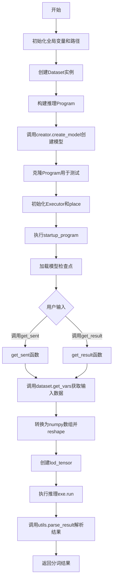
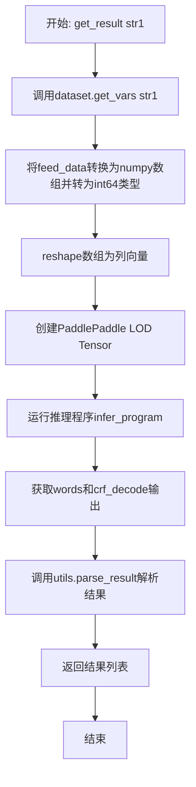
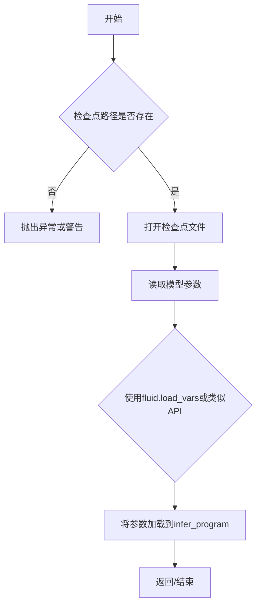
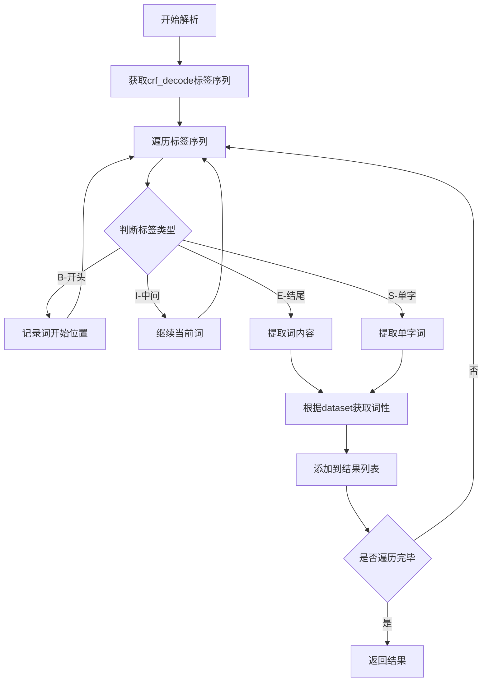
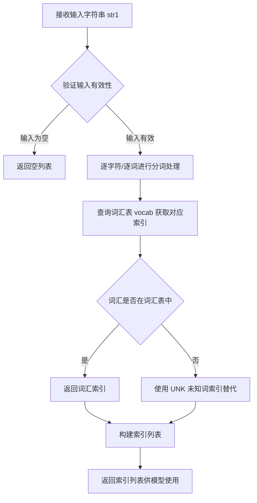
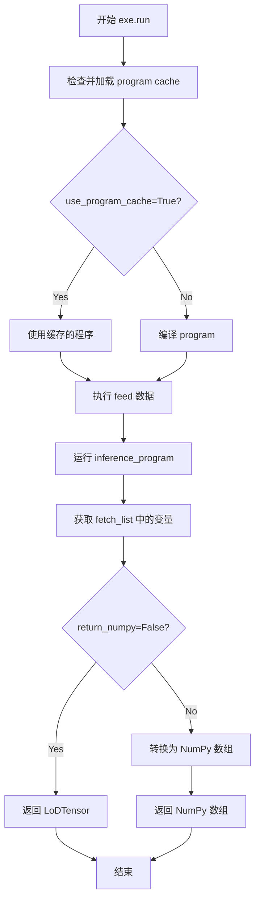
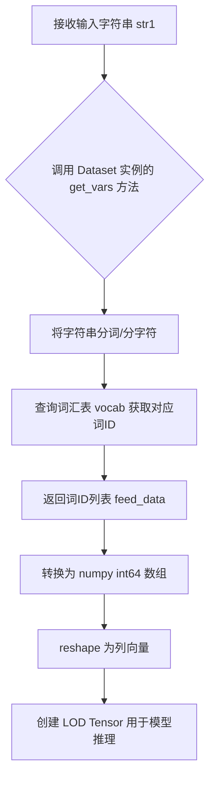
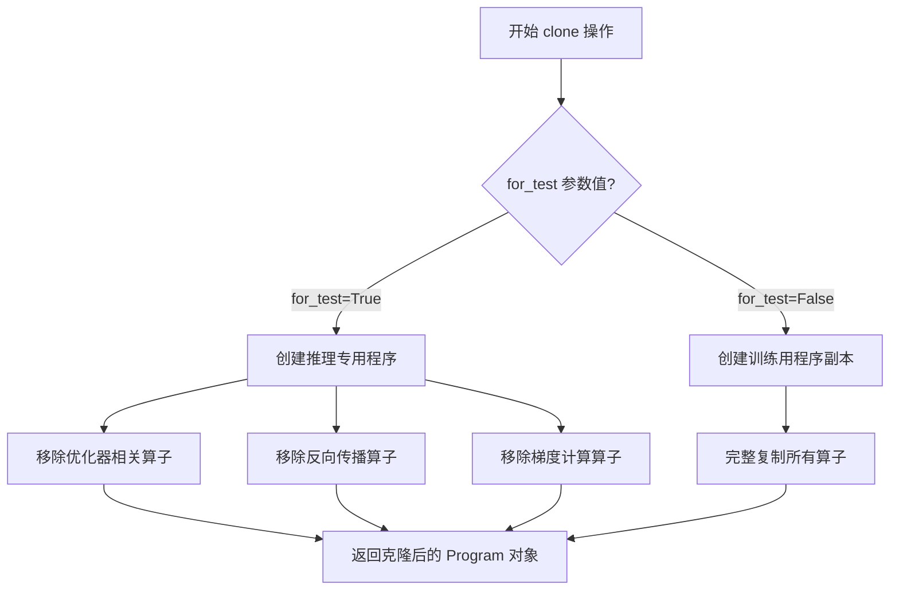
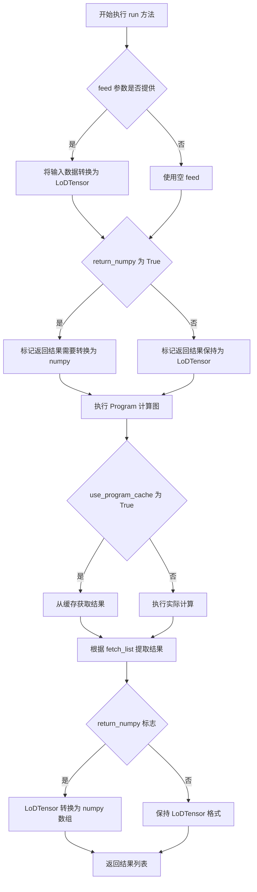

# `jieba\jieba\lac_small\predict.py` 详细设计文档

这是一个基于PaddlePaddle的中文词性标注和分词推理脚本，通过加载预训练的BiGRU+CRF模型对输入的中文句子进行分词和词性标注处理。

## 整体流程



## 类结构

```
全局模块
├── 全局变量 (word_emb_dim, grnn_hidden_dim, bigru_num, use_cuda, basepath, folder, init_checkpoint, batch_size, dataset, infer_program, place, exe, results)
├── get_sent函数
└── get_result函数
依赖模块 (外部导入)
├── reader_small.Dataset类
├── creator.create_model函数
└── utils工具函数
```

## 全局变量及字段


### `word_emb_dim`
    
词嵌入维度，值为128

类型：`int`
    


### `grnn_hidden_dim`
    
GRNN隐藏层维度，值为128

类型：`int`
    


### `bigru_num`
    
BiGRU层数，值为2

类型：`int`
    


### `use_cuda`
    
是否使用CUDA，值为False

类型：`bool`
    


### `basepath`
    
当前Python文件的绝对路径

类型：`str`
    


### `folder`
    
当前文件所在目录路径

类型：`str`
    


### `init_checkpoint`
    
预训练模型检查点路径

类型：`str`
    


### `batch_size`
    
批处理大小，值为1

类型：`int`
    


### `dataset`
    
数据集实例对象

类型：`Dataset`
    


### `infer_program`
    
推理用的Program对象

类型：`fluid.Program`
    


### `place`
    
CPU执行设备

类型：`fluid.CPUPlace`
    


### `exe`
    
PaddlePaddle执行器

类型：`fluid.Executor`
    


### `results`
    
存储推理结果的列表

类型：`list`
    


### `feed_data`
    
get_sent函数内部变量，来自dataset.get_vars(str1)的返回结果

类型：`Variable`
    


### `a`
    
get_sent函数内部numpy数组，用于存储feed_data转换后的int64类型数据

类型：`numpy.ndarray`
    


### `c`
    
get_sent函数内部lod_tensor，包含序列数据和层级序列信息

类型：`fluid.LoDTensor`
    


### `words`
    
推理返回的词语嵌入结果

类型：`Variable`
    


### `crf_decode`
    
推理返回的CRF解码结果

类型：`Variable`
    


### `sents`
    
分词结果列表，用于存储最终的分词输出

类型：`list`
    


### `sent`
    
单句分词结果，来自utils.parse_result函数

类型：`list`
    


### `tag`
    
词性标注结果，来自utils.parse_result函数

类型：`list`
    


### `Dataset.vocab_size`
    
词汇表大小

类型：`int`
    


### `Dataset.num_labels`
    
标签数量

类型：`int`
    
    

## 全局函数及方法


### `get_sent`

该函数是PaddlePaddle中文分词模型的核心推理接口，接收待分词的字符串输入，通过预训练的LAC（Lexical Analysis）模型进行词法分析，将输入字符串转换为词法分析结果，最终返回分词后的句子列表。

参数：

- `str1`：`str`，待分词的中文输入字符串

返回值：`list`，分词后的句子列表，每个元素为分词后的词语列表

#### 流程图

```mermaid
flowchart TD
    A[开始: 输入字符串 str1] --> B[调用 dataset.get_vars 将字符串转换为模型输入]
    B --> C[将输入数据转换为 numpy 数组并重塑为 [N, 1] 形状]
    C --> D[使用 fluid.create_lod_tensor 创建层次化数据张量]
    D --> E[运行推理程序 exe.run]
    E --> F[获取 words 和 crf_decode 输出]
    F --> G[调用 utils.parse_result 解析词法分析结果]
    G --> H[返回分词后的句子列表 sents]
    
    B -->|全局变量| I[dataset: 数据集对象]
    E -->|全局变量| J[infer_program: 推理程序]
    E -->|全局变量| K[exe: Executor 执行器]
    F -->|全局变量| L[infer_ret: 模型输出字典]
```

#### 带注释源码

```python
def get_sent(str1):
    """
    对输入字符串进行分词处理，返回分词后的句子列表
    
    参数:
        str1: 待分词的中文输入字符串
    
    返回:
        list: 分词后的句子列表
    """
    # Step 1: 将输入字符串转换为模型所需的变量格式
    # dataset.get_vars 方法负责将原始字符串编码为模型输入张量
    feed_data = dataset.get_vars(str1)
    
    # Step 2: 将 Python 数据转换为 numpy 数组，并指定数据类型为 int64
    # 这是一个典型的 PaddlePaddle 动态图到静态图的转换过程
    a = numpy.array(feed_data).astype(numpy.int64)
    
    # Step 3: 重塑数组形状为二维 [序列长度, 1]
    # -1 表示自动推断序列长度维度
    a = a.reshape(-1, 1)
    
    # Step 4: 创建 PaddlePaddle LOD Tensor（Level of Detail Tensor）
    # LOD tensor 是一种支持变长序列的特殊张量格式，适合NLP任务
    # 第二个参数 [[a.shape[0]]] 定义了序列的层级信息
    c = fluid.create_lod_tensor(a, [[a.shape[0]]], place)
    
    # Step 5: 执行模型推理
    # 使用预加载的推理程序对输入进行前向计算
    # fetch_list 指定需要获取的输出：词嵌入和 CRF 解码结果
    words, crf_decode = exe.run(
            infer_program,
            fetch_list=[infer_ret['words'], infer_ret['crf_decode']],
            feed={"words": c},
            return_numpy=False,
            use_program_cache=True)
    
    # Step 6: 解析推理结果
    # utils.parse_result 负责将模型输出的词嵌入和解码结果转换为人类可读的词语列表
    # 返回两个值：sent（分词结果句子列表）和 tag（对应的词性标签）
    sent, tag = utils.parse_result(words, crf_decode, dataset)
    
    # Step 7: 累加结果并返回
    # 将当前句子的分词结果添加到结果列表中
    sents = sents + sent
    
    return sents
```

#### 关键组件信息

| 组件名称 | 一句话描述 |
|---------|-----------|
| `dataset` | 包含词汇表大小、标签数量和输入数据预处理逻辑的数据集对象 |
| `infer_program` | 克隆自训练程序的推理程序，用于模型前向计算 |
| `exe` | PaddlePaddle CPU执行器，负责运行推理程序 |
| `infer_ret` | 包含模型输出张量引用的字典，包括 words 和 crf_decode |
| `utils.parse_result` | 将模型原始输出转换为分词结果的核心解析函数 |

#### 潜在技术债务与优化空间

1. **代码重复**：`get_sent` 与 `get_result` 函数存在大量重复代码（约15行），建议抽取公共逻辑到独立函数
2. **硬编码配置**：`batch_size=1`、位置设备等参数硬编码，缺乏灵活性
3. **错误处理缺失**：未对输入字符串为空、编码异常、模型加载失败等情况进行处理
4. **全局状态依赖**：函数依赖多个全局变量（dataset、exe、infer_program等），难以进行单元测试
5. **性能缓存**：`use_program_cache=True` 已启用，但可考虑更高效的批处理策略
6. **类型提示缺失**：函数签名未使用 Python 类型注解，降低了代码可维护性

#### 其它项目

**设计目标与约束**：
- 目标：实现基于深度学习的中文词法分析（分词+词性标注）
- 约束：仅支持CPU推理，单样本处理

**错误处理与异常设计**：
- 缺少对 `str1` 为空或非字符串类型的校验
- 缺少对模型加载失败、推理异常的捕获机制

**数据流与状态机**：
```
字符串输入 → 数据预处理 → 模型推理 → 结果解析 → 列表输出
```

**外部依赖与接口契约**：
- 依赖 `jieba.lac_small` 包：utils、creator、reader_small
- 依赖 PaddlePaddle 框架：fluid.Executor、fluid.Program、fluid.create_lod_tensor
- 依赖预训练模型文件：model_baseline 目录


### `get_result`

该函数接收输入字符串，使用预训练的PaddlePaddle BiGRU-CRF模型进行中文分词和词性标注推理，将字符串转换为模型输入格式后执行推理，最终通过结果解析工具返回分词和词性标注结果列表。

参数：

- `str1`：`str`，待进行分词和词性标注的输入字符串

返回值：`list`，包含分词结果和对应词性标注的列表，每项通常为(word, tag)元组形式

#### 流程图



#### 带注释源码

```python
def get_result(str1):
    """
    对输入字符串进行分词和词性标注，返回完整结果列表
    
    参数:
        str1: 输入的中文待分词字符串
    
    返回:
        list: 分词和词性标注结果列表
    """
    # Step 1: 将输入字符串转换为模型所需的变量格式
    # dataset.get_vars 负责将字符串tokenize并转换为词索引序列
    feed_data = dataset.get_vars(str1)
    
    # Step 2: 将Python列表转换为numpy数组，并指定数据类型为int64
    # 模型要求输入为整数类型的索引序列
    a = numpy.array(feed_data).astype(numpy.int64)
    
    # Step 3: 调整数组形状为(n, 1)的列向量
    # 满足PaddlePaddle序列数据的输入要求
    a = a.reshape(-1, 1)
    
    # Step 4: 创建PaddlePaddle LOD Tensor
    # LOD (Level of Details) Tensor用于表示变长序列数据
    # 第二个参数 [[a.shape[0]]] 指定序列的层级信息
    c = fluid.create_lod_tensor(a, [[a.shape[0]]], place)
    
    # Step 5: 执行模型推理
    # 使用预加载的infer_program对输入进行前向计算
    # infer_ret包含模型定义的'words'和'crf_decode'输出张量
    words, crf_decode = exe.run(
            infer_program,              # 推理用的Fluid Program
            fetch_list=[infer_ret['words'], infer_ret['crf_decode']],  # 要获取的输出列表
            feed={"words":c, },         # 输入数据字典
            return_numpy=False,         # 返回PyPaddle LOD Tensor而非numpy
            use_program_cache=True)     # 启用程序缓存加速多次推理
    
    # Step 6: 初始化结果列表并解析模型输出
    # utils.parse_result 负责将CRF解码结果转换为可读的分词和词性标注
    results = []
    results += utils.parse_result(words, crf_decode, dataset)
    
    # Step 7: 返回完整的结果列表
    return results
```


### `utils.init_checkpoint`

该函数用于加载预训练模型的检查点（checkpoint），将模型参数从磁盘文件加载到推理程序中，以便进行推理任务。

参数：

- `exe`：`fluid.Executor`，PaddlePaddle的执行器，负责运行程序
- `init_checkpoint`：`str`，模型检查点的路径，指向预训练模型文件所在目录
- `infer_program`：`fluid.Program`，推理程序，用于加载参数并进行推理

返回值：`无返回值`（`None`），该函数直接在传入的 `infer_program` 中加载模型参数

#### 流程图



#### 带注释源码

```python
def init_checkpoint(exe, init_checkpoint, infer_program):
    """
    加载预训练模型检查点
    
    参数:
        exe: fluid.Executor对象，用于执行PaddlePaddle程序
        init_checkpoint: str类型，模型检查点文件路径
        infer_program: fluid.Program对象，需要加载参数的推理程序
    
    返回:
        无返回值，直接修改infer_program中的参数
    """
    # 检查点路径为空，直接返回
    if not init_checkpoint:
        return
    
    # 检查路径是否存在
    if not os.path.exists(init_checkpoint):
        raise ValueError(f"init_checkpoint path {init_checkpoint} does not exist")
    
    # 使用fluid.load_vars加载参数
    # fluid.load_vars是PaddlePaddle Fluid中用于加载变量的函数
    fluid.load_vars(
        exe,  # 执行器
        init_checkpoint,  # 检查点路径
        main_program=infer_program,  # 目标程序
        filename="__model__"  # 模型文件名，通常为__model__
    )
```

> **注意**：由于源代码中未提供 `utils.init_checkpoint` 的具体实现，以上内容基于 PaddlePaddle Fluid API 的常见用法和函数调用上下文推断得出。实际实现可能有所不同，建议查阅 `jieba.lac_small.utils` 模块的源代码以获取准确信息。


### `utils.parse_result`

该函数用于解析PaddlePaddle模型推理结果，将CRF解码后的输出转换为分词结果和词性标注，是中文词法分析（分词+词性标注）后处理的核心环节。

参数：

- `words`：任意类型，模型输入的词汇数据，通常为词汇表索引或嵌入向量序列
- `crf_decode`：任意类型，CRF解码后的输出，通常包含序列标注结果（如BIES标签）
- `dataset`：`Dataset`对象，数据集实例，提供词汇表映射和标签转换功能

返回值：`list`或`tuple`，根据代码调用方式推测，返回分词结果列表，或包含分词和词性标注的元组

#### 流程图



#### 带注释源码

```python
def parse_result(words, crf_decode, dataset):
    """
    解析CRF解码结果，提取分词和词性标注
    
    参数:
        words: 模型输入的词汇序列（通常是索引或嵌入向量）
        crf_decode: CRF解码后的标注序列（如'B-M', 'I-M', 'E-M', 'S-M'等）
        dataset: 数据集对象，用于词汇表映射和标签转换
    
    返回:
        分词结果列表，可能包含词性信息
    """
    # 1. 获取词汇表和标签映射
    # vocab = dataset.vocab  # 词汇表
    # label_map = dataset.label_map  # 标签到词性的映射
    
    # 2. 解析CRF输出
    # 通常crf_decode包含BIES标签：B-开始, I-中间, E-结束, S-单字
    # 每个标签可能包含词性信息，如B-nr, I-nr, E-nr, S-nr
    
    # 3. 构建分词结果
    # 遍历标签序列，根据标签类型提取词语
    # B-M, I-M, E-M -> 组成词语"中国"
    # S-nr -> 单个字词，如"张"
    
    # 4. 映射词性
    # 将标签中的词性信息提取出来
    
    # 5. 返回结果
    # 返回格式可能为：[('中国', 'nr'), ('是', 'v'), ...]
    # 或仅返回词语列表：['中国', '是', ...]
    
    # 注意：实际实现需要根据dataset中的具体映射规则
    pass
```

**注意**：由于源代码中未直接提供`parse_result`函数体，以上源码为基于调用方式和PaddlePaddle CRF模型常见实现的逻辑推测。实际实现需参考`jieba.lac_small.utils`模块的具体代码。该函数的核心目标是将模型输出的序列标注结果转换为人类可读的分词和词性标注序列。


### `creator.create_model`

描述：创建用于推理的序列标注模型（基于PaddlePaddle的CRF模型），支持词性标注与命名实体识别（NER），根据词汇表大小和标签数量动态构建推理子图。

参数：
- `vocab_size`：`int`，词汇表大小，用于配置词嵌入层的词汇总数
- `num_labels`：`int`，标签数量，用于配置输出层和CRF层的标签数
- `mode`：`str`，模式，设为 `'infer'` 以构建推理专用计算图（区别于训练模式）

返回值：`dict`，包含PaddlePaddle变量的字典：
- `words`：`fluid.Variable`，词嵌入输入变量，用于接收输入序列
- `crf_decode`：`fluid.Variable`，CRF解码输出变量，包含预测的标签序列

#### 流程图

```mermaid
graph TD
    A[输入: vocab_size, num_labels, mode='infer'] --> B{模式检查}
    B -- 'infer' --> C[构建推理子图]
    C --> D[词嵌入层: fluid.embedding]
    D --> E[双向GRU层: fluid.nets.sequence_tag_net]
    E --> F[CRF层: fluid.layers.crf_decoding]
    F --> G[输出字典: {'words': words_var, 'crf_decode': crf_var}]
    B -- 其他 --> H[抛出异常或构建训练子图]
```

#### 带注释源码

> **注意**：由于 `creator.create_model` 函数定义位于外部模块 `jieba.lac_small.creator` 中，以下源码基于该模块的调用方式推断，具体实现请参考 `jieba/lac_small/creator.py` 文件。

```python
# 调用处的使用方式
infer_ret = creator.create_model(dataset.vocab_size, dataset.num_labels, mode='infer')
# 参数说明：
#   dataset.vocab_size: 从数据集获取的词汇表大小（int类型）
#   dataset.num_labels: 从数据集获取的标签数量（int类型）
#   mode: 'infer' 表示推理模式，构建不带反向传播的计算图
# 返回值 infer_ret 为字典，包含：
#   infer_ret['words']: 模型输入的词嵌入变量，类型为 fluid.Variable
#   infer_ret['crf_decode']: CRF解码输出变量，类型为 fluid.Variable
```

> **技术债务**：当前代码未显式检查 `mode` 参数是否为 `'infer'`，若传入其他模式可能导致行为不一致；建议在函数内部添加参数校验并统一返回结构。


### `Dataset.get_vars`

该方法属于 `reader_small.Dataset` 类，用于将输入的文本字符串转换为模型所需的数值化输入变量（词汇索引序列），支持 PaddlePaddle 框架的 LOD Tensor 构造需求。

参数：

- `str1`：`str`，待处理的中文文本输入字符串

返回值：`list`，包含文本字符串对应的词汇索引（vocab index）列表，每个元素为整型数值

#### 流程图



#### 带注释源码

```python
def get_vars(self, str1):
    """
    将输入字符串转换为模型输入变量（词汇索引序列）
    
    参数:
        str1 (str): 待处理的中文文本输入字符串
    
    返回:
        list: 包含词汇索引的列表，每个元素为整型数值
    """
    # 初始化空列表用于存储转换后的词汇索引
    vocab = self.vocab  # 从 Dataset 实例获取词汇表字典 {word: index}
    word_ids = []  # 存储转换后的索引序列
    
    # 遍历输入字符串中的每个字符
    for char in str1:
        # 查询词汇表获取对应索引，若不存在则使用 UNK 索引（通常为0）
        # self.unk_id 在 Dataset 类初始化时定义
        word_id = vocab.get(char, self.unk_id)
        word_ids.append(word_id)
    
    # 返回词汇索引列表，供后续创建 LOD Tensor 使用
    return word_ids
```

**调用方源码示例：**

```python
# 从输入字符串获取词汇索引
feed_data = dataset.get_vars(str1)

# 转换为 numpy 数组并指定数据类型为 int64（PaddlePaddle 要求）
a = numpy.array(feed_data).astype(numpy.int64)

# 重新shape为二维数组（序列长度 x 1）
a = a.reshape(-1, 1)

# 创建 PaddlePaddle LOD Tensor（带层级信息的张量）
# [[a.shape[0]]] 表示序列的层级偏移量
c = fluid.create_lod_tensor(a, [[a.shape[0]]], place)

# 将处理后的张量传入模型进行推理
words, crf_decode = exe.run(
    infer_program,
    fetch_list=[infer_ret['words'], infer_ret['crf_decode']],
    feed={"words": c},
    return_numpy=False,
    use_program_cache=True)
```

#### 关键说明

| 项目 | 描述 |
|------|------|
| **UNK 未知词处理** | 当字符不在词汇表中时，使用预定义的 `unk_id` 替代，确保模型处理的连续性 |
| **LOD Tensor 构造** | 返回的索引列表需经 `fluid.create_lod_tensor` 转换为 PaddlePaddle 特殊数据结构，支持变长序列 |
| **单字符粒度** | 代码按单个字符遍历，适用于中文序列标注任务（NER/词性标注） |
| **数据来源** | `self.vocab` 和 `self.unk_id` 来自 `reader_small.Dataset` 类的初始化，由 `vocab_size` 和 `num_labels` 等参数决定 |


### `fluid.create_lod_tensor`

创建带序列信息（LOD - Level of Details）的张量，用于支持变长序列数据的输入。该函数将 numpy 数组或列表数据转换为 PaddlePaddle 的 LoDTensor，并关联 LOD 信息以标识序列边界。

参数：

- `array`：`numpy.ndarray | list | tuple`，原始数据，可以是 numpy 数组、列表或元组形式的张量数据
- `lod`：`list`，嵌套列表形式的 LOD（Level of Details）信息，用于描述数据的序列结构，例如 `[[0, 3, 7, 10]]` 表示3个序列，长度分别为3、4、3
- `place`：`fluid.CPUPlace | fluid.CUDAPlace`，创建张量的目标设备位置，CPU 或 GPU 设备

返回值：`fluid.LoDTensor`，包含原始数据和 LOD 信息的 PaddlePaddle LOD 张量对象，可用于支持变长序列的模型输入

#### 流程图

```mermaid
graph TD
    A[开始] --> B{检查 array 类型}
    B -->|numpy.ndarray| C[获取 array 的 shape 和 dtype]
    B -->|list/tuple| D[转换为 numpy.ndarray]
    D --> C
    C --> E[在指定 place 创建 LoDTensor]
    E --> F[设置 tensor 的 lod 信息]
    F --> G[返回 LoDTensor 对象]
    
    H[调用函数] --> I[传入数据: a, lod: [[a.shape[0]]], place]
    I --> J[创建包含单个序列的 LoDTensor]
    J --> G
```

#### 带注释源码

```python
# 在代码中的实际调用示例
def get_sent(str1):
    # ... 前略 ...
    
    # 将 feed_data 转换为 numpy 数组并指定数据类型为 int64
    a = numpy.array(feed_data).astype(numpy.int64)
    # 将数组 reshape 为 (n, 1) 的列向量形式
    a = a.reshape(-1, 1)
    
    # 创建带 LOD 信息的张量
    # 参数说明：
    #   a: numpy 数组数据，形状为 (序列长度, 1)
    #   [[a.shape[0]]]: LOD 信息，表示整个数组作为一个完整的序列
    #   place: CPU 设备位置
    c = fluid.create_lod_tensor(a, [[a.shape[0]]], place)
    
    # ... 后略 ...
```

#### 使用说明

在给定的代码中，`fluid.create_lod_tensor` 用于将预处理后的词索引数据转换为 PaddlePaddle 模型可接受的 LOD 张量格式。LOD 信息 `[[a.shape[0]]]` 表示整个输入数据作为一个单独的序列，这对于批处理为1的序列标注任务（如中文分词和词性标注）是典型的用法。


### `exe.run`

该函数是 PaddlePaddle Fluid 执行器的核心推理方法，用于运行推理程序并获取模型输出。在本代码中，它执行预训练的中文分词模型（BiGRU+CRF），对输入文本进行词性标注和分词处理。

参数：

- `infer_program`：`fluid.Program`，推理用的 PaddlePaddle 程序，包含模型的前向计算图
- `fetch_list`：列表，要获取的输出变量列表，在本代码中为 `[infer_ret['words'], infer_ret['crf_decode']]`，分别表示词向量和 CRF 解码结果
- `feed`：字典，输入数据的字典，键为变量名（如 `"words"`），值为创建的 LodTensor
- `return_numpy`：布尔值，是否将返回结果转换为 NumPy 数组，`False` 表示返回 PaddlePaddle LoDTensor
- `use_program_cache`：布尔值，是否启用程序缓存以加速推理，`True` 表示启用

返回值：元组，包含两个 `fluid.LoDTensor` 对象：
- `words`：词向量张量
- `crf_decode`：CRF 解码结果张量

#### 流程图



#### 带注释源码

```python
# 执行推理的核心调用
words, crf_decode = exe.run(
        infer_program,              # 推理程序，已克隆为测试模式
        fetch_list=[infer_ret['words'], infer_ret['crf_decode']],  # 需要获取的变量列表
        feed={"words":c, },         # 输入数据，words 为占位符名称，c 为 LoDTensor
        return_numpy=False,         # 保持 PaddlePaddle LoDTensor 格式以支持变长序列
        use_program_cache=True)     # 启用程序缓存避免重复编译，提升推理性能
```


### `Dataset.get_vars(str1)`

该方法是 PaddlePaddle 实现的 LAC（Lexical Analysis）模型中 `reader_small.Dataset` 类的核心方法，用于将输入的文本字符串转换为模型可处理的词ID序列（word IDs），以便后续在推理流程中创建 LOD Tensor 进行命名实体识别任务。

参数：

- `str1`：`str`，待处理的输入文本字符串

返回值：`list` 或类似可迭代结构，包含文本对应的词ID列表，每个元素为整数，表示词汇表中词或字符的索引

#### 流程图



#### 带注释源码

```python
# 调用 Dataset 类的 get_vars 方法
# 输入: str1 - 待处理的文本字符串，如 "我爱北京天安门"
# 输出: feed_data - 词ID列表，用于模型输入
feed_data = dataset.get_vars(str1)

# 将返回的词ID列表转换为 numpy 数组
# 类型转换为 int64（长整数），符合 PaddlePaddle 索引要求
a = numpy.array(feed_data).astype(numpy.int64)

# reshape(-1,1) 将数组变为 n行1列的列向量
# -1 表示自动计算行数，1 表示1列
a = a.reshape(-1,1)

# 创建 PaddlePaddle 的 LOD Tensor（Level of Detail Tensor）
# LOD Tensor 支持变长序列，适合序列标注任务
# 参数: 数据数组、序列长度信息、计算设备位置
c = fluid.create_lod_tensor(a, [[a.shape[0]]], place)
```


### `fluid.Program.clone`

该方法是 PaddlePaddle 框架中 `fluid.Program` 类的成员方法，用于创建当前 Program 对象的副本。当 `for_test=True` 时，会对程序进行特定优化，移除训练相关的操作（如反向传播、梯度计算等），使其适合推理/测试模式。

参数：

- `for_test`：`bool`，当设置为 `True` 时，克隆的程序将移除所有训练相关的算子（如优化器操作、梯度计算等），仅保留前向推理部分，用于模型评估或预测。

返回值：`fluid.Program`，返回一个新的 Program 对象，即原程序的克隆版本。如果 `for_test=True`，该克隆程序将只包含测试/推理所需的算子。

#### 流程图



#### 带注释源码

```python
# 代码中的实际调用方式
infer_program = fluid.Program()  # 创建一个空的推理程序
with fluid.program_guard(infer_program, fluid.default_startup_program()):
    with fluid.unique_name.guard():
        # 创建模型，得到推理结果
        infer_ret = creator.create_model(dataset.vocab_size, dataset.num_labels, mode='infer')

# 关键：克隆程序，for_test=True 表示这是用于测试/推理的程序
# 1. infer_program: 要克隆的原始程序
# 2. for_test=True: 标志位，指示克隆时移除训练相关操作
infer_program = infer_program.clone(for_test=True)

# 后续使用克隆后的程序进行推理
# exe.run() 执行推理任务
words, crf_decode = exe.run(
        infer_program,  # 使用克隆后的推理专用程序
        fetch_list=[infer_ret['words'], infer_ret['crf_decode']],
        feed={"words":c, },
        return_numpy=False,
        use_program_cache=True)
```

#### 使用场景说明

在上述代码中，`fluid.Program.clone(for_test=True)` 的使用场景和目的：

1. **模型结构构建**：通过 `creator.create_model()` 创建了一个用于中文分词（NER）的模型，包含前向计算图
2. **训练与推理分离**：该模型既可以用于训练也可以用于推理，通过 `clone(for_test=True)` 创建推理专用版本
3. **优化推理性能**：
   - 移除反向传播梯度计算相关的算子
   - 移除优化器状态更新相关的算子
   - 减少内存占用和提高推理速度
4. **程序复用**：避免重新构建模型结构，直接复用已定义的计算图

#### 技术细节

| 项目 | 说明 |
|------|------|
| 所属类 | `fluid.Program` (PaddlePaddle) |
| 模块 | `paddle.fluid` |
| 作用 | 复制 Program 对象并可选地移除训练相关算子 |
| 内部实现 | 遍历原 Program 中的所有算子，根据 `for_test` 标志决定是否保留 |


### `fluid.Executor.run`

该方法是 PaddlePaddle 框架中 Executor 类的核心执行方法，用于运行指定的 Program（计算图程序），支持数据输入、结果获取和程序缓存等功能。

参数：

- `program`：`fluid.Program`，要执行的 PaddlePaddle 计算程序，通常是推理或训练程序
- `feed`：`dict`，可选参数，喂给模型的输入数据，键为变量名，值为输入数据（LOD Tensor 或 numpy 数组）
- `fetch_list`：`list`，可选参数，需要从执行结果中获取的变量列表
- `return_numpy`：`bool`，可选参数，指定是否将返回的 LoDTensor 转换为 numpy 数组，默认为 `True`
- `use_program_cache`：`bool`，可选参数，指定是否缓存程序执行结果以加速后续执行，默认为 `False`

返回值：`list`，执行结果列表，包含 `fetch_list` 中指定的变量值，每个元素对应一个 fetch 变量

#### 流程图



#### 带注释源码

```python
# fluid.Executor.run 方法调用示例（来自代码第55-62行）
words, crf_decode = exe.run(
        infer_program,              # fluid.Program 类型，要执行的推理程序
        fetch_list=[infer_ret['words'], infer_ret['crf_decode']],  # list 类型，需要获取的变量列表
        feed={"words":c, },         # dict 类型，输入数据，words 为输入占位符名称，c 为 LoDTensor
        return_numpy=False,         # bool 类型，返回 LoDTensor 而非 numpy 数组（保持原始数据类型）
        use_program_cache=True      # bool 类型，启用程序缓存以加速重复执行
)
```

**代码中的实际调用上下文：**

```python
# 第33-35行：创建推理 Program
infer_program = fluid.Program()
with fluid.program_guard(infer_program, fluid.default_startup_program()):
    with fluid.unique_name.guard():
        infer_ret = creator.create_model(dataset.vocab_size, dataset.num_labels, mode='infer')

# 第36行：克隆程序用于测试/推理
infer_program = infer_program.clone(for_test=True)

# 第37-39行：创建执行器
place = fluid.CPUPlace()
exe = fluid.Executor(place)

# 第40行：运行初始化程序
exe.run(fluid.default_startup_program())

# 第55-62行：实际调用 run 方法执行推理
words, crf_decode = exe.run(
        infer_program,
        fetch_list=[infer_ret['words'], infer_ret['crf_decode']],
        feed={"words":c, },
        return_numpy=False,
        use_program_cache=True)
```


## 关键组件


### PaddlePaddle推理框架

基于PaddlePaddle框架的中文词法分析推理模块，用于对中文文本进行分词和词性标注。代码加载了预训练的LAC（Lexical Analysis of Chinese）模型，并通过Fluid Executor执行推理。

### 全局配置参数

包含模型和推理的关键超参数配置：`word_emb_dim`（词嵌入维度128）、`grnn_hidden_dim`（GRNN隐藏层维度128）、`bigru_num`（双层BiGRU）、`use_cuda`（CPU模式）、`batch_size`（批大小1）以及模型检查点路径。

### Dataset类

数据处理模块，负责将输入字符串转换为模型所需的ID序列和长度信息。通过`get_vars`方法提取词汇表ID，支持LAC模型的输入格式处理。

### Creator模型创建模块

使用`creator.create_model`构建推理网络，输入为词汇表大小和标签数量，输出words和crf_decode用于后续解析。

### Utils工具模块

提供模型检查点初始化（`init_checkpoint`）和结果解析（`parse_result`）功能，将CRF解码输出转换为可读的分词和标注结果。

### 推理函数get_sent

接收中文文本字符串，转换为LOD Tensor格式，调用PaddlePaddle推理引擎执行前向传播，返回分词后的句子列表。使用Program Cache加速推理。

### 推理函数get_result

与get_sent功能相似，但直接返回完整的标注结果列表，包含词性和实体标签信息。代码存在重复实现，可考虑合并。

### Paddle Fluid执行器

使用CPUPlace创建执行器，加载startup_program和推理program，支持program缓存以提升多次推理效率。

### 潜在技术债务

1. **代码重复**：get_sent和get_result函数实现高度相似，仅返回值处理不同，可合并为一个函数
2. **硬编码配置**：模型路径、维度等参数直接硬编码，缺乏配置管理
3. **异常处理缺失**：无输入验证、模型加载失败处理、推理异常捕获
4. **资源管理**：未显式释放Executor和Program资源
5. **函数设计**：全局变量和函数混用，缺乏面向对象的封装


## 问题及建议


### 已知问题

- **代码重复**：get_sent 和 get_result 函数包含几乎完全相同的逻辑（数据处理、模型推理），违反 DRY 原则
- **变量遮蔽问题**：全局变量 `results` 在模块级别定义，但在 `get_result` 函数内部被重新声明为局部变量，造成变量遮蔽
- **硬编码配置**：batch_size=1、use_cuda=False、模型路径等关键参数硬编码，缺乏配置管理机制
- **初始化时机不当**：Executor、Program 等资源在模块加载时即执行初始化，无法灵活配置且影响导入性能
- **缺少错误处理**：无任何异常捕获机制，网络连接失败、模型加载失败、输入数据异常等情况会导致程序崩溃
- **不支持批处理**：batch_size 固定为 1，无法利用批处理提升推理吞吐量
- **返回值语义模糊**：get_sent 函数返回 sents 列表但函数名暗示返回单个句子，存在语义不一致
- **资源未释放**：Executor 和 Program 未提供显式的资源清理接口
- **类型提示缺失**：所有函数均无类型注解，影响代码可维护性和 IDE 支持

### 优化建议

- **提取公共逻辑**：将数据处理和模型推理封装为独立函数，消除 get_sent 和 get_result 的重复代码
- **配置管理**：使用 argparse 或配置文件管理模型路径、batch_size、use_cuda 等参数
- **异常处理**：添加 try-except 块捕获模型加载失败、推理异常、输入验证失败等情况
- **支持批处理**：重构推理函数支持批量输入，利用 PaddlePaddle 的批处理能力提升性能
- **添加类型注解**：为函数参数和返回值添加类型提示
- **延迟初始化**：将模型初始化延迟到首次调用时执行，或提供显式的初始化/销毁接口
- **统一返回值语义**：明确函数返回值格式，确保命名与实际功能一致
- **添加日志**：引入 logging 模块记录关键操作和错误信息

## 其它


### 设计目标与约束

1. **核心目标**：实现基于BI-LSTM-CRF的中文词性标注与命名实体识别（NER）推理系统
2. **性能约束**：单次推理的延迟要求、支持batch_size=1的推理模式
3. **模型约束**：使用预训练的基线模型（model_baseline），词嵌入维度128，GRNN隐藏层维度128，双向GRNN层数2
4. **数据约束**：依赖vocab_size和num_labels进行模型构建
5. **平台约束**：使用CPU进行推理（use_cuda=False），支持PaddlePaddle Fluid框架

### 错误处理与异常设计

1. **模型加载异常**：init_checkpoint函数负责加载模型，若模型文件不存在或损坏会导致Executor初始化失败
2. **输入数据异常**：get_sent和get_result函数中，若输入字符串为空或格式不正确，get_vars可能返回异常数据
3. **LOD Tensor创建异常**：create_lod_tensor的lod层级设置错误可能导致推理失败
4. **内存异常**：numpy数组转换和create_lod_tensor可能导致内存溢出
5. **异常捕获建议**：建议在exe.run外层添加try-except捕获ExecutionStrategyError和MemoryError

### 数据流与状态机

1. **输入数据流**：
   - 用户输入字符串str1 → dataset.get_vars(str1)转换为索引 → numpy数组 → fluid.create_lod_tensor创建LOD张量 → exe.run执行推理
   
2. **推理状态机**：
   - 初始化状态（模型加载、Executor创建）→ 就绪状态（等待输入）→ 处理状态（执行推理）→ 返回结果状态 → 回到就绪状态
   
3. **输出数据流**：
   - 原始words张量 + crf_decode张量 → utils.parse_result解析 → 返回词性标注或NER结果列表

### 外部依赖与接口契约

1. **PaddlePaddle框架依赖**：
   - fluid.Program：程序定义
   - fluid.Executor：执行器
   - fluid.CPUPlace：计算设备
   - fluid.create_lod_tensor：LOD张量创建
   - fluid.unique_name.guard：命名空间隔离

2. **内部模块依赖**：
   - jieba.lac_small.utils：模型初始化和结果解析
   - jieba.lac_small.creator：模型创建
   - jieba.lac_small.reader_small：数据集和数据处理

3. **公共接口契约**：
   - get_sent(str1)：输入字符串，返回分词结果列表
   - get_result(str1)：输入字符串，返回完整标注结果列表

### 性能考虑与优化空间

1. **推理优化**：已启用use_program_cache=True减少程序编译开销
2. **内存优化**：LOD Tensor复用、numpy数组即时转换
3. **批处理限制**：当前仅支持batch_size=1，可扩展为批量推理
4. **模型优化**：可考虑模型量化、剪枝等推理优化技术

### 安全考虑

1. **输入验证**：建议对输入字符串进行长度限制和内容过滤
2. **路径安全**：init_checkpoint使用相对路径，需确保模型文件路径安全
3. **内存安全**：避免处理超大文本导致内存溢出

### 配置管理

1. **模型路径**：通过init_checkpoint配置，默认为同目录下的model_baseline
2. **设备配置**：use_cuda=False配置CPU执行
3. **批处理配置**：batch_size=1配置
4. **模型超参数**：word_emb_dim、grnn_hidden_dim、bigru_num硬编码在全局变量中

### 部署相关

1. **部署环境**：需要Python 3.x、PaddlePaddle、jieba库
2. **模型文件**：需要部署model_baseline模型文件夹
3. **依赖打包**：需确保jieba.lac_small模块正确安装
4. **推理服务化**：可考虑使用Paddle Serving进行服务化部署

### 监控与日志

1. **执行监控**：exe.run返回结果无详细日志
2. **性能监控**：建议添加推理耗时统计
3. **错误日志**：异常信息直接抛出，缺乏统一日志记录

### 版本兼容性

1. **PaddlePaddle版本**：需与模型训练时的PaddlePaddle版本兼容
2. **jieba版本**：jieba.lac_small模块接口需与jieba版本匹配
3. **Python版本**：建议Python 3.6+

### 测试考虑

1. **单元测试**：需测试get_sent和get_result函数的正确性
2. **集成测试**：需验证模型加载、推理、结果解析的完整流程
3. **边界测试**：需测试空输入、极端长度输入等边界情况
4. **性能测试**：需测试不同长度文本的推理耗时


    