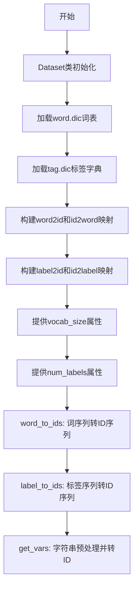
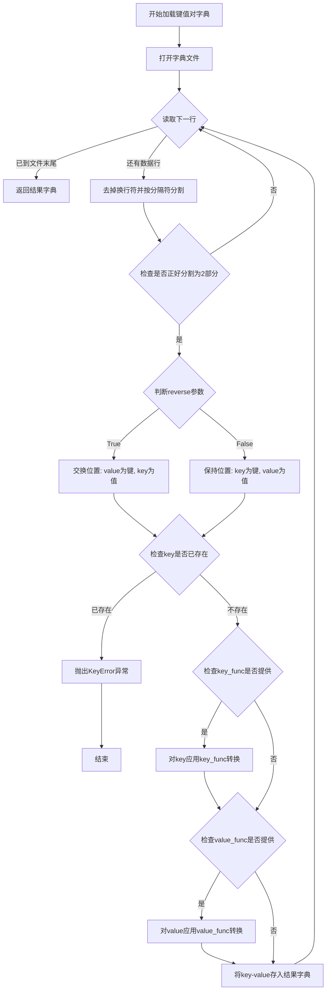
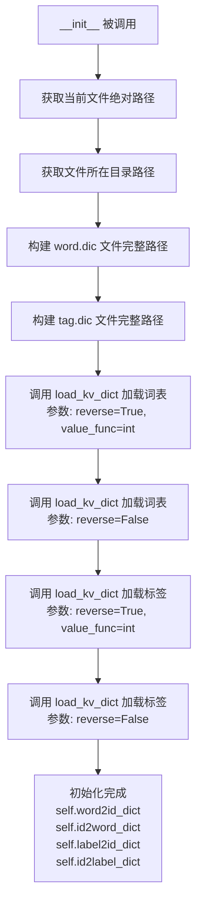
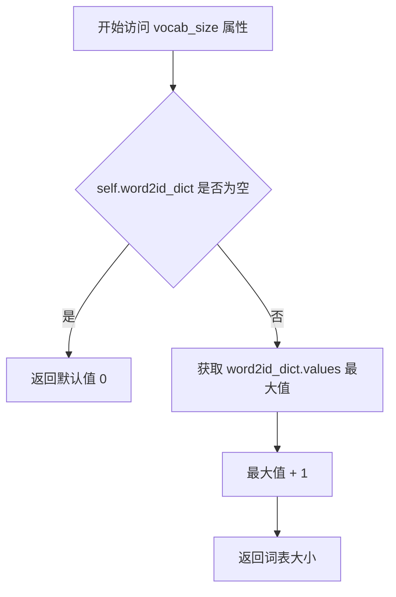
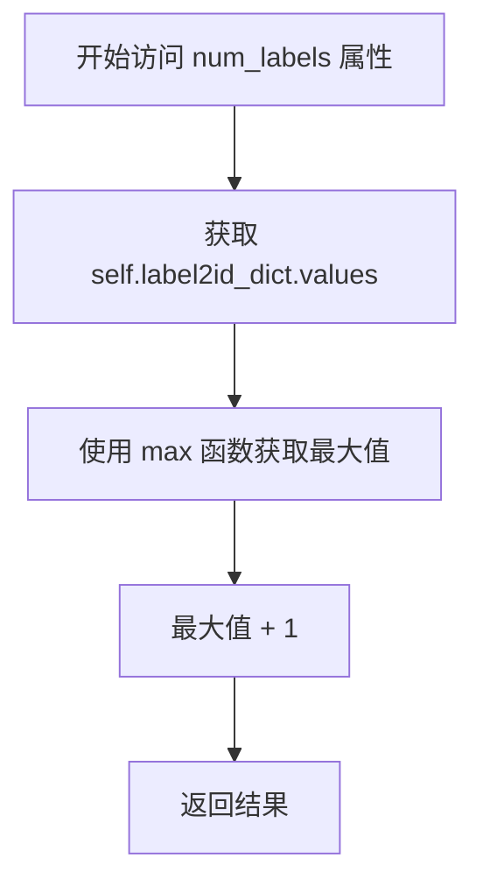
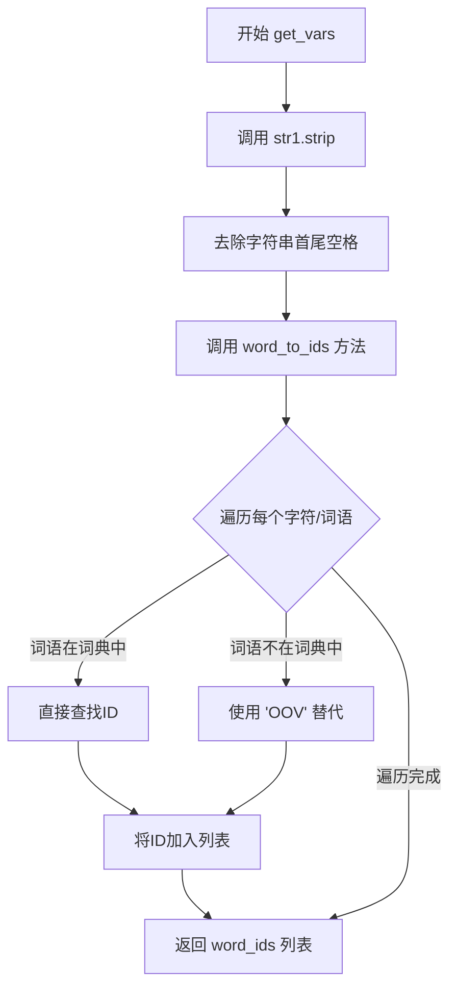

# `jieba\jieba\lac_small\reader_small.py` 详细设计文档

该文件是PaddlePaddle框架下的数据读取模块，负责加载词表和标签字典，将原始文本语料转换为模型可接受的ID序列，支持词到ID和标签到ID的映射转换。

## 整体流程



## 类结构

```
Dataset (数据读取类)
├── load_kv_dict (全局函数 - 加载键值对字典)
└── 内部字典属性
```

## 全局变量及字段


### `Dataset.word2id_dict`
    
词到ID的映射字典

类型：`dict`
    


### `Dataset.id2word_dict`
    
ID到词的映射字典

类型：`dict`
    


### `Dataset.label2id_dict`
    
标签到ID的映射字典

类型：`dict`
    


### `Dataset.id2label_dict`
    
ID到标签的映射字典

类型：`dict`
    
    

## 全局函数及方法


### `load_kv_dict`

从指定文件加载键值对字典，支持反向映射（交换键值）、自定义分隔符以及可选的键和值转换函数，用于构建词汇表或标签映射等场景。

参数：

- `dict_path`：`str`，字典文件的路径
- `reverse`：`bool`，是否反向映射（True 时将文件的第二列作为键，第一列作为值，默认为 False）
- `delimiter`：`str`，行内键值对的分隔符（默认为 "\t"）
- `key_func`：`callable`，可选的键转换函数，用于对键进行预处理（如转小写、截断等）
- `value_func`：`callable`，可选的值转换函数，用于对值进行预处理（如转换为整数）

返回值：`dict`，返回加载后的键值对字典

#### 流程图



#### 带注释源码

```python
def load_kv_dict(dict_path,
                 reverse=False,
                 delimiter="\t",
                 key_func=None,
                 value_func=None):
    """
    Load key-value dict from file
    
    Args:
        dict_path: 字典文件路径，文件格式为每行包含键值对，用指定分隔符分隔
        reverse: 是否反向映射，True时将文件的第二列作为键，第一列作为值
        delimiter: 键值对之间的分隔符，默认为制表符
        key_func: 可选的键转换函数，在存储前对键进行处理
        value_func: 可选的值转换函数，在存储前对值进行处理
    
    Returns:
        dict: 键值对字典
    """
    # 初始化结果字典
    result_dict = {}
    
    # 以只读模式打开文件，指定UTF-8编码
    for line in io.open(dict_path, "r", encoding='utf8'):
        # 去除行尾换行符并按分隔符分割
        terms = line.strip("\n").split(delimiter)
        
        # 跳过格式不正确的行（不是键值对形式）
        if len(terms) != 2:
            continue
        
        # 根据reverse参数决定键值对应关系
        if reverse:
            value, key = terms  # 反向：第二列作键，第一列作值
        else:
            key, value = terms  # 正向：第一列作键，第二列作值
        
        # 检查键是否重复，避免覆盖已有数据
        if key in result_dict:
            raise KeyError("key duplicated with [%s]" % (key))
        
        # 如果提供了key_func，对键进行转换处理
        if key_func:
            key = key_func(key)
        
        # 如果提供了value_func，对值进行转换处理
        if value_func:
            value = value_func(value)
        
        # 将处理后的键值对存入字典
        result_dict[key] = value
    
    # 返回加载完成的字典
    return result_dict
```


### `Dataset.__init__`

初始化 Dataset 实例，加载词表文件和标签映射文件，构建双向映射字典（word2id/id2word、label2id/id2label），为后续文本到ID的转换提供数据支持。

参数：
- `self`：Dataset 实例本身，无需显式传入

返回值：`None`，无返回值，该方法仅完成对象属性的初始化赋值

#### 流程图



#### 带注释源码

```python
def __init__(self):
    # 获取当前 Python 文件的绝对路径
    # __file__ 表示当前模块的文件路径
    basepath = os.path.abspath(__file__)
    
    # 获取文件所在的目录路径
    # 用于定位同目录下的词表文件
    folder = os.path.dirname(basepath)
    
    # 构建词表文件的完整路径
    # word.dic 存储词语到ID的映射关系
    word_dict_path = os.path.join(folder, "word.dic")
    
    # 构建标签映射文件的完整路径
    # tag.dic 存储标签到ID的映射关系
    label_dict_path = os.path.join(folder, "tag.dic")
    
    # 加载词表到ID的映射字典（正向映射）
    # reverse=True 表示文件的格式是 "id\tword"，需要反向构建 "word->id"
    # value_func=int 表示将 ID 值转换为整数类型
    self.word2id_dict = load_kv_dict(
        word_dict_path, reverse=True, value_func=int)
    
    # 加载ID到词的反向映射字典
    # 用于将 ID 转换回对应的词语
    self.id2word_dict = load_kv_dict(word_dict_path)
    
    # 加载标签到ID的映射字典（正向映射）
    # 用于将标签转换为数字 ID
    self.label2id_dict = load_kv_dict(
        label_dict_path, reverse=True, value_func=int)
    
    # 加载ID到标签的反向映射字典
    # 用于将数字 ID 转换回对应的标签
    self.id2label_dict = load_kv_dict(label_dict_path)
```


### `Dataset.vocab_size`

属性，返回词表大小。该属性是一个只读的属性 getter，通过获取 `word2id_dict` 字典中最大的值并加 1 来计算词汇表的大小。

参数：

- （无参数）

返回值：`int`，返回词表大小（词汇表中词的数量）

#### 流程图



#### 带注释源码

```python
@property
def vocab_size(self):
    """vocabulary size"""
    # 获取 word2id_dict 字典中所有值的最大值，然后加 1
    # 因为字典中的 ID 通常从 0 开始，所以需要 +1 来得到实际的词表大小
    return max(self.word2id_dict.values()) + 1
```


### `Dataset.num_labels`

该属性用于返回标签字典中标签的数量，通过获取标签ID字典中的最大ID值并加1计算得出。

参数： 无

返回值： `int`，返回标签的总数量，即标签 ID 的最大值加 1。

#### 流程图



#### 带注释源码

```python
@property
def num_labels(self):
    """num_labels"""
    return max(self.label2id_dict.values()) + 1
```

**说明：**
- `@property`：装饰器，将方法转换为属性，使其可以通过 `dataset.num_labels` 访问而不需要调用括号
- `self.label2id_dict`：类属性，存储标签到 ID 的映射字典
- `max(self.label2id_dict.values())`：获取字典中所有值（ID）的最大值
- `+ 1`：因为 ID 通常从 0 开始，所以需要加 1 来获取标签的实际数量
- 返回类型为 `int`，表示标签的总数


### `Dataset.word_to_ids`

将词序列（words）转换为对应的ID序列。如果词不在词汇表中，则使用"OOV"作为默认词进行转换。

参数：

- `words`：`list[str]` 或 `Iterable[str]`，需要转换的词序列

返回值：`list[int]`，转换后的ID序列

#### 流程图

```mermaid
flowchart TD
    A[开始] --> B[初始化空列表 word_ids]
    B --> C{遍历 words 中的每个 word}
    C --> D{word 是否在 word2id_dict 中}
    D -->|是| E[直接获取 word_id]
    D -->|否| F[将 word 设置为 "OOV"]
    F --> E
    E --> G[将 word_id 添加到 word_ids]
    G --> H{是否还有更多 word}
    H -->|是| C
    H -->|否| I[返回 word_ids]
    I --> J[结束]
```

#### 带注释源码

```python
def word_to_ids(self, words):
    """convert word to word index"""
    # 初始化一个空列表用于存储转换后的ID
    word_ids = []
    # 遍历输入的词序列
    for word in words:
        # 检查当前词是否在词到ID的字典中
        if word not in self.word2id_dict:
            # 如果不在字典中，使用"OOV"（Out-Of-Vocabulary）作为默认词
            word = "OOV"
        # 从字典中获取该词对应的ID
        word_id = self.word2id_dict[word]
        # 将ID添加到结果列表中
        word_ids.append(word_id)
    # 返回转换后的ID序列
    return word_ids
```


### `Dataset.label_to_ids`

将标签序列转换为对应的ID序列，通过查询预加载的标签到ID映射字典实现序列标注任务中标签的数字化。

参数：

- `labels`：`list[str]`，待转换的标签序列，每个元素为字符串类型的标签（如NER任务中的实体标签）

返回值：`list[int]`，转换后的ID序列，每个元素为整数类型的标签ID

#### 流程图

```mermaid
flowchart TD
    A[开始 label_to_ids] --> B[初始化空列表 label_ids]
    B --> C{遍历 labels 中的每个 label}
    C --> D{label 是否在 label2id_dict 中}
    D -->|是| E[直接从字典获取 label_id]
    D -->|否| F[使用默认标签 "O"]
    F --> E
    E --> G[将 label_id 添加到 label_ids 列表]
    G --> C
    C --> H{是否还有未处理的 label}
    H -->|是| C
    H -->|否| I[返回 label_ids 列表]
    I --> J[结束]
```

#### 带注释源码

```python
def label_to_ids(self, labels):
    """
    将标签序列转换为标签ID序列
    
    参数:
        labels: 标签列表，每个元素为字符串类型的标签
    
    返回值:
        label_ids: 对应的ID列表，每个元素为整数类型的标签ID
    """
    # 初始化用于存储ID的列表
    label_ids = []
    
    # 遍历输入的每个标签
    for label in labels:
        # 如果标签不在标签到ID的映射字典中
        if label not in self.label2id_dict:
            # 使用默认标签 "O"（Outside/Other）替代
            label = "O"
        
        # 从字典中获取标签对应的ID
        label_id = self.label2id_dict[label]
        
        # 将ID添加到结果列表中
        label_ids.append(label_id)
    
    # 返回转换后的ID序列
    return label_ids
```


### `Dataset.get_vars`

该方法将输入的字符串进行预处理（去除首尾空格），然后通过调用 `word_to_ids` 方法将字符串转换为对应的词语ID列表并返回。

参数：

- `str1`：`str`，待处理的输入字符串

返回值：`list[int]`，转换后的词语ID列表

#### 流程图



#### 带注释源码

```python
def get_vars(self, str1):
    """
    将输入字符串预处理并转换为ID列表
    
    参数:
        str1: str, 输入的待处理字符串
    
    返回:
        list: 转换后的词语ID列表
    """
    # 步骤1: 使用 strip() 去除字符串首尾的空格字符
    words = str1.strip()
    
    # 步骤2: 调用 word_to_ids 方法将字符串转换为ID列表
    # 该方法内部会遍历每个词语，查找对应的ID
    # 如果词语不在词典中，则使用 'OOV' 作为默认词语
    word_ids = self.word_to_ids(words)
    
    # 步骤3: 返回转换后的ID列表
    return word_ids
```

## 关键组件


### 键值对字典加载器 (load_kv_dict)

从文件加载键值对字典，支持反向映射、分割符自定义、键值转换函数

### 数据集类 (Dataset)

数据集核心类，负责加载词表和标签表，提供词汇到ID的转换功能

### 词表管理组件

管理词表和标签表的相互映射，包括word2id_dict（词到ID）、id2word_dict（ID到词）、label2id_dict（标签到ID）、id2label_dict（ID到标签）

### 词汇索引转换器 (word_to_ids)

将单词序列转换为对应的ID序列，处理未登录词（OOV）问题

### 标签索引转换器 (label_to_ids)

将标签序列转换为对应的ID序列，处理未定义标签

### 字符串变量转换器 (get_vars)

将输入字符串转换为词ID列表的便捷接口方法


## 问题及建议


### 已知问题

- **KeyError 风险**：`word_to_ids` 方法中使用 `"OOV"` 作为默认词，`label_to_ids` 方法中使用 `"O"` 作为默认词，但如果这些默认词不在字典中会抛出 `KeyError`
- **硬编码路径问题**：`Dataset` 类的构造函数中硬编码了 `word.dic` 和 `tag.dic` 路径，缺乏灵活性，无法支持自定义字典路径
- **重复计算性能损耗**：`vocab_size` 和 `num_labels` 属性每次调用都执行 `max()` 操作，没有缓存结果
- **异常处理缺失**：`load_kv_dict` 函数读取文件时没有处理文件不存在或读取异常的情况
- **无效导入**：`import __future__` 语句没有实际用途，属于冗余导入
- **命名不规范**：`get_vars` 方法的参数名 `str1` 没有实际意义，降低了代码可读性
- **字典重复键处理不完善**：`load_kv_dict` 中检测到重复键时抛出异常，但在读取大文件时可能希望跳过重复项而非中断程序

### 优化建议

- **修复 KeyError 风险**：使用字典的 `get()` 方法并提供安全的默认值，或在类初始化时验证默认词存在于字典中
- **解耦字典路径**：通过构造函数参数或 setter 方法允许外部传入自定义字典路径，提高类的复用性
- **添加缓存机制**：使用 `@functools.lru_cache` 或类属性缓存 `vocab_size` 和 `num_labels` 的计算结果
- **完善异常处理**：添加文件读取的异常捕获逻辑，为不同异常提供有意义的错误信息
- **清理无效导入**：移除无用的 `import __future__` 语句
- **改进命名**：将 `str1` 改为有意义的参数名如 `text` 或 `input_text`，将 `get_vars` 改为更描述性的方法名如 `convert_text_to_ids`
- **优化重复键处理**：考虑跳过重复键而非直接抛出异常，或提供选项控制行为


## 其它


### 设计目标与约束

本模块的设计目标是将原始语料（如单词和标签）转换为神经网络可以处理的ID形式，支持词表和标签表的加载与映射。约束条件包括：词典文件必须存在且格式正确（以制表符分隔的键值对），单词和标签必须在词典中否则使用默认值（"OOV"和"O"），仅支持UTF-8编码的文本文件。

### 错误处理与异常设计

在load_kv_dict函数中，当检测到重复的key时会抛出KeyError异常并终止加载过程。对于文件中格式不正确的行（不是恰好两个字段），会跳过该行继续处理。在word_to_ids和label_to_ids方法中，如果遇到未登录词（OOV），会使用预设的默认值替代。缺少词典文件时程序会抛出FileNotFoundError。

### 外部依赖与接口契约

本模块依赖以下外部组件：Python标准库（os、io）、PaddlePaddle框架（paddle、paddle.fluid）。接口契约包括：load_kv_dict函数接受dict_path（字符串，词典文件路径）、reverse（布尔值，是否反转键值）、delimiter（字符串，分隔符，默认制表符）、key_func和value_func（可选的转换函数），返回键值对字典。Dataset类的word_to_ids方法接受words（字符串列表），返回word_id列表；label_to_ids方法接受labels（字符串列表），返回label_id列表。

### 性能考虑与优化空间

当前实现使用io.open逐行读取文件，对于大型词典文件可以考虑使用内存映射（mmap）或分块加载。word_to_ids和label_to_ids方法中使用列表append操作，可以预先分配列表大小以提升性能。重复查询同一个词典时，可以考虑缓存结果。

### 安全性考虑

代码仅读取本地文件系统中的词典文件，不涉及网络请求或用户输入验证。需要确保词典文件路径安全，避免路径遍历攻击。OOV处理逻辑使用了硬编码的"OOV"和"O"字符串，建议提取为配置常量。

### 可测试性考虑

Dataset类的设计遵循了单一职责原则，便于单元测试。可以针对load_kv_dict函数编写独立的测试用例，验证不同分隔符、reverse参数、key_func和value_func的处理逻辑。word_to_ids和label_to_ids方法可以测试正常输入、OOV输入和空列表输入的场景。

### 部署和运维配置

词典文件（word.dic和tag.dic）必须与代码文件位于同一目录下。生产环境中需要监控词典加载失败的情况。建议添加日志记录模块加载过程和异常信息，便于问题排查。

### 版本历史与变更记录

当前版本为1.0，初始版本实现了基础的词典加载和ID映射功能。后续可考虑添加的功能包括：支持更多词典格式（如JSON、CSV）、支持动态更新词典、添加词典版本管理等。


    