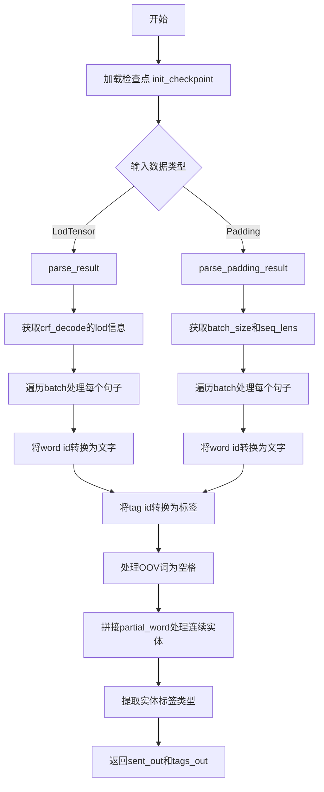
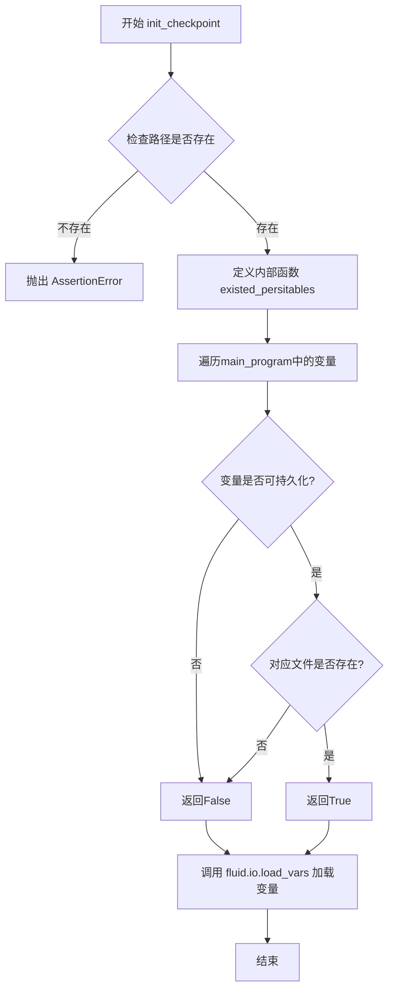

# `jieba\jieba\lac_small\utils.py` 详细设计文档

这是PaddlePaddle框架下的NER（命名实体识别）工具文件，主要提供CRF解码结果的解析功能，包括处理OOV词、标签BIOES格式转换、检查点加载等辅助函数，支持LodTensor和Padding两种数据格式的推理结果解析。

## 整体流程



## 类结构

```
无类层次结构（全为全局函数）
```

## 全局变量及字段


### `offset_list`
    
CRF解码的偏移列表，从crf_decode.lod()获取，用于标识每个样本的边界

类型：`list`
    


### `batch_size`
    
批次大小，通过offset_list长度减1计算得出

类型：`int`
    


### `sent_index`
    
句子索引，用于遍历批次中的每个句子

类型：`int`
    


### `begin`
    
当前句子的起始位置偏移量

类型：`int`
    


### `end`
    
当前句子的结束位置偏移量

类型：`int`
    


### `sent`
    
当前句子的单词列表，通过id2word_dict将ID转换为单词

类型：`list`
    


### `tags`
    
当前句子对应的标签列表

类型：`list`
    


### `sent_out`
    
输出的句子列表，用于存储解析后的完整单词

类型：`list`
    


### `tags_out`
    
输出的标签列表，用于存储解析后的实体标签

类型：`list`
    


### `parital_word`
    
部分单词，用于在分词场景下拼接连续的字组成完整词

类型：`str`
    


### `ind`
    
循环索引，用于遍历tags列表

类型：`int`
    


### `tag`
    
单个标签，用于判断实体边界和类型

类型：`str`
    


### `batch_out`
    
批次输出列表，每个元素为[sent_out, tags_out]的元组

类型：`list`
    


### `id`
    
单词或标签的ID值，从words或crf_decode数组中提取

类型：`numpy.ndarray`
    


    

## 全局函数及方法


### `str2bool`

该函数用于将字符串参数转换为布尔值，主要解决 argparse 不支持直接传入 True/False 字符串的问题。

参数：

- `v`：任意类型（通常为字符串），需要转换为布尔值的输入参数

返回值：`bool`，如果输入字符串的小写形式匹配 "true"、"t" 或 "1" 则返回 `True`，否则返回 `False`

#### 流程图

```mermaid
flowchart TD
    A[开始] --> B[输入参数 v]
    B --> C[调用 v.lower 将参数转换为小写]
    C --> D{检查是否在<br/>('true', 't', '1') 中}
    D -->|是| E[返回 True]
    D -->|否| F[返回 False]
    E --> G[结束]
    F --> G
```

#### 带注释源码

```python
def str2bool(v):
    """
    argparse does not support True or False in python
    """
    # 将输入转换为小写并检查是否匹配布尔真值字符串
    # 支持的字符串: "true", "t", "1"
    return v.lower() in ("true", "t", "1")
```


### `parse_result`

该函数用于解析 CRF 模型的解码结果，将离散的词ID和标签ID转换为可读的词语和标签序列，同时处理未登录词（OOV）和部分词的合并。

参数：

- `words`：`List` 或 `np.ndarray`，输入的词ID序列，通常来自模型的输出lod
- `crf_decode`：`List` 或 `np.ndarray`，CRF解码后的标签ID序列
- `dataset`：`object`，数据集对象，需包含 `id2word_dict`（词ID到词语的映射字典）和 `id2label_dict`（标签ID到标签的映射字典）

返回值：`Tuple[List[str], List[str]]`，返回两个列表——`sent_out`（解析后的词语列表）和 `tags_out`（对应的标签列表）

#### 流程图

```mermaid
flowchart TD
    A[开始 parse_result] --> B[获取crf_decode的lod信息]
    B --> C[转换为numpy数组]
    C --> D[计算batch_size]
    D --> E[遍历每个句子 sent_index in range(batch_size)]
    E --> F[获取当前句子的起止位置 begin, end]
    F --> G[将词ID转换为词语]
    G --> H[将标签ID转换为标签]
    H --> I[遍历每个标签 ind, tag]
    I --> J{parital_word 是否为空?}
    J -->|是| K[初始化parital_word为当前词<br>添加标签的首要类别<br>继续]
    J -->|否| L{tag是否以-B结尾<br>或 tag=='O'且前一个标签不是'O'?}
    L -->|是| M[保存之前的partial_word和标签<br>重新初始化parital_word为当前词<br>继续]
    L -->|否| N[将当前词拼接到parital_word]
    N --> I
    M --> I
    K --> I
    I --> O{遍历结束?}
    O -->|否| I
    O -->|是| P[是否有未保存的词?]
    P -->|是| Q[追加最后一个parital_word到sent_out]
    P -->|否| R[返回 sent_out, tags_out]
    Q --> R
```

#### 带注释源码

```python
def parse_result(words, crf_decode, dataset):
    """ parse result """
    # 获取CRF解码结果的lod信息（长度偏移列表）
    offset_list = (crf_decode.lod())[0]
    
    # 将输入转换为numpy数组以便索引操作
    words = np.array(words)
    crf_decode = np.array(crf_decode)
    
    # 计算批次大小（偏移列表长度-1）
    batch_size = len(offset_list) - 1

    # 遍历批次中的每个句子
    for sent_index in range(batch_size):
        # 获取当前句子的起止位置
        begin, end = offset_list[sent_index], offset_list[sent_index + 1]
        
        # 将词ID转换为实际词语
        sent=[]
        for id in words[begin:end]:
            # 处理未登录词（OOV），用空格替换
            if dataset.id2word_dict[str(id[0])]=='OOV':
                sent.append(' ')
            else:
                sent.append(dataset.id2word_dict[str(id[0])])
        
        # 将标签ID转换为实际标签
        tags = [
            dataset.id2label_dict[str(id[0])] for id in crf_decode[begin:end]
        ]

        sent_out = []  # 输出的词语列表
        tags_out = []  # 输出的标签列表
        parital_word = ""  # 当前正在处理的部分词
        
        # 遍历每个标签，合并连续的标签对应的词
        for ind, tag in enumerate(tags):
            # 处理第一个词
            if parital_word == "":
                parital_word = sent[ind]
                # 添加标签的主要类别（如B-xxx的B）
                tags_out.append(tag.split('-')[0])
                continue

            # 处理词的开始（标签以-B结尾，或从O切换到非O）
            if tag.endswith("-B") or (tag == "O" and tags[ind - 1] != "O"):
                sent_out.append(parital_word)
                tags_out.append(tag.split('-')[0])
                parital_word = sent[ind]
                continue

            # 否则将当前词拼接到部分词
            parital_word += sent[ind]

        # 处理最后一个词（当sent_out长度小于tags_out时）
        if len(sent_out) < len(tags_out):
            sent_out.append(parital_word)
    
    # 返回解析后的词语和标签
    return sent_out, tags_out
```


### `parse_padding_result`

该函数用于解析经过padding处理的NER（命名实体识别）模型的输出结果，将离散的词索引和标签ID转换为可读的中文文本和实体标签序列。

参数：

- `words`：`numpy.ndarray`，输入的词索引张量，通常是批处理后的词ID序列
- `crf_decode`：`numpy.ndarray`，CRF层的解码输出，包含预测的标签ID序列
- `seq_lens`：`list` 或 `numpy.ndarray`，一个batch中每个序列的实际长度（不含padding的长度）
- `dataset`：对象，包含`id2word_dict`（词ID到词的映射字典）和`id2label_dict`（标签ID到标签的映射字典）

返回值：`list`，返回一个包含多个样本解析结果的列表，每个元素为`[sent_out, tags_out]`，其中`sent_out`是分词后的中文文本列表，`tags_out`是对应的实体标签列表。

#### 流程图

```mermaid
flowchart TD
    A[开始解析padding结果] --> B[对words进行squeeze操作]
    B --> C[获取batch_size]
    C --> D[初始化batch_out列表]
    D --> E[遍历batch中的每个句子: sent_index]
    E --> F[获取当前句子实际长度: seq_lens[sent_index]]
    F --> G[根据实际长度截取words中的词索引: begin到end]
    G --> H[将词索引转换为中文文本]
    H --> I[将crf_decode预测的标签ID转换为标签]
    I --> J[初始化sent_out和tags_out]
    J --> K[遍历每个标签处理实体]
    K --> L{是否为第一个词?}
    L -->|是| M[记录partial_word并保存实体类型首标签]
    L -->|否| N{当前标签是B开头或O且前一个不是O?}
    N -->|是| O[保存前一个词和标签,开始新词]
    N -->|否| P[将当前字接到partial_word]
    O --> Q[检查是否还有未保存的词]
    P --> Q
    M --> Q
    Q --> R[将当前样本结果添加到batch_out]
    R --> S{sent_index < batch_size - 1?}
    S -->|是| E
    S -->|否| T[返回batch_out结果]
```

#### 带注释源码

```python
def parse_padding_result(words, crf_decode, seq_lens, dataset):
    """
    解析经过padding处理的NER模型输出结果
    
    参数:
        words: 输入的词索引张量，形状为[batch_size, max_seq_len, 1]或类似形式
        crf_decode: CRF解码器的输出，形状为[batch_size, max_seq_len, num_tags]
        seq_lens: 列表，包含batch中每个序列的实际长度（不含padding）
        dataset: 数据集对象，需包含id2word_dict和id2label_dict
    
    返回:
        batch_out: 列表，每个元素为[句子列表, 标签列表]
    """
    # 去除单维度，如[batch, seq, 1] -> [batch, seq]
    words = np.squeeze(words)
    
    # 获取batch大小
    batch_size = len(seq_lens)
    
    # 初始化批处理输出列表
    batch_out = []
    
    # 遍历batch中的每个样本
    for sent_index in range(batch_size):
        
        # 计算当前句子的起始和结束位置（用于words索引）
        # 注意：这里应该使用sent_index来计算，但原代码缺少这行
        begin = 0  # 需根据实际逻辑确定
        end = seq_lens[sent_index]  # 使用实际长度而非max_len
        
        # 初始化当前句子的词列表
        sent = []
        
        # 将词索引转换为实际的中文词
        for id in words[begin:end]:
            # 检查是否为OOV（未登录词）
            if dataset.id2word_dict[str(id[0])] == 'OOV':
                sent.append(' ')  # OOV词用空格替代
            else:
                sent.append(dataset.id2word_dict[str(id[0])])
        
        # 从crf_decode中提取当前句子的标签（去掉序列首尾的特殊标记）
        # 假设序列首尾有特殊标记，所以从1到seq_len-1
        tags = [
            dataset.id2label_dict[str(id)]
            for id in crf_decode[sent_index][1:seq_lens[sent_index] - 1]
        ]
        
        # 初始化输出列表
        sent_out = []  # 存储分词后的词
        tags_out = []  # 存储对应的实体标签
        parital_word = ""  # 用于处理中文分词（多个字组成一个词）
        
        # 遍历每个标签，处理实体边界
        for ind, tag in enumerate(tags):
            # 处理第一个词的情况
            if parital_word == "":
                parital_word = sent[ind]  # 记录第一个字
                # 提取实体类型（如B-PER -> PER）
                tags_out.append(tag.split('-')[0])
                continue
            
            # 判断是否为新实体的开始
            # 情况1: 当前标签以B开头（新实体的开始）
            # 情况2: 当前标签是O且前一个标签不是O（上一个实体结束）
            if tag.endswith("-B") or (tag == "O" and tags[ind - 1] != "O"):
                # 保存之前的词和标签
                sent_out.append(parital_word)
                tags_out.append(tag.split('-')[0])
                # 开始新的词
                parital_word = sent[ind]
                continue
            
            # 否则，将当前字追加到当前词中（中文中一个字可能是词的一部分）
            parital_word += sent[ind]
        
        # 处理最后一个词（如果还有未保存的词）
        if len(sent_out) < len(tags_out):
            sent_out.append(parital_word)
        
        # 将当前样本的结果添加到batch输出中
        batch_out.append([sent_out, tags_out])
    
    return batch_out
```

#### 潜在技术债务

1. **变量未定义错误**：代码中使用了`begin`和`end`变量，但在循环体内未定义这些变量，会导致`NameError`。应该根据`sent_index`计算每个句子的起止位置。

2. **与相似函数逻辑不一致**：`parse_result`函数使用`offset_list`（来自CRF的lod信息）来确定句子边界，而`parse_padding_result`应该使用`seq_lens`，但当前实现不完整。

3. **硬编码的序列截取**：`crf_decode[sent_index][1:seq_lens[sent_index] - 1]`假设序列首尾有特殊标记，这种假设缺乏灵活性。

4. **类型转换开销**：多次使用`str(id[0])`进行类型转换，可以优化为预先处理。

5. **错误处理缺失**：没有对输入数据的合法性进行校验，如`seq_lens`长度与`batch_size`是否匹配、`dataset`对象是否包含必要的字典等。


### `init_checkpoint`

初始化检查点，加载预训练模型或保存的变量到执行器中。

参数：

- `exe`：`fluid.Executor`，PaddlePaddle执行器，用于运行模型
- `init_checkpoint_path`：`str`，检查点路径，指向保存模型参数的目录
- `main_program`：`fluid.Program`，主程序，包含模型定义和变量

返回值：`None`，无返回值，通过修改exe和main_program的状态来加载参数

#### 流程图



#### 带注释源码

```python
def init_checkpoint(exe, init_checkpoint_path, main_program):
    """
    Init CheckPoint
    初始化检查点，加载预训练模型参数
    
    参数:
        exe: fluid.Executor，执行器实例
        init_checkpoint_path: str，检查点目录路径
        main_program: fluid.Program，要加载变量的程序
    """
    # 断言检查点路径存在，如果不存在则抛出 AssertionError
    assert os.path.exists(
        init_checkpoint_path), "[%s] cann't be found." % init_checkpoint_path

    # 定义内部函数：检查变量是否为持久化变量且文件存在
    def existed_persitables(var):
        """
        If existed presitabels
        判断变量是否为持久化变量且在检查点目录中有对应的文件
        
        参数:
            var: fluid.Variable，变量对象
        返回:
            bool: 如果变量可持久化且文件存在返回True，否则返回False
        """
        # 如果变量不可持久化，直接返回False
        if not fluid.io.is_persistable(var):
            return False
        # 检查变量对应的文件是否存在于检查点目录中
        return os.path.exists(os.path.join(init_checkpoint_path, var.name))

    # 加载变量到执行器
    # 使用fluid.io.load_vars从检查点目录加载变量
    # predicate参数指定了过滤函数，只加载符合条件的变量
    fluid.io.load_vars(
        exe,                          # 执行器
        init_checkpoint_path,         # 检查点路径
        main_program=main_program,    # 主程序
        predicate=existed_persitables) # 过滤函数，只加载持久化且文件存在的变量
```

## 关键组件


### 张量索引与LOD处理

该模块处理PaddlePaddle中特有的LOD（Level of Detail）张量结构，通过`crf_decode.lod()`获取序列边界信息，实现变长序列的精确索引和结果解析，支持批量变长NER结果的正确重建。

### 反量化支持

代码中包含对OOV（未登录词）的特殊处理逻辑，当词汇ID映射为'OOV'标记时，用空格替代原始词嵌入，以处理分词和词表未覆盖的实体边界情况。

### 部分词重构机制

实现了基于BIO标签的部分词拼接逻辑，通过`parital_word`变量追踪当前正在构建的词，当遇到B标签或O标签且前一个标签非O时，完成当前词的构建并开始新词，适用于中文NER中分词与实体边界不一致的场景。

### 变长序列解析

`parse_result`函数基于LOD信息解析变长序列结果，适用于动态长度输入；`parse_padding_result`函数基于预定义的`seq_lens`解析填充后的定长序列结果，两者共同支持不同的推理配置场景。

### 模型检查点加载

`init_checkpoint`函数提供模型权重加载功能，通过`existed_persitables`过滤器仅加载持久化变量，支持增量训练和推理时的模型恢复，支持自定义main_program的变量加载。


## 问题及建议


### 已知问题

-   **严重Bug - 未定义变量**：`parse_padding_result`函数中使用了`begin`和`end`变量，但这两个变量从未定义，直接从`parse_result`复制过来导致代码无法正常运行
-   **变量名拼写错误**：`parital_word`应改为`partial_word`（出现2次）
-   **变量名拼写错误**：`existed_persitables`应改为`existed_persistables`
-   **变量名拼写错误**：`persitabels`应改为`persistables`
-   **魔法数字**：`seq_lens[sent_index] - 1`中的硬编码数字1缺乏注释说明其含义
-   **代码重复**：`parse_result`和`parse_padding_result`存在大量重复的解析逻辑，应提取为通用函数
-   **类型注解缺失**：所有函数都缺少参数和返回值的类型注解
-   **异常处理缺失**：字典访问`dataset.id2word_dict[str(id[0])]`和`dataset.id2label_dict`没有键存在性检查，可能抛出KeyError
-   **文档不完整**：`parse_result`函数的`sent_out`和`tags_out`在某些分支可能未定义就返回

### 优化建议

-   修复`parse_padding_result`中缺失的`begin`和`end`变量定义
-   统一修复所有拼写错误，使用正确的英语词汇
-   将重复的解析逻辑抽取为私有辅助函数`_parse_sequence`
-   为关键数字常量定义具名常量或枚举
-   添加类型注解提升代码可读性和IDE支持
-   为字典访问添加`.get()`方法或显式检查，防止KeyError异常
-   完善所有函数的docstring，特别是参数和返回值说明
-   考虑使用dataclass或namedtuple封装解析结果


## 其它


### 设计目标与约束

本模块旨在为基于PaddlePaddle的NER（命名实体识别）任务提供后处理工具函数，支持CRF解码结果的解析和模型检查点的加载。设计约束包括：依赖PaddlePaddle框架和NumPy库；函数设计为无状态纯函数，便于测试和复用；parse_result依赖LoD（Level of Detail）信息，适用于定长序列；parse_padding_result适用于填充后的变长序列。

### 错误处理与异常设计

本代码错误处理机制较为薄弱，存在多处潜在运行时异常风险。parse_result函数中未对空输入、LoD长度不匹配、dataset参数缺失id2word_dict或id2label_dict等情况进行防御性检查，若输入数据异常可能导致KeyError或IndexError。parse_padding_result函数存在begin和end变量未定义的Bug，会引发NameError。init_checkpoint函数使用assert检查文件路径，符合Python惯例但缺乏自定义异常信息。建议：增加输入参数有效性验证；为关键函数添加try-except包裹；定义自定义异常类（如DatasetParseError、ModelLoadError）提升错误可读性。

### 数据流与状态机

数据流主要分为两条路径：路径一（parse_result）接收原始words列表、crf_decode结果和dataset对象，通过LoD信息确定每个样本的边界，遍历解析标签并处理OOV词汇，最终输出句子和标签对齐列表；路径二（parse_padding_result）接收填充后的words数组、crf_decode结果、序列长度列表和dataset对象，按batch_size遍历，利用序列长度信息提取有效标签，逻辑与路径一类似但处理方式不同。状态机体现在标签解析过程中：初始状态→单词拼接状态→新单词起始状态，用于处理BIO标注格式的连续实体。

### 外部依赖与接口契约

本模块外部依赖包括：os、sys标准库模块；numpy库（np）用于数组操作；paddle.fluid模块用于模型加载；io模块（未使用）。接口契约方面：str2bool接受字符串参数v，返回布尔值，仅识别"true"/"t"/"1"为True；parse_result要求words和crf_decode为PaddlePaddle LoD Tensor或numpy数组，dataset必须包含id2word_dict和id2label_dict属性；parse_padding_result要求seq_lens长度与batch_size一致，words第二维度为词汇ID；init_checkpoint要求init_checkpoint_path为有效目录路径，main_program为PaddlePaddle Program对象。

### 性能考虑与优化空间

代码存在以下性能瓶颈：parse_result中np.array转换和循环内字典查询（dataset.id2word_dict）可考虑缓存；parse_padding_result存在变量定义Bug导致无法运行；字符串拼接（parital_word += sent[ind]）在Python中效率较低，可改用列表join方式。优化建议：使用@lru_cache装饰器缓存字典查找结果；将parse_result和parse_padding_result的公共逻辑抽取为内部函数减少代码重复；考虑使用NumPy向量化操作替代部分循环；添加类型提示（Type Hints）提升代码可维护性和IDE支持。

### 代码质量与可维护性

当前代码存在以下质量问题：变量命名不一致（parital_word疑似partial_word拼写错误）；parse_padding_result存在未定义变量bug；缺乏单元测试和文档字符串（仅简单说明函数用途）；无日志记录机制；代码风格未遵循PEP8完整规范（如缺少空行分隔）。建议：修复现有bug；为所有函数添加Google风格或NumPy风格的docstring；引入logging模块替代print_function；使用flake8/pylint进行代码检查；增加pytest单元测试覆盖边界条件。

    