# `jieba\jieba\posseg\__init__.py` 详细设计文档

这是jieba中文分词库的词性标注模块，提供了基于HMM（隐马尔可夫模型）和基于词典的混合分词与词性标注功能，能够对中文句子进行分词并标注相应的词性（名词、动词、形容词等）。

## 整体流程

```mermaid
graph TD
    A[开始: 输入中文句子] --> B{是否使用Paddle?}
    B -- 是且已安装 --> C[调用Paddle分词]
    B -- 否 --> D{是否有进程池?}
    D -- 是 --> E[并行处理: 使用pool.map]
    D -- 否 --> F[串行处理: dt.cut]
    C --> G[yield pair(word, tag)]
    E --> H[对每部分调用_lcut_internal]
    F --> G
    H --> G
    G --> I{内部处理: __cut_internal}
    I --> J{句子类型判断}
    J -- 汉字/字母/数字混合 --> K[使用__cut_DAG或__cut_DAG_NO_HMM]
    J -- 纯数字 --> L[标记为'm']
    J -- 纯英文 --> M[标记为'eng']
    J -- 空白符 --> N[标记为'x']
    K --> O[HMM Viterbi解码或DAG查词]
    O --> P[yield pair(word, tag)]
    L --> P
    M --> P
    N --> P
    P --> Q[结束: 返回词性标注结果]
```

## 类结构

```
pair (词性对容器类)
└── POSTokenizer (词性分词器类)
    └── 依赖: jieba.Tokenizer (底层分词器)
    └── 依赖: viterbi (HMM解码算法)
    └── 数据: char_state_tab_P (字符状态表)
    └── 数据: start_P (初始概率)
    └── 数据: trans_P (转移概率)
    └── 数据: emit_P (发射概率)
```

## 全局变量及字段


### `PROB_START_P`
    
初始概率文件名

类型：`str`
    


### `PROB_TRANS_P`
    
转移概率文件名

类型：`str`
    


### `PROB_EMIT_P`
    
发射概率文件名

类型：`str`
    


### `CHAR_STATE_TAB_P`
    
字符状态表文件名

类型：`str`
    


### `re_han_detail`
    
中文详细匹配正则

类型：`re.Pattern`
    


### `re_skip_detail`
    
跳过详细匹配正则

类型：`re.Pattern`
    


### `re_han_internal`
    
中文内部匹配正则

类型：`re.Pattern`
    


### `re_skip_internal`
    
跳过内部匹配正则

类型：`re.Pattern`
    


### `re_eng`
    
英文匹配正则

类型：`re.Pattern`
    


### `re_num`
    
数字匹配正则

类型：`re.Pattern`
    


### `re_eng1`
    
单字符英文匹配正则

类型：`re.Pattern`
    


### `char_state_tab_P`
    
字符状态表数据

类型：`dict`
    


### `start_P`
    
HMM初始概率

类型：`dict`
    


### `trans_P`
    
HMM转移概率

类型：`dict`
    


### `emit_P`
    
HMM发射概率

类型：`dict`
    


### `dt`
    
默认分词器实例

类型：`POSTokenizer`
    


### `pair.word`
    
词语

类型：`str`
    


### `pair.flag`
    
词性标注

类型：`str`
    


### `POSTokenizer.tokenizer`
    
底层分词器实例

类型：`jieba.Tokenizer`
    


### `POSTokenizer.word_tag_tab`
    
词语到词性的映射表

类型：`dict`
    
    

## 全局函数及方法


### `load_model`

该函数用于Jython平台，加载HMM（隐马尔可夫模型）相关的概率数据文件，包括初始概率、转移概率、发射概率和字符状态映射表，这些数据用于中文分词中的词性标注任务。

参数： 无

返回值：`tuple`，返回一个包含4个元素的元组 `(state, start_p, trans_p, emit_p)`，依次为字符状态映射表、初始概率、转移概率和发射概率。

#### 流程图

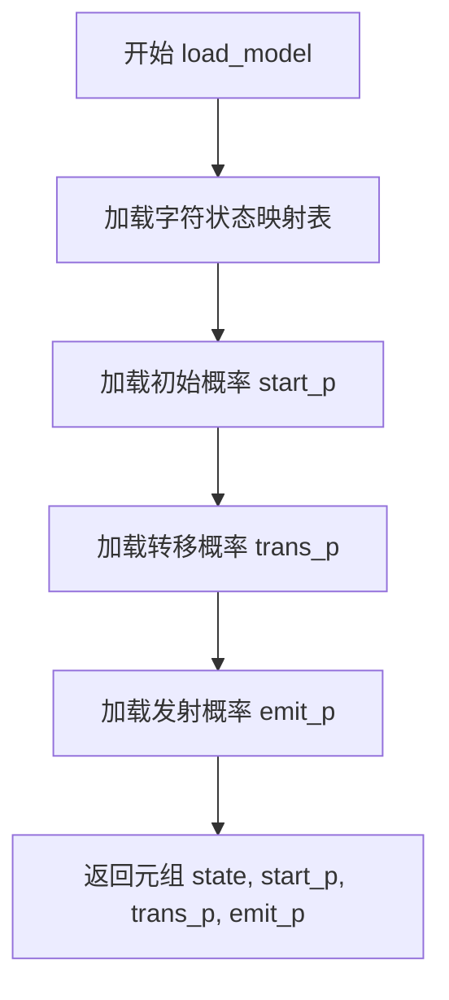

#### 带注释源码

```python
def load_model():
    # For Jython
    # 加载字符到状态映射表的pickle文件
    start_p = pickle.load(get_module_res("posseg", PROB_START_P))
    # 加载HMM初始概率的pickle文件
    trans_p = pickle.load(get_module_res("posseg", PROB_TRANS_P))
    # 加载HMM发射概率的pickle文件
    emit_p = pickle.load(get_module_res("posseg", PROB_EMIT_P))
    # 加载字符状态表的pickle文件
    state = pickle.load(get_module_res("posseg", CHAR_STATE_TAB_P))
    # 返回加载的四个HMM模型数据
    return state, start_p, trans_p, emit_p
```


### POSTokenizer.initialize

该方法用于初始化分词器实例，加载指定的词典文件并读取词性标签映射表，为后续的中文分词和词性标注做好准备。

参数：

- `dictionary`：`任意类型`（默认为None），可选的词典文件路径或配置字典，用于指定分词器所使用的词典。若为None，则使用jieba默认词典。

返回值：`None`，该方法直接修改实例状态，不返回任何值。

#### 流程图

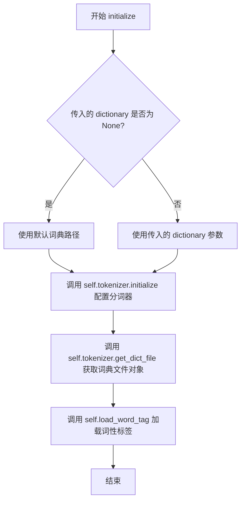

#### 带注释源码

```python
def initialize(self, dictionary=None):
    """
    初始化分词器，加载词典和词性标签
    
    参数:
        dictionary: 可选的词典路径或配置字典，默认为None使用jieba内置词典
    """
    # 调用内部tokenizer对象的initialize方法
    # dictionary参数将传递给jieba.Tokenizer用于加载自定义词典
    self.tokenizer.initialize(dictionary)
    
    # 获取词典文件对象并加载词性标签映射表
    # get_dict_file返回文件对象，load_word_tag解析并存储word->tag的映射关系
    self.load_word_tag(self.tokenizer.get_dict_file())
```

---

### 全局函数 initialize

该全局函数是默认分词器实例`dt`的`initialize`方法的别名，提供了便捷的接口来初始化jieba分词器的默认实例。

参数：

- `dictionary`：`任意类型`（默认为None），可选的词典文件路径或配置字典，用于指定分词器所使用的词典。若为None，则使用jieba默认词典。

返回值：`None`，该函数直接修改默认分词器实例的状态，不返回任何值。

#### 流程图

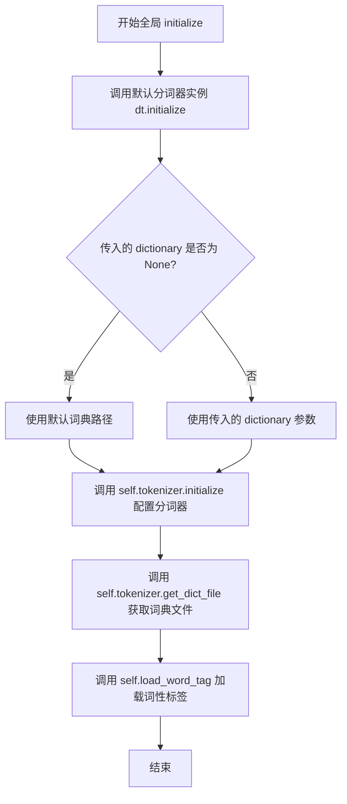

#### 带注释源码

```python
# 全局初始化函数，是默认分词器实例dt的initialize方法的别名
# 位于模块底部: initialize = dt.initialize
# 允许用户直接通过jieba.initialize()调用来初始化默认分词器

def initialize(dictionary=None):
    """
    初始化默认分词器
    
    参数:
        dictionary: 可选的词典路径或配置字典，默认为None使用jieba内置词典
    """
    # 实际上调用的是POSTokenizer实例dt的initialize方法
    # dt = POSTokenizer(jieba.dt)  # 在模块底部定义
    # self.tokenizer是jieba.Tokenizer的实例
    # self.load_word_tag用于加载词性标注词典
    
    # 源码赋值语句:
    # initialize = dt.initialize
    pass
```


### `_lcut_internal(s)`

该函数是 jieba 分词库的全局分词辅助函数，通过调用默认分词器实例 `dt` 的内部方法 `_lcut_internal` 对输入句子进行精确分词，并返回包含词性和词语的 `pair` 对象列表。

参数：

- `s`：`str`，待分词的输入句子

返回值：`list`，返回分词结果列表，列表中的每个元素为 `pair` 对象，表示分词后的词语及其对应的词性标签

#### 流程图

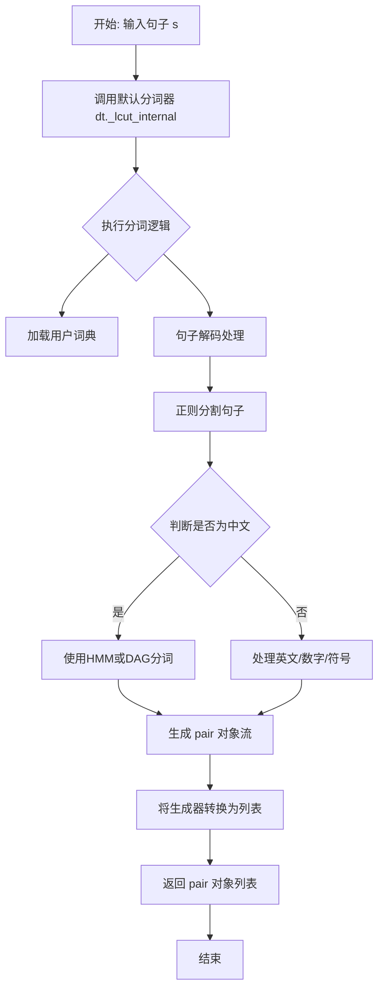

#### 带注释源码

```python
def _lcut_internal(s):
    """
    全局分词函数，调用默认分词器实例的分词方法
    
    参数:
        s: str, 待分词的输入句子
        
    返回:
        list: 包含 pair 对象的列表，每个 pair 代表一个词语及其词性
    """
    # 调用默认 POSTokenizer 实例 dt 的 _lcut_internal 方法
    # dt 是模块级默认分词器，初始化为 POSTokenizer(jieba.dt)
    # 内部会调用 __cut_internal 方法进行实际的分词处理
    return dt._lcut_internal(s)
```

#### 关联：POSTokenizer 类的 `_lcut_internal` 方法

参数：

- `self`：`POSTokenizer`，分词器实例本身
- `sentence`：`str`，待分词的输入句子

返回值：`list`，返回分词后的结果列表

```python
def _lcut_internal(self, sentence):
    """
    实例方法：将内部 __cut_internal 生成器转换为列表返回
    
    参数:
        sentence: str, 待分词的句子
        
    返回:
        list: 分词结果列表，包含 pair 对象
    """
    # 调用私有方法 __cut_internal 获取生成器
    # 然后将整个生成器内容转换为列表
    return list(self.__cut_internal(sentence))
```


### `_lcut_internal_no_hmm(s)`

该全局函数是 `jieba` 分词库中调用默认分词器的无HMM切割方法，接收原始句子字符串，调用默认 `POSTokenizer` 实例的内部方法完成不带隐马尔可夫模型的分词处理，并返回词性标注对（word/pos）列表。

参数：

- `s`：`str`，待分词的原始句子字符串

返回值：`list`，包含词性标注对（`pair` 对象）的列表，每个元素为 `(word, flag)` 元组，其中 `word` 是分词结果，`flag` 是对应的词性标注

#### 流程图

```mermaid
flowchart TD
    A[开始: 输入句子s] --> B[调用dt._lcut_internal_no_hmm]
    B --> C[进入POSTokenizer实例方法]
    C --> D[调用__cut_internal<br/>参数: sentence, HMM=False]
    D --> E{makesure_userdict_loaded<br/>加载用户词典}
    E --> F[strdecode解码句子]
    F --> G[re_han_internal.split分割句子]
    G --> H{遍历每个文本块 blk}
    H -->|blk是中文| I[使用__cut_DAG_NO_HMM分词]
    H -->|blk是其他| J[使用re_skip_internal分割]
    J --> K{遍历分割结果x}
    K -->|x是空白| L[生成pair(x, 'x')]
    K -->|x是数字| M[生成pair(xx, 'm')]
    K -->|x是英文| N[生成pair(xx, 'eng')]
    K -->|x是其他| O[生成pair(xx, 'x')]
    I --> P[yield word for word in cut_blk]
    L --> Q[收集所有pair结果]
    M --> Q
    N --> Q
    O --> Q
    P --> Q
    H --> Q
    Q --> R[list()转换结果]
    R --> S[返回结果列表]
```

#### 带注释源码

```python
# 全局函数定义
def _lcut_internal_no_hmm(s):
    """
    全局无HMM分词接口函数
    
    该函数是jieba分词库的公开API之一，
    调用默认POSTokenizer实例dt的内部方法
    执行不带隐马尔可夫模型(HMM)的分词处理
    
    参数:
        s: str, 待分词的原始句子字符串
        
    返回:
        list: 词性标注对(pair对象)的列表
    """
    # 直接调用默认分词器实例dt的_lcut_internal_no_hmm方法
    return dt._lcut_internal_no_hmm(s)


# 下面是dt实例对应的POSTokenizer类中的方法实现：

def _lcut_internal_no_hmm(self, sentence):
    """
    POSTokenizer实例的无HMM分词方法
    
    参数:
        self: POSTokenizer实例本身
        sentence: str, 待分词的句子
        
    返回:
        list: 分词结果列表
    """
    # 调用__cut_internal方法，传入HMM=False参数
    # 内部会使用__cut_DAG_NO_HMM而不是__cut_DAG进行分词
    return list(self.__cut_internal(sentence, False))


def __cut_internal(self, sentence, HMM=True):
    """
    内部通用分词处理方法
    
    参数:
        self: POSTokenizer实例
        sentence: str, 待分词句子
        HMM: bool, 是否使用HMM模型，True使用__cut_DAG，False使用__cut_DAG_NO_HMM
        
    返回:
        generator: pair生成器
    """
    # 确保用户词典已加载
    self.makesure_userdict_loaded()
    
    # 将句子解码为统一编码格式
    sentence = strdecode(sentence)
    
    # 使用正则表达式按中文字符+英文数字+符号分割句子
    blocks = re_han_internal.split(sentence)
    
    # 根据HMM参数选择分词方法
    if HMM:
        cut_blk = self.__cut_DAG  # 使用HMM的分词方法
    else:
        cut_blk = self.__cut_DAG_NO_HMM  # 不使用HMM的分词方法
    
    # 遍历每个文本块进行分词处理
    for blk in blocks:
        if re_han_internal.match(blk):
            # 中文块，使用选定的分词方法
            for word in cut_blk(blk):
                yield word
        else:
            # 非中文块，使用正则分割处理
            tmp = re_skip_internal.split(blk)
            for x in tmp:
                if re_skip_internal.match(x):
                    # 空白字符，标记为'x'
                    yield pair(x, 'x')
                else:
                    # 对每个字符进行处理
                    for xx in x:
                        if re_num.match(xx):
                            # 数字，标记为'm'
                            yield pair(xx, 'm')
                        elif re_eng.match(x):
                            # 英文，标记为'eng'
                            yield pair(xx, 'eng')
                        else:
                            # 其他字符，标记为'x'
                            yield pair(xx, 'x')


def __cut_DAG_NO_HMM(self, sentence):
    """
    不使用HMM的有向无环图分词方法
    
    该方法是核心分词逻辑，基于词典和DAG进行分词
    """
    # 获取句子的有向无环图(DAG)
    DAG = self.tokenizer.get_DAG(sentence)
    route = {}
    
    # 计算最优路径
    self.tokenizer.calc(sentence, DAG, route)
    
    x = 0
    N = len(sentence)
    buf = ''
    
    while x < N:
        # 获取下一个节点
        y = route[x][1] + 1
        l_word = sentence[x:y]
        
        if re_eng1.match(l_word):
            # 如果是英文单词，累积到缓冲区
            buf += l_word
            x = y
        else:
            # 如果有累积的英文缓冲区，先输出
            if buf:
                yield pair(buf, 'eng')
                buf = ''
            # 输出当前词语及其词性
            yield pair(l_word, self.word_tag_tab.get(l_word, 'x'))
            x = y
    
    # 处理末尾的英文缓冲区
    if buf:
        yield pair(buf, 'eng')
```


### `cut(sentence, HMM=True, use_paddle=False)`

全局分词函数，支持并行处理和多种分词模式（基于HMM或PaddlePaddle）。该函数是jieba分词库的核心入口，根据参数选择不同的分词策略，并支持多进程并行提升性能。

参数：

- `sentence`：`str`，需要分词的原始文本输入
- `HMM`：`bool`，是否启用隐马尔可夫模型(HMM)进行新词发现，默认为True
- `use_paddle`：`bool`，是否使用PaddlePaddle框架进行分词，默认为False

返回值：`Iterator[pair]`，生成器形式返回分词结果，每个元素为word/tag形式的pair对象

#### 流程图

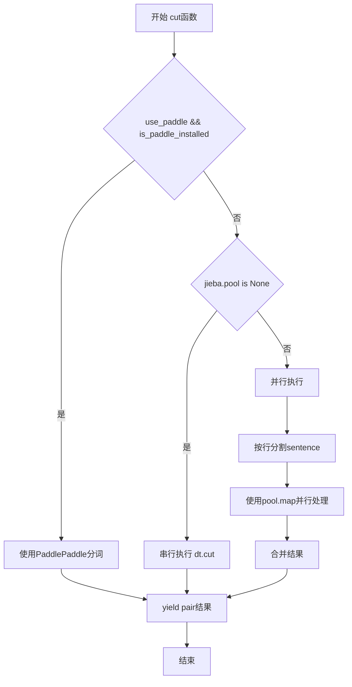

#### 带注释源码

```python
def cut(sentence, HMM=True, use_paddle=False):
    """
    Global `cut` function that supports parallel processing.

    Note that this works using dt, custom POSTokenizer
    instances are not supported.
    """
    # 检查PaddlePaddle是否安装且用户选择使用
    is_paddle_installed = check_paddle_install['is_paddle_installed']
    if use_paddle and is_paddle_installed:
        # 空句子处理，避免paddle核心异常
        if sentence is None or sentence == "" or sentence == u"":
            return
        # 导入paddle预测模块
        import jieba.lac_small.predict as predict
        # 调用paddle进行分词和词性标注
        sents, tags = predict.get_result(strdecode(sentence))
        # 遍历结果并yield返回
        for i, sent in enumerate(sents):
            if sent is None or tags[i] is None:
                continue
            yield pair(sent, tags[i])
        return
    
    # 引用全局默认分词器实例
    global dt
    # 无并行池时直接串行分词
    if jieba.pool is None:
        for w in dt.cut(sentence, HMM=HMM):
            yield w
    else:
        # 有并行池时，拆分任务并行处理
        parts = strdecode(sentence).splitlines(True)
        if HMM:
            # 使用HMM模式并行处理
            result = jieba.pool.map(_lcut_internal, parts)
        else:
            # 不使用HMM模式并行处理
            result = jieba.pool.map(_lcut_internal_no_hmm, parts)
        # 合并所有并行结果
        for r in result:
            for w in r:
                yield w
```

### 关键组件信息

| 组件名称 | 一句话描述 |
|---------|-----------|
| `POSTokenizer` | 基于jieba Tokenizer的词性标注分词器类 |
| `pair` | 分词结果的结构体，封装word和flag（词性） |
| `dt` | 默认的全局POSTokenizer实例 |
| `jieba.pool` | 多进程并行处理的任务池 |
| `_lcut_internal` | 全局辅助函数，调用dt的内部cut方法 |
| `check_paddle_install` | PaddlePaddle安装状态检查字典 |

### 潜在的技术债务与优化空间

1. **全局状态依赖**：函数依赖全局变量`dt`，无法直接注入自定义POSTokenizer实例，测试困难
2. **异常处理缺失**：PaddlePaddle分词路径未捕获ImportError等异常，并行处理失败时无降级策略
3. **空值处理不一致**：Paddle分支检查空句子，但HMM分支未做同等校验
4. **性能瓶颈**：并行处理时按行分割可能不均衡，小文本反而有额外序列化开销
5. **类型提示缺失**：无Python type hints，影响IDE智能提示和静态分析

### 其它设计信息

#### 设计目标与约束
- 兼容性优先：同时支持传统HMM和先进的PaddlePaddle分词
- 性能优化：通过多进程池并行处理长文本
- 向后兼容：默认参数保持原有分词行为

#### 错误处理与异常设计
- 空输入处理：Paddle模式下显式返回避免异常
- 导入失败处理：Paddle模块在需要时才动态导入
- 全局实例：使用global关键字修改模块级状态

#### 外部依赖与接口契约
- 依赖jieba主库、paddlepaddle库（可选）
- 输入必须为可解码的字符串类型
- 输出为迭代器，需外部消费或转为list


### `lcut`

全局分词函数 `lcut` 是 jieba 分词库的核心接口之一，用于对输入的中文句子进行分词处理。该函数封装了 `cut` 函数，将生成器结果转换为列表返回，支持隐马尔可夫模型（HMM）分词和 PaddlePaddle 深度学习分词两种模式。

参数：

- `sentence`：`str`，需要分词的中文句子或文本
- `HMM`：`bool`，是否使用隐马尔可夫模型进行分词，默认为 `True`
- `use_paddle`：`bool`，是否使用 PaddlePaddle 进行分词，默认为 `False`

返回值：`list`，分词结果列表，每个元素为 `pair` 对象（词/词性对）

#### 流程图

```mermaid
flowchart TD
    A[开始 lcut] --> B{use_paddle?}
    B -->|True| C[调用 cut(sentence, use_paddle=True)]
    B -->|False| D[调用 cut(sentence, HMM)]
    C --> E[将生成器转换为列表]
    D --> E
    E --> F[返回列表结果]
```

#### 带注释源码

```python
def lcut(sentence, HMM=True, use_paddle=False):
    """
    全局分词函数，返回分词结果列表
    
    参数:
        sentence: str, 需要分词的中文句子
        HMM: bool, 是否使用隐马尔可夫模型进行分词，默认为True
        use_paddle: bool, 是否使用PaddlePaddle进行分词，默认为False
    
    返回:
        list: 分词结果列表，每个元素为pair对象(词, 词性)
    """
    # 如果启用PaddlePaddle分词模式
    if use_paddle:
        # 调用cut函数并转换为列表返回
        return list(cut(sentence, use_paddle=True))
    # 否则使用默认的HMM分词模式
    return list(cut(sentence, HMM))
```

#### 关键设计说明

| 项目 | 说明 |
|------|------|
| **设计目标** | 提供简洁的分词接口，将生成器结果转换为列表方便使用 |
| **依赖函数** | 内部调用 `cut` 函数完成实际分词逻辑 |
| **分词模式** | 支持 HMM 概率分词和 PaddlePaddle 深度学习分词两种模式 |
| **返回值** | 返回 `pair` 对象列表，每个对象包含词（word）和词性（flag） |


### `pair.__init__`

该方法是 `pair` 类的构造函数，用于初始化一个词性标注对（word-flag pair）对象，将传入的词语和词性标记存储为对象的属性。

参数：

- `word`：`str`，要处理的词语或词段
- `flag`：`str`，该词语对应的词性标注（如 'n'、'v'、'm'、'eng' 等）

返回值：`None`，无返回值，仅作为初始化方法设置对象属性

#### 流程图

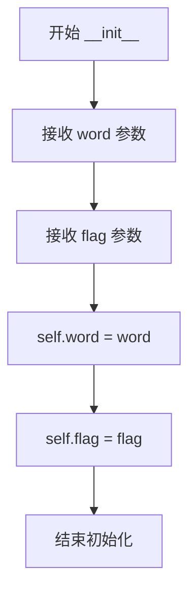

#### 带注释源码

```python
def __init__(self, word, flag):
    """
    pair 类的初始化方法
    
    参数:
        word: 词语/词段
        flag: 词性标注
    
    返回值:
        无 (None)
    """
    # 将传入的词语存储为实例属性 word
    self.word = word
    # 将传入的词性标注存储为实例属性 flag
    self.flag = flag
```


### `pair.__unicode__`

该方法返回词与词性的组合字符串，格式为"word/flag"，用于将词和词性标记组合成一个可读的形式。

参数：无（仅包含隐式参数 `self`）

返回值：`str`（在 Python 2 中返回 unicode 字符串，在 Python 3 中返回 str），返回格式为"word/flag"的字符串，表示词与词性的组合。

#### 流程图

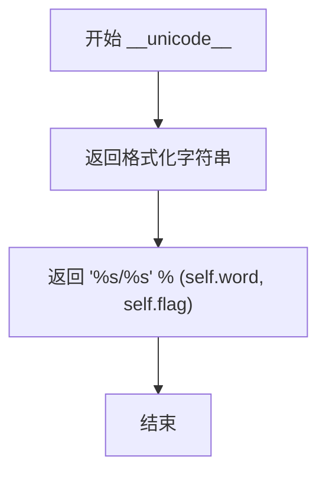

#### 带注释源码

```
def __unicode__(self):
    """
    返回词与词性的组合表示形式
    
    该方法将词（word）和词性标记（flag）组合成一个字符串，
    格式为 'word/flag'，便于人类阅读和打印输出。
    
    Returns:
        str: 格式为 'word/flag' 的字符串，例如 '今天/t'
    """
    return '%s/%s' % (self.word, self.flag)
```


### `pair.__repr__`

该方法是 `pair` 类的字符串表示方法，用于返回对象的官方字符串表示形式，方便调试和日志输出。

参数：

- `self`：`pair`，表示调用该方法的 `pair` 实例对象本身

返回值：`str`，返回 `pair` 对象的官方字符串表示，格式为 `pair(word, flag)`

#### 流程图

```mermaid
flowchart TD
    A[开始 __repr__] --> B[获取 self.word 的 repr 表示]
    B --> C[获取 self.flag 的 repr 表示]
    C --> D[格式化为 'pair(%r, %r)' % (self.word, self.flag)]
    D --> E[返回格式化后的字符串]
    E --> F[结束]
```

#### 带注释源码

```python
def __repr__(self):
    """
    返回 pair 对象的官方字符串表示。
    
    该方法用于生成对象的官方字符串表示，主要用于调试和日志输出。
    当直接打印对象或在解释器中查看对象时会被调用。
    
    Returns:
        str: 格式化的字符串，形式为 'pair(word, flag)'
             例如：如果 word='测试'，flag='n'，则返回 "pair('测试', 'n')"
    """
    return 'pair(%r, %r)' % (self.word, self.flag)
```


### `pair.__str__`

该方法用于将词法分析结果（词-词性对）转换为字符串表示形式，根据Python版本的不同采用不同的编码处理方式。

参数：
- 无参数（使用self对象）

返回值：`str`，返回词与词性拼接的字符串，格式为"word/flag"

#### 流程图

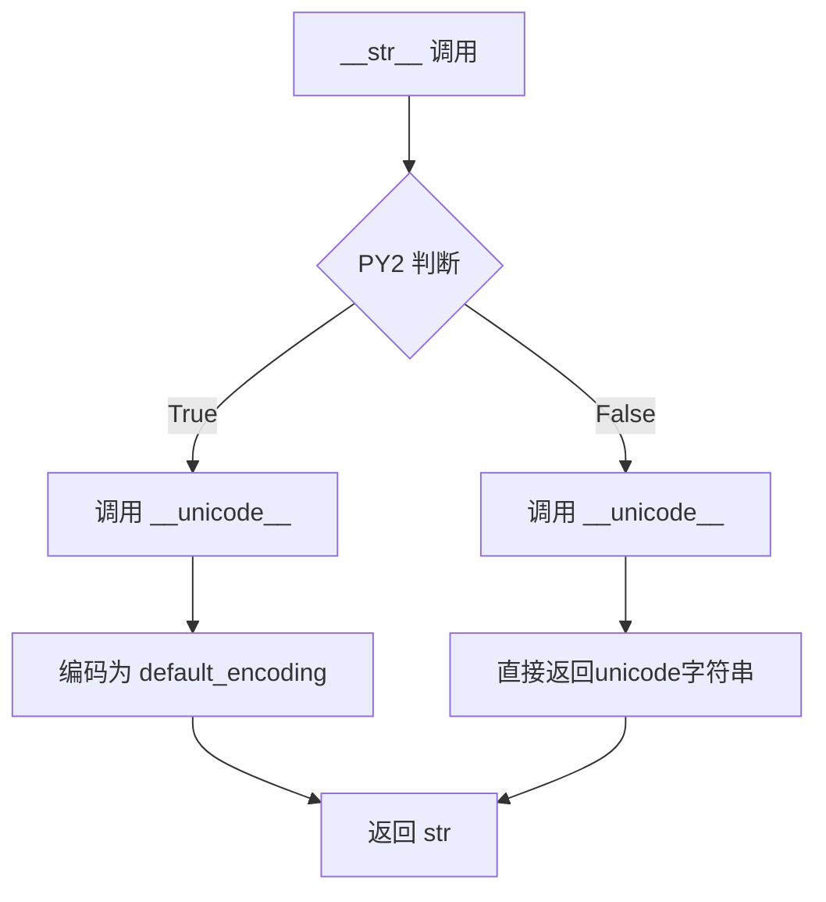

#### 带注释源码

```
def __str__(self):
    """
    将pair对象转换为字符串表示
    
    Python 2下返回字节字符串，Python 3下返回unicode字符串
    """
    if PY2:
        # Python 2环境：将unicode字符串编码为系统默认编码的字节字符串
        return self.__unicode__().encode(default_encoding)
    else:
        # Python 3环境：直接返回unicode字符串
        return self.__unicode__()
```


### `pair.__iter__`

该方法使 `pair` 对象可迭代，返回一个迭代器以遍历词（word）和词性标记（flag）组成的两元素元组。

参数：本方法不接受任何额外参数（除隐含的 `self`）。

- 无

返回值：`iterator`，返回一个迭代器，该迭代器依次产生 `self.word` 和 `self.flag`。

#### 流程图

```mermaid
flowchart TD
    A[开始 __iter__] --> B{返回迭代器}
    B --> C[返回 iter((self.word, self.flag))]
    C --> D[结束]
```

#### 带注释源码

```python
def __iter__(self):
    """
    使 pair 对象可迭代。
    
    返回:
        iterator: 一个迭代器，按顺序产生 (word, flag) 元组中的两个元素。
                  首先是词本身，然后是词性标记。
    """
    # 将 word 和 flag 组成元组，然后用 iter() 包装成迭代器返回
    # 这样可以在 for 循环中直接遍历 pair 对象，如：
    # for item in pair_obj:  # item 依次为 word 和 flag
    return iter((self.word, self.flag))
```


### `pair.__lt__`

该方法是 `pair` 类的魔术方法（Magic Method），用于实现两个 `pair` 对象之间的比较操作。当使用 `<` 运算符比较两个 `pair` 对象时，会自动调用此方法。它通过比较两个对象的 `word` 属性来确定大小关系，使得 `pair` 对象可以用于排序等需要比较操作的场景。

参数：

- `other`：`pair`，要比较的另一个 pair 对象

返回值：`bool`，如果当前对象的 `word` 属性小于 `other` 对象的 `word` 属性则返回 `True`，否则返回 `False`

#### 流程图

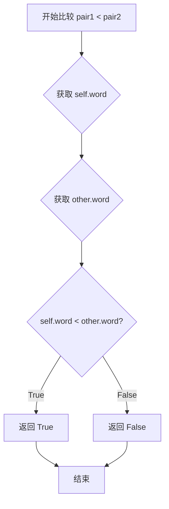

#### 带注释源码

```python
def __lt__(self, other):
    """
    比较两个 pair 对象的大小关系
    
    参数:
        other: pair - 要比较的另一个 pair 对象
    
    返回:
        bool - 如果当前对象的 word 属性小于 other 对象的 word 属性则返回 True
    """
    # 直接使用字符串的 < 运算符比较两个 word 属性
    # 这里假设 other 也是一个 pair 对象，拥有 word 属性
    # 如果 other 没有 word 属性，会抛出 AttributeError
    return self.word < other.word
```


### `pair.__eq__`

该方法用于比较两个 `pair` 对象是否相等，只有在两者都是 `pair` 实例且 `word` 与 `flag` 属性相同的情况下返回 `True`。

参数：

- `other`：`object`，待比较的对象。

返回值：`bool`，若相等返回 `True`，否则返回 `False`。

#### 流程图

```mermaid
flowchart TD
    A([开始 __eq__]) --> B{isinstance(other, pair)?}
    B -- 否 --> C[返回 False]
    B -- 是 --> D{self.word == other.word?}
    D -- 否 --> C
    D -- 是 --> E{self.flag == other.flag?}
    E -- 否 --> C
    E -- 是 --> F[返回 True]
```

#### 带注释源码

```python
def __eq__(self, other):
    """
    比较 self 与 other 是否相等。

    只有当 other 也是 pair 实例，且 word 与 flag 均相同才返回 True。

    参数
    ----
    other : object
        参与比较的对象。

    返回值
    -------
    bool
        相等返回 True，否则返回 False。
    """
    # 先检查 other 是否为 pair 实例
    if not isinstance(other, pair):
        return False
    # 再比较 word 与 flag
    return self.word == other.word and self.flag == other.flag
```


### `pair.__hash__`

该方法实现了 Python 的哈希协议，使 `pair` 对象可以被用作字典的键或加入集合中。哈希值基于 `pair` 对象的 `word` 属性计算。

参数：无（隐式参数 `self` 表示实例本身）

返回值：`int`，返回 `word` 属性的哈希值

#### 流程图

```mermaid
flowchart TD
    A[开始 __hash__] --> B[获取 self.word]
    B --> C[计算 hash&#40;self.word&#41;]
    C --> D[返回哈希值]
    D --> E[结束]
```

#### 带注释源码

```python
def __hash__(self):
    """
    返回 pair 对象的哈希值
    
    该方法使 pair 对象可以被哈希化，从而可以：
    - 作为字典的键使用
    - 加入集合（如 set、frozenset）中
    
    哈希值仅基于 word 属性计算，不考虑 flag 属性。
    这意味着具有相同 word 但不同 flag 的 pair 对象
    将具有相同的哈希值。
    
    Returns:
        int: self.word 的哈希值
    """
    return hash(self.word)
```


### `pair.encode`

该方法是 `pair` 类的实例方法，用于将 `pair` 对象（词/词性对）的 Unicode 字符串表示编码为指定的字节编码格式。

参数：

-  `arg`：`str`，字符编码格式（如 'utf-8'、'gbk' 等），指定输出字节的编码方式

返回值：`bytes`（Python 3）或 `str`（Python 2），返回编码后的字节串（Python 3）或字符串（Python 2）

#### 流程图

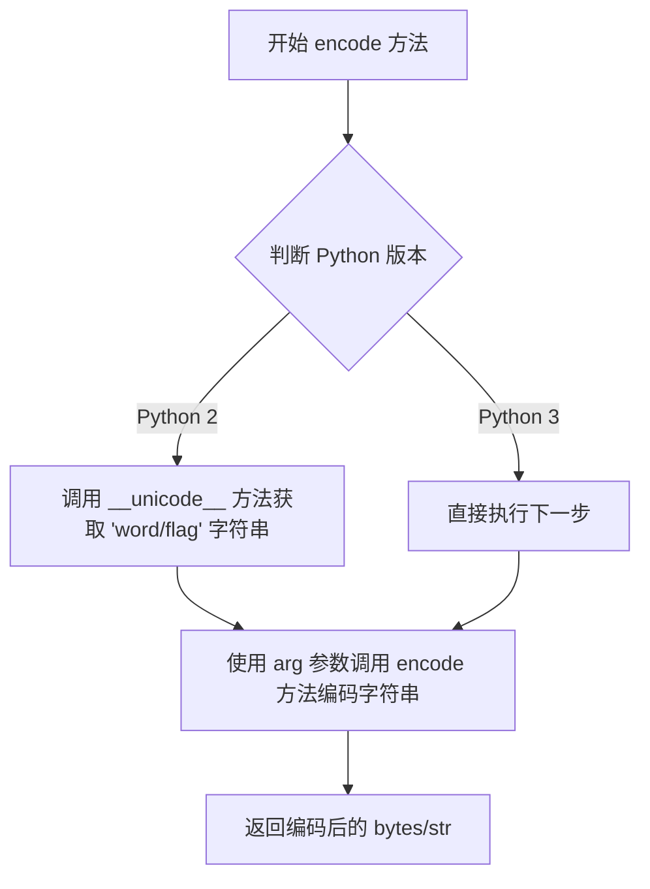

#### 带注释源码

```python
def encode(self, arg):
    """
    Encode the unicode representation of the pair object.
    
    This method converts the pair object (word/flag) to its unicode string
    representation using __unicode__ method, then encodes it using the
    specified encoding argument.
    
    Args:
        arg: A string specifying the character encoding (e.g., 'utf-8', 'gbk')
    
    Returns:
        In Python 3: bytes object - the encoded byte string
        In Python 2: str object - the encoded string (bytes in Py2)
    """
    # 调用 __unicode__ 方法获取 'word/flag' 格式的字符串，然后使用 arg 指定的编码进行编码
    # In Python 2: returns encoded string (bytes)
    # In Python 3: returns bytes object
    return self.__unicode__().encode(arg)
```


### `POSTokenizer.__init__`

该方法是 `POSTokenizer` 类的构造函数，用于初始化词性标注分词器实例。它接受一个可选的 `tokenizer` 参数，若未提供则创建一个默认的 `jieba.Tokenizer()` 实例，并立即加载词典文件以构建词性标签映射表。

参数：

- `tokenizer`：`jieba.Tokenizer` 或 `None`，可选参数，用于指定底层分词器实例。若为 `None`，则自动创建 `jieba.Tokenizer()` 默认实例。默认为 `None`。

返回值：`None`，该方法为构造函数，不返回任何值。

#### 流程图

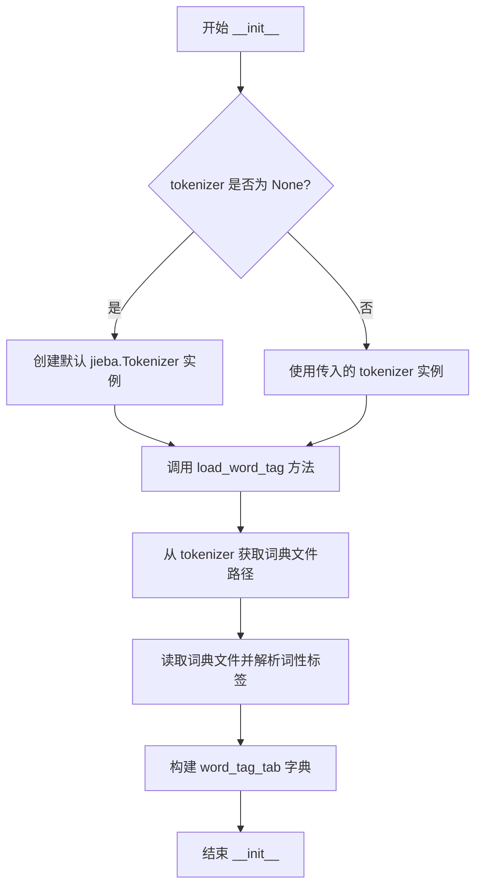

#### 带注释源码

```python
def __init__(self, tokenizer=None):
    """
    POSTokenizer 类的构造函数，初始化词性标注分词器。
    
    参数:
        tokenizer: 可选的 jieba.Tokenizer 实例。
                   如果为 None，则使用 jieba 默认的分词器。
    """
    # 如果未提供 tokenizer，则创建默认的 jieba.Tokenizer() 实例
    # 否则使用传入的 tokenizer 实例
    self.tokenizer = tokenizer or jieba.Tokenizer()
    
    # 加载词典文件并解析词性标签，构建 word_tag_tab 字典
    # 该字典用于将分词结果映射到对应的词性标签
    self.load_word_tag(self.tokenizer.get_dict_file())
```


### `POSTokenizer.__repr__`

该方法返回 POSTokenizer 对象的字符串表示形式，用于调试和日志输出，格式为 `<POSTokenizer tokenizer={tokenizer}>`。

参数：无

返回值：`str`，返回对象的字符串表示形式，包含内部 tokenizer 对象的 repr 信息

#### 流程图

```mermaid
flowchart TD
    A[开始 __repr__] --> B{执行方法}
    B --> C[使用 %r 格式化 self.tokenizer]
    C --> D[返回字符串 '<POSTokenizer tokenizer={tokenizer}>']
    D --> E[结束]
```

#### 带注释源码

```python
def __repr__(self):
    """
    返回 POSTokenizer 对象的字符串表示形式
    
    Returns:
        str: 格式如 '<POSTokenizer tokenizer={tokenizer}>' 的字符串，
             其中 {tokenizer} 是内部 jieba.Tokenizer 对象的 repr 表示
    """
    return '<POSTokenizer tokenizer=%r>' % self.tokenizer
```


### `POSTokenizer.__getattr__`

动态属性访问方法，用于将属性查找转发给内部的 `tokenizer` 对象，但对于部分不支持的方法（`cut_for_search`, `lcut_for_search`, `tokenize`）直接抛出 `NotImplementedError`。

参数：

- `name`：`str`，要访问的属性名称。

返回值：任意类型，返回 `self.tokenizer` 对象的对应属性值。如果属性不存在，会抛出 `AttributeError`。

#### 流程图

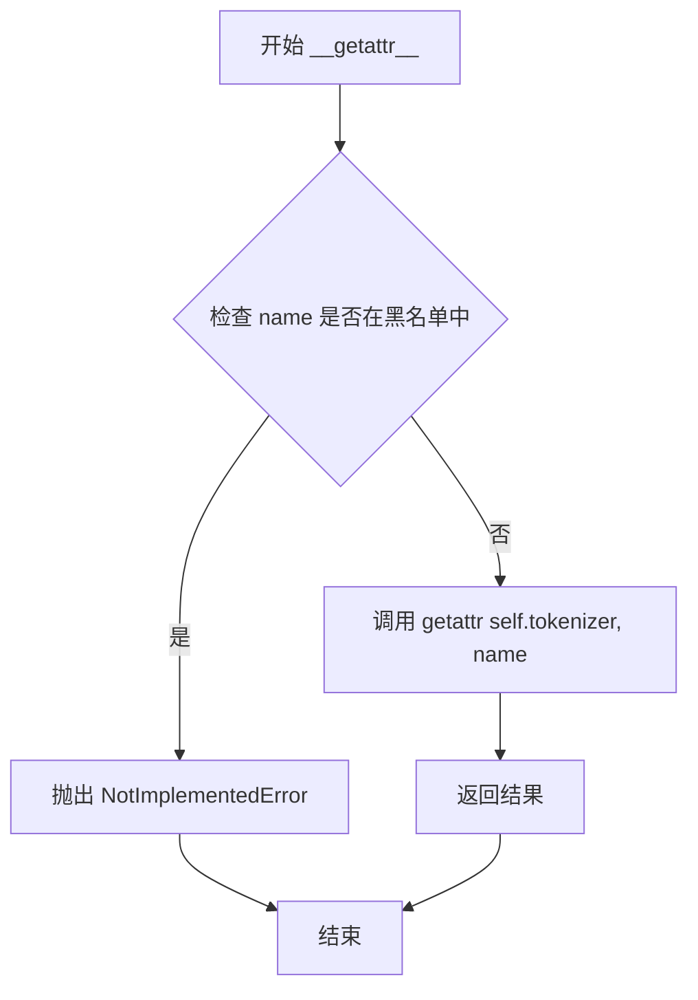

#### 带注释源码

```python
def __getattr__(self, name):
    """
    动态属性访问转发。
    
    当访问 POSTokenizer 实例的某个属性时，如果该属性在 POSTokenizer 类中不存在，
    Python 会自动调用此方法。此方法尝试将请求转发给内部的 self.tokenizer 对象。
    
    对于某些在 jieba 中未实现或语义不同的方法，直接拒绝并抛出 NotImplementedError。
    """
    # 黑名单：这些方法在当前版本中未实现或行为特殊
    if name in ('cut_for_search', 'lcut_for_search', 'tokenize'):
        # 可能不支持？抛出未实现错误
        raise NotImplementedError
    # 委托给内部的 tokenizer 实例
    return getattr(self.tokenizer, name)
```


### `POSTokenizer.initialize`

该方法用于初始化分词器的词典和词性标注功能，通过调用底层tokenizer的initialize方法并加载词性标注词典来完成分词器的初始化配置。

参数：

- `dictionary`：`str` 或 `None`，可选参数，用于指定自定义词典路径。如果为`None`，则使用默认词典。

返回值：`None`，该方法无返回值，仅执行初始化操作。

#### 流程图

```mermaid
flowchart TD
    A[开始 initialize] --> B{判断 dictionary 是否为 None}
    B -->|是| C[调用 self.tokenizer.initialize None]
    B -->|否| D[调用 self.tokenizer.initialize dictionary]
    C --> E[调用 self.tokenizer.get_dict_file 获取词典文件路径]
    D --> E
    E --> F[调用 self.load_word_tag 加载词性标注表]
    F --> G[结束]
    
    subgraph load_word_tag 内部流程
    H[打开词典文件] --> I[逐行读取]
    I --> J{检查行是否有效}
    J -->|无效| K[抛出 ValueError 异常]
    J -->|有效| L[解析 word 和 tag]
    L --> M[更新 word_tag_tab 字典]
    M --> N{是否还有更多行}
    N -->|是| I
    N -->|否| O[关闭文件]
    end
    
    F -.-> H
```

#### 带注释源码

```python
def initialize(self, dictionary=None):
    """
    初始化分词器的词典和词性标注功能
    
    参数:
        dictionary: 可选的词典路径，如果为None则使用默认词典
    """
    # 调用底层jieba Tokenizer的initialize方法初始化词典
    # dictionary参数会被传递给tokenizer进行词典加载
    self.tokenizer.initialize(dictionary)
    
    # 从tokenizer获取词典文件路径，然后加载词性标注表
    # 这是一个关键步骤，将词性与词语关联起来用于词性标注功能
    self.load_word_tag(self.tokenizer.get_dict_file())
```


### POSTokenizer.load_word_tag

该方法用于从字典文件中加载词性标注映射，将文件中每个词语及其对应的词性标签存储到内存字典中，供分词器在进行中文分词时查询词语的词性。

参数：
- `f`：文件对象或文件路径，要加载的词性字典文件

返回值：`None`，无返回值

#### 流程图

```mermaid
flowchart TD
    A[开始加载词性字典] --> B[初始化word_tag_tab字典]
    B --> C[解析文件获取文件名]
    C --> D{遍历文件每一行}
    D -->|读取到行| E[去除行首尾空白并解码为UTF-8]
    E --> F{检查行是否为空}
    F -->|非空| G[按空格分割行提取词语和词性]
    G --> H[将词语和词性存入word_tag_tab字典]
    H --> D
    F -->|空行| D
    D -->|文件结束| I[关闭文件]
    I --> J[结束加载]
    
    G -->|解析异常| K[抛出ValueError异常]
    K --> J
```

#### 带注释源码

```python
def load_word_tag(self, f):
    """
    从字典文件加载词性标注映射表
    
    参数:
        f: 文件对象或文件路径，词性字典文件
        文件格式: 每行一个词语和词性，用空格分隔，例如: "测试 v"
    
    返回:
        None
    
    异常:
        ValueError: 当字典文件格式错误时抛出
    """
    # 初始化词性映射表字典，用于存储词语到词性的映射
    self.word_tag_tab = {}
    
    # 解析传入的参数，获取文件的真实名称用于错误信息
    f_name = resolve_filename(f)
    
    # 遍历文件的每一行，lineno从1开始计数
    for lineno, line in enumerate(f, 1):
        try:
            # 去除行首尾空白字符，并解码为UTF-8编码
            line = line.strip().decode("utf-8")
            
            # 跳过空行
            if not line:
                continue
            
            # 按空格分割行，取第一个部分为词语，最后一个部分为词性
            # 中间部分被丢弃（用_表示）
            word, _, tag = line.split(" ")
            
            # 将词语作为键，词性作为值，存入字典
            self.word_tag_tab[word] = tag
        except Exception:
            # 如果解析过程中出现任何异常，抛出详细的错误信息
            raise ValueError(
                'invalid POS dictionary entry in %s at Line %s: %s' % (f_name, lineno, line))
    
    # 关闭文件句柄，释放资源
    f.close()
```


### `POSTokenizer.makesure_userdict_loaded`

确保用户词典已加载，将用户词标签表合并到主词标签表中，并清空用户词标签缓存。

参数：

- `self`：`POSTokenizer` 实例，隐式参数，表示当前分词器对象

返回值：`None`，无返回值，执行合并操作后直接返回

#### 流程图

```mermaid
graph TD
    A[开始 makesure_userdict_loaded] --> B{self.tokenizer.user_word_tag_tab 是否存在且非空}
    B -->|否| E[结束]
    B -->|是| C[将 user_word_tag_tab 更新到 word_tag_tab]
    C --> D[清空 tokenizer.user_word_tag_tab]
    D --> E
```

#### 带注释源码

```python
def makesure_userdict_loaded(self):
    """
    确保用户词典已加载。
    
    将用户词标签表（user_word_tag_tab）合并到主词标签表（word_tag_tab）中，
    并清空用户词标签缓存，以便后续分词操作可以使用用户自定义的词性标签。
    """
    # 检查 tokenizer 的用户词标签表是否存在且非空
    if self.tokenizer.user_word_tag_tab:
        # 将用户词标签表中的所有条目更新到主词标签表中
        # 这样后续分词时就可以使用用户自定义的词性标签
        self.word_tag_tab.update(self.tokenizer.user_word_tag_tab)
        # 清空用户词标签表缓存，避免重复合并
        self.tokenizer.user_word_tag_tab = {}
```


### `POSTokenizer.__cut`

该方法是 POSTokenizer 类的私有方法，核心功能是使用 Viterbi 算法对输入句子进行基于隐马尔可夫模型（HMM）的词性标注与分词处理，通过状态转移（B-词首、E-词尾、S-单字词）将句子切分为词-词性对。

参数：

- `sentence`：`str`，需要分词的输入句子

返回值：`Generator[pair]`，生成器，逐个 yield 返回包含词（word）和词性（flag）的 pair 对象

#### 流程图

```mermaid
flowchart TD
    A[开始 __cut] --> B[调用 viterbi 算法解码句子]
    B --> C[获取最优概率 prob 和词性状态列表 pos_list]
    C --> D[初始化 begin=0, nexti=0]
    E{遍历 sentence 中的每个字符} -->|i=0 到 len-1| F[获取当前位置状态 pos = pos_list[i][0]]
    F --> G{pos == 'B'?}
    G -->|是| H[设置 begin = i]
    G -->|否| I{pos == 'E'?}
    I -->|是| J[生成词 pair[sentence[begin:i+1], pos_list[i][1]]]
    J --> K[设置 nexti = i + 1]
    I -->|否| L{pos == 'S'?}
    L -->|是| M[生成词 pair[char, pos_list[i][1]]]
    M --> K
    L -->|否| N[继续下一字符]
    K --> O{遍历完成?}
    O -->|否| E
    O -->|是| P{nexti < len(sentence)?}
    P -->|是| Q[生成剩余词 pair[sentence[nexti:], pos_list[nexti][1]]]
    P -->|否| R[结束]
    Q --> R
```

#### 带注释源码

```python
def __cut(self, sentence):
    """
    使用 Viterbi 算法对句子进行词性标注与分词
    
    参数:
        sentence: 待分词的句子字符串
        
    返回:
        生成器，每次 yield 一个 pair 对象 (词, 词性)
    """
    # 调用 Viterbi 算法进行解码，获取最优路径
    # prob: 最优路径的概率得分
    # pos_list: 每个字符的状态列表，每个元素为 (状态, 词性)
    # 状态说明: B=词首, E=词尾, S=单字词
    prob, pos_list = viterbi(
        sentence, char_state_tab_P, start_P, trans_P, emit_P)
    
    # begin: 记录当前词的起始位置
    # nexti: 记录下一个未被处理的字符位置
    begin, nexti = 0, 0

    # 遍历句子中的每个字符
    for i, char in enumerate(sentence):
        # 获取当前位置的状态（B/E/S）
        pos = pos_list[i][0]
        
        # 状态为 B（词首），记录词的起始位置
        if pos == 'B':
            begin = i
        # 状态为 E（词尾），生成一个完整的词
        elif pos == 'E':
            # 词 = sentence[begin:i+1]，词性 = pos_list[i][1]
            yield pair(sentence[begin:i + 1], pos_list[i][1])
            nexti = i + 1
        # 状态为 S（单字词），直接生成词
        elif pos == 'S':
            yield pair(char, pos_list[i][1])
            nexti = i + 1
    
    # 处理剩余未处理的字符（如果有）
    if nexti < len(sentence):
        yield pair(sentence[nexti:], pos_list[nexti][1])
```


### `POSTokenizer.__cut_detail`

该方法是 `POSTokenizer` 类的私有方法，负责对句子进行精确的中文分词及词性标注处理。它首先使用正则表达式将句子分割为汉字块和非汉字块，然后对汉字块使用 Viterbi 算法进行分词，对非汉字块（数字、英文、符号等）进行简单切分并赋予特定词性标签，最终yield返回一系列 `pair` 对象作为分词结果。

参数：

- `sentence`：`str`，需要分词的输入句子

返回值：`Generator[pair, None, None]`，生成器，逐个返回分词后的词与词性对（pair对象）

#### 流程图

```mermaid
flowchart TD
    A[开始 __cut_detail] --> B[使用 re_han_detail.split 分割句子]
    B --> C{遍历每个块 blk}
    C --> D{blk 是否匹配汉字正则}
    D -->|是| E[调用 self.__cut 进行HMM分词]
    E --> F[yield 返回的 pair 对象]
    D -->|否| G[使用 re_skip_detail.split 进一步分割]
    G --> H{遍历分割后的片段 x}
    H --> I{判断 x 的类型}
    I -->|数字| J[pair(x, 'm')]
    I -->|英文| K[pair(x, 'eng')]
    I -->|其他| L[pair(x, 'x')]
    J --> M[yield pair]
    K --> M
    L --> M
    H -->|为空| N[跳过]
    M --> C
    F --> C
    N --> C
    C -->|遍历结束| O[结束]
```

#### 带注释源码

```python
def __cut_detail(self, sentence):
    """
    对句子进行精细分词处理（汉字部分使用HMM，非汉字部分直接切分）
    
    处理流程：
    1. 将句子按汉字正则分割成多个块
    2. 对汉字块调用 __cut 使用Viterbi算法进行分词
    3. 对非汉字块（数字、英文、符号）进行简单切分并标注词性
    
    参数:
        sentence: str, 输入的待分词句子
    
    生成:
        pair: 包含 (word, flag) 的词性对对象
              flag 含义: 'm'=数字, 'eng'=英文, 'x'=其他, 'B'/E/S'=HMM状态
    """
    # 1. 使用汉字正则分割句子，得到汉字块和非汉字块的混合列表
    blocks = re_han_detail.split(sentence)
    
    # 2. 遍历每个分割后的块
    for blk in blocks:
        # 3. 判断当前块是否为汉字块
        if re_han_detail.match(blk):
            # 4. 汉字块：调用内部 __cut 方法（使用Viterbi+HMM进行分词）
            for word in self.__cut(blk):
                yield word
        else:
            # 5. 非汉字块：使用数字英文正则进一步分割
            tmp = re_skip_detail.split(blk)
            
            # 6. 遍历分割后的片段
            for x in tmp:
                if x:  # 过滤空字符串
                    # 7. 根据片段内容赋予不同词性标签
                    if re_num.match(x):
                        # 数字序列，标记为 'm' (quantity/数字)
                        yield pair(x, 'm')
                    elif re_eng.match(x):
                        # 英文序列，标记为 'eng' (english/英文)
                        yield pair(x, 'eng')
                    else:
                        # 其他符号（如标点），标记为 'x' (未知/其他)
                        yield pair(x, 'x')
```

#### 关键组件信息

| 组件名称 | 一句话描述 |
|---------|-----------|
| `re_han_detail` | 正则表达式，匹配一个或多个汉字（Unicode范围 \u4E00-\u9FD5） |
| `re_skip_detail` | 正则表达式，匹配数字序列（带小数点）或字母数字混合串 |
| `re_num` | 正则表达式，匹配纯数字和小数点 |
| `re_eng` | 正则表达式，匹配纯英文和数字组合 |
| `pair` | 词性对数据类，封装分词结果（word）和词性标签（flag） |
| `__cut` | 私有方法，内部使用 Viterbi 算法进行 HMM 分词 |

#### 潜在技术债务与优化空间

1. **正则表达式编译优化**：当前代码中使用的正则表达式（如 `re_han_detail.match(blk)`）在循环中反复调用，建议将 `match` 方法的结果缓存或使用预编译的正则对象，减少每次匹配的开销。

2. **硬编码的词性标签**：数字、英文、其他符号的词性标签（'m', 'eng', 'x'）直接硬编码在方法内部，若需扩展支持更多词性或自定义标签，修改成本较高，建议提取为配置或类属性。

3. **混合逻辑复杂度**：`__cut_detail` 方法混合了汉字分词和非汉字处理两种不同逻辑，导致方法较长（虽然只有约20行），未来可考虑拆分为 `__cut_chinese` 和 `__cut_non_chinese` 两个子方法，提升可读性和可测试性。

4. **错误处理缺失**：方法未对输入 `sentence` 进行空值或类型校验，若传入非字符串对象可能导致运行时异常，建议添加类型检查和防御性编程。

5. **生成器效率**：对于极长句子，生成器逐个 yield 效率较高，但缺少提前终止的机制，若外部调用方只需前 N 个结果，仍会处理完整句子，可考虑实现 `__cut_detail_n` 方法支持截断。


### POSTokenizer.__cut_DAG_NO_HMM

该函数是分词器中不使用HMM模型的DAG分词方法，通过构建有向无环图(DAG)并计算最优路径来实现中文分词，同时对连续英文字符进行合并处理，最终生成词性标注对。

参数：
- `self`：POSTokenizer对象，调用该方法的分词器实例
- `sentence`：str，需要进行分词和词性标注的中文句子

返回值：`generator`，生成`pair`对象（词/词性对）的生成器，其中每个`pair`包含分词结果和对应的词性标注

#### 流程图

```mermaid
flowchart TD
    A[开始 __cut_DAG_NO_HMM] --> B[获取DAG和计算路由]
    B --> C[初始化变量: x=0, N=句子长度, buf='']
    C --> D{判断 x < N}
    D -->|是| E[计算y = route[x][1] + 1]
    E --> F[提取子串: l_word = sentence[x:y]]
    F --> G{正则匹配 l_word 是否为英文}
    G -->|是| H[将l_word追加到buf]
    H --> I[x = y, 继续循环]
    G -->|否| J{判断 buf 是否为空}
    J -->|是| K[生成pair并yield: pair(buf, 'eng')]
    K --> L[清空buf]
    L --> M[生成pair并yield: pair(l_word, tag)]
    M --> I
    J -->|否| M
    D -->|否| N{判断 buf 是否为空}
    N -->|是| O[生成pair并yield: pair(buf, 'eng')]
    N -->|否| P[结束]
    O --> P
```

#### 带注释源码

```python
def __cut_DAG_NO_HMM(self, sentence):
    """
    使用DAG进行分词，不使用HMM模型
    """
    # 获取句子的有向无环图(DAG)表示
    DAG = self.tokenizer.get_DAG(sentence)
    # 路由字典，用于存储最优路径
    route = {}
    # 计算从每个位置开始的最优路径
    self.tokenizer.calc(sentence, DAG, route)
    
    # 初始化变量
    x = 0  # 当前遍历位置
    N = len(sentence)  # 句子长度
    buf = ''  # 英文缓冲区，用于合并连续英文字符
    
    # 遍历句子
    while x < N:
        # 根据路由表获取下一个词的结束位置
        y = route[x][1] + 1
        # 提取当前词
        l_word = sentence[x:y]
        
        # 判断当前词是否为英文（单个字母或数字）
        if re_eng1.match(l_word):
            # 如果是英文，追加到缓冲区
            buf += l_word
            # 移动到下一个位置
            x = y
        else:
            # 如果不是英文，先处理缓冲区中的英文
            if buf:
                # yield英文词对，标记为'eng'
                yield pair(buf, 'eng')
                # 清空缓冲区
                buf = ''
            # 获取当前词的词性标注，如果不在词表中则默认为'x'
            yield pair(l_word, self.word_tag_tab.get(l_word, 'x'))
            # 移动到下一个位置
            x = y
    
    # 处理最后剩余的英文缓冲区
    if buf:
        yield pair(buf, 'eng')
        buf = ''
```


### POSTokenizer.__cut_DAG

基于有向无环图（DAG）的分词方法，结合词频表和词性标注对句子进行分词处理，通过动态规划计算最优分词路径，同时处理单字成词、未登录词识别等边界情况。

参数：

- `sentence`：`str`，需要分词的中文句子

返回值：`Iterator[pair]`，生成器迭代返回词-词性对（pair对象），包含分词结果和对应词性

#### 流程图

```mermaid
flowchart TD
    A[开始 __cut_DAG] --> B[获取句子DAG有向无环图]
    B --> C[计算最优分词路径route]
    C --> D[初始化x=0, buf='', N=len(sentence)]
    D --> E{x < N?}
    E -->|Yes| F[计算y = route[x][1] + 1]
    F --> G[提取词 l_word = sentence[x:y]]
    G --> H{y - x == 1?}
    H -->|Yes 单字| I[buf += l_word 累加单字]
    I --> J[x = y]
    J --> E
    H -->|No 多字| K{buf是否为空?}
    K -->|No| L[yield pair(l_word, 词性)]
    L --> J
    K -->|Yes 有缓冲| M{len(buf) == 1?}
    M -->|是| N[yield pair(buf, 词性)]
    M -->|否| O{FREQ中是否有buf?}
    O -->|否| P[调用__cut_detail识别]
    O -->|是| Q[逐字符yield]
    P --> R[yield识别结果]
    Q --> R
    R --> S[buf清空]
    S --> L
    E -->|No| T{buf是否为空?}
    T -->|Yes| U{len(buf) == 1?}
    U -->|是| V[yield pair(buf, 词性)]
    U -->|否| W{FREQ中是否有buf?}
    W -->|否| X[调用__cut_detail识别]
    W -->|是| Y[逐字符yield]
    X --> Z[yield识别结果]
    Y --> Z
    V --> AA[结束]
    Z --> AA
```

#### 带注释源码

```python
def __cut_DAG(self, sentence):
    """
    基于DAG的有向无环图分词方法，结合词频表进行最优路径计算
    
    算法核心：
    1. 构建句子的有向无环图(DAG)
    2. 使用动态规划计算从每个位置开始的最优分词路径
    3. 遍历最优路径，输出分词结果和词性
    4. 特殊处理单字、未登录词等边界情况
    """
    # Step 1: 获取句子的有向无环图(DAG)表示
    # DAG是一个字典，key是位置索引，value是从该位置开始的所有可能成词的位置列表
    DAG = self.tokenizer.get_DAG(sentence)
    route = {}

    # Step 2: 使用动态规划计算最优分词路径
    # route[x]存储从位置x开始的最优分词信息，[0]是最大概率，[1]是最佳终点位置
    self.tokenizer.calc(sentence, DAG, route)

    # Step 3: 遍历句子进行分词
    x = 0                          # 当前遍历位置
    buf = ''                       # 单字缓冲区，用于处理连续单字成词情况
    N = len(sentence)              # 句子长度
    
    while x < N:
        # 从最优路径获取下一个词的结束位置(+1得到Python切片end)
        y = route[x][1] + 1
        
        # 取出当前词
        l_word = sentence[x:y]
        
        # 判断是否为单字
        if y - x == 1:
            # 单字情况：累加到缓冲区，等待与后续字组合判断
            buf += l_word
        else:
            # 多字情况：先处理缓冲区中的单字
            if buf:
                # 缓冲区有内容，需要判断如何处理
                if len(buf) == 1:
                    # 缓冲区只有一个单字，直接输出词性
                    yield pair(buf, self.word_tag_tab.get(buf, 'x'))
                elif not self.tokenizer.FREQ.get(buf):
                    # 缓冲区词不在词频表中，视为未登录词
                    # 调用__cut_detail进行更细致的分词识别
                    recognized = self.__cut_detail(buf)
                    for t in recognized:
                        yield t
                else:
                    # 缓冲区词在词频表中，但长度>1
                    # 逐字符输出，每个字符都尝试获取词性
                    for elem in buf:
                        yield pair(elem, self.word_tag_tab.get(elem, 'x'))
                buf = ''  # 清空缓冲区
            
            # 输出当前多字词及其词性
            # 使用词性表查找，默认为'x'（未知词性）
            yield pair(l_word, self.word_tag_tab.get(l_word, 'x'))
        
        # 移动到下一个位置
        x = y

    # Step 4: 处理遍历结束后缓冲区中剩余的单字
    # 处理逻辑与循环内相同
    if buf:
        if len(buf) == 1:
            yield pair(buf, self.word_tag_tab.get(buf, 'x'))
        elif not self.tokenizer.FREQ.get(buf):
            recognized = self.__cut_detail(buf)
            for t in recognized:
                yield t
        else:
            for elem in buf:
                yield pair(elem, self.word_tag_tab.get(elem, 'x'))
```


### `POSTokenizer.__cut_internal`

该方法是中文分词与词性标注的核心内部方法，负责将输入句子按策略分割为汉字块和非汉字块，对汉字块调用HMM或DAG分词，对非汉字块进行数字、英文和符号的识别与标注，最终通过生成器yield返回pair对象。

参数：
- `self`：POSTokenizer，POS分词器实例本身
- `sentence`：str，需要分词的中文句子
- `HMM`：bool，默认为True，决定是否使用隐马尔可夫模型进行分词（True使用`__cut_DAG`，False使用`__cut_DAG_NO_HMM`）

返回值：`Generator[pair, None, None]`，生成器，逐个产出pair对象（词/词性），用于描述分词结果

#### 流程图

```mermaid
flowchart TD
    A[开始 __cut_internal] --> B[调用 makesure_userdict_loaded 确保用户词典已加载]
    B --> C[strdecode 对sentence进行解码]
    C --> D[使用 re_han_internal.split 分割句子为块 blocks]
    D --> E{HMM == True?}
    E -->|Yes| F[cut_blk = __cut_DAG]
    E -->|No| G[cut_blk = __cut_DAG_NO_HMM]
    F --> H[遍历 blocks 中的每个 blk]
    G --> H
    H --> I{re_han_internal.match(blk)?}
    I -->|是汉字块| J[调用 cut_blk 分词]
    J --> K[yield word]
    K --> H
    I -->|非汉字块| L[使用 re_skip_internal.split 分割 blk]
    L --> M[遍历 tmp 中的每个 x]
    M --> N{re_skip_internal.match(x)?}
    N -->|是空白字符| O[yield pair(x, 'x')]
    O --> M
    N -->|非空白字符| P[遍历 x 中的每个字符 xx]
    P --> Q{re_num.match(xx)?}
    Q -->|是数字| R[yield pair(xx, 'm')]
    Q -->|否| S{re_eng.match(x)?}
    S -->|是英文| T[yield pair(xx, 'eng')]
    S -->|否| U[yield pair(xx, 'x')]
    R --> P
    T --> P
    U --> P
    M --> V{blocks遍历完毕?}
    V -->|否| H
    V -->|是| Z[结束]
```

#### 带注释源码

```python
def __cut_internal(self, sentence, HMM=True):
    """
    内部分词方法，支持HMM和DAG两种分词策略
    
    参数:
        sentence: str, 待分词的句子
        HMM: bool, 是否使用隐马尔可夫模型，默认为True
    
    返回:
        Generator[pair, None, None], 分词结果的生成器
    """
    # 步骤1: 确保用户词典已加载
    # 如果tokenizer中有用户自定义的词性标签，更新到word_tag_tab中
    self.makesure_userdict_loaded()
    
    # 步骤2: 对输入句子进行解码处理
    # 兼容Python2和Python3的字符串编码处理
    sentence = strdecode(sentence)
    
    # 步骤3: 使用正则表达式分割句子
    # re_han_internal 匹配汉字、字母、数字、#+&._ 组成的连续块
    # 分割后得到汉字块和非汉字块（数字、英文、符号等）
    blocks = re_han_internal.split(sentence)
    
    # 步骤4: 根据HMM参数选择分词策略
    # __cut_DAG: 使用HMM和DAG结合的分词方法
    # __cut_DAG_NO_HMM: 仅使用DAG，不使用HMM
    if HMM:
        cut_blk = self.__cut_DAG
    else:
        cut_blk = self.__cut_DAG_NO_HMM

    # 步骤5: 遍历所有分割后的块进行处理
    for blk in blocks:
        # 判断当前块是否为汉字块（包含汉字/字母/数字等）
        if re_han_internal.match(blk):
            # 汉字块调用DAG分词（可能使用HMM）
            for word in cut_blk(blk):
                yield word
        else:
            # 非汉字块处理：数字、英文、空白符等
            # 使用 re_skip_internal 分割非汉字块（按空白字符分割）
            tmp = re_skip_internal.split(blk)
            for x in tmp:
                # 如果是空白字符，直接输出，标记为'x'（未知）
                if re_skip_internal.match(x):
                    yield pair(x, 'x')
                else:
                    # 非空白字符需要逐字符分析
                    for xx in x:
                        # 判断字符类型并赋予相应词性
                        if re_num.match(xx):
                            # 数字，词性标记为'm'（数词）
                            yield pair(xx, 'm')
                        elif re_eng.match(x):
                            # 英文单词，词性标记为'eng'（英文）
                            yield pair(xx, 'eng')
                        else:
                            # 其他字符（标点等），标记为'x'（未知）
                            yield pair(xx, 'x')
```


### POSTokenizer._lcut_internal

该方法是 `POSTokenizer` 类的内部方法，用于将分词结果（词性标注对）以列表形式返回。它是 `__cut_internal` 生成器的包装器，通过 `list()` 将生成器产生的所有 `pair` 对象收集到一个列表中，供调用者直接使用。

参数：

- `sentence`：`str`，需要分词并进行词性标注的输入句子

返回值：`list`，包含多个 `pair` 对象的列表，每个 `pair` 由词语（word）和词性标签（flag）组成

#### 流程图

```mermaid
flowchart TD
    A[开始 _lcut_internal] --> B[调用 __cut_internal 方法]
    B --> C{遍历 sentence}
    C --> D[加载用户词典]
    D --> E[解码 sentence]
    E --> F[使用正则分割句子]
    F --> G{HMM 开关?}
    G -- True --> H[使用 __cut_DAG]
    G -- False --> I[使用 __cut_DAG_NO_HMM]
    H --> J[处理中文汉字块]
    I --> J
    J --> K[处理非汉字块<br>如数字、英文等]
    K --> L[yield pair 对象]
    L --> C
    C --> M[将生成器结果转换为列表]
    M --> N[返回 list(pair1, pair2, ...)]
```

#### 带注释源码

```
def _lcut_internal(self, sentence):
    """
    将分词+词性标注结果以列表形式返回
    
    该方法是 __cut_internal 的包装器，__cut_internal 是一个生成器方法，
    负责实际的分词和词性标注逻辑。_lcut_internal 通过 list() 将生成器
    产生的所有 pair 对象收集到列表中并返回。
    
    参数:
        sentence: 需要分词的字符串
    
    返回值:
        list: 包含 pair 对象的列表，每个 pair 代表一个词及其词性
    """
    # 调用内部的 __cut_internal 方法，该方法是一个生成器
    # 内部会进行：加载用户词典、sentence解码、正则分块、HMM分词或DAG分词
    # 最终 yield 出 pair(word, flag) 形式的词性标注对
    # list() 会遍历整个生成器，收集所有 pair 到列表中返回
    return list(self.__cut_internal(sentence))
```


### `POSTokenizer._lcut_internal_no_hmm`

该方法是 `POSTokenizer` 类的成员方法，用于对输入句子进行分词并标注词性，**不使用 HMM（隐马尔可夫模型）进行分词**，直接调用内部方法 `__cut_internal` 并传入 `False` 参数禁用 HMM，然后返回 `pair` 对象组成的列表。

参数：

- `self`：`POSTokenizer` 实例本身
- `sentence`：`str`，需要分词的输入句子

返回值：`list`，返回 `pair` 对象（词/词性对）的列表

#### 流程图

```mermaid
flowchart TD
    A[开始 _lcut_internal_no_hmm] --> B[调用 __cut_internal 方法<br/>参数: sentence, HMM=False]
    B --> C{执行 __cut_internal 内部逻辑}
    C --> D[加载用户词典 makesure_userdict_loaded]
    D --> E[解码句子 strdecode]
    E --> F[使用 re_han_internal 分割句子]
    F --> G{选择分词算法}
    G -->|HMM=False| H[使用 __cut_DAG_NO_HMM]
    G -->|HMM=True| I[使用 __cut_DAG]
    H --> J[遍历分割的文本块]
    I --> J
    J --> K{文本块类型判断}
    K -->|汉字| L[调用 DAG 分词方法]
    K -->|其他| M[按正则分割处理]
    L --> N[yield pair 对象]
    M --> O{字符类型匹配}
    O -->|数字| P[标记为 'm']
    O -->|英文| Q[标记为 'eng']
    O -->|其他| R[标记为 'x']
    P --> N
    Q --> N
    R --> N
    N --> S[将生成器结果转换为列表]
    S --> T[返回列表]
```

#### 带注释源码

```python
def _lcut_internal_no_hmm(self, sentence):
    """
    对句子进行分词并标注词性，不使用 HMM 模型
    
    参数:
        sentence: 需要分词的输入字符串
    
    返回值:
        list: 包含 pair 对象的列表，每个 pair 包含 (词, 词性)
    """
    # 调用内部方法 __cut_internal，传入 False 禁用 HMM
    # __cut_internal 返回一个生成器，这里通过 list() 转换为列表
    return list(self.__cut_internal(sentence, False))
```


### `POSTokenizer.cut`

该方法是 `jieba` 分词库中词性标注模块的核心分词接口，通过调用内部方法 `__cut_internal` 对给定的句子进行分词处理，支持可选的隐马尔可夫模型（HMM）用于未登录词识别，最终按生成器方式逐个返回包含词语和词性标签的 `pair` 对象。

**参数：**

- `sentence`：`str`，需要分词的输入句子
- `HMM`：`bool`，是否使用隐马尔可夫模型进行未登录词识别，默认为 `True`

**返回值：**`generator`，生成器，逐个产出 `pair` 对象，每个对象包含分词后的词语（`word`）和对应的词性标注（`flag`）

#### 流程图

```mermaid
flowchart TD
    A[开始 cut 方法] --> B{检查 sentence 是否为空}
    B -->|是| C[返回空生成器]
    B -->|否| D[调用 __cut_internal 方法]
    D --> E[加载用户词典 makesure_userdict_loaded]
    E --> F[解码句子 strdecode]
    F --> G[正则分割 re_han_internal.split]
    G --> H{HMM == True?}
    H -->|是| I[选择 __cut_DAG 方法]
    H -->|否| J[选择 __cut_DAG_NO_HMM 方法]
    I --> K[遍历汉字块]
    J --> K
    K --> L[调用选定分词方法]
    L --> M{处理结果}
    M --> N[非汉字块处理]
    N --> O[正则匹配 re_skip_internal]
    O --> P[生成 pair 对象]
    P --> Q[yield 返回 pair]
    Q --> R{是否还有更多块?}
    R -->|是| K
    R -->|否| S[结束]
```

#### 带注释源码

```python
def cut(self, sentence, HMM=True):
    """
    对给定句子进行分词，返回包含词性标注的词语生成器
    
    参数:
        sentence: str, 需要分词的输入句子
        HMM: bool, 是否使用隐马尔可夫模型进行未登录词识别，默认为True
    
    返回:
        generator: 生成pair对象的生成器，每个pair包含(word, flag)
    """
    # 遍历内部方法 __cut_internal 的结果，逐个yield返回
    # __cut_internal 是核心分词逻辑，会根据HMM参数选择不同算法
    for w in self.__cut_internal(sentence, HMM=HMM):
        yield w
```


### `POSTokenizer.lcut`

该方法是 `POSTokenizer` 类的分词接口的列表版本，接收句子和分词选项参数，调用内部 `cut` 方法并将生成器结果转换为列表返回，适用于需要一次性获取完整分词结果的场景。

参数：

- `*args`：可变位置参数，会传递给 `self.cut` 方法，通常包含 `sentence`（需要分词的字符串）
- `**kwargs`：可变关键字参数，会传递给 `self.cut` 方法，通常包含 `HMM`（布尔值，控制是否使用隐马尔可夫模型）

返回值：`list`，返回由 `pair` 对象组成的列表，每个 `pair` 包含词（`word`）和词性标记（`flag`）

#### 流程图

```mermaid
flowchart TD
    A[开始 lcut] --> B{接收 args 和 kwargs}
    B --> C[调用 self.cut with *args **kwargs]
    C --> D[获取生成器结果]
    D --> E[使用 list&#40;&#41; 转换为列表]
    E --> F[返回 pair 对象列表]
    
    G[self.cut 方法] --> G1[接收 sentence 和 HMM]
    G1 --> G2[调用 __cut_internal]
    G2 --> G3[遍历 __cut_internal 生成器]
    G3 --> G4[yield pair 对象]
    
    H[__cut_internal 方法] --> H1[makesure_userdict_loaded]
    H1 --> H2[使用正则分割句子]
    H2 --> H3{选择分词策略}
    H3 -->|HMM=True| H4[使用 __cut_DAG]
    H3 -->|HMM=False| H5[使用 __cut_DAG_NO_HMM]
    H4 --> H6[yield pair 对象]
    H5 --> H6
```

#### 带注释源码

```python
def lcut(self, *args, **kwargs):
    """
    分词方法，返回列表形式的结果
    
    参数:
        *args: 可变位置参数，会传递给 self.cut 方法
               通常第一个参数为需要分词的 sentence
        **kwargs: 可变关键字参数，会传递给 self.cut 方法
                  通常包含 HMM 参数控制是否使用隐马尔可夫模型
    
    返回值:
        list: 由 pair 对象组成的列表，每个 pair 包含词和词性
              例如: [pair('今天', 't'), pair('天气', 'n'), pair('不错', 'a')]
    """
    # 调用 self.cut 方法获取生成器，然后用 list() 转换为列表返回
    # cut 方法签名: cut(self, sentence, HMM=True)
    # 所以 *args 会传递 sentence，**kwargs 会传递 HMM=True（如果指定）
    return list(self.cut(*args, **kwargs))
```

## 关键组件


### 张量索引与状态转移

负责将句子中的每个字符映射到相应的词性状态（B-begin, M-middle, E-end, S-single），并通过状态转移矩阵计算最优路径。

### 惰性加载与模型加载

在Java平台（Jython）下使用pickle延迟加载概率模型文件（start_p, trans_p, emit_p, state），而在CPython环境下直接导入预编译的模块，提高启动效率。

### 反量化支持与编码兼容

通过_compat模块的strdecode函数将输入句子统一转换为Unicode字符串，确保Python 2/3环境下的字符串处理一致性。

### 量化策略与概率模型

使用三个核心概率模型：初始概率（start_p）决定句子首个字符的状态，转移概率（trans_p）控制状态间的跳转，发射概率（emit_p）记录给定状态下字符生成的概率。

### pair类

表示分词结果的基本单元，包含word（词）和flag（词性）两个属性，支持字符串表示、比较和迭代操作。

### POSTokenizer类

词性标注分词器核心类，封装了多种分词策略：HMM模型分词（__cut）、详细分词（__cut_detail）、DAG分词（__cut_DAG）和非HMM分词（__cut_DAG_NO_HMM）。

### 全局cut函数

支持并行处理的词性分词入口函数，可选择使用PaddlePaddle深度学习模型、线程池并行或串行HMM分词模式。

### 正则表达式组件

re_han_detail、re_skip_detail、re_han_internal、re_skip_internal分别处理中文字符、数字英文、混合内容的分块和跳过规则。


## 问题及建议


### 已知问题

- **代码重复**: `__cut_DAG` 和 `__cut_DAG_NO_HMM` 方法中存在大量重复的缓冲区处理逻辑，包括对 `buf` 的处理（单字符判断、未识别词处理等），可提取为独立方法。
- **异常处理过于宽泛**: `load_word_tag` 方法中使用 `except Exception` 捕获所有异常，掩盖了潜在的真实错误信息，不利于调试。
- **全局状态依赖**: 代码严重依赖全局变量 `dt`，导致模块级别的副作用，定制 `POSTokenizer` 实例时全局函数 `cut` 无法使用自定义实例。
- **字典文件重复加载**: `initialize` 方法每次调用都会重新加载字典文件，即使内容未发生变化，导致性能开销。
- **Python 2 兼容代码**: 代码中仍保留 `PY2` 判断和 `__future__` 导入等 Python 2 兼容代码，增加了维护负担。
- **正则表达式在循环中使用**: `__cut_internal` 方法中在循环内部对每个字符调用正则匹配方法 `re_num.match(xx)`、`re_eng.match(x)`，未充分利用预编译的正则表达式。
- **Paddle 检查效率**: `cut` 函数每次调用都会执行 `check_paddle_install` 检查，且导入语句在函数内部执行，影响性能。
- **类型注解缺失**: 所有方法均缺少类型注解，不利于静态分析和IDE支持。
- **magic number**: `__cut_DAG` 和 `__cut_DAG_NO_HMM` 中使用 `'x'` 作为默认标签的magic number散落在代码中。

### 优化建议

- **提取公共方法**: 将 `__cut_DAG` 和 `__cut_DAG_NO_HMM` 中关于 `buf` 处理的逻辑抽取为私有方法 `_handle_buffer`，减少代码重复。
- **细化异常处理**: 将 `load_word_tag` 中的 `except Exception` 改为具体异常类型（如 `ValueError`、`UnicodeDecodeError`），并记录原始异常信息。
- **消除全局状态**: 修改全局 `cut` 函数以支持传入自定义 `POSTokenizer` 实例，或提供工厂方法创建独立实例。
- **缓存字典加载结果**: 在 `load_word_tag` 中增加文件内容哈希检查，仅当文件变化时重新加载。
- **移除 Python 2 兼容代码**: 清理 `PY2` 相关判断和 `__future__` 导入，专注于 Python 3.6+。
- **预编译字符级正则**: 对于单字符匹配，考虑使用字典映射或预编译的字符类正则表达式替代循环中的正则匹配。
- **移动 Paddle 检查**: 将 Paddle 安装检查移至模块初始化时执行一次，结果缓存以供后续调用。
- **添加类型注解**: 为所有公开方法添加类型注解，包括参数类型和返回值类型。
- **定义常量**: 将 `'x'`、'B'、'E'、'S' 等标签定义为类常量或模块级常量，提高可读性。

## 其它


### 设计目标与约束

本模块（posseg）是jieba中文分词库的词性标注模块，核心目标是为分词后的文本标注词性（Part-of-Speech），支持基于HMM（隐马尔可夫模型）的词性标注以及基于词典的词性标注两种模式。设计约束包括：1）必须兼容Python 2和Python 3（通过_compat模块处理兼容性）；2）依赖于jieba主分词模块的DAG和calc方法；3）模型文件（prob_start.p, prob_trans.p, prob_emit.p, char_state_tab.p）以pickle格式存储，需在Java平台（Jython）运行时动态加载。

### 错误处理与异常设计

代码中的异常处理主要体现在load_word_tag方法中：当解析词性词典文件时，若遇到无效的条目格式，会抛出ValueError并指明文件名和行号。异常捕获使用try-except覆盖整个解析逻辑，确保任何格式错误都能被捕获并提供有意义的错误信息。viterbi算法执行过程中的异常由调用方处理。use_paddle分支中会对空句子进行提前返回处理，避免paddle框架抛出core exception。

### 数据流与状态机

数据流主要分为三条路径：1）HMM词性标注路径：sentence → __cut_internal → __cut_DAG → viterbi算法 → 词性序列 → pair对象序列；2）非HMM路径：sentence → __cut_internal → __cut_DAG_NO_HMM → 词典查询 → pair对象序列；3）详细模式：__cut_detail用于处理混合中英文的句子块。状态机体现在viterbi算法的状态转移（B-E-S三个状态，B表示开始，E表示结束，S表示单字），以及__cut_DAG中对连续英文数字的处理状态（buf缓冲区管理）。

### 外部依赖与接口契约

主要依赖包括：1）jieba主包（Tokenizer类、DAG计算、词典加载）；2）jieba内部的_compat模块（Python 2/3兼容性函数如strdecode、PY2等）；3）jieba.viterbi模块（维特比算法实现）；4）pickle模块（模型文件加载）；5）jieba.lac_small（可选的PaddlePaddle词性标注支持）。接口契约：cut/lcut函数接受sentence（字符串）、HMM（布尔）、use_paddle（布尔）参数，返回或yield pair对象的列表/生成器；pair对象包含word和flag两个属性。

### 性能考量

性能优化点包括：1）使用生成器（yield）而非列表存储中间结果，减少内存占用；2）支持并行处理（jieba.pool.map），当jieba.pool不为None时自动启用多进程分词；3）__cut_DAG中对连续英文进行buf缓存，减少pair对象创建开销；4）makesure_userdict_loaded方法延迟加载用户词典，仅在需要时合并。用户词典加载后会被清空（user_word_tag_tab = {}），避免重复处理。

### 并发与线程安全

POSTokenizer类本身不是线程安全的，因为其内部维护了self.tokenizer和self.word_tag_tab等可变状态。若在多线程环境中使用，建议为每个线程创建独立的POSTokenizer实例。模块级的全局函数cut/lcut使用全局单例dt，存在潜在的线程竞争风险，但在Python中由于GIL的存在，基本的读操作可以认为是安全的。并发优化主要体现在parallel模式（jieba.pool）下的多进程处理。

### 配置与扩展性

配置通过POSTokenizer的构造函数和initialize方法实现，支持自定义Tokenizer实例和词典文件路径。扩展性体现在：1）支持用户自定义词典（user_word_tag_tab）；2）支持禁用HMM模型（cut方法HMM=False参数）；3）支持集成PaddlePaddle词性标注（use_paddle=True参数）。word_tag_tab字典可在运行时动态更新以支持热更新词性规则。

### 版本兼容性

代码通过__future__导入（absolute_import, unicode_literals）、_compat模块的PY2标志、encode方法中的Python 2/3分支处理、以及jieba.pool的None检查等方式实现跨版本兼容。re.U标志确保正则表达式在Unicode模式下工作。sys.platform检查支持Jython平台（Java环境）的特殊加载逻辑。

### 资源管理与内存优化

模型文件（prob_start_p等）在模块加载时一次性加载到内存，后续调用直接使用，避免重复IO。word_tag_tab字典在initialize时加载，关闭时随对象销毁。生成器模式避免一次性构建完整列表。对于长句子处理，splitlines(True)将句子分块后并行处理，控制单次内存占用。

    