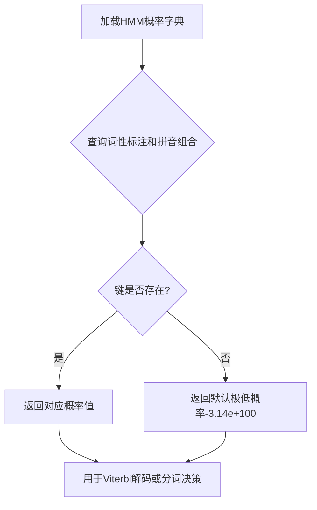

# `jieba\jieba\posseg\prob_start.py` 详细设计文档

这是一个隐马尔可夫模型（HMM）的发射概率字典，存储了中文分词任务中不同词性标注（B-词语开始、E-词语结束、M-词语中间、S-单字词）与拼音首字母组合的发射概率值，其中-3.14e+100表示极低概率或不可能的转换。

## 整体流程



## 类结构

```
数据字典结构（非面向对象）
P: 全局概率字典
├── 键: (词性标注, 拼音特征) 元组
└── 值: float 概率值
```

## 全局变量及字段


### `P`
    
存储HMM发射概率的字典，键为(词性, 拼音特征)元组，值为浮点数概率

类型：`dict[tuple[str, str], float]`
    


    

## 全局函数及方法


## 关键组件


### P

全局概率矩阵变量，存储状态与观测序列的发射对数概率，使用嵌套字典实现稀疏存储，用于HMM分词或序列标注任务。

### 状态集合

包含四个状态标签：'B'（词首）、'E'（词尾）、'M'（词中）、'S'（单字词），代表中文分词中的BEMS模型状态。

### 观测集合

所有出现的第二元组元素（如'a'、'ad'、'ag'等），可能代表汉字的拼音首字母、部首或特征编码，用于与状态结合计算发射概率。

### 特殊概率值

-3.14e+100作为对数概率的极小值，表示不可能事件或转移，用于过滤不可能的状态-观测组合，减少计算量。

### 数据结构设计

采用元组键的嵌套字典结构，支持O(1)时间复杂度的概率查询，适用于高效推理和动态规划算法。

### 潜在优化空间

当前使用浮点数存储对数概率，可考虑量化压缩（如int8）以降低内存占用，同时可引入惰性加载机制仅加载必要的概率条目。


## 问题及建议


### 已知问题

- **硬编码的魔数（Magic Number）**：代码中大量使用`-3.14e+100`作为数值，这是一个用于表示负无穷或极低概率的魔数，没有任何解释，且分散在代码中，难以维护和修改。
- **数据与代码耦合**：所有的概率数据直接硬编码在Python字典中，没有与代码逻辑分离，这会导致数据更新困难，也不利于版本控制。
- **缺乏类型注解**：没有使用Python的类型提示（Type Hints），降低了代码的可读性和IDE的支持度。
- **命名不清晰**：变量名`P`过于简短且不具描述性，无法从名称推断出其实际用途（很可能是概率或发射矩阵）。
- **缺少文档注释**：没有任何文档字符串或注释来说明该数据结构的用途、来源或使用场景。
- **数据冗余**：大量的`('E', *)`、`('M', *)`组合的值都是`-3.14e+100`，这种稀疏矩阵可以用更高效的方式存储。
- **无错误处理机制**：直接定义静态字典，没有任何边界检查或异常处理逻辑。
- **可扩展性差**：如果要添加新的状态或修改概率值，需要直接修改字典内容，缺乏灵活的配置机制。

### 优化建议

- **提取魔数为常量**：定义一个常量如`NEG_INF = float('-inf')`或`MIN_LOG_PROB = -3.14e+100`来替代所有硬编码值，并添加注释说明其含义。
- **数据结构重构**：将数据存储在外部文件（如JSON、YAML或数据库）中，通过加载机制读取，提高可维护性和可扩展性。
- **添加类型注解**：使用`Dict[Tuple[str, str], float]`来明确类型，或考虑使用`dataclass`或`TypedDict`来封装数据结构。
- **改进命名**：将`P`重命名为如`emission_probs`或`state_char_emission_matrix`等更具描述性的名称。
- **添加文档注释**：为数据字典添加docstring，说明这是用于序列标注（如HMM/CRF）的发射概率矩阵，以及状态标签的含义（B=Begin, E=End, M=Middle, S=Single）。
- **稀疏矩阵优化**：考虑使用`scipy.sparse`或自定义稀疏矩阵结构来存储非`-3.14e+100`的值，减少内存占用。
- **数据验证**：添加数据加载后的验证逻辑，确保必需的状态和字符组合都存在。
- **模块化设计**：将数据定义在单独的配置模块中，与业务逻辑分离，便于独立更新和测试。


## 其它


### 设计目标与约束

该字典存储了基于隐马尔可夫模型（HMM）的序列标注任务（例如中文分词）的发射对数概率 P(tag, character)。标签包括 'B'（词首）、'E'（词尾）、'M'（词中）、'S'（单字词）。设计约束包括：所有值必须为负对数概率，未知的 (tag, character) 键需要通过平滑或默认值处理。

### 错误处理与异常设计

在访问字典时，如果键 (tag, character) 不存在，应返回默认的低对数概率（例如 -3.14e+100），或在严格模式下抛出特定异常。代码应优雅地处理缺失键，以避免运行时崩溃。

### 数据流与状态机

输入：一系列字符（例如中文文本）。对于每个字符，系统查询该字典以获取每个标签的发射对数概率。状态为标签（B、E、M、S），状态之间的转换由另一个转换概率矩阵（此处未展示）控制。输出是通过解码（例如维特比算法）确定的标签序列。

### 外部依赖与接口契约

该字典通常从预训练模型文件（例如使用 pickle 或 json）加载。它依赖于 UTF-8 字符编码。接口提供函数 get_log_prob(tag, char)，对于未知键有回退机制。

### 性能考虑

该字典使用 Python 内置哈希表，提供平均 O(1) 的查找时间。内存占用适中（约 300 条记录）。对于大规模部署，如果内存是瓶颈，可以考虑使用更高效的存储（例如 numpy 数组）。

### 数据来源与生成

该字典使用最大似然估计（MLE）结合平滑（例如加一平滑）从大型中文语料库生成。值被转换为对数概率以防止乘法时下溢。值 -3.14e+100 看起来是不可能或极不可能事件的占位符（在对数空间中相当于 0）。

### 使用场景

用于中文分词系统，尤其是基于 HMM 的系统。也可用于词性标注或其他序列标注任务。

### 安全性与隐私

没有直接的安全风险，但如果数据来源于专有语料库，则可能是机密的，应谨慎处理。

    