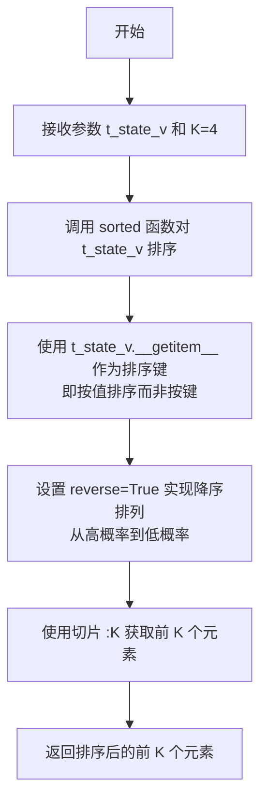
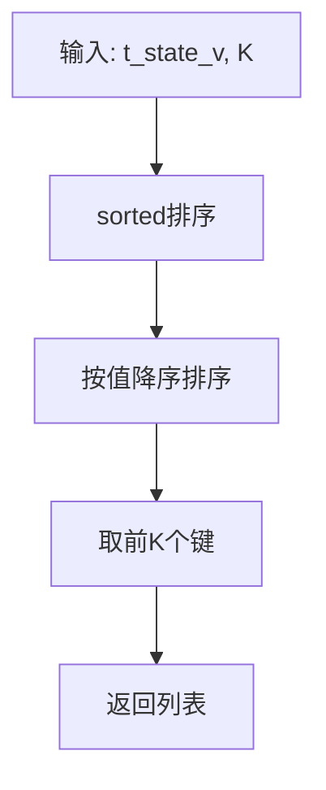

# `jieba\jieba\posseg\viterbi.py` 详细设计文档

该代码实现了维特比算法（Viterbi Algorithm），用于隐马尔可夫模型（HMM）的解码，通过动态规划寻找最可能的隐藏状态序列，给定观测序列、初始概率、转移概率和发射概率。

## 整体流程

```mermaid
graph TD
    A[开始] --> B[初始化V[0]和mem_path[0]]
    B --> C{遍历观测序列t从1到len-1}
    C --> D[计算前一状态集合prev_states]
    D --> E[计算期望的下一状态集合prev_states_expect_next]
    E --> F[获取当前观测对应的状态集合obs_states]
    F --> G{obs_states为空?}
    G -- 是 --> H[使用prev_states_expect_next或all_states]
    G -- 否 --> I[继续]
    H --> I
    I --> J[对每个y在obs_states中]
    J --> K[计算最大概率和前一状态]
    K --> L[更新V[t][y]和mem_path[t][y]]
    L --> C
    C -- 遍历完成 --> M[从最后一个状态回溯]
    M --> N[返回最优概率和路径]
```

## 类结构

```
该代码为过程式实现，无类层次结构
└── 模块级函数
    ├── get_top_states
    └── viterbi
```

## 全局变量及字段


### `MIN_FLOAT`
    
用于表示缺失发射概率的最小浮点数常量，值为 -3.14e100。

类型：`float`
    


### `MIN_INF`
    
用于表示不可能的转移概率的负无穷大常量，确保路径概率在不存在转移时保持最低。

类型：`float`
    


### `xrange`
    
在 Python 3 中指向内置 range 函数的别名，用于生成整数序列；在 Python 2 中为内置 xrange。

类型：`function`
    


    

## 全局函数及方法


### `get_top_states`

该函数是一个用于从隐藏状态概率集合中提取概率值最高的前 K 个状态的工具函数，常作为 Viterbi 算法的辅助函数，用于在动态规划过程中筛选最具潜力的前驱状态。

参数：

- `t_state_v`：`dict` 或类似可索引对象，包含状态及其对应概率值的映射，用于排序的输入数据
- `K`：`int`（默认值 4），指定返回概率最高的前 K 个状态

返回值：`list`，返回降序排列后概率最高的 K 个元素组成的列表

#### 流程图



#### 带注释源码

```python
def get_top_states(t_state_v, K=4):
    """
    获取概率值最高的前 K 个状态
    
    参数:
        t_state_v: dict 或类似可索引对象，键为状态标识，值为对应的概率分数
        K: int，返回的概率最高的状态数量，默认为 4
    
    返回:
        list: 按概率值降序排列的前 K 个元素
    """
    # 使用 sorted 函数对输入的 t_state_v 进行排序
    # key=t_state_v.__getitem__ 表示按照元素的值（而非键）进行排序
    # reverse=True 设置为降序排列，即从最大值到最小值
    # [:K] 切片操作取排序结果的前 K 个元素
    return sorted(t_state_v, key=t_state_v.__getitem__, reverse=True)[:K]
```


### `viterbi`

该函数实现了Viterbi算法，用于隐马尔可夫模型（HMM）的解码过程，给定观测序列、状态集合、初始概率、转移概率和发射概率，计算最可能的状态序列及对应的概率。

参数：
- `obs`：`list` 或 `tuple`，观测序列，表示实际的观测值列表。
- `states`：`dict`，状态集合，键为观测值（可选），值为该观测值对应的可能状态集合；若为空则使用所有状态。
- `start_p`：`dict`，初始状态概率，键为状态名，值为初始概率的对数。
- `trans_p`：`dict`，状态转移概率，键为当前状态，值为字典（目标状态及其转移概率的对数）。
- `emit_p`：`dict`，发射概率，键为状态名，值为字典（观测值及其发射概率的对数）。

返回值：`tuple`，包含两个元素：
- `prob`：`float`，最优路径的概率（对数概率）。
- `route`：`list`，最优状态序列，与观测序列等长。

#### 流程图

```mermaid
graph TD
    A[开始] --> B[初始化 V 和 mem_path 列表]
    B --> C[对第一个观测初始化]
    C --> D{迭代 t 从 1 到 len(obs)-1}
    D --> E[获取前一状态集和候选观测状态集]
    E --> F{观测状态集是否为空}
    F -- 是 --> G[使用前一状态或所有状态]
    F -- 否 --> H[继续]
    G --> H
    H --> I[对于每个候选状态 y]
    I --> J[计算前一状态的最大概率和状态]
    J --> K[更新 V[t][y] 和 mem_path[t][y]]
    I --> L[循环结束]
    D --> M[找到最后一个观测的最优状态]
    M --> N[回溯路由]
    N --> O[返回概率和路由]
```

#### 带注释源码

```python
def viterbi(obs, states, start_p, trans_p, emit_p):
    """
    Viterbi算法实现，用于HMM的解码。
    
    参数:
        obs: 观测序列
        states: 状态集合
        start_p: 初始概率
        trans_p: 转移概率
        emit_p: 发射概率
    返回:
        (prob, route): 最优概率和状态序列
    """
    V = [{}]  # 概率表，存储每个时刻每个状态的最高概率
    mem_path = [{}]  # 记忆路径，存储每个时刻每个状态的前驱状态
    all_states = trans_p.keys()  # 所有状态
    
    # 初始化：对于第一个观测，计算每个可能状态的初始概率
    for y in states.get(obs[0], all_states):
        V[0][y] = start_p[y] + emit_p[y].get(obs[0], MIN_FLOAT)
        mem_path[0][y] = ''  # 初始状态无前驱
    
    # 迭代处理每个后续观测
    for t in xrange(1, len(obs)):
        V.append({})
        mem_path.append({})
        
        # 获取前一时刻有转移概率的状态
        prev_states = [
            x for x in mem_path[t - 1].keys() if len(trans_p[x]) > 0]
        
        # 预测当前时刻可能的状态集：从前一状态可达的状态与观测对应的状态取交集
        prev_states_expect_next = set(
            (y for x in prev_states for y in trans_p[x].keys()))
        obs_states = set(
            states.get(obs[t], all_states)) & prev_states_expect_next
        
        # 如果没有交集，则回退到前一状态可达集或所有状态
        if not obs_states:
            obs_states = prev_states_expect_next if prev_states_expect_next else all_states
        
        # 对于每个当前可能的状态，计算来自前一状态的最大概率
        for y in obs_states:
            prob, state = max((V[t - 1][y0] + trans_p[y0].get(y, MIN_INF) +
                               emit_p[y].get(obs[t], MIN_FLOAT), y0) for y0 in prev_states)
            V[t][y] = prob  # 存储最大概率
            mem_path[t][y] = state  # 存储前驱状态
    
    # 从最后一个时刻选择最优状态
    last = [(V[-1][y], y) for y in mem_path[-1].keys()]
    prob, state = max(last)
    
    # 回溯得到完整的状态序列
    route = [None] * len(obs)
    i = len(obs) - 1
    while i >= 0:
        route[i] = state
        state = mem_path[i][state]
        i -= 1
    
    return (prob, route)
```

## 关键组件


### Viterbi算法核心实现

该模块实现了经典的Viterbi算法，用于在隐马尔可模型(HMM)中，给定观察序列，找出最可能的隐藏状态序列。算法通过动态规划计算最大概率路径，并回溯得到最优状态序列。

### 状态路径回溯机制

在Viterbi算法完成前向概率计算后，通过从最后一个时间步开始，沿着mem_path字典中存储的前驱状态指针，逐步向前回溯，构建完整的最优状态路径。

### 动态规划概率计算

使用字典V[t][y]存储在时间t到达状态y的最大对数概率，通过遍历所有可能的前驱状态y0，计算转移概率和发射概率之和，选择概率最大的前驱状态。

### 状态剪枝与优化

通过get_top_states函数和列表推导式筛选出有效的prev_states，以及计算prev_states_expect_next集合，实现对搜索空间的剪枝，减少不必要的计算。

### 观测序列处理

处理观测序列时，首先获取当前观测对应的可能状态集合obs_states，如果为空则回退到前驱状态期望的下一状态集合或全部状态，确保算法的鲁棒性。

### 初始化与边界处理

对第一个观测值进行特殊处理，初始化V[0]和mem_path[0]，使用MIN_FLOAT处理发射概率缺失的情况，确保算法在数据不完整时也能运行。

### 概率表示与数值稳定性

使用对数概率（log probabilities）避免概率连乘导致的数值下溢出，通过MIN_FLOAT和MIN_INF常量处理不可能的情况。


## 问题及建议


### 已知问题

-   **错误处理缺失**：代码未对输入参数（如`states`、`start_p`、`trans_p`、`emit_p`）进行有效性验证，若输入数据格式不符预期（如缺少必要的键），程序可能抛出`KeyError`异常。
-   **内存占用较高**：动态规划表`V`和`mem_path`存储完整路径概率，对于长观测序列可能导致较高的内存消耗。
-   **性能瓶颈**：在计算每个时刻的状态转移时，使用了生成器表达式遍历所有前驱状态，当状态空间较大时复杂度较高；且`sorted`与`max`操作可能存在冗余计算。
-   **兼容性与冗余代码**：`sys.version_info`检查和`xrange`定义仅用于兼容Python 2，但Python 2已停止维护，代码可考虑移除此类兼容性代码。
-   **魔法数值与硬编码**：MIN_FLOAT和MIN_INF的使用缺乏注释说明，且某些阈值（如K=4）可能需参数化以提高灵活性。
-   **边界条件处理**：当`obs`为空或仅有一个观测时，代码逻辑可能产生非预期结果（如空列表索引）。
-   **数据类型假设**：代码隐含假设概率值为对数概率（因使用加法而非乘法），但未在文档中明确说明。

### 优化建议

-   **添加输入验证**：在函数入口处检查参数类型和必要键的存在性，必要时抛出自定义异常或返回默认值。
-   **性能优化**：
    -   使用`heapq.nlargest`替代完全排序以获取top-K状态，减少时间复杂度。
    -   考虑使用`numba`加速或利用稀疏矩阵优化转移概率存储。
    -   预计算`trans_p`和`emit_p`的键集合，避免重复调用`.keys()`。
-   **代码现代化**：
    -   移除Python 2兼容性代码（如`xrange`），仅保留Python 3实现。
    -   使用类型提示（Type Hints）明确函数签名。
-   **内存优化**：
    -   仅保留必要的历史路径信息（如使用`dict`而非完整矩阵），或提供内存受限模式。
    -   对于超长序列，可考虑分块处理或近似算法。
-   **增强可读性与维护性**：
    -   为关键变量和函数添加文档字符串（Docstring）。
    -   将魔法数值提取为常量或配置参数。
    -   重命名缩写变量（如`t_state_v`、`y0`）为更具描述性的名称。
-   **边界条件处理**：明确处理空观测序列或单观测序列的场景，补充单元测试覆盖边界情况。


## 其它


### 一段话描述核心功能
该代码实现了Viterbi算法，用于隐马尔可夫模型（HMM）的解码。根据给定的观测序列、状态集合、初始概率、转移概率和发射概率，计算最可能的状态序列及其概率，返回（最大概率，状态序列）元组。

### 文件的整体运行流程
文件作为一个模块导入使用。运行时，首先导入sys和operator模块，定义全局常量和辅助函数，然后提供viterbi函数供外部调用。整体流程：导入依赖 → 定义全局变量和辅助函数 → 实现Viterbi算法函数 → 主程序调用viterbi函数并返回结果。

### 全局变量详细信息
- **MIN_FLOAT**: 类型float，描述负无穷大表示，用于初始化概率时避免log(0)导致的数值下溢。
- **MIN_INF**: 类型float，描述负无穷大，用于转移概率缺失时的默认值。
- **xrange**: 类型function，描述在Python2中是xrange，在Python3中是range，用于兼容不同Python版本。

### 全局函数详细信息

#### get_top_states 函数
- **名称**: get_top_states
- **参数**:
  - t_state_v: dict，字典类型，表示状态到概率的映射。
  - K: int，可选参数，默认值为4，表示返回前K个最高概率的状态。
- **返回值**: list，按概率降序排列的前K个状态键列表。
- **流程图**: 

- **带注释源码**:
```python
def get_top_states(t_state_v, K=4):
    """
    返回概率最高的前K个状态。
    """
    return sorted(t_state_v, key=t_state_v.__getitem__, reverse=True)[:K]
```

#### viterbi 函数
- **名称**: viterbi
- **参数**:
  - obs: list，观测序列列表，例如[' sunny ', ' rainy '] 等。
  - states: dict，状态到可能观测的映射，用于过滤合法状态。
  - start_p: dict，初始概率字典，状态到对数初始概率的映射。
  - trans_p: dict，转移概率字典，状态到下一状态概率的映射。
  - emit_p: dict，发射概率字典，状态到观测概率的映射。
- **返回值**: tuple，第一个元素为最大概率（float），第二个元素为最优状态序列列表。
- **流程图**:
```mermaid
graph TD
    A[输入: obs, states, start_p, trans_p, emit_p] --> B[初始化V[0]和mem_path[0]]
    B --> C{遍历观测序列 t=1 到 len(obs)-1}
    C --> D[计算前一状态集合和当前合法状态]
    D --> E{对每个当前状态y}
    E --> F[计算最大概率和前一状态]
    F --> G[V[t][y] = prob, mem_path[t][y] = state]
    G --> H{遍历完成?}
    H -->|否| E
    H -->|是| I[计算最后一个状态的最大概率]
    I --> J[回溯路径]
    J --> K[返回概率和路径]
```
- **带注释源码**:
```python
def viterbi(obs, states, start_p, trans_p, emit_p):
    """
    Viterbi算法实现，用于HMM解码。
    """
    V = [{}]  # 动态规划表，存储每个时间步每个状态的概率
    mem_path = [{}]  # 存储回溯路径
    all_states = trans_p.keys()
    
    # 初始化：处理第一个观测
    for y in states.get(obs[0], all_states):  # 获取第一个观测对应的状态集合
        V[0][y] = start_p[y] + emit_p[y].get(obs[0], MIN_FLOAT)
        mem_path[0][y] = ''
    
    # 递归：处理后续观测
    for t in xrange(1, len(obs)):
        V.append({})
        mem_path.append({})
        # 获取前一状态中有效的状态（至少有出边）
        prev_states = [
            x for x in mem_path[t - 1].keys() if len(trans_p[x]) > 0]
        
        # 获取前一状态可能到达的当前状态集合
        prev_states_expect_next = set(
            (y for x in prev_states for y in trans_p[x].keys()))
        # 获取当前观测对应的状态与前一状态可达状态的交集
        obs_states = set(
            states.get(obs[t], all_states)) & prev_states_expect_next
        
        # 如果没有交集，则使用前一状态可达状态或所有状态
        if not obs_states:
            obs_states = prev_states_expect_next if prev_states_expect_next else all_states
        
        # 对每个当前状态，计算最大概率和对应的前一状态
        for y in obs_states:
            prob, state = max((V[t - 1][y0] + trans_p[y0].get(y, MIN_INF) +
                               emit_p[y].get(obs[t], MIN_FLOAT), y0) for y0 in prev_states)
            V[t][y] = prob
            mem_path[t][y] = state
    
    # 回溯：找到最后一个时间步的最大概率状态
    last = [(V[-1][y], y) for y in mem_path[-1].keys()]
    prob, state = max(last)
    
    # 反推路径
    route = [None] * len(obs)
    i = len(obs) - 1
    while i >= 0:
        route[i] = state
        state = mem_path[i][state]
        i -= 1
    return (prob, route)
```

### 关键组件信息
- **动态规划表V**: 二维字典结构，存储每个时间步每个状态的累计概率的对数。
- **回溯路径mem_path**: 二维字典结构，存储每个时间步每个状态的最优前驱状态，用于路径回溯。
- **状态过滤逻辑**: 通过states映射和转移概率矩阵，限制合法状态集合，提高计算效率。

### 潜在的技术债务或优化空间
- **缺乏错误处理**: 代码未对输入进行验证，例如空观测序列、缺失状态键等，可能导致运行时错误。
- **无文档字符串**: get_top_states和viterbi函数缺少文档字符串，影响代码可读性和维护性。
- **Python版本兼容**: 虽然通过xrange处理了Python2/3兼容，但代码未使用类型注解，Python 3.5+可添加类型提示。
- **性能优化**: 当前实现使用纯Python字典和列表，对于大规模数据可考虑使用NumPy数组或Cython优化。
- **代码重构**: 可将Viterbi算法封装为类，提供更清晰的接口和状态管理。

### 设计目标与约束
- **设计目标**: 实现标准的Viterbi算法，用于解决HMM中的解码问题，找出最可能的状态序列。
- **约束**: 输入的概率（start_p, trans_p, emit_p）应为对数概率，以避免概率乘积导致的下溢问题；states参数为字典，表示状态到观测的映射，用于过滤合法状态。

### 错误处理与异常设计
- **当前状态**: 代码未包含显式的错误处理逻辑。
- **建议改进**:
  - 验证obs列表非空，否则抛出ValueError。
  - 验证states、start_p、trans_p、emit_p为字典类型。
  - 验证所有状态在trans_p和emit_p中存在，避免KeyError。
  - 对于空状态集合或无路径情况，返回合理默认值或抛出异常。

### 数据流与状态机
- **数据流**:
  1. 输入：观测序列obs，状态映射states，初始概率start_p，转移概率trans_p，发射概率emit_p。
  2. 初始化：创建动态规划表V和mem_path，填入第一个观测的概率。
  3. 递推：遍历每个观测时间步，计算当前状态的累计概率，选择前一状态的最优路径。
  4. 终止：找到最后一个时间步的最大概率状态。
  5. 回溯：从最后一个时间步向前回溯，得到最优状态序列。
  6. 输出：最大概率和最优状态序列。
- **状态机**: Viterbi算法本身是动态规划算法，但可以看作隐马尔可夫模型的状态转移机，其中状态转移由trans_p控制，发射概率由emit_p控制。

### 外部依赖与接口契约
- **外部依赖**: 仅依赖Python标准库sys和operator，无第三方依赖。
- **接口契约**:
  - 函数签名: `viterbi(obs, states, start_p, trans_p, emit_p)`
  - 输入参数:
    - obs: list，观测序列，例如['observation1', 'observation2']。
    - states: dict，状态到观测的映射，例如{'Sunny': ['sun', 'rain'], 'Rainy': ['rain']}，如果为None则表示所有状态。
    - start_p: dict，初始概率，状态到对数概率的映射。
    - trans_p: dict，转移概率，状态到字典的映射，键为下一状态，值为对数概率。
    - emit_p: dict，发射概率，状态到观测概率的映射。
  - 返回值: tuple，元素为(最大概率float, 状态序列list)。

### 性能考虑
- **时间复杂度**: O(T * N^2)，其中T为观测序列长度，N为状态数量，遍历所有状态对。
- **空间复杂度**: O(T * N)，用于存储动态规划表V和mem_path。
- **优化建议**: 对于大规模状态，可使用堆结构优化top-K状态计算；或使用NumPy向量化操作提升性能。

### 安全性考虑
- 代码不涉及用户输入或敏感数据，无安全风险。
- 但需注意输入数据的合法性，避免因畸形数据导致程序崩溃。

### 测试考虑
- **单元测试**: 测试get_top_states函数的各种输入，如空字典、K大于字典长度等。
- **集成测试**: 测试viterbi函数，使用标准HMM示例验证输出正确性。
- **边界测试**:
  - 观测序列长度为1。
  - 状态集合为空。
  - 转移概率全为0。
  - 观测在发射概率中不存在。

### 部署考虑
- 作为Python模块部署，无需特殊配置。
- 支持Python 2.7和Python 3.x版本。

### 维护考虑
- 代码结构简单，但缺乏注释和文档，建议添加详细的docstring。
- 建议使用版本控制管理代码变更。

### 参考文献或备注
- Viterbi算法原始论文: Viterbi, A. J. (1967). "Error bounds for convolutional codes and an asymptotically optimum decoding algorithm". IEEE Transactions on Information Theory.
- 相关算法参考: Rabiner, L. R. (1989). "A tutorial on hidden Markov models and selected applications in speech recognition". Proceedings of the IEEE.

    