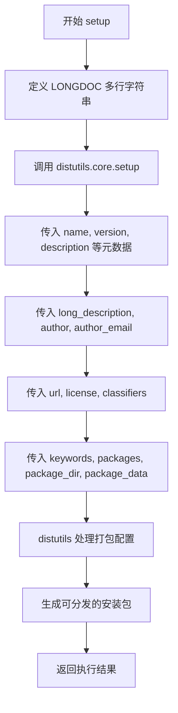

# `jieba\setup.py` 详细设计文档

这是 jieba 中文分词库的安装配置文件，定义了包的元数据、版本信息、依赖关系和打包配置，用于将 jieba 库发布到 PyPI 或通过 pip 安装。

## 整体流程

```mermaid
graph TD
A[开始] --> B[定义 LONGDOC 文档字符串]
B --> C[调用 setup() 函数]
C --> D{配置包信息}
D --> E[设置 name=jieba]
E --> F[设置 version=0.42.1]
F --> G[设置 description 和 long_description]
G --> H[设置 author 和 url]
I[设置 license=MIT]
I --> J[定义 classifiers 分类器]
J --> K[设置 keywords]
K --> L[指定 packages=['jieba']]
L --> M[指定 package_dir 和 package_data]
M --> N[结束: 包配置完成]
```

## 类结构

```
setup.py (安装配置脚本)
└── LONGDOC (全局变量 - 文档字符串)
    └── setup() (全局函数 - 安装配置)
```

## 全局变量及字段


### `LONGDOC`
    
包含jieba中文分词库的详细文档描述，包括项目介绍、功能特点、安装说明等信息的多行字符串

类型：`str`
    


    

## 全局函数及方法


### `setup`

这是 `distutils.core` 模块提供的标准打包函数，用于配置 jieba 中文分词库的元数据和打包参数，使其可以通过 pip 或 easy_install 进行安装。

参数：

- `name`：`str`，包的名称，此处为 'jieba'
- `version`：`str`，包的版本号，此处为 '0.42.1'
- `description`：`str`，包的简短描述，此处为 'Chinese Words Segmentation Utilities'
- `long_description`：`str`，包的详细描述，包含中文和英文的完整说明文档
- `author`：`str`，作者姓名，此处为 'Sun, Junyi'
- `author_email`：`str`，作者邮箱，此处为 'ccnusjy@gmail.com'
- `url`：`str`，项目主页 URL，此处为 'https://github.com/fxsjy/jieba'
- `license`：`str`，许可证类型，此处为 'MIT'
- `classifiers`：`list`，分类器列表，包含受众、许可证、操作系统、语言支持等元信息
- `keywords`：`str`，关键词列表，用于 PyPI 搜索，此处为 'NLP,tokenizing,Chinese word segementation'
- `packages`：`list`，需要包含的 Python 包列表，此处为 ['jieba']
- `package_dir`：`dict`，包目录映射，将 'jieba' 映射到 'jieba' 目录
- `package_data`：`dict`，包数据文件映射，指定需要包含的静态资源文件

返回值：`int`，返回 distutils 的执行结果，0 表示成功

#### 流程图



#### 带注释源码

```python
# -*- coding: utf-8 -*-

# 导入 distutils 的 setup 函数，用于打包 Python 项目
from distutils.core import setup

# 定义长描述字符串 LONGDOC，包含 jieba 中文分词库的完整说明文档
LONGDOC = """
jieba
=====

"结巴"中文分词：做最好的 Python 中文分词组件

"Jieba" (Chinese for "to stutter") Chinese text segmentation: built to
be the best Python Chinese word segmentation module.

完整文档见 ``README.md``

GitHub: https://github.com/fxsjy/jieba

特点
====

-  支持三种分词模式：

   -  精确模式，试图将句子最精确地切开，适合文本分析；
   -  全模式，把句子中所有的可以成词的词语都扫描出来,
      速度非常快，但是不能解决歧义；
   -  搜索引擎模式，在精确模式的基础上，对长词再次切分，提高召回率，适合用于搜索引擎分词。

-  支持繁体分词
-  支持自定义词典
-  MIT 授权协议

在线演示： http://jiebademo.ap01.aws.af.cm/

安装说明
========

代码对 Python 2/3 均兼容

-  全自动安装： ``easy_install jieba`` 或者 ``pip install jieba`` / ``pip3 install jieba``
-  半自动安装：先下载 https://pypi.python.org/pypi/jieba/ ，解压后运行
   python setup.py install
-  手动安装：将 jieba 目录放置于当前目录或者 site-packages 目录
-  通过 ``import jieba`` 来引用

"""

# 调用 setup 函数配置 jieba 库的打包元数据
setup(
    # 基本信息
    name='jieba',                                    # 包名
    version='0.42.1',                               # 版本号
    description='Chinese Words Segmentation Utilities',  # 简短描述
    long_description=LONGDOC,                       # 详细描述（多行字符串）

    # 作者信息
    author='Sun, Junyi',                            # 作者姓名
    author_email='ccnusjy@gmail.com',               # 作者邮箱

    # 项目信息
    url='https://github.com/fxsjy/jieba',           # 项目主页
    license="MIT",                                  # 许可证

    # PyPI 分类器，用于描述包的元信息
    classifiers=[
        'Intended Audience :: Developers',          # 目标受众
        'License :: OSI Approved :: MIT License',   # 许可证类型
        'Operating System :: OS Independent',        # 操作系统兼容性
        'Natural Language :: Chinese (Simplified)', # 支持简体中文
        'Natural Language :: Chinese (Traditional)', # 支持繁体中文
        'Programming Language :: Python',            # 支持 Python
        'Programming Language :: Python :: 2',       # 支持 Python 2
        'Programming Language Python :: 2.6',        # 支持 Python 2.6
        'Programming Language :: Python :: 2.7',     # 支持 Python 2.7
        'Programming Language :: Python :: 3',       # 支持 Python 3
        'Programming Language :: Python :: 3.2',     # 支持 Python 3.2
        'Programming Language :: Python :: 3.3',     # 支持 Python 3.3
        'Programming Language :: Python :: 3.4',     # 支持 Python 3.4
        'Topic :: Text Processing',                  # 文本处理领域
        'Topic :: Text Processing :: Indexing',      # 索引
        'Topic :: Text Processing :: Linguistic',    # 语言学
    ],

    # 关键词，用于 PyPI 搜索
    keywords='NLP,tokenizing,Chinese word segementation',

    # 包相关配置
    packages=['jieba'],                              # 需要打包的包列表
    package_dir={'jieba': 'jieba'},                  # 包目录映射

    # 包数据文件，包含需要打包的非 Python 资源
    package_data={
        'jieba': [
            '*.*',                        # 所有文件
            'finalseg/*',                 # finalseg 子目录所有文件
            'analyse/*',                  # analyse 子目录所有文件
            'posseg/*',                   # posseg 子目录所有文件
            'lac_small/*.py',             # lac_small 目录的 Python 文件
            'lac_small/*.dic',            # lac_small 目录的字典文件
            'lac_small/model_baseline/*'  # 模型文件
        ]
    }
)
```

## 关键组件


### LONGDOC 变量

包含jieba中文分词库的完整长描述文档，说明了三种分词模式（精确模式、全模式、搜索引擎模式）、支持繁体分词、自定义词典等特点，以及安装说明和在线演示地址。

### setup() 函数

Python打包配置函数，接收多个关键字参数完成包的元数据定义，包括包名称、版本号、描述、作者信息、许可证、分类标签、关键词等，并通过packages和package_data指定需要包含的Python包及其资源文件。

### packages 配置

定义需要打包的Python包列表，包含jieba主包及其子模块：finalseg（分词算法实现）、analyse（文本分析）、posseg（词性标注）、lac_small（小型语言学分析组件）。

### package_data 配置

指定每个包需要包含的非Python资源文件，使用通配符模式匹配，其中lac_small目录包含Python源文件、字典文件(.dic)和模型基线文件(model_baseline/*)。

### classifiers 分类信息

元组形式定义的PyPI分类标签，涵盖目标受众、许可证、操作系统支持、编程语言版本（Python 2.6/2.7/3.2/3.3/3.4）、自然语言支持（简体中文和繁体中文）以及文本处理相关主题。

### keywords 关键词

定义用于PyPI搜索的关键词，包括NLP、tokenizing、Chinese word segmentation，用于描述该库的核心功能领域。


## 问题及建议


### 已知问题

-   **使用已废弃的 distutils**：代码使用 `from distutils.core import setup`，而 `distutils` 在 Python 3.10+ 已被废弃，并在 Python 3.12 中移除，应改用 `setuptools`。
-   **package_data 使用不规范的通配符**：`'*.*'` 和 `'lac_small/*'` 这样的通配符可能无法被所有构建后端正确处理，应使用更明确的文件模式。
-   **关键词拼写错误**：`keywords` 中包含 "Chinese word segementation"，其中 "segementation" 应改为 "segmentation"。
-   **缺少 python_requires 约束**：未指定最低 Python 版本要求，且 classifiers 中声明支持 Python 2.6、3.2、3.3 等已停止维护的版本，存在不一致性。
-   **未声明运行时依赖**：缺少 `install_requires` 参数来声明 jieba 的运行时依赖库。
-   **package_dir 配置冗余**：`package_dir={'jieba':'jieba'}` 在包名与目录名相同的情况下是多余的。

### 优化建议

-   将 `distutils` 替换为 `setuptools`，使用 `from setuptools import setup`。
-   修正 `keywords` 中的拼写错误。
-   添加 `python_requires='>=3.6'` 参数明确最低 Python 版本要求。
-   移除已过时且不安全的 Python 版本支持（如 2.6、3.2、3.3），仅保留主流版本。
-   使用更规范的 `package_data` 语法，例如 `package_data={'jieba':['*.txt','finalseg/*.*','analyse/*.*','posseg/*.*','lac_small/*.py','lac_small/*.dic','lac_small/model_baseline/*.*']}`。
-   考虑添加 `install_requires` 声明必要的运行时依赖（如有）。
-   考虑添加 `zip_safe=True` 参数以提升安装性能。

## 其它


### 设计目标与约束

设计目标是创建一个可跨平台安装的Python中文分词组件包，支持Python 2和Python 3系列版本，通过setuptools实现自动化打包和分发。约束条件包括：必须保持MIT许可证兼容性，需包含完整的中文和英文文档，支持繁体中文分词，自定义词典功能，以及三种分词模式（精确模式、全模式、搜索引擎模式）的实现。

### 错误处理与异常设计

由于此文件为setup.py配置脚本，主要涉及打包层面的错误处理。包括：包名合法性检查、版本号格式验证、依赖包可用性检查、文件路径存在性验证、package_data路径匹配检查。当检测到配置错误时，setuptools会抛出DistutilsError或SetupError。推荐在自定义安装脚本中添加try-except块捕获SetupError，提供友好的错误提示信息。

### 数据流与状态机

此文件为静态配置文件，不涉及运行时数据流。状态转换主要体现在打包过程的不同阶段：预处理阶段（验证元数据）→ 打包阶段（收集文件）→ 安装阶段（复制文件到目标目录）→ 完成阶段。package_data定义了打包时需要包含的静态资源文件，包括词库文件、模型文件等。

### 外部依赖与接口契约

主要外部依赖为Python标准库中的distutils.core.setup函数，以及setuptools工具链。接口契约方面：packages参数指定主包为jieba，package_dir定义包目录映射，package_data定义资源文件模式匹配规则。运行时依赖包括：Python解释器（2.6-3.4版本）、可选的Cython（用于性能优化编译）。对下游项目的接口为标准的Python包导入接口，通过import jieba即可使用。

### 性能考虑

setup.py本身不涉及运行时性能。对于jieba包的性能优化主要在主代码实现中，包括：基于前缀词典的动态规划算法、Trie树结构优化、并行计算支持、Cython加速选项（可选）。打包层面通过package_data包含预编译的词库和模型文件以提升加载速度。

### 安全性考虑

代码本身为开源项目，安全性风险较低。建议：仅从官方PyPI源或可信渠道安装，对package_data中的外部词库文件进行完整性校验，避免在setup.py中执行网络下载操作，确保作者邮箱和URL的真实性和安全性。

### 版本兼容性

明确支持Python 2.6、2.7、3.2、3.3、3.4版本。package_data中的文件通配符需要与实际文件系统匹配，不同Python版本对Unicode处理有差异（Python 2需注意编码声明，Python 3默认UTF-8）。建议在文档中明确标注最低Python版本要求。

### 测试策略

虽然此setup.py文件不包含测试代码，但建议项目包含：单元测试（使用unittest或pytest框架）、集成测试（测试实际分词效果）、性能基准测试（对比不同分词模式速度）、兼容性测试（覆盖各Python版本）。测试文件应放置在tests目录，使用tox进行多版本测试。

### 部署和发布

发布流程：1）更新版本号；2）生成源码包（python setup.py sdist）；3）生成wheel包（python setup.py bdist_wheel）；4）上传至PyPI（使用twine）。发布前需确保README.md、CHANGELOG.md等文档完整，license文件存在，所有依赖已正确声明。

### 许可证和法律

当前采用MIT许可证，属于宽松的开源许可证，允许商业使用、修改、分发和私有使用。需确保所有第三方依赖也具备兼容许可证。代码中包含的词库和模型文件需明确其许可来源，建议在README中注明。

### 配置文件

setup.py本身即为项目的主要配置文件。相关配置文件包括：setup.cfg（setuptools扩展配置）、MANIFEST.in（额外包含文件清单）、tox.ini（多环境测试配置）、.pypirc（PyPI认证配置）。建议将敏感信息（如API token）放置于环境变量或本地配置文件，避免硬编码。

### 国际化/本地化

项目支持中文（简体/繁体）和英文文档说明。LONGDOC中已包含中英文双语描述。分词功能本身支持中文简体、繁体处理，并支持自定义词典扩展多语言词汇。建议在文档中提供多语言安装使用指南。

### 监控和日志

setup.py执行过程中，setuptools会输出详细的安装进度信息。建议在自定义安装脚本中添加日志记录功能，使用Python的logging模块将安装过程记录至日志文件，便于问题排查。对于jieba库本身的运行时监控，可考虑添加性能日志记录分词耗时和内存使用情况。

### 扩展性设计

项目结构支持多级扩展：1）主包级别扩展（jieba.analyse提供TF-IDF关键词提取）；2）词性标注扩展（jieba.posseg）；3）用户自定义词典扩展；4）第三方分词算法插件接入。package_data中已预留analyse、posseg、lac_small等子模块目录结构。

### 代码风格和规范

当前setup.py代码简洁，符合PEP 8基本规范。建议项目整体遵循PEP 8风格指南，使用flake8进行代码检查，添加type hints（Python 3.5+）提升代码可读性，保持一致的命名约定（模块名小写、类名驼峰、常量全大写）。

### 文档和注释规范

当前setup.py顶部包含UTF-8编码声明，Longdoc字符串提供了详细的项目说明。建议项目使用Sphinx生成API文档，代码中添加docstring说明函数/类用途，README.md保持更新，CHANGELOG.md记录版本变更历史，CONTRIBUTING.md说明贡献指南。

### 依赖管理策略

当前依赖声明较为简单，仅依赖Python标准库。建议：1）在install_requires中明确声明运行时最小依赖；2）使用extras_require声明可选依赖（如Cython）；3）使用requirements.txt文件管理开发依赖；4）定期检查依赖安全漏洞（使用pip-audit或Safety）。

### 构建和CI/CD

建议配置持续集成：1）使用GitHub Actions或Travis CI；2）自动化测试覆盖多Python版本；3）自动化构建wheel包；4）自动化发布至PyPI。构建过程应包含：代码检查（linting）、单元测试、覆盖率报告、构建验证。

### 项目维护计划

建议维护内容包括：定期发布安全更新、跟进Python新版本兼容性、监控社区Issue和PR、及时更新依赖包版本、保持文档与代码同步更新、维护CHANGELOG和版本号语义化规范。

    