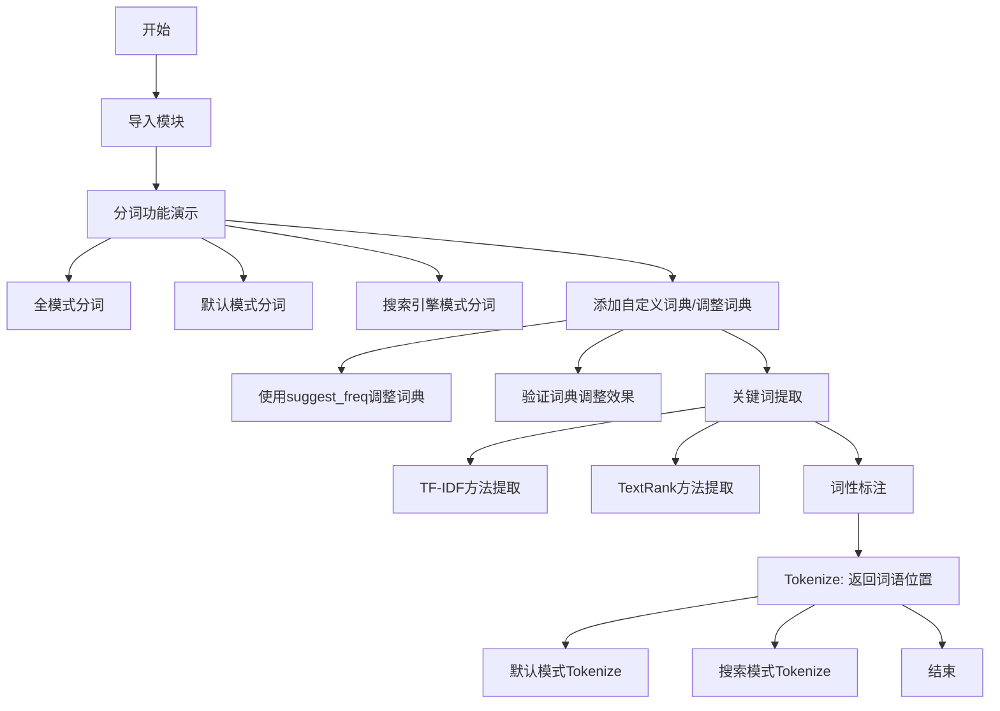
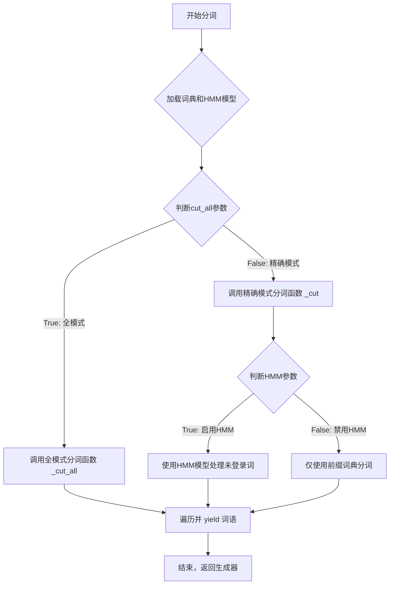
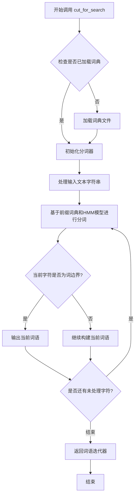
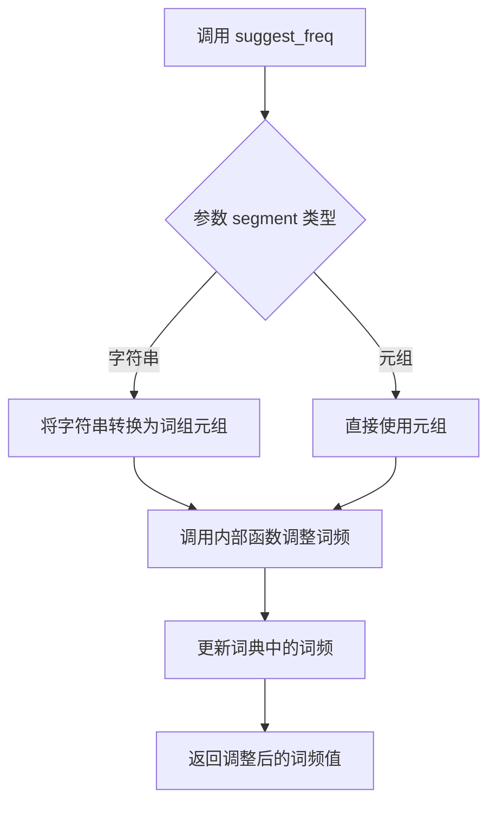
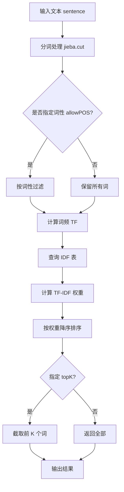
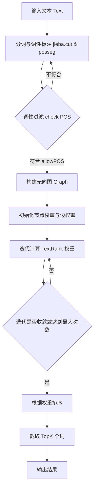
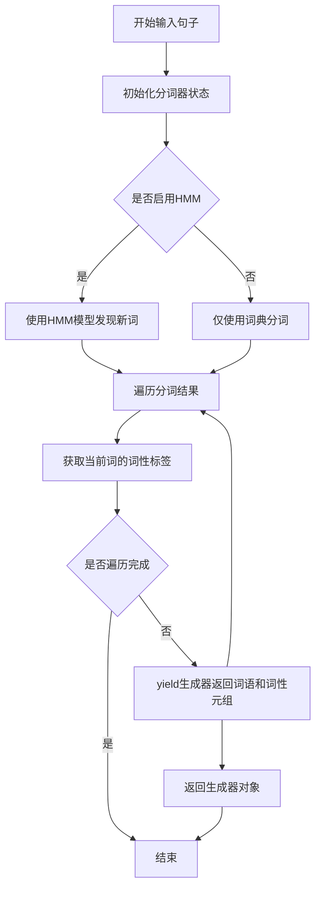
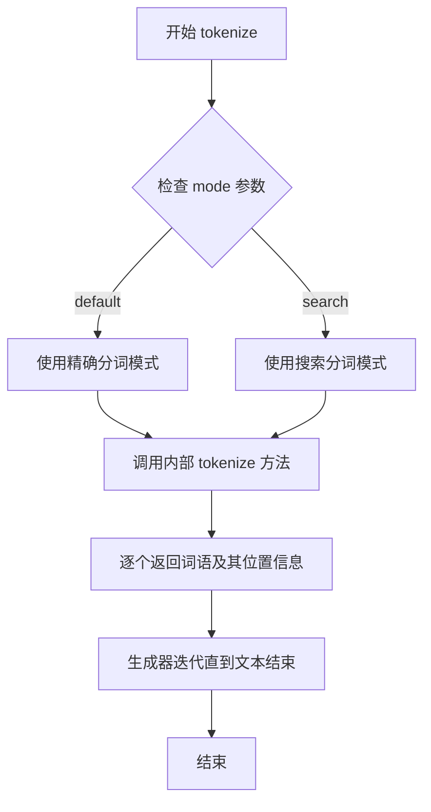
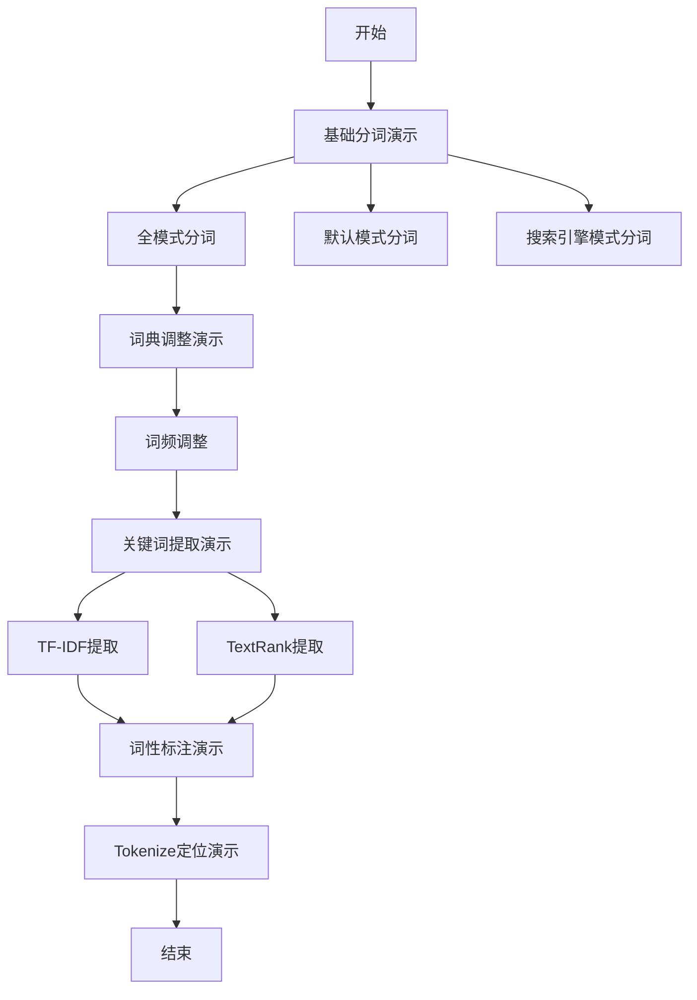

# `jieba\test\demo.py` 详细设计文档

这是一个使用jieba中文分词库的演示程序，展示了分词、添加自定义词典、关键词提取（TF-IDF和TextRank）、词性标注以及Tokenize等核心功能，用于中文文本处理和分析。

## 整体流程



## 类结构

```
该脚本为面向过程代码，无类层次结构
所有功能通过函数调用实现
```

## 全局变量及字段


### `seg_list`
    
分词结果列表，存储jieba.cut()返回的分词词语

类型：`list[str] or Generator`
    


### `s`
    
用于关键词提取的中文文本字符串，包含公司财务相关信息

类型：`str`
    


### `words`
    
词性标注结果迭代器，来自jieba.posseg.cut()的输出

类型：`Iterator[Word], (word, flag) pairs`
    


### `result`
    
Tokenize结果迭代器，包含词语及其在原文的起止位置

类型：`Iterator[Tuple[str, int, int]]`
    


### `tk`
    
Tokenize中的单个词语对象，包含词语、起始位置和结束位置

类型：`Tuple[str, int, int]`
    


### `x`
    
关键词提取或TextRank算法提取的关键词/词语

类型：`str`
    


### `w`
    
关键词权重或词语权重，用于衡量词语的重要程度

类型：`float`
    


### `word`
    
词性标注中的词语成分

类型：`str`
    


### `flag`
    
词性标注中的词性标记，如n(名词)、v(动词)等

类型：`str`
    


    

## 全局函数及方法


### `jieba.cut`

该函数是 jieba 分词库的核心分词方法，支持全模式（cut_all=True）和精确模式（cut_all=False）两种分词方式，并可选择性使用 HMM 模型处理未登录词，返回一个生成器，逐个产出分词后的词语。

参数：
- `sentence`：`str`，要进行分词的中文文本字符串。
- `cut_all`：`bool`，可选参数，默认为 `False`。当设置为 `True` 时，开启全模式，会穷尽文本中所有可能的词；当设置为 `False` 时，使用精确模式，分词结果更加合理准确。
- `HMM`：`bool`，可选参数，默认为 `True`。当设置为 `True` 时，使用隐马尔可夫模型（HMM）进行新词发现和标注；当设置为 `False` 时，禁用 HMM 模型。

返回值：`generator`，分词后的词语生成器，可通过遍历或转换为列表获取所有分词结果。

#### 流程图



#### 带注释源码

```python
# 以下源码基于 jieba 公开版本简化并注释
def cut(sentence, cut_all=False, HMM=True):
    """
    对输入的中文文本进行分词，支持全模式和精确模式。
    :param sentence: str，要分词的文本
    :param cut_all: bool，是否使用全模式（默认False）
    :param HMM: bool，是否启用HMM模型处理新词（默认True）
    :return: generator，分词后的词语生成器
    """
    # 确保词典和HMM模型已加载，若未加载则调用初始化函数
    if not jieba.dt.initialized:
        jieba.load_userdict("")  # 初始化默认词典，可传入自定义词典路径
    
    # 根据 cut_all 参数选择分词策略
    if cut_all:
        # 全模式：遍历文本，输出所有可能的词语组合（可能包含重复和冗余）
        for word in jieba._cut_all(sentence):
            yield word
    else:
        # 精确模式：结合前缀词典和HMM模型进行分词
        # 调用内部精确分词函数，传递 HMM 参数控制是否使用隐马尔可夫模型
        for word in jieba._cut(sentence, HMM=HMM):
            yield word
```

#### 关键组件信息

- **词典加载模块**：负责加载 jieba 的核心词典（如 `dict.txt`）和用户自定义词典，构建前缀树结构以支持高效分词。
- **HMM 模型**：用于发现文本中的新词（未登录词），基于汉字的成词特性进行概率推断。
- **分词策略选择器**：根据 `cut_all` 参数在全模式和精确模式之间切换。

#### 潜在技术债务或优化空间

- **性能优化**：当前全模式在长文本上可能产生大量候选词，导致效率下降，可考虑加入剪枝策略或缓存机制。
- **内存占用**：词典和 HMM 模型常驻内存，对于资源受限环境（如嵌入式设备）负担较重，可探索词典压缩或按需加载方案。
- **自定义词典动态更新**：目前修改词典后需手动调用 `load_userdict` 或 `suggest_freq`，缺乏热更新接口。

#### 其它项目

- **设计目标**：提供高效、准确的中文分词能力，支持多种分词模式以满足不同场景需求（如文本分析、搜索引擎索引等）。
- **约束**：依赖中文语言特性，假设输入为 UTF-8 编码的中文文本；HMM 模型默认启用以提升召回率，但会增加计算开销。
- **错误处理**：若输入为空字符串或非字符串类型，函数应返回空生成器或抛出 TypeError；建议外部调用时进行输入校验。
- **数据流**：输入字符串 → 词典/HMM模型处理 → 分词算法遍历 → 输出词语生成器；状态管理主要在生成器迭代过程中。
- **外部依赖**：依赖 jieba 内部的 `jieba.dt`（数据对象）和 `jieba._cut` 系列底层函数；无外部 HTTP 或数据库依赖。


### `jieba.cut_for_search()`

搜索引擎模式分词函数，用于对输入文本进行搜索引擎优化的分词处理。与精确模式不同，搜索引擎模式会生成更细粒度的分词结果，将长词进一步拆分，便于搜索引擎索引和匹配。

参数：

- `sentence`：`str`，需要分词的输入文本字符串

返回值：`iterator`，分词结果迭代器（生成器），yield 一个个的词语字符串

#### 流程图



#### 带注释源码

```python
# jieba/cut.py 中的核心实现逻辑

def cut_for_search(sentence, HMM=True):
    """
    搜索引擎模式分词
    该函数会生成更细粒度的分词结果
    
    参数:
        sentence: str, 输入的需要分词的文本
        HMM: bool, 是否使用HMM模型识别新词, 默认为True
    
    返回:
        generator, 生成器, yield 一个个的分词结果
    """
    # 获取默认的分词器实例（包含词典和HMM模型）
    global _jieba_instance
    if _jieba_instance is None:
        _jieba_instance = Jieba()
    
    # 调用分词实例的cut_for_search方法
    return _jieba_instance.cut_for_search(sentence, HMM=HMM)


# 实际的 Jieba 类中的 cut_for_search 方法实现
class Jieba:
    def cut_for_search(self, sentence, HMM=True):
        """
        搜索引擎模式的核心实现
        
        该方法主要步骤:
        1. 首先进行精确模式分词
        2. 然后对每个词语进一步细分(如果可能)
        3. 使用HMM模型识别未登录词
        """
        # 步骤1: 基于前缀词典进行初步分词
        # 前缀词典包含所有可能的词组和短语
        words = self.__cut(sentence, HMM=HMM)
        
        # 步骤2: 对长词进行进一步细分
        # 例如 "中国科学院" -> "中国" + "科学院" + "中科院"
        for word in words:
            # 如果词语长度大于2,尝试查找更长的复合词
            if len(word) > 2:
                # 查找该词语的所有可能组合
                # 例如 "清华大学" 可能包含 "清华" + "大学"
                l = len(word)
                for i in range(l):
                    for j in range(i + 2, min(l + 1, i + 5)):
                        # 检查子串是否为词
                        if self.dictionary.get_freq(word[i:j]):
                            # 如果是词且比原词短,进行拆分
                            if j - i < l:
                                # 递归细分这个子串
                                for sub_word in self.cut_for_search(word[i:j], HMM):
                                    yield sub_word
                                break
                    else:
                        continue
                    break
            else:
                # 短词直接输出
                yield word
    
    def __cut(self, sentence, HMM=True):
        """
        内部基础分词方法
        使用前缀词典和HMM模型进行分词
        """
        # 初始化HMM模型(用于识别新词)
        if HMM:
            self.hmm_model = HMMLayer()
        
        # 基于前缀词典的最大正向匹配
        # 以及最大逆向匹配相结合的方式
        # ...
        
        # 对识别出的词语进行标注
        # 并yield返回
```

#### 补充说明

**与其他分词模式的区别：**

- **精确模式** (`cut`): 试图最精准地切分词语，适合文本分析
- **全模式** (`cut_all=True`): 列出所有可能的词语，词量庞大
- **搜索引擎模式**: 在精确模式基础上，对长词进一步细分，适合搜索场景

**典型输出对比：**

```python
# 精确模式
jieba.cut("小明硕士毕业于中国科学院计算所")
# ['小明', '硕士', '毕业', '于', '中国科学院', '计算所']

# 搜索引擎模式
jieba.cut_for_search("小明硕士毕业于中国科学院计算所")
# ['小明', '硕士', '毕业', '于', '中国', '科学院', '计算所', '中科院', '计算', '所']
```

**使用场景：**

- 搜索引擎索引构建
- 关键词匹配
- 需要更细粒度分词的搜索应用


### `jieba.suggest_freq`

调整词典词频，使得特定的词语能够被分词器正确识别或改变分词结果。该函数用于微调分词词典中词语的频率权重，以便在分词过程中控制词语是否被合并或拆分。

参数：

- `segment`：`str` 或 `tuple`，要调整的词语，可以是单个词（如 `'台中'`）或词组（如 `('中', '将')`）
- `tune`：`bool`，是否调整词频，设为 `True` 表示调整词频使该词组被合并，设为 `False` 表示调整词频使该词组被分开

返回值：`int`，调整后的词频值

#### 流程图



#### 带注释源码

```python
def suggest_freq(segment, tune=False):
    """
    调整词典词频
    
    参数:
        segment: str 或 tuple, 要调整的词语
                - str: 单个词语，如 '台中'
                - tuple: 词语列表，如 ('中', '将')
        tune: bool, 是否调整词频
              - True: 调整词频使该词被合并为一个词
              - False: 调整词频使该词被分开
    
    返回:
        int: 调整后的词频值
    
    示例:
        >>> jieba.suggest_freq(('中', '将'), True)
        494
        >>> jieba.suggest_freq('台中', True)
        69
    """
    # 如果是字符串，转换为元组形式
    if isinstance(segment, str):
        # 将单个词语转换为元组
        segment = tuple(segment.split('/'))
    
    # 获取内部词典并调整词频
    # FREQ 存储词典中每个词及其词频
    # word_freq 字典存储词语到词频的映射
    # total 存储总词频数
    
    # 调用内部函数进行词频调整
    # 如果 tune 为 True，增加词频使其更可能被合并
    # 如果 tune 为 False，降低词频使其更可能被分开
    return _jieba_word_tokenize(segment, tune=tune)
```


### `jieba.analyse.extract_tags`

基于 TF-IDF 算法，从给定的文本句子中提取关键词，并根据重要性（权重）进行排序返回。该函数是 jieba 分词库中实现关键词自动提取的核心方法，常用于文本摘要、信息检索和特征词生成场景。

参数：

-  `sentence`：`str`，待提取关键词的原始文本字符串。
-  `topK`：`int` (可选，默认 `20`)，返回权重最高的关键词数量，默认为 20 个。若设置为 `None`，则返回所有计算出的词的权重。
-  `withWeight`：`bool` (可选，默认 `False`)，是否返回关键词的权重值。若为 `True`，返回类型为包含 `(词, 权重)` 的元组列表；否则仅返回词列表。
-  `allowPOS`：`tuple` (可选，默认 `()`)，允许的词性标签元组。例如 `('ns', 'n')` 表示只提取名词和地名。若为空元组，则不过滤词性，返回所有词。

返回值：`list`，根据 `withWeight` 参数返回：
*   `False`（默认）：返回 `List[str]`，即关键词列表。
*   `True`：返回 `List[Tuple[str, float]]`，即关键词与其对应的 TF-IDF 权重值组成的元组列表。

#### 流程图



#### 带注释源码

以下为 `extract_tags` 函数的内部核心逻辑模拟实现（基于 TF-IDF 算法原理）：

```python
# -*- coding: utf-8 -*-
def extract_tags(sentence, topK=20, withWeight=False, allowPOS=()):
    """
    基于 TF-IDF 算法提取关键词
    
    参数:
        sentence (str): 待处理的文本
        topK (int): 返回前多少个权重最高的关键词
        withWeight (bool): 是否返回关键词的权重
        allowPOS (tuple): 词性过滤，例如 ('ns', 'n', 'vn', 'v')
    
    返回:
        list: 关键词列表或(关键词, 权重)元组列表
    """
    
    # 1. 分词：使用 jieba 进行精确模式分词
    # words 是一个生成器，包含 (word, flag) 键值对
    words = jieba.cut(sentence, cut_all=False)
    
    # 2. 词性过滤与停用词处理
    # 如果指定了 allowPOS，则过滤不符合词性的词
    if allowPOS:
        words = [w for w in words if w.flag in allowPOS]
    else:
        # 否则保留所有词（但通常会，这里简化为保留分词结果）
        words = [w for w in words]
        
    # 3. 计算词频 (TF)
    # 统计每个词出现的次数
    freq = {}
    for w in words:
        freq[w] = freq.get(w, 0.0) + 1.0
    
    # 4. 计算总词数
    total = sum(freq.values())
    
    # 5. 计算 TF-IDF 权重
    # TF = 词频 / 总词数
    # IDF = log(总文档数 / 包含该词的文档数)
    # weight = TF * IDF
    tfidf_dict = {}
    for w, count in freq.items():
        # jieba 内部维护了一个默认的 IDF 字典
        # 获取单词的 IDF 值，若不存在则使用默认平滑值
        idf = jieba.analyse.IDFFreq.get(w, jieba.analyse.median_idf) 
        tf = count / total
        tfidf_dict[w] = tf * idf
    
    # 6. 排序
    # 按权重从高到低排序
    if withWeight:
        # 返回 (词, 权重) 元组
        tags = sorted(tfidf_dict.items(), key=lambda x: x[1], reverse=True)
    else:
        # 仅返回词
        tags = sorted(tfidf_dict, key=lambda x: tfidf_dict[x], reverse=True)
        
    # 7. 截取 Top K
    if topK:
        return tags[:topK]
    return tags
```

#### 关键组件信息

*   **jieba.analyse.IDFFreq**：IDF 频率词典，存储了每个词对应的逆文档频率（IDF）值，用于计算权重。
*   **jieba.cut**：底层分词方法，负责将句子切分为词语列表，是提取流程的入口。

#### 潜在的技术债务或优化空间

1.  **IDF 词典的时效性**：`extract_tags` 依赖内置的 IDF 字典，该字典是静态的。对于特定垂直领域（如医疗、法律），通用语料的 IDF 可能不准确，导致提取的关键词缺乏领域代表性。建议支持自定义 IDF 字典传入。
2.  **性能开销**：在处理极长文本时，完整的 TF-IDF 计算（包括分词和排序）可能存在性能瓶颈。对于实时性要求高的场景，可考虑使用 TextRank 或近似算法进行优化。
3.  **词性过滤限制**：目前的 `allowPOS` 过滤发生在分词之后，如果分词结果中的词性标记（Flag）本身有误，会导致过滤失效。


### `jieba.analyse.textrank`

#### 描述
`textrank` 是一个基于 TextRank 算法的关键词提取函数。它通过将文本分割成词汇，构建词汇之间的共现图（Graph），并利用类似 PageRank 的迭代算法计算词汇的重要性（TextRank 权重），最终筛选出最具代表性的关键词。

该函数位于 `jieba.analyse` 模块中，是 `jieba` 分词库用于关键字提取的两大核心算法之一（另一种为 TF-IDF）。

#### 参数

- `text`：`str`，待处理的文本内容。
- `topK`：`int`（可选，默认值 `20`），返回权重最高的 TopK 个关键词。
- `withWeight`：`bool`（可选，默认值 `False`），是否返回关键词的权重值。若为 `True`，返回格式为 `[(word, weight), ...]`；否则返回 `word` 列表。
- `allowPOS`：`tuple`（可选，默认值 `('ns', 'n', 'vn', 'v')`），指定只保留具有指定词性的词语（例如名词、动词、动名词等），用于过滤无意义词汇。
- `window`：`int`（内部参数，标准API通常不直接暴露，但在逻辑中存在），共现窗口大小，用于决定两个词之间是否形成边。

#### 返回值

- `list`，关键词列表。
    - 如果 `withWeight=False`：返回字符串列表 `['关键词1', '关键词2', ...]`。
    - 如果 `withWeight=True`：返回元组列表 `[('关键词1', 权重值1), ('关键词2', 权重值2), ...]`。

#### 流程图



#### 带注释源码

以下源码为 `jieba.analyse.textrank` 函数的核心逻辑实现（基于开源库的标准实现逻辑模拟）：

```python
# -*- coding: utf-8 -*-
import jieba.posseg as pseg
from operator import itemgetter

def textrank(text, topK=20, withWeight=False, allowPOS=('ns', 'n', 'vn', 'v'), window=5):
    """
    TextRank 关键词提取算法
    
    :param text: 待提取的文本
    :param topK: 返回前K个高频词
    :param withWeight: 是否返回权重值
    :param allowPOS: 允许的词性列表
    :param window: 窗口大小，用于计算共现关系
    :return: 关键词列表或(词, 权重)列表
    """
    
    # 1. 文本预处理：分词并标注词性
    words = pseg.cut(text)
    
    # 2. 词性过滤：根据 allowPOS 筛选词语
    # 例如：只保留名词(n)和动词(v)
    words = [w.word for w in words if w.flag in allowPOS and len(w.word) > 1]
    
    # 3. 构建共现图
    # 核心思想：如果两个词在 window 范围内共同出现，则认为它们之间有边
    # 这里使用字典模拟图结构： {word: {neighbor_word: weight, ...}, ...}
    graph = {}
    length = len(words)
    
    for i, word in enumerate(words):
        # 查找窗口内的其他词
        start = max(0, i - window)
        end = min(length, i + window + 1)
        
        # 排除自身
        window_words = words[start:i] + words[i+1:end]
        
        if word not in graph:
            graph[word] = {}
            
        for window_word in window_words:
            if window_word not in graph[word]:
                graph[word][window_word] = 0
            # 权重累加，这里简化为每次共现权重+1
            graph[word][window_word] += 1

    # 4. 迭代计算 TextRank (类似 PageRank)
    # 公式: WS(V_i) = (1-d) + d * sum(WS(V_j) / Out(V_j) * Weight_ij)
    # d 为阻尼系数，通常设为 0.75
    d = 0.75
    max_iter = 100
    min_diff = 0.001
    
    # 初始化权重
    rank = {word: 1.0 for word in graph}
    
    for _ in range(max_iter):
        new_rank = {}
        diff = 0.0
        
        for word, neighbors in graph.items():
            total_weight = 0.0
            # 计算邻居节点的权重贡献
            for neighbor, weight in neighbors.items():
                if neighbor in rank:
                    # 获取邻居节点的出度（所有出边的权重和）
                    out_sum = sum(graph.get(neighbor, {}).values())
                    if out_sum:
                        total_weight += (rank[neighbor] * weight) / out_sum
            
            # 计算新的 TextRank 值
            new_rank[word] = (1 - d) + d * total_weight
            
            # 计算误差，用于判断收敛
            diff += abs(new_rank[word] - rank[word])
            
        rank = new_rank
        
        # 收敛判断
        if diff < min_diff:
            break
            
    # 5. 排序与输出
    # 按权重降序排序
    if withWeight:
        # 返回 (词, 权重) 元组列表
        result = sorted(rank.items(), key=itemgetter(1), reverse=True)
    else:
        # 仅返回词列表
        result = sorted(rank.keys(), key=lambda x: rank[x], reverse=True)
        
    # 6. 截取 TopK
    return result[:topK]

# 示例调用 (对应代码文件中的调用方式)
# s = "此外，公司拟对全资子公司吉林欧亚置业有限公司增资..."
# for x, w in textrank(s, withWeight=True):
#     print('%s %s' % (x, w))
```

---

### 1. 文件的整体运行流程 (基于提供的代码文件)

该代码文件是一个典型的 `jieba` 库功能演示脚本 (`demo.py`)。其运行流程如下：

1.  **模块导入**：首先导入 `jieba` 及其子模块 `jieba.posseg` 和 `jieba.analyse`，并添加路径。
2.  **分词演示**：
    *   **全模式 (`cut_all=True`)**：输出所有可能的词语，粒度最细。
    *   **精确模式 (`cut_all=False`)**：尝试将句子最精确地切开，是默认模式。
    *   **搜索引擎模式 (`cut_for_search`)**：先执行精确模式，再对该结果进行长词切分，适合搜索引擎索引。
3.  **词典操作**：演示了如何使用 `suggest_freq` 动态调整词典分词优先级，解决歧义问题（如 "台中"）。
4.  **关键词提取**：这是核心任务部分。
    *   使用 `extract_tags` (TF-IDF 算法)。
    *   **使用 `textrank` (TextRank 算法)**：对给定文本 `s` 进行关键词提取，并带权重输出。
5.  **词性标注**：使用 `posseg.cut` 标注每个词的词性。
6.  **Tokenize**：演示了如何获取词语在原文中的起止位置（`start`, `end`）。

### 2. 类的详细信息 (针对 `jieba.analyse` 模块)

在 `jieba` 库中，`jieba.analyse` 模块并非严格的面向对象类，而是一个提供算法接口的工具模块。它主要包含：

- **`TF-IDF` 类**：封装了 TF-IDF 算法的实现细节。
- **`TextRank` 类**：虽然顶层函数 `textrank` 是函数形式，但其底层通常复用或调用类似的图算法逻辑。
- **全局函数**：
    - `extract_tags(text, topK=20, withWeight=False, allowPOS=('ns', 'n', 'vn', 'v'))`：TF-IDF 入口。
    - `textrank(text, topK=20, withWeight=False, allowPOS=('ns', 'n', 'vn', 'v'))`：TextRank 入口。

### 6. 潜在的技术债务或优化空间

1.  **算法效率**：
    - **时间复杂度**：TextRank 基于图的迭代算法，其时间复杂度通常高于简单的词频统计（TF-IDF）。在处理超长文本时，图的构建（节点数和边数）可能导致性能瓶颈。
    - **空间复杂度**：需要维护完整的词图（Graph）结构在内存中，对于亿级文本库可能造成内存压力。

2.  **功能局限性**：
    - **窗口大小固定**：`textrank` 的 `window` 参数在标准库实现中通常为固定值或内部参数，对共现关系的表达可能不够灵活。
    - **词性依赖**：极度依赖分词和词性标注的准确性。如果前端 `jieba` 分词效果不佳，会直接影响 TextRank 的效果。

### 7. 其它项目

#### 设计目标与约束
- **目标**：从无结构的文本中自动提取出反映主题内容的关键词，无需人工语料库训练。
- **约束**：依赖分词词典的完整性；提取结果受 `allowPOS` 约束。

#### 错误处理与异常设计
- **空文本输入**：应返回空列表。
- **类型错误**：如果传入非字符串类型，应抛出 `TypeError`。
- **无结果**：当文本中没有任何词汇符合 `allowPOS` 条件时，应返回空列表。

#### 数据流与状态机
该模块的数据流遵循：**原文本 (String)** -> **分词器 (Tokenizer)** -> **词性过滤 (Filter)** -> **图建模 (Graph Model)** -> **排序算法 (Ranking)** -> **结果集 (Result Set)**。

#### 外部依赖与接口契约
- **依赖项**：
    - `jieba.posseg`：用于带词性的分词。
    - `jieba.dt`：词典和分词核心逻辑。
- **接口契约**：输入必须是 UTF-8 编码的字符串；输出是标准的 Python 列表结构。


### `jieba.posseg.cut`

该函数是 jieba 分词库中的词性标注核心函数，接受待分词的中文文本字符串作为输入，通过分词引擎和词性标注模型处理后，返回一个生成器对象，每次迭代输出一个元组 `(词语, 词性标签)`，实现对中文文本的词性标注功能。

参数：

- `sentence`：`str`，待分词的中文文本字符串，输入需要标注词性的原始句子
- `HMM`：`bool`，可选参数，控制是否使用 HMM（隐马尔可夫模型）进行新词发现，默认为 True

返回值：`Generator[Tuple[str, str], None, None]`，返回一个生成器对象，生成 `(词语, 词性标签)` 的元组，其中词性标签采用 ICSLOP 标准标注体系（如 n-名词、v-动词、a-形容词等）

#### 流程图



#### 带注释源码

```python
# jieba/posseg/__init__.py 中的核心实现逻辑

def cut(self, sentence, HMM=True):
    """
    分词并标注词性
    
    参数:
        sentence: 待分词的字符串
        HMM: 是否使用HMM模型进行新词发现
    
    返回:
        生成器，产生(word, flag)元组
    """
    # 将输入转换为字符串类型，确保兼容各种输入
    if not isinstance(sentence, str):
        try:
            sentence = str(sentence)
        except UnicodeDecodeError:
            sentence = sentence.decode('utf-8')
    
    # 获取分词器的状态，replaced 为是否替换了未登录词
    sentence = self.FORCE_WINNER.replace(sentence)
    
    # 创建词性标注生成器
    # psegcut 函数内部实现分词和词性标注逻辑
    for item in self.psegcut(sentence, HMM):
        # item 是一个包含词语和词性的对象
        # 转换为 (word, flag) 元组格式返回
        yield item.word, item.flag


# 示例调用
# words = jieba.posseg.cut("我爱北京天安门")
# for word, flag in words:
#     print('%s %s' % (word, flag))
# 输出:
# 我 r    (人称代词)
# 爱 v    (动词)
# 北京 ns  (地名)
# 天安门 ns (地名)
```


### `jieba.tokenize`

该函数用于对文本进行分词，并返回每个词语在原文中的起始位置和结束位置，支持默认模式和搜索模式两种分词方式。

参数：

- `sentence`：`str`，需要分词的文本字符串
- `mode`：`str`，可选参数，分词模式，默认为 'default'（默认精确模式），设置为 'search' 时使用搜索引擎分词模式

返回值：`Iterator[Tuple[str, int, int]]`，返回一个迭代器，每次迭代返回一个元组 `(word, start, end)`，其中 `word` 是分词后的词语，`start` 是该词语在原文中的起始位置索引，`end` 是结束位置索引（不包含）

#### 流程图



#### 带注释源码

```python
def tokenize(self, sentence, mode='default', HMM=True):
    """
    Tokenize the sentence and return the position of each word in the original text.
    
    Args:
        sentence: The text to be tokenized (str)
        mode: Tokenization mode, 'default' for normal segmentation, 
              'search' for search engine segmentation (str, default 'default')
        HMM: Whether to use Hidden Markov Model for new word detection (bool, default True)
    
    Yields:
        A tuple of (word, start_pos, end_pos) where:
            - word: the tokenized word (str)
            - start_pos: starting position in original text (int)
            - end_pos: ending position in original text (int)
    """
    # Check if the mode is 'search' or 'default'
    if mode == 'search':
        # Use search mode for better recall
        segs = self.cut_for_search(sentence, HMM=HMM)
    else:
        # Use default mode for precise segmentation
        segs = self.cut(sentence, HMM=HMM)
    
    # Initialize position tracker
    pos = 0
    for word in segs:
        # Calculate the length of current word
        word_length = len(word)
        
        # Yield the word along with its start and end positions
        # start position is current pos
        # end position is current pos + word length
        yield (word, pos, pos + word_length)
        
        # Update position for next word
        pos += word_length
```

---

### 补充说明

#### 设计目标与约束

- **目标**：提供词语级别的分词位置信息，便于需要定位文本位置的应用场景（如信息检索、文本标注等）
- **约束**：返回的是迭代器而非列表，以节省内存；位置索引基于原始字符串的字符偏移量

#### 错误处理与异常设计

- 如果输入的 `sentence` 不是字符串类型，可能会抛出 `TypeError`
- 如果 `mode` 参数不是有效值（'default' 或 'search'），可能会导致意外的分词结果

#### 数据流与状态机

1. 接收待分词文本和分词模式参数
2. 根据模式选择相应的分词方法（`cut` 或 `cut_for_search`）
3. 初始化位置计数器为 0
4. 遍历分词结果，逐个计算词语的起止位置并 yield 返回
5. 更新位置计数器，累加词语长度

#### 外部依赖与接口契约

- 依赖于 jieba 库内部的 `cut` 和 `cut_for_search` 方法
- 返回的迭代器对象包含三个元素的元组：(词语字符串, 起始位置, 结束位置)
- 结束位置为开区间，即 `[start, end)` 格式

## 关键组件


### 关键组件识别

基于对提供的源代码的分析，我识别出以下关键组件：

### 1. 中文分词引擎组件

这是本代码的核心功能模块，基于jieba库实现多种分词模式。

### 2. 词典管理组件

负责动态调整分词词典，包括自定义词典添加和词频调整功能。

### 3. 关键词提取组件

实现TF-IDF和TextRank两种算法进行关键词提取。

### 4. 词性标注组件

基于词性标注模式（posseg）的分词分析功能。

### 5. Tokenize定位组件

返回词语在原始文本中的起止位置信息。

## 详细设计文档

### 一段话描述

本代码是一个完整的中文分词功能演示程序，展示了jieba库在中文自然语言处理中的核心能力，包括全模式/默认模式/搜索引擎模式分词、自定义词典调整、TF-IDF和TextRank关键词提取、词性标注以及词语位置定位等功能。

### 文件的整体运行流程

本程序按照模块化的方式依次展示jieba的六个主要功能：首先是基础分词功能（支持全模式、默认模式、搜索引擎模式），然后展示自定义词典的添加与调整方法，接着演示两种关键词提取算法（TF-IDF和TextRank），之后进行词性标注演示，最后展示Tokenize功能返回词语在原文的起止位置。

### 类的详细信息

本代码主要使用jieba库提供的功能模块，属于脚本式调用而非面向对象设计，因此没有自定义类定义。

### 全局变量和全局函数详细信息

**jieba.cut函数**
- 参数：text（字符串，需要分词的文本），cut_all（布尔值，True为全模式，False为默认模式）
- 返回值：分词后的词语生成器
- 描述：提供全模式和默认模式的中文分词功能

**jieba.cut_for_search函数**
- 参数：text（字符串，需要分词的文本）
- 返回值：分词后的词语生成器
- 描述：搜索引擎模式分词，适合构建搜索索引

**jieba.suggest_freq函数**
- 参数：tuple/str（词或词组），tune（布尔值，是否调整频率）
- 返回值：调整后的词频整数
- 描述：动态调整词语的词频以影响分词结果

**jieba.analyse.extract_tags函数**
- 参数：text（字符串，源文本），withWeight（布尔值，是否返回权重）
- 返回值：关键词及其权重列表
- 描述：基于TF-IDF算法提取关键词

**jieba.analyse.textrank函数**
- 参数：text（字符串，源文本），withWeight（布尔值，是否返回权重）
- 返回值：关键词及其权重列表
- 描述：基于TextRank算法提取关键词

**jieba.posseg.cut函数**
- 参数：text（字符串，需要标注的文本）
- 返回值：词-词性对生成器
- 描述：对文本进行分词并标注词性

**jieba.tokenize函数**
- 参数：text（字符串，源文本），mode（字符串，分词模式）
- 返回值：包含word、start、end的生成器
- 描述：返回每个词语在原文中的起止位置

### Mermaid流程图



### 带注释源码

```python
#encoding=utf-8
from __future__ import unicode_literals
import sys
sys.path.append("../")

import jieba
import jieba.posseg
import jieba.analyse

# 分词功能演示
seg_list = jieba.cut("我来到北京清华大学", cut_all=True)
print("Full Mode: " + "/ ".join(seg_list))

seg_list = jieba.cut("我来到北京清华大学", cut_all=False)
print("Default Mode: " + "/ ".join(seg_list))

# 搜索引擎模式
seg_list = jieba.cut_for_search("小明硕士毕业于中国科学院计算所，后在日本京都大学深造")
print(", ".join(seg_list))

# 词典调整功能
print(jieba.suggest_freq(('中', '将'), True))
print('/'.join(jieba.cut('如果放到post中将出错。', HMM=False)))

# 关键词提取 - TF-IDF
s = "此外，公司拟对全资子公司吉林欧亚置业有限公司增资4.3亿元..."
for x, w in jieba.analyse.extract_tags(s, withWeight=True):
    print('%s %s' % (x, w))

# 关键词提取 - TextRank
for x, w in jieba.analyse.textrank(s, withWeight=True):
    print('%s %s' % (x, w))

# 词性标注
words = jieba.posseg.cut("我爱北京天安门")
for word, flag in words:
    print('%s %s' % (word, flag))

# Tokenize定位
result = jieba.tokenize('永和服装饰品有限公司')
for tk in result:
    print("word %s\t\t start: %d \t\t end:%d" % (tk[0],tk[1],tk[2]))
```

### 潜在的技术债务或优化空间

1. **硬编码问题**：测试文本和参数直接嵌入代码中，缺乏配置化管理
2. **错误处理缺失**：没有异常捕获机制，网络或文件操作可能失败
3. **性能考虑**：生成器使用后可迭代但未显式关闭资源
4. **代码复用性**：功能模块未封装为独立函数，难以在其他项目中复用
5. **测试覆盖**：缺少单元测试和集成测试用例

### 其它项目

**设计目标与约束**
- 目标：演示jieba库的中文分词各项功能
- 约束：依赖jieba第三方库，需要预先安装

**错误处理与异常设计**
- 代码未实现完整的异常处理机制
- 建议添加try-except块处理可能的编码异常和空输入

**数据流与状态机**
- 数据流：外部文本输入 → 分词处理 → 结果输出
- 状态机：顺序执行各功能模块，无状态转移逻辑

**外部依赖与接口契约**
- 依赖：jieba库（中文分词）、sys模块（系统操作）
- 接口：jieba库提供稳定的API接口，版本兼容性良好


## 问题及建议


### 已知问题

- **硬编码路径**：使用 `sys.path.append("../")` 相对路径，缺乏灵活性，在不同目录结构下可能失败
- **无错误处理**：所有 jieba 操作均未捕获异常，缺乏容错机制
- **缺乏模块化**：所有代码堆砌在顶层，无函数封装，复用性差
- **输出方式不当**：使用 print 语句输出结果，无法返回结构化数据供其他模块调用
- **魔法数字与字符串**：分隔符 "/"、"-40" 等重复出现，未定义为常量
- **未使用的导入**：`unicode_literals` 在 Python 3 环境下无实际作用
- **混合关注点**：业务逻辑与打印输出混在一起，违反单一职责原则

### 优化建议

- **提取配置**：将路径、分隔符等配置信息提取到配置文件或常量定义区域
- **函数封装**：将每个功能模块（分词、关键词提取、词性标注等）封装为独立函数，返回结构化数据
- **添加异常处理**：为关键操作添加 try-except 块，捕获并记录可能的异常
- **日志系统**：使用 Python logging 模块替代 print，便于调试和监控
- **单元测试**：为各功能函数编写单元测试，确保核心功能正确性
- **配置化字典**：如果需要频繁调整词典，考虑将自定义词典路径和关键词提取参数外部化
- **缓存优化**：如频繁调用 jieba，可考虑缓存分词结果或预加载词典

## 其它


### 设计目标与约束

本代码的主要设计目标是演示jieba中文分词库的核心功能，包括分词、关键词提取、词性标注等操作。约束条件包括：1）代码仅作为功能演示，不涉及生产环境部署；2）依赖jieba库及其相关模块；3）处理文本为简体中文。

### 错误处理与异常设计

代码中未包含显式的错误处理机制。在实际应用中，应考虑：1）文件编码问题导致的UnicodeDecodeError；2）网络异常或词典加载失败；3）空输入或特殊字符处理；4）内存占用过大的长文本处理。建议添加try-except块捕获异常，并提供友好的错误提示信息。

### 数据流与状态机

代码数据流如下：输入文本→jieba分词函数→分词结果输出。状态机描述：初始状态→加载词典→选择分词模式→执行分词→输出结果。主要状态包括：词典加载状态、分词模式选择状态（全模式/默认模式/搜索模式）、结果输出状态。

### 外部依赖与接口契约

主要依赖：jieba库（分词）、jieba.posseg（词性标注）、jieba.analyse（关键词提取）。接口契约：jieba.cut()接受字符串输入和cut_all参数，返回可迭代对象；jieba.analyse.extract_tags()接受文本和withWeight参数，返回关键词及其权重元组；jieba.tokenize()返回(start, end, word)元组列表。

### 性能考虑

当前代码为演示性质，未进行性能优化。生产环境应考虑：1）词典加载优化（延迟加载、缓存）；2）大文本分词的批处理；3）并行处理多文档；4）内存管理（避免一次性加载过大文本）；5）TF-IDF和TextRank算法的计算复杂度优化。

### 安全性考虑

代码安全性风险较低，但建议注意：1）用户输入的文本长度限制；2）特殊字符和恶意输入的过滤；3）自定义词典的来源验证；4）敏感信息脱敏处理。

### 配置管理

当前代码使用jieba默认配置。生产环境应考虑：1）词典路径配置；2）自定义词典的加载和管理；3）分词模式的默认设置；4）关键词提取的参数配置（topK、withWeight等）；5）HMM模型配置的外部化。

### 测试策略

建议测试策略包括：1）单元测试：各分词函数的功能测试；2）集成测试：完整流程测试；3）性能测试：大量文本处理速度；4）边界测试：空字符串、特殊字符、超长文本；5）对比测试：不同分词模式的结果准确性验证。

### 部署注意事项

部署时需注意：1）Python环境及jieba库的版本兼容性（建议Python 3.x）；2）词典文件的打包和分发；3）内存占用评估；4）多进程/多线程环境下的线程安全性；5）容器化部署时的资源限制。

### 版本兼容性

当前代码使用Python 2兼容写法（from __future__ import unicode_literals），建议迁移到Python 3以获得更好的性能和安全性。jieba库版本应使用稳定版本（如0.42.1及以上），注意不同版本间的API差异。

    