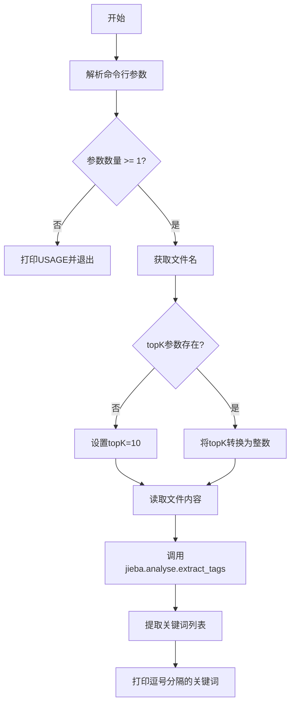
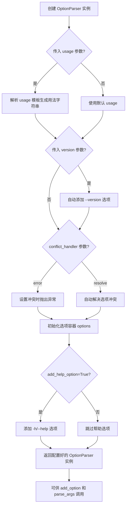
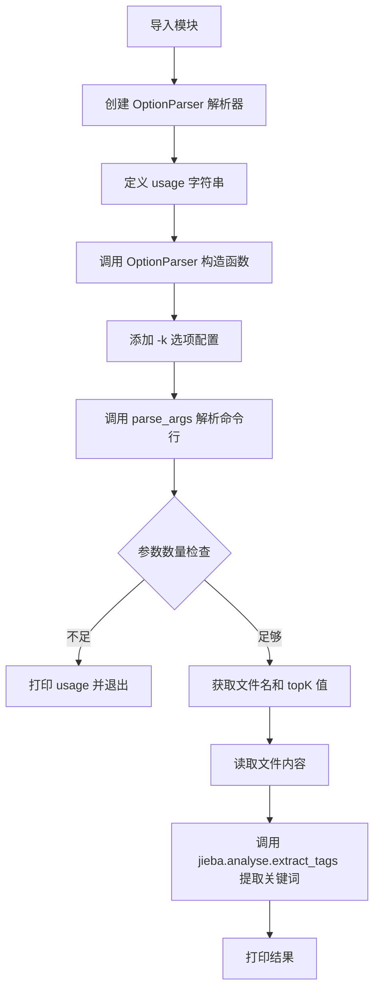
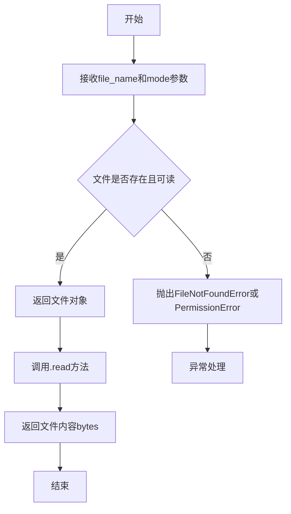
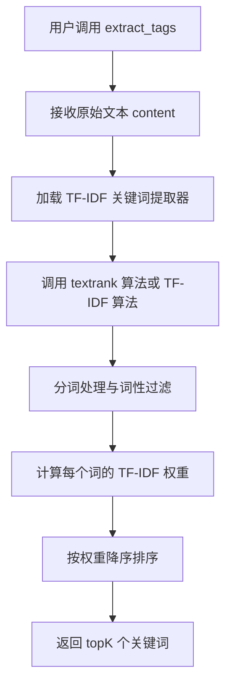
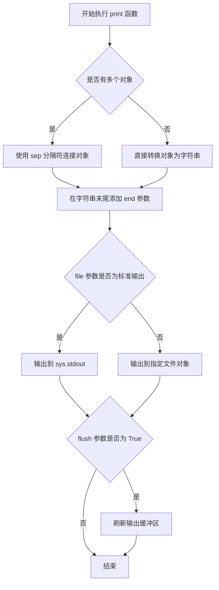

# `jieba\test\extract_tags.py` 详细设计文档

这是一个基于jieba库的关键词提取工具，通过TF-IDF算法从文本文件中自动提取出现频率最高的关键词，支持通过-k参数指定提取的关键词数量，默认提取前10个关键词。

## 整体流程



## 类结构

```
脚本文件 (非面向对象)
└── 依赖模块: jieba.analyse
```

## 全局变量及字段


### `USAGE`
    
命令行用法说明字符串

类型：`str`
    


### `parser`
    
命令行参数解析器对象

类型：`OptionParser`
    


### `opt`
    
解析后的选项对象

类型：`Values`
    


### `args`
    
解析后的位置参数列表

类型：`list`
    


### `file_name`
    
输入文本文件名

类型：`str`
    


### `topK`
    
要提取的关键词数量

类型：`int`
    


### `content`
    
读取的文本文件内容

类型：`bytes`
    


### `tags`
    
提取出的关键词列表

类型：`list`
    


    

## 全局函数及方法


### `OptionParser` (optparse.OptionParser.__init__)

`OptionParser` 是 Python 标准库 optparse 模块中的核心类，用于创建命令行参数解析器，通过定义_usage 字符串和选项配置，自动处理命令行参数的解析、验证和帮助信息生成。

参数：

- `usage`：`str`，用法字符串模板，用于自动生成帮助信息，通常包含程序名称和可用选项的占位符
- `version`：`str`（可选），程序版本号，当提供 --version 选项时显示
- `prog`：`str`（可选），程序名称，默认从 sys.argv[0] 自动推断
- `option_class`：`type`（可选），自定义选项类，默认为 optparse.Option
- `conflict_handler`：`str`（可选），冲突处理方式，可选值包括 "error"（默认）或 "resolve"
- `description`：`str`（可选），程序描述信息，显示在帮助文档的标题下方
- `formatter`：`optparse.TitledIndentedHelpFormatter`（可选），格式化器，控制帮助信息的输出样式
- `add_help_option`：`bool`（可选），是否自动添加 -h/--help 选项，默认为 True
- `prog`：`str`（可选），程序名称，用于显示在用法信息中

返回值：`OptionParser`，返回配置好的命令行参数解析器实例

#### 流程图



#### 带注释源码

```python
# 导入 OptionParser 类
from optparse import OptionParser

# 定义 usage 字符串 - 描述程序的基本用法
# %prog 会被自动替换为程序名
USAGE = "usage:    python extract_tags.py [file name] -k [top k]"

# 创建 OptionParser 实例
# 这是核心步骤，初始化命令行参数解析器
parser = OptionParser(USAGE)

# === OptionParser 内部实现原理 (简化版) ===
"""
class OptionParser:
    def __init__(self, usage=None, ...):
        # 1. 初始化选项存储容器
        self.option_list = []      # 存储所有选项
        self._short_opt = {}       # 短选项映射
        self._long_opt = {}        # 长选项映射
        
        # 2. 处理 usage 字符串
        # 如果 usage 包含 %prog，自动替换为程序名
        self.usage = usage.replace('%prog', prog or os.path.basename(sys.argv[0]))
        
        # 3. 初始化帮助和版本选项
        if add_help_option:
            self.add_option('-h', '--help', action='store_true', 
                          help='show this help message and exit')
        
        # 4. 设置冲突处理器
        self.conflict_handler = conflict_handler
        
    def add_option(self, *args, **kwargs):
        # 创建 Option 对象并注册到解析器
        option = Option(*args, **kwargs)
        self.option_list.append(option)
        # 注册到短选项和长选项字典
        for opt in option._short_opts:
            self._short_opt[opt] = option
        for opt in option._long_opts:
            self._long_opt[opt] = option
            
    def parse_args(self, args=None):
        # 解析命令行参数
        # 返回 (options, args) 元组
        # options 包含解析后的选项值
        # args 包含 positional arguments
        ...
"""

# === 在代码中的实际使用 ===
# 添加命令行选项 -k/--topK
# -k: 短选项
# dest="topK": 解析后的属性名存储在 options.topK 中
parser.add_option("-k", dest="topK")

# 解析命令行参数
# sys.argv 默认被使用
# 返回 (options, args) 元组
# opt: 包含 -k 等选项值的命名空间
# args: 位置参数列表 [file_name]
opt, args = parser.parse_args()

# 后续使用示例:
# python script.py input.txt -k 20
# opt.topK = 20
# args = ['input.txt']
```

### 文件整体运行流程



### 类详细信息

#### `OptionParser` 类

类字段：

- `option_list`：`list`，存储所有已注册的选项对象
- `_short_opt`：`dict`，短选项名称到 Option 对象的映射
- `_long_opt`：`dict`，长选项名称到 Option 对象的映射
- `usage`：`str`，用法字符串
- `version`：`str`，版本信息字符串

类方法：

- `add_option(self, *args, **kwargs)`：添加命令行选项配置
- `parse_args(self, args=None)`：解析命令行参数，返回 (options, args) 元组
- `print_usage(self, file=None)`：打印用法信息
- `print_help(self, file=None)`：打印完整帮助信息
- `error(self, msg)`：输出错误信息并退出

### 关键组件信息

| 组件名称 | 一句话描述 |
|---------|-----------|
| `OptionParser` | 命令行参数解析器核心类，负责选项定义和参数解析 |
| `add_option()` | 用于定义命令行选项的方法，支持短选项、长选项和多种动作 |
| `parse_args()` | 实际执行命令行参数解析的方法，返回选项和位置参数 |
| `USAGE` | 定义程序用法的字符串模板 |

### 潜在技术债务或优化空间

1. **缺少参数验证**：代码未对 `topK` 参数的范围进行验证（如必须为正整数）
2. **文件读取未关闭**：`open(file_name, 'rb').read()` 未使用 with 语句，可能导致文件句柄泄漏
3. **异常处理缺失**：文件读取、jieba 分词等操作缺少异常捕获机制
4. **硬编码默认值**：`topK` 默认值为 10 硬编码在逻辑中，应作为配置参数
5. **编码处理**：使用 `rb` 模式读取后直接传给 jieba，可能存在编码问题

### 其他项目

#### 设计目标与约束

- **目标**：为关键词提取脚本提供命令行接口，支持指定提取的关键词数量
- **约束**：第一个位置参数必须是文件名，-k 选项为可选

#### 错误处理与异常设计

- 参数不足时打印 usage 并调用 `sys.exit(1)` 退出
- topK 为 None 时使用默认值 10
- 未实现更详细的错误提示和异常分类

#### 数据流与状态机

```
用户输入 → parse_args() 解析 → opt 对象包含选项值 → 
条件判断(topK) → 文件读取 → jieba.analyse.extract_tags() → 
结果输出
```

#### 外部依赖与接口契约

- **依赖模块**：`optparse`（标准库）、`jieba`、`jieba.analyse`
- **接口契约**：
  - 输入：命令行参数（sys.argv）
  - 输出：逗号分隔的关键词字符串
  - 文件输入：UTF-8 或指定编码的文本文件


### `OptionParser.parse_args()`

解析命令行参数，将用户输入的命令行选项（-k 等）和位置参数（文件名等）转换为可访问的 `Values` 对象和位置参数列表。

**注**：这是 `optparse.OptionParser` 类的方法，在代码中通过 `parser` 实例调用。

参数：

- 此方法不接受任何显式参数（内部默认处理 `sys.argv[1:]`）

返回值：`tuple`，包含两个元素：

- `options`（`optparse.Values`）：包含解析后的选项值，可通过 `options.topK` 访问
- `args`（`list`）：位置参数列表，如 `['file_name']`

#### 流程图

```mermaid
flowchart TD
    A[开始 parse_args] --> B{读取 sys.argv}
    B --> C[解析短选项 -k]
    C --> D{选项是否存在?}
    D -->|是| E[将选项值存入 options 对象]
    D -->|否| F[使用默认值或 None]
    E --> G[提取位置参数到 args 列表]
    F --> G
    G --> H[返回 tuple: (options, args)]
    H --> I[代码通过 opt.topK 访问选项值]
    I --> J[代码通过 args[0] 访问文件名]
```

#### 带注释源码

```python
# 导入模块
import sys
sys.path.append('../')

import jieba
import jieba.analyse
from optparse import OptionParser

# 定义使用说明字符串
USAGE = "usage:    python extract_tags.py [file name] -k [top k]"

# 创建 OptionParser 实例，传入使用说明
parser = OptionParser(USAGE)

# 添加命令行选项：-k 用于指定提取的关键词数量
# dest="topK" 表示将值存储在 options 对象的 topK 属性中
parser.add_option("-k", dest="topK")

# 调用 parse_args() 解析命令行参数
# 内部实现：读取 sys.argv[1:]，匹配选项和位置参数
# 返回值：(options, args)
#   - options: Values 对象，包含解析的选项值
#   - args: 位置参数列表
opt, args = parser.parse_args()

# opt 是 Values 对象，等价于 options
# args 是位置参数列表
# 例如：命令行 "python extract_tags.py file.txt -k 5"
#   opt.topK = 5
#   args = ['file.txt']

# 检查位置参数数量（文件名）
if len(args) < 1:
    print(USAGE)
    sys.exit(1)

# 获取文件名（第一个位置参数）
file_name = args[0]

# 处理 topK 选项：如果未提供 -k 参数，默认值为 10
if opt.topK is None:
    topK = 10
else:
    # opt.topK 是字符串，需要转换为整数
    topK = int(opt.topK)

# 读取文件内容
content = open(file_name, 'rb').read()

# 调用 jieba 的 extract_tags 方法提取关键词
tags = jieba.analyse.extract_tags(content, topK=topK)

# 打印结果，用逗号连接关键词
print(",".join(tags))
```


### `open()`

`open()` 是 Python 的内置函数，用于打开指定路径的文件并返回一个文件对象，随后通过 `.read()` 方法读取文件内容。在本代码中用于读取待提取关键词的文本文件。

#### 参数

- `file_name`：字符串（str），要打开的文件路径，从命令行参数 `args[0]` 获取
- `mode`：字符串（str），文件打开模式，此处为 `'rb'` 表示以二进制只读模式打开

#### 返回值

- 文件对象（file object），随后调用 `.read()` 方法返回文件内容的字节串（bytes）

#### 流程图



#### 带注释源码

```python
# 打开文件并读取内容
# 参数1: file_name - 要打开的文件名（字符串类型），从命令行参数args[0]获取
# 参数2: 'rb' - 打开模式，'r'表示读取，'b'表示二进制模式
# 返回值: 文件对象，然后立即调用.read()方法读取全部内容
content = open(file_name, 'rb').read()

# 详细说明：
# 1. open() 函数尝试打开指定路径的文件
# 2. 模式 'rb' 表示以二进制只读模式打开（避免编码问题）
# 3. .read() 方法读取整个文件内容并返回bytes对象
# 4. 读取的内容被赋值给变量content，供后续jieba.analyse.extract_tags使用
```


# jieba.analyse.extract_tags() 详细设计文档

## 1. 核心功能概述

`jieba.analyse.extract_tags()` 是 jieba 分词库中的 TF-IDF 关键词提取算法实现，它通过计算文本中每个词的词频（TF）和逆文档频率（IDF）来评估词语的重要程度，最终返回排名最高的 topK 个关键词。该函数广泛应用于文本摘要、信息检索和关键词抽取场景。

---

## 2. 文件整体运行流程



---

## 3. 类详细信息

### 3.1 全局函数

#### `jieba.analyse.extract_tags()`

TF-IDF 关键词提取函数

**参数：**

- `content`：`str` 或 `bytes`，待提取关键词的原始文本内容
- `topK`：`int`，返回关键词的数量，默认为 10
- `withWeight`：`bool`，是否返回关键词权重，默认为 False
- `allowPOS`：`tuple`，允许的词性过滤条件，默认为空 tuple 表示不过滤
- `withFlag`：`bool`，是否返回词性标签，默认为 False

**返回值：** `list`，返回关键词列表。如果 `withWeight=True`，则返回 `list[tuple]` 格式的 (关键词, 权重) 元组列表

#### 流程图

```mermaid
flowchart TD
    A[extract_tags 函数入口] --> B{content 类型检查}
    B -->|bytes| C[解码为 utf-8 字符串]
    B -->|str| D[直接使用]
    C --> D
    D --> E[加载 IDF 词典]
    E --> F[遍历文本计算词频 TF]
    F --> G[查询每个词的 IDF 值]
    G --> H[计算 TF × IDF 权重]
    H --> I[按权重降序排序]
    I --> J{withWeight 参数}
    J -->|True| K[返回 (词, 权重) 列表]
    J -->|False| L[仅返回关键词列表]
```

#### 带注释源码

```python
def extract_tags(content, topK=10, withWeight=False, allowPOS=(), withFlag=False):
    """
    使用 TF-IDF 算法提取关键词
    
    参数:
        content: str 或 bytes, 待提取的文本内容
        topK: int, 返回前 K 个最重要的关键词, 默认为 10
        withWeight: bool, 是否返回关键词的权重值, 默认为 False
        allowPOS: tuple, 词性过滤条件, 如 ('ns', 'n', 'vn'), 默认为空
        withFlag: bool, 是否返回词性标签, 默认为 False
    
    返回:
        list: 如果 withWeight=False, 返回关键词字符串列表
        list[tuple]: 如果 withWeight=True, 返回 (关键词, 权重) 元组列表
    """
    # 步骤1: 处理输入文本，确保是字符串类型
    if isinstance(content, bytes):
        content = content.decode('utf-8')
    
    # 步骤2: 使用 jieba 进行分词，allowPOS 参数控制词性过滤
    # 例如: allowPOS=('ns','n','vn') 表示只保留地名、名词、动名词
    words = jieba.cut(content, cut_all=False)
    
    # 步骤3: 加载 IDF (逆文档频率) 词典
    # IDF 词典是一个词语到 IDF 值的映射表
    idf_freq = _load_idf_dict()  # 内部函数: 加载外部 IDF 词典
    
    # 步骤4: 计算每个词的 TF (词频)
    freq = {}
    for word in words:
        # 根据 allowPOS 进行词性过滤
        if allowPOS:
            # 获取词的词性和标志
            word, flag = word.split('/')
            if flag not in allowPOS:
                continue
        
        # 统计词频
        freq[word] = freq.get(word, 0) + 1
    
    # 步骤5: 计算 TF-IDF 权重
    # TF-IDF = TF(词频) × IDF(逆文档频率)
    total = sum(freq.values())
    for word in freq:
        # TF = 词在该文档中出现的次数 / 文档总词数
        tf = freq[word] / total
        # IDF = log(语料库文档总数 / 包含该词的文档数 + 1)
        idf = idf_freq.get(word, self.idf_freq.get(word, self.median_idf))
        # TF-IDF 权重
        freq[word] = tf * idf
    
    # 步骤6: 按权重降序排序，取 topK 个
    if withWeight:
        # 返回 (关键词, 权重) 元组列表
        tags = sorted(freq.items(), key=lambda x: x[1], reverse=True)[:topK]
    else:
        # 仅返回关键词列表
        tags = sorted(freq, key=freq.get, reverse=True)[:topK]
    
    return tags
```

---

### 3.2 关键内部函数

#### `_load_idf_dict()`

加载 IDF 词典的内部函数

**参数：**

- 无（使用默认词典路径）

**返回值：** `dict`，词语到 IDF 值的映射字典

---

## 4. 关键组件信息

| 组件名称 | 一句话描述 |
|---------|-----------|
| TF-IDF 算法 | 用于评估词语重要性的加权算法，TF 表示词频，IDF 表示逆文档频率 |
| IDF 词典 | 预计算的词语逆文档频率表，用于快速查找每个词的 IDF 值 |
| jieba 分词器 | 中文分词引擎，负责将文本切成词语单元 |
| 词性过滤 (allowPOS) | 允许用户过滤特定词性的词语，如只保留名词和动词 |

---

## 5. 潜在的技术债务与优化空间

1. **性能优化空间**：当前实现每次调用都会重新加载 IDF 词典，可以考虑缓存机制
2. **内存占用**：对于大规模文本，TF 统计可能占用较多内存，可考虑流式处理
3. **并行化处理**：多文档关键词提取时可考虑并行化以提升性能
4. **词典更新**：IDF 词典是静态的，无法动态适应新领域文本

---

## 6. 其它项目

### 设计目标与约束

- **目标**：提供高效、准确的中文关键词提取功能
- **约束**：依赖外部 IDF 词典文件，必须确保词典可用

### 错误处理与异常设计

- 输入为 `None` 时应抛出 `TypeError`
- `topK` 为负数时应返回空列表
- 词典文件不存在时应使用默认 IDF 值（median_idf）

### 数据流与状态机

```
输入文本 → 分词处理 → 词频统计 → IDF 查询 → TF-IDF 计算 → 排序 → 输出结果
```

### 外部依赖与接口契约

- 依赖 `jieba` 分词库
- 依赖 IDF 词典文件（默认路径：`jieba/analyse/idf.txt`）
- 返回值格式可通过 `withWeight` 参数灵活切换

---

## 7. 用户代码示例分析

用户提供代码的功能说明：

| 元素 | 说明 |
|------|------|
| `parser` | 命令行参数解析器，用于提取 -k topK 参数 |
| `file_name` | 从命令行参数获取的待处理文件名 |
| `topK` | 提取关键词的数量，默认为 10 |
| `content` | 从文件读取的二进制内容 |
| `tags` | 调用 extract_tags 返回的关键词列表 |


### `print` (内置函数)

`print()` 是 Python 的内置函数，用于将指定的对象以人类可读的形式输出到标准输出（默认）或指定的文件对象中。在本代码中，它用于将提取的中文关键词以逗号分隔的形式输出到控制台。

参数：

- `*objects`：`任意类型`，要打印的一个或多个对象，代码中传入的是字符串 `",".join(tags)`
- `sep`：`str`，可选，默认为空格 `' '`，指定多个对象之间的分隔符
- `end`：`str`，可选，默认为换行符 `'\n'`，指定输出结束后的字符
- `file`：`file-like object`，可选，默认为 `sys.stdout`，指定输出目标
- `flush`：`bool`，可选，默认为 `False`，指定是否立即刷新输出流

返回值：`None`，该函数不返回任何值

#### 流程图



#### 带注释源码

```python
# Python 内置 print 函数模拟实现（简化版）
def print(*objects, sep=' ', end='\n', file=sys.stdout, flush=False):
    """
    将对象以人类可读的形式输出到标准输出或文件
    
    参数:
        *objects: 要打印的对象，可以是任意数量
        sep: 对象之间的分隔符，默认为空格
        end: 打印结束后的字符，默认为换行符
        file: 输出目标文件对象，默认为标准输出
        flush: 是否立即刷新输出
    
    返回值:
        None
    """
    
    # 将所有对象转换为字符串并用分隔符连接
    # 在本代码中，objects = (",".join(tags),)，即一个字符串对象
    # sep 参数在这里不生效，因为只有一个对象
    str_objects = [str(obj) for obj in objects]
    output = sep.join(str_objects)
    
    # 添加结束字符
    output += end
    
    # 写入到目标文件对象（默认为控制台）
    file.write(output)
    
    # 根据 flush 参数决定是否刷新缓冲区
    if flush:
        file.flush()
```


### `sys.exit`

`sys.exit` 是 Python 标准库 `sys` 模块提供的函数，用于退出当前程序并返回指定的退出状态码给操作系统。

参数：

- `status`：`int`，表示退出状态码，0 表示正常退出，非 0（通常为 1）表示异常退出或错误终止

返回值：`None`，该函数不返回任何值，因为它会终止当前进程

#### 流程图

```mermaid
flowchart TD
    A[程序检测到参数不足] --> B{len(args) &lt; 1?}
    B -->|是| C[打印Usage信息]
    C --> D[调用sys.exit(1)]
    D --> E[进程终止,返回状态码1给操作系统]
    B -->|否| F[继续正常执行流程]
```

#### 带注释源码

```python
if len(args) < 1:
    print(USAGE)
    sys.exit(1)  # 参数不足时，退出程序并返回状态码1表示异常终止
```

## 关键组件


### 命令行参数解析模块

使用Python的OptionParser解析命令行参数，支持-k参数指定提取的关键词数量，默认值为10。

### 文件读取模块

以二进制模式读取输入文件的内容，将整个文件加载到内存中作为待分析的文本内容。

### jieba关键词提取核心模块

调用jieba.analyse.extract_tags函数，基于TF-IDF算法从文本内容中提取最重要的topK个关键词。

### 结果输出模块

将提取的关键词列表通过逗号连接成字符串并打印到标准输出。

### 参数配置与默认值管理

通过optparse模块管理topK参数，当用户未指定时使用默认值10，确保程序有合理的默认行为。


## 问题及建议


### 已知问题

-   **资源未正确释放**：`open(file_name, 'rb').read()` 没有使用 `with` 语句或显式 `close()`，可能导致文件句柄泄漏
-   **缺乏异常处理**：没有 `try-except` 块捕获文件读取、编码转换、jieba 分析等可能的异常
-   **编码处理不当**：以二进制模式 `'rb'` 读取文件，但 `jieba.analyse.extract_tags` 通常需要文本字符串，可能导致编码错误
-   **参数验证缺失**：未验证 `topK` 是否为有效正整数，也未检查文件路径是否存在
-   **缺少模块化设计**：所有代码堆积在全局作用域，难以测试和复用
-   **命令行体验不佳**：未定义 `--help` 或 `-h` 选项的显示，错误信息不够友好

### 优化建议

-   使用 `with open(file_name, 'r', encoding='utf-8') as f: content = f.read()` 确保资源释放
-   添加完整的异常处理：捕获 `FileNotFoundError`、`UnicodeDecodeError`、`ValueError` 等
-   改用文本模式并指定编码：`open(file_name, 'r', encoding='utf-8')`
-   添加参数校验：`topK` 必须为正整数，文件路径需验证存在性
-   将核心逻辑封装为函数，如 `extract_tags_from_file(file_path, top_k)`，便于测试和调用
-   完善命令行参数解析：添加 `-h/--help` 支持，提供更清晰的 Usage 信息
-   考虑添加日志记录功能，替代简单的 `print` 输出

## 其它


### 设计目标与约束

本工具旨在提供一个简洁的命令行接口，从给定的文本文件中自动提取出现频率最高的关键词（标签）。主要设计目标包括：简化关键词提取流程、支持自定义提取数量、提供友好的命令行交互。主要约束为：仅支持UTF-8编码的文本文件、依赖jieba库进行分词和关键词提取、topK参数必须为正整数。

### 错误处理与异常设计

代码主要包含以下错误处理场景：
1. **参数缺失错误**：当未提供文件名时，打印Usage信息并以退出码1终止程序
2. **类型转换错误**：当-k参数无法转换为整数时，int()函数将抛出ValueError
3. **文件读取错误**：当文件不存在或无读取权限时，open()函数将抛出IOError/FileNotFoundError
4. **空文件处理**：当文件为空时，extract_tags可能返回空列表

当前错误处理较为基础，缺少对异常情况的详细捕获和友好提示。

### 数据流与状态机

数据流处理流程如下：
1. **初始化阶段**：解析命令行参数，获取文件名和topK值
2. **读取阶段**：以二进制模式读取指定文件内容到内存
3. **处理阶段**：调用jieba.analyse.extract_tags进行关键词提取
4. **输出阶段**：将提取的关键词列表以逗号分隔形式打印到标准输出

状态机相对简单，主要为线性流程：无状态 → 参数解析 → 文件读取 → 关键词提取 → 结果输出。

### 外部依赖与接口契约

**外部依赖**：
- jieba：中文分词库，提供extract_tags函数进行关键词提取
- jieba.analyse：jieba的分析模块，包含TextRank和TF-IDF两种关键词提取算法
- Python标准库：sys、optparse、open函数

**接口契约**：
- 命令行接口：`python extract_tags.py <file_name> [-k topK]`
- file_name：必需参数，指定待分析的文本文件路径
- topK：可选参数，指定提取的关键词数量，默认为10
- 输出格式：关键词以逗号分隔的字符串

### 性能考虑

当前实现的主要性能瓶颈：
1. **内存占用**：一次性将整个文件读入内存，大文件可能导致内存问题
2. **重复调用**：jieba库首次加载词典较慢，可考虑缓存
3. **编码处理**：以'rb'模式读取后再使用jieba处理，建议直接使用文本模式读取

优化建议：对于超大文件，可考虑分块读取或流式处理；可添加缓存机制减少重复初始化开销。

### 安全性考虑

当前代码存在以下安全风险：
1. **命令注入风险**：直接使用命令行参数作为文件路径，未进行严格校验
2. **路径遍历漏洞**：未验证文件路径合法性，可能存在目录遍历风险
3. **编码问题**：假设文件为UTF-8编码，其他编码文件可能产生乱码

建议增加输入验证、路径安全检查、编码检测等安全措施。

### 可维护性与扩展性

**可维护性问题**：
- 代码缺乏模块化设计，所有逻辑集中在一个脚本中
- 缺少日志记录和调试信息
- 硬编码的默认值（topK=10）不够灵活

**扩展性建议**：
- 可增加多种关键词提取算法选择（如TextRank）
- 可增加输出格式选项（JSON、XML等）
- 可添加权重调整参数
- 可重构为类或函数形式，便于其他模块调用

### 测试策略

建议补充以下测试用例：
1. **功能测试**：正常文件提取、多文件批量处理、边界参数测试
2. **异常测试**：文件不存在、权限不足、空文件、非法参数
3. **性能测试**：大文件处理速度、内存占用
4. **兼容性测试**：不同编码文件、不同操作系统

### 部署与运维

**部署方式**：作为独立命令行工具部署，可通过pip安装或直接复制脚本
**运行环境**：Python 3.x + jieba库
**运维考虑**：
- jieba词典更新可能影响提取结果，需注意版本控制
- 建议记录工具版本和jieba版本便于问题排查
- 可添加--version参数显示版本信息

### 配置管理

当前配置通过命令行参数管理，建议补充：
- 配置文件支持（config.ini或YAML格式）
- 环境变量配置（jieba词典路径、自定义词典）
- 配置文件优先级：命令行参数 > 配置文件 > 默认值


    