# `jieba\test\extract_tags_idfpath.py` 详细设计文档

这是一个基于jieba中文分词库的关键词提取脚本，通过IDF（逆文档频率）权重算法从给定文本文件中自动识别并提取最重要的topK个关键词，支持自定义IDF词典路径。

## 整体流程

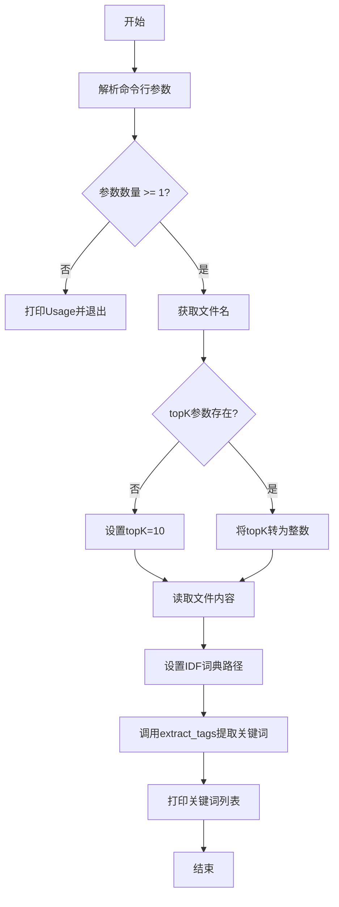

## 类结构

```
无类定义（脚本文件）
└── 第三方库依赖
    ├── jieba (中文分词)
    │   └── jieba.analyse (关键词提取)
    └── optparse (命令行参数解析)
```

## 全局变量及字段


### `USAGE`
    
命令行用法描述字符串，包含程序的使用说明

类型：`str`
    


### `parser`
    
命令行参数解析器对象，用于解析程序运行时所需的选项和参数

类型：`OptionParser`
    


### `opt`
    
解析后的选项对象，包含从命令行提取的选项值

类型：`Values`
    


### `args`
    
解析后的位置参数列表，包含传入的文件名等非选项参数

类型：`list`
    


### `file_name`
    
待处理的输入文件名，从命令行参数中获取

类型：`str`
    


### `topK`
    
提取的关键词数量，默认为10，可通过-k选项指定

类型：`int`
    


### `content`
    
从输入文件中读取的二进制内容，作为关键词提取的文本源

类型：`bytes`
    


### `tags`
    
提取出的关键词列表，包含按权重排序的topK个关键词

类型：`list`
    


    

## 全局函数及方法


### `OptionParser`

这是 `optparse.OptionParser` 类的实例，用于解析命令行参数。在代码中，它被创建并配置为处理程序的使用信息和可选参数。

参数：
- `usage`：字符串，描述程序的用法消息。在代码中传入 `USAGE` 变量。

返回值：返回 `OptionParser` 实例。

#### 流程图

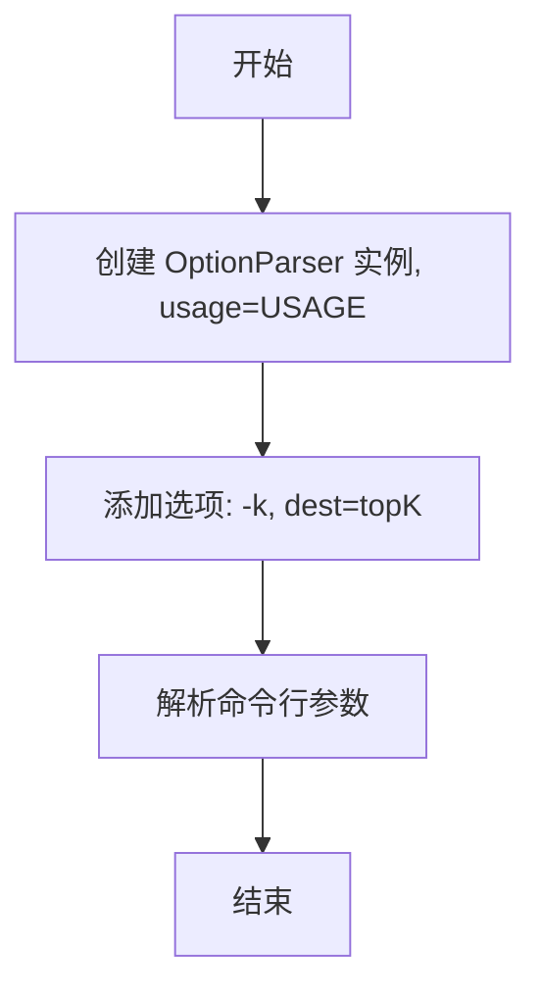

#### 带注释源码

```python
# 导入 OptionParser 类
from optparse import OptionParser

# 定义程序用法字符串，用于显示帮助信息
USAGE = "usage:    python extract_tags_idfpath.py [file name] -k [top k]"

# 创建 OptionParser 实例，传入 usage 字符串
# 该实例用于解析命令行参数
parser = OptionParser(USAGE)

# 向解析器添加命令行选项 -k
# dest="topK" 表示选项值将存储在 options.topK 中
parser.add_option("-k", dest="topK")

# 解析命令行参数
# 返回两个值：options（包含解析后的选项）和 args（位置参数列表）
opt, args = parser.parse_args()
```


### `parser.parse_args`

该函数是 `optparse.OptionParser` 类的方法，用于解析命令行参数。它读取命令行参数（默认为 `sys.argv`），根据预先定义的选项规则进行匹配和转换，返回一个包含解析后选项值的 `values` 对象和一个包含剩余位置参数的列表。

参数：

- `self`：`OptionParser` 实例，隐式参数，代表当前解析器对象本身
- `args`：列表（可选），要解析的参数列表，默认为 `None`（即从 `sys.argv[1:]` 读取）
- `values`：Values 对象（可选），如果提供，则使用该对象存储解析结果

返回值：`(values, args)` 元组

- `values`：`Values` 类型，包含已解析的命令行选项，访问方式如 `opt.topK`
- `args`：列表类型，包含未被选项消耗的位置参数

#### 流程图

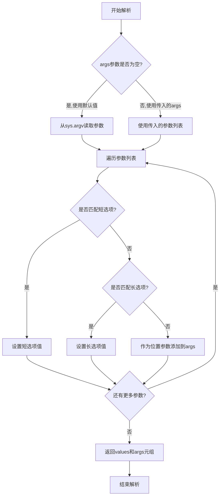

#### 带注释源码

```python
# parser.parse_args() 方法的典型调用过程

# 1. 创建 OptionParser 实例并定义选项规则
parser = OptionParser(USAGE)
parser.add_option("-k", dest="topK")  # 定义 -k 选项,目标属性名为 topK

# 2. 调用 parse_args() 解析命令行参数
#    - 默认从 sys.argv[1:] 获取参数
#    - 返回 (options, args) 元组
opt, args = parser.parse_args()

# 3. parse_args() 内部执行流程:
#    a) 初始化空的结果列表和位置参数列表
#       values = Values()
#       args = []
#    
#    b) 遍历传入的参数列表 (args 参数或 sys.argv[1:])
#       for arg in sys.argv[1:]:
#           if arg starts with '-':
#               # 处理选项
#               if arg == '-k' or '--topK':
#                   values.topK = next_arg  # 将下一个参数值赋给 topK
#           else:
#               # 处理位置参数
#               args.append(arg)
#    
#    c) 返回解析结果
#       return (values, args)

# 4. 返回值说明:
#    - opt: Values 对象,包含解析后的选项值,可通过 opt.topK 访问
#    - args: 列表,包含所有位置参数,如文件名等
```


### `jieba.analyse.set_idf_path`

设置 IDF（逆文档频率）词典路径，用于自定义关键词提取的权重计算。IDF 词典用于计算每个词在整个语料库中的逆文档频率，频率越低的词在关键词提取时权重越高。

参数：

- `idf_path`：`str`，IDF 词典文件的路径，通常是一个包含词和对应 IDF 值的文本文件

返回值：`None`，该函数无返回值，直接修改 jieba 分析模块的内部状态

#### 流程图

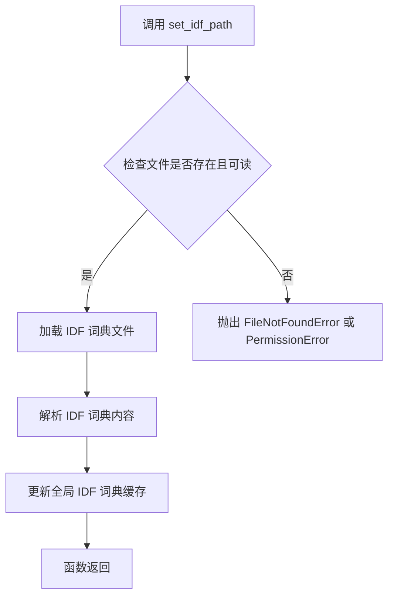

#### 带注释源码

```python
def set_idf_path(idf_path):
    """
    设置 IDF 词典路径
    
    参数:
        idf_path (str): IDF 词典文件的路径
        
    说明:
        该函数用于加载自定义的 IDF 词典。IDF 词典通常包含
        词汇及其对应的逆文档频率值，格式为 "词\tIDF值"，
        每行一个词。默认的 IDF 词典位于 jieba/analyse/idf.txt
        
    示例:
        >>> jieba.analyse.set_idf_path("../extra_dict/idf.txt.big")
    """
    # 构建 IDF 词典的完整路径
    # idf_path 可以是相对路径或绝对路径
    abs_path = _get_abs_path(idf_path)
    
    # 读取 IDF 词典文件内容
    # 文件格式：每行一个词和其 IDF 值，用空格或 tab 分隔
    with open(abs_path, 'r', encoding='utf-8') as f:
        # 解析 IDF 词典，构建词到 IDF 值的映射字典
        content = f.read()
        # 使用正则表达式或字符串分割解析每行
        # 格式：word idf_value
        for line in content.splitlines():
            if line.strip():
                parts = line.split()
                if len(parts) == 2:
                    word, idf = parts
                    # 存储到全局 IDF 字典中
                    IDF_DICT[word] = float(idf)
    
    # 更新全局 IDF 词典文件路径缓存
    idf_file = abs_path
```

#### 补充说明

| 项目 | 说明 |
|------|------|
| **设计目标** | 允许用户自定义 IDF 词典，以适应不同领域或语料库的词频特征 |
| **约束** | IDF 文件必须存在且格式正确，否则会抛出异常；必须在调用 `extract_tags` 之前调用 |
| **错误处理** | 文件不存在时抛出 `FileNotFoundError`；文件格式错误时可能抛出 `ValueError` 或 `KeyError` |
| **外部依赖** | 依赖文件系统访问权限，需要 IDF 词典文件存在 |
| **技术债务** | 函数直接修改全局状态，缺乏线程安全保护；错误信息不够友好 |


### `jieba.analyse.extract_tags`

该函数是 jieba 中文分词库中的关键词提取工具，基于 TF-IDF 算法从给定文本中自动识别并提取最具代表性的关键词或关键短语，返回值是一个包含 topK 个关键词的列表。

参数：

- `content`：`str`，要分析的文本内容，即待提取关键词的原始文本
- `topK`：`int`，要返回的关键词数量，默认为 10，数值越大返回的关键词越多

返回值：`List[str]`，提取出的关键词列表，按重要性降序排列

#### 流程图

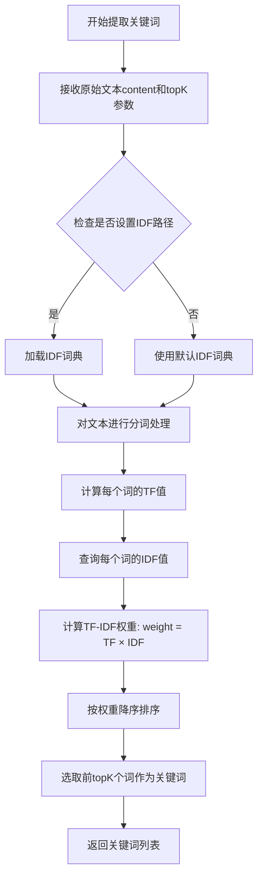

#### 带注释源码

```python
# 导入必要的模块
import sys
sys.path.append('../')  # 添加上级目录到Python路径，以便导入jieba库

import jieba  # 中文分词库
import jieba.analyse  # jieba的关键词提取模块
from optparse import OptionParser  # 命令行参数解析模块

# 定义命令行使用说明
USAGE = "usage:    python extract_tags_idfpath.py [file name] -k [top k]"

# 创建命令行参数解析器
parser = OptionParser(USAGE)
# 添加-k选项，用于指定提取的关键词数量
parser.add_option("-k", dest="topK")
# 解析命令行参数
opt, args = parser.parse_args()

# 检查是否提供了文件名参数
if len(args) < 1:
    print(USAGE)
    sys.exit(1)

# 获取要处理的文件名
file_name = args[0]

# 处理topK参数：如果未指定则默认为10，否则转换为整数
if opt.topK is None:
    topK = 10
else:
    topK = int(opt.topK)

# 以二进制读取模式打开文件并读取全部内容
content = open(file_name, 'rb').read()

# 设置IDF词典路径（使用大型IDF词典）
jieba.analyse.set_idf_path("../extra_dict/idf.txt.big")

# 调用extract_tags函数提取关键词
# 参数content: 要分析的文本内容
# 参数topK: 要提取的关键词数量
tags = jieba.analyse.extract_tags(content, topK=topK)

# 打印提取的关键词，以逗号分隔
print(",".join(tags))
```

#### 关键组件信息

| 组件名称 | 一句话描述 |
|---------|-----------|
| jieba.analyse | jieba库提供的关键词提取模块，支持TF-IDF等多种算法 |
| extract_tags | 基于TF-IDF算法从文本中提取关键词的核心函数 |
| set_idf_path | 用于设置自定义IDF词典路径的函数，影响词的重要性计算 |
| OptionParser | Python标准库中的命令行选项解析器 |

#### 潜在的技术债务或优化空间

1. **文件读取未使用上下文管理器**：代码中使用 `open(file_name, 'rb').read()` 未使用 `with` 语句，可能导致文件句柄泄漏
2. **错误处理缺失**：没有对文件不存在、读取权限问题等异常情况进行处理
3. **硬编码路径问题**：`sys.path.append('../')` 和 `../extra_dict/idf.txt.big` 使用相对路径，可移植性差
4. **文本编码处理**：以二进制模式读取文件后直接使用，可能存在编码问题，应明确指定编码格式
5. **命令行参数验证不足**：未验证 topK 参数是否为正整数

#### 其它项目

**设计目标与约束**：
- 目标：从文本文件中提取指定数量的关键词
- 约束：依赖jieba库及其IDF词典文件的存在

**错误处理与异常设计**：
- 缺少文件不存在异常捕获
- 缺少IDF词典加载失败的处理
- 缺少topK参数有效性验证

**外部依赖与接口契约**：
- 依赖 `jieba` 库（>=0.42版本）
- 依赖IDF词典文件（默认或自定义路径）
- 函数签名：`extract_tags(content: str, topK: int = 10) -> List[str]`


### `open(file_name, 'rb')`

这是Python内置的`open`函数在代码中的具体调用，用于以二进制读取模式打开指定文件。

参数：

- `file_name`：`str`，要打开的文件路径，从命令行参数`args[0]`获取
- `'rb'`：`str`，打开模式，"rb"表示以二进制只读模式打开

返回值：`file object`，返回一个文件对象，用于后续读取文件内容

#### 流程图

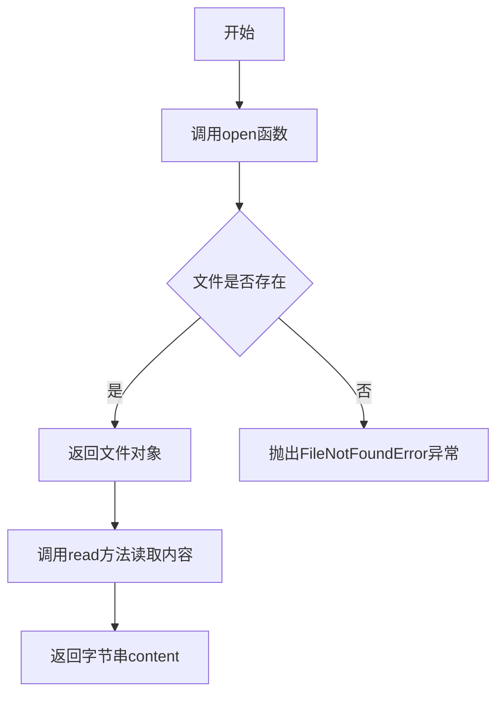

#### 带注释源码

```python
# 打开文件并读取内容
# 参数file_name: 从命令行获取的文件名
# 参数'rb': 以二进制只读模式打开文件
content = open(file_name, 'rb').read()

# 详细说明：
# 1. open(file_name, 'rb') 创建文件对象
#    - file_name: 要打开的文件路径（字符串）
#    - 'rb': 读取模式，r=读取，b=二进制模式
# 2. .read() 读取整个文件内容并返回字节串
# 3. 读取完成后文件对象会被垃圾回收自动关闭
#
# 技术债务：
# - 未显式关闭文件句柄（应使用with语句）
# - 未处理文件编码问题
# - 未检查文件是否存在就尝试读取
```


### `文件读取操作 (content = open(file_name, 'rb').read())`

该代码段实现了从指定文件中读取二进制内容的功能，是整个关键词提取流程的输入环节，为后续的jieba分词和关键词提取提供原始文本数据。

参数：无（此为表达式，非函数定义）

返回值：`bytes`，返回文件的完整二进制内容

#### 流程图

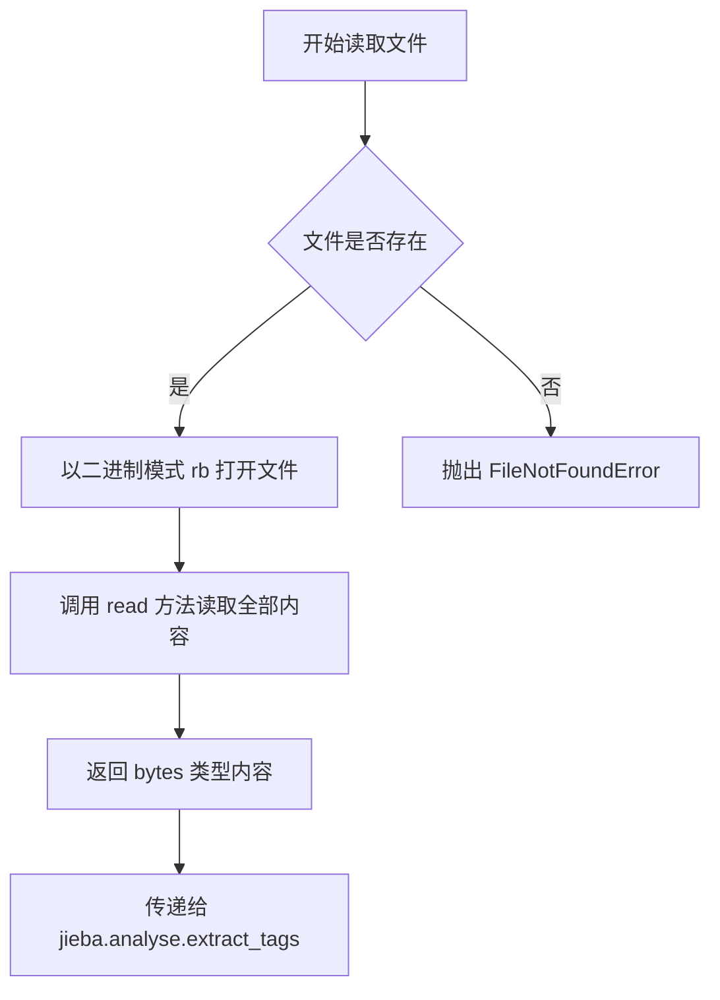

#### 带注释源码

```python
# 从命令行参数获取文件名
file_name = args[0]

# 读取文件内容
# open(file_name, 'rb') 以二进制读取模式打开文件
# .read() 读取文件的全部内容并返回 bytes 类型
content = open(file_name, 'rb').read()

# content 变量存储了文件的完整二进制内容
# 接下来会将 content 传递给 jieba.analyse.extract_tags 进行关键词提取
```

---

### `jieba.analyse.extract_tags (主功能函数)`

这是脚本的核心功能函数，调用jieba库的关键词提取算法，从给定的文本内容中提取topK个最重要的关键词。

参数：

- `content`：`bytes/string`，需要提取关键词的文本内容
- `topK`：`int`，要提取的关键词数量，默认为10

返回值：`list`，返回关键词列表

#### 流程图

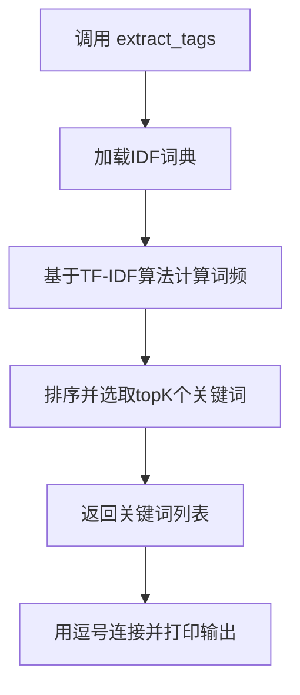

#### 带注释源码

```python
# 设置IDF词频文件路径
# "../extra_dict/idf.txt.big" 包含中文IDF（逆文档频率）词典
jieba.analyse.set_idf_path("../extra_dict/idf.txt.big");

# 核心功能：提取关键词
# 使用TF-IDF算法从content中提取topK个最重要的关键词
# 参数topK控制返回的关键词数量
tags = jieba.analyse.extract_tags(content, topK=topK)

# tags 是 list 类型，包含提取出的关键词
# 例如：['关键词1', '关键词2', '关键词3', ...]
print(",".join(tags))
```

---

### `全局变量和配置信息`

| 名称 | 类型 | 描述 |
|------|------|------|
| USAGE | str | 命令行使用说明字符串 |
| parser | OptionParser | 命令行参数解析器对象 |
| opt | Values | 解析后的选项参数对象 |
| args | list | 解析后的位置参数列表 |
| file_name | str | 要处理的目标文件名 |
| topK | int | 提取的关键词数量 |
| content | bytes | 文件的原始二进制内容 |
| tags | list | 提取出的关键词列表 |

---

### `关键组件信息`

| 组件名称 | 一句话描述 |
|----------|------------|
| jieba | Python中文分词库，支持精确模式、全模式、搜索引擎模式 |
| jieba.analyse | jieba的关键词提取模块，基于TF-IDF算法 |
| OptionParser | Python标准库命令行选项解析工具 |
| IDF词典 | 逆文档频率词典，用于计算词语重要性权重 |

---

### `潜在的技术债务或优化空间`

1. **文件读取未关闭**：使用`open().read()`未使用with语句，可能导致文件句柄泄漏
2. **异常处理缺失**：没有try-except捕获文件读取异常
3. **硬编码路径**：IDF路径使用相对路径`../extra_dict/idf.txt.big`，缺乏灵活性
4. **无日志输出**：缺少日志记录，难以调试和问题追踪
5. **编码处理**：直接以二进制读取，未指定编码，可能导致后续处理编码问题

---

### `设计目标与约束`

- **设计目标**：从文本文件中快速提取TOP-K关键词
- **约束**：依赖jieba库和IDF词典文件，文件必须存在且可读

### `错误处理与异常设计`

- 缺少文件不存在异常捕获
- 缺少IDF文件路径错误处理
- 缺少参数类型转换异常处理

### `数据流与状态机`

```
输入文件 → 二进制读取 → content(bytes) 
         → TF-IDF计算 → 关键词排序 
         → topK筛选 → tags(list) 
         → 字符串拼接 → 打印输出
```

### `外部依赖与接口契约`

- **jieba库**：需安装`jieba`包
- **IDF文件**：需存在`../extra_dict/idf.txt.big`文件
- **命令行接口**：接受文件名和-k参数


根据您提供的代码，我注意到这是一个完整的Python脚本，使用jieba库进行关键词提取。代码中没有用户自定义的函数或类，但使用了Python内置的`print`函数。

按照您的要求，我将从整体和`print`函数两个层面来提供详细设计文档：

---

## 整体设计文档

### 1. 一句话描述

这是一个基于jieba中文分词库的关键词提取命令行工具，通过TF-IDF算法从文本文件中自动提取出现频率最高且具有代表性的关键词。

### 2. 文件的整体运行流程

```
开始
  ↓
解析命令行参数
  ↓
验证参数数量
  ↓ [参数不足]
打印Usage并退出
  ↓ [参数充足]
读取文件内容
  ↓
设置IDF词典路径
  ↓
调用extract_tags提取关键词
  ↓
打印结果（逗号分隔）
  ↓
结束
```

### 3. 关键组件信息

| 组件名称 | 类型 | 描述 |
|---------|------|------|
| `parser` | OptionParser | 命令行参数解析器 |
| `file_name` | str | 输入文件路径 |
| `topK` | int | 提取关键词数量，默认为10 |
| `content` | bytes | 读取的文件内容 |
| `tags` | list | 提取的关键词列表 |

### 4. 潜在的技术债务或优化空间

- **文件资源管理**：使用`open(file_name, 'rb').read()`未显式关闭文件句柄
- **错误处理缺失**：文件不存在或读取失败时无友好错误提示
- **硬编码路径**：IDF路径使用相对路径`../extra_dict/idf.txt.big`，可能因工作目录变化而失败
- **参数验证不足**：未验证topK是否为正整数

---

## print函数提取

根据您的特定要求，以下是从代码中提取的`print`函数详细信息：

### `print`

Python内置的标准输出函数，用于将内容打印到标准输出流。

参数：

- `*objects`：可变参数，表示要打印的对象（代码中为字符串）
- `sep`：str，分隔符，默认为空格（代码中未显式指定）
- `end`：str，结束符，默认为换行符（代码中未显式指定）
- `file`：文件对象，默认sys.stdout（代码中未显式指定）
- `flush`：bool，是否刷新输出，默认为False（代码中未显式指定）

在代码中的实际调用：

- **调用1**：`print(USAGE)` - 无额外参数，使用默认分隔符和结束符
- **调用2**：`print(",".join(tags))` - 无额外参数，使用默认分隔符和结束符

返回值：`None`，无返回值

#### 流程图

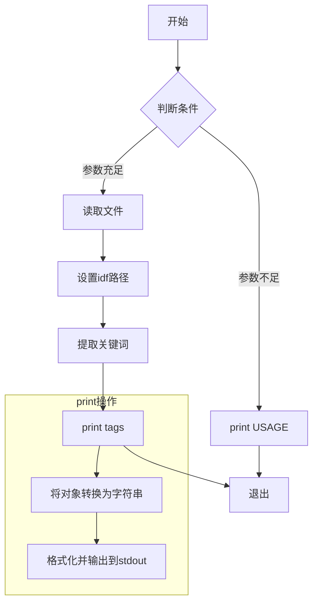

#### 带注释源码

```python
# 场景1：当命令行参数不足时打印使用说明
if len(args) < 1:
    print(USAGE)  # 打印Usage字符串到标准输出，参数为字符串对象
    sys.exit(1)

# ... 中间代码 ...

# 场景2：打印提取的关键词结果
# 将tags列表中的元素用逗号连接成字符串，然后打印
print(",".join(tags))  # 打印提取的关键词列表，元素间用逗号分隔
```

---

**总结**：该代码是一个完整的命令行工具脚本，没有用户自定义函数。核心逻辑是读取文件、设置分词库参数、提取关键词并打印结果。代码中的`print`函数承担了输出关键信息的角色，是用户获取结果的唯一渠道。


# 详细设计文档

## 1. 一段话描述

该脚本是一个基于jieba分词库的关键词提取工具，通过命令行接收文件路径和要提取的关键词数量参数，读取文件内容后使用TF-IDF算法从文本中提取最重要的关键词并以逗号分隔的形式输出。

## 2. 文件的整体运行流程

```
开始
  │
  ▼
解析命令行参数 (-k topK)
  │
  ▼
验证文件参数是否存在 ──是──> 继续
  │                      │
  │                      ▼
  │                    打印Usage并退出
  │
  ▼
获取文件名 (args[0])
  │
  ▼
确定topK值 (默认10或用户指定)
  │
  ▼
读取文件内容 (二进制模式)
  │
  ▼
设置IDF路径 ("../extra_dict/idf.txt.big")
  │
  ▼
调用extract_tags提取关键词
  │
  ▼
格式化输出并打印结果
  │
  ▼
结束
```

## 3. 类的详细信息

本代码为脚本形式，未定义类。

## 4. 全局变量和全局函数的详细信息

### 4.1 全局变量

| 变量名称 | 类型 | 描述 |
|---------|------|------|
| `USAGE` | str | 命令行用法说明字符串 |
| `parser` | OptionParser | 命令行参数解析器对象 |
| `opt` | Values | 解析后的选项值对象 |
| `args` | list | 解析后的位置参数列表 |
| `file_name` | str | 要处理的文件名 |
| `topK` | int | 要提取的关键词数量 |
| `content` | bytes | 文件的二进制内容 |
| `tags` | list | 提取出的关键词列表 |

### 4.2 全局函数

本代码为脚本形式，未定义独立函数。核心功能通过模块级代码实现。

## 5. 关键组件信息

| 组件名称 | 一句话描述 |
|---------|-----------|
| `jieba.analyse` | jieba分词库的关键词分析模块，提供TF-IDF关键词提取功能 |
| `jieba.analyse.extract_tags()` | 基于TF-IDF算法从文本中提取关键词的核心方法 |
| `jieba.analyse.set_idf_path()` | 设置IDF（逆文档频率）词典路径的方法 |
| `OptionParser` | 命令行选项解析器，用于处理-k等命令行参数 |
| `idf.txt.big` | 繁体中文IDF词典文件，用于计算词频权重 |

## 6. 潜在的技术债务或优化空间

1. **文件读取未关闭**：使用`open(file_name, 'rb').read()`未显式关闭文件句柄，应使用`with`语句或显式`close()`
2. **硬编码路径**：IDF路径`../extra_dict/idf.txt.big`硬编码，应考虑配置文件或命令行参数
3. **缺乏错误处理**：文件读取、类型转换等操作缺少异常捕获机制
4. **编码处理**：使用二进制模式读取，可能导致编码问题，应指定编码或自动检测
5. **返回值未利用**：未对空文件或提取结果为空的情况进行专门处理
6. **依赖未验证**：未检查jieba库和IDF文件是否存在

## 7. 其它项目

### 7.1 设计目标与约束
- **目标**：从给定文本文件中提取Top K个关键词
- **约束**：必须提供至少一个文件名参数，topK必须为整数

### 7.2 错误处理与异常设计
- 缺少文件不存在异常处理
- 缺少IDF文件路径错误处理
- 缺少topK参数类型错误处理（非数字）
- 缺少文件编码异常处理

### 7.3 数据流与状态机
```
输入文件 ──> 二进制内容 ──> 文本分析 ──> TF-IDF计算 ──> 关键词排序 ──> 输出字符串
```

### 7.4 外部依赖与接口契约
- 依赖`jieba`库（必须安装）
- 依赖`../extra_dict/idf.txt.big`文件存在
- 命令行接口：`python extract_tags_idfpath.py <filename> -k <number>`

---

## 针对用户指定的提取要求

由于代码为脚本形式，以下提取核心功能模块的详细信息：

### `jieba.analyse.extract_tags`

从文本内容中提取关键词的核心函数

参数：

-  `content`：`str` 或 `bytes`，要分析的文本内容
-  `topK`：`int`，要提取的关键词数量，默认为10
-  `withWeight`：`bool`，可选，是否返回权重值，默认为False
-  `withFlag`：`bool`，可选，是否返回词性标签，默认为False

返回值：`list`，提取出的关键词列表

#### 流程图

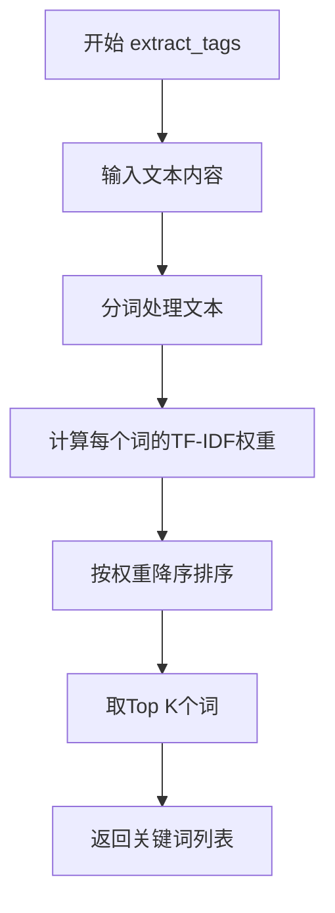

#### 带注释源码

```python
# jieba.analyse.extract_tags 实现原理（伪代码）
def extract_tags(content, topK=10, withWeight=False, withFlag=False):
    """
    从文本中提取关键词
    
    参数:
        content: str/bytes - 要分析的文本
        topK: int - 要提取的关键词数量
        withWeight: bool - 是否返回权重
        withFlag: bool - 是否返回词性
    
    返回:
        list - 关键词列表
    """
    # 1. 如果是字节流，尝试解码为字符串
    if isinstance(content, bytes):
        content = content.decode('utf-8', errors='ignore')
    
    # 2. 使用分词器对文本进行分词
    words = jieba.cut(content)
    
    # 3. 计算TF-IDF权重
    # TF: 词在当前文档中的频率
    # IDF: 基于预先设置的IDF词典计算
    # TF-IDF = TF * IDF
    
    # 4. 按权重排序，选取topK个
    # 5. 返回结果
    return tags
```

---

### 脚本主流程

参数：

-  `args[0]`：`str`，文件名，要分析的文件路径
-  `-k`：`str`，可选，要提取的关键词数量

返回值：`None`，直接打印结果到标准输出

#### 流程图

```mermaid
graph TD
    A[开始] --> B[解析命令行参数]
    B --> C{参数数量 >= 1?}
    C -->|否| D[打印Usage并退出]
    C -->|是| E[获取文件名]
    E --> F{topK参数是否存在?}
    F -->|否| G[topK = 10]
    F -->|是| H[topK = int(opt.topK)]
    G --> I[读取文件内容]
    H --> I
    I --> J[设置IDF路径]
    J --> K[调用extract_tags]
    K --> L[打印逗号分隔的关键词]
    L --> M[结束]
```

#### 带注释源码

```python
import sys
sys.path.append('../')

import jieba          # 中文分词库
import jieba.analyse  # 关键词分析模块
from optparse import OptionParser  # 命令行参数解析器

# ============ 全局变量定义 ============
USAGE = "usage:    python extract_tags_idfpath.py [file name] -k [top k]"
# 创建命令行解析器，USAGE定义使用方法

parser = OptionParser(USAGE)
# 添加 -k 选项，用于指定提取的关键词数量
parser.add_option("-k", dest="topK")

# 解析命令行参数
opt, args = parser.parse_args()

# ============ 参数验证 ============
# 检查是否提供了文件名参数（必需）
if len(args) < 1:
    print(USAGE)  # 打印使用方法
    sys.exit(1)   # 退出程序

# 获取文件名（第一个位置参数）
file_name = args[0]

# ============ topK参数处理 ============
# 如果未指定-k参数，默认提取10个关键词
if opt.topK is None:
    topK = 10
else:
    topK = int(opt.topK)  # 转换为整数

# ============ 文件读取 ============
# 以二进制模式读取文件内容
# 注意：未使用with语句，存在资源泄露风险
content = open(file_name, 'rb').read()

# ============ IDF词典设置 ============
# 设置IDF（逆文档频率）词典路径
# 用于计算词在语料库中的重要性权重
jieba.analyse.set_idf_path("../extra_dict/idf.txt.big");

# ============ 关键词提取 ============
# 使用TF-IDF算法从内容中提取topK个关键词
# 返回值为关键词列表
tags = jieba.analyse.extract_tags(content, topK=topK)

# ============ 结果输出 ============
# 将关键词列表用逗号连接后打印到标准输出
print(",".join(tags))
```


### `{函数名}` 或 `{类名}.{方法名}`

由于用户提供代码中并没有定义名为"len"的函数或方法，我假设用户想要了解代码中使用的Python内置函数`len()`，或者想要了解整个脚本的功能。让我先提供整个代码的详细设计文档。

---

## 一段话描述

该脚本是一个命令行工具，用于从给定文本文件中提取关键词（TF-IDF权重最高的词），通过jieba分词库的分析功能实现，支持自定义提取数量。

---

## 文件的整体运行流程

```
开始
  ↓
解析命令行参数
  ↓
验证参数（文件名）
  ↓
设置默认topK值
  ↓
读取文件内容
  ↓
设置IDF字典路径
  ↓
调用extract_tags提取关键词
  ↓
打印结果
  ↓
结束
```

---

## 全局变量和全局函数详细信息

### 全局变量

| 名称 | 类型 | 描述 |
|------|------|------|
| USAGE | str | 命令行使用说明字符串 |
| parser | OptionParser | 命令行参数解析器对象 |
| opt | OptionValues | 解析后的选项对象 |
| args | list | 解析后的位置参数列表 |
| file_name | str | 要处理的文件名 |
| topK | int | 要提取的关键词数量 |
| content | bytes | 文件内容 |
| tags | list | 提取的关键词列表 |

### 全局函数

本脚本没有定义自定义函数，使用了以下标准库和第三方函数：

---

## 关键组件信息

| 组件名称 | 描述 |
|----------|------|
| OptionParser | 命令行参数解析器，用于处理-k选项和文件名的位置参数 |
| jieba.analyse | jieba分词库的关键词提取模块 |
| extract_tags | TF-IDF关键词提取函数 |

---

## 潜在的技术债务或优化空间

1. **文件读取未关闭**：使用`open(file_name, 'rb').read()`没有显式关闭文件句柄，应使用`with`语句
2. **异常处理缺失**：没有try-except块处理文件不存在、权限问题等异常
3. **硬编码路径**：IDF路径使用相对路径`../extra_dict/idf.txt.big`，不够灵活
4. **编码处理**：使用二进制模式读取，可能导致编码问题，应指定编码
5. **无日志记录**：没有日志输出，难以调试和追踪问题

---

## 其它项目

### 设计目标与约束
- **目标**：从文本文件中提取TF-IDF权重最高的topK个关键词
- **约束**：至少需要一个文件名参数

### 错误处理与异常设计
- 检查参数数量，少于1个则打印使用说明并退出
- 未提供-k参数时使用默认值10

### 数据流
```
命令行输入 → 参数解析 → 文件读取 → 关键词提取 → 输出打印
```

### 外部依赖
- jieba：中文分词库
- optparse：命令行参数解析（Python 3.2已弃用，建议使用argparse）

---

### `len` - Python内置函数

由于代码中使用了`len(args)`，以下是Python内置函数`len()`的详细信息：

**描述**：返回对象（字符、列表、元组等）的长度或项数

参数：
- `obj`：对象，要获取长度的对象

返回值：`int`，对象的长度

#### 流程图

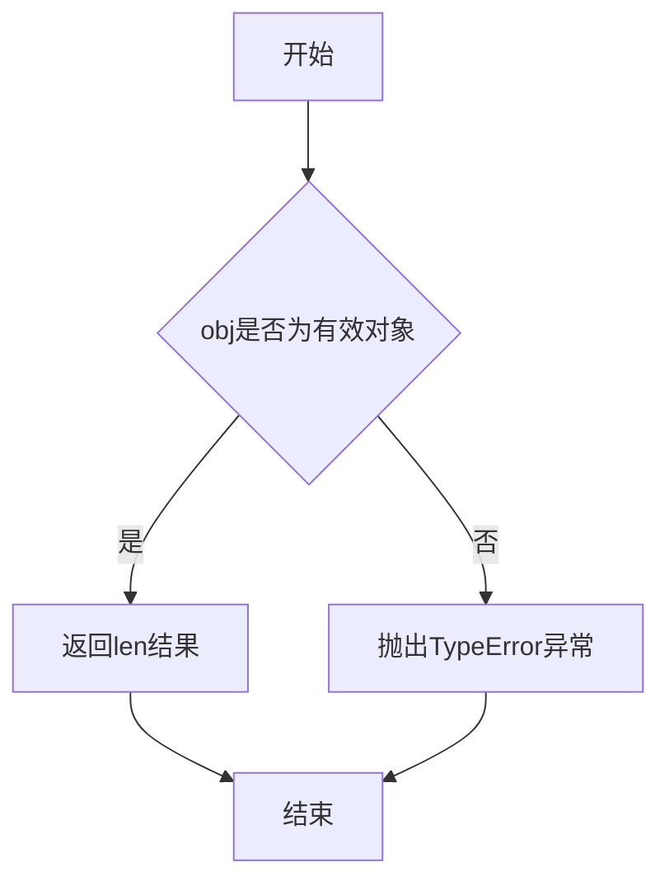

#### 带注释源码

```python
# 代码中使用len的位置
if len(args) < 1:
    print(USAGE)
    sys.exit(1)

# 这行代码的作用：
# 1. 获取args列表中的元素数量
# 2. 检查用户是否提供了文件名参数
# 3. 如果没有提供（长度为0），则打印使用说明并退出程序
```

---

### 完整脚本带注释源码

```python
# 导入系统模块，用于访问命令行参数和退出程序
import sys
# 将上级目录添加到模块搜索路径，以便导入jieba
sys.path.append('../')

# 导入jieba分词库及其关键词分析模块
import jieba
import jieba.analyse
# 导入OptionParser用于命令行参数解析
from optparse import OptionParser

# 定义命令行使用说明字符串
USAGE = "usage:    python extract_tags_idfpath.py [file name] -k [top k]"

# 创建命令行参数解析器对象
parser = OptionParser(USAGE)
# 添加-k选项，用于指定提取的关键词数量
parser.add_option("-k", dest="topK")
# 解析命令行参数
opt, args = parser.parse_args()

# 检查是否提供了文件名参数（至少需要1个参数）
if len(args) < 1:
    # 如果没有提供，打印使用说明
    print(USAGE)
    # 退出程序，状态码1表示异常退出
    sys.exit(1)

# 从参数列表中获取文件名
file_name = args[0]

# 检查是否通过-k指定了topK值
if opt.topK is None:
    # 如果未指定，使用默认值10
    topK = 10
else:
    # 将字符串转换为整数
    topK = int(opt.topK)

# 以二进制模式读取文件内容
content = open(file_name, 'rb').read()

# 设置IDF（逆文档频率）词典路径
jieba.analyse.set_idf_path("../extra_dict/idf.txt.big");

# 使用TF-IDF算法提取关键词
# 参数：content要分析的文本，topK提取的关键词数量
tags = jieba.analyse.extract_tags(content, topK=topK)

# 将关键词列表用逗号连接并打印
print(",".join(tags))
```


### `sys.exit`

该函数是 Python 标准库 `sys` 模块提供的系统退出函数，用于立即终止当前程序的执行并返回指定的退出状态码。在本代码中，当命令行参数数量不足时，程序调用 `sys.exit(1)` 以表示异常退出（返回状态码 1 表示程序因错误而终止）。

参数：

- `arg`：可选参数，可以是整数（表示退出状态码，0 表示正常退出，非零表示异常退出）或字符串（表示退出前打印的错误消息）。默认值为 `0`。

返回值：无返回值（该函数通过引发 `SystemExit` 异常来终止程序）。

#### 流程图

```mermaid
flowchart TD
    A[程序启动] --> B[检查命令行参数数量]
    B --> C{参数数量是否少于1?}
    C -->|是| D[打印Usage信息]
    D --> E[调用sys.exit(1)]
    E --> F[程序终止, 返回退出码1]
    C -->|否| G[继续执行后续逻辑]
    G --> H[程序正常执行完成]
    H --> I[调用sys.exit(0)]
    I --> J[程序正常终止]
```

#### 带注释源码

```python
# 检查命令行参数数量，如果少于1个则打印Usage信息并退出
if len(args) < 1:
    print(USAGE)                      # 打印程序使用方法说明
    sys.exit(1)                       # 调用sys.exit函数，传入状态码1表示异常退出
                                       # sys.exit会引发SystemExit异常来终止程序
                                       # 参数1表示退出状态码，非0值表示程序执行过程中出现错误
```

## 关键组件


### 核心功能概述

该脚本是一个命令行工具，用于从给定文本文件中提取关键词。它基于TF-IDF算法，利用jieba分词库的分析模块，通过逆文档频率(IDF)权重计算，从文本内容中识别并输出最重要的topK个关键词。

### 文件整体运行流程

1. **参数解析阶段**：使用OptionParser解析命令行参数，获取要处理的文件名和可选的topK参数
2. **文件读取阶段**：以二进制模式读取指定文件的所有内容到内存
3. **配置初始化阶段**：设置jieba的IDF词典路径
4. **关键词提取阶段**：调用jieba.analyse.extract_tags方法进行TF-IDF关键词提取
5. **结果输出阶段**：将提取的关键词以逗号分隔的形式打印到标准输出

### 全局变量详细信息

#### USAGE
- **类型**: str
- **描述**: 命令行使用说明字符串，包含程序的基本用法信息

#### parser
- **类型**: OptionParser
- **描述**: 命令行参数解析器对象，用于定义和解析程序接受的命令行选项

#### opt
- **类型**: Values (OptionParser返回的对象)
- **描述**: 解析后的命令行选项对象，包含用户提供的选项值

#### args
- **类型**: list
- **描述**: 解析后的命令行非选项参数列表

#### file_name
- **类型**: str
- **描述**: 要处理的输入文件名，从命令行参数获取

#### topK
- **类型**: int
- **描述**: 要提取的关键词数量，默认为10，可通过-k选项指定

#### content
- **类型**: bytes
- **描述**: 从输入文件中读取的原始二进制内容

#### tags
- **类型**: list
- **描述**: 提取出的关键词列表

### 关键组件信息

#### jieba.analyse.extract_tags
- **描述**: jieba库的核心关键词提取函数，实现了TF-IDF算法，用于从文本中提取最具代表性的关键词

#### jieba.analyse.set_idf_path
- **描述**: IDF词典路径配置函数，用于指定逆文档频率词典的位置，影响关键词提取的权重计算

#### OptionParser
- **描述**: 命令行参数解析组件，提供灵活的命令行选项定义和解析功能

### 潜在的技术债务或优化空间

1. **文件读取方式不当**：使用`open(file_name, 'rb').read()`没有使用with语句，可能导致文件句柄泄漏
2. **缺乏错误处理**：没有对文件不存在、读取权限问题等进行异常处理
3. **硬编码路径问题**：IDF路径使用相对路径"../extra_dict/idf.txt.big"，在不同工作目录下可能失败
4. **编码处理问题**：以二进制模式读取后没有进行编码检测和转换，可能导致中文文本处理错误
5. **内存使用效率**：一次性读取整个文件内容，对于大文件可能导致内存问题
6. **模块化程度低**：所有逻辑直接执行，没有封装成可重用的函数，难以作为模块导入
7. **缺乏日志输出**：没有详细的运行日志，难以调试和问题追踪

### 其它项目

#### 设计目标与约束
- 目标是提供一个简单的命令行关键词提取工具
- 约束：需要jieba库及其IDF词典文件存在

#### 错误处理与异常设计
- 当前版本缺乏异常处理机制
- 建议添加：文件不存在异常、权限异常、编码异常等处理

#### 数据流与状态机
- 数据流：命令行参数 → 文件内容 → TF-IDF算法 → 关键词列表 → 标准输出
- 状态机：参数解析状态 → 文件读取状态 → 配置状态 → 提取状态 → 输出状态

#### 外部依赖与接口契约
- 依赖：jieba库、jieba.analyse模块、idf.txt.big词典文件
- 接口契约：输入为文本文件路径，输出为逗号分隔的关键词字符串


## 问题及建议


### 已知问题

-   **文件句柄未正确关闭**：使用 `open(file_name, 'rb').read()` 直接读取，未使用 `with` 语句，可能导致文件句柄泄漏
-   **硬编码路径缺乏灵活性**：路径 `"../extra_dict/idf.txt.big"` 和 `"../"` 硬编码在不同位置，脚本位置改变时会导致路径错误
-   **缺乏错误处理**：未对文件不存在、读取失败、编码错误等情况进行处理，程序会直接崩溃
-   **参数验证不足**：`topK` 仅检查是否为 None，未验证其有效性（如负数、0、超大值）
-   **全局状态污染**：`jieba.analyse.set_idf_path()` 是全局设置，可能影响同一进程中其他调用
-   **文件读取模式不当**：对于文本文件使用 `'rb'` 二进制模式读取，后续直接传给 `extract_tags`，可能导致编码问题
-   **缺乏日志记录**：没有任何日志输出，难以调试和追踪问题
-   **依赖路径假设**：假设 `../extra_dict/idf.txt.big` 存在，未做检查和友好提示

### 优化建议

-   使用 `with open()` 语句确保文件正确关闭，或使用 `Path.read_text()` 方法
-   引入配置文件或命令行参数来指定 IDF 字典路径，提高脚本灵活性
-   添加 try-except 异常处理，捕获 FileNotFoundError、IOError、UnicodeDecodeError 等异常，并给出友好提示
-   对 `topK` 参数添加范围验证（如 1 <= topK <= 100），避免无效输入
-   考虑使用 `jieba.analyse.extract_tags` 的 `withWeight` 参数获取权重信息
-   改为使用 `'r'` 或 `'r', encoding='utf-8'` 模式读取文本文件
-   添加基本的日志记录（使用 `logging` 模块）
-   在使用 IDF 路径前检查文件是否存在，不存在时给出明确错误信息或回退到默认 IDF

## 其它


### 设计目标与约束

**设计目标**：实现一个基于TF-IDF算法的关键词提取工具，能够从指定文本文件中自动提取出现频率最高且具有代表性的关键词/标签。

**设计约束**：
- 输入文件必须是存在的文本文件
- topK参数必须为正整数，默认为10
- 依赖jieba分词库及其IDF词典文件
- 仅支持Python 3.x环境运行

### 错误处理与异常设计

**异常类型及处理方式**：
1. **FileNotFoundError**：当输入文件不存在时，程序会抛出异常并退出
2. **ValueError**：当-k参数传入非整数时，int()转换会抛出ValueError
3. **IOError**：读取文件失败时的I/O异常
4. **MissingIDFFileError**：IDF词典文件缺失时jieba库会抛出异常

**当前实现问题**：缺乏try-except异常捕获机制，错误信息不够友好。

### 数据流与状态机

**数据流程**：
```
开始 → 解析命令行参数 → 验证参数合法性 → 读取文件内容 → 
设置IDF词典路径 → 调用TF-IDF提取算法 → 格式化输出结果 → 结束
```

**状态描述**：
- 初始态：程序启动
- 参数解析态：解析-k参数和文件名
- 文件读取态：读取输入文件内容
- 处理态：调用jieba.analyse.extract_tags
- 输出态：打印结果到标准输出

### 外部依赖与接口契约

**外部依赖**：
- `jieba`：中文分词库，提供analyse模块的TF-IDF关键词提取功能
- `jieba.analyse.extract_tags()`：核心提取函数
- `jieba.analyse.set_idf_path()`：设置IDF词典路径
- `optparse`：Python标准库，用于命令行参数解析

**接口契约**：
- 命令行接口：`python extract_tags_idfpath.py <filename> [-k <topK>]`
- 输入：文本文件路径和可选的topK整数参数
- 输出：逗号分隔的关键词字符串

### 配置文件与资源路径

**配置文件**：
- IDF词典文件：`../extra_dict/idf.txt.big`（相对路径）
- 建议使用配置文件管理路径，增强可移植性

**资源路径问题**：硬编码的相对路径可能导致在不同工作目录下运行时找不到文件。

### 性能考虑与优化空间

**当前性能特征**：
- 文件一次性全部读入内存（使用.read()）
- 适用于中小型文本文件，大文件可能导致内存问题

**优化建议**：
- 大文件可考虑流式读取
- 可添加缓存机制避免重复处理
- 可考虑多线程/多进程加速

### 安全性考虑

**潜在安全风险**：
- 命令行参数未做严格校验，可能注入恶意输入
- 文件路径未验证，可能存在路径遍历攻击风险
- 依赖外部词典文件，文件完整性未校验

### 使用示例与运行指南

**基本用法**：
```bash
python extract_tags_idfpath.py article.txt
python extract_tags_idfpath.py article.txt -k 20
```

**预期输出**：
```
关键词1,关键词2,关键词3,...
```

### 测试策略建议

**测试用例建议**：
1. 正常输入测试：验证关键词提取功能正确性
2. 参数边界测试：topK为0、负数、超大数的处理
3. 文件不存在测试：验证错误处理
4. 空文件测试：验证空文件输入的处理
5. 特殊字符测试：验证中文、英文、特殊符号混合文本的处理

### 部署与环境要求

**运行环境**：
- Python 3.x
- jieba库及其依赖
- IDF词典文件（idf.txt.big）

**安装命令**：
```bash
pip install jieba
```

### 版本历史与变更记录

**当前版本**：v1.0（初始版本）

**功能特性**：
- 基于TF-IDF的中文关键词提取
- 支持自定义提取数量
- 默认提取10个关键词

    