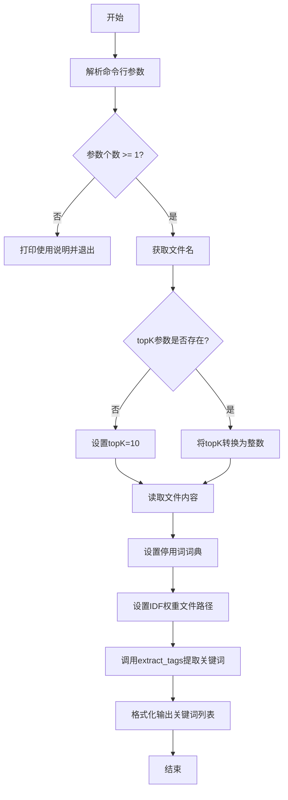
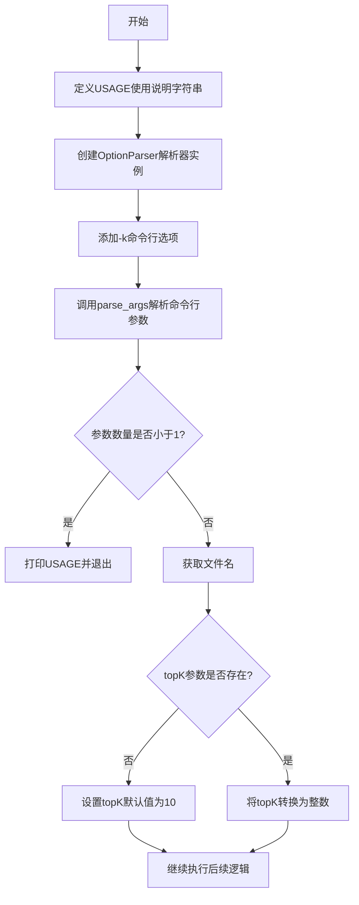
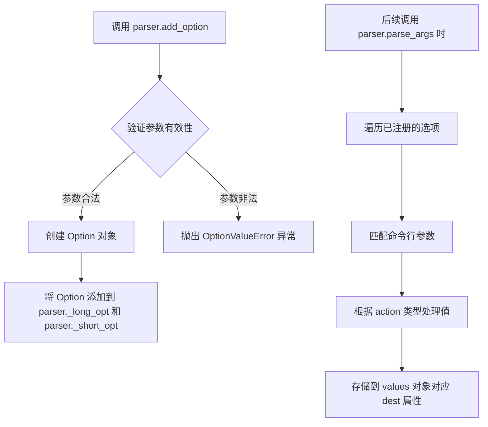
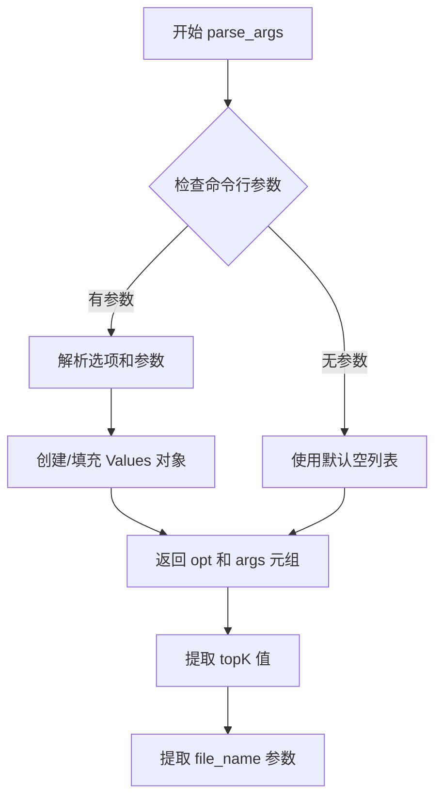
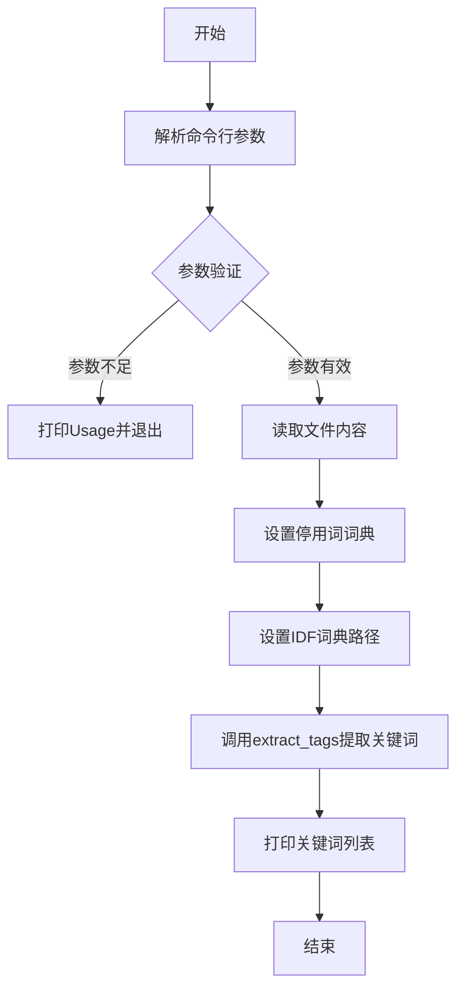
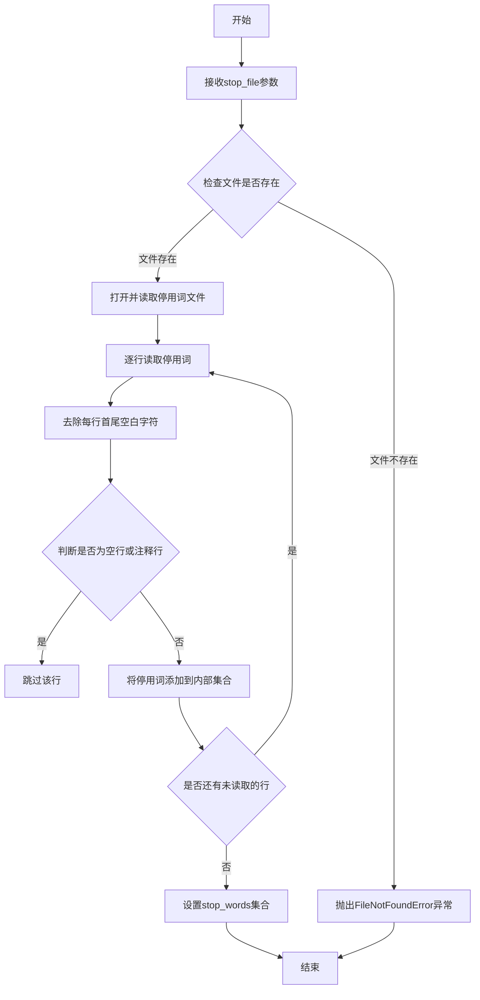
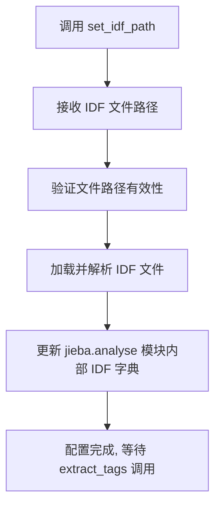
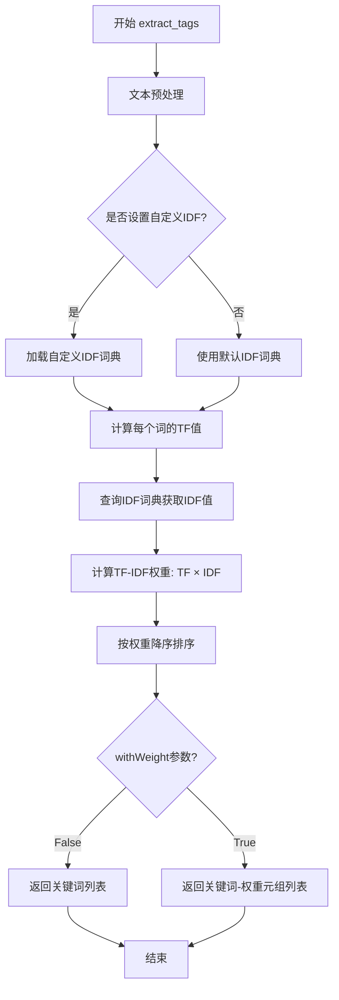

# `jieba\test\extract_tags_stop_words.py` 详细设计文档

这是一个基于jieba中文分词库的关键词提取工具脚本，通过TF-IDF算法从文本文件中自动提取出现频率最高的前k个关键词，支持自定义停用词表和IDF权重文件。

## 整体流程



## 类结构

```
无类层次结构（脚本文件）
```

## 全局变量及字段


### `USAGE`
    
命令行使用说明

类型：`字符串`
    


### `parser`
    
命令行参数解析器

类型：`OptionParser对象`
    


### `opt`
    
解析后的选项对象

类型：`Values对象`
    


### `args`
    
解析后的位置参数列表

类型：`列表`
    


### `file_name`
    
输入文件名

类型：`字符串`
    


### `topK`
    
要提取的关键词数量

类型：`整数`
    


### `content`
    
文件内容

类型：`字节串`
    


### `tags`
    
提取出的关键词列表

类型：`列表`
    


    

## 全局函数及方法


### `OptionParser`（命令行参数解析器创建）

该代码段使用 Python 标准库的 `optparse` 模块创建一个命令行参数解析器，用于解析 `-k` 参数以指定提取的关键词数量，同时接收一个文件路径作为输入文件。

参数：

- `USAGE`：`string`，命令行使用说明文本字符串
- 无直接参数传递给 `OptionParser` 构造函数

返回值：

- `parser`：`OptionParser`，返回创建的参数解析器对象

#### 流程图



#### 带注释源码

```python
# 导入所需模块
import sys
# 将上级目录添加到Python路径
sys.path.append('../')

# 导入结巴分词库及其分析模块
import jieba
import jieba.analyse
# 从optparse模块导入OptionParser类
from optparse import OptionParser

# 定义命令行使用说明字符串
# 格式: python 脚本名 [文件名] -k [Top K数量]
USAGE = "usage:    python extract_tags_stop_words.py [file name] -k [top k]"

# 创建OptionParser解析器实例，传入USAGE字符串作为使用说明
# parser是一个OptionParser对象，用于解析命令行参数
parser = OptionParser(USAGE)

# 向解析器添加命令行选项
# -k: 短选项名称
# dest="topK": 将值存储在parser的topK属性中
parser.add_option("-k", dest="topK")

# 解析命令行参数
# opt: 包含解析后的选项值的对象
# args: 包含位置参数（文件名）的列表
opt, args = parser.parse_args()

# 检查位置参数数量（文件名校验）
# 如果没有提供文件名，则打印使用说明并退出程序
if len(args) < 1:
    print(USAGE)
    sys.exit(1)

# 获取第一个位置参数作为文件名
file_name = args[0]

# 判断-k参数是否被提供
# 如果未提供topK参数，设置默认值为10
if opt.topK is None:
    topK = 10
else:
    # 将topK字符串转换为整数
    topK = int(opt.topK)

# 以二进制读取模式打开文件并读取全部内容
content = open(file_name, 'rb').read()

# 设置jieba分析的停用词词典路径
jieba.analyse.set_stop_words("../extra_dict/stop_words.txt")
# 设置jieba分析的IDF词典路径
jieba.analyse.set_idf_path("../extra_dict/idf.txt.big");

# 调用jieba的extract_tags函数提取关键词
# topK参数指定提取的关键词数量
tags = jieba.analyse.extract_tags(content, topK=topK)

# 打印提取的关键词，用逗号连接
print(",".join(tags))
```


### `parser.add_option`

添加命令行选项，用于定义命令行参数的解析规则，支持短选项（如 `-k`）和长选项（如 `--keyword`），并可配置参数的默认值、类型、帮助信息等属性。

参数：

- `*args`：`tuple`，可变参数列表，接受一个或多个选项字符串（如 `-k`, `--keyword`）
- `action`：`str`，指定选项的行为，默认为 `store`，可选值包括 `store`, `store_true`, `store_false`, `append`, `count` 等
- `dest`：`str`，指定将选项值存储到 `values` 对象属性时的属性名，若未指定则从选项字符串推断
- `type`：`str`，指定选项值的类型，默认为 `string`，可选值包括 `string`, `int`, `long`, `float`, `complex`, `choice`
- `default`：`any`，指定选项的默认值，若未指定则根据 `action` 类型设定
- `help`：`str`，指定帮助信息，用于 `--help` 输出时的描述文本
- `metavar`：`str`，指定在帮助信息中显示的参数名占位符
- `const`：`any`，当 action 为 `store_const` 或 `append_const` 时使用的常量值
- `choices`：`list`，当 type 为 `choice` 时，限定可选值列表

返回值：`None`，该方法无返回值，直接修改 parser 对象的状态。

#### 流程图



#### 带注释源码

```python
# 代码中实际使用方式
parser = OptionParser(USAGE)  # 创建命令行解析器实例
parser.add_option("-k", dest="topK")  # 添加 -k 选项，将值存储到 topK 属性

# 完整的 add_option 方法调用示例（包含更多参数）
parser.add_option(
    "-k",                           # 短选项
    "--keyword",                    # 长选项（可省略）
    action="store",                 # 存储选项值（默认行为）
    dest="topK",                    # 存储属性名为 topK
    type="int",                     # 值为整数类型
    default=10,                     # 默认值为 10
    help="显示前 K 个关键词",        # 帮助文本
    metavar="K"                     # 帮助信息中显示为 -k K
)

# parse_args 解析后的访问方式
# opt.topK  # 访问 -k 参数的值
```

#### 关键组件信息

| 组件名称 | 一句话描述 |
|---------|-----------|
| `OptionParser` | 命令行选项解析器核心类，负责管理所有选项和参数解析 |
| `Option` | 表示单个命令行选项的数据结构，包含选项元数据 |
| `Values` | 解析后的选项值容器，通过属性名访问各选项值 |

#### 潜在的技术债务或优化空间

1. **过时的库**：使用 `optparse` 而非更现代的 `argparse`，后者支持子命令和更灵活的参数配置
2. **硬编码路径**：文件路径和词典路径硬编码，缺乏灵活性
3. **缺乏错误处理**：文件读取、整数转换等操作缺乏异常捕获机制
4. **编码问题**：使用 `rb` 模式读取文件可能在不同平台产生编码问题，应指定编码


### `parser.parse_args`

该函数是 Python `optparse` 模块中 `OptionParser` 类的方法，用于解析命令行参数，将用户输入的命令行选项（-k 等）和位置参数分离，返回包含解析结果的选项对象和剩余参数列表。

参数：

- `args`：可选，列表类型，默认值为 `sys.argv[1:]`，指定要解析的参数列表
- `options`：可选，`optparse.Values` 类型，默认值为 `None`，用于存储解析后的选项值

返回值：元组 `(opt, args)`
- `opt`：`optparse.Values` 类型，包含解析后的选项值，示例中通过 `opt.topK` 访问
- `args`：列表类型，包含解析后剩余的位置参数

#### 流程图



#### 带注释源码

```python
# 从 optparse 模块导入 OptionParser 类
from optparse import OptionParser

# 定义使用说明字符串
USAGE = "usage:    python extract_tags_stop_words.py [file name] -k [top k]"

# 创建 OptionParser 实例，传入使用说明
parser = OptionParser(USAGE)

# 添加命令行选项 -k，用于指定提取的关键词数量
# dest="topK" 表示将值存储在返回对象的 topK 属性中
parser.add_option("-k", dest="topK")

# 调用 parse_args 方法解析命令行参数
# 不传入参数时，默认解析 sys.argv[1:]
# 返回值：
#   opt: 包含解析后的选项（如 topK）
#   args: 包含剩余的位置参数列表
opt, args = parser.parse_args()

# 示例中后续使用：
# opt.topK 获取 -k 参数的值（如果未提供则为 None）
# args[0] 获取第一个位置参数（即 file_name）
```


### `文件读取与关键词提取流程`

该脚本是一个命令行工具，用于打开指定文件并读取内容，然后使用jieba中文分词库的TF-IDF算法提取关键词，最后将提取的关键词以逗号分隔的形式输出。

参数：

- `file_name`：`str`，要提取关键词的文件路径（从命令行参数args[0]获取）
- `topK`：`int`，要提取的关键词数量（从命令行选项-k获取，默认为10）

返回值：`list`，返回提取的关键词列表

#### 流程图



#### 带注释源码

```python
import sys
sys.path.append('../')

import jieba
import jieba.analyse
from optparse import OptionParser

# 命令行用法说明
USAGE = "usage:    python extract_tags_stop_words.py [file name] -k [top k]"

# 创建命令行参数解析器
parser = OptionParser(USAGE)
# 添加-k选项，用于指定提取的关键词数量
parser.add_option("-k", dest="topK")
# 解析命令行参数
opt, args = parser.parse_args()

# 检查是否提供了文件名参数
if len(args) < 1:
    print(USAGE)
    sys.exit(1)

# 获取文件名参数
file_name = args[0]

# 处理topK参数，如果未提供则默认为10
if opt.topK is None:
    topK = 10
else:
    topK = int(opt.topK)

# 【核心操作】打开文件并读取内容，以二进制模式读取
content = open(file_name, 'rb').read()

# 设置停用词词典路径
jieba.analyse.set_stop_words("../extra_dict/stop_words.txt")
# 设置IDF词典路径
jieba.analyse.set_idf_path("../extra_dict/idf.txt.big");

# 使用jieba的TF-IDF算法提取关键词，topK参数指定提取数量
tags = jieba.analyse.extract_tags(content, topK=topK)

# 将关键词列表以逗号分隔的形式打印输出
print(",".join(tags))
```

#### 关键组件信息

| 组件名称 | 一句话描述 |
|---------|-----------|
| `jieba.analyse.extract_tags` | 基于TF-IDF算法的关键词提取函数 |
| `jieba.analyse.set_stop_words` | 设置停用词词典，用于过滤无意义的词语 |
| `jieba.analyse.set_idf_path` | 设置IDF（逆文档频率）词典路径 |
| `OptionParser` | 命令行选项解析器，用于处理-k参数 |

#### 潜在技术债务与优化空间

1. **文件读取未关闭**：使用`open(file_name, 'rb').read()`未显式关闭文件句柄，应使用`with`语句管理资源
2. **硬编码路径**：停用词和IDF文件路径硬编码，应考虑使用配置文件或相对路径
3. **缺乏错误处理**：文件不存在或读取失败时没有友好的错误提示
4. **依赖外部文件**：脚本依赖`../extra_dict/`目录下的文件，部署时需确保这些文件存在

#### 其他项目

- **设计目标**：提供一个简单的命令行工具，用于从文本文件中提取关键词
- **约束**：需要Python 2.x环境（使用了`optparse`），Python 3中已废弃
- **外部依赖**：jieba库、stop_words.txt停用词文件、idf.txt.big IDF词典文件


### `jieba.analyse.set_stop_words`

设置停用词词典，用于在关键词提取时过滤掉常见的停用词，提升提取结果的准确性。

参数：

-  `stop_file`：`str`，停用词词典文件路径，文件格式为每行一个停用词

返回值：`None`，该函数无返回值，直接修改jieba内部的停用词集合

#### 流程图



#### 带注释源码

```python
# jieba.analyse.set_stop_words 函数源码分析

def set_stop_words(stop_file):
    """
    设置停用词词典
    
    参数:
        stop_file: 停用词词典文件路径
        
    返回值:
        None
        
    说明:
        - 该函数读取指定的停用词文件
        - 文件格式为每行一个停用词
        - 空行和以#开头的行会被忽略
        - 设置后的停用词会在extract_tags等方法中生效
    """
    # 在jieba源码中，该函数主要做了以下事情：
    
    # 1. 初始化停用词集合（如果尚未初始化）
    # stop_words = set()
    
    # 2. 打开并读取停用词文件
    # with open(stop_file, 'rb') as f:
    #     for line in f:
    #         # 去除首尾空白并解码
    #         line = line.strip().decode('utf-8')
    #         
    #         # 跳过空行和注释行
    #         if not line or line.startswith('#'):
    #             continue
    #             
    #         # 添加到停用词集合
    #         stop_words.add(line)
    
    # 3. 将停用词集合赋值给模块级变量
    # 用于后续的关键词提取过滤
    pass  # 实际实现在jieba源码中
```

#### 关键组件信息

| 组件名称 | 一句话描述 |
|---------|-----------|
| stop_words | 存储停用词的集合，用于过滤常见无意义词汇 |
| extract_tags | 基于TF-IDF算法提取关键词的核心函数 |
| idf_path | IDF词典路径，用于计算词频重要性 |

#### 潜在技术债务与优化空间

1. **文件读取效率**：每次调用都重新读取停用词文件，可以考虑缓存机制
2. **编码处理**：硬编码UTF-8编码，应该支持更多编码格式
3. **错误处理**：缺少文件不存在的友好提示和异常处理
4. **性能优化**：对于大量文本处理，可以考虑将停用词集合序列化缓存

#### 其他项目说明

- **设计目标**：提供灵活的停用词过滤机制，提升关键词提取质量
- **约束**：停用词文件必须为文本格式，每行一个词
- **错误处理**：文件不存在时抛出FileNotFoundError
- **数据流**：stop_file → 读取解析 → stop_words集合 → extract_tags过滤
- **外部依赖**：需要停用词词典文件 "../extra_dict/stop_words.txt"


### `jieba.analyse.set_idf_path`

该函数用于设置 IDF（逆文档频率）权重文件的路径，使 jieba 库在执行关键词提取（`extract_tags`）时能够加载并使用自定义的 IDF 词典来计算词语的重要性。

参数：

-  `idf_path`：`str`，指定 IDF 词典文件的路径。代码中传入的值为 `"../extra_dict/idf.txt.big"`。

返回值：`None`，该函数主要执行配置操作，不返回任何数值。

#### 流程图



#### 带注释源码

```python
# 设置 IDF 权重文件路径
# 参数: idf_path - IDF 文件的路径字符串
jieba.analyse.set_idf_path("../extra_dict/idf.txt.big");
```


### `jieba.analyse.extract_tags`

执行TF-IDF算法从给定文本中提取关键词，返回权重最高的topK个关键词列表。

参数：

- `text`：`str`，待提取的文本内容
- `topK`：`int`，返回前K个关键词，默认为20
- `withWeight`：`bool`，是否返回关键词权重，默认为False
- `allowPOS`：`tuple`，允许的词性过滤，默认为空表示所有词性

返回值：`list`，当`withWeight=False`时返回关键词字符串列表；当`withWeight=True`时返回`(关键词, 权重)`元组列表

#### 流程图



#### 带注释源码

```python
def extract_tags(self, text, topK=20, withWeight=False, allowPOS=(), withFlag=False):
    """
    使用TF-IDF算法从文本中提取关键词
    
    参数:
        text: str, 待提取的文本内容
        topK: int, 返回前K个关键词，默认为20
        withWeight: bool, 是否返回关键词权重，默认为False
        allowPOS: tuple, 允许的词性过滤，默认为空表示所有词性
        withFlag: bool, 是否返回词性标签，默认为False
    
    返回:
        list: 当withWeight=False时返回关键词字符串列表
              当withWeight=True时返回(关键词, 权重)元组列表
    """
    if allowPOS:
        allowPOS = frozenset(allowPOS)
        is_gather = True
    
    # 分词处理
    words = self.tokenizer.cut(text)
    
    # 过滤停用词和词性
    if self.stop_words:
        words = [w for w in words if w not in self.stop_words]
    
    if allowPOS:
        words = [w for w in words if w.flag in allowPOS]
    
    # 计算词频TF
    freq = {}
    for w in words:
        freq[w] = freq.get(w, 0.0) + 1.0
    
    total = sum(freq.values())
    
    # 计算TF-IDF权重
    if self.idf_freq:
        for k in self.idf_freq:
            # IDF = log(文档总数 / 包含词k的文档数)
            k_freq = self.idf_freq.get(k, 0.0)
            # TF-IDF = (TF / 总词数) * IDF
            freq[k] = (k_freq / total) * (self.idf_df.get(k, self.med_idf))
    
    # 排序并提取topK
    if withWeight:
        tags = sorted(freq.items(), key=lambda x: (x[1], x[0]), reverse=True)
    else:
        tags = sorted(freq, key=freq.get, reverse=True)
    
    # 返回结果
    if topK:
        tags = tags[:topK]
    
    return tags
```

## 关键组件


### 关键词提取脚本

该脚本是一个基于jieba中文分词库的TF-IDF关键词提取工具，通过命令行接收输入文件和提取数量参数，读取文本内容后结合停用词词典和IDF词典进行关键词提取，最终输出指定数量的关键词列表。

### 文件运行流程

1. 解析命令行参数，获取输入文件名和topK参数
2. 验证参数有效性，若无输入文件则打印Usage并退出
3. 读取指定文件内容（二进制模式）
4. 配置jieba分词库的停用词词典路径
5. 配置jieba分词库的IDF词典路径
6. 调用extract_tags函数提取topK个关键词
7. 将关键词列表用逗号连接后打印输出

### 全局变量

| 名称 | 类型 | 描述 |
|------|------|------|
| USAGE | str | 命令行使用说明字符串 |
| parser | OptionParser | 命令行参数解析器对象 |
| opt | Values | 解析后的选项参数对象 |
| args | list | 解析后的位置参数列表 |
| file_name | str | 输入文件名 |
| topK | int | 要提取的关键词数量 |
| content | bytes | 读取的文件内容 |
| tags | list | 提取的关键词列表 |

### 全局函数

#### parser解析器配置

参数: 无

返回值: 无

流程图: ```mermaid
graph TD
    A[创建OptionParser] --> B[添加-k选项]
    B --> C[设置dest为topK]
    C --> D[parse_args解析参数]
```

源码:
```python
parser = OptionParser(USAGE)
parser.add_option("-k", dest="topK")
opt, args = parser.parse_args()
```

### 关键组件信息

| 组件名称 | 描述 |
|----------|------|
| jieba.analyse.extract_tags | TF-IDF关键词提取核心函数，接收文本内容和topK参数，返回关键词列表 |
| jieba.analyse.set_stop_words | 停用词词典设置函数，用于过滤无意义的常用词 |
| jieba.analyse.set_idf_path | IDF词典路径设置函数，IDF值用于计算词的重要性权重 |
| OptionParser | 命令行参数解析工具，用于提取-k参数和文件名 |

### 潜在技术债务与优化空间

1. **文件资源未正确关闭**: 使用`open(file_name, 'rb').read()`未显式关闭文件句柄，应使用with语句或显式close()
2. **缺乏异常处理**: 文件读取、路径不存在等场景无try-except保护，程序可能直接崩溃
3. **硬编码路径问题**: 停用词和IDF词典路径硬编码，相对路径在不同工作目录下可能失效
4. **依赖外部文件**: 依赖../extra_dict/目录下的stop_words.txt和idf.txt.big文件，部署时需确保文件存在
5. **参数校验缺失**: 未检查topK是否为负数或超过合理范围
6. **输出格式单一**: 仅支持逗号分隔输出，无JSON等结构化格式选项

### 其他项目

**设计目标**: 提供简单易用的命令行关键词提取工具，支持自定义提取数量

**约束条件**: 
- 依赖jieba库及外部词典文件
- 输入文件需为文本文件
- 仅支持UTF-8编码或相应二进制读取

**错误处理**: 
- 参数不足时打印Usage并以状态码1退出
- 其他错误由jieba库自行处理

**外部依赖**:
- jieba: 中文分词库
- optparse: 标准库命令行参数解析
- ../extra_dict/stop_words.txt: 停用词词典
- ../extra_dict/idf.txt.big: IDF权重词典


## 问题及建议


### 已知问题

- **文件资源未正确释放**：使用 `open(file_name, 'rb').read()` 直接读取文件，未使用 `with` 语句，可能导致文件句柄泄漏
- **硬编码相对路径**：依赖 `../extra_dict/` 目录结构，脚本位置变化时路径失效，缺乏健壮性
- **编码处理不当**：以二进制模式 `'rb'` 读取文件，可能导致文本编码问题，应根据文件实际编码指定
- **缺少异常处理**：未处理文件不存在、读取失败、jieba 词典路径错误等异常情况，程序易崩溃
- **使用废弃模块**：采用已废弃的 `optparse`，现代 Python 应使用 `argparse`
- **参数验证不足**：未验证 `topK` 为正整数，未检查文件是否可读
- **日志缺失**：无任何日志输出，生产环境难以调试和问题追踪

### 优化建议

- 使用 `with open(file_name, 'r', encoding='utf-8') as f: content = f.read()` 管理文件资源
- 使用 `argparse` 替代 `optparse`，并增加参数类型和合法性校验
- 引入日志模块（如 `logging`），记录关键操作和错误信息
- 将路径配置外部化或使用 `os.path.dirname(__file__)` 构造绝对路径
- 添加 `try-except` 捕获文件读写、Jieba 初始化等异常，提供友好错误提示
- 考虑将重复调用的 `set_stop_words` 和 `set_idf_path` 抽取为初始化函数或配置文件

## 其它


### 设计目标与约束

该工具旨在从中文文本文件中自动提取关键词，支持用户指定提取的关键词数量。设计约束包括：仅支持UTF-8编码的文本文件，需要配套的停用词词典和IDF词典文件，依赖jieba分词库。

### 错误处理与异常设计

当文件不存在或读取失败时，Python会抛出FileNotFoundError或IOError，程序会终止并显示错误信息。当topK参数为非整数时，int()转换会抛出ValueError。当命令行参数少于1个时，程序打印Usage信息并以状态码1退出。

### 数据流与状态机

数据流：命令行参数 → 文件名和topK解析 → 文件内容读取 → 停用词和IDF配置 → 关键词提取 → 结果输出。无复杂状态机，为线性流程。

### 外部依赖与接口契约

外部依赖：jieba库（分词和关键词提取）、jieba.analyse模块（extract_tags、set_stop_words、set_idf_path函数）、Python标准库（sys、optparse）。接口契约：extract_tags(content, topK)接受bytes或str类型content和int类型topK，返回list类型关键词列表。

### 性能考虑

文件内容一次性全部读入内存，对于大文件可能有内存压力。extract_tags算法复杂度与文本长度成正比，建议处理文件大小控制在几百MB以内。

### 配置说明

需要配置../extra_dict/stop_words.txt（停用词词典）和../extra_dict/idf.txt.big（IDF权重词典）两个外部文件，路径为相对于脚本的相对路径。

### 使用示例

python extract_tags_stop_words.py article.txt -k 20
从article.txt中提取20个关键词，以逗号分隔打印。

### 安全性考虑

文件读取使用'rb'模式，可能导致不同平台换行符处理差异。建议改为'r'模式并指定encoding='utf-8'。命令行参数未做严格校验，可能注入恶意输入。

### 日志与监控

代码中无日志记录功能，无法追踪提取过程和调试问题。建议添加日志输出关键步骤信息。


    