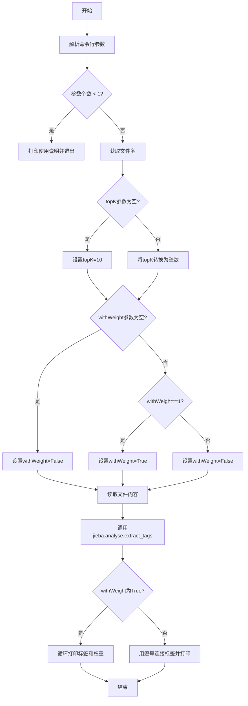
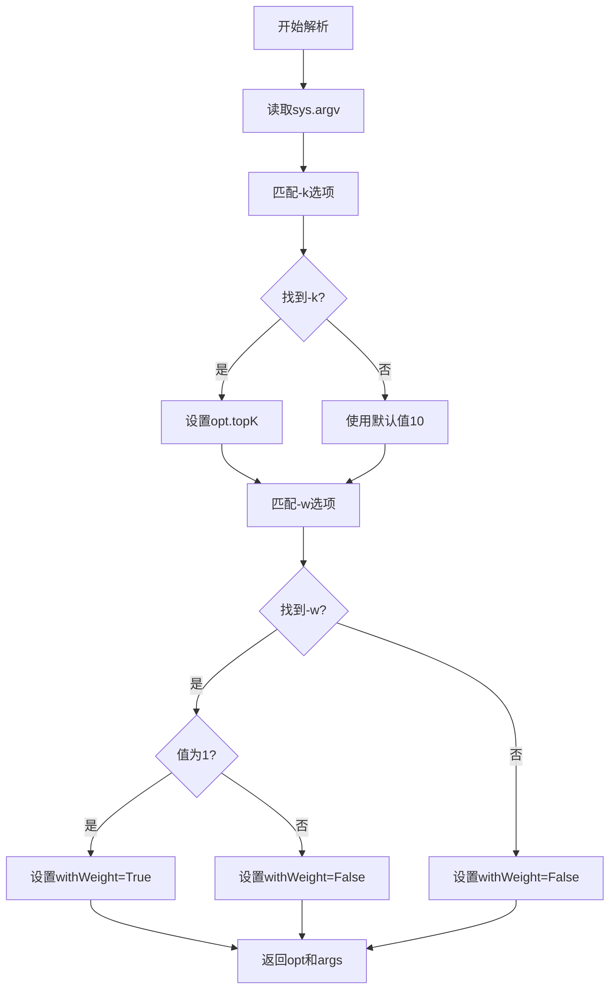
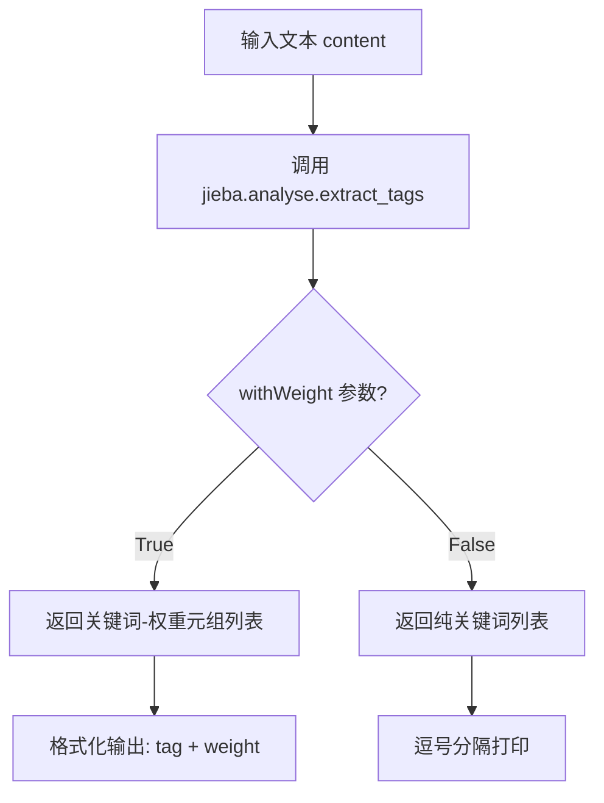

# `jieba\test\extract_tags_with_weight.py` 详细设计文档

这是一个基于jieba中文分词库的关键词提取命令行工具，用于从文本文件中提取TOP K个关键词，并可选地显示每个关键词的权重

## 整体流程



## 类结构

```
该脚本为过程式代码，无面向对象类结构
```

## 全局变量及字段


### `USAGE`
    
命令行使用说明字符串

类型：`str`
    


### `parser`
    
命令行选项解析器对象

类型：`OptionParser`
    


### `opt`
    
解析后的选项对象

类型：`Values`
    


### `args`
    
解析后的位置参数列表

类型：`list`
    


### `file_name`
    
输入文件名

类型：`str`
    


### `topK`
    
提取的关键词数量，默认为10

类型：`int`
    


### `withWeight`
    
是否显示权重，默认为False

类型：`bool`
    


### `content`
    
文件内容

类型：`bytes`
    


### `tags`
    
提取的关键词列表

类型：`list`
    


    

## 全局函数及方法


### `parser.parse_args()`

解析命令行参数，将用户输入的参数转换为程序可用的选项和参数值。

参数：此方法为无参数方法，通过 `sys.argv` 自动获取命令行输入

返回值：
- `opt`：包含解析后的选项值的对象（`parser.Values`类型），包含 `topK` 和 `withWeight` 属性
- `args`：剩余的位置参数列表（`list`类型），包含输入的文件名等非选项参数

#### 流程图



#### 带注释源码

```python
# 创建OptionParser实例，传入usage说明字符串
parser = OptionParser(USAGE)

# 添加-k选项，用于指定提取的标签数量
# dest="topK"表示将值存储在opt对象的topK属性中
parser.add_option("-k", dest="topK")

# 添加-w选项，用于指定是否显示权重
# dest="withWeight"表示将值存储在opt对象的withWeight属性中
parser.add_option("-w", dest="withWeight")

# 调用parse_args()方法解析命令行参数
# 该方法自动从sys.argv[1:]获取参数
# 返回值为元组(opt, args)
# opt: 包含解析后的选项值
# args: 包含位置参数列表
opt, args = parser.parse_args()

# 验证：确保至少提供了一个文件名作为位置参数
if len(args) < 1:
    print(USAGE)
    sys.exit(1)

# 从位置参数中获取文件名
file_name = args[0]

# 处理topK选项：如果未提供则使用默认值10
if opt.topK is None:
    topK = 10
else:
    # 将字符串转换为整数
    topK = int(opt.topK)

# 处理withWeight选项：如果未提供则默认为False
if opt.withWeight is None:
    withWeight = False
else:
    # 判断参数值是否为1
    if int(opt.withWeight) is 1:
        withWeight = True
    else:
        withWeight = False
```


### `jieba.analyse.extract_tags()`

这是 jieba 中文分词库提供的关键词提取函数，基于 TF-IDF 算法从文本内容中提取最重要的 topK 个关键词，可选择是否返回权重。

参数：

- `text`：`str` 或 `bytes`，待提取关键词的文本内容
- `topK`：`int`，返回权重最高的关键词数量，默认为 10
- `withWeight`：`bool`，是否返回关键词权重，默认为 False
- `allowPOS`：`tuple`，指定词性过滤（如 ('ns', 'n', 'vn')），默认为空表示不过滤
- `withFlag`：`bool`，是否返回词性标签，默认为 False

返回值：`list`，如果 `withWeight=False`，返回关键词列表（`list[str]`）；如果 `withWeight=True`，返回关键词-权重元组列表（`list[tuple[str, float]]`）

#### 流程图



#### 带注释源码

```python
# 导入必要的库
import sys
sys.path.append('../')  # 添加上级目录到 Python 路径

import jieba           # 中文分词库
import jieba.analyse   # 关键词提取模块
from optparse import OptionParser  # 命令行参数解析

# 定义使用说明
USAGE = "usage:    python extract_tags_with_weight.py [file name] -k [top k] -w [with weight=1 or 0]"

# 创建参数解析器
parser = OptionParser(USAGE)
# 添加 -k 参数: 指定提取的关键词数量
parser.add_option("-k", dest="topK")
# 添加 -w 参数: 指定是否显示权重 (1=显示, 0=不显示)
parser.add_option("-w", dest="withWeight")

# 解析命令行参数
opt, args = parser.parse_args()

# 检查是否提供了文件名参数
if len(args) < 1:
    print(USAGE)
    sys.exit(1)

# 获取文件名
file_name = args[0]

# 处理 topK 参数: 默认为 10
if opt.topK is None:
    topK = 10
else:
    topK = int(opt.topK)

# 处理 withWeight 参数: 默认为 False
if opt.withWeight is None:
    withWeight = False
else:
    # 注意: 这里使用 "is 1" 比较可能有问题, 建议用 "== 1"
    if int(opt.withWeight) is 1:
        withWeight = True
    else:
        withWeight = False

# 读取文件内容 (二进制模式)
content = open(file_name, 'rb').read()

# ===== 核心调用: extract_tags =====
# 使用 jieba 的 TF-IDF 算法提取关键词
tags = jieba.analyse.extract_tags(
    content,      # 待处理文本
    topK=topK,    # 提取数量
    withWeight=withWeight  # 是否带权重
)

# 根据 withWeight 标志格式化输出
if withWeight is True:
    # 输出格式: tag: 关键词    weight: 权重值
    for tag in tags:
        print("tag: %s\t\t weight: %f" % (tag[0], tag[1]))
else:
    # 逗号分隔输出所有关键词
    print(",".join(tags))
```

## 关键组件


### 命令行参数解析模块

负责解析用户输入的命令行参数，包括待处理文件名、topK数量和权重开关。使用Python的OptionParser类实现，提供-k和-w两个选项。

### 文件读取模块

以二进制模式读取指定文件的内容，将整个文件加载到内存中作为content变量供后续处理。

### jieba关键词提取模块

调用jieba.analyse.extract_tags方法进行关键词提取，接收content、topK和withWeight三个参数，返回提取的关键词列表。

### 输出格式化模块

根据withWeight标志位决定输出格式：带权重时逐行打印标签和权重值，不带权重时以逗号分隔打印所有标签。

### 参数校验与默认值模块

对命令行参数进行校验和默认值设置，topK默认为10，withWeight默认为False，并提供友好的使用说明信息。


## 问题及建议


### 已知问题

-   **资源未正确释放**：使用 `open(file_name, 'rb').read()` 打开文件后未关闭，可能导致资源泄漏
-   **使用已废弃的模块**：使用 `optparse` 模块，该模块自 Python 3.2 起已被废弃，应使用 `argparse` 替代
-   **错误的比较运算符**：使用 `is 1` 进行身份比较而非值比较，应使用 `== 1`
-   **缺乏异常处理**：未对文件读取、jieba 分析等操作进行 try-except 异常捕获
-   **文件编码未处理**：以二进制模式 `'rb'` 读取文件，对于中文文本处理不够恰当，可能导致编码问题
-   **sys.path 修改**：使用 `sys.path.append('../')` 修改系统路径不是最佳实践
-   **输入参数未验证**：未对 topK 负值、非数值输入等非法参数进行校验
-   **输出格式不一致**：带权重和不带权重的输出格式差异大，且格式化字符串使用制表符不够稳健

### 优化建议

-   使用上下文管理器 `with open(file_name, 'r', encoding='utf-8') as f: content = f.read()` 替代直接 open
-   将 `optparse` 替换为 `argparse`，提供更好的帮助信息和参数验证
-   将 `is 1` 修改为 `== 1` 进行值比较
-   添加 try-except 块捕获文件读取异常、jieba 异常等
-   指定文件编码为 UTF-8 以正确处理中文文本
-   使用相对导入或包管理方式替代 sys.path 修改
-   添加参数校验逻辑，如验证 topK > 0、文件是否存在等
-   统一输出格式，可考虑使用 JSON 格式输出以便其他程序调用
-   考虑添加日志记录功能而非仅使用 print 输出


## 其它


### 设计目标与约束

本工具的设计目标是提供一个简单易用的命令行接口，用于从中文文本中提取关键词。约束条件包括：输入必须为有效的文本文件路径，topK参数必须为正整数，withWeight参数必须为0或1。

### 错误处理与异常设计

- 文件不存在或无法读取：抛出FileNotFoundError，提示用户检查文件路径
- topK参数格式错误：使用int()转换，失败时抛出ValueError
- withWeight参数格式错误：使用int()转换，失败时抛出ValueError
- 参数缺失：打印Usage信息并以退出码1退出
- jieba库调用异常：向上抛出原始异常，便于调试

### 数据流与状态机

1. 初始化状态：解析命令行参数
2. 参数验证状态：检查topK和withWeight的合法性
3. 文件读取状态：读取输入文件内容到内存
4. 关键词提取状态：调用jieba.analyse.extract_tags进行提取
5. 结果输出状态：根据withWeight标志格式化输出结果
6. 结束状态：正常退出

### 外部依赖与接口契约

- jieba：中文分词库，依赖extract_tags函数
- Python标准库：sys、optparse用于命令行解析和文件操作
- 输入接口：命令行参数（文件路径、-k topK、-w withWeight）
- 输出接口：标准输出（stdout），格式为"tag: xxx weight: xxx"或逗号分隔的标签列表

### 性能考虑

- 文件读取使用二进制模式('rb')，避免编码问题
- 文件内容一次性读入内存，对于大文件可能存在内存压力
- jieba.analyse.extract_tags内部已实现TF-IDF算法优化
- 建议：对于超大文件，可考虑流式处理或分批处理

### 安全性考虑

- 文件路径直接使用args[0]，未做路径规范化或安全检查
- 建议：添加路径遍历检查，防止恶意路径输入
- 无用户输入 sanitization，jieba库本身处理文本安全性较高

### 配置管理

- topK默认值为10
- withWeight默认值为False
- 所有配置通过命令行参数传入，无配置文件支持

### 使用示例

```bash
# 提取10个关键词，不带权重
python extract_tags_with_weight.py article.txt

# 提取20个关键词，不带权重
python extract_tags_with_weight.py article.txt -k 20

# 提取10个关键词，带权重
python extract_tags_with_weight.py article.txt -w 1
```

### 扩展性考虑

- 可添加输出格式选项（JSON、XML等）
- 可添加自定义词典支持
- 可添加并行处理支持以提升大文件处理速度
- 可添加结果缓存机制避免重复计算
- 当前代码无类结构，未来可封装为类以提升可测试性和可维护性
    