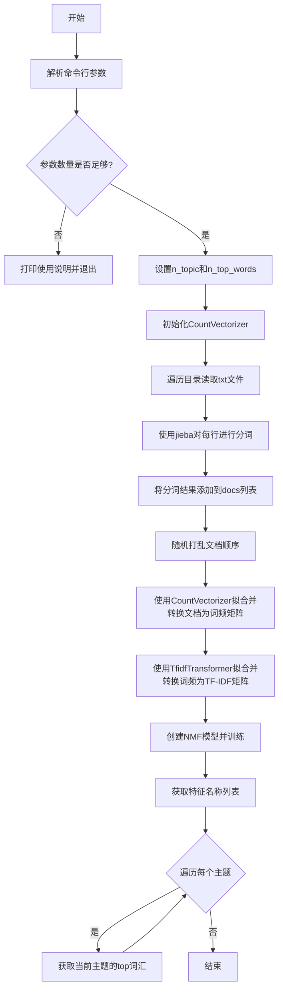

# `jieba\test\extract_topic.py` 详细设计文档

该脚本使用NMF（Non-negative Matrix Factorization）算法对中文文本进行主题建模，通过jieba分词、TF-IDF转换和NMF分解，从指定目录的文本文件中提取指定数量的主题词。

## 整体流程



## 类结构

```
无类结构（此代码为过程式脚本）
主要模块：
1. 参数解析模块
2. 文件读取与分词模块
3. 特征提取模块（CountVectorizer + TfidfTransformer）
4. 主题建模模块（NMF）
5. 结果输出模块
```

## 全局变量及字段


### `n_topic`
    
主题数量，默认值为10

类型：`int`
    


### `n_top_words`
    
每个主题的关键词数量，默认值为25

类型：`int`
    


### `count_vect`
    
用于将文本转换为词频矩阵的向量器

类型：`CountVectorizer`
    


### `docs`
    
存储分词后文档的列表

类型：`list`
    


### `pattern`
    
用于匹配txt文件的路径模式

类型：`str`
    


### `tfidf`
    
TF-IDF权重矩阵

类型：`sparse matrix`
    


### `nmf`
    
训练好的NMF模型

类型：`NMF`
    


### `feature_names`
    
特征名称列表，即所有文档中的词汇

类型：`list`
    


    

## 全局函数及方法


## 关键组件


### 命令行参数处理模块

负责解析运行时传入的参数，包括输入目录路径、主题数量n_topic和每个主题的关键词数量n_top_words，提供默认值并在参数不足时输出使用说明。

### 文本读取与预处理模块

使用glob.glob遍历指定目录下的所有.txt文件，读取每行作为独立文档，通过jieba.cut进行中文分词处理，最后使用random.shuffle打乱文档顺序以避免训练偏见。

### 特征向量化模块

使用sklearn的CountVectorizer将分词后的文档转换为词频矩阵，然后通过TfidfTransformer将词频矩阵转换为TF-IDF权重矩阵，用于后续的主题建模输入。

### NMF主题建模模块

使用sklearn的decomposition.NMF对TF-IDF矩阵进行非负矩阵分解，提取n_topic个主题，并从分解后的组件中获取每个主题的关键词列表。

### 主题词输出模块

将NMF组件矩阵与向量化器的特征名称进行映射，通过argsort获取每个主题权重最高的关键词，并格式化输出主题编号及对应的关键词列表。


## 问题及建议


### 已知问题

-   **缺少文件读取异常处理**：当文件不存在、权限不足或读取失败时，程序会直接崩溃，没有优雅的错误提示
-   **目录存在性未验证**：直接使用`sys.argv[1]`作为目录路径，未检查目录是否存在
-   **jieba分词异常无捕获**：分词过程可能因特殊字符或编码问题失败，缺乏异常处理
-   **内存溢出风险**：所有文档内容一次性加载到内存中，大型语料库会导致内存耗尽
-   **缺乏进度反馈**：处理大量文件时无进度提示，可能让用户误以为程序挂起
-   **硬编码的魔法数字**：`n_topic=10`、`n_top_words=25`作为默认参数，缺乏配置管理机制
-   **文档随机打乱影响可复现性**：`random.shuffle(docs)`直接修改原始顺序，导致相同输入可能产生不同结果
-   **导入语句顺序不规范**：标准库、第三方库、本地导入混在一起，未遵循PEP8规范
-   **变量命名不够清晰**：如`t0`等缩写命名可读性差，缺乏类型提示
-   **NMF训练无异常捕获**：主题模型训练可能因参数不当失败

### 优化建议

-   **添加完整的异常处理**：使用try-except包装文件读写、分词等可能失败的操作，提供有意义的错误信息
-   **验证输入参数**：检查目录是否存在、是否为有效路径，必要时给出使用说明
-   **实现增量处理或流式处理**：避免一次性加载所有文档到内存，使用生成器或分批处理
-   **添加日志和进度条**：使用`logging`模块替代print，引入`tqdm`显示处理进度
-   **支持配置外部化**：使用配置文件或命令行参数解析库（如argparse）管理默认参数
-   **设置随机种子**：如需可复现性，在shuffle前设置`random.seed()`
-   **遵循编码规范**：整理导入顺序，添加类型注解和文档字符串，改进变量命名
-   **模块化重构**：将核心功能提取为函数或类，提升可测试性和可维护性
-   **添加单元测试**：为关键函数编写测试用例，确保核心逻辑正确性

## 其它


### 设计目标与约束
本代码旨在从指定目录下的文本文件中自动提取主题，用于主题建模和文本分析。输入要求为UTF-8编码的文本文件，每行视为一个文档。约束包括：主题数量n_topic和关键词数量n_top_words必须为正整数；依赖Python 3.x及指定库；程序运行过程中需保证内存充足以处理文本向量化。

### 错误处理与异常设计
当前代码仅在参数不足时退出，未对文件读取、目录存在性等进行异常处理。若目录不存在或文件无权限，可能导致程序崩溃。建议增加异常捕获：使用try-except捕获文件读取异常（如FileNotFoundError, PermissionError），并提示用户；验证目录路径有效性；添加日志记录以调试。

### 数据流与状态机
数据流为线性过程：读取目录下的所有.txt文件 → 逐行分词（jieba.cut） → 构建词频向量（CountVectorizer） → TF-IDF变换（TfidfTransformer） → NMF主题分解（decomposition.NMF） → 输出每个主题的关键词。无状态机设计，流程顺序执行。

### 外部依赖与接口契约
外部依赖包括：scikit-learn（特征提取与分解）、jieba（中文分词）、glob与os（文件操作）、random（ shuffling）、time（计时）、sys（参数处理）。接口为命令行：extract_topic.py directory [n_topic] [n_top_words]，其中directory为必需参数，后两者可选，默认分别为10和25。

### 性能考虑
代码中random.shuffle(docs)在文档数量大时可能导致内存占用高；NMF分解计算复杂度较高，建议在数据量大时考虑降维或使用增量学习方法；TF-IDF向量化为稀疏矩阵，可优化内存；目前无批处理机制，建议对大文件分批读取。

### 安全性分析
代码直接使用命令行参数构建文件路径，存在路径遍历风险（如directory参数包含"../"可能访问目录外文件）。建议验证directory为绝对路径且在允许范围内；文件读取未做内容校验，可能读取恶意文件；无输入消毒。

### 配置与参数说明
参数包括：sys.argv[1] 为输入目录路径；sys.argv[2] 为主题数量n_topic，默认10；sys.argv[3] 为每主题关键词数n_top_words，默认25。其他配置如向量化参数（max_df, min_df）均使用默认值，未暴露给用户。

### 测试策略
单元测试：验证jieba分词输出为字符串；测试CountVectorizer和TfidfTransformer对模拟数据的转换；测试NMF分解输出维度正确。集成测试：使用样本文本目录运行，检查输出主题数量和关键词数量是否符合参数；对比不同n_topic的结果。

### 部署与运行环境
运行环境需Python 3.6+，安装依赖库：scikit-learn、jieba、numpy、scipy。部署时确保输入目录可访问，输出结果至标准输出。建议使用虚拟环境管理依赖，并提供requirements.txt。

    