# `jieba\test\jieba_test.py` 详细设计文档

这是一个针对jieba中文分词库的单元测试文件，通过unittest框架测试了jieba的多种分词模式，包括默认分词、全模式分词、搜索模式分词、词性标注以及tokenize等功能，同时验证了HMM模型开关对分词结果的影响。

## 整体流程

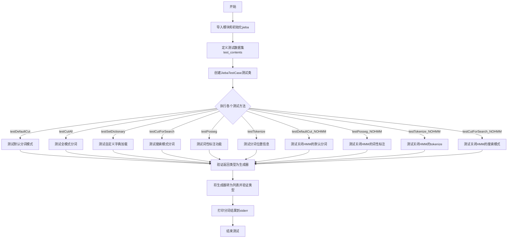

## 类结构

```
unittest.TestCase (Python标准库)
└── JiebaTestCase (自定义测试类)
    ├── setUp (测试前置方法)
    ├── tearDown (测试后置方法)
    ├── testDefaultCut (默认分词测试)
    ├── testCutAll (全模式分词测试)
    ├── testSetDictionary (自定义字典测试)
    ├── testCutForSearch (搜索模式分词测试)
    ├── testPosseg (词性标注测试)
    ├── testTokenize (分词位置测试)
    ├── testDefaultCut_NOHMM (无HMM默认分词测试)
    ├── testPosseg_NOHMM (无HMM词性标注测试)
    ├── testTokenize_NOHMM (无HMM分词位置测试)
    └── testCutForSearch_NOHMM (无HMM搜索模式测试)
```

## 全局变量及字段


### `test_contents`
    
用于测试 jieba 分词功能的多种中英文句子集合，包含约 100 条测试用例。

类型：`list`
    


    

## 全局函数及方法


### `JiebaTestCase.setUp`

这是unittest测试框架的标准setUp方法，在每个测试方法执行前自动调用。该方法通过重新加载jieba模块来确保每次测试都使用最新的词典和配置，避免因模块缓存导致的测试结果偏差。

参数：

- `self`：`unittest.TestCase`，表示测试用例实例本身，用于访问测试类的属性和方法

返回值：`None`，该方法不返回任何值，仅执行测试前置准备工作

#### 流程图

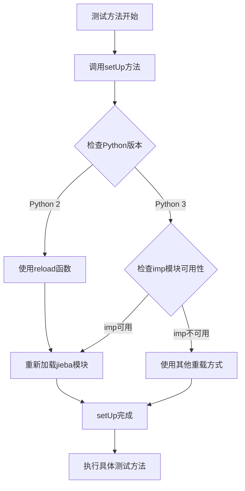

#### 带注释源码

```python
def setUp(self):
    """
    unittest测试框架的setUp方法，在每个测试用例执行前调用。
    作用：重新加载jieba模块以确保使用最新的词典配置。
    
    原因说明：
    1. jieba模块在首次导入时会加载词典到内存
    2. 如果在测试过程中修改了词典或配置，需要重新加载才能生效
    3. 避免因Python模块缓存导致的测试结果不一致
    """
    reload(jieba)  # 重新加载jieba模块，使其重新初始化词典和配置
```

#### 技术说明

| 项目 | 说明 |
|------|------|
| **调用时机** | 每个以`test`开头的方法执行前自动调用 |
| **依赖模块** | `jieba` 中文分词库 |
| **Python兼容性** | 代码中已处理Python 2和Python 3的差异（通过`from imp import reload`） |
| **潜在问题** | 每次测试都重新加载模块会增加测试执行时间，在大型测试套件中可能影响性能 |


### `JiebaTestCase.tearDown`

这是 `unittest.TestCase` 的 teardown 钩子方法，在每个测试方法执行完毕后被调用，用于清理测试环境。当前实现为空的占位符，未执行任何实际的清理工作。

参数：

-  `self`：`JiebaTestCase`（继承自 `unittest.TestCase`），表示当前正在销毁的测试用例实例。

返回值：`None`，本方法不返回任何值。

#### 流程图

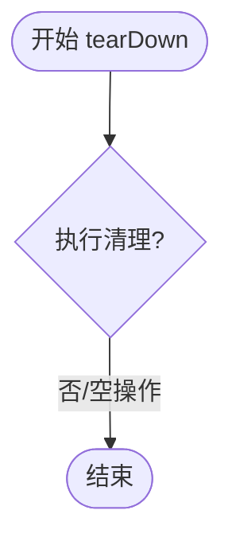

#### 带注释源码

```python
def tearDown(self):
    """
    测试用例的 teardown 钩子。
    在每个测试方法运行结束后被调用，用于释放资源或复原状态。
    当前实现为占位符，不执行任何清理工作。
    """
    pass  # 目前无需清理，后续可根据需要在此添加清理逻辑
```


### `JiebaTestCase.testDefaultCut`

该方法是 Jieba 分词库的测试用例，用于验证 jieba.cut 默认分词功能是否正确工作。它遍历预定义的测试文本列表，对每段文本进行分词，验证返回结果为生成器和列表类型，并将分词结果打印到标准错误输出。

参数：无需显式参数（实例方法自动接收 `self`）

返回值：`None`，该方法不返回任何值，仅执行测试逻辑并输出结果

#### 流程图

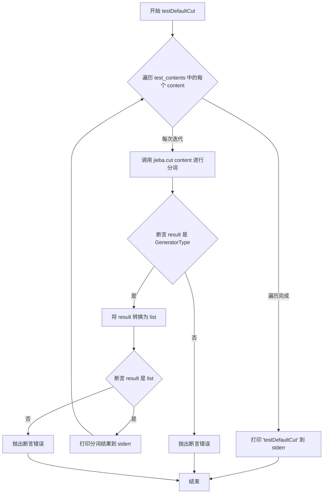

#### 带注释源码

```python
def testDefaultCut(self):
    """
    测试 jieba.cut 默认分词功能
    
    该方法遍历预定义的测试文本列表，对每段文本调用 jieba.cut 进行中文分词，
    验证返回值为生成器类型，转换为列表后验证类型正确，并将分词结果打印到标准错误流。
    """
    # 遍历所有测试文本内容
    for content in test_contents:
        # 调用 jieba.cut 进行默认模式分词（精确模式）
        # 返回一个生成器对象，包含分词后的词语
        result = jieba.cut(content)
        
        # 断言返回结果是生成器类型
        # 验证 jieba.cut 默认返回 GeneratorType
        assert isinstance(result, types.GeneratorType), "Test DefaultCut Generator error"
        
        # 将生成器转换为列表，以便进行后续验证和打印
        result = list(result)
        
        # 断言转换后的结果是列表类型
        assert isinstance(result, list), "Test DefaultCut error on content: %s" % content
        
        # 将分词结果用逗号和空格连接，打印到标准错误输出
        # 便于查看分词效果和调试
        print(" , ".join(result), file=sys.stderr)
    
    # 测试完成后打印方法名到标准错误输出
    # 作为测试执行的标记
    print("testDefaultCut", file=sys.stderr)
```


### `JiebaTestCase.testCutAll`

这是一个测试方法，用于验证 jieba 库的全模式分词功能（cut_all=True），遍历预定义的测试文本列表，对每个文本进行全模式分词，并验证返回结果的类型正确性。

#### 参数

- 无（除 `self` 外该方法不接受任何显式参数）

#### 返回值

- `None`，该方法为测试方法，不返回任何值

#### 流程图

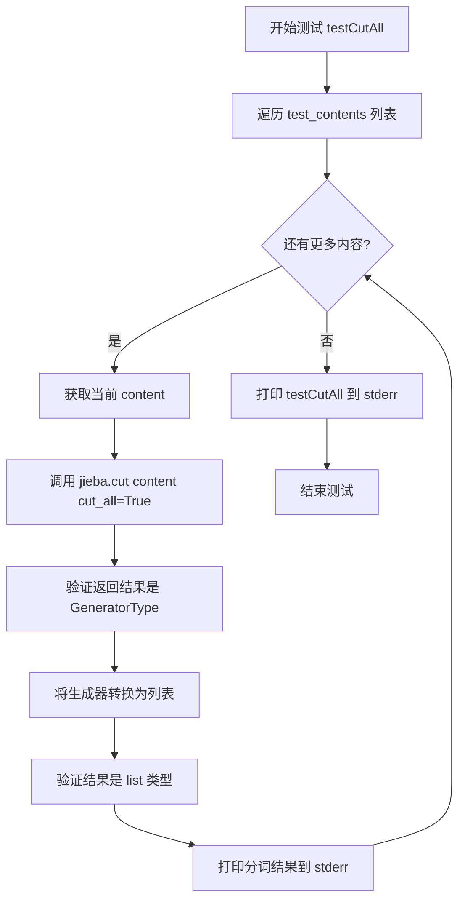

#### 带注释源码

```python
def testCutAll(self):
    """
    测试 jieba 全模式分词功能
    全模式会返回文本中所有可能的词的分词结果
    """
    # 遍历预定义的测试内容列表
    for content in test_contents:
        # 调用 jieba.cut 进行全模式分词
        # cut_all=True 表示使用全模式分词
        result = jieba.cut(content, cut_all=True)
        
        # 断言返回的是生成器类型
        # 确保 jieba.cut 返回的是生成器而非列表
        assert isinstance(result, types.GeneratorType), "Test CutAll Generator error"
        
        # 将生成器转换为列表
        # 全模式分词可能返回多个相同的词
        result = list(result)
        
        # 断言转换后的结果是列表类型
        assert isinstance(result, list), "Test CutAll error on content: %s" % content
        
        # 打印分词结果到标准错误输出
        # 使用逗号分隔每个分词结果
        print(" , ".join(result), file=sys.stderr)
    
    # 打印测试方法名称到标准错误输出
    # 标记测试完成
    print("testCutAll", file=sys.stderr)
```


### `JiebaTestCase.testSetDictionary`

该测试方法用于测试jieba分词库中设置自定义字典文件的功能。它首先调用`jieba.set_dictionary("foobar.txt")`设置自定义字典，然后遍历预定义的测试文本列表，对每条文本进行分词，并验证分词结果的类型是否正确（生成器和列表），同时将分词结果输出到标准错误流。

参数：

- `self`：`JiebaTestCase`，测试类实例本身，表示当前测试用例对象

返回值：`None`，该方法没有显式返回值，执行完成后自动结束

#### 流程图

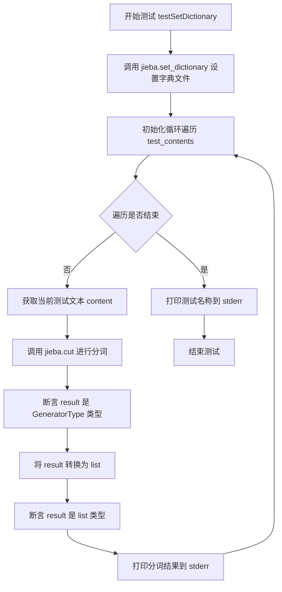

#### 带注释源码

```python
def testSetDictionary(self):
    """
    测试设置自定义字典文件后的分词功能
    """
    # 设置自定义字典文件为 "foobar.txt"
    jieba.set_dictionary("foobar.txt")
    
    # 遍历预定义的测试文本列表
    for content in test_contents:
        # 调用 jieba.cut 对文本进行分词，返回生成器
        result = jieba.cut(content)
        
        # 断言：验证返回结果是生成器类型
        assert isinstance(result, types.GeneratorType), "Test SetDictionary Generator error"
        
        # 将生成器转换为列表
        result = list(result)
        
        # 断言：验证转换后结果是列表类型
        assert isinstance(result, list), "Test SetDictionary error on content: %s" % content
        
        # 打印分词结果到标准错误输出
        print(" , ".join(result), file=sys.stderr)
    
    # 打印测试方法名称到标准错误输出
    print("testSetDictionary", file=sys.stderr)
```


### `JiebaTestCase.testCutForSearch`

该方法是Jieba分词库的单元测试用例，用于测试`jieba.cut_for_search`函数对中文文本进行搜索引擎友好的分词功能。方法遍历预定义的测试语料库，对每条文本调用分词接口，验证返回结果为生成器类型并能成功转换为列表，最后将分词结果打印到标准错误流。

参数：

- `self`：`unittest.TestCase`，测试类实例隐含参数，代表当前测试对象

返回值：`None`，该方法为测试方法，无返回值；通过断言验证分词结果的有效性，并通过`print`输出分词结果到`sys.stderr`

#### 流程图

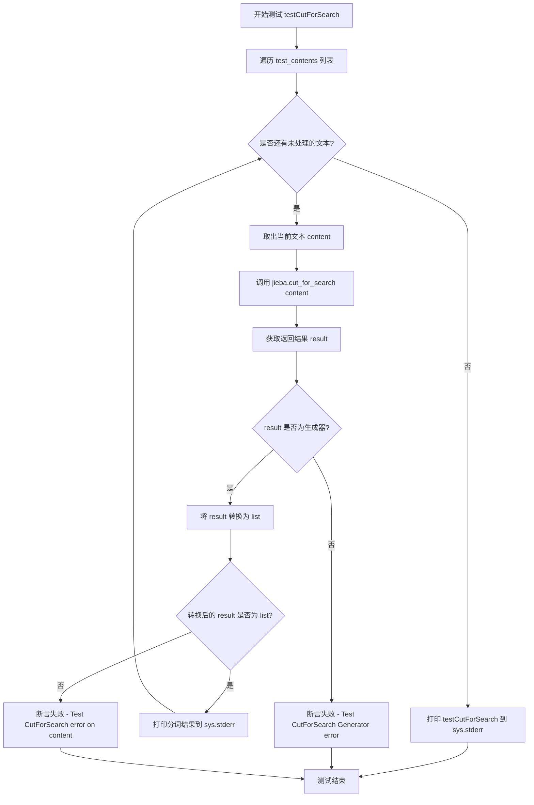

#### 带注释源码

```python
def testCutForSearch(self):
    """
    测试 jieba.cut_for_search 函数的分词功能
    该函数用于搜索引擎索引的全模式分词，会产生更细粒度的分词结果
    """
    # 遍历预定义的测试语料库列表
    for content in test_contents:
        # 调用 jieba 的搜索引擎分词接口，对文本进行分词
        result = jieba.cut_for_search(content)
        
        # 断言验证返回结果是生成器类型
        # cut_for_search 默认返回生成器对象以节省内存
        assert isinstance(result, types.GeneratorType), "Test CutForSearch Generator error"
        
        # 将生成器转换为列表，便于后续处理和验证
        result = list(result)
        
        # 断言验证转换后的结果是列表类型
        assert isinstance(result, list), "Test CutForSearch error on content: %s" % content
        
        # 将分词结果用逗号连接，以字符串形式打印到标准错误流
        # 便于在测试运行时观察分词效果
        print(" , ".join(result), file=sys.stderr)
    
    # 测试完成后打印测试名称到标准错误流，作为测试完成的标记
    print("testCutForSearch", file=sys.stderr)
```


### `JiebaTestCase.testPosseg`

该测试方法用于验证 jieba 库的词性标注分词功能（posseg），遍历预定义的测试文本列表，对每条文本进行词性标注分词，并检查返回结果是否为生成器和列表类型，同时将分词结果（词语和词性）输出到标准错误流。

参数： 无（仅包含 `self` 参数，用于访问测试类实例）

返回值：`None`，该方法为测试方法，无返回值

#### 流程图

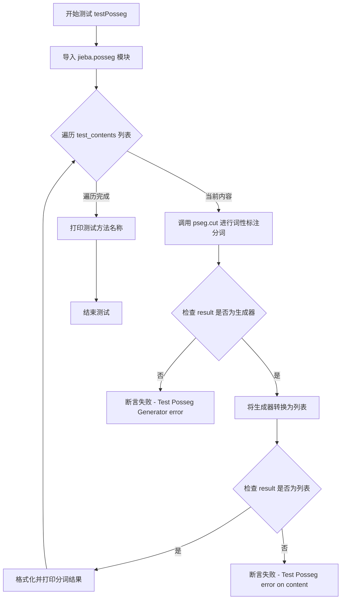

#### 带注释源码

```python
def testPosseg(self):
    """
    测试 jieba.posseg 模块的词性标注分词功能
    """
    # 导入 jieba 的词性标注模块 pseg
    import jieba.posseg as pseg
    
    # 遍历预定义的测试文本列表
    for content in test_contents:
        # 使用 pseg.cut 对文本进行词性标注分词，返回生成器
        result = pseg.cut(content)
        
        # 断言：验证返回结果是生成器类型
        assert isinstance(result, types.GeneratorType), "Test Posseg Generator error"
        
        # 将生成器转换为列表以便后续处理
        result = list(result)
        
        # 断言：验证转换后的结果是列表类型
        assert isinstance(result, list), "Test Posseg error on content: %s" % content
        
        # 格式化分词结果：将每个词的词语和词性拼接为 "word / flag" 格式
        # 然后用逗号分隔打印到标准错误流
        print(" , ".join([w.word + " / " + w.flag for w in result]), file=sys.stderr)
    
    # 测试完成后打印测试方法名称到标准错误流
    print("testPosseg", file=sys.stderr)
```


### `JiebaTestCase.testTokenize`

该方法是JiebaTestCase类的测试方法，用于测试jieba分词库的tokenize功能，对预设的测试语料进行分词，并验证返回结果为生成器类型且能正确解析出每个词的起始和结束位置。

参数：

- `self`：`JiebaTestCase`对象，隐含的实例参数，代表测试用例的自身引用

返回值：`None`，该方法为测试方法，无返回值，仅通过断言和打印进行验证

#### 流程图

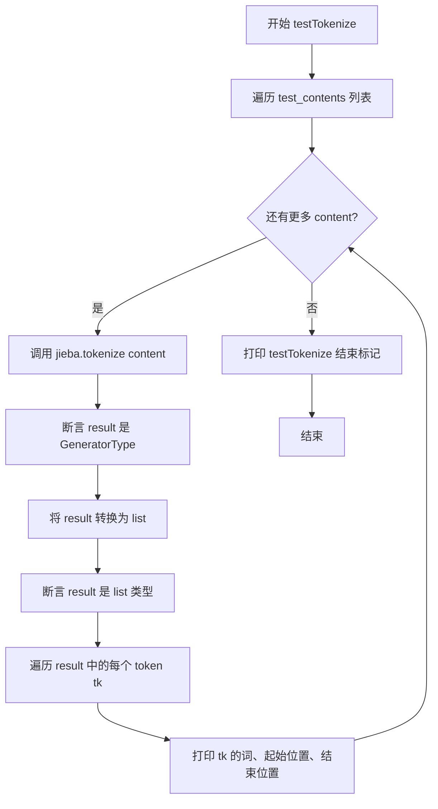

#### 带注释源码

```python
def testTokenize(self):
    """
    测试 jieba.tokenize 分词功能，验证返回结果为生成器，
    并正确输出每个词的起始和结束位置
    """
    # 遍历预设的测试语料列表
    for content in test_contents:
        # 调用 jieba.tokenize 进行分词，返回生成器对象
        result = jieba.tokenize(content)
        
        # 断言验证返回结果是生成器类型
        assert isinstance(result, types.GeneratorType), "Test Tokenize Generator error"
        
        # 将生成器转换为列表以便后续处理
        result = list(result)
        
        # 断言验证转换后的结果是列表类型
        assert isinstance(result, list), "Test Tokenize error on content: %s" % content
        
        # 遍历分词结果，提取每个词的详细信息
        for tk in result:
            # tk 为三元组 (word, start, end)
            # word: 分词结果
            # start: 词在原文中的起始位置
            # end: 词在原文中的结束位置
            print("word %s\t\t start: %d \t\t end:%d" % (tk[0],tk[1],tk[2]), file=sys.stderr)
    
    # 打印测试方法完成的标识信息
    print("testTokenize", file=sys.stderr)
```


### `JiebaTestCase.testDefaultCut_NOHMM`

该方法用于测试 jieba 分词库在关闭 HMM（隐马尔可夫模型）情况下的默认分词功能，遍历预定义的测试语料库，对每条文本进行分词并验证返回结果的类型是否符合生成器类型和列表类型。

参数：

- `self`：`JiebaTestCase`（实例本身），代表当前测试类的实例对象，用于访问类属性和方法

返回值：`None`，该方法为测试方法，不返回任何值，仅执行分词测试和断言验证

#### 流程图

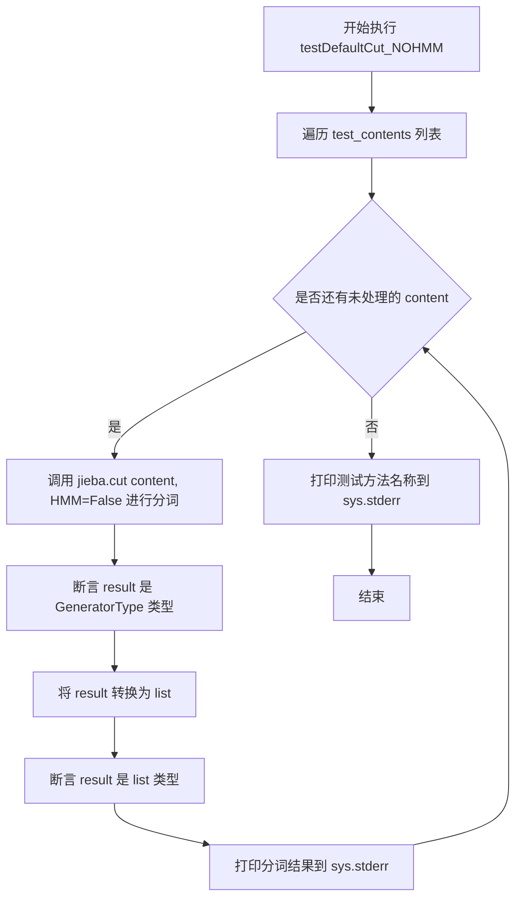

#### 带注释源码

```python
def testDefaultCut_NOHMM(self):
    """
    测试 jieba.cut 在关闭 HMM 模式下的默认分词功能
    
    该测试方法遍历预定义的测试语料库（test_contents），
    对每条文本使用 jieba.cut(content, HMM=False) 进行分词，
    验证返回结果为生成器类型，转换为列表后验证其类型正确性，
    并将分词结果输出到标准错误流。
    """
    # 遍历所有测试文本内容
    for content in test_contents:
        # 调用 jieba 分词，HMM=False 表示关闭隐马尔可夫模型
        # 返回一个生成器对象
        result = jieba.cut(content, HMM=False)
        
        # 断言验证返回结果是生成器类型
        # 如果不是生成器则抛出 AssertionError
        assert isinstance(result, types.GeneratorType), \
            "Test DefaultCut Generator error"
        
        # 将生成器转换为列表以便验证和打印
        result = list(result)
        
        # 断言验证转换后的结果是列表类型
        assert isinstance(result, list), \
            "Test DefaultCut error on content: %s" % content
        
        # 将分词结果用逗号和空格连接，打印到标准错误流
        print(" , ".join(result), file=sys.stderr)
    
    # 测试完成后打印方法名称到标准错误流
    print("testDefaultCut_NOHMM", file=sys.stderr)
```


### `JiebaTestCase.testPosseg_NOHMM`

该方法用于测试 jieba 分词库在关闭 HMM（隐马尔可夫模型）情况下的词性标注功能，遍历预设的测试语料库，对每条文本进行分词并验证返回结果的数据类型是否正确，同时将分词结果按“词语/词性”的格式输出到标准错误流。

参数： 无（仅包含 `self` 参数用于访问类实例）

返回值：`None`，该方法为测试方法，无显式返回值，仅执行断言和打印操作

#### 流程图

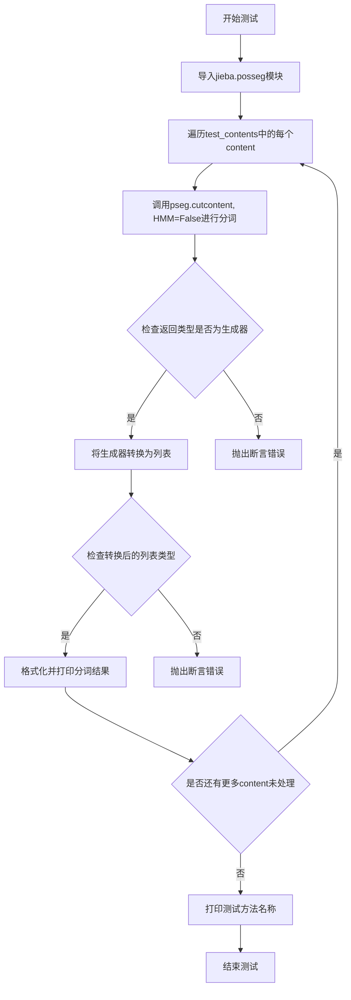

#### 带注释源码

```python
def testPosseg_NOHMM(self):
    # 导入jieba的词性标注模块pseg
    import jieba.posseg as pseg
    
    # 遍历预定义的测试内容列表
    for content in test_contents:
        # 使用pseg.cut进行分词，HMM=False表示关闭隐马尔可夫模型
        result = pseg.cut(content, HMM=False)
        
        # 断言：验证cut方法返回的是生成器类型
        assert isinstance(result, types.GeneratorType), "Test Posseg Generator error"
        
        # 将生成器转换为列表以便后续处理
        result = list(result)
        
        # 断言：验证转换后的结果是列表类型
        assert isinstance(result, list), "Test Posseg error on content: %s" % content
        
        # 格式化分词结果：将每个词的词语和词性用" / "连接
        # 然后用" , "连接所有分词结果，打印到标准错误流
        print(" , ".join([w.word + " / " + w.flag for w in result]), file=sys.stderr)
    
    # 测试完成后，打印测试方法名称到标准错误流
    print("testPosseg_NOHMM", file=sys.stderr)
```


### `JiebaTestCase.testTokenize_NOHMM`

该方法为 `JiebaTestCase` 类中的测试用例，用于验证 jieba 分词库的 `tokenize` 函数在关闭 HMM（隐马尔可夫模型）时的分词效果，检验返回类型为生成器，并输出每个词语的起始和结束位置信息。

参数：

- `self`：隐式参数，`unittest.TestCase` 实例方法的标准参数，代表测试用例的当前实例

返回值：`None`，该方法为测试用例，执行断言和打印操作，无返回值

#### 流程图

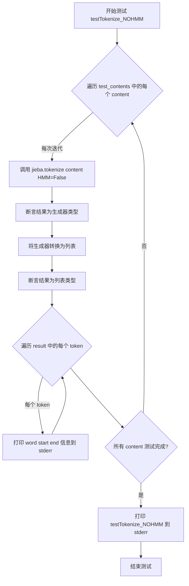

#### 带注释源码

```python
def testTokenize_NOHMM(self):
    # 遍历预定义的测试内容列表 test_contents
    for content in test_contents:
        # 调用 jieba.tokenize 方法进行分词，HMM=False 表示关闭隐马尔可夫模型
        # 返回一个生成器对象，包含 (词语, 起始位置, 结束位置) 的元组
        result = jieba.tokenize(content, HMM=False)
        
        # 断言返回结果是生成器类型，用于验证 jieba.tokenize 接口正确返回生成器
        assert isinstance(result, types.GeneratorType), "Test Tokenize Generator error"
        
        # 将生成器转换为列表，便于后续处理和断言验证
        result = list(result)
        
        # 断言转换后的结果是列表类型
        assert isinstance(result, list), "Test Tokenize error on content: %s" % content
        
        # 遍历分词结果中的每个 token（为元组: (词语, 起始位置, 结束位置)）
        for tk in result:
            # 打印每个词语及其起始和结束位置到标准错误输出
            # tk[0] 为词语, tk[1] 为起始位置, tk[2] 为结束位置
            print("word %s\t\t start: %d \t\t end:%d" % (tk[0], tk[1], tk[2]), file=sys.stderr)
    
    # 所有测试内容完成后，打印测试用例名称到标准错误输出
    print("testTokenize_NOHMM", file=sys.stderr)
```


### `JiebaTestCase.testCutForSearch_NOHMM`

该方法是JiebaTestCase类中的一个测试用例，用于测试jieba分词库的cut_for_search方法在禁用HMM（隐马尔可夫模型）情况下的分词效果。方法遍历预定义的测试文本列表，对每条文本调用jieba.cut_for_search函数（传入HMM=False参数），验证返回结果是否为生成器类型，然后将生成器转换为列表并验证是否为列表类型，最后将分词结果打印到标准错误输出。

参数：

- `self`：`JiebaTestCase`，unittest测试用例的实例对象，表示当前测试类本身

返回值：`None`，该方法为测试用例方法，没有显式返回值，通过断言和打印语句进行验证

#### 流程图

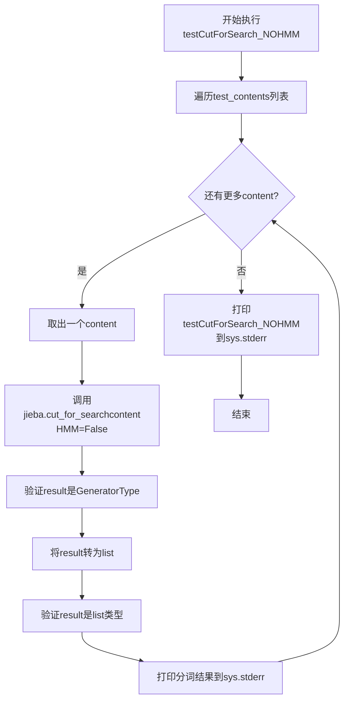

#### 带注释源码

```python
def testCutForSearch_NOHMM(self):
    """
    测试jieba.cut_for_search函数在禁用HMM模式下的分词功能
    该测试用例验证分词结果返回正确的类型并输出分词结果
    """
    # 遍历预定义的测试内容列表
    for content in test_contents:
        # 调用jieba的cut_for_search方法，HMM=False表示禁用隐马尔可夫模型
        result = jieba.cut_for_search(content, HMM=False)
        
        # 断言验证返回结果是生成器类型
        assert isinstance(result, types.GeneratorType), "Test CutForSearch Generator error"
        
        # 将生成器转换为列表以便进行后续验证和打印
        result = list(result)
        
        # 断言验证转换后的结果是列表类型
        assert isinstance(result, list), "Test CutForSearch error on content: %s" % content
        
        # 将分词结果用逗号连接并打印到标准错误输出
        print(" , ".join(result), file=sys.stderr)
    
    # 测试完成后打印测试方法名称到标准错误输出
    print("testCutForSearch_NOHMM", file=sys.stderr)
```

## 关键组件


### jieba中文分词核心引擎

jieba是一个强大的中文分词库，支持精确模式、全模式、搜索引擎模式等多种分词方式，并集成HMM模型用于新词识别，支持词性标注和token位置信息获取。

### 单元测试框架（unittest）

使用Python的unittest框架构建自动化测试用例，对jieba的各个分词功能进行系统性的回归测试，确保分词结果的正确性和稳定性。

### 测试数据集合（test_contents）

包含超过80条覆盖各种中文语言现象的测试语料，涵盖中文分词歧义处理、新词识别、专名识别、混合语言等典型场景。

### 默认分词模式（jieba.cut）

支持精确模式中文分词，返回生成器以实现惰性加载和张量索引优化，节省内存开销。可通过HMM参数控制是否启用隐马尔可夫模型进行新词发现。

### 全文分词模式（cut_all=True）

全模式分词，输出所有可能的词语组合，适用于需要最大召回率的搜索场景，返回生成器实现内存优化。

### 搜索引擎分词模式（jieba.cut_for_search）

在精确分词基础上进一步切分长词为多个子词，提升搜索引擎召回率，返回生成器实现惰性加载。

### 词性标注分词（jieba.posseg.cut）

集成词性标注功能，同时输出词语及其词性标签（词性标记），支持HMM模型开关控制。

### 分词位置信息（jieba.tokenize）

返回每个分词结果的起止位置（start, end），支持精确的文本位置定位功能，返回生成器。

### 动态字典加载（jieba.set_dictionary）

支持运行时动态加载自定义词典，用于补充专业术语或领域词汇，增强分词准确性。

### 隐马尔可夫模型（HMM）

内置HMM模型用于识别未登录词（新词发现），可通过HMM=False参数禁用，适用于已知词典覆盖度高的场景。


## 问题及建议


### 已知问题

-   **Python 2兼容代码遗留**：使用了`from __future__ import unicode_literals`和`if sys.version_info[0] > 2: from imp import reload`，这些是Python 2时代的兼容性代码，在Python 2已停止支持的今天已成为技术债务
-   **废弃模块使用**：使用`imp`模块的`reload`函数，该模块在Python 3.4+已被废弃，应使用`importlib.reload`
- **硬编码测试数据**：`test_contents`列表包含大量测试用例直接写在代码中，缺乏数据驱动测试设计，不利于维护和扩展
- **字典文件路径硬编码且未验证**：`testSetDictionary`中使用硬编码的"foobar.txt"，该文件可能不存在且代码未做检查，会导致测试失败
- **重复代码模式**：多个测试方法（testDefaultCut、testCutAll、testCutForSearch等）包含几乎相同的遍历和断言逻辑，违反DRY原则
- **缺少异常处理**：未对jieba初始化失败、文件不存在等异常情况进行捕获处理
- **日志输出不规范**：使用`print(file=sys.stderr)`而非标准logging模块，不利于日志管理和级别控制
- **generator直接转换list**：在测试中先将generator转为list再验证类型，逻辑冗余，可直接在generator层面验证
- **未使用参数化测试**：相同模式的测试应使用unittest的参数化功能减少代码量
- **HMM参数测试覆盖不完整**：有testDefaultCut_NOHMM但缺少testCutAll_NOHMM的测试覆盖

### 优化建议

-   移除Python 2兼容代码，使用`importlib.reload`替代`imp.reload`
-   将测试数据抽取到外部JSON/YAML配置文件，实现数据与代码分离
-   创建辅助函数封装重复的验证逻辑（如generator检查、结果转list）
-   在`testSetDictionary`中添加文件存在性检查或使用临时文件
-   使用`unittest.subTest`或第三方库`pytest-parametriz`进行参数化测试
-   引入logging模块替代print输出，配置合理的日志级别
-   补充边界条件测试（空字符串、None、超长文本等）
-   补充缺失的HMM测试用例以实现完整覆盖
-   考虑使用pytest框架获得更强大的参数化和fixture支持

## 其它


### 设计目标与约束

本测试套件旨在全面验证jieba中文分词库的核心功能，包括默认分词、全模式分词、搜索模式分词、词性标注以及tokenize等关键功能。测试覆盖Python 2和Python 3兼容性，支持HMM（隐马尔可夫模型）启用和禁用两种模式，确保分词结果的正确性和稳定性。

### 错误处理与异常设计

测试用例使用assert语句进行结果验证，确保返回类型为生成器类型（types.GeneratorType）和列表类型（list）。当分词结果类型不正确时，抛出AssertionError并附带错误信息。测试通过stderr输出分词结果，便于调试和日志记录。

### 数据流与状态机

测试数据通过test_contents列表提供，涵盖多种中文分词场景：普通句子、混合中英文、专业术语、人名、地名、机构名、网络用语等。每个测试方法遍历全部测试数据，调用相应的jieba函数进行处理，验证输出结果。

### 外部依赖与接口契约

本测试依赖jieba库本身、Python标准库（unittest、types、sys）以及jieba.posseg模块。接口契约包括：jieba.cut()返回生成器、jieba.cut_for_search()返回生成器、jieba.tokenize()返回生成器、pseg.cut()返回生成器，所有生成器可转换为词列表或(word, start, end)元组列表。

### 性能要求与基准测试

测试未包含明确的性能基准，但通过大量多样化测试用例验证分词效率。测试数据包含110+条不同类型的中文句子，可作为性能测试的参考数据集。

### 安全考虑

测试代码仅涉及文本处理，无用户输入、无网络请求、无敏感数据操作。测试环境安全，无需特殊安全措施。

### 可扩展性与未来改进

当前测试缺少：大规模性能测试、多线程并发测试、内存泄漏检测、自定义词典边界 case 测试、Unicode 全部平面支持测试、多语言混合分词测试。建议后续添加边界值测试、异常输入测试、回归测试套件。

### 测试覆盖范围

覆盖10个主要测试场景，包括：默认分词、全模式分词、搜索模式分词、词性标注、tokenize位置信息、自定义词典设置、HMM启用/禁用组合。覆盖多种语言现象：中文分词、英文单词、数字组合、人名、地名、机构名、专业术语、网络用语、混合语言。

    